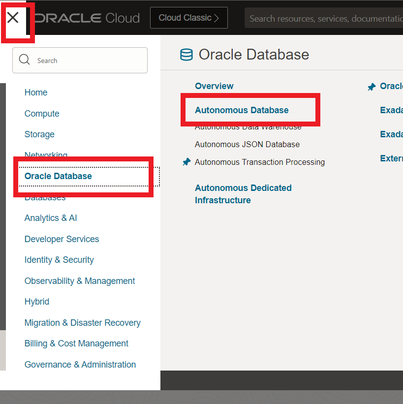
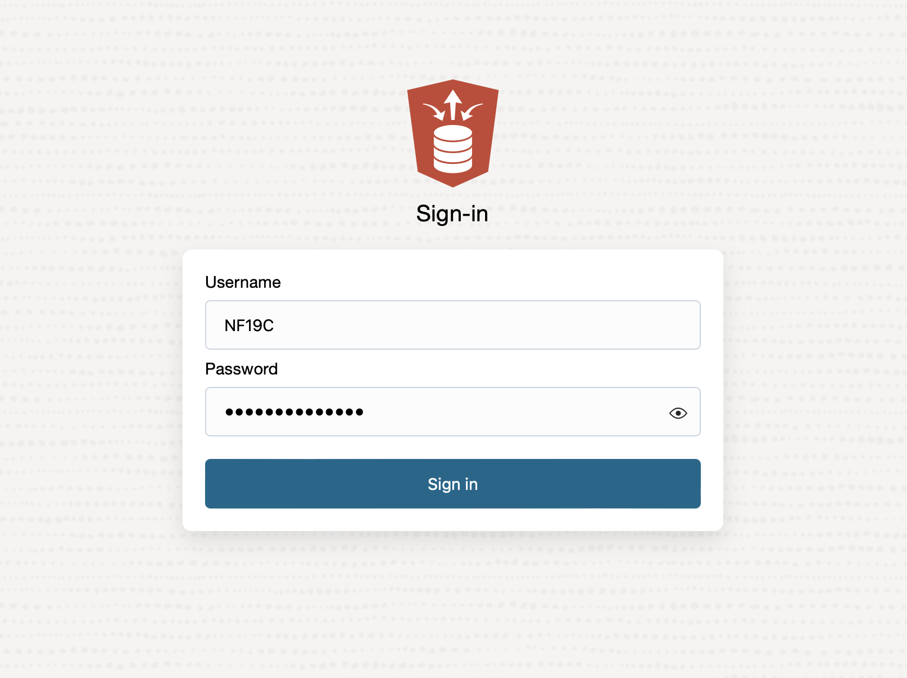
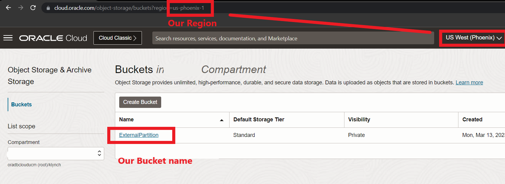
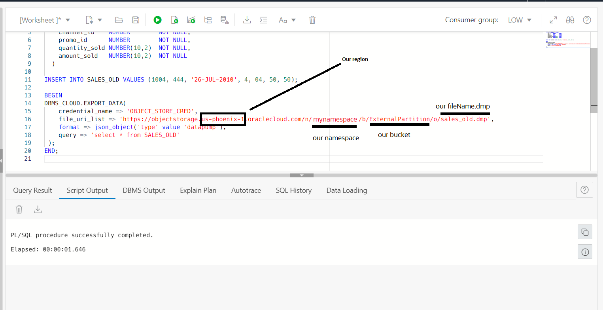
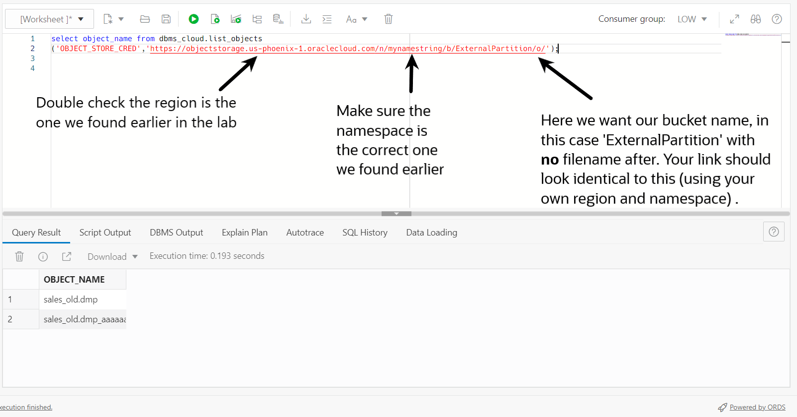
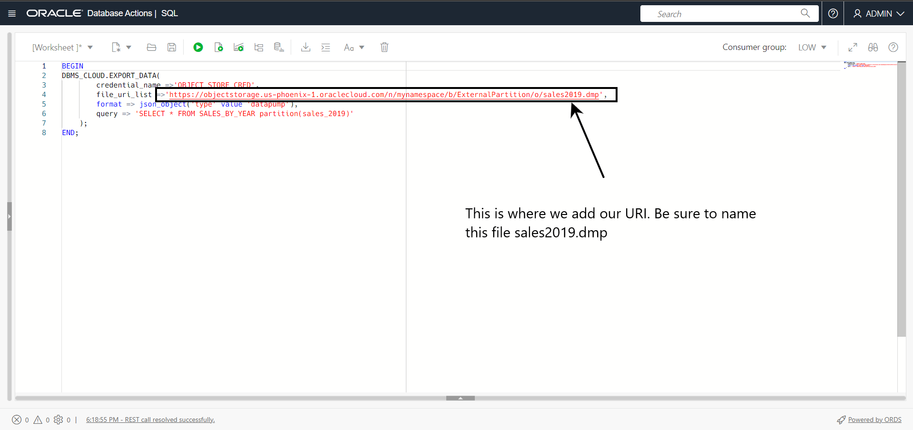

# Hybrid Partitioning

## Introduction

In this lab, you will explore Hybrid Partitioning, a new feature introduced in Oracle Database 19c.

Estimated Lab Time:  30 minutes

Watch the video below for a quick walk through of the lab.

[Hybrid Partitioning](videohub:1_2pkskut1)

### About Partitioning

Partitioning can provide tremendous benefit to a wide variety of applications by improving performance, manageability, and availability. It is not unusual for partitioning to greatly improve the performance of certain queries or maintenance operations. Moreover, partitioning can greatly simplify common administration tasks.

Partitioning also enables database designers and administrators to solve some difficult problems posed by cutting-edge applications. Partitioning is a key tool for building multi-terabyte systems or systems with extremely high availability requirements.

### About Hybrid Partitioning

The Hybrid Partition Tables feature extends Oracle Partitioning by enabling partitions to reside in both Oracle Database segments and in external files and sources. This feature significantly enhances the functionality of partitioning for any situation where large portions of a table can reside in external partitions.

Hybrid Partition Tables enable you to easily integrate internal partitions and external partitions into a single partition table. With this feature, you can also easily move non-active partitions to external files, such as Oracle Data Pump files, for a cheaper storage solution.
Partitions of hybrid partitioned tables can reside on both Oracle tablespaces and external sources, such as Linux files with comma-separated values (CSV) records or files on Hadoop Distributed File System (HDFS) with Java server. Hybrid partitioned tables support all existing external table types for external partitions: ORACLE\_DATAPUMP, ORACLE\_LOADER, ORACLE\_HDFS, ORACLE\_HIVE. External table types for external partitions use the following access driver types:
   - ORACLE\_DATAPUMP
   - ORACLE\_LOADER
   - ORACLE\_HDFS
   - ORACLE\_HIVE

This lab is a high level overview of Hybrid partitioning. For an in depth Hybrid partitioning lab, see the 'Learn More" section at the bottom and follow the link.


### Prerequisites

This lab assumes you have completed the following labs:

* Have an Autonomous Database provisioned.
* Have completed the 19C Setup Lab

## Task 1: Set up the environment

To set the stage, our fictitious company Oracle MovieStreams only needs to keep the last 2 years worth of merchandise sales data internally. Today is the day they go through and exchange the 3-year-old data to an external source. We will be exchanging our 2019 internal partition to an external table located in Oracle's Object Storage.

First, we will create an empty Object Storage bucket as our external partition.

1. Using the OCI Console Menu, go to **Storage > Object Storage & Archive Storage**.

  
2. Press **Create Bucket**.

  
3. On the page Create Bucket, fill in the following entries, otherwise leave defaults:

    - Bucket Name: **ExternalPartition**

4. Press **Create**.

   

    In order to use the Bucket we just created, we need to create the proper credentials.
    
5. Click the user profile icon in the top right of the screen and select your full username (the first option under the profile drop down).

   

6.  First **copy** the **full username** somewhere you can access in a later step. For example, the full username could look something like oraclecloudservice/yourEmail@email.com. Once the username has been copied, select **Auth Tokens** under the Resources located on the bottom left of the screen and select **Generate Token**.

   

7. Let's name our token **HPL** (short for Hybrid Partitioning Lab) under the Description and press **Generate Token**. 

8. Here you need to **copy** this token as it will not be shown again. You can press Show or Copy and save this somewhere you will have access to it later (a .txt file on  your desktop will work fine).

   

9. Before you close the generated token popup window, make sure you've copied the token somewhere you can access later. Next, press **Close**.


## Task 2: Create the Credentials

First, we're going to navigate back to the Autonomous Database and open SQL Developer Web. We need to make sure we are signed in as the NF19C user. Either switch to the Database Actions browser tab or follow the instructions below to sign in.

1. Click the hamburger menu in the top left and select **Oracle Database** and **Autonomous Database**.

  

2. Select the Database you created in the earlier labs and select **Database Users**.
  
   


3. Log into Database Actions as the NF19C user.
	
	
  
3. Wait for the new tab to open and select the SQL tile.

  


4. The first thing we will need to do is create our credentials in order to access our Object Storage bucket from our Autonomous Database. Using the SQL Developer Web, copy and run the following statements. Note, the DBMS_CLOUD command, you will need the username and token that we copied in the lab above. The credential and token **need to be in single quotes** ''.


    ```
    <copy>
    SET DEFINE OFF;
    </copy>
    ```
    ```
    <copy>
    BEGIN
  DBMS_CLOUD.CREATE_CREDENTIAL(
    credential_name => 'OBJECT_STORE_CRED',
    username => 'your full database username that you took note of earlier',
    password => 'the token you took note of earlier'
  );
  END;
    </copy>
    ```
    ```
    <copy>
    alter database property set default_credential = 'NF19C.OBJECT_STORE_CRED';
    </copy>
    ```
     ```
    <copy>
    select owner, credential_name, enabled from dba_credentials where credential_name = 'OBJECT_STORE_CRED';
    </copy>
    ```

    The alter statement may show an unexpected symbol icon, as shown in the image. This is okay as we are altering the database property to the new credentials we just created. Run each statement individually.

    

    > **Note**: If you are having an issue creating the credentials, you can use the command BEGIN
   DBMS\_CLOUD.DROP\_CREDENTIAL('OBJECT\_STORE\_CRED');
END; to drop the credentials and start the process again.


## Task 3: Build the External Table

You can convert a table with only internal partitions to a hybrid partitioned table. For example, you can convert any table to a hybrid partitioned table by adding external partition attributes using an ALTER TABLE command, then add external partitions. Note that at least one partition must be an internal partition. However, in this lab we will focus on how easy it is to utilize the EXCHANGE functionality which allows users to move data between internal and external partitions for cost-effective purposes.

First, let's create some external files.  The external partitions will be stored in object storage as a dump file using EXPORT_DATA

1.  **Double check you are signed in as the NF19C user**. Create a table to export. We will first drop the table SALES\_OLD in case there is already a table with this name. We can skip this if you don't have a Sales_old table 

    ```
    <copy>
    DROP TABLE Sales_old;
    </copy>
    ```
2. Now we will create our table and insert a row of data.

    ```
    <copy>
    CREATE TABLE SALES_OLD
  ( prod_id  NUMBER     NOT NULL,
    cust_id       NUMBER        NOT NULL,
    time_id       DATE          NOT NULL,
    channel_id    NUMBER        NOT NULL,
    promo_id      NUMBER        NOT NULL,
    quantity_sold NUMBER(10,2)  NOT NULL,
    amount_sold   NUMBER(10,2)  NOT NULL
  );
    </copy>
    ```
    ```
    <copy>
    INSERT INTO SALES_OLD VALUES (1001, 111, '26-JUL-2010', 1, 01, 50, 50);
    </copy>
    ```
3. Now we will export our data to object storage. In order to do this we need to **locate some information**. Our URI variable will be our link to object storage and will look something like this https://objectstorage.**region**.oraclecloud.com/n/**namespace-string**/b/**bucket**/o/yourFileName.dmp. What we need to locate is the bold above. The region, our namespace, and our bucket name. Once we locate this information, **let's save our https link on a text file, or somewhere it can be easily accessed for the upcoming steps.**

    You can find your region and bucket name by using the Oracle Cloud Console and locating your bucket. If you need a re-fresher on how to find object storage, use the task 1 above or from the OCI console got to -> Hamburger menu -> Storage -> Object Storage & Archive Storage.
    

    To find our namespace string, **click the user profile icon in the top right-hand corner** of the screen and select the tenancy name. The Object storage namespace will be displayed. See picture below for reference.
   

    Now **you need to update your file uri list** to look something like the code snippet below. Notice, we will call our external dump file 'sales_old.dmp'. 
  


    ```
    <copy>
    BEGIN
DBMS_CLOUD.EXPORT_DATA(
    credential_name => 'OBJECT_STORE_CRED',
    file_uri_list => 'https://objectstorage.us-phoenix-1.oraclecloud.com/n/mynamespace/b/ExternalPartition/o/sales_old.dmp',
    format => json_object('type' value 'datapump'),
    query => 'select * from SALES_OLD'
 );
END;

    </copy>
    ```
   

4.  To check our object storage bucket, we can follow these steps. First, we'll need the file\_uri\_list we used earlier, but **without** the file name. We can simply copy the URI we used before and remove the "sales\_old.dmp" part. This will give us the base path for our bucket, which we can use to navigate to other files within the same directory.

    ```
    <copy>
SELECT object_name FROM DBMS_CLOUD.LIST_OBJECTS('OBJECT_STORE_CRED','LINK FROM ABOVE WITHOUT SALES_OLD.DMP');

    </copy>
    ```

    > **Note**: If you get an error here, double and triple check the region, namespace, and bucket name. You want to use the URI that you saved earlier (step 3 above) and **remove** the sales_old.dmp. We want the link to end with the .../o/' See picture below for an example

    

  
5. Finally, we'll drop the internal Sales\_old table that we created earlier so that it only exists as an external file in Object Storage. This will ensure that we don't have any redundant data in our database and will allow us to seamlessly query the data from its new external location.

    ```
    <copy>
    DROP TABLE Sales_old
    </copy>
    ```


## Task 4: Implement Hybrid Partition Tables

Now that we have data in an external location, in our case Object Storage, we are going to create a hybrid partitioned table called Sales\_by\_year. We will have one partition pointing to the data in our Object Storage bucket, and 3 internal partitions for years 2019, 2020 and 2021.


Hybrid Partitioned Tables support many partition level operations, including:
-	Creating a single level RANGE and LIST partitioning methods
-   Using ALTER TABLE .. DDLs such as ADD, DROP and RENAME partitions
-   Modifying for external partitions the location of the external data sources at the partition level
-   Altering an existing partitioned internal table to a hybrid partitioned table containing both internal and external partitions
-   Changing the existing location to an empty location resulting in an empty external partition
-   Creating global partial non-unique indexes on internal partitions
-	Creating materialized views that include external partitions in QUERY\_REWRITE\_INTEGRITY stale tolerated mode only
-	Full partition wise refreshing on external partitions
-   DML trigger operations on a hybrid partitioned table on internal partitions

1. First, we will create our Hybrid Partitioned table. **Make sure you update the external location to YOUR bucket**. Your ''URI'' will go in the middle of the 2 sets of single quotes. See the picture below the code box if needed. **You will use the location of our Sales_old.dmp** file that you made note of earlier as the external location. 

  


    ```
    <copy>

    BEGIN
    DBMS_CLOUD.CREATE_HYBRID_PART_TABLE(
        table_name =>'SALES_BY_YEAR',
        credential_name =>'OBJECT_STORE_CRED',
        format => json_object('type' value 'datapump'),
        column_list => 'PROD_ID NUMBER NOT NULL ENABLE, 
                            CUST_ID NUMBER NOT NULL ENABLE, 
                            TIME_ID DATE NOT NULL ENABLE, 
                            CHANNEL_ID NUMBER NOT NULL ENABLE, 
                            PROMO_ID NUMBER NOT NULL ENABLE, 
                            QUANTITY_SOLD NUMBER(10,2) NOT NULL ENABLE, 
                            AMOUNT_SOLD NUMBER(10,2) NOT NULL ENABLE',
        partitioning_clause => 'PARTITION BY RANGE (TIME_ID)
                                    (PARTITION SALES_OLD VALUES LESS THAN (TO_DATE(''01-01-2019'', ''DD-MM-YYYY''))
                                    EXTERNAL LOCATION (''''),
                                    PARTITION SALES_2019 VALUES LESS THAN (TO_DATE(''01-01-2020'',''DD-MM-YYYY'')),
                                    PARTITION SALES_2020 VALUES LESS THAN (TO_DATE(''01-01-2021'',''DD-MM-YYYY'')),
                                    PARTITION SALES_2021 VALUES LESS THAN (TO_DATE(''01-01-2022'',''DD-MM-YYYY'')),
                                    PARTITION SALES_FUTURE VALUES LESS THAN (MAXVALUE))'
    );
    END;

    </copy>
    ```

     

2. Now we're going to add data into our partitions 2019, 2020 and 2021.

    ```
    <copy>

    INSERT INTO sales_by_year VALUES (1002, 222, '26-JUL-2019', 2, 02, 30, 80);
    INSERT INTO sales_by_year VALUES (1003, 333, '25-JUL-2020', 3, 03, 70, 40);
    INSERT INTO sales_by_year VALUES (1004, 444, '25-JUL-2021', 4, 04, 60, 90);

    </copy>
    ```
3. Let's check to make sure the data was inserted correctly

    ```
    <copy>

    SELECT * FROM sales_by_year;

    </copy>
    ```
    The output we see contains the internal partitions data for 2019, 2020, 2021 and the data from our sales_old.dmp file in Object Storage.

      
    
    We can see this by querying the statement below.

     ```
    <copy>
        SELECT PARTITION_NAME, TABLESPACE_NAME, CASE READ_ONLY WHEN 'YES' THEN 'EXTERNAL' ELSE 'INTERNAL' END AS PARTITION_TYPE
        FROM ALL_TAB_PARTITIONS
        WHERE TABLE_NAME = 'SALES_BY_YEAR'
        ORDER BY PARTITION_NAME;
    </copy>
    ```

    Notice that our sales partition SALES_2019 is an internal partition. Because our company only keeps the last 2 years worth of data stored internally, we will be exchanging this partition with one in Object Storage.

    However, let's first try and add data to our Sales_old partition located on Object Storage. 
     ```
    <copy>
       INSERT INTO SALES_BY_YEAR PARTITION(SALES_OLD) VALUES (1009, 999, '26-JUL-2009', 9, 09, 10, 70);
    </copy>
    ```

    We see we get an **error**. This is because the partition on Object Storage is stored in **read-only mode**. This also means it is easier to maintain external partitions and the database doesn't have to worry about backups because you only ever need to backup the external partition once.
    
      


4. Now we will export our sales_2019 partition data to object storage using DBMS\_CLOUD.EXPORT\_DATA functionality like we did at the beginning of this lab. **Make sure to update the URI with your link**. Leave your URI in single quotes. Like this 'yourURI'. **Let's call this file sales2019.dmp**. See photo below for an example 

    > **Note**: Troubleshooting tip - If you're having a problem with the URI, this is the same URI we have been using in the previous steps, **double-check** the file name is now sales2019.dmp, you can locate the file name at the end of the URI


    ```
    <copy>
        BEGIN
    DBMS_CLOUD.EXPORT_DATA(
            credential_name =>'OBJECT_STORE_CRED',
            file_uri_list =>'',
            format => json_object('type' value 'datapump'),
            query => 'SELECT * FROM SALES_BY_YEAR partition(sales_2019)'
        );
END;
    </copy>
    ```

  

5. In order to use the EXCHANGE statement, we will need to build an external table to do the exchange with. That statement looks like the following below. **Make sure to update the URI with your link**. Leave your URI in single quotes. Like this 'yourURI'. See picture below the code box if needed. We will use the file sales2019.dmp we created above.

    ```
    <copy>
    
    BEGIN
        DBMS_CLOUD.CREATE_EXTERNAL_TABLE(
                table_name =>'SALES_2019_EXT',
                credential_name =>'OBJECT_STORE_CRED',
                file_uri_list =>'',
                format => json_object('type' value 'datapump'),
                column_list => 'PROD_ID NUMBER NOT NULL ENABLE, 
        CUST_ID NUMBER NOT NULL ENABLE, 
        TIME_ID DATE NOT NULL ENABLE, 
        CHANNEL_ID NUMBER NOT NULL ENABLE, 
        PROMO_ID NUMBER NOT NULL ENABLE, 
        QUANTITY_SOLD NUMBER(10,2) NOT NULL ENABLE, 
        AMOUNT_SOLD NUMBER(10,2) NOT NULL ENABLE'
        );
    END;
    </copy>
    ```
  

6. Now that we have our external table created, all we have left to do is exchange the internal partition for the external table.

    ```
    <copy>
    
    alter table sales_by_year exchange partition SALES_2019 with table SALES_2019_EXT;

    </copy>
    ```
    We can check this worked by querying the statement below. Notice how now the SALES_2019 partition is of PARTITION\_TYPE EXTERNAL.

     ```
    <copy>
        SELECT PARTITION_NAME, TABLESPACE_NAME, CASE READ_ONLY WHEN 'YES' THEN 'EXTERNAL' ELSE 'INTERNAL' END AS PARTITION_TYPE
        FROM ALL_TAB_PARTITIONS
        WHERE TABLE_NAME = 'SALES_BY_YEAR'
        ORDER BY PARTITION_NAME;
    </copy>
    ```
    We can also query all the data from the table the same way we could before the export.

    ```
    <copy>

    SELECT * FROM SALES_BY_YEAR;

    </copy>
    ```
You may now proceed to the next lab. 

## Learn More
* [In Depth Hybrid Partitioning Lab](https://livelabs.oracle.com/pls/apex/r/dbpm/livelabs/view-workshop?wid=568&clear=RR,180&session=116161642012812)
* [Hybrid Partitioning](youtube:Z21-Mc_s3a4)

## Acknowledgements
* **Author** - Killian Lynch, Database Product Management
* **Contributors** - Dominic Giles, Database Product Management
* **Last Updated By/Date** - Killian Lynch Feb 2023