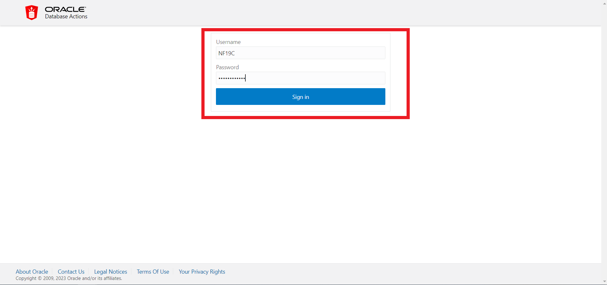

# Enable advanced index compression 

## Introduction

Advanced Index Compression is an Oracle 12.1 release that goes widely unused yet has significant benefits. Indexes are used extensively inside OLTP databases since they can efficiently support a wide variety of access paths to the data stored in relational tables. It is prevalent to find many indexes created on a single table to support many access paths for OLTP applications. This can cause indexes to contribute a more significant share to the overall storage of a database when compared to the size of the base tables alone. Advanced Index Compression is a form of index block compression. Creating an index using Advanced Index Compression reduces the size of all supported unique and non-unique indexes while still providing efficient access to the indexes. 

Estimated Time: 20 minutes

### About Advanced index compression

Advanced index compression LOW works well on all supported indexes, including those indexes that are not good candidates (indexes with no duplicate values or few duplicate values for a given number of leading columns of the index) with the existing Prefix Compression feature. Advanced Index Compression HIGH works at the block level to provide the best compression for each block. This means that you do not need knowledge of data characteristics – Advanced Index Compression HIGH automatically chooses the right compression per block.The HIGH level of Advanced Index Compression provides significant space savings while also improving performance for queries that are executed using indexes. Advanced Index Compression LOW and HIGH both provide significant space savings while also improving performance for queries that are executed using indexes.

### Key Features

* Gives higher compression ratios.
* Employs more complex compression algorithms than advanced index compression LOW.
* Stores data in a compression unit, which is a special on-disk format.

### Expectations from adapting a compression technique 

*	Storage costs to drop as the result of any compression deployments, and 
*	No query performance degradation and only minimal Data Manipulation Language (DML) performance impact from compression.
 
This Lab will teach you how to enable advanced index compression. 

### Objectives
 
In this lab, you will:
* Enable Advanced Index Compression 

### Prerequisites 
This lab assumes you have:

* A LiveLabs Cloud account and assigned compartment
* Successfully logged into your LiveLabs account
* An Autonomous Database 
* Completion of the Lab: 19C Setup
  
## Task 1: Enable advanced index compression

1. If you're not already looking at the SQL Developer Web interface, locate your Autonomous Database by clicking the hamburger menu in the top left of the screen, selecting Oracle Databases and choose Autonomous Database. **If you already have SQL Developer Web up and are logged in as the NF19C user, skip to step 4.**
 
  
 
2. Select the name of your database and click on the Database Actions button located at the top of the screen.

   
   
3. Log into Database Actions as the NF19C user.
	
	

4. First we're going create an index called CUST\_ID\_INX on the customer id column of our customer sales table. 

      ```
      <copy>
      CREATE INDEX cust_id_idx
      ON CUSTSALES (CUST_ID);
      </copy>
      ```

5. Now lets check the size of our newly created index.

      ```
      <copy>
      SELECT 
            ROUND(SUM(bytes) / 1024 / 1024 / 1024, 2) AS size_gb
      FROM 
            user_segments
      WHERE 
            segment_name = 'CUST_ID_IDX';
      </copy>
      ```
	


6. We can see that our index contains almost half a gigabyte of data. Lets verify that our index isn't currently compressed.

      ```
      <copy>
      select TABLE_OWNER, INDEX_TYPE, INDEX_NAME, COMPRESSION,LEAF_BLOCKS, TABLESPACE_NAME, DISTINCT_KEYS
        from user_indexes
        where INDEX_NAME ='CUST_ID_IDX';
      </copy>
      ```

7. Now we'll go ahead and create our index with advanced compression using the COMPRESS ADVANCED HIGH clause. This may take a minute or two to execute depending the size of the database you created. The CREATE INDEX statement is creating the index on the customer sales table which is over 6BG in size.

      ```
      <copy>
      DROP INDEX CUST_ID_IDX;
      CREATE INDEX cust_id_idx
      ON CUSTSALES (CUST_ID) COMPRESS ADVANCED HIGH;
      </copy>
      ```

8. Lets verify that our index is compressed with ADVANCED HIGH. 

      ```
      <copy>
      select TABLE_OWNER, INDEX_TYPE, INDEX_NAME, COMPRESSION,LEAF_BLOCKS, TABLESPACE_NAME, DISTINCT_KEYS
        from user_indexes
        where INDEX_NAME ='CUST_ID_IDX';
      </copy>
      ``` 
9. Finally, lets check that our compressed index is saving space.

      ```
      <copy>
      SELECT 
            ROUND(SUM(bytes) / 1024 / 1024 / 1024, 2) AS size_gb
      FROM 
            user_segments
      WHERE 
            segment_name = 'CUST_ID_IDX';
      </copy>
      ```
      

**To summarize**, this lab aimed to demonstrate the benefits of Advanced Index Compression. Advanced Index offers several powerful features, including the ability to perform online moves of tables, partitions, and subpartitions to a compressed format. This enables seamless movement of data without blocking concurrent DML operations. Additionally, the partition/subpartition move operation supports automatic index maintenance, eliminating the need for index rebuilding. Overall, the "online" feature of this MOVE operation is a significant advantage of Advanced Compression.

If your interested in learning more about advanced compression check out the full advanced compression LiveLab below.

* [Oracle advanced index compression LiveLab](https://apexapps.oracle.com/pls/apex/r/dbpm/livelabs/view-workshop?wid=1017&clear=RR,180&session=115125103779999) 

You successfully made it to the end this lab. You may now **proceed to the next lab**.    

## Learn More

* [Oracle advanced compression](https://www.oracle.com/technetwork/database/options/compression/advanced-compression-wp-12c-1896128.pdf) 
 
## Acknowledgements

- **Author** - Madhusudhan Rao, Principal Product Manager, Database
* **Contributors** - Kevin Lazarz, Senior Principal Product Manager, Database and Gregg Christman, Senior Product Manager
* **Last Updated By/Date** -  Madhusudhan Rao, Feb 2022 
