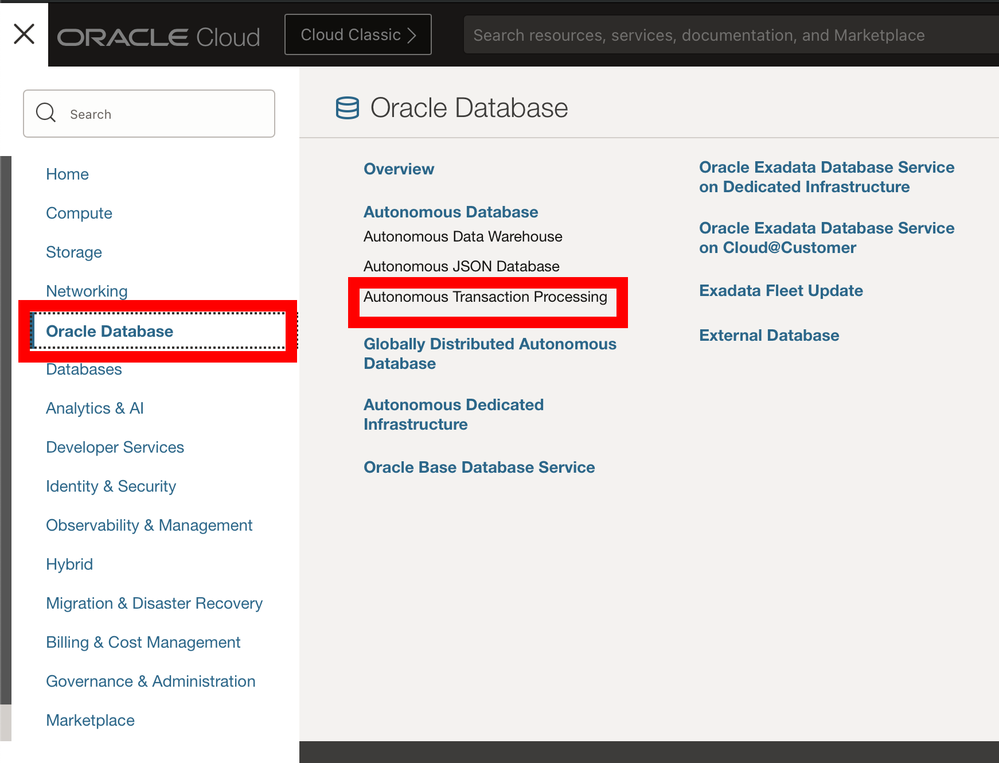

# Enable advanced index compression 

## Introduction

Advanced Index Compression is a powerful feature in Oracle 12.1 that provides significant benefits, yet it is often overlooked. In OLTP databases, indexes are crucial for efficiently supporting various access paths to relational table data. It is not uncommon to have multiple indexes created on a single table to support many access paths for OLTP applications. However, this can result in indexes taking up a larger share of the overall database storage than the base tables themselves.

Advanced Index Compression offers a solution to this issue. It is a form of index block compression that reduces the size of all supported unique and non-unique indexes while still providing efficient access to the data. By using this feature, organizations can reduce the storage requirements for their indexes and free up valuable space in their database.

Estimated Time: 15 minutes

### About Advanced Index Compression

Oracle's Advanced Index Compression offers two levels of compression: LOW and HIGH. The LOW level is effective for all supported indexes, even those that are not suitable for the existing Prefix Compression feature, which is designed for indexes with many duplicate values. The LOW level reduces the size of indexes that have few or no duplicate values for a given number of leading columns of the index.

The HIGH level of Advanced Index Compression is block-level compression that provides the best possible compression for each block without requiring any knowledge of data characteristics. The compression is automatically selected per block, resulting in significant space savings and improved query performance.

Both levels of Advanced Index Compression offer significant space savings and improved performance for queries that use indexes. The HIGH level is especially useful for very large indexes or those with little duplication, where significant storage savings can be achieved.

 
This Lab will teach you how to enable Advanced Index Compression. 

### Objectives
 
In this lab, you will:
* Enable Advanced Index Compression 

### Prerequisites 
This lab assumes you have:

* A LiveLabs Cloud account and assigned compartment
* Successfully logged into your LiveLabs account
* An Autonomous Database 
* Completion of the Lab: 19C Setup
  
## Task 1: Enable Advanced Index Compression

1. **If you already have SQL Developer Web up and are logged in as the NF19C user, skip to step 4.** If you're not already looking at the SQL Developer Web interface, locate your Autonomous Database by clicking the hamburger menu in the top left of the screen, selecting Oracle Databases and choose Autonomous Database. 
 
  
 
2. Select the name of your database and click on the Database Actions button located at the top of the screen.

   
   
3. Log into Database Actions as the NF19C user. Use the picture below to navigate to the SQL editor
	
	
	

4. First we're going create an index called CUST\_ID\_INX on the customer id column of our customer sales table. 

      ```
      <copy>
      CREATE INDEX cust_id_idx
      ON CUSTSALES (CUST_ID);
      </copy>
      ```

5. Now lets check the size of our newly created index.

      ```
      <copy>
      SELECT 
            ROUND(SUM(bytes) / 1024 / 1024 / 1024, 2) AS size_gb
      FROM 
            user_segments
      WHERE 
            segment_name = 'CUST_ID_IDX';
      </copy>
      ```
	


6. We can see that our index contains almost half a gigabyte of data. Lets verify that our index isn't currently compressed.

      ```
      <copy>
      select TABLE_OWNER, INDEX_TYPE, INDEX_NAME, COMPRESSION,LEAF_BLOCKS, TABLESPACE_NAME, DISTINCT_KEYS
        from user_indexes
        where INDEX_NAME ='CUST_ID_IDX';
      </copy>
      ```

7. Now we'll go ahead and create our index with advanced compression using the COMPRESS ADVANCED HIGH clause. This may take a minute or two to execute depending the size of the database you created. The CREATE INDEX statement is creating the index on the customer sales table which is over 6BG in size.

      ```
      <copy>
      DROP INDEX CUST_ID_IDX;
      CREATE INDEX cust_id_idx
      ON CUSTSALES (CUST_ID) COMPRESS ADVANCED HIGH;
      </copy>
      ```

8. Lets verify that our index is compressed with ADVANCED HIGH. 

      ```
      <copy>
      select TABLE_OWNER, INDEX_TYPE, INDEX_NAME, COMPRESSION,LEAF_BLOCKS, TABLESPACE_NAME, DISTINCT_KEYS
        from user_indexes
        where INDEX_NAME ='CUST_ID_IDX';
      </copy>
      ``` 
9. Finally, lets check that our compressed index is saving space.

      ```
      <copy>
      SELECT 
            ROUND(SUM(bytes) / 1024 / 1024 / 1024, 2) AS size_gb
      FROM 
            user_segments
      WHERE 
            segment_name = 'CUST_ID_IDX';
      </copy>
      ```
      

In conclusion, this lab has explored some of the benefits and capabilities of Oracle's Advanced Index Compression technology. Through the use of high levels of Advanced Index Compression, we were able to significantly reduce the storage footprint of our indexes without compromising query performance. This can result in substantial savings in storage costs and improved overall system performance.

The Advanced Index Compression feature is a powerful tool for optimizing database performance in high-data-volume environments. By reducing the size of indexes, it allows for faster querying and less storage space, which ultimately leads to better overall system performance. 

If your interested in learning more about Advanced Compression, check out the full Advanced Compression LiveLab below.

* [Oracle Advanced Index Compression LiveLab](https://livelabs.oracle.com/pls/apex/r/dbpm/livelabs/view-workshop?wid=1017&clear=RR,180&session=115125103779999) 

You successfully made it to the end this lab. You may now **proceed to the next lab**.    

## Learn More

* [Oracle Advanced Compression](https://www.oracle.com/technetwork/database/options/compression/advanced-compression-wp-12c-1896128.pdf) 
 
## Acknowledgements

- **Author** - Killian Lynch, Database Product Manager
* **Contributors** - Dom Giles, Database Product Manager
* **Last Updated By/Date** -  Killian Lynch, June 2024