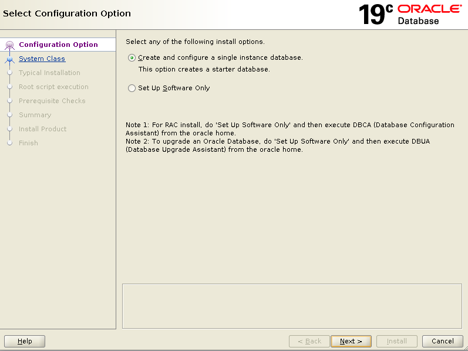
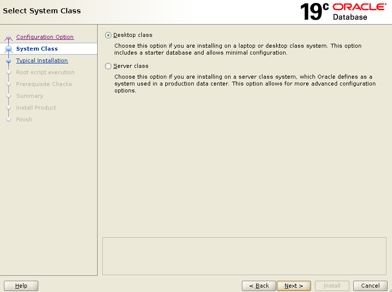
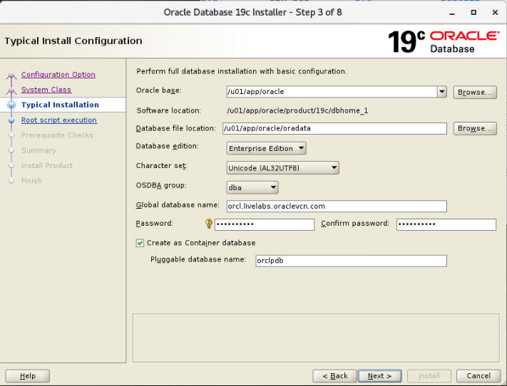
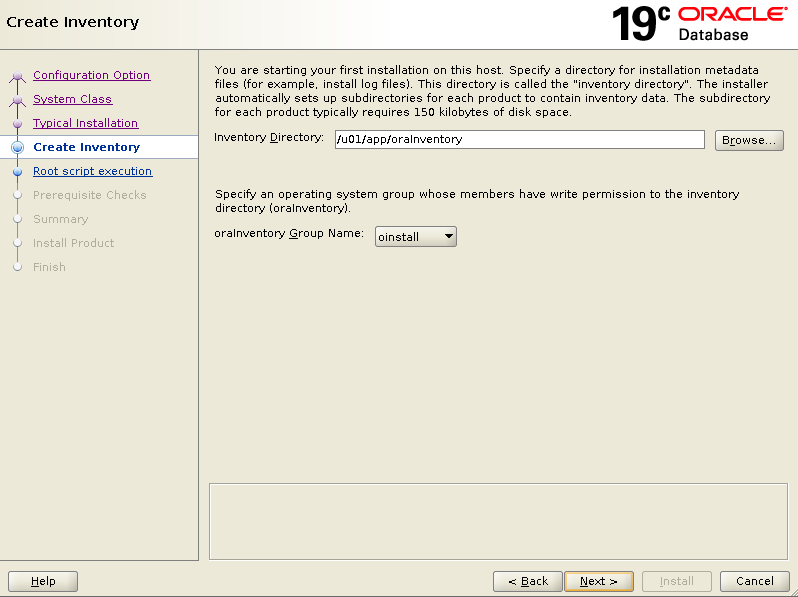
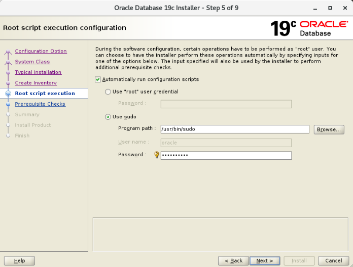
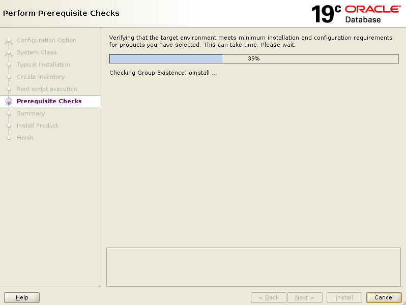
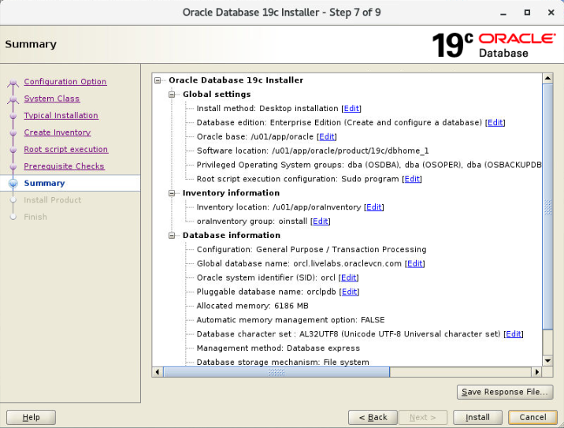
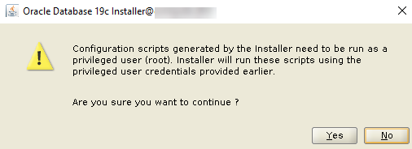
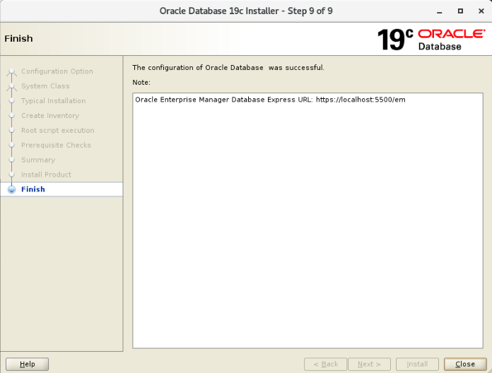

# Install Oracle Database 19c with Automatic Root Script Execution

## Introduction

Oracle Database 19c installer has a new feature that automatically runs `root` configuration scripts for you. This feature simplifies the installation process and helps you to avoid inadvertent permission errors. The installer lets you configure the `root` user or a sudoer user to run the configuration scripts. Both options require the user's password.

In this lab, you run the Oracle Database 19c installer and configure the `oracle` user to execute the root scripts. The `oracle` user is already configured as a sudoer. Next, you examine the response file as well as the container database (CDB) and pluggable database (PDB) that get created. Use the `workshop-staged` compute instance.

> **Note:** This lab is available for free and paid tier environments only.

Estimated Time: 40 minutes

### Objectives

In this lab, you will:

- Install Oracle Database 19c using the new automatic root script execution feature
- Review the response file
- Discover the container database (CDB) and pluggable database (PDB)


### Prerequisites

This lab assumes you have:
- Obtained and signed in to your `workshop-staged` compute instance


## Task 1: Install Oracle Database 19c using the new automatic root script execution feature

*Be sure that you are using the `workshop-staged` compute instance.*

1. On your desktop, double-click the **Terminal** icon to open a terminal window. Notice that you are signed in to the Linux operating system as the `oracle` user. It's important that you run the Oracle Database 19c installer as the `oracle` user.

2. Change to the Oracle home directory.

    ```
    $ <copy>cd /u01/app/oracle/product/19c/dbhome_1</copy>
    ```

3. List the files in the Oracle home directory. Notice that you have a `runInstaller` file and a `32904851` directory, which is the Oracle Database release update for 19.12.0.0.

    ```
    $ <copy>ls</copy>

    32904851    diagnostics    lib      PatchSearch.xml  slax
    addnode     dmu            md       perl             sqldeveloper
    apex        drdaas         mgw      plsql            sqlj
    assistants  dv             network  precomp          sqlpatch
    bin         env.ora        nls      QOpatch          sqlplus
    clone       has            odbc     R                srvm
    crs         hs             olap     racg             suptools
    css         install        OPatch   rdbms            ucp
    ctx         instantclient  opmn     relnotes         usm
    cv          inventory      oracore  root.sh          utl
    data        javavm         ord      root.sh.old      wwg
    dbjava      jdbc           ords     root.sh.old.1    xdk
    dbs         jdk            oss      runInstaller
    deinstall   jlib           oui      schagent.conf
   demo        ldap           owm      sdk
    ```

4. Launch the Oracle Database 19c installer by executing the `runInstaller` file. To apply the Oracle Database release update for 19.12.0.0, you can include the `applyRU` parameter. The installer first applies the patch (this takes about 7.5 minutes), and then it opens the Oracle Universal Installer wizard. If you don't want to patch the database to release 19.12, you can leave out the -`applyRU` parameter and value, and Oracle Database release 19.3 will be installed.

  *Enter the command carefully and check that it is correct before you run it! If you make an error while installing the database, you cannot easily undo the changes made to the compute instance. It is fastest to obtain a fresh `workshop-staged` compute instance and try the lab again.*

    ```
    $ <copy>./runInstaller -applyRU 32904851</copy>
    ```

5. On the **Configuration Option** page, leave **Create and configure a single instance database** selected, and click **Next**. This option creates a starter database with one container database (CDB) and one pluggable database (PDB).

    

6. On the **System Class** page, leave **Desktop Class** selected, and click **Next**.

    

7. On the **Typical Installation** page, leave all the default values as is. Enter **Ora4U_1234** in the **Password** and **Confirm password** boxes, and then click **Next**.

    The following values will be configured:

    - Oracle base: `/u01/app/oracle`
    - Database file location: `/u01/app/oracle/oradata`
    - Database edition: Enterprise Edition
    - Character set: Unicode (AL32UTF8)
    - OSDBA group: `dba`
    - Global database name: `orcl.livelabs.oraclevcn.com`
    - Password: `Ora4U_1234`
    - Create as Container database (selected)
    - Pluggable database name: `orclpdb`

    


8. On the **Create Inventory** page, leave the default settings as is, and click **Next**.

    The following values will be configured:

    - Inventory Directory: `/u01/app/oraInventory`
    - oraInventory Group Name: `oinstall`

    

9. On the **Root script execution** page, do the following, and then click **Next**.

    - Select the **Automatically run configuration scripts** check box. *This is the new feature!*

    - Select **Use sudo**. The `oracle` user is automatically configured as the sudo user. The sudo user name must be the username of the user installing the database.

    - Enter the password for the `oracle` user, which is `Ora4U_1234`.


    

10. On the **Perform Prerequisite Checks** page, wait for the installer to verify that your environment meets the minimum installation and configuration requirements. If everything is fine, the **Summary** page is displayed.

    

    

11. On the **Summary** page, click **Save Response File**. The **Save Response File** dialog box is displayed. Browse to and select the `/tmp` directory. Leave **db.rsp** as the name, and click **Save**.

12. Click **Install** to begin installing the software.

13. On the **Install Product** page, monitor the progress of the steps being executed. When prompted to run the configuration scripts as the privileged user, click **Yes** to continue. The installation takes about 26 minutes to complete.

    


14. Watch for the two lines in the progress information that pertain to automatic root script execution:

    - Execute Root Scripts
    - Running root scripts using specified configuration method

    


15. On the **Finish** page, click **Close**. The installation is finished.

    


## Task 2: Review the response file

1. In the terminal window, change to the `/tmp` directory where you saved the response file.

    ```
    $ <copy>cd /tmp</copy>
    ```
2. Review the response file (`db.rsp`).

    ```
    $ <copy>cat db.rsp</copy>

    ####################################################################
    ## Copyright(c) Oracle Corporation 1998,2019. All rights reserved.##
    ##                                                                ##
    ## Specify values for the variables listed below to customize     ##
    ## your installation.                                             ##
    ##                                                                ##
    ## Each variable is associated with a comment. The comment        ##
    ## can help to populate the variables with the appropriate        ##
    ## values.                                                        ##
    ##                                                                ##
    ## IMPORTANT NOTE: This file contains plain text passwords and    ##
    ## should be secured to have read permission only by oracle user  ##
    ## or db administrator who owns this installation.                ##
    ##                                                                ##
    ####################################################################
    ...
    ```


## Task 3: Discover the container database (CDB) and pluggable database (PDB)

1. Set the Oracle environment variables. At the prompt, enter **orcl**. You need to set these each time you open a new terminal window and want to access your database.

    ```
    $ <copy>. oraenv</copy>

    ORACLE_SID = [oracle] ? orcl
    The Oracle base has been set to /u01/app/oracle
    $
    ```

2. View the Oracle environment variables set by the `. oraenv` command that you just ran.

    ```
    $ <copy>set | grep ORACLE</copy>

    OLD_ORACLE_BASE=
    ORACLE_BASE=/u01/app/oracle
    ORACLE_HOME=/u01/app/oracle/product/19c/dbhome_1
    ORACLE_SID=orcl
    $
    ```


3. Using SQL\*Plus, connect to the `root` container of your database as the `SYS` user. SQL\*Plus is an interactive and batch query tool that is installed with every Oracle Database installation. Notice the database version in the output. In the example below, the version is 19.12.0.0.0.

    ```
    $ <copy>sqlplus / as sysdba</copy>

    SQL*Plus: Release 19.0.0.0.0 - Production on Thu Aug 19 16:55:34 2021
    Version 19.12.0.0.0

    Copyright (c) 1982, 2021, Oracle.  All rights reserved.

    Connected to:
    Oracle Database 19c Enterprise Edition Release 19.0.0.0.0 - Production
    Version 19.12.0.0.0

    SQL>
    ```

4. Verify that you are logged in to the `root` container as the `SYS` user.

    ```
    SQL> <copy>SHOW user</copy>

    USER is "SYS"
    ```

5. Find the current container name. Because you're currently connected to the `root` container, the name is `CDB$ROOT`.

    ```
    SQL> <copy>SHOW con_name</copy>

    CON_NAME
    -------------------
    CDB$ROOT
    ```

6. List all the containers in the CDB by querying the `V$CONTAINERS` view. The output lists three containers - the `root` container (`CDB$ROOT`), the seed PDB (`PDB$SEED`), and the pluggable database (`ORCLPDB`).

    ```
    SQL> <copy>COLUMN name FORMAT A8</copy>
    SQL> <copy>SELECT name, con_id FROM v$containers ORDER BY con_id;</copy>

    NAME         CON_ID
    -------- ----------
    CDB$ROOT          1
    PDB$SEED          2
    ORCLPDB           3
    ```


7. Exit SQL*Plus.

    ```
    SQL> <copy>exit</copy>
    ```

8. Close the terminal window.

    ```
    $ <copy>exit</copy>
    ```

Congratulations! You successfully installed Oracle Database 19c using the automatic root script execution feature.


## Learn More

- [Get Started with Oracle Database 19c](https://docs.oracle.com/en/database/oracle/oracle-database/19/)
- [Install and Upgrade to Oracle Database 19c](https://docs.oracle.com/en/database/oracle/oracle-database/19/install-and-upgrade.html)

## Acknowledgements

- **Author**- Jody Glover, Principal User Assistance Developer, Database Development
- **Contributors**
    - James Spiller, Consulting User Assistance Developer, Database Development
    - Jean-Francois Verrier, User Assistance Director, Database Development
    - S. Matt Taylor Jr., Document Engineering (DocEng) Consulting Member of Technical Staff
    - Rene Fontcha, Master Principal Solutions Architect
- **Last Updated By/Date** - Jody Glover, Database team, September 21 2021
