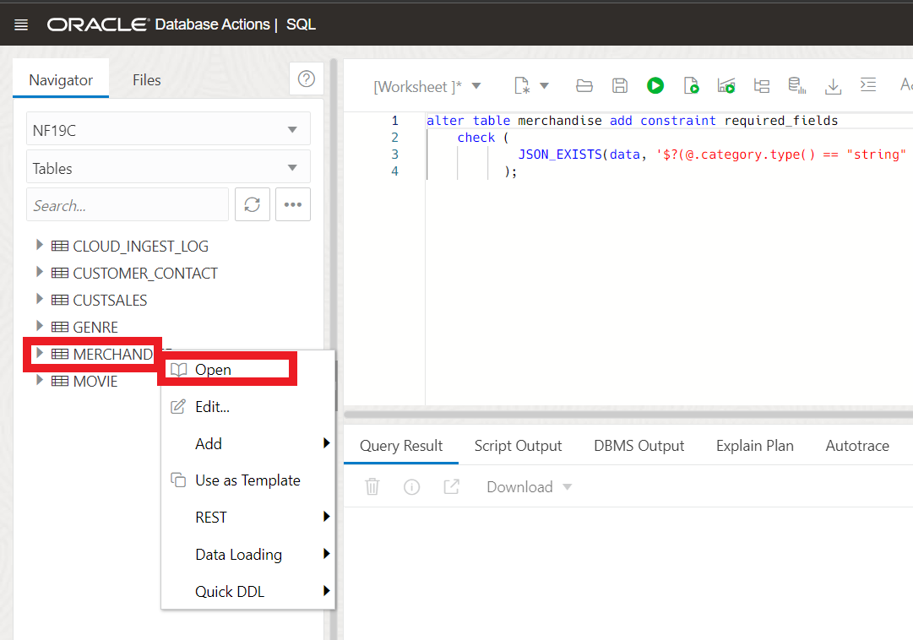
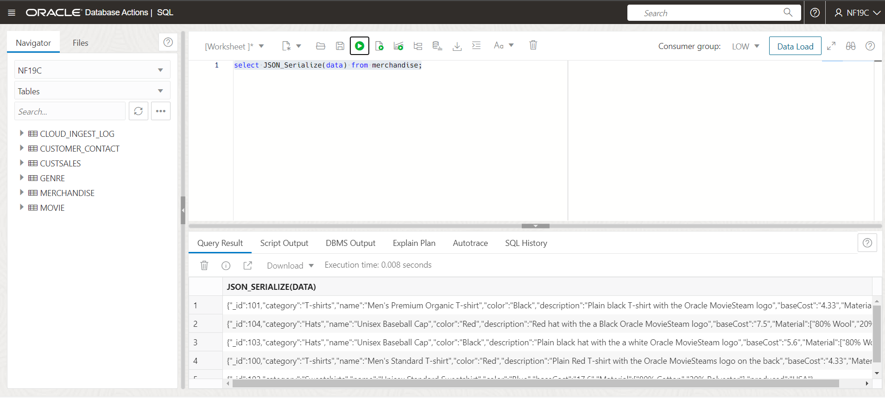
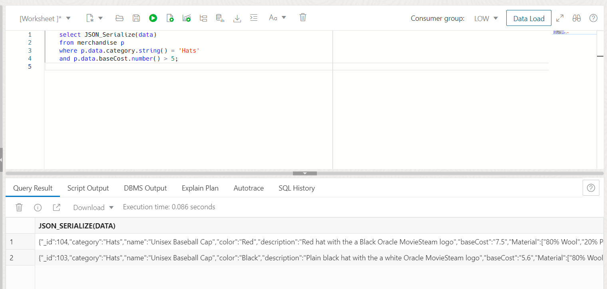
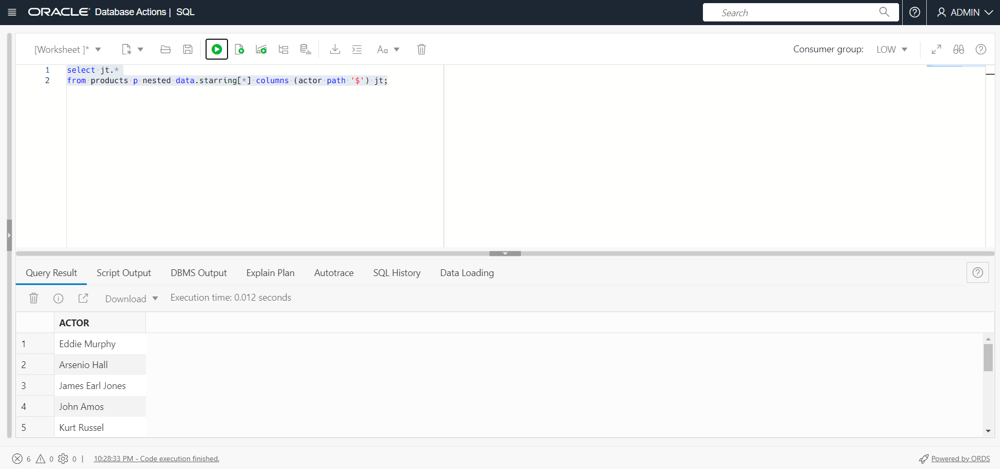

# Working with JSON in the Oracle Database

## Introduction

The 19c generation of Oracle's converged database offers customers; best of breed support for all data types (e.g. relational, JSON, XML, spatial, graph, OLAP, etc.), and industry leading performance, scalability, availability and security for all their operational, analytical and other mixed workloads. A JSON collection stores JSON documents alongside some metadata like the time of creation or update. Collections offer operations like inserts, deletes, index creation or queries. We will be using Oracle SQL Developer Web (also known as Database Actions) - a development environment and a database administration interface for Oracle Database in the Oracle Public Cloud. For a complete integrated development environment, see Oracle SQL Developer User's Guide linked at the bottom of the lab.

In order to create a collection all you have to specify is the collection's name. Unlike a relational table you do not have to provide any schema information. For our JSON lab, we'll be working with a collection of products that our fictitious retro movie and book retail store "RockBuster" sells.

Estimated Time: 15 minutes

Watch the video below for a quick walk through of the lab.

[Working with JSON in the Oracle Database](videohub:1_qxy2y77h)

### Objectives

In this lab, you will:

* Create Collection
* Insert First Document
* Find JSON documents in a collection
* Learn about JSON and Constraints
* Use SQL on JSON data
### Prerequisites

* Have provisioned an Autonomous Database instance

## Task 1: Create Collection

1. After your Autonomous Database has finished provisioning, click on the **Database Actions** button located at the top of the screen. 

	

2. If you're not automatically logged in, sign in as ADMIN. Your password will be the password you specified when you created the database.

	

3. (Optional database password reset) If you need to reset your database password its very simple to do so. Click on **More actions** from the OCI console screen and select **Administrator Password**. Fill in your new password and select **Change**. After you select **Change**, follow from step 1 above.

	

3. Next, select the JSON tile on the left hand side of the screen.

	


4. To create a collection, click **Create Collection**.

	

5. Provide a name for the collection in the field, we'll call it  **products** and click **Create**. MAKE SURE you check the **MongoDB Compatible** box. Note that the collection name is case-sensitive. You must enter products in all lower-case, don't use PRODUCTS or Products.

	

6. A notification pops up informing you the `products` collections is created.

	

6. Click the refresh button to verify the `products` collection is created.

	

## Task 2: Insert Documents

1. Double click **products** collection to show the **JSON-products** worksheet.

	

2. Click New JSON Document button.

	

3. A New JSON Document panel displays. Copy the following JSON object, paste it in the worksheet and click **Create**.

	```
	<copy>
	{
		"_id": 100,
		"type":"movie",
		"title": "Coming to America",
		"format": "DVD",
		"condition": "acceptable",
		"price": 5,
		"comment": "DVD in excellent condition, cover is blurred",
		"starring": ["Eddie Murphy", "Arsenio Hall", "James Earl Jones", "John Amos"],
		"year": 1988,
		"decade": "80s"
	}
	</copy>
	```

	

4. A notification pops up that says A New Document is created and the new document is shown in the bottom section of the JSON workshop.

	

5. Let's repeat this with the following documents:

	Click New JSON Document button, copy and run the following JSON objects one by one, paste it in the worksheet and click **Create**.

    ```
	<copy>
	{
		"_id": 101,
		"title": "The Thing",
		"type": "movie",
		"format": "DVD",
		"condition": "like new",
		"price": 9.50,
		"comment": "still sealed",
		"starring": [
			"Kurt Russel",
			"Wilford Brimley",
			"Keith David"
		],
		"year": 1982,
		"decade": "80s"
	}
	</copy>
	```

	```
	<copy>
	{
		"_id": 102,
		"title": "Aliens",
		"type": "movie",
		" format ": "VHS",
		"condition": "unknown, cassette looks ok",
		"price": 2.50,
		"starring": [
			"Sigourney Weaver",
			"Michael Bien",
			"Carrie Henn"
		],
		"year": 1986,
		"decade": "80s"
	}
	</copy>
	```

	```
	<copy>
		{
		"_id": 103,
		"title": "The Thing",
		"type": "book",
		"condition": "okay",
		"price": 2.50,
		"author":"Alan Dean Forster",
		"year": 1982,
		"decade": "80s"
	}
	</copy>
	```

## Task 3: Find JSON documents in a collection

Documents can be selected based on filter conditions - we call them 'Queries By Example' or 'QBE' for short. A QBE is a JSON document itself and it contains the fields and filter conditions that a JSON document in the collection must satisfy in order to be selected. QBEs are used with SODA (only); you can use SQL functions as an alternative.

The simplest form of a QBE just contains a key-value pair. Any selected document in the collection must have the same key with the same value. More complex QBEs can contain multiple filter conditions or operators like 'negation' or 'and', etc.

The following are examples for QBEs. You can copy them into the corresponding window (see screenshot) and execute them. Obviously, in a real application those QBE-expressions would be issued directly from the programming language - the SODA drivers have APIs for common application programming languages: Python, etc.

Now let's issue some simple queries on the *products* collection we just created.

1. Copy and paste the following queries in the worksheet and click Run Query button to run a query.

2.  Lookup by one value:

	Here, it displays the document whose id value is 101.

	```
	<copy>
	{"_id":101}
	</copy>
	```
	
	

3.	Find all DVDs:

	Running the query will displays two documents with format DVD.

	```
	<copy>
	{"format":"DVD"}
	</copy>
	```
	

4.	Find all non-movies:

	This query displays the documents that are not of type - movies, which means just the document with id 103.

	```
	<copy>
	{"type":{"$ne":"movie"}}
	</copy>
	```
	

5.	Find documents whose condition value contains "new", which means just document (with id) 101.

	```
	<copy>
	{"condition":{"$like":"%new%"}}
	</copy>
	```
	

6. Find bargains of all products costing 5 or less:

	This query displays the documents with ids 100, 102 and 103 as those documents have price less than 5.

	```
	<copy>
	{"price":{"$lte":5}}
	</copy>
	```
	

7. Tighten previous query to choose only movie documents:

	This query displays the documents whose ids are 100, 102 as those documents have price less than 5 and not the type - book.

	```
	<copy>
	{"$and":[{"price":{"$lte":5}}, {"type":"movie"}]}
	</copy>
	```
	

## Task 4: JSON and Constraints

JSON data is "schema flexible", you can add whatever data you like to a JSON document. But sometimes you will wish to impose some required structure on that data. That can be done through SQL by creating indexes and/or constraints on the JSON collection.

An index will aid fast access to an item (for example speeding up access via the "title" field), but can also be used to impose uniqueness (a unique index or primary key constraint), or to enforce particular datatypes (by triggering an error if the datatype is not what is expected).

More generally, constraints can be used to check the data being entered for various aspects.

1.  Let's add a check - or 'constraint' to check our data entry. We will do this using SQL Developer Web. Click the navigation menu on the top left and select **SQL** under Development.

	

> **Note**: Ignore the warning message about being logged in as ADMIN. This is a demo, not a best practice.

2. Check constraint to make sure every product has a title of string data type and price >=0. 

	Add a constraint to make sure that every item has at least a title and the price. We want the price to be a non-negative number and title to be a string.

	Copy and paste the query below in the worksheet and click Run query button to run the SQL query to alter products table and add constraints.

	```
	<copy>
	alter table products add constraint required_fields 
		check (
				JSON_EXISTS(data, '$?(@.title.type() == "string" && @.price.number() > 0)')
			  );
	</copy>
	```
	

	JSON_Exists is a SQL/JSON function that checks that a SQL/JSON path expression selects at least one value in the JSON data. The selected value(s) are not extracted – only their existence is checked. Here, *$?(@.title.type() == "string" && @.price.number() > 0)* is a standard, SQL/JSON path expressions. You'll learn more about SQJ/JSON functions later in this lab.

3. Once the *products* table is altered, navigate back to JSON workshop. Click the navigation menu on the top left and select **JSON** under Development.

	

4. Validate that the following documents cannot get inserted as fields are missing or of the wrong type.

	Click New JSON Document icon, copy and paste the following query in the worksheet and click **Create**.

	Throws the error "Unable to add new JSON document" since the following document has missing fields while trying to insert.

	```
	<copy>
	{"_id":"200","title":"Top Gun"}
	</copy>
	```
	
	

5. The following document now satisfies all the constraints: the "id" is a unique number, the title is a string, and the price is a positive number.

	```
	<copy>
	{
		"_id": 200,
		"title": "Top Gun",
		"category": "VHS",
		"condition": "like new",
		"price": 8,
		"starring": [
			"Tom Cruise",
			"Kelly McGillis",
			"Anthony Edwards",
			"Val Kilmer"
		],
		"year": 1986,
		"decade": "80s"
	}
	</copy>
	```

## Task 5: Using SQL on JSON 

So far, we've focused mostly on the document store API where we dealt with JSON data as a collection of documents. But there is another way to interact with your JSON data: SQL. SQL is a very mature query language. Oracle added new operators to work with JSON data (we created an open standard called SQL/JSON which was adopted by the ISO SQL standard). A key characteristic of a JSON collection (like 'products') is that it is backed by a table - a table then gets auto-created when you create a collection so that you do not have to specify columns and data types. In the following we show you how you can use SQL to work with the JSON data in a collection.


1. Open Database Actions (if you don't already have it open). Either choose **SQL** under Development from the launchpad, or click on the navigation menu on the top left and select **SQL** under Development.

    

2. On the left side, click on PRODUCTS - this is the table for the 'products' collection. To get the view displayed, you need to right-click on **PRODUCTS** and choose **Open**.

    

    You see that the table 'PRODUCTS' has 5 columns: an 'ID' which is a unique identifier for the document (and in the case of MongoDB-compatible collections, is taken from the "_id" field in the JSON), a column 'DATA' which holds the JSON document, 2 metadata columns to keep track of creation and update timestamps and 'VERSION' which is typically a hash value for the document and allows to keep caches in sync (similar to an eTag). None of this is really important at this point as we will only use the DATA column in the following examples.


3. Because the JSON data is stored in a binary representation (for query and update efficiency) we need to convert it to a human-readable string using JSON_Serialize.

    Copy and paste this query in SQL Developer Web worksheet and run it. 

    ```
    <copy>
    select JSON_Serialize(data) from products;
    </copy>
    ```

    

4. Simple dot notation - We can extract values from the JSON data using a simple notation (similar to JavaScript) directly from SQL.

    For example, running the below query shows all movies costing more than 5.

    ```
    <copy>
    select JSON_Serialize(data)
    from products p
    where p.data.type.string() = 'movie'
    and p.data.format.string() = 'DVD'
    and p.data.price.number() > 5;
    </copy>
    ```
    

    We use a trailing function like 'string()' or 'number()' to map a selected JSON scalar value to a SQL value.

5. You can also extract values this way in the `select` part. Copy and paste the query in SQL Developer Web worksheet and run it.

    ```
    <copy>
    select p.data.title.string(), p.data.year.number()
    from products p
    where p.data.type.string() = 'movie'
    order by 2 DESC;
    </copy>
    ```
    

6. It is also possible to use aggregation or grouping with values from the JSON data.

    The following calculates the average price of movies per decade.

    ```
    <copy>
    select p.data.decade.string(),
           avg(p.data.price.number())
    from products p
    where p.data.type.string() = 'movie'
    group by p.data.decade.string();
    </copy>
    ```
    


	All above examples extracted singleton values from the JSON data - values that only occurred once per document (like title or price). But JSON can have nested arrays - how can we access those?

7. Let's say we want to extract all actor names. They occur as JSON strings in the array called 'starring'. Since one movie has typically more than one actor the overall number of actor names is larger than the number of documents. We therefore need a mechanism that generates rows - a row source. This is why we use the 'nested' clause in the FROM part of the query - here we generate the rows and extract the value we're interested in as column values.

    The simplest example is the following, run it first then we will explain it.

    ```
    <copy>
    select jt.*
    from products p nested data columns ("_id", title, year NUMBER) jt;
    </copy>
    ```
    

    As you can see we're extracting the '_id', the 'title' and the 'year' from each document. Instead of a trailing function we can specify an optional SQL data type like NUMBER - the default (used for the title) is a VARCHAR2(4000). Note that since _id starts with an underscore character it's necessary to put it in quotes.

8.  We could have written this query with the simple dot notation, as well, because we do not drill into any JSON array yet. Let's do that in  this query, by using the NESTED clause also in the COLUMNS clause.

    ```
    <copy>
    select jt.*
    from products p nested data columns ("_id", title, year NUMBER, nested starring[*] columns (actor path '$')) jt;
    </copy>
    ```
    

    The second 'nested' acts over the JSON array called 'starring'. The '[*]' means that we want to select every item of the array; [0] would only select the first one, for example. Then the second columns clause defines which value we want to extract from inside the array. The 'starring' array consists only of string values; we therefore need to select the entire value. This is done with the path expression '$'. We give selected values the column name 'actor'. You will learn more about path expressions in the next step.

9.  It is also possible to directly access the actors ('starring' array) as the following query shows: here we only select the actor names.

    ```
    <copy>
    select jt.*
    from products p nested data.starring[*] columns (actor path '$') jt;
    </copy>
    ```
    

10.  On this we can do here by slightly modifying the query is to count the number of movies by actor. All we do is group the results by actor name and count the group's size. The 'order by' clause orders the results based on the second column (the count).

    ```
    <copy>
    select jt.actor, count(1)
    from products p nested data.starring[*] columns (actor path '$') jt
    group by actor
    order by 2 DESC;
    </copy>
    ```
    


## Learn More

* [Creating B-Tree Indexes for JSON_VALUE](https://docs.oracle.com/en/database/oracle/oracle-database/21/adjsn/indexes-for-json-data.html#GUID-FEE83855-780A-424B-9916-B899BFF2077B)
* [Use Oracle Database Actions with JSON Collections](https://docs.oracle.com/en/cloud/paas/autonomous-json-database/ajdug/use-oracle-database-actions-json-collections1.html) 
* [Use SQL With JSON Data](https://docs.oracle.com/en/database/oracle/oracle-database/21/adjsn/json-in-oracle-database.html#GUID-04377B36-654B-47C4-A480-535E00E46D1F)
* [Oracle SQL Function JSON_SERIALIZE](https://docs.oracle.com/en/database/oracle/oracle-database/21/adjsn/json-in-oracle-database.html#GUID-667D37FF-F5FB-465D-B8AE-DAE88F191B2F)
* [Simple Dot-Notation Access to JSON Data](https://docs.oracle.com/en/database/oracle/oracle-database/21/adjsn/simple-dot-notation-access-to-json-data.html#GUID-7249417B-A337-4854-8040-192D5CEFD576)
* [SQL NESTED Clause Instead of JSON_TABLE](https://docs.oracle.com/en/database/oracle/oracle-database/21/adjsn/function-JSON_TABLE.html#GUID-D870AAFF-58B0-4162-AC11-4DDC74B608A5)
* [Oracle SQL Developer User's Guide, AKA Database Actions](https://docs.oracle.com/en/cloud/paas/autonomous-database/database-actions.html)

## Acknowledgements

- **Author** - Beda Hammerschmidt, Architect
- **Contributors** - Anoosha Pilli, Product Manager, Oracle Database
- **Last Updated By/Date** - Killian Lynch August 2022
