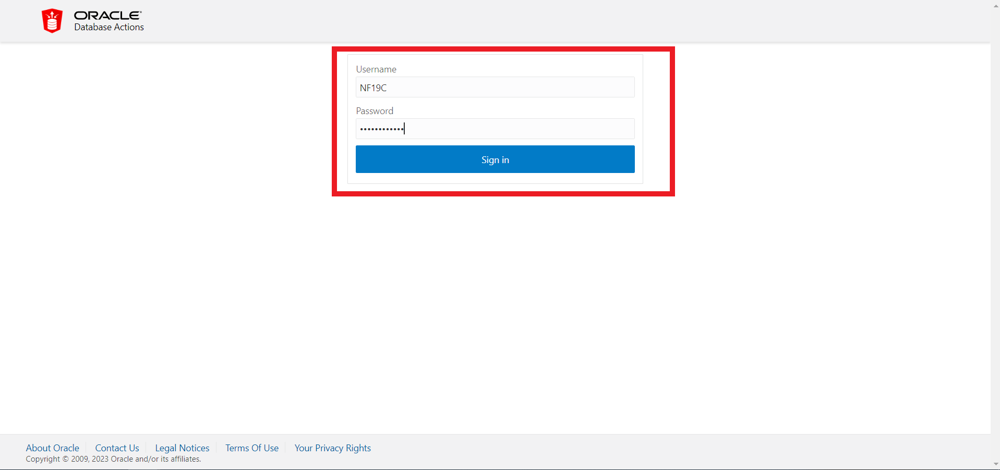
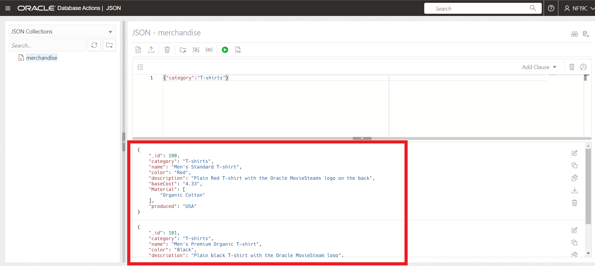
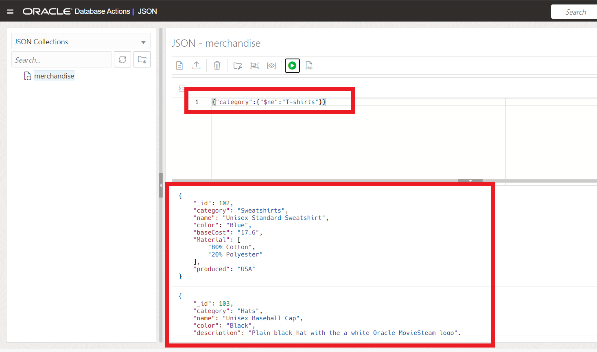

# Working with JSON in the Oracle Database

## Introduction

The 19c generation of Oracle's converged database offers customers; best of breed support for all data types (e.g. relational, JSON, XML, spatial, graph, OLAP, etc.), and industry leading performance, scalability, availability and security for all their operational, analytical and other mixed workloads. A JSON collection stores JSON documents alongside some metadata like the time of creation or update. Collections offer operations like inserts, deletes, index creation or queries. We will be using Oracle SQL Developer Web (also known as Database Actions) - a development environment and a database administration interface for Oracle Database in the Oracle Public Cloud. For a complete integrated development environment, see Oracle SQL Developer User's Guide linked at the bottom of the lab.

In order to create a collection all you have to specify is the collection's name. Unlike a relational table you do not have to provide any schema information. For our JSON lab, we'll be working with a collection of merchandise that our fictitious movie streaming company "Oracle MovieStream" sells.

Estimated Time: 15 minutes

Watch the video below for a quick walk through of the lab.

[Working with JSON in the Oracle Database](videohub:1_qxy2y77h)

### Objectives

In this lab, you will:

* Create Collection
* Insert First Document
* Find JSON documents in a collection
* Learn about JSON and Constraints
* Use SQL on JSON data

### Prerequisites

* Have provisioned an Autonomous Database instance
* Have completed the 19C Setup Lab

## Task 1: Create Collection

1. If you're not already looking at the SQL Developer Web interface, locate your Autonomous Database by clicking the hamburger menu in the top left of the screen, selecting Oracle Databases and choose Autonomous Database. **If you already have SQL Developer Web up and are logged in as the NF19C user, skip to step 4.**
 
  
 
2. Select the name of your database and click on the Database Actions button located at the top of the screen.

   
   
3. Log into Database Actions as the NF19C user.
	
	


4. Select the JSON tile on the left hand side of the screen.

	


5. To create a collection, click **Create Collection**.

	

6. Provide a name for the collection in the field, we'll call it  **merchandise** and click **Create**. MAKE SURE you check the **MongoDB Compatible** box. Note that the collection name is case-sensitive. You must enter merchandise in all lower-case, don't use MERCHANDISE or Merchandise.

	

7. A notification pops up informing you the `Merchandise` collections is created.

	

8. Click the refresh button to verify the `Merchandise` collection is created.

	

## Task 2: Insert Documents

1. Double click **Merchandise** collection to show the **JSON-merchandise** worksheet if it is not up.

	

2. Click New JSON Document button.

	

3. A New JSON Document panel displays. Copy the following JSON object, paste it in the worksheet and click **Create**.

	```
	<copy>
	{
		"_id": 100,
		"category":"T-shirts",
		"name":"Men's Standard T-shirt",
		"color": "Red",
		"description":"Plain Red T-shirt with the Oracle MovieSteams logo on the back",
		"baseCost":"4.33",
		"Material": [
			"Organic Cotton"
		],
		"produced": "USA"
	}
	</copy>
	```

	

4. A notification pops up that says A New Document is created and the new document is shown in the bottom section of the JSON workshop.

	

5. Let's repeat this with the following documents:

	Click New JSON Document button, copy the following JSON objects one by one, paste it in the worksheet and click **Create**.

    ```
	<copy>
	{
		"_id": 101,
		"category":"T-shirts",
		"name":"Men's Premium Organic T-shirt",
		"color": "Black",
		"description":"Plain black T-shirt with the Oracle MovieSteam logo",
		"baseCost":"4.33",
		"Material": [
			"Organic Cotton"
		],
		"produced": "USA"
	}
	</copy>
	```

	```
	<copy>
	{
		"_id": 102,
		"category":"Sweatshirts",
		"name":"Unisex Standard Sweatshirt",
		"color": "Blue",
		"baseCost":"17.6",
		"Material": [
			"80% Cotton",
			"20% Polyester"
		],
		"produced": "USA"
	}
	</copy>
	```

	```
	<copy>
		{
		"_id": 103,
		"category":"Hats",
		"name":"Unisex Baseball Cap",
		"color": "Black",
		"description": "Plain black hat with the a white Oracle MovieSteam logo",
		"baseCost":"5.6",
		"Material": [
			"80% Wool",
			"20% Polyester"
		],
		"produced": "USA"
	}
	</copy>
	```

## Task 3: Find JSON documents in a collection

Documents can be selected based on filter conditions - we call them 'Queries By Example' or 'QBE' for short. A QBE is a JSON document itself and it contains the fields and filter conditions that a JSON document in the collection must satisfy in order to be selected. QBEs are used with SODA (only); you can use SQL functions as an alternative.

The simplest form of a QBE just contains a key-value pair. Any selected document in the collection must have the same key with the same value. More complex QBEs can contain multiple filter conditions or operators like 'negation' or 'and', etc.

The following are examples for QBEs. You can copy them into the corresponding window (see screenshot) and execute them. Obviously, in a real application those QBE-expressions would be issued directly from the programming language - the SODA drivers have APIs for common application programming languages: Python, etc.

Now let's issue some simple queries on the *merchandise* collection we just created.

1. Copy and paste the following queries in the worksheet and click Run Query button to run a query.

2.  Lookup by one value:

	Here, it displays the document whose id value is 101.

	```
	<copy>
	{"_id":101}
	</copy>
	```
	

3.	Find all T-shirts:

	Running the query will displays two documents with category T-Shirts.

	```
	<copy>
	{"category":"T-shirts"}
	</copy>
	```
	

4.	Find all non-movies:

	This query displays the documents that are not of type - T-shirts.

	```
	<copy>
	{"category":{"$ne":"T-shirts"}}
	</copy>
	```
	


5. Find bargains of all merchandise costing 15 or less:

	```
	<copy>
	{"baseCost":{"$lte":15}}
	</copy>
	```
	


## Task 4: JSON and Constraints

JSON data is "schema flexible", you can add whatever data you like to a JSON document. But sometimes you will wish to impose some required structure on that data. That can be done through SQL by creating indexes and/or constraints on the JSON collection.

An index will aid fast access to an item (for example speeding up access via the "category" field), but can also be used to impose uniqueness (a unique index or primary key constraint), or to enforce particular datatypes (by triggering an error if the datatype is not what is expected).

More generally, constraints can be used to check the data being entered for various aspects.

1.  Let's add a check - or 'constraint' to check our data entry. We will do this using SQL Developer Web. Click the navigation menu on the top left and select **SQL** under Development.

	


2. Check constraint to make sure every product has a category of string data type and baseCost >=0. 

	Add a constraint to make sure that every item has at least a category and the baseCost. We want the baseCost to be a non-negative number and category to be a string.

	Copy and paste the query below in the worksheet and click Run query button to run the SQL query to alter merchandise table and add constraints.

	```
	<copy>
	alter table merchandise add constraint required_fields 
		check (
				JSON_EXISTS(data, '$?(@.category.type() == "string" && @.baseCost.number() > 0)')
			  );
	</copy>
	```
	

	JSON_Exists is a SQL/JSON function that checks that a SQL/JSON path expression selects at least one value in the JSON data. The selected value(s) are not extracted – only their existence is checked. Here, *$?(@.category.type() == "string" && @.baseCost.number() > 0)* is a standard, SQL/JSON path expressions. You'll learn more about SQJ/JSON functions later in this lab.

3. Once the *merchandise* table is altered, navigate back to JSON workshop. Click the navigation menu on the top left and select **JSON** under Development.

	

4. Validate that the following documents cannot get inserted as fields are missing or of the wrong type.

	Click New JSON Document icon, copy and paste the following query in the worksheet and click **Create**.

	Throws the error "Unable to add new JSON document" since the following document has missing fields while trying to insert.

	```
	<copy>
	{"_id":"104","category":"Hats"}
	</copy>
	```
	
	

5. The following document now satisfies all the constraints: the "id" is a unique number, the category is a string, and the baseCost is a positive number. Lets add the document.

	```
	<copy>
		{
		"_id": 104,
		"category":"Hats",
		"name":"Unisex Baseball Cap",
		"color": "Red",
		"description": "Red hat with the a Black Oracle MovieSteam logo",
		"baseCost":"7.5",
		"Material": [
			"80% Wool",
			"20% Polyester"
		],
		"produced": "USA"
	}
	</copy>
	```
	
## Task 5: Using SQL on JSON 

So far, we've focused mostly on the document store API where we dealt with JSON data as a collection of documents. But there is another way to interact with your JSON data: SQL. SQL is a very mature query language. Oracle added new operators to work with JSON data (we created an open standard called SQL/JSON which was adopted by the ISO SQL standard). A key characteristic of a JSON collection (like 'merchandise') is that it is backed by a table - a table then gets auto-created when you create a collection so that you do not have to specify columns and data types. In the following we show you how you can use SQL to work with the JSON data in a collection.


1. Open Database Actions (if you don't already have it open). Either choose **SQL** under Development from the launchpad, or click on the navigation menu on the top left and select **SQL** under Development.

    

2. On the left side, click on MERCHANDISE - this is the table for the 'merchandise' collection. To get the view displayed, you need to right-click on **MERCHANDISE** and choose **Open**.

    

    You see that the table 'MERCHANDISE' has 5 columns: an 'ID' which is a unique identifier for the document (and in the case of MongoDB-compatible collections, is taken from the "_id" field in the JSON), a column 'DATA' which holds the JSON document, 2 metadata columns to keep track of creation and update timestamps and 'VERSION' which is typically a hash value for the document and allows to keep caches in sync (similar to an eTag). None of this is really important at this point as we will only use the DATA column in the following examples.


3. Because the JSON data is stored in a binary representation (for query and update efficiency) we need to convert it to a human-readable string using JSON_Serialize.

    Copy and paste this query in SQL Developer Web worksheet and run it. 

    ```
    <copy>
    select JSON_Serialize(data) from merchandise;
    </copy>
    ```

    

4. Simple dot notation - We can extract values from the JSON data using a simple notation (similar to JavaScript) directly from SQL.

    For example, running the below query shows all hats costing more than 5.

    ```
    <copy>
    select JSON_Serialize(data)
    from merchandise m
    where m.data.category.string() = 'Hats'
    and m.data.baseCost.number() > 5;
    </copy>
    ```
    

    We use a trailing function like 'string()' or 'number()' to map a selected JSON scalar value to a SQL value.

5. You can also extract values this way in the `select` part. Copy and paste the query in SQL Developer Web worksheet and run it.

    ```
    <copy>
    select m.data.category.string(), m.data.color.string()
    from merchandise m
    where m.data.category.string() = 'Hats'
    order by 2 DESC;
    </copy>
    ```
    

6. It is also possible to use aggregation or grouping with values from the JSON data.

    The following calculates the average baseCost of the merchandise by category.

    ```
    <copy>
    select m.data.category.string(),
           avg(m.data.baseCost.number())
    from merchandise m
    group by m.data.category.string();
    </copy>
    ```
    
	
You may now **proceed to the next lab**.


## Learn More

* [Creating B-Tree Indexes for JSON_VALUE](https://docs.oracle.com/en/database/oracle/oracle-database/21/adjsn/indexes-for-json-data.html#GUID-FEE83855-780A-424B-9916-B899BFF2077B)
* [Use Oracle Database Actions with JSON Collections](https://docs.oracle.com/en/cloud/paas/autonomous-json-database/ajdug/use-oracle-database-actions-json-collections1.html) 
* [Use SQL With JSON Data](https://docs.oracle.com/en/database/oracle/oracle-database/21/adjsn/json-in-oracle-database.html#GUID-04377B36-654B-47C4-A480-535E00E46D1F)
* [Oracle SQL Function JSON_SERIALIZE](https://docs.oracle.com/en/database/oracle/oracle-database/21/adjsn/json-in-oracle-database.html#GUID-667D37FF-F5FB-465D-B8AE-DAE88F191B2F)
* [Simple Dot-Notation Access to JSON Data](https://docs.oracle.com/en/database/oracle/oracle-database/21/adjsn/simple-dot-notation-access-to-json-data.html#GUID-7249417B-A337-4854-8040-192D5CEFD576)
* [SQL NESTED Clause Instead of JSON_TABLE](https://docs.oracle.com/en/database/oracle/oracle-database/21/adjsn/function-JSON_TABLE.html#GUID-D870AAFF-58B0-4162-AC11-4DDC74B608A5)
* [Oracle SQL Developer User's Guide, AKA Database Actions](https://docs.oracle.com/en/cloud/paas/autonomous-database/database-actions.html)

## Acknowledgements

- **Author** - Beda Hammerschmidt, Architect
- **Contributors** - Killian Lynch, Product Manager, Oracle Database
- **Last Updated By/Date** - Killian Lynch February 2023
