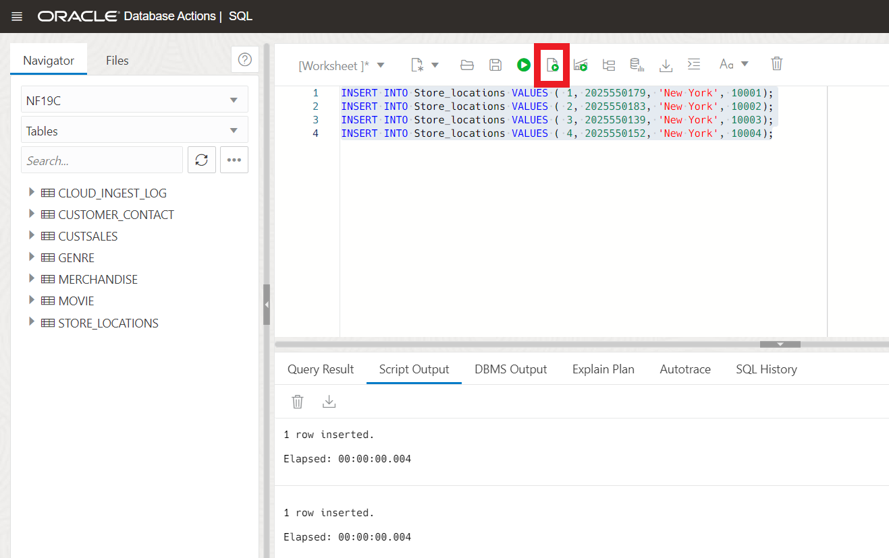

# Online Table Move

## Introduction
An Online Table Move is an Oracle 12.2 release that goes widely unused. You can now perform an online move of a table, as well as individual partitions and sub-partitions. 

This means that there is no longer a need for an outage to support the reorganization of tables. This inturn allows for a table move while transactions are running against it. Online table move also has the ability to filter and compress data as part of a move. For example if I were to have a table containing hundreds of thousands of order entry rows and I wanted to go through and clean out some of those, I would need to run a big DDL delete statement against that dataset. With ALTER TABLE MOVE ONLINE I can use a filter which effectively prunes out all of the old orders from the table and gives the ability to apply compression to the new dataset as well. 

Here we will stick with our fictitious company Oracle MovieStreams and move their merchandise store locations table online while also enabling table compression.


Estimated Lab Time: 10 minutes

### Objectives

In this lab, you will:
* Use Online Table Move

### Prerequisites
* Have provisioned an Autonomous Database instance
* Have completed the 19C Setup Lab


## Task 1: Online Table Move
1. If you're not already looking at the SQL Developer Web interface, locate your Autonomous Database by clicking the hamburger menu in the top left of the screen, selecting Oracle Databases and choose Autonomous Database. **If you already have SQL Developer Web up, skip to step 3.**
 
  
 
2. Select the name of your database and click on the Database Actions button located at the top of the screen.

   

3. Lets start by creating a table and moving it offline to get a feel for how a table move works.

    ```
    <copy>
    CREATE TABLE STORE_LOCATIONS (
        store_id NUMBER,
        phone VARCHAR (25),
        state VARCHAR (10),
        zip_code VARCHAR (5)
    );
    </copy>
    ```

4. Lets add some data to our table. We will use the **Run Script button** for the remainder of this lab. Its located in the Database Actions console as shown in the gif below. (F5) works as well

    ```
    <copy>
    INSERT INTO STORE_LOCATIONS VALUES ( 1, 2025550179, 'New York', 10001);
    INSERT INTO STORE_LOCATIONS VALUES ( 2, 2025550183, 'New York', 10002);
    INSERT INTO STORE_LOCATIONS VALUES ( 3, 2025550139, 'New York', 10003);
    INSERT INTO STORE_LOCATIONS VALUES ( 4, 2025550152, 'New York', 10004);
    </copy>
    ```
    

5. Here we will go ahead and add a constraint and create an index on the locations by state. Lets use the **Run script button** as shown above. (F5) works as well.

    ```
    <copy>
    ALTER TABLE STORE_LOCATIONS ADD CONSTRAINT location_pk PRIMARY KEY (store_id);
    CREATE index location_index ON STORE_LOCATIONS(state);
    </copy>
    ```

6. Now that we have some test data lets move our table. Run the select statement after the alter table move. Notice how our Indexes are now Unstable. This is because the index is now referencing the wrong location. Lets use the **Run Script button** again 

    ```
    <copy>
    ALTER TABLE STORE_LOCATIONS MOVE;
    SELECT index_name, status FROM user_indexes WHERE index_name = 'LOCATION_INDEX' OR index_name = 'LOCATION_PK';
    </copy>
    ```

7. We will go ahead now and rebuild our indexes. Use the Run Script button and run the commands below to rebuild both.

    ```
    <copy>
    ALTER index location_index REBUILD ONLINE;
    ALTER index location_pk REBUILD ONLINE;
    SELECT index_name, status FROM user_indexes WHERE index_name = 'LOCATION_INDEX' OR index_name = 'LOCATION_PK';
    </copy>
    ```

8. Now we will move our table using the ONLINE keyword. Not only does this move the table but this automatically maintains the indexes. Use the Run Script button or press (F5)

    ```
   <copy>
    ALTER TABLE STORE_LOCATIONS MOVE ONLINE;
    SELECT index_name, status FROM user_indexes where index_name = 'LOCATION_INDEX' OR index_name = 'LOCATION_PK';
    </copy>
    ```


9. We also have the ability to change table compression and other storage parameters as an online operation. We can first see that our Store location table is uncompressed. 

    ```
    <copy>
    SELECT compression FROM user_tables WHERE table_name = 'STORE_LOCATIONS';
    </copy>
    ```

 Now we can move our table with compression. Use the Run Script button or press (F5) to execute the commands.

   ```
   <copy>
    ALTER TABLE STORE_LOCATIONS MOVE ONLINE COMPRESS;
    SELECT compression FROM user_tables WHERE table_name = 'STORE_LOCATIONS';
    </copy>
    ```

    ```
    <copy>
    SELECT compression FROM user_tables WHERE table_name = 'STORE_LOCATIONS';
    </copy>
    ```

 To recap, you now have the ability to perform a table move online, as well as individual partitions and sub-partitions without the need for an outage to support the reorganization of tables. This means the table indexes will be maintained for you as well. Online table move also has the ability to filter and compress data as part of a move. For more on this see the Learn More section

 You may now proceed to the next lab.

## Learn More
- [19c New Features](https://docs.oracle.com/en/database/oracle/oracle-database/19/newft/new-features.html#GUID-5490FE65-562B-49DC-9246-661592C630F9)


## Acknowledgements

* **Author** - Killian Lynch, Database Product Management
* **Contributors** - Dominic Giles 
* **Last Updated By/Date** - Killian Lynch March 202e