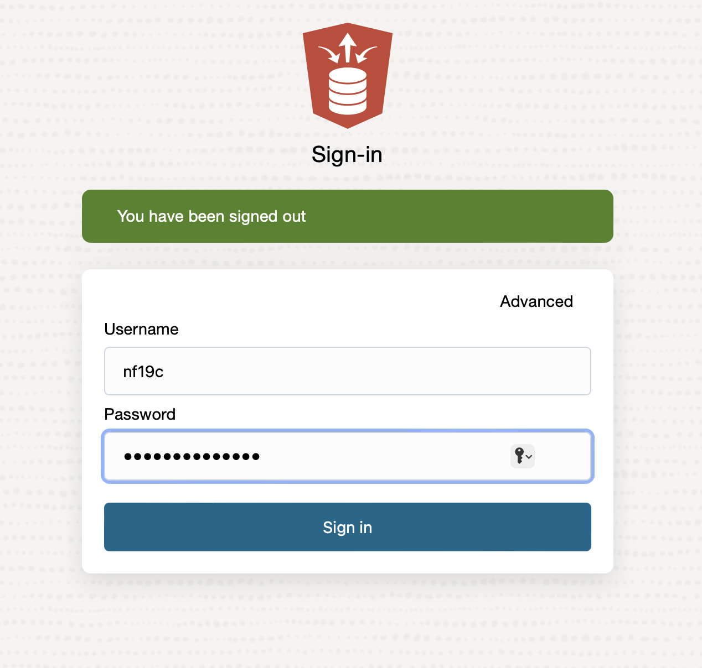
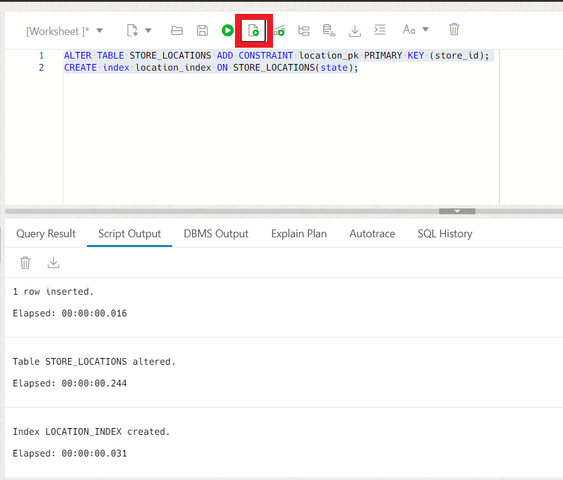

# Online Table Move

## Introduction
In this Lab, we will focus on Online Table Move, a powerful yet often overlooked feature of Oracle 12.2.

Online Table Move enables you to move a table, its partitions, and sub-partitions without downtime. This means that there is no longer a need for an outage to support the reorganization of tables. This inturn allows for a table move while transactions are running against it. Online table move also has the ability to filter and compress data as part of a move. For example if I were to have a table containing hundreds of thousands of order entry rows and I wanted to go through and clean out some of those, I would need to run a big DDL delete statement against that dataset. With ALTER TABLE MOVE ONLINE, I can use a filter which effectively prunes out all the old orders from the table and gives the ability to apply compression to the new dataset as well. 

To demonstrate the power of this feature, let's use our fictitious company, Oracle MovieStreams, as an example. We will move their merchandise store locations table online while enabling table compression to reduce storage costs.


Estimated Lab Time: 15 minutes

### Objectives

In this lab, you will:
* Use Online Table Move

### Prerequisites
* Have provisioned an Autonomous Database instance
* Have completed the 19C Setup Lab


## Task 1: Alter Table Move
1. **If you already have SQL Developer Web up and are logged in as the NF19C user on the SQL tile, skip to step 4.** If you're not already looking at the SQL Developer Web interface, locate your Autonomous Database by clicking the hamburger menu in the top left of the screen, selecting Oracle Databases and choose Autonomous Database. 
 
  
 
2. Select the name of your database and click on the Database Actions button located at the top of the screen.

   
   
3. Log into Database Actions as the NF19C user. Use the picture below to navigate to the SQL editor
	
	
	

4. Let's start by creating a table and moving it offline to get a feel for how a table move works.

    ```
    <copy>
    CREATE TABLE STORE_LOCATIONS (
        store_id NUMBER,
        phone VARCHAR (25),
        state VARCHAR (10),
        zip_code VARCHAR (5)
    );
    </copy>
    ```

5. Let's add some data to our table. We will use the **Run Script button** for the remainder of this lab. It's located in the Database Actions console as shown in the GIF below. (F5) works as well

    ```
    <copy>
    INSERT INTO STORE_LOCATIONS VALUES ( 1, 2025550179, 'New York', 10001);
    INSERT INTO STORE_LOCATIONS VALUES ( 2, 2025550183, 'New York', 10002);
    INSERT INTO STORE_LOCATIONS VALUES ( 3, 2025550139, 'New York', 10003);
    INSERT INTO STORE_LOCATIONS VALUES ( 4, 2025550152, 'New York', 10004);
    </copy>
    ```
    

6. Here we will go ahead and add a constraint and create an index on the locations by state. Let's use the **Run script button** as shown above. (F5) works as well.

    ```
    <copy>
    ALTER TABLE STORE_LOCATIONS ADD CONSTRAINT location_pk PRIMARY KEY (store_id);
    CREATE index location_index ON STORE_LOCATIONS(state);
    </copy>
    ```
    


7. Now that we have some test data, we'll move our table. Run the select statement after the alter table move. Notice how our Indexes are now Unstable. This is because the index is now referencing the wrong location. Let's use the **Run Script button** again 

    ```
    <copy>
    ALTER TABLE STORE_LOCATIONS MOVE;
    SELECT index_name, status FROM user_indexes WHERE index_name = 'LOCATION_INDEX' OR index_name = 'LOCATION_PK';
    </copy>
    ```

    

8. We will go ahead now and rebuild our indexes. Use the Run Script button and run the commands below to rebuild both.

    ```
    <copy>
    ALTER index location_index REBUILD ONLINE;
    ALTER index location_pk REBUILD ONLINE;
    </copy>
    ```

    

9. Next, we can run the same query as we did earlier to check the status of our indexes. Notice they are both valid. 
    ```
    <copy>
    SELECT index_name, status FROM user_indexes WHERE index_name = 'LOCATION_INDEX' OR index_name = 'LOCATION_PK';
    </copy>
    ```
    

## Task 2: Online Table Move

1. To move our table and automatically maintain its indexes, we'll use the ONLINE keyword. This avoids the need to rebuild the indexes manually. To execute this command, you can click the Run Script button or press (F5). Once the operation is complete, you'll notice that the indexes are still intact. 

    ```
   <copy>
    ALTER TABLE STORE_LOCATIONS MOVE ONLINE;
    SELECT index_name, status FROM user_indexes where index_name = 'LOCATION_INDEX' OR index_name = 'LOCATION_PK';
    </copy>
    ```
    


2. We also have the ability to change table compression and other storage parameters as an online operation. Lets go ahead and do this. We can first see that our Store location table is uncompressed. 

    ```
    <copy>
    SELECT compression FROM user_tables WHERE table_name = 'STORE_LOCATIONS';
    </copy>
    ```
    

3. Now we can move our table with compression. Use the Run Script button or press (F5) to execute the commands.

   ```
   <copy>
    ALTER TABLE STORE_LOCATIONS MOVE ONLINE COMPRESS;
    SELECT compression FROM user_tables WHERE table_name = 'STORE_LOCATIONS';
    </copy>
    ```

 To recap, we learned about the "ALTER TABLE MOVE ONLINE" feature in Oracle, which allows us to move a table to a different tablespace or compress it without causing any downtime to the application that uses the table.

 We started by discussing the benefits of using this feature, which include better resource management, minimized downtime, and enhanced database performance. We then went on to walk through the steps of using the "ALTER TABLE MOVE ONLINE" command, which involves specifying the name of the table and the new tablespace or compression type.

 We saw how the table remained available during the move, which allows  for the continuation of querying and updating of a table without any disruption to the application's availability. We also saw how we can compressing a table during the online move which can significantly reduce the amount of storage required and improve query response times.

Overall, the "ALTER TABLE MOVE ONLINE" feature is a valuable tool for database administrators who need to manage resources, optimize database performance, and minimize downtime. By understanding how to use this feature effectively, we can better manage our Oracle databases and improve the overall efficiency of our systems.

 You may now proceed to the next lab.

## Learn More
- [19c New Features](https://docs.oracle.com/en/database/oracle/oracle-database/19/newft/new-features.html#GUID-5490FE65-562B-49DC-9246-661592C630F9)


## Acknowledgements

* **Author** - Killian Lynch, Database Product Management
* **Contributors** - Dominic Giles 
* **Last Updated By/Date** - Killian Lynch March 2023