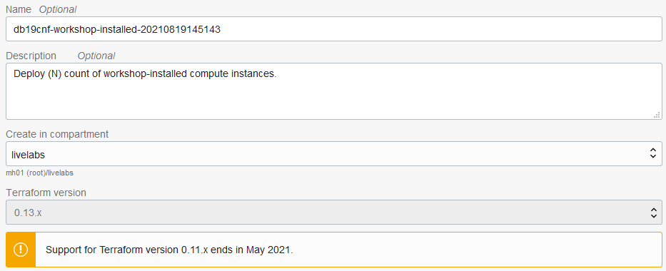
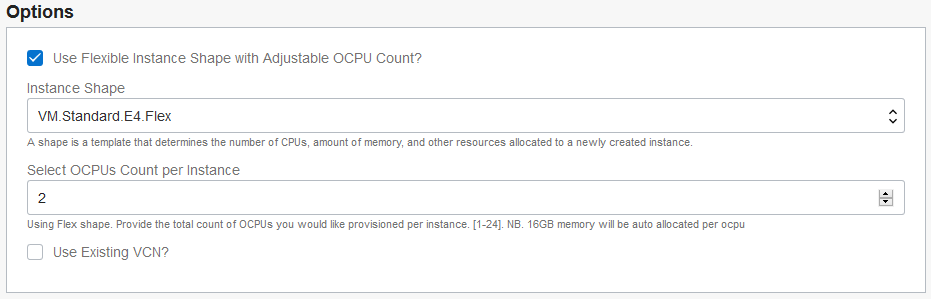
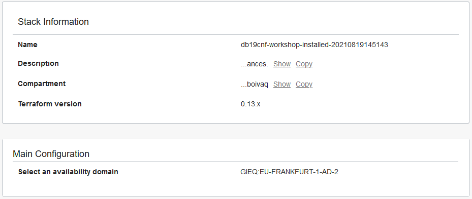
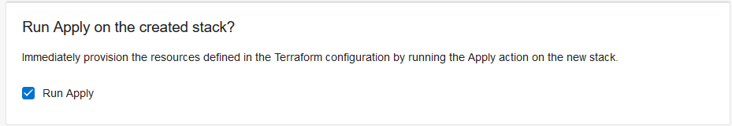
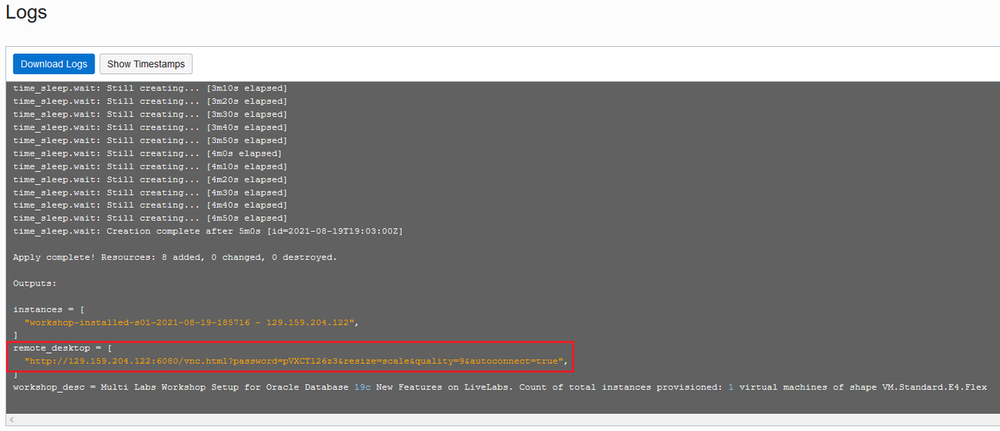
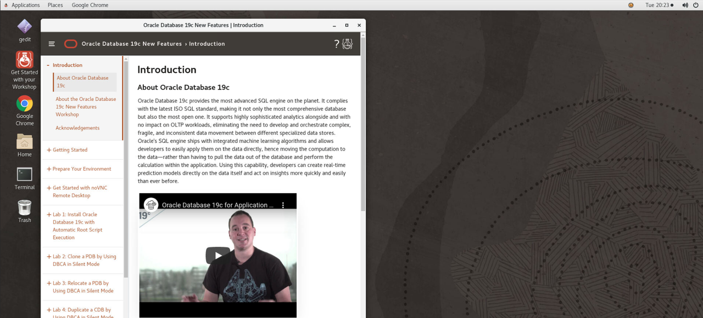

# Prepare Your Environment

## Introduction
Use Resource Manager in Oracle Cloud Infrastructure (OCI) to deploy the following instance for this workshop. This compute instance has an easy-to-use noVNC desktop, which you can access through a browser.
- `workshop-installed` - This will be the only compute instance used in this workshop.

To create the compute instance, you create and apply a stack in Resource Manager. A stack is a collection of Oracle Cloud Infrastructure resources corresponding to a given Terraform configuration. A Terraform configuration is a set of one or more TF files written in HashiCorp Configuration Language (HCL) that specify the Oracle Cloud Infrastructure resources to create. Oracle highly recommends that you let Resource Manager create a new VCN for you when creating the stacks for this workshop to ensure that you have all the proper connectivity required to access your compute instances and run the applications. If you accept, then you can skip Task 1. If you choose to use one of your own existing VCNs, be sure that your VCN has a public subnet and a routing table configured with an Internet Gateway. Your VCN also requires several security rules, which are covered in Task 1.

Estimated Time: 30 minutes

Watch the video below for a quick walk through of the lab.

### Objectives

In this lab, you will:

- Add security rules to your existing VCN
- Create a `workshop-installed` compute instance

### Prerequisites

This lab assumes you have:

- Obtained a free or paid Oracle Cloud account (Always Free accounts are not supported for this workshop)
- Signed in to Oracle Cloud Infrastructure

## Task 1: Add security rules to your existing VCN

To be able to access your compute instance, you need to configure egress and ingress security rules in your VCN's security list.

> **Note:** If you let Resource Manager create a new VCN for you when you create your compute instance (recommended), you can skip this task and proceed to Task 2.

1. From the navigation menu in Oracle Cloud Infrastructure, select **Networking**, and then **Virtual Cloud Networks**.

2. Select your VCN.

3. Under **Resources**, select **Security Lists**.

4. Click the your security list.

    Under **Resources** on the left, you can click **Ingress Rules** or **Egress Rules**. To add an egress rule, click **Egress Rules**, and then click the **Add Egress Rules** button. To add an ingress rule, click **Ingress Rules**, and then click the **Add Ingress Rules** button.

5. Add an egress rule with the following settings to allow outbound TCP traffic on all ports:

    - DESTINATION TYPE: CIDR
    - DESTINATION CIDR: 0.0.0.0/0
    - IP PROTOCOL: TCP
    - SOURCE PORT RANGE: All
    - DESTINATION PORT RANGE: All

6. Add an ingress rule with the following settings to allow inbound SSH traffic on port 22:

    - SOURCE TYPE: CIDR
    - SOURCE CIDR: 0.0.0.0/0
    - IP PROTOCOL: TCP
    - SOURCE PORT RANGE: All
    - DESTINATION PORT RANGE: 22

7. Add an ingress rule with the following settings to allow inbound TCP traffic on port 6080:

    - SOURCE TYPE: CIDR
    - SOURCE CIDR: 0.0.0.0/0
    - IP PROTOCOL: TCP
    - SOURCE PORT RANGE: All
    - DESTINATION PORT RANGE: 6080

8. Add an ingress rule with the following settings to allow inbound ICMP traffic:

    - SOURCE TYPE: CIDR
    - SOURCE CIDR: 0.0.0.0/0
    - IP PROTOCOL: ICMP
    - TYPE: 3
    - CODE: 4

9. Add an ingress rule with the following settings to allow inbound traffic for all IP protocols on IP addresses 10.0.0.0 to 10.0.255.255.

    - SOURCE TYPE: CIDR
    - SOURCE CIDR: 10.0.0.0/16
    - IP PROTOCOL: All Protocols

## Task 2: Create a `workshop-installed` compute instance

1. Download [db19cnf-workshop-installed.zip](https://objectstorage.us-ashburn-1.oraclecloud.com/p/jyHA4nclWcTaekNIdpKPq3u2gsLb00v_1mmRKDIuOEsp--D6GJWS_tMrqGmb85R2/n/c4u04/b/livelabsfiles/o/labfiles/db19cnf-workshop-installed.zip) to a directory on your local computer.

2. On the home page in Oracle Cloud Infrastructure, click **Create a stack**.

    

    The **Create Stack - Stack Information** page is displayed.

3. Select **My Configuration**.

4. In the **Stack Configuration** section, select **.Zip file**, click **Browse**, select the `db19cnf-workshop-installed.zip` file that you just downloaded, and then click **Open**.

    

5. In the **Stack Information** section, leave the **Name** and **Description** for the stack as is, and select your compartment.

    This compartment is used to store the stack, the VCN (if you choose to create a new one), and the `workshop-staged` compute instance. If you plan to use your own VCN, make sure that it resides in this compartment too.

    

6. Click **Next**. The **Configure Variables** page is displayed.

7. In the **Main Configuration** section, leave **1** selected for the instance count, and select one of your availability domains.

    

8. In the **Options** section, select an instance shape and select whether you want to use an existing VCN.

    Consider the following when selecting a shape:

    - If you are still within your free trial period, Oracle recommends that you select the **VM.Standard.E2.4** or **VM.Standard2.2** shape. The VM.Standard.E2.4 shape comes with 4 OCPUs and 32GB of RAM. The VM.Standard2.2 shape comes with 2 OCPUs and 30GB of RAM.
    - If you are using a paid Oracle Cloud account, Oracle recommends that you select a shape that has 2 OCPUs and 32GB of RAM or more. The default is the **VM.Standard.E4.Flex** shape with **2** OCPUs, which provides 32GB of RAM. If you change the shape, be sure that you have enough quota available in your tenancy.

    Consider the following when configuring the VCN:

    - Leave the **Use Existing VCN** check box deselected if you want Resource Manager to create a VCN for you (recommended).
    - You can also use your own VCN. To do so, select **Use Existing VCN**, and then select your VCN and public subnet. Your VCN must have a public subnet and a routing table configured with an Internet Gateway. It also requires egress and ingress security rules, which are specified in Task 1 above. Your VCN needs to reside in the compartment that you selected in the **Stack Information** section.

    

9. Click **Next**.

    The **Review** page is displayed.

10. Verify that the information is correct.

    

11. In the **Run Apply on the created stack** section, select **Run Apply** to immediately provision the resources.

    

12. Click **Create**.

    Resource Manager starts provisioning your compute instance and the **Job Details** page is displayed. You can monitor the progress of the job by viewing the details in the log. The job is finished when the state reads **Succeeded**. Please allow 5 minutes for the job to complete.

13. Scroll down to the end of the log. Locate the `remote-desktop` address and copy it to the clipboard. Don't include the double-quotation marks. The address syntax is `http://[your instance public-ip address]:6080/vnc.html?password=[encrypted password]&resize=scale&quality=9&autoconnect=true`.

    

14. In a browser, paste the address to your `workshop-installed` compute instance and wait between 30 and 60 seconds.

    You are automatically logged in to your compute instance and presented with a user-friendly desktop. If you don't wait, you may get a message stating that the proxy could not connect to the destination in time.

    

## Learn More

- [Resource Manager](https://docs.oracle.com/en-us/iaas/Content/ResourceManager/Concepts/landing.htm#ResourceManager)
- [Video about Resource Manager](https://youtu.be/udJdVCz5HYs)
- [Oracle Cloud Marketplace](https://cloudmarketplace.oracle.com/marketplace/en_US/homePage.jspx)

## Acknowledgements

- **Author**- Matthew McDaniel, Austin Specialist Hub
- **Last Updated By/Date** - Matthew McDaniel, Austin Specialists Hub, March 28 2022
