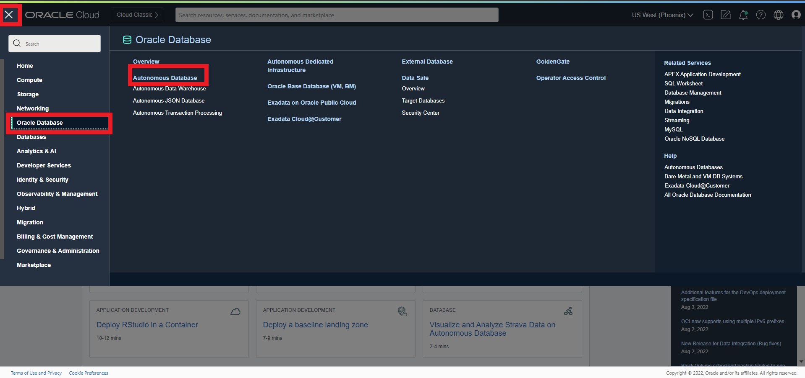
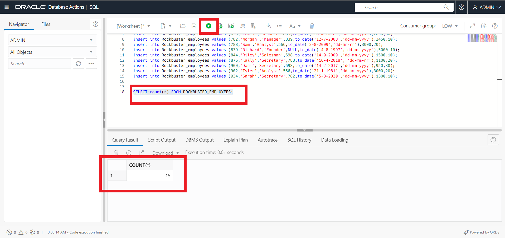
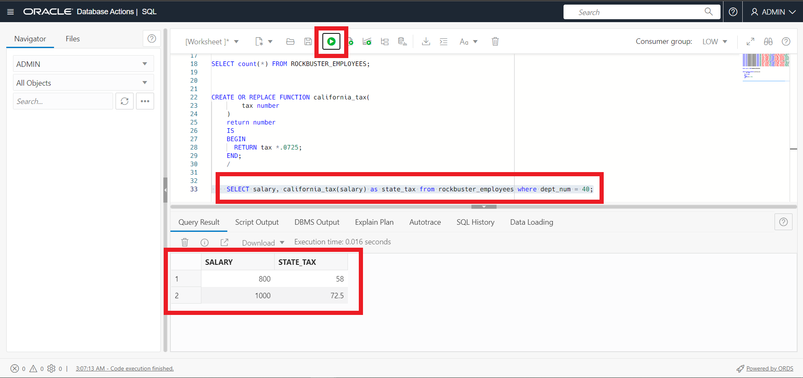
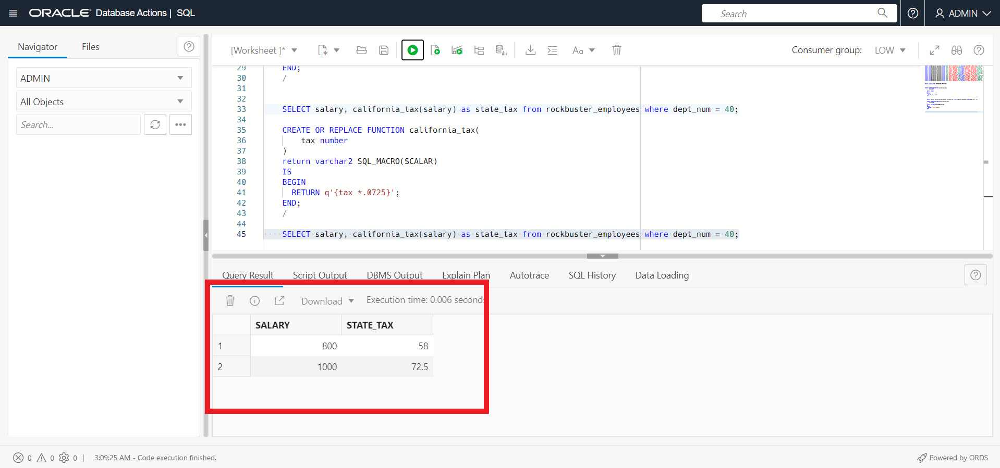
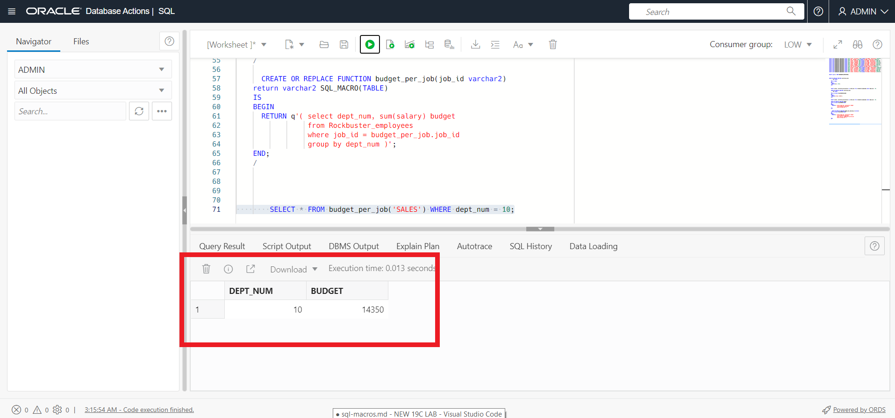
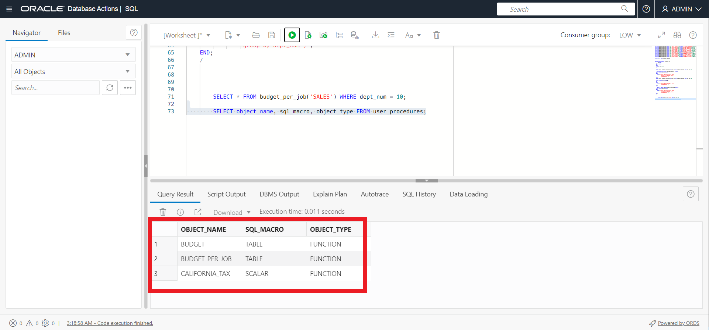

# Using SQM Scalar and Table Expressions

## Introduction
This lab only contains a small section of the SQL updates added to Oracle Database 19c. For the full list see the 'Learn More' section at the bottom. SQL Macros is a new, simpler way to encapsulate complex processing logic directly within SQL. SQL Macros allow developers to encapsulate complex processing within a new structure called a "macro" which can then be used within SQL statement. Essentially there two types of SQL Macros: SCALAR and TABLE.  SCALAR expressions can be used in SELECT list, WHERE/HAVING, GROUP BY/ORDER BY clauses.  TABLE expressions are used in a FROM-clause.

You can create SQL Macros (SQM) to factor out common SQL expressions and statements into reusable, parameterized constructs that can be used in other SQL statements. SQL Macros have an important advantage over ordinary PL/SQL functions in that they make the reusable SQL code completely transparent to the optimizer – and that brings big benefits! It makes it possible for the optimizer to transform the original code for efficient execution because the underlying query inside the macro function can be merged into outer query. That means there is no context switching between PL/SQL and SQL and the query inside the macro function is now executed under same snapshot as outer query. So we get both simplicity and faster execution.

This lab shows how to use SQL Macro as scalar and table expressions.

Estimated Lab Time: 15 minutes

Watch the video below for a quick walk through of the lab.
[Using SQM Scalar and Table Expressions](videohub:1_mdq4mino)

### Objectives

In this lab, you will:
* Create SQL Macros as scalar expressions 
* Create SQL Macros as table expressions

### Prerequisites
* Have an Autonomous Database provisioned.

## Task 1: Use SQL Macros as scalar expressions

1. To set the stage, we will be creating an employee and department table for our fictitious company RockBuster and inserting some data.
 
 If you're not already looking at the SQL Developer Web interface, locate your Autonomous Database by clicking the hamburger menu in the top left of the screen, selecting Oracle Databases and choose Autonomous Database. **If you already have SQL Developer Web up, skip to step 3.**
 
  
 
 2. Select the name of your database and click on the Database Actions button located at the top of the screen.

   

3. Lets insert some data and run each statement separately.
    ```
    <copy>
create table Rockbuster_departments (
  dept_num number(2) constraint pk_dept_num primary key,
  dept_name varchar2(20),
  dept_loc varchar2(20)
) ;
    </copy>
    ```

    ```
    <copy>
create table Rockbuster_employees (
  emp_num number(3) constraint pk_emp_num primary key,
  emp_name varchar2(15),
  job varchar2(10),
  manager number(4),
  hire_date date,
  salary number(7,2),
  dept_num number(2) constraint fk_dept_num references Rockbuster_departments
);
    </copy>
    ```

    ```
    <copy>
insert into Rockbuster_departments values (10,'Sales','New York');
insert into Rockbuster_departments values (20,'Marketing','Austin');
insert into Rockbuster_departments values (30,'IT','Washington');
insert into Rockbuster_departments values (40,'HR','California');
    </copy>
    ```

    ```
    <copy>
insert into Rockbuster_employees values (369,'Smith','Secretary',486,to_date('16-2-2003','dd-mm-yyyy'),800,40);
insert into Rockbuster_employees values (486,'Dan','Manager',839,to_date('5-8-2002','dd-mm-yyyy'),1000,40);
insert into Rockbuster_employees values (499,'Frank','Salesman',698,to_date('8-3-2000','dd-mm-yyyy'),1600,10);
insert into Rockbuster_employees values (521,'Sally','Salesman',698,to_date('9-7-1999','dd-mm-yyyy'),1250,10);
insert into Rockbuster_employees values (566,'Johnny','Manager',839,to_date('13-3-1998','dd-mm-yyyy'),2975,20);
insert into Rockbuster_employees values (654,'Caleb','Salesman',698,to_date('25-9-2005','dd-mm-yyyy'),1250,10);
insert into Rockbuster_employees values (698,'Lewis','Manager',839,to_date('26-4-2016','dd-mm-yyyy'),2850,30);
insert into Rockbuster_employees values (782,'Morgan','Manager',839,to_date('12-7-2008','dd-mm-yyyy'),2450,10);
insert into Rockbuster_employees values (788,'Sam','Analyst',566,to_date('2-8-2009','dd-mm-rr'),3000,20);
insert into Rockbuster_employees values (839,'Richard','Founder',NULL,to_date('4-8-1997','dd-mm-yyyy'),5000,10);
insert into Rockbuster_employees values (844,'Riley','Salesman',698,to_date('14-9-2009','dd-mm-yyyy'),1500,10);
insert into Rockbuster_employees values (876,'Kaily','Secretary',788,to_date('16-4-2018', 'dd-mm-rr'),1100,20);
insert into Rockbuster_employees values (900,'Dani','Secretary',698,to_date('14-2-2017','dd-mm-yyyy'),950,30);
insert into Rockbuster_employees values (902,'Tyler','Analyst',566,to_date('21-1-1981','dd-mm-yyyy'),3000,20);
insert into Rockbuster_employees values (934,'Sarah','Secretary',782,to_date('5-3-2020','dd-mm-yyyy'),1300,10);

    </copy>
    ```

    Lets query the data to make sure everything is there. We will check the employees table. We should see 15 rows.
    ```
    <copy>
    SELECT count(*) FROM ROCKBUSTER_EMPLOYEES;
    </copy>
    ```

    

4. First, lets look at creating a function and NOT using SQL macros. Lets say we were interested in calculating the tax on our employees salaries in california. Lets create a function called california_tax.

    ```
    <copy>
    CREATE OR REPLACE FUNCTION california_tax(
        tax number
    )
    return number 
    IS
    BEGIN
      RETURN tax *.0725;
    END;
    /
    </copy>
    ```
5. Now lets take a look at our results.

    ```
    <copy>
    SELECT salary, california_tax(salary) as state_tax from rockbuster_employees where dept_num = 40;
    </copy>
    ```
    That works fine. However calling a function from SQL takes CPU overhead. In the case of this demo it may not be much, but switching between SQL and PL/SQL causes CPU usage and it can become significant as our use case increases. 

    


6. Now lets recreate our function as a SQL Macro Scalar. It will follow a very similar approach.

    ```
    <copy>
    CREATE OR REPLACE FUNCTION california_tax(
        tax number
    )
    return varchar2 SQL_MACRO(SCALAR)
    IS
    BEGIN
      RETURN q'{tax *.0725}';
    END;
    /
    </copy>
    ```
7. Again, lets take a look at our results.

    ```
    <copy>

    SELECT salary, california_tax(salary) as state_tax from rockbuster_employees where dept_num = 40;

    </copy>
    ```
    


    We also have the ability to set SQL tracing with Autonomous database and check the files to compare our PL/SQL vs SQM, however we wont cover that here today. If you're interested in learning more see the 'Learn More' section below.

## Task 2: Use SQL Macros as table expressions 

1. Lets go ahead and create another SQL Macro. This time we will be looking at creating SQL Macros as table expressions. We're going to create the macro to calculate the budget for RockBusters different departments.

    ```
    <copy>
    CREATE OR REPLACE FUNCTION budget
    return varchar2 SQL_MACRO(TABLE)
    IS
    BEGIN
      RETURN q'( select dept_num, sum(salary) budget
                 from Rockbuster_employees
                 group by dept_num )';
    END;
    /
    </copy>
    ```
2. Use the SQM to display the result for the departments sales(10) and IT(30).

    ```
    <copy>
    SELECT * FROM budget() WHERE dept_num IN (10,30);
    </copy>
    ```

    


3. Now we'll use another SQL macro as a table expression to show how to  display sum of the salaries per department for a particular job.  Lets create the SQM.

    ```
    <copy>
    CREATE OR REPLACE FUNCTION budget_per_job(job_id varchar2)
    return varchar2 SQL_MACRO(TABLE)
    IS
    BEGIN
      RETURN q'( select dept_num, sum(salary) budget
                 from Rockbuster_employees
                 where job_id = budget_per_job.job_id
                 group by dept_num )';
    END;
    /
    </copy>
    ```


4. Use the SQM to display the result for the `SALES` job in department 10.

    ```
    <copy>
    SELECT * FROM budget_per_job('SALES') WHERE dept_num = 10;
    </copy>
    ```

   
    


5. We can see that creating SQL Macros is similar to creating user defined functions. To reiterate, SQL macros doesn't cause the additional CPU overhead that functions do. Rather than performing any action during the query execution, the SQM actions occurs during the optimization of the query. 

6. Last, we can use the `USER_PROCEDURES` view to display the values of the `SQL_MACRO` column.

    ```
    <copy>
    SELECT object_name, sql_macro, object_type FROM user_procedures;
    </copy>
    ```

   

## Task 3: [Bonus] Alter table move online 

Alter table move online is an Oracle 12.2 release that goes widely unused. You can now perform an online move of a table, as well as individual partitions and sub-partitions. This means that there is no longer a need for an outage to support the reorganization of tables. This inturn allows for a table move while transactions are running against it. Online table move also has the ability to filter and compress data as part of a move. For example if I were to have a table containing hundreds of thousands of order entry rows and I wanted to go through and clean out some of those, I would need to run a big DDL delete statement against that dataset. With ALTER TABLE MOVE ONLINE I can use a filter which effectively prunes out all of the old orders from the table and gives the ability to apply compression to the new dataset as well. Here we will stick with our fictitious company RockBuster and move their store locations table online while also enabling table compression.

1. Lets start by creating a table and moving it offline to get a feel for how a table move works.

    ```
    <copy>
CREATE TABLE RockBuster_locations (
	store_id NUMBER,
	phone VARCHAR (25),
	state VARCHAR (10),
	zip_code VARCHAR (5)
);
    </copy>
    ```
2. Lets add some data to our table.

    ```
    <copy>
INSERT INTO ROCKBUSTER_LOCATIONS VALUES ( 1, 2025550179, 'New York', 10001);
INSERT INTO ROCKBUSTER_LOCATIONS VALUES ( 2, 2025550183, 'New York', 10002);
INSERT INTO ROCKBUSTER_LOCATIONS VALUES ( 3, 2025550139, 'New York', 10003);
INSERT INTO ROCKBUSTER_LOCATIONS VALUES ( 4, 2025550152, 'New York', 10004);
    </copy>
    ```

3. Here we will go ahead and add a constrain and create an index on the locations by state. 

    ```
    <copy>
    ALTER TABLE ROCKBUSTER_LOCATIONS add constraint location_pk PRIMARY KEY (store_id);
create index location_index on RockBuster_locations(state);
    </copy>
    ```

4. Now that we have some test data lets move our table. Run the select statement after the alter table move. Notice how our Indexes are now Unstable. This is because the index is now referencing the wrong location.

    ```
    <copy>
    ALTER TABLE RockBuster_locations MOVE;
SELECT index_name, status FROM user_indexes where index_name = 'LOCATION_INDEX' OR index_name = 'LOCATION_PK';
    </copy>
    ```

5. We will go ahead now and rebuild our indexes. run the command below to rebuild both.

    ```
    <copy>
    alter index location_index REBUILD ONLINE;
alter index location_pk REBUILD ONLINE;
SELECT index_name, status FROM user_indexes where index_name = 'LOCATION_INDEX' OR index_name = 'LOCATION_PK';
    </copy>
    ```

6. Now we will move our table using the ONLINE keyword. Not only does this move the table but this automatically maintains the indexes.

    ```
   <copy>
    ALTER TABLE RockBuster_locations MOVE ONLINE;
    SELECT index_name, status FROM user_indexes where index_name = 'LOCATION_INDEX' OR index_name = 'LOCATION_PK';
    </copy>
    ```


7. We also have the ability to change table compression and other storage parameters ann online operation. We can first see that our Rockbuster table is uncompressed. 

    ```
    <copy>
    SELECT compression
    FROM   user_tables
    WHERE  table_name = 'ROCKBUSTER_LOCATIONS';
    </copy>
    ```

 Now we can move our table with compression.

   ```
   <copy>
    ALTER TABLE RockBuster_locations MOVE ONLINE COMPRESS;
    SELECT compression
    FROM   user_tables
    WHERE  table_name = 'ROCKBUSTER_LOCATIONS';
    </copy>
    ```
 To recap, you now have the ability to perform a table move online, as well as individual partitions and sub-partitions without the need for an outage to support the reorganization of tables. This means the table indexes will be maintained for you as well. Online table move also has the ability to filter and compress data as part of a move. For more on this see the Learn More section

You may now proceed to the next lab.

## Learn More
- [19c New Features](https://docs.oracle.com/en/database/oracle/oracle-database/19/newft/new-features.html#GUID-5490FE65-562B-49DC-9246-661592C630F9)
- [SQL Macros - LiveSQL](https://livesql.oracle.com/apex/livesql/file/tutorial_KQNYERE8ZF07EZMRR6KJ0RNIR.html)
- [SQL Macros on ADB](https://blogs.oracle.com/datawarehousing/sql-macros-have-arrived-in-autonomous-database)
- [Configure SQL Tracing](https://docs.oracle.com/en/cloud/paas/autonomous-database/adbsa/application-tracing-configure.html#GUID-542ED992-FF58-498A-9C24-0F531AC981BE)
- [Move Table Online](https://docs.oracle.com/en/database/oracle/oracle-database/12.2/sqlrf/ALTER-TABLE.html#GUID-552E7373-BF93-477D-9DA3-B2C9386F2877)

## Acknowledgements

* **Author** - Killian Lynch, Database Product Management
* **Contributors** - Many thanks to Dominic Giles who helped tremendously  
* **Last Updated By/Date** - Killian Lynch July 2022
