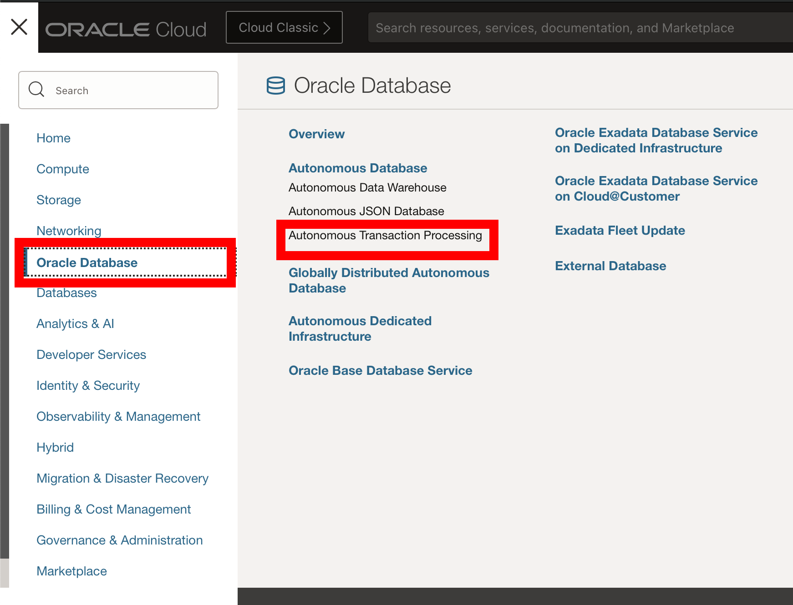
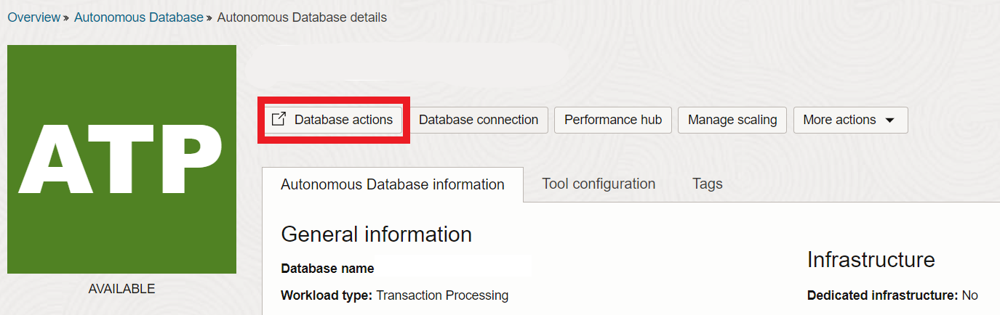
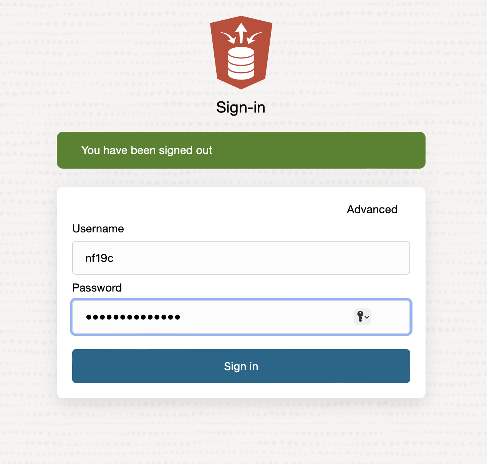
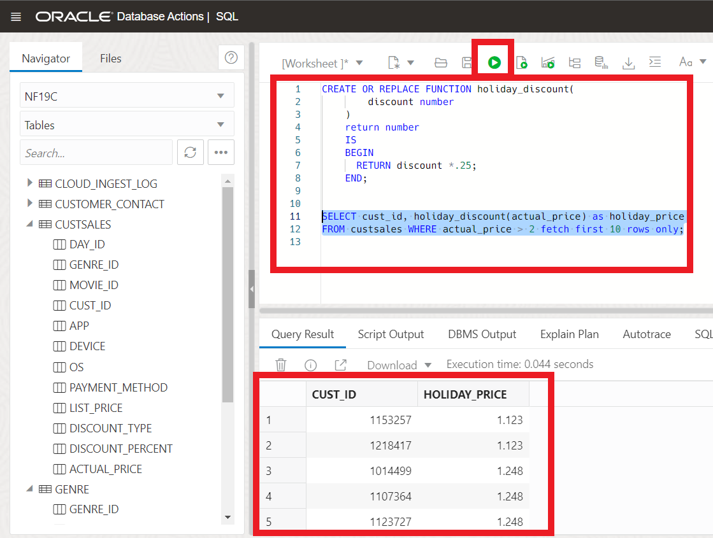
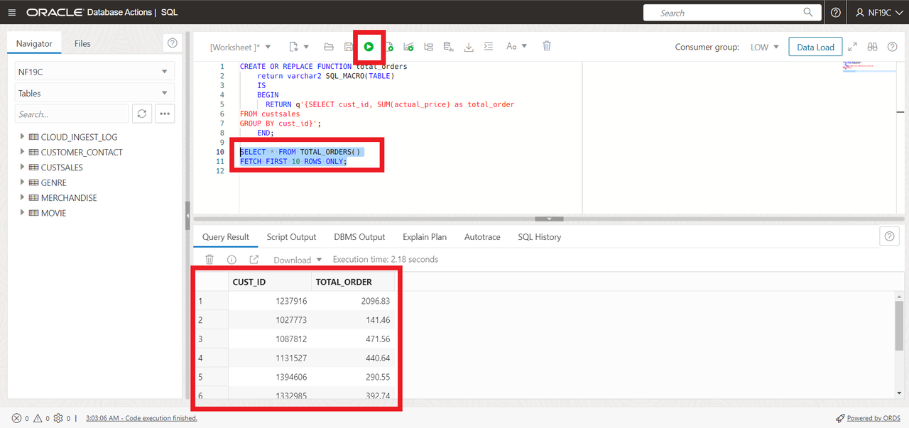

# Using SQM Scalar and Table Expressions

## Introduction
This lab only contains a small section of the SQL updates added to Oracle Database 19c. For the full list, see the 'Learn More' section at the bottom. SQL Macros is a new, simpler way to encapsulate complex processing logic directly within SQL. SQL Macros allow developers to encapsulate complex processing within a new structure called a "macro" which can then be used within SQL statement. Essentially, there are two types of SQL Macros: SCALAR and TABLE.  SCALAR expressions can be used in SELECT list, WHERE/HAVING, GROUP BY/ORDER BY clauses.  TABLE expressions are used in a FROM-clause.

You can create SQL Macros (SQM) to factor out common SQL expressions and statements into reusable, parameterized constructs that can be used in other SQL statements. SQL Macros have an important advantage over ordinary PL/SQL functions in that they make the reusable SQL code completely transparent to the optimizer – and that brings big benefits! It makes it possible for the optimizer to transform the original code for efficient execution because the underlying query inside the macro function can be merged into the outer query. That means there is no context switching between PL/SQL and SQL and the query inside the macro function is now executed under the same snapshot as the outer query. So we get both simplicity and faster execution.

This lab shows how to use SQL Macro as scalar and table expressions.

Estimated Lab Time: 15 minutes

Watch the video below for a quick walk through of the lab.
[Using SQM Scalar and Table Expressions](videohub:1_mdq4mino)

### Objectives

In this lab, you will:
* Create SQL Macros as scalar expressions 
* Create SQL Macros as table expressions

### Prerequisites
* Have an Autonomous Database provisioned.
* Have completed the 19C Setup Lab

## Task 1: Use SQL Macros as scalar expressions

1. **If you already have SQL Developer Web up and are logged in as the NF19C user, skip to step 4.** If you're not already looking at the SQL Developer Web interface, locate your Autonomous Database by clicking the hamburger menu in the top left of the screen, selecting Oracle Databases and choose Autonomous Database. 
 
  
 
2. Select the name of your database and click on the Database Actions button located at the top of the screen.

   
   
3. Log into Database Actions as the NF19C user. Use the picture below to navigate to the SQL editor
	
	
	

4. First, we will focus on developing a function without employing SQL macros. Suppose we intend to offer a holiday discount to our customers. In that case, we can create a function named holiday\_discount.

    ```
    <copy>
    CREATE OR REPLACE FUNCTION holiday_discount(
        discount number
    )
    return number
    IS
    BEGIN
      RETURN discount *.25;
    END;
    /
    </copy>
    ```
5. Now let's take a look at our results.

    ```
    <copy>
    SELECT cust_id, holiday_discount(actual_price) as holiday_price
    FROM custsales where actual_price > 2 fetch first 10 rows only;
    </copy>
    ```
    That works fine. However, calling a function from SQL takes CPU overhead. In the case of this demo it may not be much, but switching between SQL and PL/SQL causes CPU usage and it can become significant as our use case increases. 

    


6. Now, let's recreate our function as a SQL Macro Scalar. It will follow a very similar approach.

    ```
    <copy>
    CREATE OR REPLACE FUNCTION holiday_discount(
        discount number
    )
    return varchar2 SQL_MACRO(SCALAR)
    IS
    BEGIN
      RETURN q'{discount *.25}';
    END;
    /
    </copy>
    ```
7. Again, we can take a look at our results.

    ```
    <copy>

    SELECT cust_id, holiday_discount(actual_price) as holiday_price
    FROM custsales WHERE actual_price > 2 fetch first 10 rows only;

    </copy>
    ```


    We also have the ability to set SQL tracing with Autonomous database and check the files to compare our PL/SQL vs SQL Macros, however we won't cover that here today. If you're interested in learning more, see the 'Learn More' section below.

## Task 2: Use SQL Macros as table expressions 

1. Let's go ahead and create another SQL Macro. This time, we will be looking at creating SQL Macros as table expressions. We're going to create the macro to calculate the total sales per customer.

    ```
    <copy>
    CREATE OR REPLACE FUNCTION total_orders
        return varchar2 SQL_MACRO(TABLE)
        IS
        BEGIN
            RETURN q'{SELECT cust_id, SUM(actual_price) AS total_order
    FROM custsales
    GROUP BY cust_id}';
    END;
    /
    </copy>
    ```
2. Use the SQM to display the result for the total orders by department;

    ```
    <copy>
    SELECT * FROM TOTAL_ORDERS()
    FETCH FIRST 10 ROWS ONLY;
    </copy>
    ```

    


3. We can see that creating SQL Macros is similar to creating user defined functions. To reiterate, using SQL macros doesn't cause the additional CPU overhead that functions do. Rather than performing any action during the query execution, the SQM actions occur during the optimization of the query. 

6. Last, we can use the `USER_PROCEDURES` view to display the values of the `SQL_MACRO` column.

    ```
    <copy>
    SELECT object_name, sql_macro, object_type FROM user_procedures;
    </copy>
    ```

You may now proceed to the next lab.

## Learn More
- [19c New Features](https://docs.oracle.com/en/database/oracle/oracle-database/19/newft/new-features.html#GUID-5490FE65-562B-49DC-9246-661592C630F9)
- [SQL Macros - LiveSQL](https://livesql.oracle.com/apex/livesql/file/tutorial_KQNYERE8ZF07EZMRR6KJ0RNIR.html)
- [SQL Macros on ADB](https://blogs.oracle.com/datawarehousing/sql-macros-have-arrived-in-autonomous-database)
- [Configure SQL Tracing](https://docs.oracle.com/en/cloud/paas/autonomous-database/adbsa/application-tracing-configure.html#GUID-542ED992-FF58-498A-9C24-0F531AC981BE)
- [Move Table Online](https://docs.oracle.com/en/database/oracle/oracle-database/12.2/sqlrf/ALTER-TABLE.html#GUID-552E7373-BF93-477D-9DA3-B2C9386F2877)

## Acknowledgements

* **Author** - Killian Lynch, Database Product Management
* **Contributors** - Dominic Giles
* **Last Updated By/Date** - Killian Lynch June 2024
