# Manage Blockchain Tables

## Introduction

Blockchain tables are append-only tables in which only insert operations are allowed. Deleting rows is either prohibited or restricted based on time. Rows in a blockchain table are made tamper-resistant by special sequencing & chaining algorithms. Users can verify that rows have not been tampered. A hash value that is part of the row metadata is used to chain and validate rows.

Blockchain tables enable you to implement a centralized ledger model where all participants in the blockchain network have access to the same tamper-resistant ledger.

A centralized ledger model reduces administrative overheads of setting a up a decentralized ledger network, leads to a relatively lower latency compared to decentralized ledgers, enhances developer productivity, reduces the time to market, and leads to significant savings for the organization. Database users can continue to use the same tools and practices that they would use for other database application development.

This lab walks you through the steps to create a Blockchain table, insert data, manage the rows in the table and manage the blockchain table. Then you will explore how to sign a row and verify the blockchain table by creating a certificates directory and adding your certificate to it, generating the row bytes for the row you want to sign and signing the row and then verifying the blockchain table.

Estimated Lab Time: 30 minutes

### Objectives

In this lab, you will:

* Create the Blockchain table and insert rows
* Manage blockchain tables and rows in a blockchain table
* Create a certificate directory and add your certificate
* Generate row bytes for a row and sign the row in blockchain table
* Check the validity of rows in the blockchain table with and without signature

### Prerequisites

* An Oracle Free Tier, Always Free, Paid or LiveLabs Cloud Account
* Provisioned an Oracle Database 21c Instance
* Have successfully completed the Setup lab

## Task 1: Connect to ADB with SQL Developer Web

Please proceed to next step if you are already connected to Autonomous Database with SQL Developer Web as a ADMIN user.

1. Login to Oracle Cloud if you are not already logged in.

2. To navigate to your Autonomous Database, click on the hamburger menu on the top left corner of the Oracle Cloud console and select the Autonomous Database flavor (ATP, ADW or AJD) you provisioned.

	

3. If you can't find your ADB instance, ensure you are in the correct region, compartment and have chosen the right flavor of your ADB instance.

	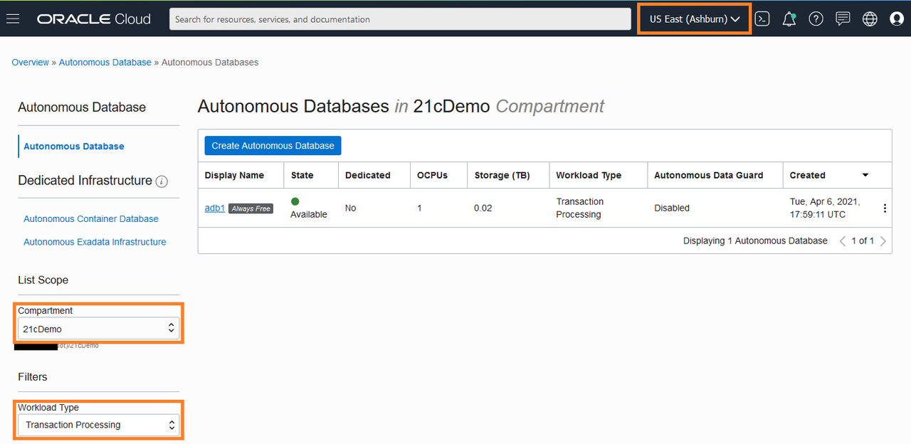

4. Click on the Display Name of your ADB instance to navigate to your ADB instance details page.

	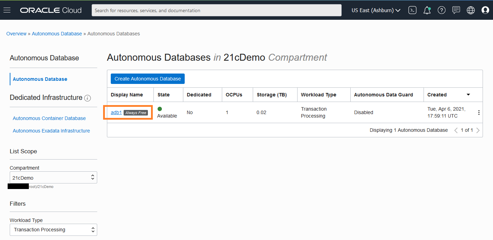

5. Click on the **Tools** tab, select **Database Actions**, a new tab will open up.

	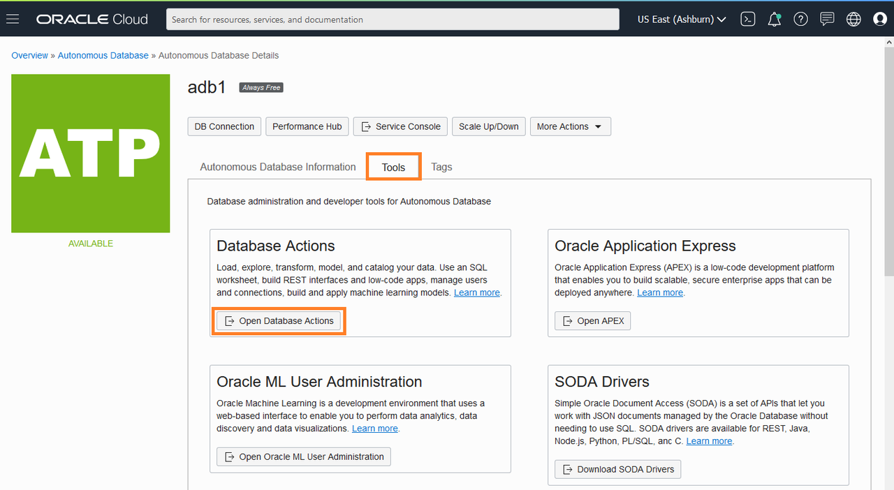

6. Provide the **Username - ADMIN** and click **Next**.

	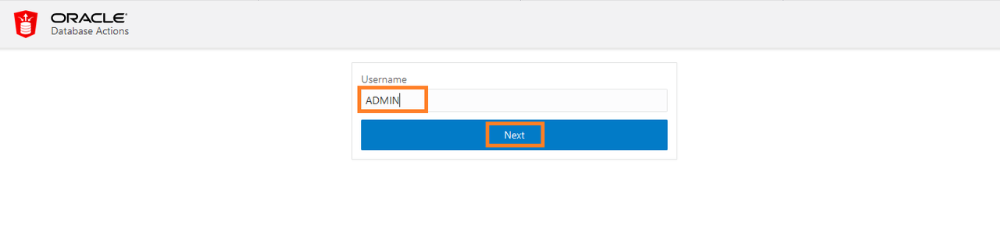

7. Now provide the **Password - WElcome123##** for the ADMIN user you created when you provisioned your ADB instance and click **Sign in** to sign in to Database Actions.

	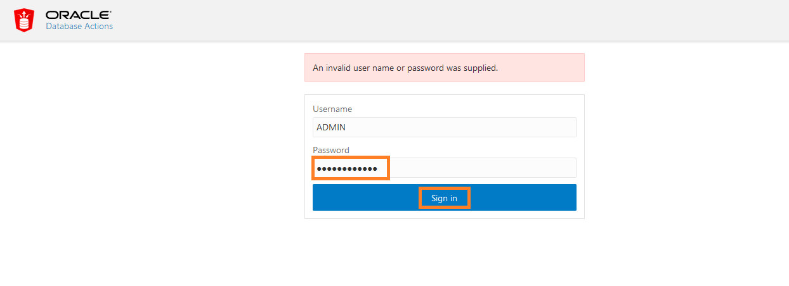

8. Click on **SQL** under the Development section to sign in to SQL Developer Web as an ADMIN user.

	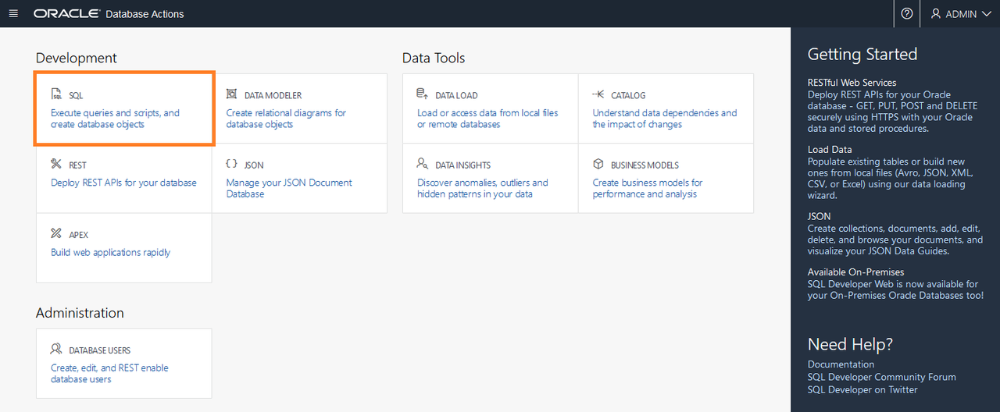

## Task 2: Create a blockchain table and insert rows

1. The `CREATE BLOCKCHAIN TABLE` statement requires additional attributes. The `NO DROP`, `NO DELETE`, `HASHING USING`, and `VERSION` clauses are mandatory.

    Create a Blockchain table named `bank_ledger` that will maintain a tamper-resistant ledger of current and historical transactions using the SHA2_512 hashing algorithm. Rows of the `bank_ledger` blockchain table can never be deleted. Moreover the blockchain table can be dropped only after 16 days of inactivity.

	```
	<copy>
	CREATE BLOCKCHAIN TABLE bank_ledger (bank VARCHAR2(128), deposit_date DATE, deposit_amount NUMBER)
	NO DROP UNTIL 16 DAYS IDLE
	NO DELETE LOCKED
	HASHING USING "SHA2_512" VERSION "v1";
	</copy>
	```

	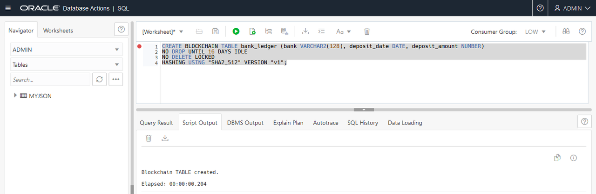

2. Describe the `bank_ledger` blockchain table to view the columns. Notice that the description displays only the visible columns.

	```
	<copy>
	DESC bank_ledger;
	</copy>
	```

	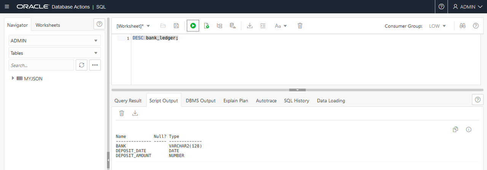

3. Insert records into the `bank_ledger` blockchain table.

	```
	<copy>
	INSERT INTO bank_ledger VALUES (999,to_date(sysdate,'dd-mm-yyyy'),100);
	INSERT INTO bank_ledger VALUES (999,to_date(sysdate,'dd-mm-yyyy'),200);
	INSERT INTO bank_ledger VALUES (999,to_date(sysdate,'dd-mm-yyyy'),500);
	INSERT INTO bank_ledger VALUES (999,to_date(sysdate,'dd-mm-yyyy'),-200);
	INSERT INTO bank_ledger VALUES (888,to_date(sysdate,'dd-mm-yyyy'),100);
	INSERT INTO bank_ledger VALUES (888,to_date(sysdate,'dd-mm-yyyy'),200);
	INSERT INTO bank_ledger VALUES (888,to_date(sysdate,'dd-mm-yyyy'),500);
	INSERT INTO bank_ledger VALUES (888,to_date(sysdate,'dd-mm-yyyy'),-200);
	commit;
	</copy>
	```

	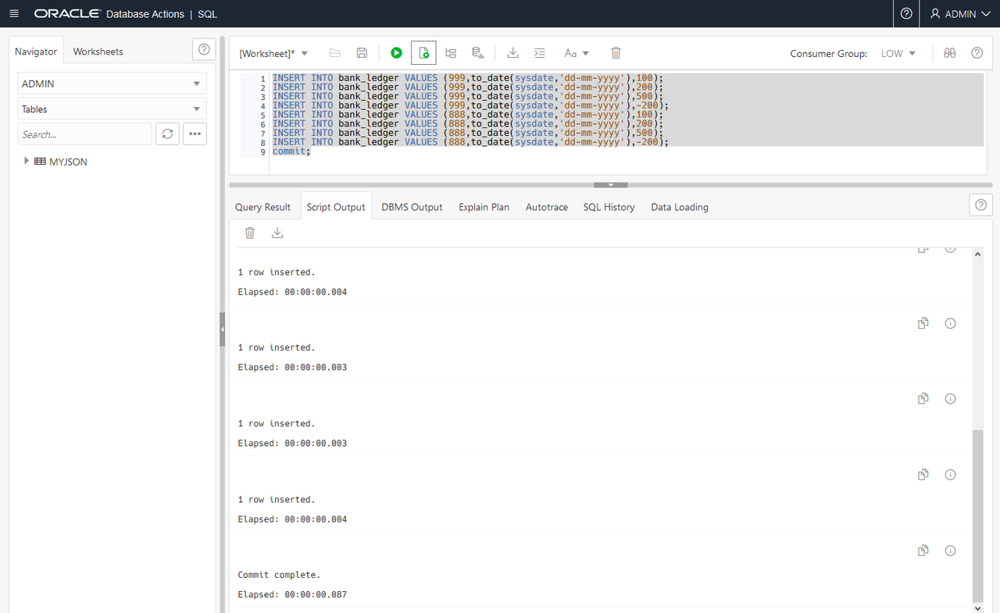

4. Query the `bank_ledger` blockchain table to show the records.

	```
	<copy>
	select * from bank_ledger;
	</copy>
	```

	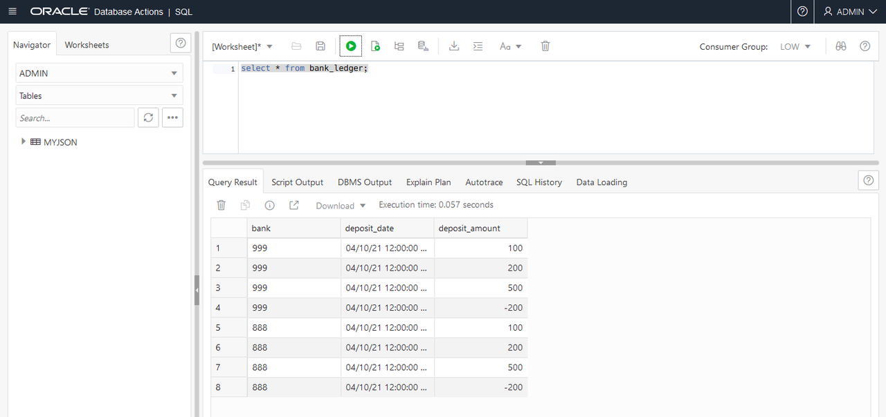

5. Run the command to view all the blockchain tables.

	```
	<copy>
	select * from user_blockchain_tables;
	</copy>
	```

	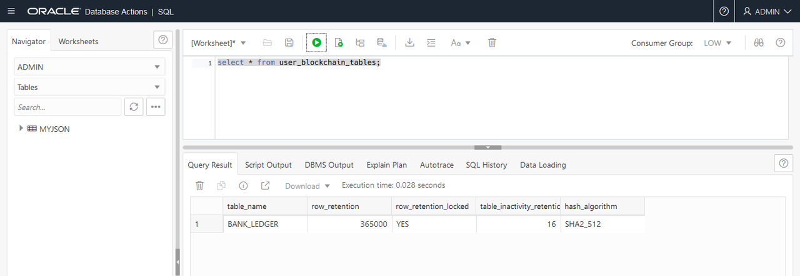

6. Use the `USER_TAB_COLS` view to display all internal column names used to store internal information like the users number, the users signature.

	```
	<copy>
	SELECT table_name, internal_column_id "Col ID", SUBSTR(column_name,1,30) "Column Name", SUBSTR(data_type,1,30) "Data Type", data_length "Data Length"
	FROM user_tab_cols
	ORDER BY internal_column_id;
	</copy>
	```

	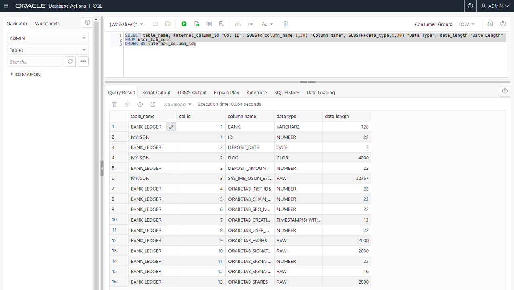

7. Query the `bank_ledger` blockchain table to display all the values in the blockchain table including values of internal columns.

	```
	<copy>
	select bank, deposit_date, deposit_amount, ORABCTAB_INST_ID$,
	ORABCTAB_CHAIN_ID$, ORABCTAB_SEQ_NUM$,
	ORABCTAB_CREATION_TIME$, ORABCTAB_USER_NUMBER$,
	ORABCTAB_HASH$, ORABCTAB_SIGNATURE$, ORABCTAB_SIGNATURE_ALG$,
	ORABCTAB_SIGNATURE_CERT$ from bank_ledger;
	</copy>
	```

	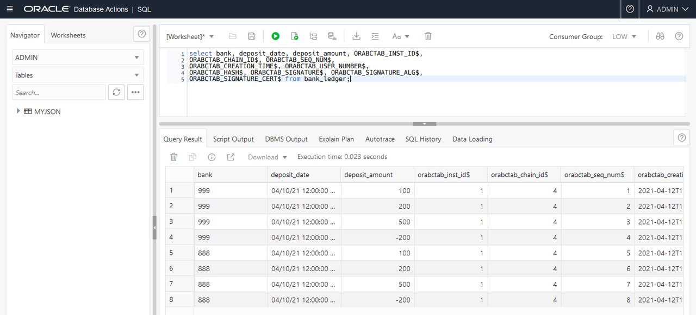

## Task 3: Manage blockchain tables and rows in a blockchain table

When you try to manage the rows using update, delete, truncate you get the error `operation not allowed on the blockchain table` if the rows are not outside the retention period.

1. Update a record in the `bank_ledger` blockchain table by setting deposit\_amount=0.

	```
	<copy>
	update bank_ledger set deposit_amount=0 where bank=999;
	</copy>
	```

	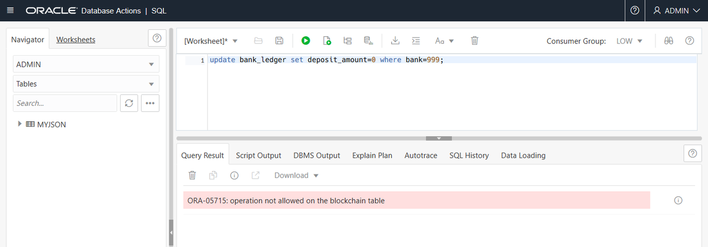

2. Delete a record in the `bank_ledger` blockchain table.

	```
	<copy>
	delete from bank_ledger where bank=999;
	</copy>
	```

	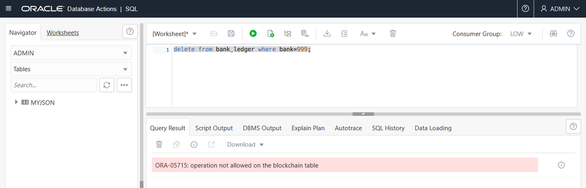

3. Truncating the table `bank_ledger`.

	```
	<copy>
	truncate table bank_ledger;
	</copy>
	```

	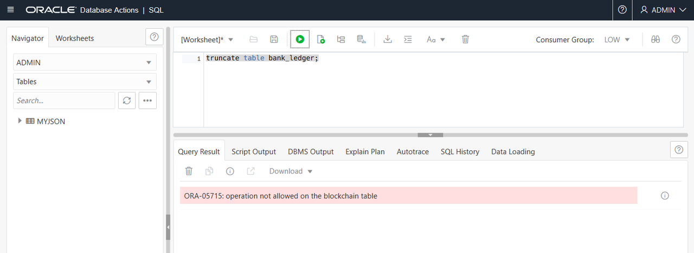

Similar to managing rows within the retention period, managing the blockchain table using alter, drop will throw an error.

4. Drop the table `bank_ledger`. It will drop successfully if no row exists in the table.

	```
	<copy>
	drop table bank_ledger;
	</copy>
	```

	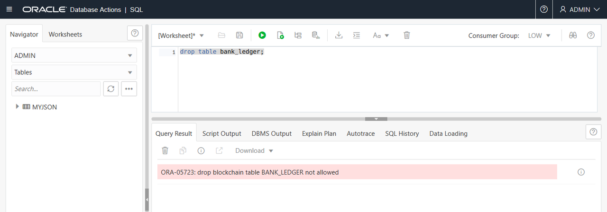

5. Alter the table `bank_ledger` to not delete the rows until 20 days after insert.

	```
	<copy>
	ALTER TABLE bank_ledger NO DELETE UNTIL 20 DAYS AFTER INSERT;
	</copy>
	```

	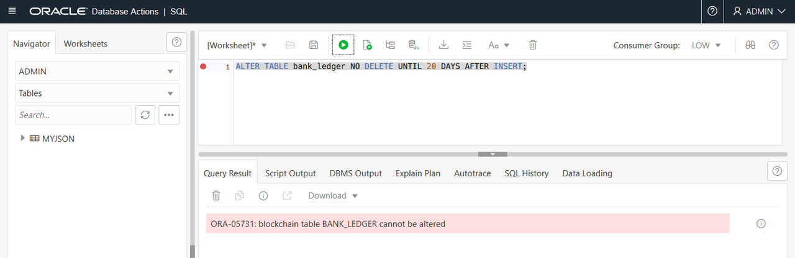

6. Create another table `bank_ledger_2`.

	```
	<copy>
	CREATE BLOCKCHAIN TABLE bank_ledger_2 (bank VARCHAR2(128), deposit_date DATE, deposit_amount NUMBER)
	NO DROP UNTIL 16 DAYS IDLE
	NO DELETE UNTIL 16 DAYS AFTER INSERT
	HASHING USING "SHA2_512" VERSION "v1";
	</copy>
	```

	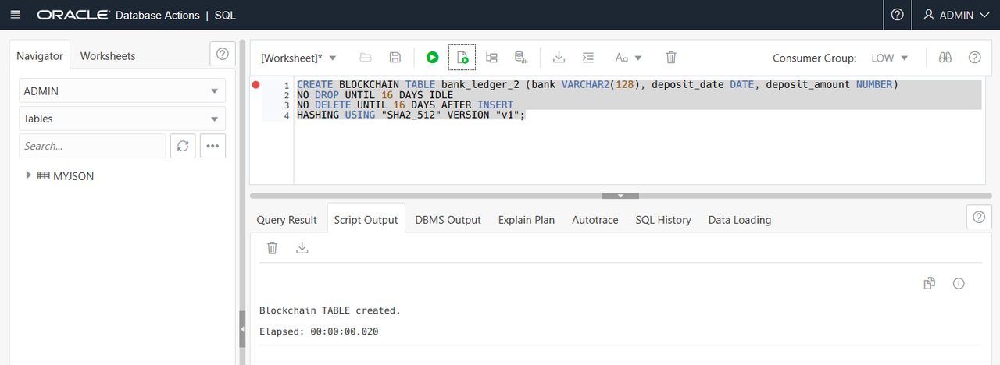

7. Alter the table `bank_ledger_2` by specifying that the rows cannot be deleted until 20 days after they were inserted.

	```
	<copy>
	ALTER TABLE bank_ledger_2 NO DELETE UNTIL 20 DAYS AFTER INSERT;
	</copy>
	```

	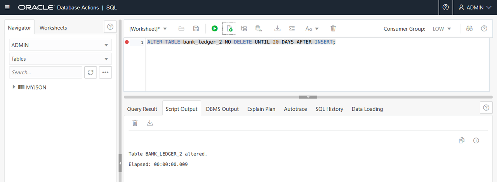

8. Run the command to view all the blockchain tables.

	```
	<copy>
	select * from user_blockchain_tables;
	</copy>
	```

	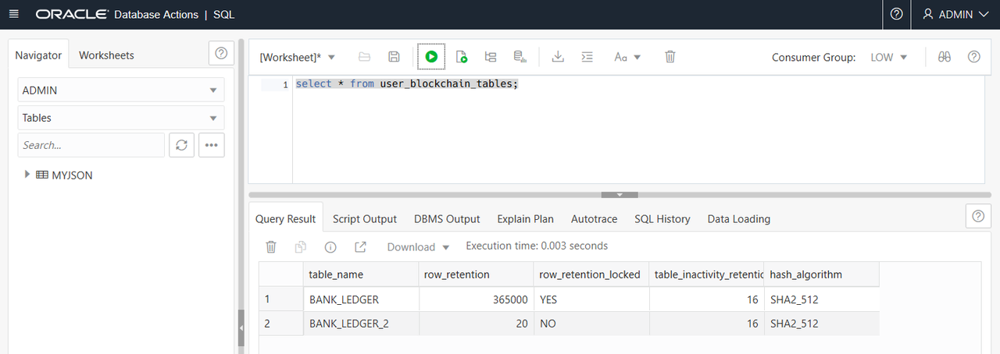

## Task 4: Verify rows without signature

1. Verify the rows in blockchain table using DBMS\_BLOCKCHAIN\_TABLE.VERIFY_ROWS.

	```
	<copy>
	DECLARE
		verify_rows NUMBER;
		instance_id NUMBER;
	BEGIN
		FOR instance_id IN 1 .. 4 LOOP
			DBMS_BLOCKCHAIN_TABLE.VERIFY_ROWS('ADMIN','BANK_LEDGER',
	NULL, NULL, instance_id, NULL, verify_rows);
		DBMS_OUTPUT.PUT_LINE('Number of rows verified in instance Id '||
	instance_id || ' = '|| verify_rows);
		END LOOP;
	END;
	/
	</copy>
	```

	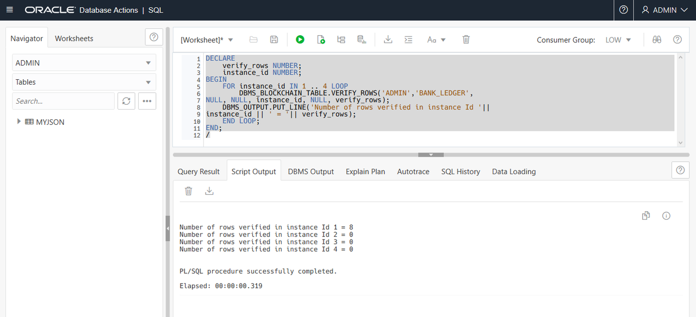

2. DBA view of blockchain tables.

	```
	<copy>
	select * from dba_blockchain_tables;
	</copy>
	```

	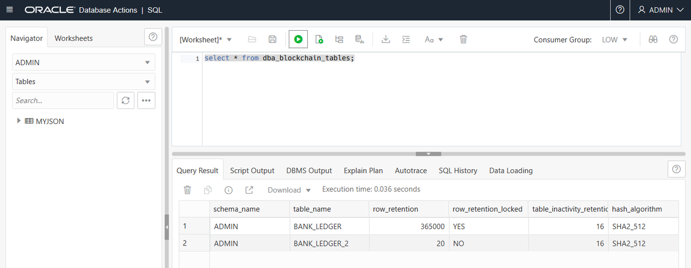

## Task 5: Create a certificate directory and add your certificate

In this lab, we will mock the key management service (a feature of Oracle that stores the keys securely) by generating the keys in Oracle Cloud Shell and storing them on Autonomous Database instance and Object storage as storing keys securely is not the main focus of this lab.

1.  Create a `CERT_DIR` certificate directory.

	```
	<copy>
	CREATE DIRECTORY CERT_DIR AS 'CERT_DIR';
	</copy>
	```

	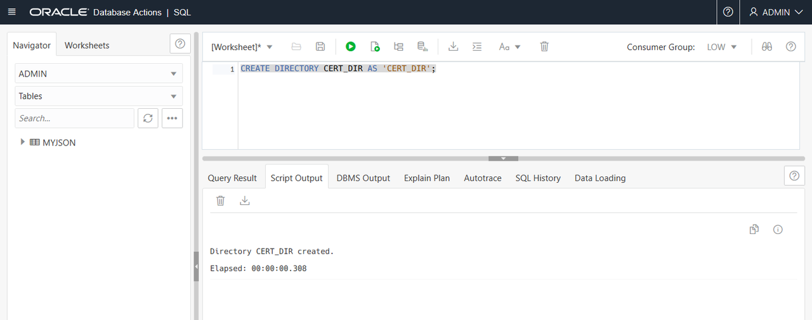

2. Connect to Oracle cloud shell to generate your x509 keypair.

	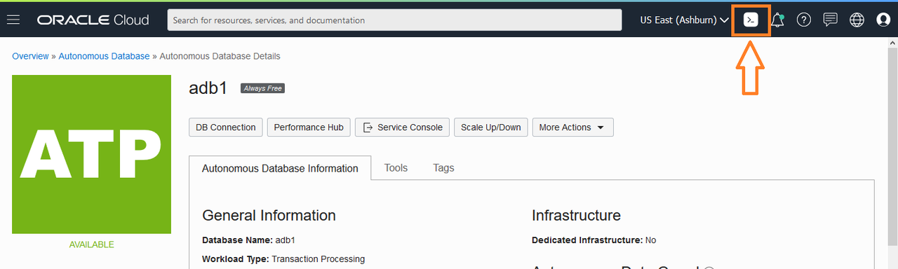

3. Create a folder `demo` and navigate into the folder.

	```
	<copy>
	cd ~
	mkdir demo
	cd demo
	</copy>
	```

	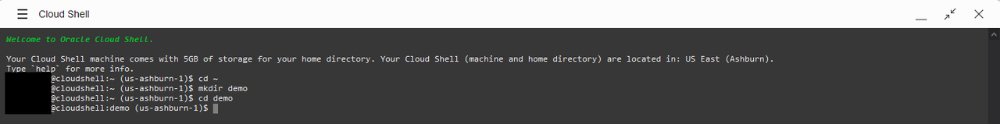

4. Run the command to generate your x509 key pair - *user01.key*, *user01.pem*.

	Press enter after providing each detail - Country Name, State, Locality Name, Organization name, Common name, Email address.

	```
	<copy>
	openssl req -x509 -sha256 -nodes -newkey rsa:4096 -keyout user01.key -days 730 -out user01.pem
	</copy>
	```

	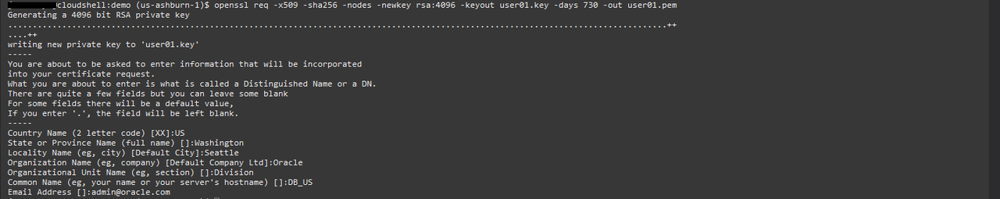

	Notice that your *user01.key*, *user01.pem* key pair is created.

	```
	<copy>ls</copy>
	```

	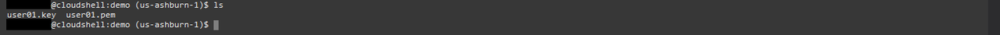

5. Copy the below command and replace the `<namespace>` and `<bucketname>` with the namespace and bucket name you copied earlier in lab 2 step 1 to upload the `user01.pem` key to object storage.

	```
	<copy>
	oci os object put -ns <namespace> -bn <bucketname> --file user01.pem
	</copy>
	```

	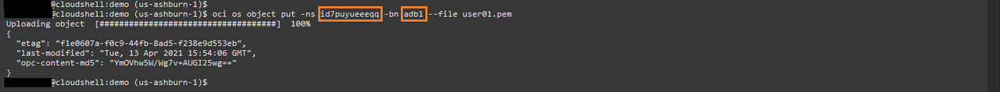

6. Copy the region.

	

7. Navigate to your SQL Developer Web, copy the below procedure and replace the `<region>`, `<namespace>`, `<bucketname>` with the namespace and bucket name to download the `user01.pem` key from object storage to ATP using the `adb1` credential created earlier in lab 2 step 7.

	```
	<copy>
	BEGIN
	DBMS_CLOUD.GET_OBJECT(
		credential_name => 'adb1',
		object_uri => 'https://objectstorage.<region>.oraclecloud.com/n/<namespace>/b/<bucketname>/o/user01.pem',
		directory_name => 'CERT_DIR');
	END;
	/
	</copy>
	```

	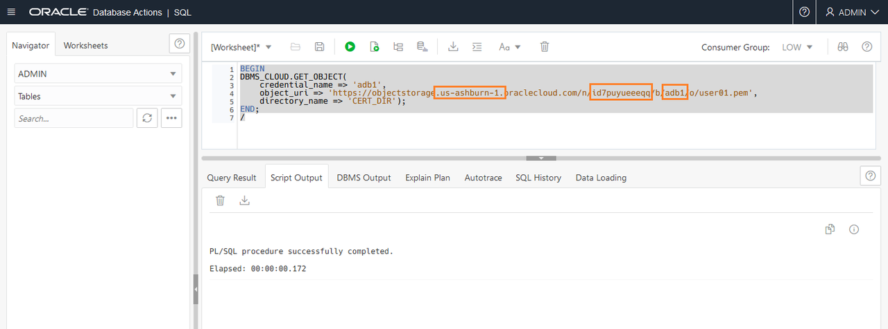

8. List files in the `CERT_DIR` certificate directory and notice the `user01.pem` key is uploaded to ATP.

	```
	<copy>
	SELECT * FROM DBMS_CLOUD.LIST_FILES('CERT_DIR');
	</copy>
	```

	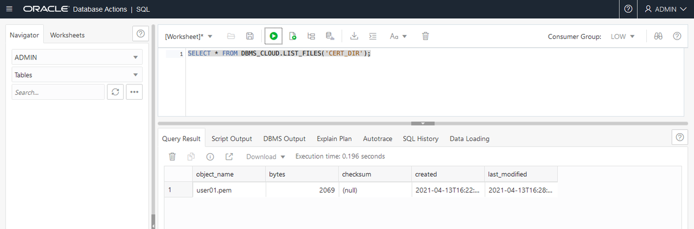

9. Before you register your key to sign, you need to create a certificate. `Make sure to copy the **Certificate GUID** value as it is not shown again.`

	```
	<copy>
	DECLARE
  	  file BFILE;
  	  buffer BLOB;
  	  amount NUMBER := 32767;
  	  cert_guid RAW(16);
	BEGIN
  	  file := BFILENAME('CERT_DIR', 'user01.pem');
      DBMS_LOB.FILEOPEN(file);
	  DBMS_LOB.READ(file, amount, 1, buffer);
	  DBMS_LOB.FILECLOSE(file);
	  DBMS_USER_CERTS.ADD_CERTIFICATE(buffer, cert_guid);
	  DBMS_OUTPUT.PUT_LINE('Certificate GUID = ' || cert_guid);
	END;
	/
	</copy>
	```

	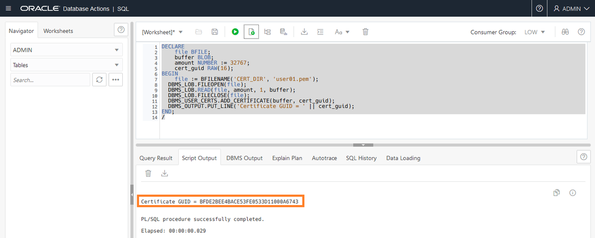

10. To verify the certificate is created, view **CERTIFICATE_GUID** value in raw format by selecting all the columns from `USER_CERTIFICATES` table ordered by user\_name.
	```
	<copy>
	SELECT * FROM USER_CERTIFICATES ORDER BY user_name;
	</copy>
	```

	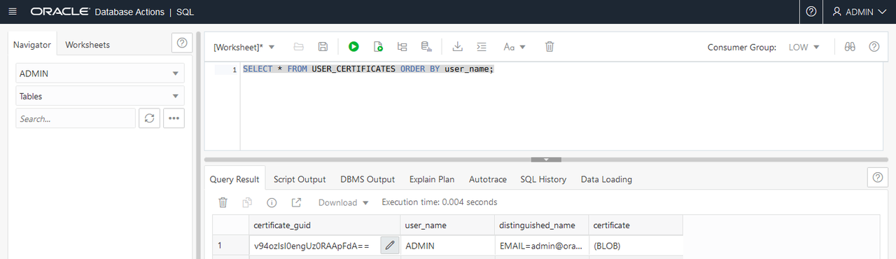

## Task 6: Sign a row and verify the rows with signature

1. Query the Blockchain table and make note of the `ORABCTAB_INST_ID$`, `ORABCTAB_CHAIN_ID$` and `ORABCTAB_SEQ_NUM$` column values for the row you want to sign.

	In this example, we will be signing the row with ORABCTAB\_INST\_ID$ - **1**, ORABCTAB\_CHAIN\_ID$ - **19** and ORABCTAB\_SEQ\_NUM$ - **1**.

	```
	<copy>
	select bank, deposit_date, deposit_amount, ORABCTAB_INST_ID$,
	ORABCTAB_CHAIN_ID$, ORABCTAB_SEQ_NUM$,
	ORABCTAB_CREATION_TIME$, ORABCTAB_USER_NUMBER$,
	ORABCTAB_HASH$, ORABCTAB_SIGNATURE$, ORABCTAB_SIGNATURE_ALG$,
	ORABCTAB_SIGNATURE_CERT$ from bank_ledger;
	</copy>
	```

	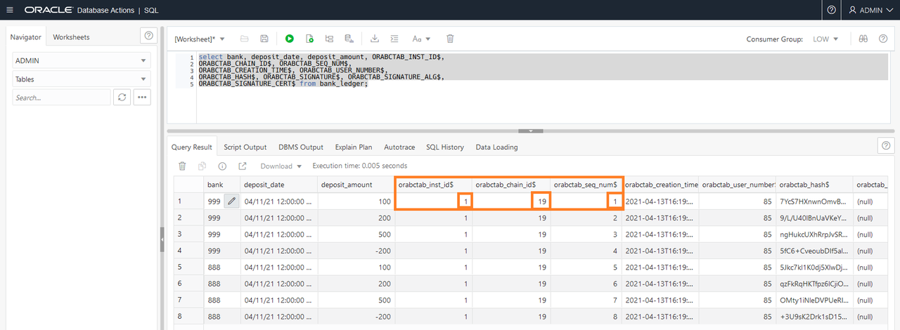

2. To sign the row we need the bytes of the row that writes to a file. Replace the existing `ORABCTAB_INST_ID$`, `ORABCTAB_CHAIN_ID$` and `ORABCTAB_SEQ_NUM$` value `1` with the values you just noted and run the command to get the bytes for the row and write to a file called `row_data`.

	```
	<copy>
	DECLARE
		row_data BLOB;
		buffer RAW(4000);
		inst_id BINARY_INTEGER;
		chain_id BINARY_INTEGER;
		sequence_no BINARY_INTEGER;
		row_len BINARY_INTEGER;
		l_output utl_file.file_type;
	BEGIN
		SELECT ORABCTAB_INST_ID$, ORABCTAB_CHAIN_ID$, ORABCTAB_SEQ_NUM$ INTO inst_id, chain_id, sequence_no FROM bank_ledger WHERE ORABCTAB_INST_ID$=1 and ORABCTAB_CHAIN_ID$=1 and ORABCTAB_SEQ_NUM$=1;
		DBMS_BLOCKCHAIN_TABLE.GET_BYTES_FOR_ROW_SIGNATURE('ADMIN','bank_ledger',inst_id, chain_id, sequence_no, 1, row_data);
		row_len := DBMS_LOB.GETLENGTH(row_data);
		DBMS_LOB.READ(row_data, row_len, 1, buffer);
		l_output := utl_file.fopen('CERT_DIR', 'row_data', 'WB', 32767);
		utl_file.put_raw(l_output,buffer, TRUE);
	END;
	/
	</copy>
	```

	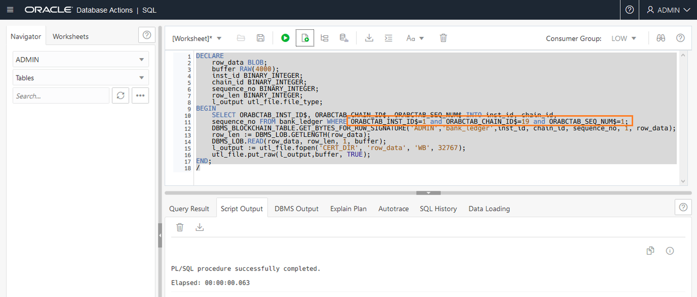

3. Notice the `row_data` file is created in the `CERT_DIR` directory.

	```
	<copy>
	SELECT * FROM DBMS_CLOUD.LIST_FILES('CERT_DIR');
	</copy>
	```

	

4. Put the `row_data` file in object storage. Replace the `<region>`, `<namespace>`, `<bucketname>` with the namespace and bucket name to upload the `row_data` to object storage from ATP using the `adb1` credential created.

	```
	<copy>
	BEGIN
	DBMS_CLOUD.PUT_OBJECT (
		credential_name      => 'adb1',		
		object_uri           => 'https://objectstorage.<region>.oraclecloud.com/n/<namespace>/b/<bucketname>/o/',		
		directory_name       => 'CERT_DIR',
		file_name            => 'row_data');	
	END;
	/
	</copy>
	```

	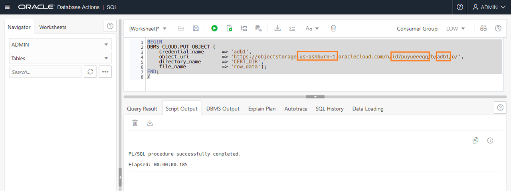

5. Navigate to the `demo` directory in cloud shell and download the `row_data` object from Object Storage. Replace the `<bucketname>` with your bucket name.

	```
	<copy>
	oci os object get -bn <bucketname> --name row_data --file row_data
	</copy>
	```

	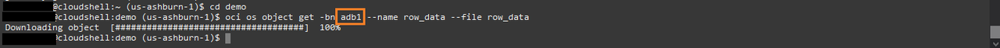

	Notice that your `row_data` file is downloaded to your demo directory.

	```
	<copy>
	ls
	</copy>
	```

	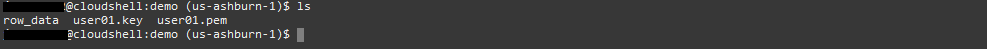

6. Now generate the `row1.sha256` for the `row_data` file.

	```
	<copy>
	openssl dgst -sha256 -sign user01.key -out row1.sha256 row_data
	</copy>
	```

	

    Note that the `row1.sha256` file is created.

	```
	<copy>
	ls
	</copy>
	```

	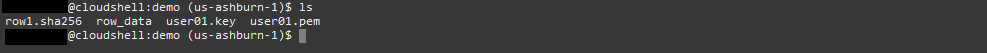

7. Upload the `row1.sha256` file to object storage.

	```
	<copy>
	oci os object put -ns <namespace> -bn <bucketname> --file row1.sha256
	</copy>
	```

	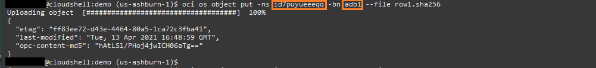

8. Navigate back to the SQL Developer web and replace the `<region>`, `<namespace>`, `<bucketname>` with the namespace and your bucket name to download the `row1.sha256` from object storage to ATP using the `adb1` credential created.

	```
	<copy>
	BEGIN
	DBMS_CLOUD.GET_OBJECT(
		credential_name => 'adb1',
		object_uri => 'https://objectstorage.<region>.oraclecloud.com/n/<namespace>/b/<bucketname>/o/row1.sha256',
		directory_name => 'CERT_DIR');
	END;
	/
	</copy>
	```

	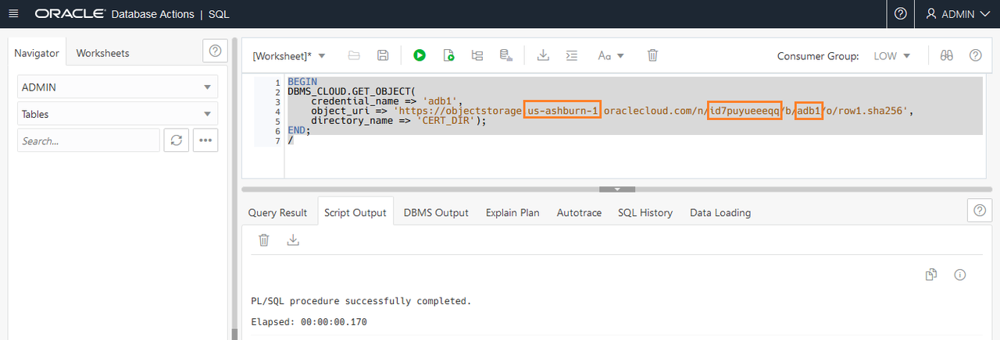

9. List the files in `CERT_DIR` directory and notice that `row1.sha256` is downloaded to ATP from object storage.

	```
	<copy>
	SELECT * FROM DBMS_CLOUD.LIST_FILES('CERT_DIR');
	</copy>
	```

	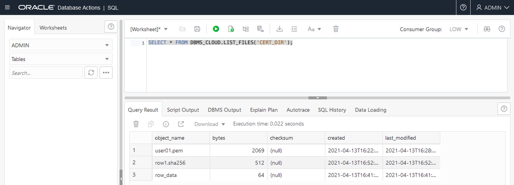

10. Now let's sign the row. Replace `<B6622BA923717399E0530400000AA85A>` value with your **CERTIFICATE\_GUID** value you saved earlier. Update `ORABCTAB_INST_ID$`, `ORABCTAB_CHAIN_ID$` and `ORABCTAB_SEQ_NUM$` value `1` with the values for which you generated the row bytes and run the command.

	```
	<copy>
	DECLARE
    	file BFILE;
    	amount NUMBER := 32767;
        	signature RAW(32767);
        	cert_guid RAW (16) := HEXTORAW('<B6622BA923717399E0530400000AA85A>');
    	inst_id binary_integer;
    	chain_id binary_integer;
    	sequence_no binary_integer;
	BEGIN
    	SELECT ORABCTAB_INST_ID$, ORABCTAB_CHAIN_ID$, ORABCTAB_SEQ_NUM$ INTO inst_id, chain_id, sequence_no FROM bank_ledger WHERE ORABCTAB_INST_ID$=1 and ORABCTAB_CHAIN_ID$=1 and ORABCTAB_SEQ_NUM$=1;
    	file := bfilename('CERT_DIR', 'row1.sha256');
    	DBMS_LOB.FILEOPEN(file);
    	dbms_lob.READ(file, amount, 1, signature);
    	dbms_lob.FILECLOSE(file);
    	DBMS_BLOCKCHAIN_TABLE.SIGN_ROW('ADMIN','bank_ledger', inst_id, chain_id, sequence_no, NULL, signature, cert_guid, DBMS_BLOCKCHAIN_TABLE.SIGN_ALGO_RSA_SHA2_256);
	END;
	/
	</copy>
	```

	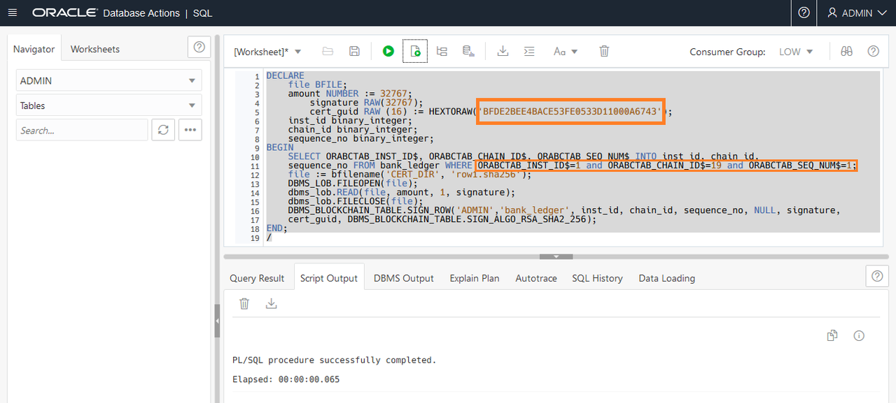

11. Update `ORABCTAB_INST_ID$`, `ORABCTAB_CHAIN_ID$` and `ORABCTAB_SEQ_NUM$` value `1` with the values for which you created the signature and query all the columns from the `bank_ledger` blockchain table and notice the signature is updated for the row.

	```
	<copy>
	select bank, deposit_date, deposit_amount, ORABCTAB_INST_ID$,
	ORABCTAB_CHAIN_ID$, ORABCTAB_SEQ_NUM$,
	ORABCTAB_CREATION_TIME$, ORABCTAB_USER_NUMBER$,
	ORABCTAB_HASH$, ORABCTAB_SIGNATURE$, ORABCTAB_SIGNATURE_ALG$,
	ORABCTAB_SIGNATURE_CERT$ from bank_ledger where ORABCTAB_INST_ID$=1 and ORABCTAB_CHAIN_ID$=1 and ORABCTAB_SEQ_NUM$=1;
	</copy>
	```

	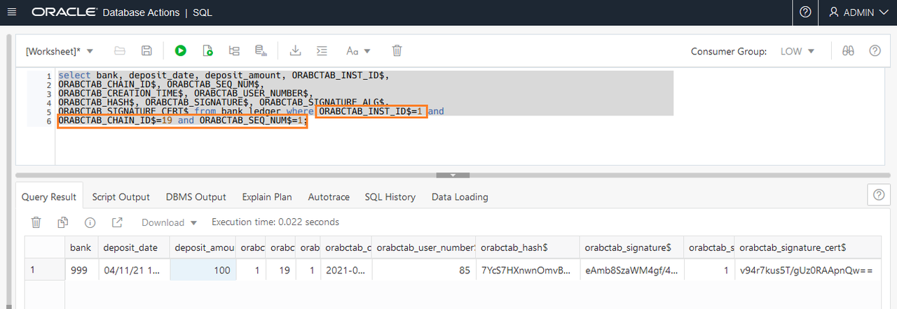

13. Verify the rows with signature.

	```
	<copy>
	DECLARE
        verify_rows NUMBER;
        instance_id NUMBER;
	BEGIN
        FOR instance_id IN 1 .. 4 LOOP
            DBMS_BLOCKCHAIN_TABLE.VERIFY_ROWS('ADMIN','BANK_LEDGER', NULL, NULL, instance_id, NULL, verify_rows, true);
            DBMS_OUTPUT.PUT_LINE('Number of rows verified in instance Id '|| instance_id || ' = '|| verify_rows);
        END LOOP;
	END;
	/
	</copy>
	```

	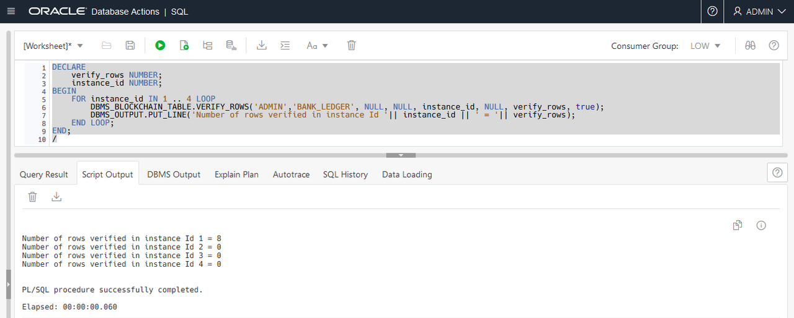

You may now [proceed to the next lab](#next).

## Acknowledgements

* **Author** - Rayes Huang, Mark Rakhmilevich, Anoosha Pilli
* **Contributors** - Anoosha Pilli, Didi Han, Database Product Management, Oracle Database
* **Last Updated By/Date** - Anoosha Pilli, April 2021
