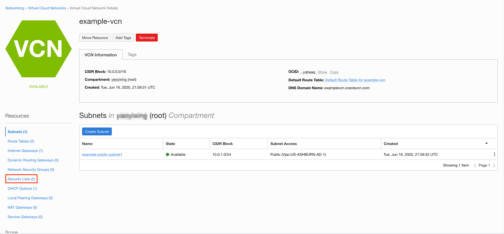
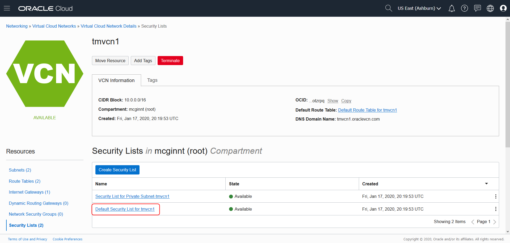
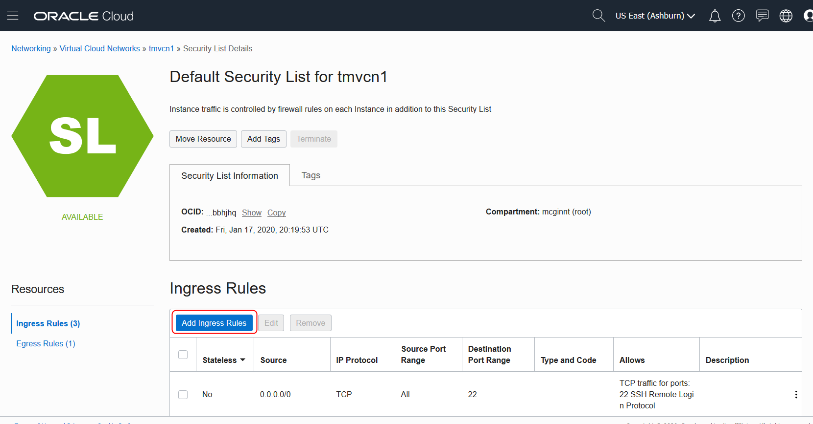
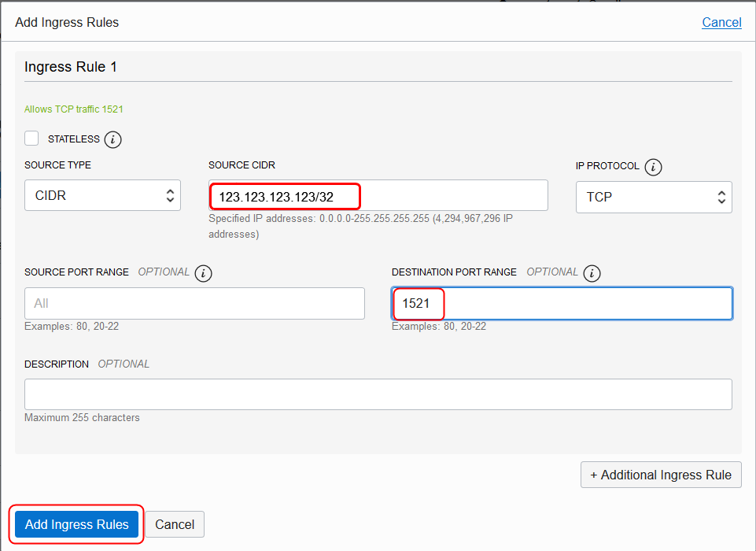
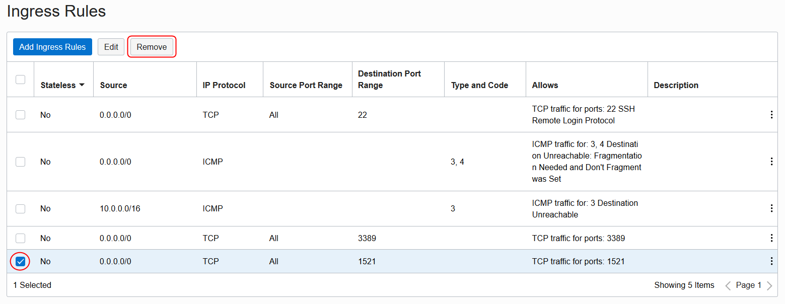

# Add an Ingress Rule to Open a Port to VCN
## Introduction
This lab walks you through the steps to open a port to your Oracle Cloud network to allow access to an Oracle Database instance running on an Oracle Cloud Compute, Bare Metal or Virtual Machine instance. For example, by opening port 1521, you will allow Oracle Database clients and external applications to access your Oracle Database.

### Objectives
Oracle Cloud Infrastructure provides a quick and easy way to create an Oracle Database 19c instance running in a Virtual Machine.

### Prerequisites

* An Oracle Cloud paid account or free trial. To sign up for a trial account with $300 in credits for 30 days, click [here](http://oracle.com/cloud/free).
* An Oracle Virtual Cloud Network (VCN) instance

## Task 1: Add an Ingress Rule to your Virtual Cloud Network instance

1. After logging into your Oracle Cloud account, click the **Navigation Menu** in the upper left, navigate to **Networking**, and select **Virtual Cloud Networks**.

	

3. On the left menu, click **Security Lists**.

  

4. Click the link for the **Default Security List**.

  

5. Click **Add Ingress Rules**.

  

6. In the Add Ingress Rules dialog, enter the public IP address of your PC followed by `/32` as the source CIDR. Enter `1521` as the destination port number (of the database), and click **Add Ingress Rules**.

  

  *Note 1: If you reconnect at a later date or connect to your company's VPN, your local machine's IP address may change.*
  *Note 2: Make sure to enter your PC's IP address, not your LAN/Wifi's IP address.*

7. You can remove or edit the Ingress rule by clicking the checkbox for the rule and the clicking the **Edit** or **Remove** buttons.

  

  You can *proceed to the next lab*.

## Want to Learn More?

* [Oracle Cloud Infrastructure: Connecting to a DB System](https://docs.cloud.oracle.com/en-us/iaas/Content/Database/Tasks/connectingDB.htm)

## Acknowledgements
* **Author** - Kay Malcolm, Database Product Management
* **Last Updated By/Date** - Madhusudhan Rao, Apr 2022
* **Contributor** - Arabella Yao, Product Manager Intern, Database Management, June 2020
