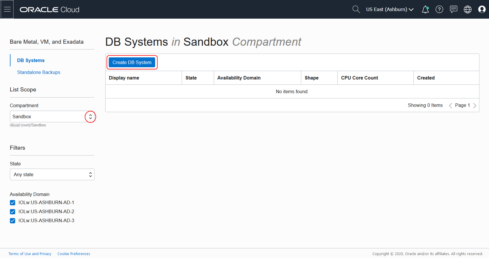

# Create an Oracle Cloud Infrastructure VM Database
## Introduction

This lab walks you through the steps to create an instance of an Oracle 18c, 19c or the new 21c Database running in Oracle Cloud Infrastructure. Oracle Cloud Infrastructure provides several options for rapidly creating a Database system for development and testing, including fast provisioning of 1-node virtual machine database systems.

### Objectives
You can use a 1-node virtual database system to complete labs and tutorials that require an Oracle database.

### Prerequisites

* An Oracle Free Tier, Always Free, Paid or LiveLabs Cloud Account
* SSH Keys
* A Virtual Cloud Network (VCN)

## Task 1: Create a Database Virtual Machine

1. From the Console menu, click on **Bare Metal, VM, and Exadata**.

  

2. Select the compartment you want to create the database in and click on **Create DB System**.

  

3. On the DB System Information form, enter the following information and click **Next**:

    * In the **Name your DB system** field, give your database a name.
    * Select **Logical Volume Manager** as the Storage Management Software.
    * In the **Add public SSH keys** section, browse to the location of your SSH keys and select the public key file (with a .pub extension).
    * In the **Specify the Network information** section, select the VCN you created using the drop down list.
    * Select the public subnet using the drop down list.
    * Enter a hostname prefix.

    

4. On the Database Information form, enter the following information and click **Create DB System**.

    * In the **Database name** field, change the default database name to "cdb1".
    * On the **Database version** drop down menu, select the version of the Oracle Database you want: 18c, 19c or 21c.
    * In the **PDB name** field, enter "pdb1".
    * Enter a password for your sys user in the **Password** field and then repeat the password in the **Confirm password** field.

    

5. After a few minutes, your Database System will change color from yellow (Provisioning) to green.

    

## Task 2: Connect to the Database using SSH

1. On the **DB System Details** page, Click **Nodes**.

  

   Note the IP address.

2. In a terminal window, navigate to the folder where you created the SSH keys and enter this command, using your IP address:

    ```
    $ <copy>ssh -i ./myOracleCloudKey opc@</copy>123.123.123.123
    Enter passphrase for key './myOracleCloudKey':
    Last login: Tue Feb  4 15:21:57 2020 from 123.123.123.123
    [opc@tmdb1 ~]$
    ```

3. Once connected, you can switch to the "oracle" OS user and connect using SQL*Plus:

    ```
    [opc@tmdb1 ~]$ sudo su - oracle
    [oracle@tmdb1 ~]$ . oraenv
    ORACLE_SID = [cdb1] ?
    The Oracle base has been set to /u01/app/oracle
    [oracle@tmdb1 ~]$ sqlplus / as sysdba

    SQL*Plus: Release 21.0.0.0.0 - Production on Sat Nov 15 14:01:48 2020
    Version 20.2.0.0.0

    Copyright (c) 1982, 2020, Oracle.  All rights reserved.

    Connected to:
    Oracle Database 21c EE High Perf Release 21.0.0.0.0 - Production
    Version 21.0.0.0.0

    SQL>
    ```

You may now [proceed to the next lab](#next).

## Want to Learn More?

* [Oracle Cloud Infrastructure: Creating Bare Metal and Virtual Machine DB Systems](https://docs.cloud.oracle.com/en-us/iaas/Content/Database/Tasks/creatingDBsystem.htm)
* [Oracle Cloud Infrastructure: Connecting to a DB System](https://docs.cloud.oracle.com/en-us/iaas/Content/Database/Tasks/connectingDB.htm)

## Acknowledgements
* **Author** - Kay Malcolm, Database Product Management
* **Last Updated By/Date** - Madhusudhan Rao, Apr 2022
