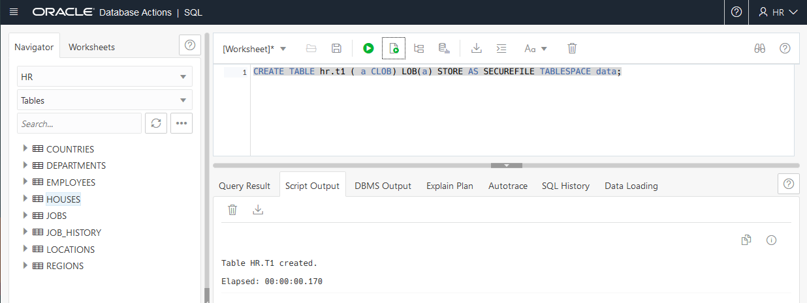
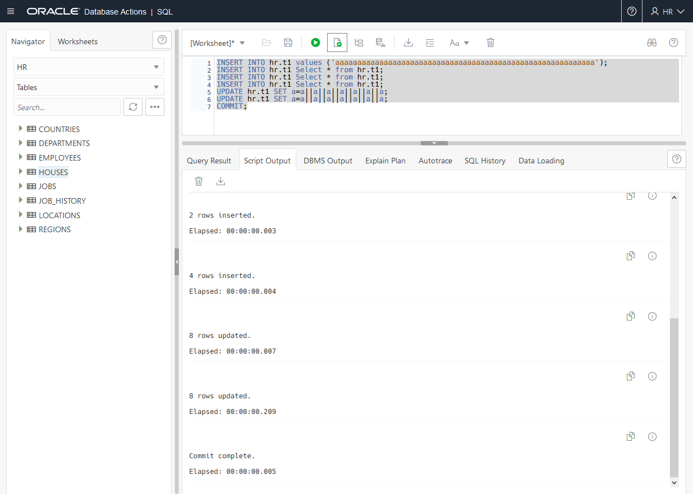
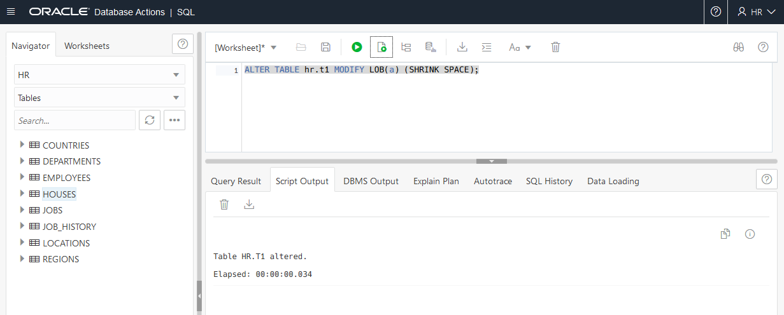
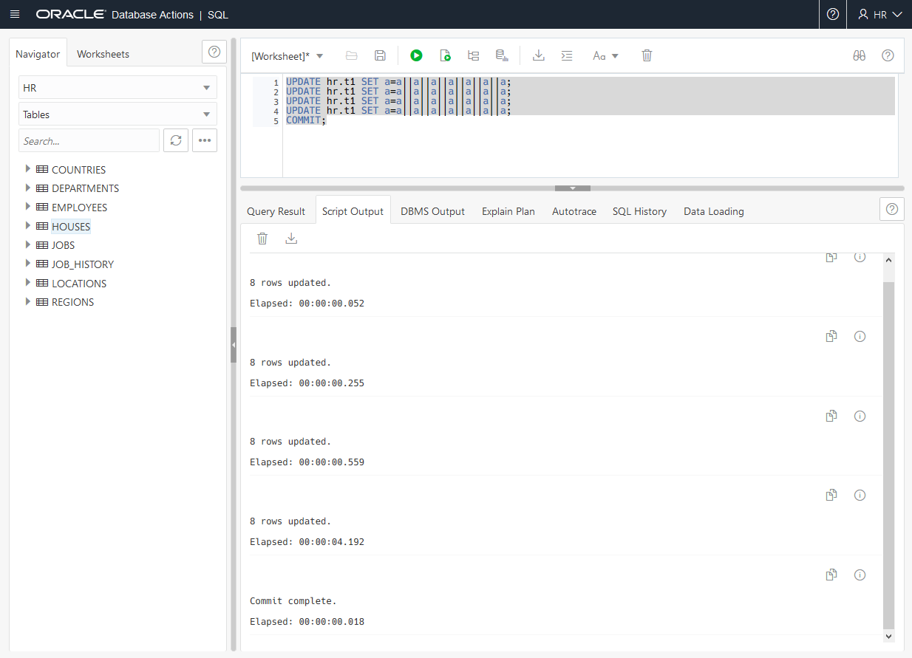
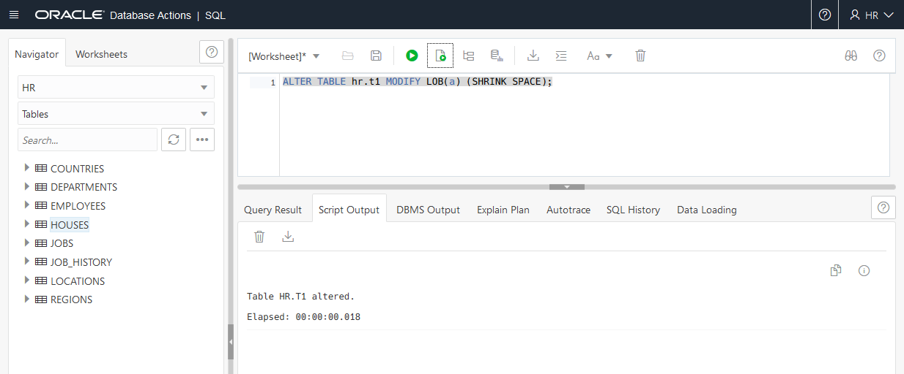
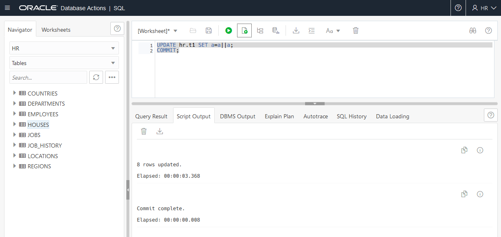
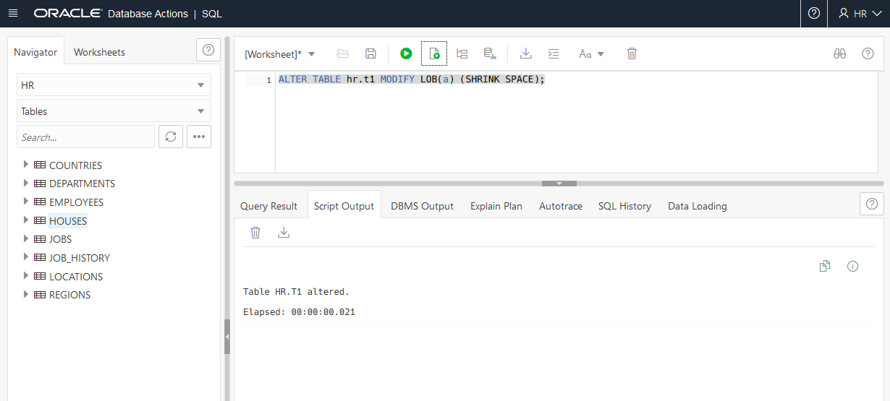

# Shrinking SecureFile LOBs

## Introduction

This lab shows how to reclaim space and improve performance with SecureFile LOBs in the Oracle Database 21c.

### About SecureFile LOBs
Large Objects (LOBs) are a set of data types that are designed to hold large amounts
of data.

The maximum size for a single LOB can range from 8 terabytes to 128 terabytes depending on how your database is configured. Storing data in LOBs enables you to access and manipulate the data efficiently in your application.

BasicFiles LOB and SecureFiles LOB are the two storage types used with the Oracle Database.  Certain advanced features can be applied to SecureFiles LOBs, including compression and deduplication (part of the Advanced Compression Option), and encryption (part of the Advanced Security Option).

Estimated Lab Time: 10 minutes

### Objectives
In this lab, you will:
<if type="atp">
* Login to SQL Developer Web on ADB
</if>
* Create a table with a SecureFile LOB
* Shrink the SecureFile LOB after rows inserted and updated
* Shrink the SecureFile LOB after rows updated

### Prerequisites
<if type="dbcs">
* An Oracle Free Tier, Paid or LiveLabs Cloud Account
* Lab: SSH Keys
* Lab: Create a DBCS VM Database
* Lab: 21c Setup
</if>
<if type="atp">
* An Oracle Always Free/Free Tier, Paid or LiveLabs Cloud Account
* Lab: Provision ADB
* Lab: Setup
</if>


<if type="dbcs">
## Task 1: Create a table with a SecureFile LOB

1. Execute a shell script that creates a tablespace with sufficient space to let the LOB grow and be candidate for shrinking.


    ```

    $ <copy>cd /home/oracle/labs/M104780GC10</copy>
    $ <copy>/home/oracle/labs/M104780GC10/setup_LOB.sh</copy>
    SQL> ADMINISTER KEY MANAGEMENT SET KEYSTORE CLOSE CONTAINER=ALL ;
    ADMINISTER KEY MANAGEMENT SET KEYSTORE CLOSE CONTAINER=ALL

    *

    ERROR at line 1:
    ORA-28389: cannot close auto login wallet
    SQL> ADMINISTER KEY MANAGEMENT SET KEYSTORE CLOSE IDENTIFIED BY <i>WElcome123##</i> CONTAINER=ALL;
    keystore altered.

    ...

    SQL> DROP TABLESPACE users INCLUDING CONTENTS AND DATAFILES CASCADE CONSTRAINTS;
    Tablespace dropped.

    SQL> CREATE TABLESPACE users DATAFILE '/u02/app/oracle/oradata/pdb21/users01.dbf' SIZE 500M;
    Tablespace created.

    SQL> create user hr identified by password default tablespace users;
    User created.

    SQL> grant dba to hr;
    Grant succeeded.

    SQL> exit

    $

    ```

2. Create a table with a CLOB column in `PDB21`.


    ```

    $ <copy>sqlplus system@PDB21</copy>
    Copyright (c) 1982, 2019, Oracle.  All rights reserved.
    Enter password: <i>WElcome123##</i>
    Last Successful login time: Fri Dec 13 2019 10:42:50 +00:00
    Connected to:
    ```
    ```

    SQL> <copy>CREATE TABLE hr.t1 ( a CLOB) LOB(a) STORE AS SECUREFILE TABLESPACE users;</copy>
    Table created.

    SQL> <copy>alter database datafile '/u02/app/oracle/oradata/pdb21/users01.dbf' autoextend on;</copy>

    ```
</if>
<if type="atp">
## Task 1: Login to SQL Developer Web on ADB
There are multiple ways to access your Autonomous Database.  You can access it via SQL\*Plus or by using SQL Developer Web.  To access it via SQL\*Plus, skip to [Step 1B](#STEP1B:LogintoADBusingSQLPlus).

1.  If you aren't still logged in, login to your ADB screen by clicking on the Hamburger Menu and selecting the Autonomous Database flavor you selected (ATP, ADW or AJD). Otherwise skip to the next step.
      

2.  If you can't find your ADB instance, ensure you are in the correct compartment, you have chosen the flavor of ADB you choose in the earlier lab and that you are in the correct region.
3.  Click on the **Display Name** to go to your ADB main page.
      

4.  Click on the **Tools** tab, select **Database Actions**, a new browser will open up.
      

5.  Login with the *hr* user, click **Next**.  Enter the password *WElcome123##*
6.  Click on the **SQL** button.

## Task 1B: Login to ADB using SQL Plus
1. If you aren't logged into the cloud, log back in
2. Open up Cloud Shell
3. Connect to the HR user using SQL\*Plus by entering the commands below.

    ```
    export TNS_ADMIN=$(pwd)/wallet
    sqlplus /nolog
	  conn hr/WElcome123##@adb1_high
	  ```
</if>

## Task 2: Shrink the SecureFile LOB after rows inserted and updated

<if type="atp">
1.  Create a Large Object table
    ```
    SQL> <copy>
    CREATE TABLE hr.t1 ( a CLOB) LOB(a) STORE AS SECUREFILE TABLESPACE data;
    </copy>
    ```
    

</if>

1. Insert rows, update the CLOB data and commit.

<if type="dbcs">

    ```
    SQL> <copy>INSERT INTO hr.t1 values ('aaaaaaaaaaaaaaaaaaaaaaaaaaaaaaaaaaaaaaaaaaaaaaaaaaaaaaaaaaa');</copy>
    1 row created.

    SQL> <copy>INSERT INTO hr.t1 Select * from hr.t1;</copy>
    1 row created.

    SQL> <copy>INSERT INTO hr.t1 Select * from hr.t1;</copy>

    2 rows created.

    SQL> <copy>INSERT INTO hr.t1 Select * from hr.t1;</copy>

    4 rows created.

    SQL> <copy>UPDATE hr.t1 SET a=a||a||a||a||a||a||a;</copy>

    8 rows updated.

    SQL> <copy>UPDATE hr.t1 SET a=a||a||a||a||a||a||a;</copy>

    8 rows updated.

    SQL> <copy>COMMIT;</copy>

    Commit complete.

    SQL>
    ```
</if>
<if type="atp">

    ```
    SQL> <copy>INSERT INTO hr.t1 values ('aaaaaaaaaaaaaaaaaaaaaaaaaaaaaaaaaaaaaaaaaaaaaaaaaaaaaaaaaaa');</copy>
    SQL> <copy>INSERT INTO hr.t1 Select * from hr.t1;</copy>
    SQL> <copy>INSERT INTO hr.t1 Select * from hr.t1;</copy>
    SQL> <copy>INSERT INTO hr.t1 Select * from hr.t1;</copy>
    SQL> <copy>UPDATE hr.t1 SET a=a||a||a||a||a||a||a;</copy>
    SQL> <copy>UPDATE hr.t1 SET a=a||a||a||a||a||a||a;</copy>
    SQL> <copy>COMMIT;</copy>
    ```
    
</if>

2. Shrink the LOB segment.

<if type="dbcs">
    ````
    SQL> <copy>ALTER TABLE hr.t1 MODIFY LOB(a) (SHRINK SPACE);</copy>

    Table altered.

    SQL>
    ````
</if>

<if type="atp">
    ```
    SQL> <copy>ALTER TABLE hr.t1 MODIFY LOB(a) (SHRINK SPACE);</copy>
    ```

    
</if>

<if type="dbcs">

3. Display the number of extents or blocks freed. **Make note of the LOB_OBJD for use in later commands**


    ```

    SQL> <copy>SET PAGES 100</copy>

    SQL> <copy>SELECT * FROM v$securefile_shrink;</copy>

      LOB_OBJD SHRINK_STATUS
    ---------- ----------------------------------------
    START_TIME
    ---------------------------------------------------------------------------
    END_TIME
    ---------------------------------------------------------------------------
    BLOCKS_MOVED BLOCKS_FREED BLOCKS_ALLOCATED EXTENTS_ALLOCATED EXTENTS_FREED
    ------------ ------------ ---------------- ----------------- -------------
    EXTENTS_SEALED     CON_ID

    -------------- ----------
        76063 COMPLETE

    10-NOV-20 11.30.55.545 AM +00:00
    10-NOV-20 11.30.55.917 AM +00:00
              2            2                2                 1             1
                1          3
    SQL>

    ```

  As a result, two blocks are freed.
</if>

## Task 3: Shrink the SecureFile LOB after rows updated

1. Update the CLOB.

<if type="dbcs">
    ```
    SQL> <copy>UPDATE hr.t1 SET a=a||a||a||a||a||a||a;</copy>
    8 rows updated.

    SQL> <copy>UPDATE hr.t1 SET a=a||a||a||a||a||a||a;</copy>
    8 rows updated.

    SQL> <copy>UPDATE hr.t1 SET a=a||a||a||a||a||a||a;</copy>
    8 rows updated.

    SQL> <copy>UPDATE hr.t1 SET a=a||a||a||a||a||a||a;</copy>
    8 rows updated.

    SQL> <copy>COMMIT;</copy>
    Commit complete.

    SQL>
    ```
</if>

<if type="atp">

    ```
    SQL> <copy>UPDATE hr.t1 SET a=a||a||a||a||a||a||a;</copy>
    SQL> <copy>UPDATE hr.t1 SET a=a||a||a||a||a||a||a;</copy>
    SQL> <copy>UPDATE hr.t1 SET a=a||a||a||a||a||a||a;</copy>
    SQL> <copy>UPDATE hr.t1 SET a=a||a||a||a||a||a||a;</copy>
    SQL> <copy>COMMIT;</copy>
    ```

    
</if>

2. Shrink the LOB segment.

<if type="dbcs">

    ```
    SQL> <copy>ALTER TABLE hr.t1 MODIFY LOB(a) (SHRINK SPACE);</copy>
    Table altered.

    SQL>
    ```
</if>

<if type="atp">

    ```
    SQL> <copy>ALTER TABLE hr.t1 MODIFY LOB(a) (SHRINK SPACE);</copy>
    ```

    
</if>

<if type="dbcs">    

3. Display the number of extents or blocks freed. **Put the LOB_OBJD you saved from previous in and run the command**


    ```

    SQL> SELECT * FROM v$securefile_shrink WHERE LOB_OBJD=76063;

      LOB_OBJD SHRINK_STATUS

    ---------- ----------------------------------------

    START_TIME

    ---------------------------------------------------------------------------

    END_TIME

    ---------------------------------------------------------------------------

    BLOCKS_MOVED BLOCKS_FREED BLOCKS_ALLOCATED EXTENTS_ALLOCATED EXTENTS_FREED

    ------------ ------------ ---------------- ----------------- -------------

    EXTENTS_SEALED     CON_ID

    -------------- ----------

        76063 COMPLETE

    10-NOV-20 11.32.57.963 AM +00:00

    10-NOV-20 11.33.01.828 AM +00:00

            2648         2648             2648                 1            11

                11          3

        76063 COMPLETE

    10-NOV-20 11.30.55.545 AM +00:00

    10-NOV-20 11.30.55.917 AM +00:00

              2            2                2                 1             1

                1          3

    SQL>

    ```

  As a result, 2648 blocks are freed. Observe that the first row remains static.
</if>

4. Update the CLOB.

<if type="dbcs">

    ```
    SQL> <copy>UPDATE hr.t1 SET a=a||a;</copy>

    8 rows updated.

    SQL> <copy>COMMIT;</copy>

    Commit complete.

    SQL>
    ```

</if>
<if type="atp">

    ```
    SQL> <copy>UPDATE hr.t1 SET a=a||a;</copy>
    SQL> <copy>COMMIT;</copy>
    ```

    
</if>


5. Shrink the LOB segment.

    ```
    SQL> <copy>ALTER TABLE hr.t1 MODIFY LOB(a) (SHRINK SPACE);</copy>

    ```
    <if type="atp">
    
    </if>
    <if type="dbcs">
    ```
    Table altered.

    SQL>
    ```
    </if>


<if type="dbcs">    

6. Display the number of extents or blocks freed. **Put the LOB_OBJD you saved from the previous step in and run the command**

    ```
    SQL> SELECT * FROM v$securefile_shrink WHERE LOB_OBJD=76063;
      LOB_OBJD SHRINK_STATUS
    ---------- ----------------------------------------
    START_TIME
    ---------------------------------------------------------------------------
    END_TIME
    ---------------------------------------------------------------------------
    BLOCKS_MOVED BLOCKS_FREED BLOCKS_ALLOCATED EXTENTS_ALLOCATED EXTENTS_FREED
    ------------ ------------ ---------------- ----------------- -------------
    EXTENTS_SEALED     CON_ID
    -------------- ----------

        76063 COMPLETE

    10-NOV-20 11.32.57.963 AM +00:00

    10-NOV-20 11.33.01.828 AM +00:00

            2648         2648             2648                 1            11

                11          3

        76063 COMPLETE

    10-NOV-20 11.39.53.565 AM +00:00

    10-NOV-20 11.39.57.271 AM +00:00

            2552         2552             2552                 1            16

                16          3
    ```

  As a result, 2552 blocks are freed. Observe that only the row of the previous shrinking operation is kept.
</if>

<if type="atp">
5. Click the down arrow in the upper right corner and **Sign Out** of the HR user.
</if>
<if type="dbcs">
5.  Exit from the sql prompt

	```
	SQL> <copy>EXIT</copy>
	$

	```
</if>

You may now [proceed to the next lab](#next).

## Learn More
- [SecureFiles Developers Guide](https://www.google.com/url?sa=t&rct=j&q=&esrc=s&source=web&cd=&cad=rja&uact=8&ved=2ahUKEwjWluWZ5MHvAhVXbs0KHYioDbsQFjABegQIAhAD&url=https%3A%2F%2Fdocs.oracle.com%2Fdatabase%2F121%2FADLOB%2FE17605-13.pdf&usg=AOvVaw3CUxTbqbTk-OymDCQKjjag)
- [SecureFiles Documentation - 21c](https://docs.oracle.com/en/database/oracle/oracle-database/21/adlob/)

## Acknowledgements
* **Author** - Donna Keesling, Database UA Team
* **Contributors** -  David Start, Kay Malcolm, Didi Han, Database Product Management
* **Last Updated By/Date** - Madhusudhan Rao, Apr 2022
