# Using SQM Scalar and Table Expressions

## Introduction
SQL Macros is a new, simpler way to encapsulate complex processing logic directly within SQL. SQL Macros allow developers to encapsulate complex processing within a new structure called a "macro" which can then be used within SQL statement. Essentially there two types of SQL Macros: SCALAR and TABLE.  SCALAR expressions can be used in SELECT list, WHERE/HAVING, GROUP BY/ORDER BY clauses.  TABLE expressions are used in a FROM-clause.

You can create SQL Macros (SQM) to factor out common SQL expressions and statements into reusable, parameterized constructs that can be used in other SQL statements. SQL macros can either be scalar expressions, typically used in SELECT lists, WHERE, GROUP BY and HAVING clauses, to encapsulate calculations and business logic or can be table expressions, typically used in a FROM clause.

SQL Macros have an important advantage over ordinary PL/SQL functions in that they make the reusable SQL code completely transparent to the optimizer – and that brings big benefits! It makes it possible for the optimizer to transform the original code for efficient execution because the underlying query inside the macro function can be merged into outer query. That means there is no context switching between PL/SQL and SQL and the query inside the macro function is now executed under same snapshot as outer query. So we get both simplicity and faster execution.

This lab shows how to use SQL Macro as scalar and table expressions.

Estimated Lab Time: 15 minutes

### Objectives

In this lab, you will:
<if type="atp">
* Login to SQL Developer Web as the HR user
* Run queries on HR data using SQL Macros
</if>
<if type="dbcs">* Run queries on HR data using SQL Macros</if>

### Prerequisites
<if type="dbcs">
* An Oracle Free Tier, Paid or LiveLabs Cloud Account
* Lab: SSH Keys
* Lab: Create a DBCS VM Database
* Lab: 21c Setup
</if>
<if type="atp">
* An Oracle Always Free/Free Tier, Paid or LiveLabs Cloud Account
* Lab: Provision ADB
* Lab: Setup
</if>


<if type="dbcs">
## Task 1: Use SQL Macro as a scalar expression


1.  Open up the Oracle Cloud Shell or terminal of your choice and login to the 21c instance in DB Systems.  Switch to the oracle user.
	````
	ssh -i ~/.ssh/sshkeyname opc@Your Compute Instance Public IP Address
	sudo su - oracle
	````

2. Ensure that `PDB21` is opened. If it is not opened, open it first.


    ```
    $ <copy>sqlplus / AS SYSDBA</copy>
    Connected.
    SQL> <copy>ALTER PLUGGABLE DATABASE pdb21 OPEN;</copy>
    ----------------------------------------------
    Pluggable Database opened.
    ```

3. In case the wallet was closed, open the wallet in the CDB root and all PDBs because in this practice you are going to insert data.

    ```

    SQL> <copy>ADMINISTER KEY MANAGEMENT SET KEYSTORE OPEN IDENTIFIED BY "WElcome123##" CONTAINER=ALL;</copy>
    ----------------------------------------------
    keystore altered.
    ```

3. Create the `HR` schema and its tables in `PDB21`.


    ```

    SQL> <copy>CONNECT sys@pdb21 AS SYSDBA</copy>

    Enter password: <b><i>WElcome123##</i></b>

    Connected.
    ```
    ```
    SQL> <copy>@$HOME/labs/M104780GC10/hr_main.sql "WElcome123##" users temp /home/oracle/labs /home/oracle/labs</copy>

    specify password for HR as parameter 1:

    specify default tablespeace for HR as parameter 2:

    specify temporary tablespace for HR as parameter 3:

    specify log path as parameter 4:

    PL/SQL procedure successfully completed.

    User created.

    User altered.

    User altered.

    Grant succeeded.

    Grant succeeded.

    ...

    Commit complete.

    PL/SQL procedure successfully completed.

    $

    ```

4. Connect as `HR` in `PDB21` and create the SQM as an scalar expression.


    ```

    $ <copy>sqlplus hr@PDB21</copy>

    Enter password: <i><b>password</b></i>

    Connected to:
    ```
    ```
    SQL> <copy>CREATE OR REPLACE FUNCTION concat_self(str varchar2, cnt pls_integer)
                RETURN VARCHAR2 SQL_MACRO(SCALAR)
          IS BEGIN
                RETURN 'rpad(str, cnt * length(str), str)';
    END;
    /</copy>
    ----------------------------------------------
    Function created.
    ```
</if>  

<if type="atp">
## Task 1: Login to SQL Developer Web on ADB

There are multiple ways to access your Autonomous Database.  You can access it via SQL\*Plus or by using SQL Developer Web.  To access it via SQL\*Plus, skip to [Step 1B](#STEP1B:LogintoADBusingSQLPlus).

1.  If you aren't still logged in, login to your ADB screen by clicking on the Hamburger Menu and selecting the Autonomous Database flavor you selected (ATP, ADW or AJD). Otherwise skip to the next step.
      

2.  If you can't find your ADB instance, ensure you are in the correct compartment, you have chosen the flavor of ADB you choose in the earlier lab and that you are in the correct region.
3.  Click on the **Display Name** to go to your ADB main page.
      

4.  Click on the **Tools** tab, select **Database Actions**, a new browser will open up.
      

5.  Enter the username *hr* and password *WElcome123##*

6.  Click on the **SQL** button.

## Task 1B: Login to ADB using SQL Plus
1. If you aren't logged into the cloud, log back in
2. Open up Cloud Shell
3. Connect to the HR user using SQL\*Plus by entering the commands below.

    ```
    export TNS_ADMIN=$(pwd)/wallet
    sqlplus /nolog
		conn hr/WElcome123##@adb1_high
    ```
</if>

## Task 2: Explore SQL Macros
<if type="atp">
1. Create the SQM as a scalar expression.

    ```
    SQL> <copy>CREATE OR REPLACE FUNCTION concat_self(str varchar2, cnt pls_integer)
                RETURN VARCHAR2 SQL_MACRO(SCALAR)
          IS BEGIN
                RETURN 'rpad(str, cnt * length(str), str)';
    END;
		/</copy>
    ```

    
</if>

1. Use the SQM to query the table and display the employees names doubled.

    ```
    SQL> <copy>COL CONCAT_SELF(LAST_NAME,2) FORMAT A40</copy>
    ```

    ```
    SQL> <copy>SELECT last_name, concat_self(last_name,2) FROM hr.employees;</copy>
    ```

    <if type="atp">
    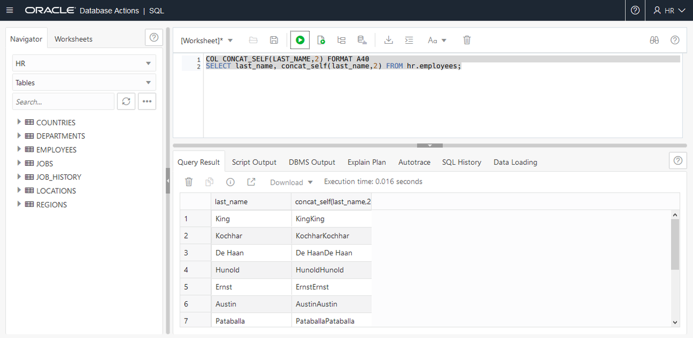
    </if>

    <if type="dbcs">

    ```
	  LAST_NAME                 CONCAT_SELF(LAST_NAME,2)
	  ------------------------- ----------------------------------------
	  Abel                      AbelAbel
	  Ande                      AndeAnde
	  Atkinson                  AtkinsonAtkinson
	  Austin                    AustinAustin
	  Baer                      BaerBaer
	  Baida                     BaidaBaida
	  Banda                     BandaBanda
	  Bates                     BatesBates
	  Bell                      BellBell
	  Bernstein                 BernsteinBernstein
	  Bissot                    BissotBissot
	  ...
	  107 rows selected.
    ```
    </if>

2. Use the SQM to query the table and display the employees names tripled.

    ```
    SQL> <copy>COL CONCAT_SELF(LAST_NAME,3) FORMAT A40</copy>

    SQL> <copy>SELECT last_name, concat_self(last_name,3) FROM hr.employees;</copy>
    ```

    <if type="atp">
    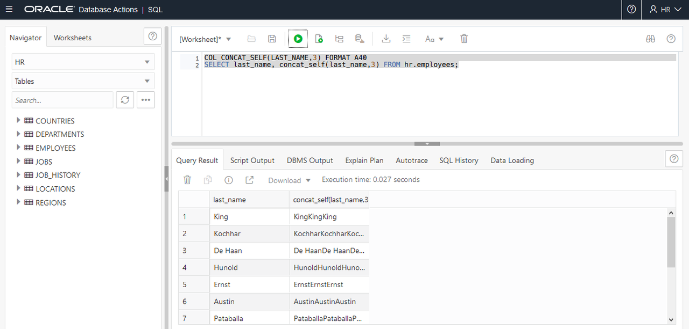
    </if>

    <if type="dbcs">
    ```
    LAST_NAME                 CONCAT_SELF(LAST_NAME,3)
    ------------------------- ----------------------------------------
    Abel                      AbelAbelAbel
    Ande                      AndeAndeAnde
    Atkinson                  AtkinsonAtkinsonAtkinson
    Austin                    AustinAustinAustin
    Baer                      BaerBaerBaer
    Baida                     BaidaBaidaBaida
    Banda                     BandaBandaBanda
    Bates                     BatesBatesBates
    Bell                      BellBellBell
    Bernstein                 BernsteinBernsteinBernstein
    Bissot                    BissotBissotBissot
    Bloom                     BloomBloomBloom
    Bull                      BullBullBull
    Cabrio                    CabrioCabrioCabrio
    ...
    107 rows selected.
    ```
    </if>

## Task 3: Use SQL Macro as a table expression
<if type="notused">
1.  Login to your ADB screen by clicking on the Hamburger Menu and selecting the Autonomous Database flavor you selected (ATP, ADW or AJD). Otherwise skip to the next step.


2.  If you can't find your ADB instance, ensure you are in the correct compartment, you have chosen the flavor of ADB you choose in the earlier lab and that you are in the correct region.

    
3.  Click on the **Display Name** to go to your ADB main page.
    

4.  Click on the **Tools** tab, select **Database Actions**, a new browser will open up.
    

5.  Login with the *admin* user, click **Next**.  Enter the password *WElcome123##*
6.  Click on the **SQL** button.
7.  Change the word *admin* in the URL to *hr*.  You will be logging in to the admin schema
8.  Enter the username *hr* and password *WElcome123##*
</if>

1. The first usage of an SQL macro as a table expression shows how to use the SQM to implement a polymorphic view.

2. Use a simple view to display the sum of the salaries per department.

    ```
    SQL> <copy>CREATE VIEW v_budget
     AS SELECT department_id, sum(salary) v_budget
        FROM hr.employees
        GROUP BY department_id;</copy>
    ```

    <if type="atp">
    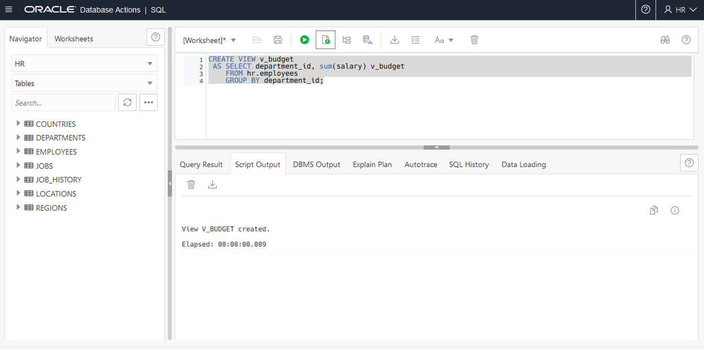
    </if>

    <if type="dbcs">
    ```
    ----------------------------------------------
    View created.
    ```
    </if>

3. Query the result from the view.

    ```
    SQL> <copy>SELECT * FROM v_budget WHERE department_id IN (10,50);</copy>
    ```

    <if type="atp">
    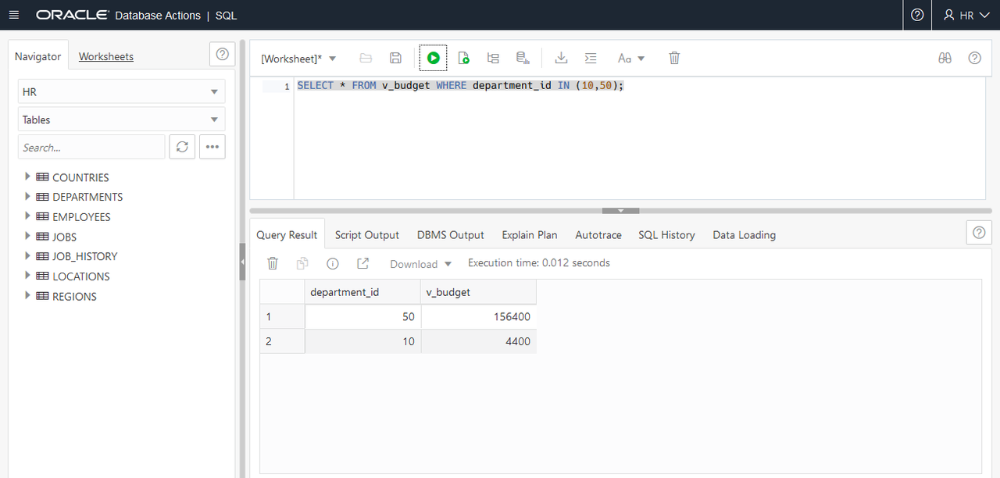
    </if>

    <if type="dbcs">
    ```
    DEPARTMENT_ID   V_BUDGET
    ------------- ----------
               50     156400
               10       4400
    ```
    </if>

4. Now use an SQM as a table expression. Create the SQM.

    ```
    SQL> <copy>CREATE OR REPLACE FUNCTION budget
    return varchar2 SQL_MACRO
    IS
    BEGIN
      RETURN q'( select department_id, sum(salary) budget
                 from hr.employees
                 group by department_id )';
    END;
    /</copy>
    ```

    <if type="atp">
    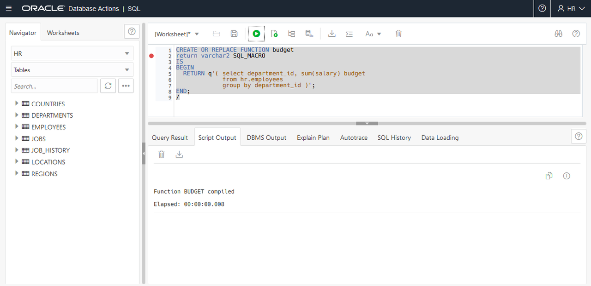
    </if>

    <if type="dbcs">
    ```
    ----------------------------------------------
    Function created.
    ```
    </if>

5. Use the SQM to display the result for the departments 10 and 50.

    ```
    SQL> <copy>SELECT * FROM budget() WHERE department_id IN (10,50);</copy>
    ```

    <if type="atp">
    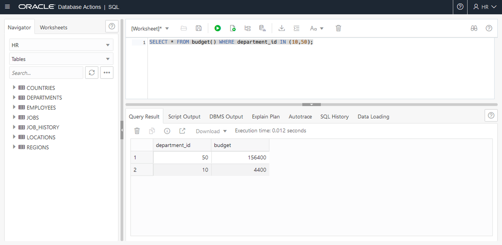
    </if>

    <if type="dbcs">
    ```
    DEPARTMENT_ID     BUDGET
    ------------- ----------
               50     156400
               10       4400
    ```
    </if>

6. The second usage of an SQL macro as a table expression shows how to use the SQM to display sum of the salaries per department for a particular job.


7. Create the SQM.

    ```
    SQL> <copy>CREATE OR REPLACE FUNCTION budget_per_job(job_id varchar2)
    return varchar2 SQL_MACRO
    IS
    BEGIN
      RETURN q'( select department_id, sum(salary) budget
                 from hr.employees
                 where job_id = budget_per_job.job_id
                 group by department_id )';
    END;
    /</copy>
    ```

    <if type="atp">
    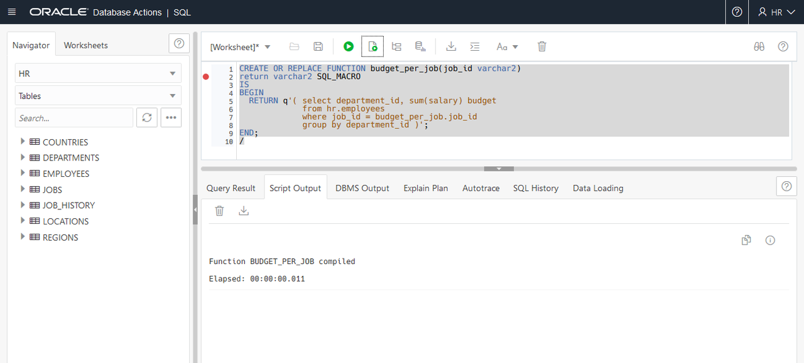
    </if>

    <if type="dbcs">
    ```
    ----------------------------------------------
    Function created.
    ```
    </if>

8. Use the SQM to display the result for the `ST_CLERK` job in department 10.

    ```
    SQL> <copy>SELECT * FROM budget_per_job('ST_CLERK') WHERE department_id = 10;</copy>
    ```

    <if type="atp">
    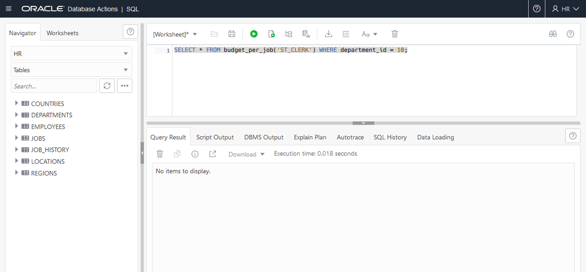
    </if>

    <if type="dbcs">
    ```
    ----------------------------------------------
    no rows selected
    ```
    </if>

9. Use the SQM to display the result for the `SH_CLERK` job in department 50.

    ```
    SQL> <copy>SELECT * FROM budget_per_job('SH_CLERK') WHERE department_id = 50;</copy>
    ```

    <if type="atp">
    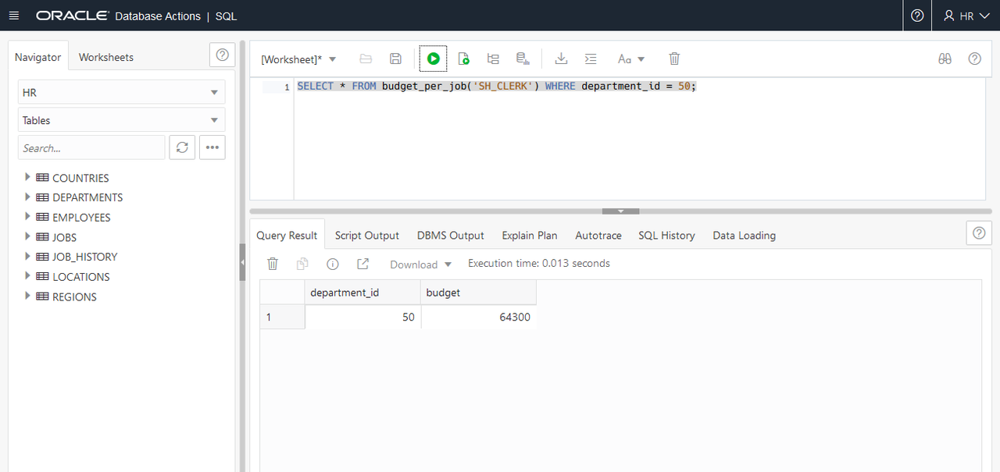
    </if>

    <if type="dbcs">
    ```
    DEPARTMENT_ID BUDGET_PER_JOB
    ------------- --------------
               50          64300
    ```
    </if>

10. Use the `DBMS_OUTPUT` package to display the rewritten SQL query. Recreate the function including the `DBMS_OUTPUT` package.

    ```
    SQL> <copy>CREATE OR REPLACE function budget_per_job(job_id varchar2)
    return varchar2 SQL_MACRO
    is
      stmt varchar(2000) := q'(
       select department_id, sum(salary) budget
       from hr.employees
       where job_id = budget_per_job.job_id
       group by department_id )';
    begin
      dbms_output.put_line('----------------------------------------------');
      dbms_output.put_line('SQM Text: ' );
      dbms_output.put_line('----------------------------------------------');
      dbms_output.put_line('  ' ||stmt);
      dbms_output.put_line('----------------------------------------------');
      return stmt;
    end;
    /</copy>
    ```

    <if type="atp">
    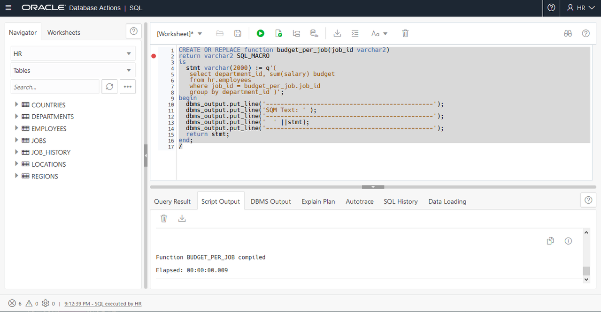
    </if>

    <if type="dbcs">
    ```
    ----------------------------------------------
    Function created.
    ```
    </if>

<if type="dbcs">
11. Re-execute the query using the SQM.

    ```
    SQL> <copy>SET serveroutput on</copy>
    SQL> <copy>SET LONG 20000</copy>
    SQL> <copy>SELECT * FROM budget_per_job('ST_CLERK') WHERE department_id = 50;</copy>

    DEPARTMENT_ID     BUDGET
    ------------- ----------
               50      55700

    ----------------------------------------------
    SQM Text:
    ----------------------------------------------

       select department_id, sum(salary) budget
       from hr.employees
       where
       job_id = budget_per_job.job_id
       group by department_id
    ----------------------------------------------
    ```
12. Use the `USER_PROCEDURES` view to display the new values of the `SQL_MACRO` column.

    ```
    SQL> <copy>COL object_name FORMAT A30</copy>
    SQL> <copy>SELECT object_name, sql_macro, object_type FROM user_procedures;</copy>

    OBJECT_NAME                    SQL_MA OBJECT_TYPE
    ------------------------------ ------ -------------
    CONCAT_SELF                    SCALAR FUNCTION
    SECURE_DML                     NULL   PROCEDURE
    ADD_JOB_HISTORY                NULL   PROCEDURE
    BUDGET                         TABLE  FUNCTION
    BUDGET_PER_JOB                 TABLE  FUNCTION
    SECURE_EMPLOYEES                      TRIGGER
    UPDATE_JOB_HISTORY                    TRIGGER

    7 rows selected.
    ```

13. Exit SQL*Plus.

    ```
    SQL> <copy>EXIT</copy>
    $

    ```

</if>
<if type="atp">
11. Re-execute the query using the SQM.

    ```
    SQL> <copy>SELECT * FROM budget_per_job('ST_CLERK') WHERE department_id = 50;</copy>
    ```

    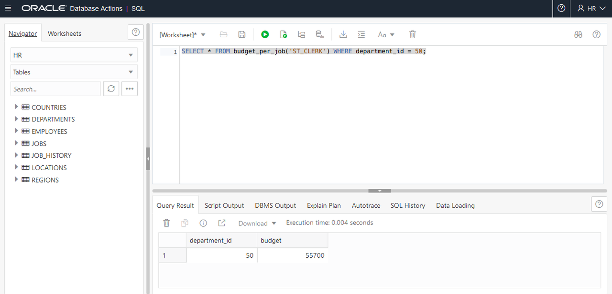


12. Use the `USER_PROCEDURES` view to display the new values of the `SQL_MACRO` column.

    ```
    SQL> <copy>SELECT object_name, sql_macro, object_type FROM user_procedures;</copy>
    ```

    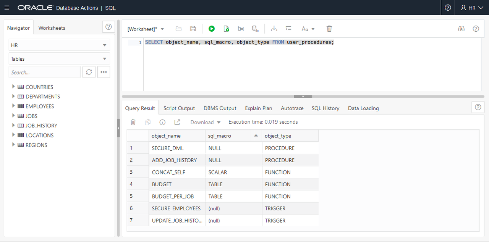

</if>

You may now [proceed to the next lab](#next).

## Learn More
- [SQL Macros - LiveSQL](https://livesql.oracle.com/apex/livesql/file/tutorial_KQNYERE8ZF07EZMRR6KJ0RNIR.html)
- [SQL Macros on ADB](https://blogs.oracle.com/datawarehousing/sql-macros-have-arrived-in-autonomous-database)

## Acknowledgements
* **Author** - Donna Keesling, Database UA Team
* **Contributors** -  David Start, Kay Malcolm, Didi Han, Database Product Management
* **Last Updated By/Date** -  Madhusudhan Rao, Apr 2022
