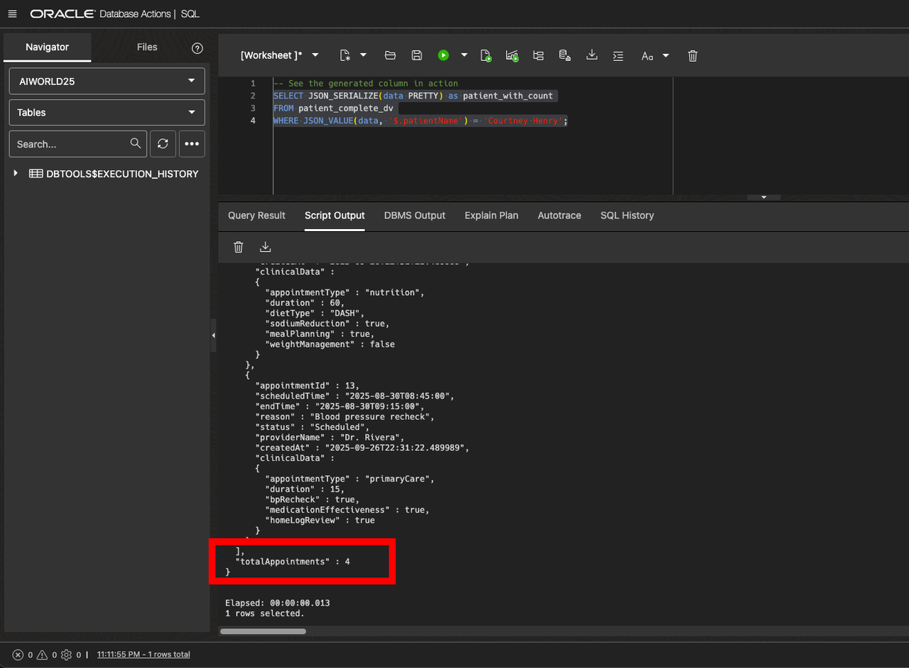

# JSON Relational Duality Views: Unified Healthcare Data Access with Oracle AI Database 26ai

## Introduction

Welcome to the **JSON Relational Duality Views** lab! This session demonstrates how Oracle AI Database 26ai's duality views solve a fundamental challenge in modern application development: accessing the same data through both relational and document interfaces.

**The Challenge:** Modern applications often need both data access patterns:
- **Relational access** - SQL queries, reporting, analytics, and compliance systems work best with structured tables
- **Document access** - Mobile apps, REST APIs, and real-time dashboards prefer flexible JSON documents  
- **Traditional approach** - Choose one data model or maintain complex dual storage systems

**Oracle 26ai's Solution:** JSON Relational Duality Views present the same underlying data as both relational tables and JSON documents. Updates through either interface automatically synchronize, maintaining ACID compliance across both data models.

In this lab, we'll use our LumenCare healthcare scenario to explore duality views, but this technology applies to any industry where applications need flexible data access patterns.

Estimated Lab Time: 20 minutes

### What You'll Learn

- Creating JSON Relational Duality Views over existing healthcare tables
- Updating data through duality views with automatic relational synchronization
- Querying the same data in both relational and JSON formats
- Understanding ACID compliance across document and relational operations
- Leveraging duality views for modern healthcare applications

### Prerequisites

- Access to Oracle AI Database 26ai
- Completion of previous LumenCare labs (Domains & Annotations, JSON Data Type, AI Vector Search)
- Basic understanding of JSON and SQL


## Task 1: Prepare Data for Duality Views

1. **What we're building:** Duality views present the same underlying relational tables as JSON documents. We'll create views that let applications access patient and appointment data either as SQL tables or as JSON documents, with all changes automatically synchronized.

2. **Review the foundation data:** Let's examine the relational tables we've built in previous labs that will become the foundation for our duality views:

    ```sql
    <copy>
    -- Check existing patients table
    SELECT id, name, dob, sex, primary_reason 
    FROM patients
    ORDER BY id;
    </copy>
    ```

    ```sql
    <copy>
    -- Check existing appointments with JSON data
    SELECT p.name as patient_name,
           a.id as appointment_id,
           a.start_time,
           a.reason,
           a.status,
           a.provider_name,
           JSON_SERIALIZE(a.appointment_data PRETTY) as appointment_details
    FROM appointments a
    JOIN patients p ON a.patient_id = p.id
    ORDER BY p.id, a.start_time;
    </copy>
    ```

3. **Add schema flexibility for duality views:** One advantage of JSON documents is schema flexibility - you can add new fields without changing table structure. To enable this in our duality views, we'll add a JSON column that can store additional patient information:

    ```sql
    <copy>
    -- Add a flexible JSON column for future patient information
    ALTER TABLE patients ADD (
        patient_extras JSON (object)
    );
    </copy>
    ```

## Task 2: Create Duality Views

1. **What we're building:** Duality views define how relational data appears as JSON documents and what operations are allowed. We'll create two different views over the same tables to demonstrate different access patterns and permissions.

2. **Create a patient-centric duality view** with comprehensive data access:

    ```sql
    <copy>
    -- Create a comprehensive patient duality view with schema flexibility
    CREATE OR REPLACE JSON RELATIONAL DUALITY VIEW patient_complete_dv AS
    patients @insert @update
    {
        _id: id,
        patientName: name,
        dateOfBirth: dob,
        sex: sex,
        primaryReason: primary_reason,
        joinedDate: created_at,
        patient_extras @flex,
        appointments: appointments @insert @update @delete
        [
            {
                appointmentId: id,
                scheduledTime: start_time,
                endTime: end_time,
                reason: reason,
                status: status,
                providerName: provider_name,
                createdAt: created_at,
                clinicalData: appointment_data
            }
        ]
    };
    </copy>
    ```

    **What this creates:**
    - **`patients @insert @update`**: Can create and modify patients, but cannot delete them (no `@delete`)
    - **`appointments @insert @update @delete`**: Full appointment management capabilities  
    - **`@flex`**: The `patient_extras` field can store additional JSON data without changing table structure
    - **Nested structure**: Appointments appear as an array within each patient document

3. **Create an appointment-focused duality view** with different permissions:

    ```sql
    <copy>
    -- Create an appointment-focused duality view for mobile apps
    CREATE OR REPLACE JSON RELATIONAL DUALITY VIEW appointment_mobile_dv AS
    appointments @insert @update @delete
    {
        _id: id,
        scheduledTime: start_time,
        appointmentLength: end_time,
        reason: reason,
        currentStatus: status,
        provider: provider_name,
        metadata: appointment_data,
        patientInfo: patients
        {
            patientId: id,
            name: name,
            dob: dob,
            sex: sex
        }
    };
    </copy>
    ```

    **What this creates:**
    - **`appointments @insert @update @delete`**: Full appointment management capabilities
    - **`patients` (no permissions)**: Read-only access to patient information - can read but cannot modify patient demographics
    - **Different structure**: Appointment-centric with nested patient info (reverse of the first view)
    - **Benefit**: Mobile apps can manage appointments but cannot accidentally modify patient master data

## Task 3: Query Data Through Duality Views

1. **Basic JSON document querying:** Duality views automatically expose your relational data as JSON documents. Let's query patient data in JSON format:

    ```sql
    <copy>
    -- View complete patient records as JSON documents
    SELECT JSON_SERIALIZE(data PRETTY) as patient_document
    FROM patient_complete_dv
    WHERE JSON_VALUE(data, '$."patientName"') = 'Courtney Henry';
    </copy>
    ```

2. **Query the appointment-focused view:** The same data appears in different structure through our mobile duality view:

    ```sql
    <copy>
    -- View appointments in mobile-optimized format
    SELECT JSON_SERIALIZE(data PRETTY) as mobile_appointment
    FROM appointment_mobile_dv 
    WHERE JSON_VALUE(data, '$."currentStatus"') = 'Completed'
    ORDER BY JSON_VALUE(data, '$."scheduledTime"')
    FETCH FIRST 3 ROWS ONLY;
    </copy>
    ```

3. **Compare relational vs document approaches:** The same analysis can be done through traditional SQL or JSON document queries:

    ```sql
    <copy>
    -- Relational view: Traditional SQL query
    SELECT p.name, 
           COUNT(a.id) as appointment_count,
           AVG(JSON_VALUE(a.appointment_data, '$.duration' RETURNING NUMBER)) as avg_duration
    FROM patients p
    LEFT JOIN appointments a ON p.id = a.patient_id
    GROUP BY p.id, p.name
    ORDER BY appointment_count DESC;
    </copy>
    ```

    ```sql
    <copy>
    -- Document view: Derive appointment count by COUNT(*) after JSON_TABLE expansion
    SELECT JSON_VALUE(p.data, '$.patientName') as name,
        COUNT(t.duration) as appointment_count,
        AVG(t.duration) as avg_duration
    FROM patient_complete_dv p
    LEFT JOIN JSON_TABLE(
        JSON_QUERY(p.data, '$.appointments'), '$[*]'
        COLUMNS (duration NUMBER PATH '$.clinicalData.duration')
    ) t ON 1=1
    GROUP BY JSON_VALUE(p.data, '$.patientName')
    ORDER BY appointment_count DESC;
    </copy>
    ```

4. **Schema flexibility with flex fields:** Duality views support adding new JSON fields without changing the table structure. Our `patient_extras @flex` field enables this - any new JSON properties get stored in this flexible column:

    ```sql
    <copy>
    -- Add flexible patient information using the flex field
    UPDATE patient_complete_dv p
    SET p.data = JSON_TRANSFORM(
        data,
        SET '$.insuranceProvider' = 'Blue Cross Blue Shield',
        SET '$.emergencyContact' = JSON_OBJECT(
            'name' VALUE 'Sarah Johnson',
            'relationship' VALUE 'Spouse', 
            'phone' VALUE '555-0123'
        ),
        SET '$.allergies' = JSON_ARRAY('penicillin', 'shellfish')
    )
    WHERE JSON_VALUE(data, '$.patientName') = 'Courtney Henry';
    
    COMMIT;
    </copy>
    ```

    ```sql
    <copy>
    -- View the enhanced patient document
    SELECT JSON_SERIALIZE(data PRETTY) as enhanced_patient_data
    FROM patient_complete_dv
    WHERE JSON_VALUE(data, '$.patientName') = 'Courtney Henry';
    </copy>
    ```

    **Verify the flexibility:** The new fields were added without changing the table structure. Check where they're stored in the relational table:

    ```sql
    <copy>
    -- See where the flex data is stored in the relational table
    SELECT name, JSON_SERIALIZE(patient_extras PRETTY) as extras_data
    FROM patients 
    WHERE name = 'Courtney Henry';
    </copy>
    ```

5. **Generated fields for calculated data:** Duality views can include calculated fields that are automatically derived from other data. Let's add a field that shows the total number of appointments for each patient:

    ```sql
    <copy>
    -- Recreate the patient duality view with a generated column
    CREATE OR REPLACE JSON RELATIONAL DUALITY VIEW patient_complete_dv AS
    patients @insert @update
    {
        _id: id,
        patientName: name,
        dateOfBirth: dob,
        sex: sex,
        primaryReason: primary_reason,
        joinedDate: created_at,
        appointments: appointments @insert @update @delete
        [
            {
                appointmentId: id,
                scheduledTime: start_time,
                endTime: end_time,
                reason: reason,
                status: status,
                providerName: provider_name,
                createdAt: created_at,
                clinicalData: appointment_data
            }
        ],
        totalAppointments @generated (path: "$.appointments.size()")
    };
    </copy>
    ```

    **Test the generated field:** The view now automatically calculates appointment counts:

    ```sql
    <copy>
    -- See the generated column in action
    SELECT JSON_SERIALIZE(data PRETTY) as patient_with_count
    FROM patient_complete_dv
    WHERE JSON_VALUE(data, '$.patientName') = 'Courtney Henry';
    </copy>
    ```

    The `totalAppointments` field is automatically calculated from the appointments array size. 

    

## Task 4: Update Data Through Duality Views

1. **Why update through JSON documents:** Duality views enable applications to insert and update data using JSON operations instead of SQL. Changes made through any duality view automatically synchronize to the underlying tables and all other views.

2. **Reset the view structure** for cleaner update examples:

    ```sql
    <copy>
    -- Recreate the patient duality view without generated fields for update examples
    CREATE OR REPLACE JSON RELATIONAL DUALITY VIEW patient_complete_dv AS
    patients @insert @update
    {
        _id: id,
        patientName: name,
        dateOfBirth: dob,
        sex: sex,
        primaryReason: primary_reason,
        joinedDate: created_at,
        patient_extras @flex,
        appointments: appointments @insert @update @delete
        [
            {
                appointmentId: id,
                scheduledTime: start_time,
                endTime: end_time,
                reason: reason,
                status: status,
                providerName: provider_name,
                createdAt: created_at,
                clinicalData: appointment_data
            }
        ]
    };
    </copy>
    ```

3. **Add data through JSON document operations:** Insert a new appointment by updating the JSON document:

    ```sql
    <copy>
    -- Add appointment through patient duality view using JSON_TRANSFORM
    UPDATE patient_complete_dv p
    SET p.data = JSON_TRANSFORM(
        data,
        APPEND '$."appointments"' = JSON_OBJECT(
            'appointmentId' VALUE 999,
            'scheduledTime' VALUE TIMESTAMP '2025-09-15 14:30:00',
            'reason' VALUE 'Follow-up consultation',
            'status' VALUE 'Scheduled',
            'providerName' VALUE 'Dr. Jennifer Park',
            'clinicalData' VALUE JSON_OBJECT(
                'appointmentType' VALUE 'orthopedic',
                'duration' VALUE 30,
                'followUpWeeks' VALUE 4
            )
        )
    )
    WHERE JSON_VALUE(data, '$."patientName"') = 'Courtney Henry';
    
    COMMIT;
    </copy>
    ```

4. **Verify automatic synchronization:** The new appointment should now appear in the relational table and all duality views:

    ```sql
    <copy>
    -- Check the relational table
    SELECT reason, status, provider_name, 
           JSON_VALUE(appointment_data, '$.appointmentType') as type
    FROM appointments 
    WHERE id = 999;
    </copy>
    ```

    ```sql
    <copy>
    -- Check the mobile duality view
    SELECT JSON_SERIALIZE(data PRETTY) as mobile_view
    FROM appointment_mobile_dv
    WHERE JSON_VALUE(data, '$._id') = '999';
    </copy>
    ```

5. **Update through a different view:** Modify the appointment status through the mobile duality view:

    ```sql
    <copy>
    -- Update status through mobile duality view
    UPDATE appointment_mobile_dv a
    SET a.data = JSON_TRANSFORM(
        data,
        SET '$."currentStatus"' = 'In Progress'
    )
    WHERE JSON_VALUE(data, '$._id') = '999';
    
    COMMIT;
    </copy>
    ```

6. **Confirm cross-view synchronization:** The status change should appear in both the patient view and base table:

    ```sql
    <copy>
    -- Verify appointment 999 status in patient view
    SELECT appointment_id, status
    FROM patient_complete_dv p,
         JSON_TABLE(JSON_QUERY(p.data, '$.appointments'), '$[*]'
             COLUMNS (
                 appointment_id NUMBER PATH '$.appointmentId',
                 status VARCHAR2(50) PATH '$.status'
             )) t
    WHERE JSON_VALUE(p.data, '$.patientName') = 'Courtney Henry'
      AND appointment_id = 999;
    </copy>
    ```

    ```sql
    <copy>
    -- Verify in base table - shows the same status
    SELECT status FROM appointments WHERE id = 999;
    </copy>
    ```

## Task 5: Duality View Security and Permissions

1. **Why granular permissions matter:** Duality views let you control exactly what each application can modify. For example, a mobile scheduling app should manage appointments but not accidentally change patient master data. Each duality view enforces its own permission rules.

2. **Test permission restrictions:** Our mobile view was created with read-only access to patient data. Let's see what happens when we try to modify patient information through it:

    ```sql
    <copy>
    -- This should fail - mobile view doesn't allow patient updates
    UPDATE appointment_mobile_dv a
    SET a.data = JSON_TRANSFORM(
        data,
        SET '$.patientInfo.name' = 'Courtney Henry-Smith'
    )
    WHERE JSON_VALUE(data, '$._id') = '999';
    </copy>
    ```

    **Expected Result:** This fails because the mobile view doesn't have `@update` permissions on the patients table - only on appointments.

3. **Use the correct view for patient updates:** The patient-focused view has the required permissions:

    ```sql
    <copy>
    -- This works - patient view allows patient updates
    UPDATE patient_complete_dv p
    SET p.data = JSON_TRANSFORM(
        data,
        SET '$.patientName' = 'Courtney Henry-Smith'
    )
    WHERE JSON_VALUE(data, '$.patientName') = 'Courtney Henry';
    
    COMMIT;
    </copy>
    ```

4. **Verify the security model:** Check that the update succeeded and is visible across views:

    ```sql
    <copy>
    -- Check the updated name appears in patient view
    SELECT JSON_VALUE(data, '$.patientName') as updated_name
    FROM patient_complete_dv
    WHERE JSON_VALUE(data, '$._id') = '3';
    </copy>
    ```

    ```sql
    <copy>
    -- Check the same change appears in mobile view (read-only access to patient info)
    SELECT JSON_VALUE(data, '$.patientInfo.name') as patient_name_in_mobile_view
    FROM appointment_mobile_dv
    WHERE JSON_VALUE(data, '$._id') = '999';
    </copy>
    ```

    **Security model confirmed:** The mobile view can read the updated patient name but cannot modify it. This demonstrates how duality views provide fine-grained access control - each view enforces exactly the permissions it was designed with.


## Conclusion

In this lab, you've explored Oracle AI Database 26ai's JSON Relational Duality Views:

- **Task 1**: Added schema flexibility to existing healthcare data
- **Task 2**: Created duality views with precise access control permissions 
- **Task 3**: Queried data through both relational and document interfaces, experienced schema flexibility with flex fields, and used generated columns
- **Task 4**: Updated data through duality views with automatic synchronization
- **Task 5**: Tested security permissions across different duality views

You've seen how duality views provide unified access to the same data as both relational tables and JSON documents, with automatic synchronization and granular security control.

## Learn More

* [JSON Relational Duality Views Documentation](https://docs.oracle.com/en/database/oracle/oracle-database/23/jsnvu/overview-json-relational-duality-views.html)
* [Duality View SQL Reference](https://docs.oracle.com/en/database/oracle/oracle-database/23/sqlrf/create-json-relational-duality-view.html)


## Acknowledgements
* **Author** - Killian Lynch, Database Product Management  
* **Last Updated By/Date** - Killian Lynch, September 2025