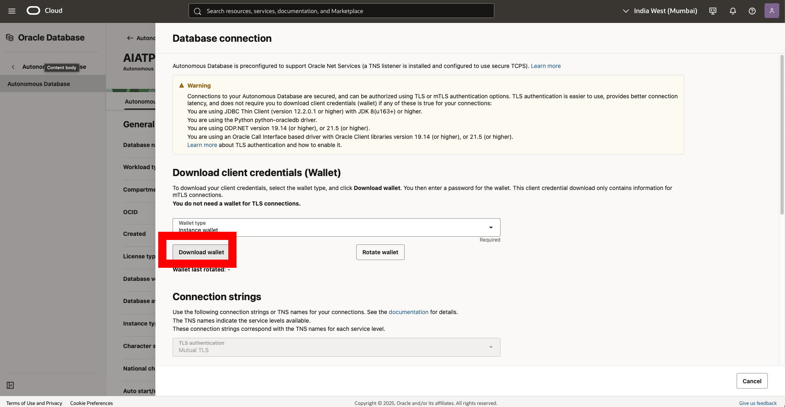
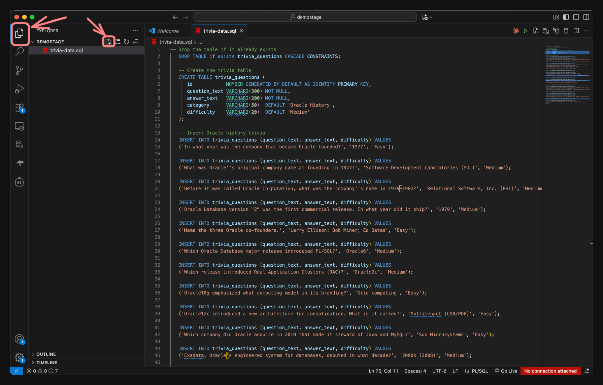

# Oracle SQLcl MCP Server with the Oracle AI Database

## Introduction

In this lab you'll learn how to set up and use the SQLcl MCP Server with an AI agent in VS Code. The SQLcl MCP Server enables you to connect your Oracle AI Database to AI assistants—whether that's Copilot, Cline, Claude Desktop, or any other tool that supports the Model Context Protocol (MCP).

The MCP Server acts as a bridge between your database and AI tools, allowing you to use natural language to interact with your data, run SQL queries, and execute database commands. Instead of writing SQL from scratch, you can describe what you want to do and let the AI assistant handle the technical details.

For this demonstration, we'll use VS Code with Copilot, but the steps work with other MCP-capable agents as well. Once configured, you'll be able to use natural language to list connections, run SQL scripts, and build a simple trivia game.

**Estimated Lab Time:** 20 minutes

### Objective
By the end of this lab you will be able to:
- Download and configure SQLcl (with MCP support)
- Install and set up the SQL Developer and Cline extensions for VS Code
- Connect to your Oracle AI Database using a wallet
- Configure your MCP settings in VS Code
- Use the SQLcl MCP server with an AI agent to list connections, run SQL, and create a trivia game table

### Prerequisites
**This lab assumes you have:**
- Oracle Java 17 or 21 installed
- Access to an Oracle AI Database (FreeSQL, LiveSQL, or an Autonomous Database with wallet)
- Oracle account credentials
- VS Code installed on your machine


## Task 1: Download Your Wallet

**What is a wallet?**
A wallet is a secure file that contains the connection credentials and certificates needed to access your Oracle Autonomous Database. It ensures your database connection is encrypted and authenticated.

**Why you need it:**
We're going to use the wallet to connect the SQL Developer VS code extension with our autonomous database 

1. From your Autonomous Database home page, **click** Database connection and download the database **Wallet**.  

   
   

2. Give the wallet a password. You can make your password anything you like, just don't forget it. (I suggest using the same password for the workshop) and click Download in the bottom right
    * Password: **OracleAIworld2025**

   

**Verify your download:**
Check that a `.zip` file was downloaded to your computer (usually in your Downloads folder). This file contains your wallet credentials.


## Task 2: Install SQL Developer Extension for VS Code

**What this extension does:**
The Oracle SQL Developer Extension allows you to work with and manage Oracle AI Databases in VS Code.

**Why you need it:**
This extension will store your database connection details

1. Open VS Code and go to the **Extensions** view.  
2. Search for “Oracle SQL Developer” and click **Install**.  
   Or install directly from the [Marketplace](https://marketplace.visualstudio.com/items?itemName=Oracle.sql-developer).  

   

3. Once installed, open the SQL Developer Extension in the Activity Bar.  
   

4. Click **Create Connection** 
   

5. Enter your wallet connection details:

      1. connection name: **AIWorld-HOL**
      2. username: **aiworld25**
      3. password: **OracleAIworld2025**
      4. check the box to **save the password**
      5. Select the connection type dropdown. Select: **Cloud Wallet**
      6. Click choose file and select the wallet
      7. **Test the connection** to verify it works, then **Save**

   

   **Verify your setup:**
   You should see your new connection "AIWorld-HOL" listed in the SQL Developer Extension panel. If the connection test fails, double-check your credentials and wallet file.

---

## Task 3: Install the Cline Extension

Cline is an open-source AI Coding agent.

1. In VS Code Extensions, search for “Cline” and install it.  
   

2. Open Cline in the Activity Bar.

   

3. Configure your AI provider. You have several options:
      - Use Cline's free service (click **Get started for free**)
      - Use your own API key from OpenAI, Anthropic, or other providers
      - Use Oracle Code Assist with your Oracle SSO

   For this demo, we'll show the free option. Click **Get started for free** if you want to use Cline's service.

   

4. If using Cline's free service, you'll be prompted to sign up. Follow the instructions to create an account (this is optional - you can skip if you have your own API keys).

5. Configure your AI model:
      - Click the **gear icon** to open Cline settings
      - Click **API Configuration**

   

6. Select your preferred AI provider and model. For the free option, choose one of Cline's available free models.

   

## Task 4: Install SQLcl

**What SQLcl is:**
SQLcl is Oracle's modern command-line interface for working with Oracle AI Databases. It includes the MCP Server functionality that allows AI assistants and coding agents to interact with your database securely.

**Why you need version 25.2 or later:**
The MCP Server feature was introduced in SQLcl version 25.2, so earlier versions won't work for this lab.

**Installation options:**

**Option 1: Download directly (recommended)**
1. Download SQLcl (25.2 or later) from [this link](https://download.oracle.com/otn_software/java/sqldeveloper/sqlcl-25.2.0.184.2054.zip). The SQLcl tool is offered under [Oracle Free Use License](https://www.oracle.com/downloads/licenses/oracle-free-license.html).

2. Unzip the downloaded folder to a location you'll remember. For this demo, we'll use the Downloads folder, but you can choose any location.

   

**Option 2: Install via Homebrew (Mac users)**
   ```bash
   brew install --cask sqlcl
   ```

**Verify your installation:**
   - If you downloaded the zip file, you should see a folder named `sqlcl` with a `bin` directory inside it
   - If you used Homebrew, SQLcl will be available in your system PATH
   - Note the full path to your SQLcl installation - you'll need it for the next task

## Task 5: Configure Cline with the SQLcl MCP Server

**What this configuration does:**
This step connects Cline (your AI assistant) to the SQLcl MCP Server. Once configured, Cline will be able to execute database commands on your behalf using natural language requests.

**Why this connection is important:**
Without this configuration, Cline can't access your database. The MCP Server acts as a secure bridge, allowing Cline to run SQL queries and manage your database connections safely.

1. In VS Code, click the Cline extension on the left-hand side and click the **MCP Servers** icon at the top of the screen.  
   

2. Click **Configure** and then **Configure MCP Servers**. This opens a JSON configuration file.  
   

3. **Update the JSON configuration** with your SQLcl path. Replace the placeholder text with the actual path to your SQLcl installation from Task 4.

   **For downloaded SQLcl:** Use the path to your unzipped folder
   **For Homebrew installation:** Use `/opt/homebrew/bin/sql` (or `/usr/local/bin/sql` on older Macs)

      ```json
      <copy>
      {
         "mcpServers": {
            "sqlcl": {
               "command": "[UPDATE THIS WITH YOUR PATH TO SQLCL]/bin/sql",
               "args": ["-mcp"]
            }
         }
      }
      </copy>
      ```
   
   **Example paths:**
      - Downloaded: `/Users/yourname/Downloads/sqlcl/bin/sql`
      - Homebrew: `/opt/homebrew/bin/sql`

   

4. **Save the file**. You should see SQLcl appear under **Installed MCP Servers**.  
   

   **Verify your configuration:**
      - SQLcl should appear in the "Installed MCP Servers" list
      - If you don't see it, double-check your file path in the JSON configuration
      - If there's an error, make sure your SQLcl installation is working by testing it in a terminal

5. Click anywhere in the SQLcl bar to expand it. You'll see the available database tools that Cline can now use:

   

   **Available tools:**
      - **`list-connections`** - Shows your saved database connections
      - **`connect`** - Connects to a specific database
      - **`disconnect`** - Safely disconnects from the database  
      - **`run-sqlcl`** - Executes SQLcl commands
      - **`sql`** - Runs SQL queries

6. Click **Done** to complete the configuration.

   

**What you've accomplished:**
Cline can now securely communicate with your Oracle AI Database through the MCP Server. You're ready to start using natural language to interact with your data!


## Task 6: Using the MCP Server

**What you'll accomplish:**
In this task, you'll use natural language to interact with your Oracle AI Database through Cline and the MCP Server. You'll list your connections, load sample data, and build a simple application.

**Understanding Cline modes:**
   - **Plan mode:** Cline creates a plan and asks for approval before executing
   - **Act mode:** Cline executes immediately (use with caution)

**Security first:** Always keep "Auto-Approve" disabled to review what Cline wants to do before it acts.

1. In Cline, make sure you're in **Plan** mode and "Auto-Approve" is disabled.

   

   > &#9888; **IMPORTANT:** For security best practices, ensure the "Auto-Approve" option is disabled.


2. Enable **Plan** mode. Then, in the Task input area of Cline, enter the following prompt:

      ```text
      <copy>
      Using the sqlcl mcp server, list my database connections.
      </copy>
      ```
   

3. Cline will create a plan and ask permission to use the `list-connections` tool. Review the request and click **Approve** if it looks correct.

   

4. The output will return the list of connections available to the SQLcl MCP Server. Here we can see the AIWorld-HOL connection we made earlier in the lab

      

5. **What we're building:** A trivia app with Oracle history questions. First, we need to create the data. Create a new file in VS Code called `trivia-data.sql` and copy this script:


   <details>
      <summary style="color: #0055ffff";><kbd style="font-size: 10px;">(click) </kbd><strong>SQL Script</strong></summary>
      <p></p>
      <button>
      <a href="./trivia-data.sql" target="_self" download="trivia-data.sql">Download .sql file</a>
      </button>
      <p></p>
    
      ```sql
      <copy>
      -- Drop the table if it already exists (optional for a clean reset)
      DROP TABLE if exists trivia_questions CASCADE CONSTRAINTS;

      -- Create the trivia table
      CREATE TABLE trivia_questions (
         id            NUMBER GENERATED BY DEFAULT AS IDENTITY PRIMARY KEY,
         question_text VARCHAR2(500) NOT NULL,
         answer_text   VARCHAR2(200) NOT NULL,
         category      VARCHAR2(50)  DEFAULT 'Oracle History',
         difficulty    VARCHAR2(20)  DEFAULT 'Medium'
      );

      -- Insert Oracle history trivia
      INSERT INTO trivia_questions (question_text, answer_text, difficulty) VALUES
      ('In what year was the company that became Oracle founded?', '1977', 'Medium');

      INSERT INTO trivia_questions (question_text, answer_text, difficulty) VALUES
      ('Which Oracle Database major release introduced PL/SQL?', 'Oracle 6', 'Medium');

      INSERT INTO trivia_questions (question_text, answer_text, difficulty) VALUES
      ('Which release introduced Real Application Clusters (RAC)?', 'Oracle 9i', 'Medium');

      INSERT INTO trivia_questions (question_text, answer_text, difficulty) VALUES
      ('Oracle 10g emphasized what computing model in its branding?', 'Grid computing', 'Easy');

      INSERT INTO trivia_questions (question_text, answer_text, difficulty) VALUES
      ('Oracle 12c introduced a new architecture for consolidation. What is it called?', 'Multitenant (CDB/PDB)', 'Easy');

      INSERT INTO trivia_questions (question_text, answer_text, difficulty) VALUES
      ('Which company did Oracle acquire in 2010 that made it steward of Java and MySQL?', 'Sun Microsystems', 'Easy');

      INSERT INTO trivia_questions (question_text, answer_text, difficulty) VALUES
      ('Exadata, Oracle’s engineered system for databases, debuted in what decade?', '2000s (2008)', 'Medium');

      INSERT INTO trivia_questions (question_text, answer_text, difficulty) VALUES
      ('Oracle Autonomous Database was first announced in which year?', '2017', 'Medium');

      INSERT INTO trivia_questions (question_text, answer_text, difficulty) VALUES
      ('What is the internal name for the relational engine that inspired Oracle''s original product name?', 'Oracle (from a CIA project codename)', 'Hard');

      INSERT INTO trivia_questions (question_text, answer_text, difficulty) VALUES
      ('Who was Oracle''s first customer?', 'The CIA', 'Medium');

      INSERT INTO trivia_questions (question_text, answer_text, difficulty) VALUES
      ('Which Oracle release name introduced the concept of "c" for cloud?', 'Oracle 12c', 'Easy');

      -- Save the data
      COMMIT;

      </copy>
      ```

   </details>

6. **Save the file** in VS Code.

   

7. Now ask Cline to load the data into your database. Enter this prompt:

      ```text
      <copy>
      use the run-sqlcl command to load the @/trivia-data.sql into the AIWorld-HOL database connection 
      </copy>
      ```

8. **Review the plan:** Cline will show you what it wants to do. This is your chance to verify the SQL commands before they execute. Click **Approve** if everything looks correct.

   **Verify the data was loaded:**
   The MCP Server should confirm successful execution, and you should see confirmation that the table was created and data was inserted.

   


9. Now let's use our database to build something useful. Enter this prompt:

      ```text
      <copy>
      Now build me a simple trivia web application for a conference presentation. The app should display the questions and data we stored in the database. For the sake of simplicity, make a static site. 
      </copy>
      ```

10. **Review carefully:** Cline will create a plan to build your application. Review the SQL queries it plans to use to ensure they match your data structure.

   > &#9888; **Warning:** Always review the SQL statements Cline wants to execute. You can modify the prompt to be more specific about what queries to use.

   **What you should see:**
   Cline will build a working trivia application using the data from your database, demonstrating the power of natural language database interaction.

11. **Disconnect safely:** When finished, ask Cline to close your database connection:

      ```text
      <copy>
      Please disconnect from the database connection.
      </copy>
      ```

   Approve the disconnect request to ensure proper cleanup.

12. The SQLcl MCP Server logs all operations in the `DBTOOLS$MCP_LOG` table. You can query this table to see a history of all SQL, PL/SQL, and scripts executed on your behalf.

   **Interested in learning more?**

   Check out the full MCP Session **Agentic AI for the Oracle AI Database via Our MCP Server (Offering 2) [HOL3088]**  Thursday, Oct 16
   9:00 AM - 10:30 AM PDT

## Clean Up

1. If you’d like to reset your environment, drop the table as follows, or ask the coding agent to do it for you! (don't forget to ask it to disconnect when you're done).

   ```sql
   <copy>
   DROP TABLE trivia_questions PURGE;
   </copy>
   ```

---

## Learn More


* [MCP Server Introduction](https://blogs.oracle.com/database/post/introducing-mcp-server-for-oracle-database) 
* [Oracle official MCP Server repository](https://github.com/oracle/mcp/tree/main)
* [SQLcl MCP Server Docs](https://docs.oracle.com/en/database/oracle/sql-developer-command-line/25.2/sqcug/using-oracle-sqlcl-mcp-server.html)

---

## Acknowledgements
* **Author** – Killian Lynch, Oracle AI Database Product Management  
* **Contributors** – Chris Hoina, Jeff Smith - Database Tools 
* **Last Updated By/Date** – Killian, September 2025  
