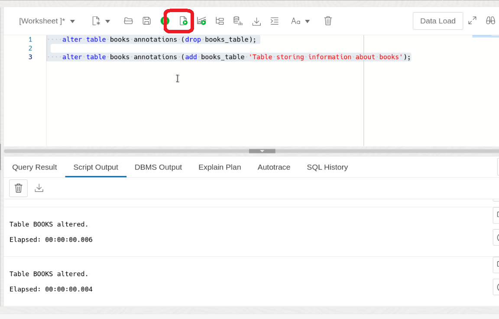

# Schema Annotation Exploration in Oracle Database 23ai

## Introduction

Welcome to the "Schema Annotation Exploration in Oracle Database 23ai" lab. Schema Annotations are a powerful tool for documenting and classifying database objects, along with providing insights into their purpose and usage.

In today's technology-driven world, organization and documentation of database objects are essential for the smooth operation of database systems. Schema Annotations, as an extension of traditional comments, offer a more structured and versatile approach to database documentation. They allow us to associate name-value pairs with database objects, allowing us to describe, classify, and categorize them according to our specific requirements.

Estimated Lab Time: 10 minutes

### Objective:
The objective of this lab is to provide hands-on experience with Schema Annotations in Oracle Database 23ai. You will learn how to use Schema Annotations to document and classify various database objects, and understand how to query and manipulate Schema Annotations using SQL.

### Prerequisites:
- Access to Oracle Database 23ai.
- Basic understanding of SQL is helpful.

## Task 1: Adding Schema Annotations 

1. If you haven't done so already, from the Autonomous Database home page, **click** Database action and then **click** SQL.
    

    Using the ADMIN user isn’t typically advised due to the high level of access and security concerns it poses. **However**, for this demo, we’ll use it to simplify the setup and ensure we can show the full range of features effectively. 

2. Before we begin, this lab will be using Database Actions Web. If you're unfamiliar, please see the picture below for a simple explanation of the tool. You can click on the photo to enlarge it.

    

2. Why Use Schema Annotations? Schema Annotations provide a way to add additional property metadata for database objects, such as tables, columns, views, materialized views, and even domains. 

    Compared to comments, annotations offer more flexibility. They can be used with various types of database elements, not just tables. Also, you can attach multiple annotations to the same object, which isn't possible with comments. Schema Annotations are keys with optional values. You can use them to record any metadata you want about the object in question. This is important because there is no set format for comments. So, which do you use: JSON? XML? Delimited key-value pairs? And on top of this, how do you enforce the format for all future maintainers?

    That's where Schema Annotations come in. Let's take a look.

    Execute the SQL commands to create a table `books`. The `books` table stores information about books, including the title and author ID.
    
    ```
    <copy>
    DROP TABLE IF EXISTS books;
    
    CREATE TABLE books (
    book_id      NUMBER        ANNOTATIONS (mandatory, system_generated),
    title        VARCHAR2(100), 
    genre        VARCHAR2(100),
    rating       NUMBER        ANNOTATIONS (description 'A single natural number from zero to ten')
    )
    ANNOTATIONS (books_table 'Table storing information about books');

    </copy>
    ```

    What do they mean then?

    * 'mandatory': Notice this annotation doesn't require a value. The name is enough to provide the meaning.
    * 'system\_generated': Again, this is enough to tell us that the book\_id is system-generated.
    * 'description': This annotation indicates what type of rating users should store for a book; here we are saying any whole number 0-10.
    * 'Books Table': Describes the purpose of the books table.

    

3. You can also update objects to add or drop annotations. For example, we could drop and add the annotation for the books table
    ```
    <copy>
    alter table books annotations (drop books_table);

    alter table books annotations (add books_table 'Table storing information about books');
    </copy>
    ```
    

4. Now that we have annotations, we can view them with the *\_usage\_annotations views

    ```
    <copy>
    select COLUMN_NAME,
            ANNOTATION_NAME,
            ANNOTATION_VALUE
    from   user_annotations_usage
    order by annotation_name, annotation_value;
    </copy>
    ```
    These views show annotations for all object types. This means they’re all accessible in one location, which makes it simple to access annotations programmatically to generate separate documentation if you want.

    


4. Schema Annotations offer a structured and flexible approach to documenting and classifying various database objects, enhancing the overall organization and maintenance of database systems. By associating name-value pairs with database objects, Schema Annotations enable users to describe, categorize, and classify objects according to specific requirements. 

    In conclusion, this lab has provided a quick overview of the usage and implementation of Schema Annotations in Oracle Database 23ai. If you're interested in trying out more, feel free to test out your own Schema Annotations now. 

5. We can clean up from the lab by dropping our tables.

    ```
    <copy>
    DROP TABLE IF EXISTS books;
    </copy>
    ```

This concludes the Schema Annotations Lab.
You may now **proceed to the next lab** 


## Learn More

* [Database Development Guide](https://docs.oracle.com/en/database/oracle/oracle-database/23/adfns/registering-application-data-usage-database.html#GUID-2DAF069E-0938-40AF-B05B-75AFE71D666C)
* [SQL Language Reference](https://docs.oracle.com/en/database/oracle/oracle-database/23/sqlrf/CREATE-TABLE.html#GUID-F9CE0CC3-13AE-4744-A43C-EAC7A71AAAB6)


## Acknowledgements
* **Author** - Killian Lynch, Oracle Database Product Manager
* **Contributors** - Chris Saxon, Senior Developer Advocate, Dom Giles, Distinguished Database Product Manager
* **Last Updated By/Date** - Killian Lynch, Oracle Database Product Management, Product Manager, May 2024