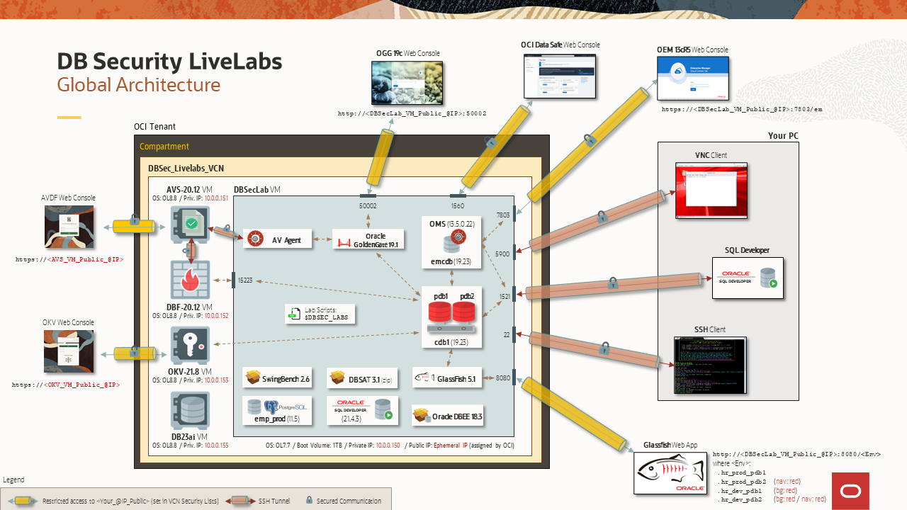

# Introduction

In this workshop, we introduce you to a newly released feature of Oracle Database 23ai--_Schema-Level Privileges_. Previously, developers had to either give users full-access to the database or manually grant user privileges to each database object in a schema. With Oracle Database 23ai, developers can now grant privileges at the schema-level--making it easier to secure your database.

## About this Workshop

There are additional workshops dedicated to the Oracle Database Security features and functionalities.

Based on an OCI architecture, deployed in a few minutes with a simple internet connection, it allows you to test DB Security use cases in a complete environment already pre-configured by the Oracle Database Security Product Manager Team.

Now, you no longer need important resources on your PC (storage, CPU or memory), nor complex tools to master, making you completely autonomous to discover at your rhythm all new DB Security features.

### Components
The complete architecture of the **DB Security Hands-On Labs** is as following:

  

It may be composed of as many as five VMs:
  - **DBSec-Lab** (mandatory for all workshops: Baseline and Advanced workshops)
  - **Audit Vault Server** (for Advanced workshop only)
  - **DB Firewall Server** (for Advanced workshop only)
  - **Key Vault Server** (for Advanced workshop only)
  - **DB23ai** (for SQL Firewall workshop only)

    
You may now proceed to the next section.

## Learn More

* [Announcing Oracle Database 23ai : General Availability](https://blogs.oracle.com/database/post/oracle-23ai-now-generally-available) 
* [Oracle Database Features and Licensing](https://apex.oracle.com/database-features/)
* [Oracle Database 23ai : Where to find information](https://blogs.oracle.com/database/post/oracle-database-23ai-where-to-find-more-information)
* [Free sandbox to practice upgrading to 23ai!](https://livelabs.oracle.com/pls/apex/dbpm/r/livelabs/view-workshop?wid=3943)

## Acknowledgements
* **Author** - Killian Lynch, Database Product Management
* **Contributors** - Dom Giles, Brianna Ambler, Francis Regalado Database Product Management
* **Last Updated By/Date** - Francis Regalado, Oct 2024

