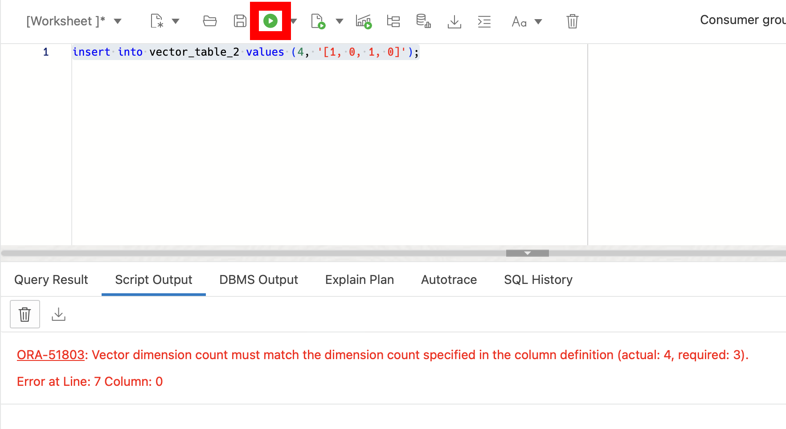

# Exploring AI Vector Search

## Introduction

Welcome to Lab 2 "Exploring AI Vector Search". In this lab, we will enhance Oracle MovieStreams’ search engine and give our customers the ability to ask natural language questions using the AI Vector Search feature in Oracle Database 23ai. This will allow the company to provide personalized movie recommendations based on complex, multi-dimensional data, improving customer satisfaction and engagement. This lab is meant to be a small introduction to the new AI functionality that Oracle Database 23ai supports.

This lab will focus on AI Vector Search at a very high level and the embedding of data will be done before hand for you. 

Estimated Lab Time: 20 minutes

Watch the video below for a walkthrough of the lab.
[Lab walkthrough video](videohub:1_gfoo1dz4)


### Objective:
In this lab, you will learn how to integrate an Oracle Database with a Large Language Model (LLM) to ask questions and receive relevant answers based on your data. This process is called Retrieval Augmented Generation, or RAG. You will explore the new vector data type introduced in Oracle Database 23ai. You will create tables, work with vectors, and use some of the new AI Vector Search SQL functions. 

### Prerequisites:
- Access to Oracle Database 23ai environment.
- Basic understanding of SQL and PL/SQL.

## Task 1: Understanding vectors 

1. The first thing we'll do is create a table with the new vector data type.

    ```
    <copy>
    drop table if exists vector_table;  
    create table if not exists vector_table (id number, v  vector);
    desc vector_table
    </copy>
    ```
    

2. Before we add data, let's understand what vectors are (mathematically) and how they relate to Generative AI.

    A vector is simply an array of numbers. Mathematically, a vector is an object that has both magnitude and direction (think of an arrow plotted on a graph). In generative AI, vectors represent the semantic meaning of objects, such as pictures, documents, audio files, or other large unstructured objects.

    How do we get vectors?

    Vectors are created by 'processing' your large unstructured objects through an embedding model. The models transform or 'embed' the data into numerical representations (vectors) that represent the semantic meaning of the original object.

    

    Okay, so what?

    At a high level, vectors are what these large language models use under the covers. Through storing vectors in the Oracle Database, you can create countless applications that utilize LLMs and generative AI capabilities to build the next generation of AI applications. The following diagram shows a VERY high-level overview of how you would create a chatbot application that can use an LLM in combination with private company data to answer questions specific to YOUR data. This process is called Retrieval Augmented Generation, or RAG.

    

3. The next thing we need to understand is dimensionality and the role it plays in Generative AI
    
    What is dimensionality?

    This is going to be a very simple example. Dimensionality is the 'plane' in which something exists. For example, we exist in a world of three dimensions. Everything we interact with has three dimensions: height, length, and width.

    Vectors have dimensionality.
    
4. If you take a look at our vector column, you'll notice we didn't set a dimensionality. You can optionally define the number of dimensions when creating a table. You can also define the number format of the vector.

    For example, vector(3, float32) would mean this vector has 3 dimensions and is of type float32. 

    ```
    <copy>
    drop table if exists vector_table_2;  
    create table if not exists vector_table_2 (id number, v  vector(3, float32));
    </copy>
    ```

    By defining the number of dimensions, we are effetely creating a check constraint.

5. Let's add some data
    ```
    <copy>
    insert into vector_table_2 values (1, '[0, 1, 2]'),
                    (2, '[3, 4, 5]'),
                    (3, '[6, 7, 8]');

    select * from vector_table_2;
    </copy>
    ```
    

6. Now let's take a look what happens if we try and add a vector that has more or less than 3 dimension. Hint, we'll see an error.

    ```
    <copy>
    insert into vector_table_2 values (4, '[1, 0, 1, 0]');
    </copy>
    ```
    


7. How does this relate to Generative AI?

    Remember the diagrams above showing the vectors that get created when we pass our unstructured objects through an embedding model? Each model creates the vectors with a different number of dimensions. For example, a vector [1, 2, 3, 4, 5, 6] has 6 dimensions.

    Different embedding models create a different number of vectors. Here are some common ones:
    * OpenAI has a handful of embedding models.
        * text-embedding-3-small - dimensions or 'length' of the vector is 1536
        * text-embedding-3-large - dimensions or 'length' of the vector is 3072

    The Oracle Database currently allows you to use up to **64K dimensions** when storing vectors. 
8. Vector are stored in the Oracle Database just as any other data type. We can use regular DDL against our vectors just as we'd expect. 

    ```
    <copy>
    insert into vector_table values (1, '[0, 1, 2]'),
                (2, '[3, 4, 5]'),
                (3, '[6, 7, 8]');

    update vector_table 
    set v = '[0]'
    where id = 1;

    select * from vector_table;

    delete from vector_table 
    where id = 3;

    select * from vector_table;
    </copy>
    ```
    

## Task 2. Creating data

1. Following our MovieStreams company, we'll create three tables. 

    ```
    <copy>
    CREATE TABLE IF NOT EXISTS movies (
        movie_id NUMBER,
        title VARCHAR2(255) NOT NULL
            ANNOTATIONS (description 'The title of the movie'),
        genre VARCHAR2(100)
            ANNOTATIONS (description 'The genre of the movie'),
        release_year NUMBER(4)
            ANNOTATIONS (description 'The year the movie was released'),
        duration_minutes NUMBER(3)
            ANNOTATIONS (description 'Duration of the movie in minutes'),
        m_description CLOB 
            ANNOTATIONS (description 'Detailed desciption of the movie'),
        questions VECTOR
            ANNOTATIONS (description 'Holds the value of the embedded movie descriptions after running them through the embedding model'),
        director VARCHAR2(255)
            ANNOTATIONS (description 'Director of the movie'),
            CONSTRAINT movies PRIMARY KEY (movie_id)
    );

    CREATE TABLE IF NOT EXISTS customers (
        customer_id NUMBER
            ANNOTATIONS (description 'Unique ID for each customer'),
        first_name VARCHAR2(100)
            ANNOTATIONS (description 'First name of the customer'),
        last_name VARCHAR2(100)
            ANNOTATIONS (description 'Last name of the customer'),
        email VARCHAR2(255) UNIQUE NOT NULL
            ANNOTATIONS (description 'Email address of the customer'),
        signup_date DATE DEFAULT SYSDATE
            ANNOTATIONS (description 'The date the customer signed up'),
        has_sub BOOLEAN
            ANNOTATIONS (description 'Whether the customer has an active subsciption'),
        CONSTRAINT customers PRIMARY KEY (customer_id)

    );

    CREATE TABLE IF NOT EXISTS ratings (
        rating_id NUMBER
            ANNOTATIONS (description 'Unique ID for each rating'),
        customer_id NUMBER
            ANNOTATIONS (description 'ID of the customer who rated'),
        movie_id NUMBER
            ANNOTATIONS (description 'ID of the movie being rated'),
        rating NUMBER(1) CHECK (rating BETWEEN 1 AND 5)
            ANNOTATIONS (description 'Rating given to the movie, between 1 and 5'),
        rating_date DATE DEFAULT SYSDATE
            ANNOTATIONS (description 'Date when the rating was given'),
        FOREIGN KEY (customer_id) REFERENCES customers(customer_id),
        FOREIGN KEY (movie_id) REFERENCES movies(movie_id),
        CONSTRAINT ratings PRIMARY KEY (rating_id)

    );     
    
    </copy>
    ```

2. A couple new 23ai database features to note here:

    * **Schema Annotations** are a great tool for adding additional metadata to your schema objects, along with providing insights into their purpose and usage. Schema annotations in Oracle Database 23ai are like labels or notes added to objects to provide extra information.

    Annotations clause typically follows this format:

    ```
    ANNOTATIONS ( {ADD|DROP} annotation_name {'annotation_value'} {,} )

    ```
    We can also take a look at annotations metadata with the `user_annotations_usage` view.

    * **Boolean Data type** - Oracle Database 23ai introduces native support for boolean data types which expands the capabilities of SQL and PL/SQL. The boolean data type standardizes the storage of true and false values and makes it easier to develop on the Oracle Database.

        In the table above, we will store the 'true', 'false' values for the 'has_sub' column.

    * **Vector data type** - we added a column called `questions` where we will store the embedded movie descriptions.

    * **IF [NOT] EXISTS** are a useful way to execute SQL commands based on the existence or non-existence of certain conditions or objects inside the database. We used if not exists above when creating our table. We can also drop objects using the IF EXISTS clause. This means that we can drop non-existent and existing objects without receiving an error. 


4. Now that we have our tables, we can add data using the NEW Table Value Constructors


    ```
    <copy>
    INSERT INTO movies (movie_id, title, genre, release_year, duration_minutes, m_description, questions, director)
    VALUES
    (1, 'The Grand Budapest Hotel', 'Comedy', 2014, 99,  
        'Set in a famous European hotel between the wars, The Grand Budapest Hotel is the story of a legendary concierge, M. Gustave, and his friendship with a young employee named Zero. The film weaves a whimsical narrative full of adventure, comedy, and poignant moments, all within the lush, stylized world characteristic of Wes Andersons work. The plot revolves around the theft of a priceless painting, a family inheritance battle, and the rise of fascism, portrayed with a blend of humor and melancholy. The films visual design is as intricate as its narrative, with meticulous attention to detail in its sets, costumes, and cinematography, making it a feast for the eyes as much as for the mind.', 
        NULL, 'Wes Anderson'),

    (2, 'Superbad', 'Comedy', 2007, 113,  
        'Superbad is a hilarious coming-of-age film that follows two inseparable high school friends, Seth and Evan, during their last days of high school. The duo are invited to a party by a girl they like, and they decide that this party is their last chance to lose their virginity before heading off to college. The movie tracks their chaotic journey to secure alcohol for the party, leading to a series of absurd and comedic misadventures. With a mix of crude humor and heartfelt moments, Superbad captures the anxiety, excitement, and sheer awkwardness of adolescence, backed by strong performances from its young cast.', 
        NULL, 'Greg Mottola'),

    (3, 'Shaun of the Dead', 'Comedy', 2004, 99,  
        'Shaun of the Dead is a British horror-comedy that blends elements of zombie movies with sharp, witty humor. The story follows Shaun, a man stuck in a mundane life, as he attempts to win back his girlfriend, reconcile with his mother, and deal with the sudden outbreak of a zombie apocalypse. The film is known for its clever dialogue, memorable characters, and a perfect balance of horror and comedy. It offers a fresh take on the zombie genre while exploring themes of responsibility, friendship, and personal growth in the most unexpected of circumstances.', 
        NULL, 'Edgar Wright'),

    (4, 'In Bruges', 'Comedy', 2008, 107,  
        'In Bruges is a darkly comedic crime drama set in the picturesque medieval town of Bruges, Belgium. The story follows two hitmen, Ray and Ken, who are sent to Bruges by their ruthless boss after a job goes wrong. As they await further instructions, the two men have very different reactions to the town: Ken enjoys the sights, while Ray finds it unbearable. The film is a mix of humor, tragedy, and moral dilemmas, with sharp dialogue and strong performances, particularly from Colin Farrell as the guilt-ridden Ray. The movie explores themes of redemption, guilt, and the consequences of violence, all set against the backdrop of one of Europes most beautiful cities.', 
        NULL, 'Martin McDonagh'),

    (5, 'Mean Girls', 'Comedy', 2004, 97,  
        'Mean Girls is a teen comedy that satirizes the social hierarchy of high school life. The film follows Cady Heron, a teenager who moves to the United States after being homeschooled in Africa. She soon finds herself navigating the complex social dynamics of her new high school, where she becomes entangled with a popular clique known as The Plastics. The movie is both a hilarious and insightful look at the pressures and pitfalls of adolescence, with memorable characters and sharp, quotable dialogue. Mean Girls has become a cultural touchstone, beloved for its humor and its accurate portrayal of high school life.', 
        NULL, 'Mark Waters'),

    (6, 'Step Brothers', 'Comedy', 2008, 98,  
        'Step Brothers is a raucous comedy about two middle-aged, spoiled men who are forced to live together when their single parents marry. Brennan and Dale, played by Will Ferrell and John C. Reilly, initially despise each other, but eventually bond over their shared immaturity and love of absurd activities. The film is full of outrageous humor, ridiculous situations, and over-the-top performances. It explores themes of family, friendship, and the challenges of growing up—albeit in the most hilarious and unconventional ways. Step Brothers is known for its memorable one-liners and its unique brand of comedy that pushes the boundaries of good taste.', 
        NULL, 'Adam McKay'),

    (7, 'Anchorman', 'Comedy', 2004, 94,  
        'Anchorman: The Legend of Ron Burgundy is a satirical comedy that takes a humorous look at the male-dominated world of 1970s television news. The film follows Ron Burgundy, a charismatic yet chauvinistic anchorman, and his team of equally clueless colleagues as they face off against a new female co-anchor, Veronica Corningstone. The movie is a wild ride of absurd humor, over-the-top characters, and sharp social commentary on gender roles and media culture. With its memorable quotes and hilarious performances, particularly from Will Ferrell as Ron Burgundy, Anchorman has become a cult classic that continues to entertain audiences.', 
        NULL, 'Adam McKay'),

    (8, 'No Country for Old Men', 'Thriller', 2007, 122,  
        'No Country for Old Men is a gripping crime thriller that explores the violent consequences of a drug deal gone wrong in the desolate landscapes of West Texas. The story follows Llewelyn Moss, who stumbles upon a suitcase filled with cash at the scene of a botched drug deal, and soon finds himself pursued by the relentless and cold-blooded hitman Anton Chigurh. The film is a tense and atmospheric exploration of fate, morality, and the changing nature of the American West, with powerful performances and a hauntingly minimalist score. Directed by the Coen Brothers, No Country for Old Men is a modern masterpiece that challenges traditional notions of good and evil.', 
        NULL, 'Joel Coen, Ethan Coen'),

    (9, 'The Big Lebowski', 'Comedy', 1998, 117,  
        'The Big Lebowski is a cult classic comedy that follows Jeff The Dude Lebowski, an easygoing slacker who becomes embroiled in a case of mistaken identity. When two thugs mistake him for a millionaire with the same name, they urinate on his rug, setting off a bizarre chain of events involving kidnapping, ransom, and bowling. The film is a quirky and surreal journey through the eccentric underbelly of Los Angeles, with a memorable cast of characters and endlessly quotable dialogue. Directed by the Coen Brothers, The Big Lebowski is a film that defies genre conventions and remains beloved for its unique blend of humor, oddball characters, and offbeat storytelling.', 
        NULL, 'Joel Coen'),

    (10, 'Memento', 'Thriller', 2000, 113,  
        'Memento is a psychological thriller that tells the story of Leonard Shelby, a man suffering from short-term memory loss who is determined to find his wifes murderer. The film is structured in a unique and innovative way, with scenes presented in reverse chronological order to reflect Leonards fragmented memory. As Leonard pieces together clues about his wifes death, the audience is drawn into his world of confusion and uncertainty, questioning the nature of truth and memory. Directed by Christopher Nolan, Memento is a masterful exploration of the mind, filled with twists and turns that keep viewers on the edge of their seats until the very end.', 
        NULL, 'Christopher Nolan');   

    INSERT INTO customers (customer_id, first_name, last_name, email, signup_date, has_sub)
    VALUES
    (1, 'John', 'Doe', 'john.doe@example.com', SYSDATE, TRUE),
    (2, 'Jane', 'Smith', 'jane.smith@example.com', SYSDATE, TRUE),
    (3, 'Alice', 'Johnson', 'alice.johnson@example.com', SYSDATE, TRUE),
    (4, 'Bob', 'Brown', 'bob.brown@example.com', SYSDATE, TRUE),
    (5, 'Charlie', 'Davis', 'charlie.davis@example.com', SYSDATE, TRUE);

    INSERT INTO ratings (rating_id, customer_id, movie_id, rating, rating_date)
    VALUES
    (1, 1, 1, 5, SYSDATE),
    (2, 2, 3, 4, SYSDATE),
    (3, 3, 5, 4, SYSDATE),
    (4, 4, 8, 5, SYSDATE),
    (5, 5, 10, 3, SYSDATE);

    </copy>
    ```
5. Notice we left the vector column null. Let's update that now. The model used to create these embeddings maps text and paragraphs to a 384 dimension dense vector space. For readability, the vectors are in the collapsible field below. I would suggest clicking the copy button and pasting them into Database Actions to continue for better readability. Alternatively, you can expand the field and see them here.

    <details>
        <summary>Click to see what the vectors look like</summary>
        <div id="copy-box">
            <pre><code>
UPDATE movies SET questions = '[-0.03186416, 0.100448914, -0.08820329, 0.05411677, -0.044413082, 0.04332847, 0.0621402, 0.013988524, 0.04205, -0.10710743, 0.009223937, 0.039977495, 0.027808847, 0.05647867, 0.008109424, -0.023528328, 0.059961338, -0.046181977, 0.02585358, -0.011352473, 0.004151645, -0.07381002, 0.048352238, -0.044253614, -0.009961141, -0.022853399, 0.010549535, -0.009179258, 0.006506621, 0.045964774, -0.016583476, 0.08538077, -0.09761192, 0.0019082956, 0.065572396, 0.04915272, 0.009243112, 0.057153206, 0.0077142515, 0.0040078973, -0.021618655, 0.07514549, 0.0006667001, 0.0018498997, -0.012928057, 0.008214033, -0.03086509, 0.0053452165, -0.008815549, 0.034539137, 0.008133889, 0.021855155, -0.059775364, -0.077314116, 0.024118485, -0.023036996, 0.026103243, -0.039466966, -0.002977159, 0.024300907, 0.01985983, -0.027814263, 0.023393909, 0.014221486, 0.008032142, 0.035326842, -0.07147509, 0.00610855, -0.07310015, -0.09929828, 0.0032818501, -0.038566817, 0.02049557, -0.038786467, -0.017542347, -0.04236038, -0.08110735, 0.004544688, -0.0027622352, -0.007807033, 0.09397219, -0.056569874, -0.0040330123, 0.01853306, -0.0035951578, 0.00048597067, 0.046114307, -0.02830799, 0.05801706, 0.026257303, -0.10409066, -0.08646433, -0.0651563, 0.029250324, 0.0013947428, 0.05993298, -0.026438184, 0.041637573, -0.055488877, 0.060910586, 0.10336703, -0.032088377, 0.11574057, 0.023396282, 0.037200652, 0.012775889, 0.11319196, 0.048064597, -0.10101572, -0.04550339, -0.008623377, 0.016256168, 0.080611564, -0.075637825, 0.009094633, -0.004150025, 0.029063923, -0.03882623, 0.004777327, 0.054174457, 0.09910925, -0.033579815, -0.018608812, 0.04819486, -0.09196654, -0.03150324, 0.06776617, -1.6430368e-33, -0.020082867, -0.033476662, -0.011483566, 0.075386174, 0.10118173, -0.010462282, -0.057519656, -0.01380321, -0.06083227, 0.05133998, -0.015611584, -0.028738765, 0.0074157915, 0.05263663, -0.026343618, 0.065136, 0.03085626, -0.012948528, 0.081920624, -0.054210823, 0.0036408824, 0.06714009, 0.0048613297, -0.032086182, 0.006935154, 0.095247135, -0.07351736, -0.017457541, -0.060507566, 0.0049189716, -0.072699346, 0.073657185, -0.0011898965, -0.022706965, 0.032282323, 0.012933244, -0.090916015, -0.038039166, -0.040952478, 0.025902564, -0.06514315, 0.042080857, -0.15684767, 0.051394694, -0.01093092, 0.085700914, -0.005187945, 0.08052482, -0.07356148, 0.066004395, -0.07691928, 0.031332172, -0.14804715, 0.038315207, -0.11701675, 0.015484923, 0.05911154, -0.03687872, 0.05914629, -0.11330228, 0.07911791, 0.02635382, -0.0726331, 0.053837758, 0.029850217, 0.011341584, -0.066457234, 0.008002268, -0.034625527, 0.01551488, -0.039804697, -0.008626384, 0.022096759, -0.0769526, 0.00062925654, 0.07503869, 0.07988938, 0.022358129, -0.05912502, 0.03133418, 0.00064974267, 0.033457987, 0.0799159, 0.017038465, -0.081297986, -0.04147627, 0.049575336, -0.04447641, 0.020843407, 0.012826532, 0.030769857, 0.0123532945, -0.008022552, -0.028793061, -0.009152576, 2.7599726e-34, 0.025007727, -0.0121196825, 0.020517616, -0.07591735, 0.04283048, -0.033128105, -0.09254426, 0.0086931465, 0.014131202, 0.087765895, -0.041934155, -0.0042057727, -0.029612608, 0.057669412, -0.005430036, -0.02944525, 0.09347536, -0.035675615, -0.023041684, 0.045825087, 0.03175208, 0.102326594, -0.063506335, -0.053376365, -0.07028689, 0.095568895, -0.03461568, -0.024337985, -0.0777164, 0.04450111, -0.050133605, -0.059375864, 0.03503431, 0.026860286, 0.032040127, 0.06356483, 0.10553594, -0.004010758, -0.07027428, -0.0027210764, -0.0010034427, 0.0043688384, -0.07041773, 0.11051171, 0.057953883, -0.022254646, -0.04137224, -0.060742464, 0.0131591195, -0.053578924, -0.04768401, 0.007970179, -0.019680044, -0.042398028, -0.026183574, -0.0804661, 0.0013372921, -0.024140507, 0.03920695, 0.09657719, -0.04437437, -0.026659768, -0.032152373, 0.0385326, -0.017618047, -0.052631196, -0.09064694, 0.06902636, -0.040853973, -0.011603324, -0.01193678, 0.043265823, -0.073284544, -0.021141492, -0.0031891153, -0.025540384, 0.08953818, 0.022873575, 0.0361602, 0.005919339, 0.010306058, -0.048097346, -0.025979213, 0.031701393, 0.016273892, 0.07482219, -0.032027144, 0.03743527, -0.0035752894, -0.068276614, 0.03809565, 0.032533113, 0.02516694, -0.047946874, -0.005157353, -5.2158097e-08, -0.15245341, 0.027805682, -0.0061595365, -0.010287918, -0.08778744, -0.1178896, 0.022300223, 0.06372418, 0.02538305, 0.09219966, -0.03773525, 0.051600404, -0.013090643, 0.0011180452, -0.06036024, 0.09942019, -0.029118935, -0.022109706, 0.026035707, 0.08001024, 0.06131532, -0.035470735, 0.04550358, -0.069432415, 0.02572334, -0.054169495, 0.003473276, 0.0014990985, 0.050593376, 0.037941247, -0.056555863, 0.04188681, 0.0086952485, -0.0010246448, -0.036650926, -0.029255012, 0.020911422, 0.01956921, -0.029161526, -0.068659276, -0.008618043, -0.012629113, 0.01475199, 0.005702016, 0.023216156, 0.069185145, 0.08955318, -0.0729314, 0.03307293, 0.034470215, -0.056441218, 0.04299385, 0.041811265, 0.04991018, 0.0047145737, -0.093863174, 0.025176102, 0.0698943, -0.0023249094, 0.001590938, 0.011869093, 0.046947338, -0.030564057, -0.02084614]' WHERE movie_id = 1;
UPDATE movies SET questions = '[-0.05981895, -0.023309417, 0.010998978, -0.1315234, 0.03451228, -0.0071311295, 0.014751898, 0.12275015, 0.010721676, 0.020358676, 0.036566436, 0.05043441, -0.02374009, 0.050204307, -0.057742495, -0.012560746, 0.07535864, -0.08446361, -0.07917211, -0.0070352694, 0.055406813, -0.061864115, 0.026079275, 0.020658905, -0.05399865, 0.09476403, 0.034239512, -0.016541097, -0.053649344, 0.024967441, 0.14125331, 0.032709498, -0.0071593896, -0.0068715774, -0.08663755, 0.044077717, -0.0016527523, -0.025880987, 0.06583274, -0.07875655, -0.06604436, -0.040202588, 0.0100563755, -0.015144554, 0.05191987, -0.06264339, -0.008218018, -0.024090026, 0.08398684, 0.016498664, 0.022793712, -0.066124916, 0.01907576, 0.022266101, 0.10764702, 0.056642476, -0.06843781, -0.118135735, -0.0041953796, 0.06691189, -0.011676104, 0.008757207, 0.0742434, 0.027567292, 0.06837594, 0.02218203, -0.019394604, 0.040638737, -0.032302007, 0.04246324, -0.023516588, -0.0066938936, 0.005173094, 0.019002201, 0.082324564, -0.028665219, -0.044650257, -0.051103547, 0.024195593, -0.058488827, 0.024454333, -0.12588622, -0.035099637, -0.05923449, 0.008865842, -0.03451321, 0.07106684, -0.03227452, -0.0016710209, 0.063725084, -0.09934951, 0.029285967, -0.019183945, 0.0059421794, -0.048503116, 0.013984077, -0.074142106, -0.07685853, -0.056872293, 0.06361441, -0.065817885, 0.0023764411, 0.0155559685, -0.09950773, 0.035094026, -0.07329799, 0.09259259, 0.041356754, 0.036668193, 0.025238603, 0.016119473, -0.04825631, 0.08829368, -0.0035227253, 0.046858754, -0.013131738, 0.0027909235, 0.025074532, -0.06708953, -0.027809892, 0.017331231, 0.058398824, 0.023657853, 0.072430626, -0.039804265, 0.045730207, 0.023142831, -1.292179e-33, 0.035207964, -0.01417389, -0.038995788, 0.021170221, -0.004593921, -0.010609181, 0.024332311, 0.055428352, -0.08382931, -0.017551491, 0.0064104144, -0.053298164, -0.05997198, -0.0012846395, 0.04671779, -0.0289466, -0.057547927, -0.0147965355, 0.026219567, 0.061255008, -0.027436418, -0.008398503, 0.012328988, -0.03183204, -0.0043551815, -0.04487213, 0.07049371, 0.12864678, 0.095762804, 0.0010454506, -0.0868074, -0.028317055, -0.0320303, 0.00703081, 0.044614587, -0.013688371, -0.03038013, -0.012748919, -0.06074655, 0.027969107, -0.028823838, 0.0010857431, -0.10992434, 0.028260432, -0.030496541, 0.071913145, 0.012095693, 0.06429366, 0.055251736, -0.05555836, -0.015159716, 0.00062378944, -0.03394377, -0.06797914, -0.086689554, 0.070450716, -0.0044049327, -0.044387005, -0.021138333, -0.06131992, -0.0053353026, -0.0113808755, -0.12927507, 0.036849417, -0.06684931, -0.025046814, 0.09204242, 0.013719517, 0.023072848, -0.0062284376, 0.02048773, -0.0070720897, 0.04011269, -0.014179783, 0.0125051495, 0.035523225, 0.011852307, -0.019931378, -0.0040393327, 0.0031124929, 0.01919846, -0.043453373, 0.006391464, -0.003971871, -0.08951391, 0.013358214, -0.014448632, -0.114423685, -0.007935999, -0.04072657, 0.0071989764, -0.033552047, 0.019696102, -0.023035988, 0.047959078, -2.26392e-33, 0.09226721, -0.0026063414, -0.064168, 0.0066772783, 0.09642589, 0.034108587, -0.052064184, 0.025325755, 0.06270105, -0.0066921334, 0.045708217, 0.0014617649, 0.049393304, -0.10559106, 0.065607145, -0.054490365, 0.097872876, -0.050941844, 0.015874295, -0.017988514, 0.10707863, 0.05458774, 0.05330781, -0.024527662, 0.038816664, 0.018058198, -0.0050501404, 0.12934692, -0.045657504, 0.011932867, 0.12519534, -0.049975783, 0.014205936, 0.04864364, -0.05017959, 0.07643995, -0.030244587, -0.035785917, -0.104470946, -0.038177144, 0.008383555, -0.05327015, -0.0658028, 0.058814608, 0.016027158, 0.014432894, -0.0137754595, 0.05198254, -0.023918778, -0.056821242, -0.069650374, 0.010317238, -0.037166324, -0.024278725, 0.020221451, -0.087885395, 0.001152499, 0.0396343, 0.07609932, 0.008831072, -0.0023166952, -0.08970386, 0.045033086, -0.038954884, -0.07892018, -0.06110928, -0.038452175, -0.045513205, -0.019370534, 0.072002836, 0.031455807, -0.0022743384, -0.11614712, -0.034464438, -0.044136953, 0.04177276, -0.004791056, -0.034300104, -0.05804416, -0.0625367, 0.034917094, 0.009422977, 0.033473507, 0.04775234, -0.011416051, -0.016706724, 0.02216939, 0.043320324, -0.0018465326, 0.06602054, -0.0220908, 0.057105456, -0.004456604, -0.13192108, -0.02595567, -5.3504582e-08, -0.019838775, 0.05371821, -0.06976195, -0.07643651, -0.00085929636, -0.042795785, -0.022791626, 0.047602154, 0.10164726, 0.013172189, -0.066499226, -0.04385131, 0.02175293, -0.014806854, -0.028343461, -0.0046081254, 0.036873788, 0.07048361, -0.0073460066, -0.008809973, -0.07575522, -0.059043054, 0.021050502, -0.06387232, -0.045205593, 0.03556013, 0.023932166, -0.07928002, -0.031324327, 0.042363472, -0.026560169, 0.0009331711, 0.034230497, 0.00021357962, 0.017102335, 0.054282848, 0.015100303, 0.0014561552, 0.014629735, 0.07714158, 0.032150164, -0.012003149, -0.012307274, 0.010827777, 0.0007633105, 0.014537119, 0.091233514, 0.0020015896, 0.037053518, 0.038100522, 0.039272476, -0.032688957, -0.089511886, -0.041774582, -0.01027467, -0.032532223, -0.10160038, 0.040170312, -0.04983151, 0.010509751, 0.14421484, 0.07245852, -0.007225581, 0.02995852]' WHERE movie_id = 2;
UPDATE movies SET questions = '[-0.07285886, -0.05779241, -0.07381102, -0.01767771, 0.019122727, 0.0018151521, 0.085507855, -0.02660585, 0.01049716, -0.017358165, -0.0020758978, 0.0054053897, 0.018991536, 0.025543801, -0.031994577, 0.042620856, -0.01221277, -0.003949109, -0.020401524, 0.016030591, -0.006440479, 0.06193031, 0.075068474, -0.06106403, -0.06593554, -0.052561007, 0.014242381, -0.0038608557, -0.08237256, 0.047879107, 0.034143727, -0.0058708563, -0.0769527, -0.055614665, 0.010922458, 0.0969622, -0.08405303, -0.0031878417, -0.06784459, 0.04404204, -0.03470591, 0.03847585, 0.020138161, 0.014878458, 0.050491527, -0.009567357, -0.04175827, -0.05611446, 0.084584035, 0.0090572, 0.0091598835, -0.022534342, 0.0075731026, -0.049469896, 0.0121693425, 0.0118192565, -0.007556691, -0.040486597, -0.028627282, -0.04625774, 0.043274067, -0.05693021, 0.066644184, 0.00921515, 0.1194655, 0.0025610009, 0.032408644, -0.03805433, -0.061303873, 0.033282474, -0.13220115, -0.012142146, 0.008585243, 0.06649524, -0.065359406, -0.014543861, 0.0084211035, -0.075684875, -0.052907594, 0.05298561, 0.03303341, -0.032954924, 0.067544095, 0.04123282, 0.058497023, -0.009081555, 0.06301522, -0.027177779, -0.06059984, 0.11051589, -0.08694784, -0.0068254275, 0.01895521, 0.059112255, -0.047382243, -0.0074091963, -0.011549374, 0.011651855, -0.11649622, 0.02420424, -0.06551847, -0.0112629505, 0.0071047205, -0.02893538, 0.022684844, 0.008331409, -0.088294104, 0.032755192, -0.0053991466, 0.014941778, -0.0029590165, -0.03736128, -0.03929809, -0.00631517, 0.10986775, 0.01957646, 0.026727602, -0.08115311, -0.004268095, 0.048261914, 0.10251516, 0.088373676, 0.022329587, 0.034398742, 0.09427662, 0.016564896, 0.058422346, -2.2753761e-33, 0.001199966, 0.038008913, -0.01576928, 0.03817649, 0.03377504, -0.06949259, -0.023391636, 0.01575222, -0.018720012, 0.07207276, 0.04479035, 0.012091409, 0.021798927, 0.009995059, -0.11574941, 0.05950401, -0.004337373, -0.061461426, 0.067267284, -0.07118354, -0.05977591, 0.02940063, 0.04886328, 0.02697505, -0.016641624, -0.08159827, -0.03016665, 0.025550406, 0.050592806, -0.03209104, -0.004823802, 0.056970198, -0.03203733, -0.09482967, 0.08407994, -0.041772332, -0.026825158, -0.002415315, -0.022160444, 0.1291904, -0.01155225, -0.012889964, -0.03322733, -0.010210219, -0.018432276, 0.0170627, 0.10798135, 0.053503428, -0.05892857, 0.015435531, 0.11570178, -0.03459384, 0.0077097323, -0.021629857, -0.051550835, 0.033996083, -0.024134537, -0.11070746, 0.03198954, 0.026788933, 0.075729966, -0.048672937, -0.028833462, -0.04344334, -0.061062053, -0.046977933, 0.04833954, -0.06088684, -0.036329743, -0.009820092, 0.007904263, -0.039781768, 0.07485789, -0.02135242, -0.0029149856, 0.052874688, -0.083003424, -0.060549617, -0.048862197, 0.0033874533, 0.047053114, -0.013216601, -0.015584995, -0.03720741, -0.056257345, -0.02285835, 0.030057034, -0.09266072, 0.0024314406, 0.030574065, -0.07092937, -0.0005783994, 0.0011006421, -0.076462, 0.13689701, -8.835015e-34, 0.017207613, -0.018795611, -0.14627129, -0.0020320714, 0.02863423, -0.069989525, -0.010578073, 0.016893357, 0.13151439, -0.0154793905, 0.012081126, 0.015218648, 0.062097855, 0.023281228, 0.11386234, -0.071913846, -0.035372254, -0.02854442, -0.0027639926, 0.044989843, 0.033788707, 1.184654e-05, -0.036174517, -0.07655762, 0.06546563, 0.06388663, -0.07227197, 0.071096785, 0.07151382, -0.0054220706, -0.033456802, 0.02917349, 0.11717306, 0.0040372163, -0.052911635, 0.12659599, -0.001732494, -0.09129568, 0.03746321, -0.028692419, 0.019322913, -0.026135592, 0.019115377, 0.005799959, 0.063667595, 0.03603427, -0.007055105, 0.08564866, -0.00058205763, -0.002778342, -0.005876342, 0.08120358, -0.0025046328, -0.007800121, -0.00584789, -0.009600696, -0.050240275, -0.095912375, 0.010450638, -0.051374517, 0.010942374, -0.010676507, -0.008902081, -0.004655159, -0.06367631, -0.043423638, -0.0032172406, -0.057359874, -0.023846585, 0.051130965, -0.04207277, 0.017260035, -0.049939778, -0.10576741, -0.011908295, 0.0070461673, -0.0077697826, 0.046941023, 0.04603011, -0.040910996, -0.045370623, -0.015114802, 0.04215158, 0.027706115, -0.0060455417, 0.04292568, 0.0095274765, 0.06798481, -0.017517168, -0.07272822, 0.01661093, -0.09560528, 0.054605052, -0.029163182, -0.123820946, -5.0736656e-08, 0.039133538, -0.030759476, -0.02215141, -0.113876306, 0.05301, 0.03798796, 0.047849722, 0.024710111, 0.017473193, 0.07501966, -0.03623585, 0.13399936, -0.0072202855, 0.0115309665, -0.033223618, 0.0836745, -0.053141218, 0.0014912767, -0.0145876985, -0.01685091, -0.03485185, -0.01196831, -0.01889133, 0.010413583, -0.0025548409, 0.03034672, 0.06328016, -0.112924956, -0.0050455118, 0.089180164, -0.06902441, 0.03063083, 0.06953664, -0.0050941627, -0.0067493347, -0.017303903, 0.084730186, 0.051464826, 0.032373454, -0.06628305, 0.019618193, 0.001188112, 0.014626764, -0.027185148, -0.010234761, -0.02637127, 0.049728807, -0.0379119, 0.016915644, 0.019606758, 0.014072302, -0.03466633, -0.080172725, 0.06452872, 0.052021824, -0.033036333, -0.049111973, -0.05487869, -0.07635416, 0.060818553, -0.0011568827, 0.021809205, 0.049586583, -0.055101898]' WHERE movie_id = 3;
UPDATE movies SET questions = '[0.03373985, 0.0048969346, -0.005641546, -0.053601395, 0.006300477, 0.040614642, 0.015623825, 0.0158418, -0.03746891, -0.07719321, -0.025200339, -0.121928535, 0.011178427, 0.031934645, -0.036522385, -0.084696025, 0.0008199181, -0.07110941, 0.06508497, 0.01857928, 0.023273414, 0.01164348, -0.058755513, 0.057586662, -0.05671234, 0.058081612, 0.14017622, -0.03964132, -0.11372165, -0.029251583, -0.007035752, 0.0021790299, -0.001960716, 0.019355122, -0.079276025, 0.036653813, -0.0009912195, -0.031714227, 0.060562514, 0.04535483, -0.09723911, -0.026677947, -0.05331524, 0.0051766, 0.004555653, -0.0843608, -0.00069039554, 0.043583874, -0.015753156, -0.023612645, 0.02289475, -0.017527383, -0.033488743, 0.020842586, 0.016674299, -0.036655523, -0.0054641166, 0.047502432, 0.08499313, -0.043687098, 0.040625166, 0.018965926, 0.04299457, 0.0429011, 0.07454832, -0.041256998, 0.016293619, 0.08873219, -0.09525246, 0.008479602, -0.022249132, -0.056231685, -0.0056651505, -0.025987456, 0.022744926, -0.025414053, -0.122139715, -0.02893928, -0.048782893, -0.085142635, 0.008696461, -0.038339026, -0.026425287, -0.006172263, 0.024795903, -0.07090906, 0.095489815, -0.031191222, 0.059739776, 0.050853144, -0.036348883, 0.01529476, -0.029332537, 0.04860639, -0.011246012, 0.04513471, 0.0006763913, 0.09876209, -0.054794997, 0.02285395, 0.026777664, -0.018494718, -0.019769235, -0.025003279, 0.047356002, -0.009713641, 0.008810508, -0.01680222, -0.011705285, -0.073039554, -0.02253, -0.015387636, -0.009913432, -0.05069578, 0.09779907, 0.029074313, 0.047132883, -0.0613819, -0.06569492, 0.022015458, 0.084542975, 0.006505036, -0.057156015, 0.011474062, -0.040001143, -0.01833572, 0.026571456, -9.699674e-34, 0.022611627, -0.02896581, -0.052523825, -0.0028198468, 0.009563863, -0.019189553, -0.09571947, 0.11246164, -0.070838265, -0.033545237, -0.06738698, -0.026518183, -0.032451652, -0.0010153538, 0.003696371, 0.057210278, -0.03975809, 0.030135652, 0.007986763, 0.018335022, -0.05828415, 0.049783334, -0.06359598, 0.025551546, -0.14139311, 0.046766307, 0.026955107, -0.07755668, 0.06022069, 0.035433374, -0.032800194, 0.05882878, 0.09843773, -0.009949189, -0.0030847257, 0.0047081765, -0.095948115, -0.020505527, -0.03454941, 0.07159234, -0.01059856, 0.0022473556, -0.086486414, 0.007009063, -0.09536893, 0.031199433, -0.00043469548, -0.044351585, -0.09081653, 0.03807452, 0.054443087, 0.0025638714, 0.0076642046, -0.0024012076, 0.07746728, 0.083650395, -0.040217347, -0.012443409, 0.06863058, -0.0864808, 0.086000256, 0.003849185, 0.08779284, 0.030758843, 0.0052545103, -0.038581315, -0.0016110895, 0.06585499, 0.03579803, -0.039434195, -0.13398975, -0.0036190073, 0.0666425, 0.0062846667, 0.03061631, 0.017067773, 0.009547635, -0.022981416, -0.090065494, 0.04843634, -0.077973545, -0.021453338, 0.044182736, -0.034871936, 0.015214584, 0.024273649, 0.048734725, -0.09640847, -0.05491835, 0.090173565, -0.059498098, -0.008983373, -0.020088745, -0.11224988, 0.08295634, -2.120126e-33, 0.12552427, -0.07744093, -0.08197731, -0.037187662, -0.023048682, -0.0041841255, -0.02611163, -0.008946388, 0.07402122, 0.067895785, -0.020306397, -0.05691325, -0.0008213731, -0.0074578375, 0.003595842, -0.051669776, 0.09306638, -0.06012481, -0.054349616, 0.016521564, 0.054037888, -0.0603187, 0.006876329, -0.025255661, -0.075007774, 0.05096008, -0.022149745, -0.07064754, -0.051314652, 0.03166783, -0.018230759, 0.019384481, 0.0075611915, 0.01692863, -0.08424185, 0.10821394, 0.090172775, -0.051382955, -0.057634663, -0.019690119, 0.009914072, -0.02806274, -0.03340287, 0.02611209, -0.027732061, -0.0065089357, 0.06741511, 0.04546711, -0.0456884, -0.01873071, 0.012566888, 0.121755235, -0.06502437, 0.037137076, -0.012589651, -0.11560209, -0.04022176, 0.00018101666, 0.01816266, 0.029721396, -0.12639235, 0.008612261, -0.054063514, -0.025881728, 0.01859195, 0.039754473, -0.13752574, -0.0018414408, 0.06681146, -0.022875844, 0.029144285, -0.12084849, -0.030351628, 0.013929667, 0.050289687, -0.0005416692, 0.023323486, -0.003831714, -0.046187773, -0.013387727, 0.03918167, -0.07261737, 0.018247034, 0.062337525, -0.031032454, -0.03883624, -0.031439938, 0.010152373, -0.036998797, 0.05942939, 0.023986055, -0.027766783, 0.031896144, -0.05916328, 0.031801954, -4.966703e-08, -0.10543808, 0.008538039, -0.012380632, 0.0286498, 0.0129600745, 0.011482269, -0.0033275431, 0.09640223, 0.0224633, -0.027314965, -0.02620059, 0.016393134, 0.04517423, 0.020078406, 0.05038606, 0.09825181, 0.03479124, -6.959046e-05, -0.0017284777, 0.07517815, 0.04175163, -0.029101368, 0.03940584, -0.00870962, 0.0011430796, 0.062975444, 0.016349398, -0.05368525, 0.053940028, 0.044199314, 0.08624842, 0.032951705, 0.019896235, 0.03559363, 0.049328703, -0.015319532, -0.0058709388, 0.082872316, -0.009866498, -0.04228416, -0.0130763585, -0.0051608193, -0.0038214368, -0.020463917, -0.010367279, 0.06662825, 0.036348324, 0.09575173, 0.018281369, 0.04005468, -0.025712809, 0.017212044, 0.056404706, 0.069724314, 0.039747667, -0.037605688, 0.07807122, -0.08442334, 0.0007497535, -0.024842901, 0.012649355, 0.05257403, 0.072551265, -0.009047538]' WHERE movie_id = 4;
UPDATE movies SET questions = '[0.021584796, -0.016268289, -0.004957669, -0.038706593, -0.03737637, -0.04597566, 0.062073275, 0.016568858, -0.0017235683, -0.03629599, 0.0524028, -0.026298953, 0.02659363, 0.06844876, -0.021427417, 0.006149201, 0.056762666, -0.058308687, -0.003166077, 0.000738515, 0.044418775, 0.0628706, 0.013658976, 0.10846485, -0.056367736, -0.014060903, 0.0067245816, -0.044827253, -0.067145824, 0.07453372, -0.043106586, 0.12717636, 0.012631225, 0.012103636, -0.019208498, 0.05742966, 0.040404227, -0.018006723, -0.021057563, -0.011753418, -0.085172474, -0.039301697, 0.046803445, -0.015119914, -0.038292736, -0.034924254, 0.084132515, -0.07082663, 0.011658237, -0.13159232, 0.014299281, -0.050246235, -0.087138295, -0.01973635, 0.045803465, 0.041028205, 0.0018424246, -0.0013511599, 0.10988598, -0.021183737, -0.063157216, -0.07636614, 0.119608395, 0.02190871, 0.044568144, 0.02094022, -0.022191456, 0.029063068, 0.018920237, 0.002783447, -0.042021547, -0.010807122, -0.06532515, -0.016351612, 0.040842295, -0.008625781, 0.0143444445, 0.024931492, 0.09328647, -0.016844532, -0.063147254, -0.06632766, 0.07463652, -0.035521634, 0.00879957, -0.018301027, 0.06456135, -0.05351539, -0.060948767, 0.04424899, -0.08263079, -0.0030139291, -0.06743518, 0.03199958, -0.0812397, -0.045421142, -0.0046466733, -0.15977575, 0.028686978, 0.049717244, 0.040453974, 0.038502555, 0.12468385, -0.037096746, 0.0101458635, -0.07172733, 0.14554584, -0.060594626, 0.0081335185, -0.015748192, -0.04959828, -0.036009755, 0.01846295, -0.009591576, 0.0098397955, -0.08639653, 0.09445783, -0.056871586, -0.04315461, -0.073209174, 0.062168043, -0.00533208, 0.02943713, -0.01629209, -0.022676852, -0.0013685381, -0.030299451, 3.258446e-33, -0.005453477, -0.038809758, 0.053693887, 0.014146837, 0.11750628, 0.037424747, 0.049800515, 0.033426885, -0.04071901, -0.012231309, 0.014560377, -0.06900642, -0.052077726, 0.036803324, 0.09466078, 0.028651087, -0.028228436, -0.029502608, 0.03727779, 0.02869712, -0.030454587, 0.0675191, 0.00428545, -0.069442734, -0.037882183, -0.04376021, -0.03166352, 0.0047839754, 0.07026424, 0.00271633, 0.011921838, 0.062216945, -0.052301504, 0.0021047867, 0.0072135716, -0.016466396, 0.009568719, 0.0013281825, 0.020364435, -0.020539494, 0.072364, 0.031515345, -0.031649046, 0.051612902, 0.010785254, 0.111690305, 0.0050647683, 0.05448537, -0.0370752, 0.061566677, -0.06972827, 0.0035004376, 0.012907458, -0.018157648, -0.054455146, 0.055112574, 0.01839428, -0.040349726, -0.05141823, -0.16433579, 0.04925992, -0.03095997, -0.022993809, -0.03160779, 0.02528369, 0.0392158, 0.057577785, 0.07458571, 0.05492315, 0.001789206, 0.011420666, 0.065433145, -0.02352337, 0.032056294, -0.05848096, 0.04856466, 0.044157125, 0.007884159, -0.009987333, 0.013643751, 0.032751866, 0.0018098431, -0.061018463, -0.10120001, 0.016607523, 0.008868296, 0.046656456, -0.14339697, 0.048984524, -0.0014626257, -0.066082686, -0.041042984, 0.035035025, 0.07186397, -0.031051612, -4.4990764e-33, 0.06841928, 0.0508289, -0.0070014317, -0.011899009, 0.10834068, -0.045313127, -0.084042534, -0.010402235, 0.11126737, -0.033607654, -0.05718944, -0.094106644, 0.036514014, -0.021349184, 0.06572217, -0.050243355, 0.053021293, -0.052491896, -0.042069588, -0.09510855, 0.041463662, -0.019001488, -0.026277564, -0.016425673, -0.050080616, 0.010130557, -0.052224223, -0.008931765, -0.04813434, 0.058055755, 0.06574941, -0.05212744, -0.02426901, 0.04185618, -0.10405111, -0.09541422, 0.0048273904, -0.0071367472, -0.03289507, -0.030137245, 0.040948234, -0.040920284, -0.07485076, 0.024800181, 0.02407613, 0.08348112, 0.05193048, -0.0034386355, -0.055512756, -0.011901917, -0.043825485, 0.010629465, -0.012286239, -0.022315215, -0.00792844, -0.08246662, 0.090527594, 0.05124293, -0.041766796, 0.02782405, 0.026543291, -0.073862895, -0.111024134, -0.019540483, -0.05546743, -0.010654111, -0.06618358, -0.10370022, -0.05875861, -0.016805336, 0.035364237, 0.024189113, -0.055809364, -0.002022806, -0.053433, -0.047196534, 0.0050579254, -0.07130852, 0.032846034, -0.012975901, 0.05873663, -0.039170563, -0.0034325663, 0.00016129277, -0.035229694, -0.05801753, -0.009557913, 0.09672281, 0.0069576544, 0.06333416, -0.02060664, 0.0098260855, -0.023196487, -0.030295435, -0.0141048, -5.1512714e-08, 0.01589102, 0.02646172, -0.074108, -0.016750881, -0.034244753, 0.09888089, -0.03826341, 0.037783097, 0.09711037, -0.013549544, -0.07307849, -0.023698654, 0.04691564, -0.037960503, -0.0047307974, 0.08378155, 0.058219127, -0.04930941, 0.017075548, -0.027811747, -0.008767341, -0.05735603, 0.06165111, 0.04819531, -0.054882172, -0.027872205, 0.026808651, 0.026290528, -0.10297251, 0.009458935, -0.015965821, 0.027186943, 0.088429414, 0.056867164, 0.0146223735, 0.049057208, 0.0072210683, 0.015012816, 0.048072215, 0.025472593, -0.011627685, -0.052597523, 0.06902683, -0.034583505, 0.011049568, 0.032863576, 0.06427276, -0.025946863, 0.0529009, 0.08355786, 0.07251275, 0.035438597, 0.008196414, 0.03821204, 0.0018190697, -0.0013130745, -0.03428905, 0.053288795, 0.017844805, 0.0144594265, 0.051704053, 0.02299171, 0.06765648, -0.0107790055]' WHERE movie_id = 5;
UPDATE movies SET questions = '[-0.09119366, 0.039054018, -0.087493, -0.038663324, 0.005652072, -0.017084206, -0.037226707, -0.0065516834, 0.02175195, -0.13142845, -0.0076226583, 0.020790236, 0.004955551, 0.003330538, 0.008723003, -0.0049247253, -0.0663679, 0.01428769, -0.0019053475, -0.0319845, -0.054839257, -0.03339056, 0.082526915, 0.012290974, -0.09459204, -0.046554737, 0.042661082, 0.035129048, -0.050314065, 0.037688147, 0.04609853, 0.060228903, -0.05433379, 0.044828814, -0.0025061106, 0.02352781, 0.04267854, 0.061284497, -0.01617678, -0.0022651814, -0.033321083, -0.043432977, 0.05703585, -0.008341239, 0.02070066, -0.006657561, 0.025923941, -0.07090006, 0.034098957, 0.06553633, -0.07175882, 0.023104265, 0.033677675, 0.085318506, 0.059015423, 0.048759997, 0.017645169, -0.051289674, -0.04522903, -0.062777124, -0.006295323, -0.102309875, -0.0046151388, -0.04757249, -0.02095302, 0.029134272, -0.07240828, 0.0019028733, -0.014114206, 0.028566975, -0.11968002, -0.08294909, 0.058513086, 0.05007479, -0.017265249, 0.03950091, -0.0856416, -0.01692112, -0.052144717, -0.014782727, -0.06913645, -0.05641379, -0.11867679, -0.054346774, 0.0036915818, -0.037810814, 0.04380715, -0.004284475, -0.037263513, 0.09046489, -0.11836199, 0.018500477, 0.02486231, -0.030836415, 0.013027079, -0.0038958434, 0.019176846, -0.09748258, -0.044646464, 0.004520233, -0.008822278, -0.012774253, 0.08285194, -0.016624529, 0.00050206186, -0.008137833, 0.05091407, 0.04437408, 0.11266292, -0.0006625652, -0.04570313, -0.039860748, 0.11637723, -0.0065660086, 0.05868167, -0.031193234, 0.018931301, 0.0068915715, 5.8033915e-05, -0.03107803, 0.081944846, 0.079877205, 0.030088322, 0.036806066, 0.018563572, -0.045309015, 0.0066616265, 3.1163027e-35, 0.049009487, 0.041868262, -0.056083627, 0.037732534, 0.075307116, 0.023337157, -0.041918986, 0.023493031, -0.024558833, 0.003793041, -0.054129474, -0.063431285, 0.013421344, -0.00061427074, -0.09808156, 0.048565704, -0.0080549745, -0.015879242, 0.098383896, -0.03839153, -0.014041744, 0.03658997, -0.0031245716, 0.013302028, -0.01868638, -0.020458339, -0.005647687, 0.01892934, 0.01755231, -0.005051825, -0.020601729, 0.036891323, -0.023289958, -0.029198844, 0.08869437, -0.06695216, -0.016695198, 0.016301563, 0.06061088, 0.047414273, -0.07158378, 0.0012140162, 0.051766854, -0.023602406, -0.08583877, 0.096121274, 0.033748455, 0.054679736, -0.029674245, 0.015833627, 0.07295959, -0.032410942, 0.06311836, -0.044562854, 0.055334136, 0.030958641, 0.03913274, -0.045410953, -0.022723027, -0.018896649, -0.010912387, 0.013123978, 0.02492749, 0.05946841, 0.034461096, -0.020767827, -0.020196417, 0.06979458, 0.023942893, 0.059572212, 0.0014061085, -0.012367022, -0.013481861, -0.068420485, 0.047428045, -0.012746011, -0.06423362, -0.07201468, 0.037215915, -0.050672747, -0.031066738, -0.035660245, -0.07195971, -0.0910261, -0.062250953, 0.01878718, -0.062603414, -0.11933055, -0.072885215, 0.07525014, -0.0334473, -0.05303763, 0.010978058, 0.06968079, 0.10443406, -2.6360474e-33, 0.07390454, -0.0017716937, 0.013300048, -0.021245616, 0.039582495, -0.028702045, -0.04007367, -0.018345106, 0.1922193, 0.017465066, -0.02632447, -0.01883598, 0.015587663, 0.037623014, 0.07032264, -0.015398051, 0.0467044, -0.014570385, 0.096770726, -0.0056351917, 0.044183034, -0.014226172, -0.103410006, 0.01471801, -0.04653285, -0.0068392097, 0.06896705, 0.03534274, -0.009838354, 0.050363265, -0.035443895, -0.039719254, 0.001753509, -0.03344958, 0.007947711, 0.060138185, -0.08365083, -0.00305654, -0.023078019, -0.08490668, 0.100845665, -0.07063332, -0.0719462, -0.019081457, -0.03268855, -0.017490366, 0.037863184, 0.103940144, -0.086712085, 0.000992166, -0.029621858, 0.047187798, -0.005684169, -0.0064800116, -0.006940884, -0.010224143, 0.04789202, 0.06099491, -0.05830094, -0.0028850755, -0.01704428, 0.014423064, 0.015514887, 0.022126814, -0.05732349, 0.07182293, -0.0354659, -0.019135594, 0.022018805, 0.06727648, 0.012852222, -0.12859416, 0.021570517, -0.030762993, 0.010517295, -0.042167183, 0.010578819, -0.021398313, 0.012714488, -0.040760763, 0.038288098, -0.110501036, 0.020027552, 0.039419238, -0.080219135, 0.054504067, -0.0033390375, 0.0725174, 0.015111439, 0.072770916, 0.06214273, 0.02269387, 0.03180951, -0.05860293, -0.043251444, -5.341361e-08, -0.03477445, -0.06978064, -0.046146948, -0.10905266, -0.009229061, 0.050147012, 0.014014716, 0.109359704, -0.009044421, 0.05766377, 0.031574573, 0.056302205, 0.037111145, -0.01354128, -0.06301739, 0.035560414, -0.0136956945, -0.025869936, -0.0059122327, -0.007896166, -0.041154552, -0.0701305, 0.04405598, 0.092102855, -0.082617246, -0.03032484, 0.10890536, -0.02859356, 0.079033315, 0.06784077, 0.002971005, 0.023147482, -0.0050782934, 0.037134092, -0.0067153852, 0.016457211, -0.018441526, 0.021571284, 0.10568433, -0.005395309, 0.007349535, 0.0029786644, -0.018602733, -0.06470602, -0.103257254, -0.023803834, -0.0010401121, 0.057250287, -0.020143107, 0.046419166, -0.028991178, 0.064927034, -0.051533014, 0.0459758, 0.03660662, -0.010721197, -0.087276146, 0.04063998, 0.017270396, 0.075177826, 0.09248325, 0.021575138, 0.09760888, -0.0894642]' WHERE movie_id = 6;
UPDATE movies SET questions = '[0.0002559692, -0.054679714, -0.056887697, -0.024572266, 0.014931075, -0.0074242237, 0.051213644, -0.029686801, -0.03709779, -0.10185537, 0.0038274955, 0.070971705, 0.018708665, 0.036072113, -0.00021967689, 0.042305604, 0.03540607, -0.01280584, 0.02886889, -0.00400623, -0.031824693, -0.08764392, 0.025235295, -0.01915203, -0.12671581, -0.13158362, 0.018919375, -0.025559165, -0.041181557, 0.0042096484, -0.016085679, -0.0109022865, -0.09458426, -0.013924168, -0.04837008, -0.033638574, -0.014014766, 0.018921401, -0.0062643066, 0.11489982, 0.019507736, -0.07222281, -0.06381881, -0.011200258, 0.04257182, -0.03719294, -0.011102688, 0.031098038, 0.007041371, 0.0004548159, -0.052420363, 0.08245021, -0.025469178, -0.08467385, -0.031070057, -0.018361304, 0.03369542, -0.017464671, 0.009546554, 0.030314755, 0.042174976, -0.069134064, 0.009266144, 0.057445504, 0.0202565, -0.08820346, 0.018032325, 0.07058669, -0.077023, -0.018094104, -0.099834174, -0.03490926, -0.0030857148, 0.01880075, -0.013268481, 0.001324033, -0.047583435, -0.047025546, -0.008021041, 0.04956842, 0.057903994, -0.09756519, -0.021329522, -0.00021595194, 0.11065712, 0.05182283, 0.038355194, -0.005186496, -0.08351825, 0.13054754, -0.07415009, -0.03704735, 0.06432313, 0.06098052, 0.06283253, 0.040430497, 0.030702101, -0.007718116, -0.08259016, 0.027793167, 0.020912472, -0.07167713, 0.03529504, -0.043837838, 0.030417254, -0.026720589, -0.048976727, 0.03979865, 0.01195503, 0.019378455, 0.034999683, -0.04901942, 0.017997593, -0.052185792, 0.065045275, -0.017804634, 0.11456443, -0.05514594, 0.053208847, -0.044527892, 0.12173369, 0.068292305, 0.03152286, 0.055920225, -0.033371653, -0.010345962, 0.020175282, 4.2927254e-34, 0.032662574, 0.06213352, -0.068896756, -0.04841873, -0.0010117543, 0.108906455, -0.027037112, 0.015715912, -0.021156305, -0.090263166, -0.081416346, -0.021975633, -0.05868601, -0.054888524, -0.062440827, 0.046203546, -0.03463174, 0.03507711, 0.030654052, -0.056659047, 0.025278179, 0.06834492, -0.03316775, -0.004281374, -0.031847794, 0.012726208, -0.082569554, -0.039318845, -0.028463978, 0.026163917, -0.008195439, 0.019944733, 0.012288051, -0.007875397, 0.12320241, -0.055643544, -0.04652607, -0.038761027, -0.032561537, 0.058309175, -0.04245663, -0.012121469, 0.0048428145, 0.034751967, -0.12656793, 0.009867285, 0.07144957, 0.07848194, -0.105612315, 0.02304246, -0.0053045545, -0.00096864655, -0.0075372397, -0.050199836, 0.018327598, 0.035592105, 0.020955974, -0.06120732, 0.06842689, -0.08997822, 0.017255154, 0.01928414, 0.027768692, 0.061254565, 0.03144679, 0.03583757, -0.008579727, 0.0685596, -0.020166088, 0.093796514, 0.046145342, 0.021995734, 0.06092148, -0.0021151723, 0.028086001, 0.01984689, -0.08773245, 0.009631749, -0.027610652, -0.003228166, 0.067935534, -8.1799044e-05, 0.036497742, -0.06393447, -0.098228015, -0.026504181, 0.022812653, -0.03265504, 0.039425682, 0.062211342, 0.034408648, -0.0034198442, 0.043268155, 0.011253995, -0.011598242, -1.997375e-33, -0.011951903, 0.002836034, -0.011186183, -0.011997157, 0.035343245, -0.030062653, -0.048221096, -0.011818799, 0.0265138, -0.01838222, 0.0102840355, -0.12143961, 0.018483117, 0.05937369, -0.036552116, -0.03359626, -0.006497533, -0.057651788, -0.08651997, 0.003981991, 0.04541257, -0.106716804, -0.06961849, 0.08003418, 0.062099162, -0.023555245, 0.07806172, -0.110142104, -0.024535663, 0.03978878, -0.04725812, 0.029496608, -0.014187637, 0.018424418, -0.0005110085, 0.15192357, -0.0029339814, -0.016403116, 0.047962625, 0.022169212, 0.06127026, -0.044784218, 0.029741952, -0.04655275, 0.040620774, -0.031719446, -0.024500031, 0.009033222, -0.08166685, -0.04483015, -0.09904715, 0.071262866, 0.05191884, 0.031194983, -0.03423596, 0.013182077, -0.023177022, 0.03877843, -0.06138989, 0.00467561, -0.030653495, -0.11646128, -0.031646356, 0.032512106, 0.049376555, -0.031478766, -0.04440726, -0.043268632, -0.14511172, 0.013119198, 0.010849451, -0.06659476, -0.025925782, 5.558487e-05, 0.045243602, -0.0328291, 0.023579603, 0.020386502, -0.008327918, 0.03095994, 0.06839413, -0.117056146, 0.067307234, -0.04441394, -0.020484896, 0.06548907, -0.00871543, 0.10213194, -0.07257401, 0.05966277, 0.07960676, 0.025342856, -0.04406004, -0.024742575, 0.08612868, -4.8004253e-08, -0.054055538, 0.005063159, -0.006614594, -0.068764016, -0.032113746, 0.0011838315, 0.009423379, -0.07268535, 0.025151074, -0.013157457, -0.08653819, 0.052607853, -0.009871558, 0.016633298, 0.03926774, 0.046109386, -0.01348562, 0.00048255167, 0.06250407, 0.054423112, 0.039364517, -0.008505618, 0.06715092, -0.018336533, -0.028328298, 0.033738382, 0.00861046, 0.002554141, 0.08534849, 0.085205, -0.016162487, 0.0017316381, -0.050293487, -0.061883226, -0.08134178, 0.081380926, 0.056318372, 0.010129428, 0.05418258, 0.09485938, 0.036443878, 0.015798861, 0.019921081, 0.024274679, 0.033752836, 0.04291829, 0.019345416, -0.023152368, 0.008086128, 0.046355482, 0.057735756, -0.018910158, 0.10137715, -0.02137361, 0.03543856, -0.037701357, 0.006969753, 0.057869047, -0.05754393, 0.011852043, -0.0044805505, 0.06162278, 0.060434654, 0.0031601836]' WHERE movie_id = 7;
UPDATE movies SET questions = '[0.02060518, 0.008057823, -0.09674523, 0.006206026, 0.019644946, 0.015251523, -0.022302851, -0.12807694, -0.045101795, -0.033065308, 0.07450022, 0.023121282, 0.06535721, 0.023786921, -0.034259796, 0.029072594, -0.058881734, -0.045916677, 0.049180247, -0.0015456302, -0.009895268, 0.012611137, 0.043590844, -0.012890397, -0.026125891, -0.029952144, 0.03786544, 0.0005141064, -0.02644663, 0.06514238, 0.055990666, 0.098835036, 0.021671508, 0.05363278, 0.028336223, -0.050063096, 0.011418979, 0.03232406, -0.029710347, 0.06880422, -0.027711438, -0.02356238, 0.02519388, 0.033773754, 0.023971738, -0.021945959, 0.012328464, -0.05989801, 0.08936123, 0.017672068, 0.03327397, -0.010397106, -0.027687587, -0.00981669, -0.0008154217, -0.03125304, 0.049535643, 0.022761632, -0.076483525, -0.07905021, 0.05159877, -0.078480884, 0.075858526, -0.026625203, 0.04260643, -0.021218771, -0.03579074, 0.020893814, -0.03484857, -0.031009087, -0.010433555, 0.020344049, -0.1038888, 0.039577167, -0.086021125, -0.0765805, -0.13628748, -0.0019621665, -0.010658198, -0.051561248, 0.036398128, -0.034503322, -0.02184915, 0.0024187414, -0.032478325, -0.02764277, -0.0007208255, -0.04246809, 0.0150248, 0.05732956, -0.04459557, 0.069070294, -0.0002690565, 0.031445518, -0.039544962, -0.027700288, 0.06971737, 0.08819877, -0.1317079, 0.08485111, 0.022898197, -0.067031376, 0.005216672, 0.0111368215, 0.0024026006, 0.048819873, 0.03597151, 0.036440305, -0.05574734, 0.044907216, 0.025652204, 0.06521513, -0.0030654192, -0.002062342, -0.011228525, -0.076440565, 0.015687797, -0.019993525, -0.030998921, 0.05394976, 0.036372628, 0.049778204, -0.07079474, 0.08686939, 0.024930222, 0.09687488, -0.0069413423, 7.276608e-34, 0.01360678, -0.03637396, -0.024966123, 0.03780405, 0.02749541, -0.004100195, 0.0017466232, -0.036478627, -0.010921781, -0.008581737, -0.021414423, 0.020591227, -0.022132112, -0.09495521, 0.005441846, 0.059059706, -0.053534217, -0.05408305, 0.10755534, -0.0036931213, -0.070699565, 0.086673185, -0.050812855, -0.043888934, -0.0733786, -0.028345319, -0.036023203, -0.028532607, -0.02458501, -0.061318137, -0.07607538, 0.08282787, 0.056255914, -0.05866789, -0.004480268, -0.071979135, -0.042490836, 0.04654689, -0.04677298, 0.1038349, -0.08276874, 0.040529095, -0.007833044, 0.002915841, 0.057446703, -0.00023784436, 0.028035924, 0.035749238, -0.05074762, 0.07361382, 0.0037392038, -0.021257356, -0.050979458, -0.04086034, -0.043367296, 0.025195008, -0.023034208, 0.02447005, -0.01626614, -0.11474022, 0.14285399, -0.05625224, 0.048708316, 0.04503076, 0.030147113, 0.033399504, -0.002403347, -0.030291103, -0.037320837, 0.012012936, -0.02358348, -0.042899895, 0.01657492, 0.09466306, 0.110278234, -0.012380539, 0.02374154, 0.016105443, -0.015528599, -0.09367488, 0.05812234, -0.032793347, -0.07838007, 0.056442022, 0.014210555, 0.043522317, 0.000728934, -0.13827915, 0.10046182, 0.0009856988, -0.03388868, -0.06705025, -0.076658346, -0.027141927, 0.08059513, -2.7911939e-33, 0.07931605, -0.06897491, -0.025888609, 0.017516281, 0.029451035, 0.018653164, -0.04877048, 0.040923655, 0.09317121, -0.006832775, 0.04882671, -0.09101935, 0.107247755, 0.04457628, 0.05441888, 0.04458438, -0.015457438, 0.010935418, -0.0628594, 0.02003333, 0.004919841, 0.06664854, -0.0636822, -0.06085697, -0.04589457, -0.012866799, -0.09012723, -0.0029296302, -0.041861713, 0.003582635, -0.013033648, -0.048597697, -0.002958649, 0.048687387, -0.10003378, 0.016248869, 0.0036901142, 0.010720833, 0.044335708, -0.026869887, -0.033555344, -0.03458191, 0.01183756, 0.048725665, -0.10512801, -0.021448605, -0.028540714, -0.0070086373, -0.041391954, -0.093635246, -0.034212377, 0.04362023, -0.03240506, -0.033901025, -0.045313127, 0.010840684, 0.03603623, -0.0074459426, 0.121560335, 0.0020952446, -0.044765607, -0.0039950926, -0.0029733467, 0.008048161, -0.03556498, 0.035343416, -0.078621134, 0.069051445, 0.05150901, 0.008715034, 0.021492591, -0.09180736, -0.004074127, 0.007666279, 0.09677564, 0.07251342, -0.0037774183, 0.048457325, -0.040652554, -0.07486408, 0.04016298, -0.053980336, -0.08789668, 0.056924958, 0.031591434, 0.16559201, 0.05013751, 0.0188298, -0.00033778502, 0.027860422, 0.019497162, -0.04392, -0.032740645, 0.018432572, -0.040600948, -5.0436867e-08, -0.021906069, -0.0069031143, -0.05075739, -0.063697785, -0.09535995, 0.014437984, 0.010821124, 0.009481975, 0.021617029, 0.065751374, 0.036490593, 0.049539343, -0.004780457, 0.024120439, -0.05847876, 0.115756355, 0.035491727, -0.0057941847, -0.029518569, 0.022746794, -0.02830535, 0.035199016, 0.014472703, 0.0093671335, 0.021313954, 0.027828678, 0.06720225, -0.021441432, 0.06578416, -0.010598208, 0.027387181, 0.039895177, -0.049347803, 0.02675807, 0.023126584, -0.038386285, -0.008139898, 0.01479742, -0.026727146, -0.06707577, -0.045376923, 0.042893343, -0.07432492, -0.06509404, -0.0034070339, -0.05149234, 0.05560596, 0.017416276, 0.010765874, 0.12377884, 0.06837156, 0.041644465, -0.058933593, 0.022966769, 0.025181692, 0.004846959, 0.04678557, 0.09295222, 0.01046764, -0.07094204, 0.022912057, -0.093840845, 0.029841976, -0.10195574]' WHERE movie_id = 8;
UPDATE movies SET questions = '[0.016162258, 0.00951719, 0.032094296, -0.034076825, 0.011301096, -0.010164112, -0.026201667, 0.01228109, 0.03043732, -0.077533945, -0.082021, 0.096584864, -0.030778723, 0.033141784, -0.04807508, 0.025380056, 0.09602851, -0.00943741, -0.065888725, -0.062053736, 0.057366557, 0.022514421, 0.008008631, -0.01938082, -0.076690726, -0.05888329, 0.04710881, 0.08909766, -0.05875108, 0.06261955, 0.013107963, 0.010728083, 0.027473258, -0.004904255, -0.06131444, -0.009679748, -0.030114174, 0.035900224, 0.033859283, 0.021086155, 0.015857982, -0.017929053, 0.045142066, -0.014662673, 0.048636317, -0.0653917, -0.033935446, -0.01480206, 0.059632428, 0.04396033, -0.041529354, -0.04308207, -0.004358811, 0.088130295, 0.12162819, -0.048047528, -0.046234623, -0.08967578, 0.025283895, -0.06333962, -0.014886957, -0.03277802, 0.048562292, 0.035892118, 0.06633122, 0.029367972, 0.034992788, 0.043334275, -0.0649422, 0.013227564, -0.019304954, -0.03824875, 0.0027066616, 0.033183947, 0.023067731, -0.124925785, -0.10450787, 0.028906973, 0.021296805, -0.00684166, -0.009515127, -0.087939605, -0.06840407, -0.026596755, -0.0984063, 0.042516254, 0.07912816, 0.029636048, -0.0035806152, -0.01512033, -0.08541339, -0.021454956, -0.011101623, -0.029038265, -0.015224852, 0.0066149016, -0.009827035, -0.012036346, -0.056775756, 0.013320909, 0.06229358, -0.055278353, 0.088200204, -0.10595856, 0.08481375, 0.019870518, 0.05671778, 0.08282883, 0.051359583, -0.05952121, 0.03215684, 0.032005005, 0.03939652, 0.033359945, 0.03157766, 0.0019952643, 0.032885905, 0.022195531, -0.028036533, 0.05963317, 0.08115958, 0.031701393, 0.02287018, 0.027440386, -0.0059039374, 0.046628334, -0.04465562, 4.8553467e-35, 0.027637135, -0.048436727, 0.03801748, 0.037107904, 0.016790902, -0.017574422, 0.004875433, 0.12461359, -0.09507815, 0.03507104, 0.027750878, -0.016258093, -0.010263183, 0.042838655, 0.006128904, 0.045181617, -0.048147857, -0.08521827, 0.06402178, 0.023029212, 0.019901704, 0.032070775, -0.008560868, 0.05434199, -0.090078294, -0.033777468, 0.1000582, 0.0016068935, 0.0015765999, 0.042707432, -0.09931743, 0.030581102, 0.0043379213, -0.033777237, 0.09949956, -0.11658174, -0.03621482, 0.010271584, 0.0077294568, 0.07176528, -0.038327806, -0.039418817, -0.15549044, -0.0080439355, -0.010181979, 0.026485698, 0.03687986, 0.048454702, -0.011196606, 0.09032505, 0.07099785, -0.014313718, 0.023953749, -0.056142475, -0.04389734, 0.0027549046, 0.019333733, -0.024268338, -0.006306065, -0.08057448, 0.008359864, 0.025506513, -0.018771784, 0.12209233, -0.0091808075, 0.022469586, -0.03499802, 0.03226106, -0.034222513, 0.041347567, 0.03429634, -0.049997546, -8.8355766e-05, -0.01215055, 0.012376659, -0.014231694, -0.06857387, 0.07039417, 0.033426892, -0.013304184, 0.013396163, -0.06333777, 0.028415645, -0.09615362, -0.12366856, 0.0025951508, -0.058561496, -0.04564403, 0.01465629, 0.027968353, -0.0026091505, -0.017381852, 0.018971661, -0.010035456, 0.05368294, -2.3065008e-33, 0.010609253, -0.022337487, -0.037784114, 0.074190006, 0.023947192, 0.0020343135, -0.09455327, 0.021180065, 0.0886745, 0.0036855564, -0.031003015, 0.009350412, 0.041298814, -0.038338102, 0.11564748, -0.016207097, 0.030409848, -0.037369873, -0.015954712, -0.017458139, 0.11595774, -0.04626262, 0.04414274, -0.058537755, -0.08206271, -0.00046925497, -0.030925428, 0.02978562, -0.011460738, 0.06650665, -0.07287532, 0.017247086, -0.0015602453, 0.03848175, -0.077625126, -0.002024866, 0.029003842, -0.019300934, 0.010658074, -0.04958177, -0.03748108, -0.06594216, -0.07129284, 0.016765026, 0.001555531, -0.0501392, -0.039028045, -0.022029215, 0.023570089, -0.053350605, -0.09274889, 0.035335727, -0.00905418, -0.038114604, -0.04387039, 0.021593928, -0.0021913873, 0.00090835, -0.013291984, 0.0039812773, -0.065746866, -0.019596165, 0.037018932, 0.020499773, -0.005849119, 0.073263645, -0.05247559, -0.06256411, -0.04840791, 0.02900809, -0.029052166, -0.11962853, -0.025055619, 0.015395077, -0.05480458, 0.074710585, 0.020138884, -0.0063031297, -0.06314062, 0.05732751, 0.09615406, -0.08200959, 0.05163289, 0.06372513, -0.04953254, -0.008967538, 0.011461107, 0.08591467, -0.039717115, 0.08829646, 0.014716711, 0.060246695, 0.03163462, 0.001501403, 0.02824773, -5.0374908e-08, -0.073903054, -0.011151384, -0.10702007, 0.006222929, -0.030387739, -0.021215716, -0.05890965, 0.077529855, 0.054027848, 0.074062824, -0.07331656, 0.015440317, -0.022318186, 0.028934289, -0.0032018838, 0.04582234, 0.036720365, -0.14112881, -0.0108546885, 0.00605861, -0.0029442972, -0.10099688, 0.103854544, 0.014117411, -0.055639364, -0.0653242, -0.005521542, 0.031405438, 0.023694957, 0.09924759, -0.08334653, 0.007473714, -0.12239453, 0.0037822216, -0.043940887, 0.01116012, 0.013945196, -0.008760659, 0.14612362, -0.047981888, 0.033337876, -0.01602861, -0.004300287, -0.02766795, 0.012913985, -0.035237722, 0.07283887, -0.06524593, 0.0013627514, 0.0734729, 0.01744345, -0.0084422035, -0.039750613, 0.004701398, 0.0387859, -0.0122454185, -0.032085318, -0.016547743, 0.04030861, -0.04169433, 0.04930861, 0.08940796, 0.049231887, -0.049914658]' WHERE movie_id = 9;
UPDATE movies SET questions = '[-0.015234612, 0.019119928, -0.015132052, 0.026890846, 0.01003092, 0.0072356933, 0.032376684, 0.0835289, 0.05040542, -0.032861914, -0.018704195, 0.043792743, 0.04311771, 0.022688694, -0.046140254, 0.05204826, 0.013804189, 0.033549055, -0.011139994, 0.0296934, -0.022835286, 0.00060918427, -0.029683826, 0.01319535, -0.0041343383, 0.065840594, 0.036831874, -0.02539815, -0.08504226, 0.059458464, 0.04450825, -0.023228874, 0.0036929986, 0.062165484, 0.013041576, 0.021499483, -0.06503446, 0.002467377, -0.050930504, -0.06898488, -0.069369584, 0.03248542, 0.03154759, 0.10202895, 0.049626183, -0.007652309, -0.036756113, 0.032773446, 0.021025687, -0.04696269, -0.09947516, 0.051186543, -0.02617116, 0.015209395, 0.030687438, 0.033573307, 0.046657372, 0.04373089, -0.013402306, 0.039586697, -0.0111799855, -0.05737461, 0.05053582, -0.070621826, 0.011696972, 0.057478245, -0.037337087, 0.049372293, 0.03216693, 0.034432326, 0.04237987, -0.03988051, -0.023164356, -0.077433646, -0.027790798, -0.034811094, -0.07903829, -0.057174455, -0.02357068, -0.0009383246, -0.030096922, -0.0593402, 0.0072439644, -0.057573028, -0.0063912766, 0.0074451007, 0.013389599, -0.047193483, -0.078154385, 0.11950863, -0.10105053, -0.122097656, -0.036001716, -0.086794935, -0.059958134, -0.00816626, 0.033626493, 0.036844388, -0.051395837, -0.02745239, 0.05187674, 0.02211355, -0.048882913, -0.025795039, 0.011808116, -0.006024119, -0.012775496, -0.016288804, 0.03429175, 0.0071316166, -0.05109998, 0.00019087084, -0.0550121, 0.009290709, 0.03712833, -0.00074304617, 0.060041506, 0.044960696, 0.025400545, 0.13727628, 0.026428225, -0.012040292, -0.034392525, -0.0072547994, -0.10298477, -0.091106795, 0.056806415, 1.8187326e-33, -0.017479865, -0.048175987, -0.03868605, 0.07976233, -0.009910839, 0.0010664294, -0.083989516, 0.0062013725, -0.0054927333, -0.08659205, 0.04736495, -0.045199137, -0.048027255, 0.0019968715, -0.009834952, 0.018433, -0.14625384, 0.045685444, 0.15142444, 0.025692794, -0.10357492, 0.04673767, 0.005493496, -0.06843197, -0.05233544, -0.027959222, -0.007002111, 0.060636383, 0.019674601, 0.012754494, -0.09940531, 0.07978136, 0.019062804, -0.09939398, 0.030633768, 0.04356473, -0.02025015, -0.013976347, 0.016715182, -0.01229001, -0.051908094, 0.04963474, -0.053721018, -0.09669918, -0.04424492, 0.043498375, 0.13848823, 0.0594225, -0.03789409, -0.012958855, 0.05279463, -0.042047646, -0.0016396745, -0.013014724, -0.02389026, 0.08549681, 0.047478918, -0.0279063, 0.08801515, 0.039535496, 0.08951278, -0.0324985, -0.009313158, 0.04403182, 0.049091414, 0.047118522, -0.05630564, 0.05657759, 0.072654635, 0.06732293, -0.06929513, -0.011067105, -0.0145849865, 0.008696203, -0.021688117, 0.08438361, 0.04870658, 0.064154334, -0.11566798, -0.03164103, 0.038782187, 0.013235002, 0.023043342, -0.04293123, 0.013895755, 0.012073732, -0.013864472, -0.055873793, -0.10303006, 0.058802117, 0.05189626, -0.0959554, 0.050646372, 0.067241006, 0.0112067545, -2.3622428e-33, 0.0033584058, -0.10023107, -0.0093388315, -0.013434215, 0.03815896, -0.13963072, -0.08537441, 0.0005587298, 0.009396029, -0.05225841, -0.07599138, -0.038693834, 0.08886967, 0.16244237, -0.062396277, -0.0024105252, 0.028092178, -0.061412156, -0.012424422, -0.0068592564, -0.0207652, -0.010298826, -0.0071184565, -0.06627658, -0.07437627, 0.06529447, -0.08708937, -0.011304792, 0.031162359, -0.06304967, 0.010730192, -0.01492516, 0.022991292, -0.023626266, -0.017566433, 0.024715569, 0.03768499, -0.07745882, 0.03156273, -0.016259087, -0.003646532, 0.040507082, -0.060044263, -0.040580817, -0.01948196, -0.025388487, 0.030994428, 0.1372622, 0.034917347, 0.00977566, -0.030224657, 0.019597813, -0.07452839, -0.03235743, -0.057400007, -0.05489653, 0.019287478, -0.014124859, 0.069767006, -0.008956678, -0.06064211, 0.04262885, -0.035901707, 0.014745015, -0.021718835, 0.014981328, 0.016373212, -0.019187605, -0.137256, 0.03999178, 0.048525132, -0.0012667436, -0.022287697, 0.06459291, 0.12538539, 0.018184602, -0.040146343, 0.041955646, 0.015707912, -0.032403555, -0.0459182, -0.056630563, 0.041522395, 0.09643894, -0.024164787, -0.0255464, -0.019092256, 0.056900084, 0.010331142, -0.030590925, -0.029173763, 0.03181171, 0.006100836, 0.036580026, -0.01642448, -4.6785047e-08, -0.041867267, -0.09599068, 0.025875311, -0.046170436, 0.030214168, -0.021256799, -0.009296363, 0.051892336, 0.025058476, 0.021559205, -0.034267537, 0.033448525, -0.08740684, -0.03302015, -0.088029064, 0.05092277, 0.076618426, -0.03123567, 0.05355672, 0.036558736, 0.032961976, -0.053262305, 0.058119603, -0.0152471, 0.020222405, 0.035297215, 0.012644923, 0.049067892, -0.007234609, 0.058506753, 0.00041888378, 0.01447418, 0.04845067, -0.030010078, -0.065349184, -0.0013505851, 0.08051022, 0.049111087, 0.0047039916, -0.033653658, 0.05824875, -0.038649943, -0.004109347, 0.022193791, 0.023486288, 0.04191797, 0.07057328, 0.0032338584, -0.0718207, 0.05000671, 0.002737528, -0.048412394, 0.039891277, 0.05911955, 0.048385236, -0.0023954131, 0.04801601, 0.040707767, -0.009811439, -0.055073682, 0.05832403, 0.093233325, 0.054049205, 0.019807974]' WHERE movie_id = 10; 
            </code></pre>
        </div>
        </details>
        <button id="copy-btn" onclick="copyToClipboard('#copy-box code')">
            Copy 
            <span id="copy-icon" style="display: none;">✔</span>
        </button>
        <script>
        function copyToClipboard(element) {
            var temp = document.createElement('textarea');
            temp.value = document.querySelector(element).textContent;
            document.body.appendChild(temp);
            temp.select();
            document.execCommand('copy');
            document.body.removeChild(temp);
            // Show the checkmark icon
            var copyIcon = document.getElementById('copy-icon');
            copyIcon.style.display = 'inline';
            // Hide the checkmark icon after 2 seconds
            setTimeout(function() {
                copyIcon.style.display = 'none';
            }, 2000);
        }
        </script>

5. The vectors were created by passing our movie descriptions through an embedding model and storing the results in our table. There are two typical processes to create embeddings in the industry. The common approach seen is to export data to the model to create the embeddings. This can introduce integration and security challenges. 

    Oracle Database 23ai allows you to load models directly into the database meaning you can potentially embed data in near real time as its inserted into the database and you don't have to worry about offloading sensitive data to third party services. 

    The creation of the vectors was done beforehand to keep this lab on time. 

## Task 3: Vectors and Similarity Search
1. To benefit from these vectors and Oracle Database’s AI Vector Search functionality, we’ll use one of the new SQL functions in Oracle Database 23ai. After our objects have been embedded, they exist in a vector space. A simple example of this would be an x,y graph, where a location on the graph would exist in a 2-dimensional plane.

    Our embeddings exist in a much higher dimensional space—384 dimensions, to be exact. The more similar objects are, the closer they exist to each other in this dimensional space.

2. Now, let's take a look at performing similarity search between multiple different vectors. With Similarity Search, we don't focus on the actual distance between two vectors. Instead, we care about the result set, which is a list of vectors ordered by their distance from a given input/query vector. The exact distances aren't important. **What matters is how close each vector is relative to the others in the list.**


3. Following our MovieStreams company example, imagine we know that most of our customers use smart TV remotes with a microphone. We’ve been tasked with creating a new feature that allows customers to search for movies based on natural language.

    To create this, we would first need to map speech to text using a speech recognition system. Next, we would need to embed the queries as vectors and perform a similarity search. For the sake of time, we’ll create a table and load in some pre-vectorized questions.

    ```
    <copy>
    CREATE TABLE IF NOT EXISTS customer_questions (
        id NUMBER GENERATED BY DEFAULT AS IDENTITY PRIMARY KEY,
        customer_id NUMBER,
        cust_question CLOB,
        embedding VECTOR(384),
        FOREIGN KEY (customer_id) REFERENCES customers(customer_id)
    );
        
    INSERT INTO customer_questions (customer_id, cust_question, embedding) 
    VALUES 
    (1, 'I like medieval time period movies, what are some suggestions ', '[-0.0707464, -0.01661913, -0.002593263, -0.113951795, -0.04265089, 0.03758569, -0.09313352, -0.03446582, 0.01936587, -0.010355976, -0.0029676536, -0.027365506, 0.010263237, 0.036095947, -0.044897944, -0.03737873, 0.06305378, 0.07670946, 0.114474714, -0.045342296, -0.008674023, -0.034316514, 0.025904711, 0.013385106, 0.0007525914, -0.024914542, 0.0033227967, 0.0035163348, -0.0985021, -0.017455978, -0.08973421, 0.04001237, -0.071087494, -0.06985979, -0.079971015, 0.049466804, 0.005725448, -0.03477709, -0.040133547, -0.002194659, 0.010187673, 0.03486812, 0.033062894, -0.0548749, 0.06226114, -0.045632705, -0.026842287, -0.021815466, 0.04389736, 0.07036045, 0.0062656947, 0.056750655, -0.069051735, 0.018255552, -0.016426409, -0.09760292, -0.043446247, 0.0044087903, 0.080292545, -0.09696205, -0.04720497, 0.004104739, -0.041300043, -0.02863464, -0.07574268, 0.0011896113, -0.0045508547, 0.0921791, -0.0314868, 0.012630218, -0.12023269, -0.037144817, 0.017518489, -0.007617511, -0.05863477, -0.0131577505, -0.14964211, -0.1482684, -0.12698366, -0.06978375, -0.01881525, -0.009855495, -0.020326821, -0.007744006, -0.040624484, 0.031198855, 0.07678265, -0.042197894, -0.018642692, -0.013794544, -0.03150917, -0.04594764, -0.012994456, 0.11678302, 0.04828263, 0.073116876, 0.037168104, 0.010734932, 0.03964709, 0.0407865, -0.024001757, -0.050678708, -0.008984005, 0.023571307, 0.008893427, 0.0070106057, 0.08950682, -0.04471103, -0.01528616, -0.059020042, 0.0067702373, -0.039735984, -0.020017654, -0.113570504, 0.050727744, 0.007593999, 0.08539904, -0.034478676, -0.025581988, 0.077369645, 0.041788943, 0.008697989, -0.024543183, 0.016489519, 0.064467296, 0.03621743, 0.080725156, -2.7071464e-33, -0.0024949457, -0.01657628, -0.07529198, 0.06995659, 0.051176567, 0.016309466, 0.012622951, -0.0071524205, -0.024544567, -0.04753242, 0.011225469, -0.012852217, -0.11031236, -0.053862248, 0.053371392, -0.037832342, 0.034835864, 0.007738382, 0.14608812, -0.009273282, -0.086492375, 0.009713798, 0.01165408, 0.04107374, -0.03661808, -0.04447341, 0.029904833, -0.021005139, 0.06415092, 0.027711976, 0.052219667, 0.009723421, 0.0032689928, -0.0687986, 0.05388989, 0.07625864, -0.1016104, -0.023794195, 0.052502718, 0.055346254, 0.0028692095, 0.023076795, -0.01753317, -0.009315752, -0.014932581, 0.0376516, 0.07167227, 0.007570556, -0.05946584, 0.015494753, -0.008570694, -0.022733908, -0.05130139, -0.015006969, -0.068904705, 0.009262216, 0.03661053, -0.024988811, -0.02260767, -0.025740756, 0.053059947, 0.03743317, 0.04920889, -0.07848944, -0.021529453, 0.048377357, 0.03071703, 0.019467574, -0.02671018, -0.0058588, -0.078689866, 0.04288792, 0.087129876, 0.0356138, 0.0330658, 0.0857438, -0.02273504, -0.012144004, -0.088560246, -0.07283549, -0.0034917132, -0.07044128, -0.07018506, 0.07460997, 0.008133306, -0.04236237, 0.03992406, -0.06413398, -0.037100673, -0.05248168, -0.026021985, -0.034354616, 0.07709111, -0.0681912, 0.011977301, 1.2913646e-33, 0.08291945, -0.07273404, -0.014820696, 0.03425547, 0.078323685, 0.030976357, -0.106186755, 0.0003750488, 0.064383484, 0.023649476, -0.043406133, -0.0035306774, 0.008598716, -0.008007125, -0.036535654, -0.052574724, 0.048828408, 0.011428035, 0.013432724, 0.052931964, 0.057224374, -0.012959572, -0.034541488, -0.06628312, 0.061774183, 0.07391379, -0.08248612, -0.03658098, -0.077920675, 0.045444846, 0.0034670772, -0.022856949, 0.048886716, -0.009043358, -0.07867487, 0.04255908, 0.08663369, -0.05304385, -0.033011045, 0.042901076, 0.02248999, -0.027022293, 0.07857965, 0.050938465, 0.023153009, 0.031816266, 0.005060663, 0.08178595, 0.010296494, -0.00661973, -0.012497117, 0.10794909, 0.05982001, -0.061118346, 0.006593107, -0.04598047, 0.041519705, -0.060118, 0.024259042, 0.04175685, -0.07898876, -0.030751662, -0.05474619, 0.04867821, -0.058777675, -0.0010305704, -0.034626953, -0.025690807, -0.03117211, -0.056504253, -0.006721161, -0.0091022905, 0.017634396, 0.020063223, 0.007646226, -0.023351735, 0.04818614, 0.013108411, 0.070337325, -0.021506717, 0.035036508, -0.044291932, -0.036453955, 0.041951615, 0.025730925, 0.09752754, 0.0004112461, 0.047304273, -0.038817737, 0.016573334, 0.03983153, -0.013239263, 0.123615265, -0.014987573, 0.048808668, -1.5545144e-08, -0.04043946, -0.019742873, 0.014211572, -0.012092857, -0.03555417, -0.0046741758, -0.039710753, 0.046573658, 0.044500273, -0.02837695, -0.016686419, 0.013288879, 0.07547559, 0.016969262, -0.0099352505, 0.045243487, 0.07203052, -0.15766351, -0.028494606, 0.080396764, 0.037610915, 0.02110095, 0.065263934, -0.031090144, -0.07528839, 0.0065552336, 0.02701542, -0.023554804, 0.084347375, 0.12698245, 0.021037113, 0.031955156, -0.0036422755, -0.07680574, -0.051228996, -0.030743007, -0.029471992, 0.010596199, -0.051227942, -0.020039853, 0.058111444, 0.00038178914, 0.021421613, -0.013987098, 0.06601137, 0.051883806, 0.12001321, -0.05757651, -0.013583953, 0.025692316, 0.047636736, 0.04970589, 0.07531287, 0.032051314, 0.061276868, 0.0025395723, 0.03610605, 0.05595699, -0.0070951874, -0.014759841, 0.095430516, -0.016873155, 0.0011574465, 0.052842245]'),
    (1, 'Can you suggest movies that explore dark or serious themes, but still include humor?', '[0.021848066, -0.11394338, -0.029798398, 0.03673288, 0.0088765975, 0.021265494, -0.005375811, 0.011819329, 0.01833497, -0.07522426, -0.0064477376, 0.022833815, -0.057566646, 0.05334373, 0.0036803675, 0.022407861, 0.120274134, 0.02001211, 0.111872815, 0.013072123, 0.034866564, 0.046225086, 0.041070443, -0.046438094, -0.06374621, -0.054826617, 0.023269713, 0.010854754, -0.124397755, -0.019226618, -0.03742599, 0.032678016, -0.056515038, -0.029215354, 0.012677019, -0.01665405, -0.012751518, 0.067705356, 0.02547576, 0.038423024, -0.025174579, 0.07257699, 0.007073048, 0.010122191, 0.0638075, -0.043505657, 0.022943141, 0.012594575, 0.014664204, -0.0003002716, -0.024934342, 0.06584327, -0.11462918, 0.06354213, -0.060153157, 0.008875424, -0.053243063, -0.0464934, 0.030877797, -0.04054544, 0.028055618, -0.05170132, 0.036159072, -0.07717004, 0.035786152, -0.0150357345, -0.0052629896, 0.062095527, -0.016314121, 0.063718, -0.05187633, -0.01121074, 0.015052656, 0.03123377, -0.038161296, 0.06578068, -0.10522416, 0.0025715188, -0.11514192, -0.069947906, 0.013995467, -0.021188362, -0.018964589, -0.05258166, 0.0017468955, 0.017984444, -0.0026282954, 0.017245857, -0.06738264, 0.07734322, -0.06511177, -0.04240543, 0.032789532, 0.025149064, 0.015006466, -0.044717558, 0.0036539114, -0.08281879, -0.052049447, 0.04928855, -0.022532193, -0.04207987, 0.032803364, -0.015722629, 0.071091086, 0.038651787, 0.028001163, -0.09438529, 0.027899858, -0.047190513, 0.0033439167, -0.005826445, 0.03772319, -0.04958616, 0.14317383, 0.0004301479, 0.08529918, -0.013972083, 0.05834708, 0.08852393, 0.058197085, -0.0029187598, 0.010671932, 0.06268242, 0.0017955771, 0.037302338, 0.013898146, -3.5085416e-35, -0.0017873512, -0.03431465, 0.005658186, 0.04297648, 0.0641802, 0.012197141, 0.022069847, -0.051026415, -0.07221925, 0.013852844, -0.042137373, 0.009962172, -0.06593128, -0.012274468, -0.0037802854, 0.055887032, -0.09017675, 0.026547048, 0.10432961, -0.03772284, -0.06321486, 0.0035519148, -0.0036119004, -0.06723482, -0.075643815, -0.04672163, 0.03773678, 0.0043782964, 0.058518786, -0.014630289, -0.043166194, 0.09173053, 0.07166098, -0.05639074, 0.04822629, 0.070504874, -0.11010613, -0.027381334, 0.057953443, 0.03719939, -0.04429136, 0.038195807, -0.082836986, 0.055156164, 0.019816412, 0.05957129, 0.071591236, -0.027727505, -0.060129322, 0.06952502, -0.05840487, -0.02479491, -0.041493393, -0.10451357, -0.029654156, 0.026798584, 0.03653991, -0.023345824, 0.040563103, -0.08020421, 0.0050823535, -0.006827304, -0.05128311, -0.09904508, 0.045633793, 0.090899, 0.027637579, -0.05497295, -0.053873327, -0.058335807, -0.042296484, 0.021001427, 0.095009685, -0.042234696, -0.08394537, 0.053108606, -0.012335877, -0.041343465, -0.01862664, -0.036108557, 0.035855714, 0.0060139103, -0.065708056, 0.0251762, -0.024169624, -0.04683744, 0.04372967, -0.07798563, -0.024459828, -0.0059532933, -0.0218713, -0.05945024, 0.059089303, -0.05603144, 0.021215191, 4.6551284e-34, 0.011685534, -0.08103552, -0.17769581, 0.06000179, 0.08338654, 0.07142231, -0.06155607, -0.07373968, 0.052932825, -0.0149904005, 0.010881098, -0.031504452, 0.0057366984, -0.029146152, 0.06007189, -0.047990933, 0.0318185, 0.0010332266, -0.03580033, 0.06415481, 0.03913559, 0.061403327, -0.05186922, -0.015896937, 0.047548335, 0.061490864, -0.008121296, -0.01559809, -0.06627559, 0.011037318, -0.030143285, 0.0961185, 0.028893696, 0.013387511, -0.040176462, 0.014167117, 0.00011846256, -0.08634593, -0.0009487975, -0.010447382, 0.041321043, 0.01379462, 0.08788877, 0.01750425, -0.029382152, 0.035628147, -0.011452248, 0.019310182, -0.051570423, 0.012263116, -0.038854048, -0.017845022, -0.06611439, -0.03986474, 0.046536077, -0.03934451, 0.022508308, 0.02328622, 0.015758883, 0.076253116, -0.09385713, -0.0013145785, -0.04849781, -0.1071865, -0.0699599, -0.05284832, -0.036129892, 0.047023408, 0.006723843, -0.012485643, 0.023456087, -0.021634238, 0.050619576, -0.010605612, 0.004473206, -0.008932289, 0.08180044, 0.06204696, -0.033639, -0.011842284, 0.0012763349, -0.0038726663, 0.013861359, 0.06119759, 0.024028493, 0.08681134, -0.06976028, 0.11610995, -0.03596753, 0.105144106, 0.019879973, -0.0468245, 0.0521587, -0.061801065, 0.02989132, -1.8344574e-08, -0.030727977, -0.004634176, -0.022090761, 0.016487034, 0.013091832, -0.024300352, 0.0054311603, 0.06827, 0.005424511, 0.0011863665, -0.018779242, 0.012040705, 0.08443225, 0.067803346, -0.04884644, 0.08462549, 0.083572775, -0.050402027, 0.015446095, -0.022115821, -0.022070153, 0.082045145, 0.10938538, -0.056708265, -0.027769804, 0.052495766, 0.00050747313, -0.11007293, 0.09092505, 0.13451119, -0.012639423, 0.027223626, 0.016843265, -0.048208106, -0.052094683, -0.019847274, -0.0038883095, 0.039932087, -0.004212123, 0.023988513, -0.021688914, 0.04593341, 0.033329163, -0.035755172, -0.0030366417, 0.026806526, 0.044489913, -0.03731834, -0.0023119743, 0.033969074, -0.0076914416, 0.016014574, 0.026943862, 0.04995834, 0.03907671, 0.033573605, -0.06348861, 0.08959771, -0.12192161, 0.015729409, 0.07535803, -0.04434151, 0.0071589146, 0.025792258]'),
    (1, 'What are some feel good movies', '[-0.10003671, -0.11476838, 0.033741303, -0.004764015, -0.0065133, 0.042791445, 0.07405379, -0.048643626, 0.08495647, -0.066986285, 0.031125927, 0.045025308, -0.026388781, 0.050876297, 0.039246794, 0.028178133, 0.13540208, 0.07828369, 0.013492151, 0.00028761305, -0.026576972, -0.009978121, 0.01589169, 0.019713335, -0.038674384, -0.03893938, 0.0008658615, -0.030500961, -0.063400336, -0.026859228, 0.027635893, 0.030519232, -0.069266886, -0.0397834, 0.00077044044, 0.010875298, -0.008516905, -0.0547743, -0.05451195, -0.026153594, -0.028911041, -0.007356586, 0.0805693, -0.01999386, 0.042402033, -0.08171254, 0.051496185, -0.01857753, 0.06642095, -0.004654548, -0.03766441, 0.035091795, -0.10181511, 0.020732775, 0.04295618, -0.06602387, -0.032032136, -0.047345977, 0.021774197, -0.082953125, 0.047988188, -0.03201628, 0.036587257, -0.07689355, 0.030063365, -0.021218969, -0.00828222, 0.03804862, -0.011483152, 0.024728667, -0.1371603, -0.012350251, 0.03150457, -0.05434683, -0.10873276, 0.016637256, -0.04889556, -0.06469538, -0.08972059, -0.03515399, -0.025525235, -0.026977224, -0.056141175, -0.043829143, -0.03767395, 0.004754025, 0.027163114, 0.021309892, -0.07300698, 0.100545615, -0.079564124, 0.017197073, -0.075881936, 0.05823983, 0.03141008, -0.038890813, -0.08658819, -0.021052333, -0.037790123, 0.101242304, 0.021270849, 0.04031865, -0.04030225, -0.016488966, 0.06549529, -0.047281053, 0.057755243, -0.009936994, -0.023314394, -0.030374257, -0.031563044, -0.01760398, 0.03721875, -0.0040018684, 0.04470101, -0.015825193, 0.14160368, 0.04101362, -0.0073223757, 0.05180954, 0.016946042, -0.0071874713, 0.0024627722, -0.028939538, -0.04820505, -0.01980612, 0.07366473, -3.1445884e-33, -0.01065822, -0.009361784, 0.06597365, 0.026552718, 0.02644827, 0.011779448, -0.019663831, -0.0012847738, -0.06426483, 0.0124926, -0.05224267, 0.015064941, -0.08369373, -0.010146529, 0.0016544965, -0.058366325, -0.080800295, -0.02044953, 0.06283186, 0.057862226, -0.0934759, 0.034307387, -0.065715544, 0.02322287, -0.09782268, -0.0004033358, -0.05642506, 0.0689434, 0.00916675, -0.0012456389, -0.034565087, 0.06464114, 0.009048351, -0.028038705, 0.04820219, 0.01918646, -0.092915796, 0.048664946, 0.04568177, -0.005427862, 0.006726249, 0.073659755, -0.058604922, 0.038118687, 0.025562925, 0.06818594, 0.034538023, 0.01902334, -0.004250366, 0.042606417, -0.033471875, -0.032348447, 0.025739443, -0.025044998, -0.08844773, 0.033047184, 0.034513447, 0.036832556, 0.0355597, -0.09468096, -0.02004276, 0.0066954, -0.014936623, -0.17594014, -0.051865548, 0.06383787, 0.084019, -0.026569653, -0.072183535, -0.010100226, -0.05152821, 0.07360597, -0.006483288, -0.066893615, 0.037760597, -0.01375093, -0.040897656, -0.03758459, -0.042872395, -0.030817328, -0.009620447, -0.038971294, -0.011487512, 0.05524338, 0.05541533, -0.017873112, -0.1036944, -0.09596936, 0.017587781, 0.0056838943, -0.06663307, -0.12565045, 0.09637036, -0.028927792, -0.029951414, 1.3379854e-33, 0.075329326, -0.041473646, -0.08363681, 0.072656944, 0.046876043, -0.026457611, -0.107087635, -0.024863824, -0.026444264, 0.04939302, 0.008765618, -0.051229753, 0.046362426, 0.038031533, 0.0633295, -0.017659282, 0.051541686, 0.010095578, -0.005574506, 0.029500905, 0.044937477, 0.102123015, -0.005131776, 0.013860552, 0.017669713, 0.05990552, -0.06418719, -0.045059226, -0.05316453, -0.021166554, 0.0033705812, 0.035193082, 0.021192318, 0.024574086, -0.069859855, 0.030988257, 0.033959977, -0.043023493, -0.026072476, 0.055908535, 0.05471212, 0.04524076, -0.004569505, 0.1285574, -0.009964195, -0.0027675757, -0.021168556, 0.029148778, -0.08339442, 0.056383446, -0.095605195, 0.090179175, -0.037309807, -0.02291442, 0.06256142, -0.0016680976, -0.037962683, -0.04660121, 0.03305766, 0.021179492, -0.07585256, -0.011390465, -0.043426167, -0.02984754, -0.057111714, -0.028276602, 0.0021605259, 0.02960682, -0.048151128, -0.00078261446, -0.062055558, 0.004356917, -0.082376786, -0.01868883, -0.0014546002, -0.046974573, 0.0504822, -0.012231317, 0.017601935, -0.020898223, -0.01624957, 0.00029358684, 0.019366136, 0.020065885, 0.027092025, 0.11943603, 0.02003181, 0.028258717, -0.047469366, 0.10179686, 0.07033932, 0.029573368, 0.06697101, 0.03865042, -0.059470993, -1.5462138e-08, -0.032372445, -0.0020284064, -0.03222479, -0.0191849, -0.03354525, -0.019094145, -0.10690629, 0.10468298, 0.044580735, 0.016367296, 0.012381727, -0.016602533, -0.021573711, 0.029830953, -0.02928913, 0.09034252, 0.05990938, -0.0033680089, -0.022429707, 0.061090432, 0.023037054, 0.02639929, 0.111168526, 0.031242581, 0.0385991, 0.02844717, 0.023228435, -0.096351355, 0.074502245, 0.09810323, 0.033545956, 0.05861176, -0.011301881, -0.020673297, -0.001882477, 0.016212672, 0.047948647, -0.040588904, 0.011826202, 0.031181322, 0.06273309, 0.07148654, -0.008014908, -0.029753013, 0.014691161, 0.021259762, 0.10081364, -0.09303225, -0.050455075, 0.031489562, 0.04659843, 0.08343122, -0.043179233, 0.04806412, 0.07840783, 0.023222778, -0.020912483, 0.047022052, 0.008750987, -0.0038545663, 0.060460903, 0.0010810476, 0.02225712, 0.01792949]'),
    (1, 'Suggest movies my teenage niece might like', '[-0.0091293845, -0.088528715, -0.04065143, -0.025788832, -0.07367743, 0.04775902, -0.008510447, 0.0016755384, 0.016981516, -0.025338467, 0.065530665, 0.016192423, -0.015814036, 0.08096963, 0.011301929, 0.023754258, 0.15547371, 0.049903475, 0.056693457, -0.09337688, -0.008886814, -0.017295001, 0.095895074, 0.05518126, -0.0035936336, 0.04309442, -0.0033681293, -0.015458816, -0.09935964, 0.03408563, -0.016189773, 0.06159852, -0.11868318, -0.028286535, 0.036336377, 0.036518835, 0.01010096, -0.037397847, 0.01077943, -0.023254786, -0.07141724, -0.006624973, 0.011639587, -0.025540708, -0.031328827, -0.068406954, -0.015433034, 0.0024790987, 0.05245563, 0.02828153, -0.008354958, 0.07509822, -0.10141542, -0.030986328, 0.011899657, -0.066327095, -0.12080613, -0.025294488, 0.14131692, -0.08094887, -0.03908414, -0.029055042, -0.06311, -0.046963617, -0.04276683, -0.04015815, 0.040940825, 0.07851382, 0.04411479, 0.0445861, -0.050816044, 0.045730017, 0.025898324, 0.008350466, -0.02767921, 0.011818215, -0.0037584752, -0.013877821, 0.0012782554, -0.027162604, -0.10228884, -0.050730407, 0.014136098, -0.0716236, -0.021425126, -0.0064034304, -0.017302986, -0.036588527, -0.06710172, 0.006047892, -0.03544624, -0.020644445, -0.0008938193, 0.0508143, 0.031353332, -0.010813968, -0.013347764, -0.08256947, -0.019733036, 0.03307429, -0.010313535, 0.024179183, 0.029705105, 0.0037986343, -0.045737855, -0.030244604, 0.106927045, -0.061741203, 0.058297064, 0.026707424, -0.023757823, -0.021766562, 0.037349705, 0.0088304095, 0.04434849, 0.017496858, 0.1318956, 0.0072946004, -0.001724223, -0.0056012897, 0.008024192, -0.017592663, -0.051701713, 0.019242631, 0.024382222, -0.0412737, 0.021537773, -2.188717e-33, 0.02801237, -0.014939531, -0.053655103, 0.06570071, 0.078971334, 0.093679026, 0.08821699, -0.023962386, -0.04463565, -0.023848267, -0.0346025, -0.03358795, -0.072910294, -0.008940544, 0.056945976, 0.02866443, -0.0042609107, 0.049889226, 0.044524346, 0.021934047, -0.055654224, 0.042673852, 0.041657414, 0.037832066, -0.034121178, -0.071803555, -0.037841856, -0.015106416, 0.06506519, 0.037847452, -0.0072146086, 0.05081362, -0.02242864, -0.06720572, 0.00025090599, 0.012125916, -0.03348786, -0.013950931, 0.029273609, 0.010431661, -0.009358641, 0.0137409065, -0.04733644, -0.026821367, -0.012200563, 0.045953084, 0.07569097, 0.049382325, -0.0039313724, 0.011318075, -0.063715704, -0.02576873, -0.042051293, -0.08046057, -0.08667974, 0.076455675, 0.02286978, -0.034211356, 0.029047463, -0.10476559, 0.036089506, 0.009040362, -0.0017661577, -0.061958537, -0.024497295, 0.08229413, 0.13842909, 0.022760367, -0.033422366, -0.00083305547, -0.051721126, 0.09256417, 0.056672234, -0.068493724, -0.03719089, 0.063066006, 0.021015285, -0.032426648, -0.025353473, -0.01097403, 0.033032544, -0.024719417, -0.0034017263, 0.059382167, 0.0011112764, -0.08451338, -0.051042117, -0.05989894, -0.05318306, -0.024058044, -0.020551711, -0.07371874, 0.03552077, -0.026005136, 0.0073028333, 9.991112e-35, 0.07221493, -0.10343378, -0.04692054, -0.037491944, 0.08023996, 0.017151028, -0.0960186, -0.012533467, 0.10249875, -0.040703498, -0.0602506, -0.055947505, -0.06762202, 0.03655877, -0.0007930089, -0.03852939, 0.029616851, 0.040887482, -0.009623766, 0.016259609, -0.0051320978, 0.1062929, -0.029612003, 0.022484351, 0.08039532, -0.028525548, -0.06671482, -0.016531408, -0.058641043, 0.044350304, 0.04807926, -0.012282054, 0.074725114, -0.0045237374, -0.08123452, 0.019218529, 0.016196065, -0.0857704, -0.0468147, 0.0075033563, 0.112960435, -0.006986885, 0.07075142, 0.061254103, 0.029277178, 0.02301692, -0.041601244, 0.096742935, 0.014764836, 0.012574777, -0.0072881123, 0.045896985, 0.045532573, 0.027891338, 0.08696388, -0.03082535, 0.04518854, -0.027961664, 0.04845078, 0.014162713, -0.06570991, -0.06086865, -0.09334978, 0.00937222, -0.07993927, 0.016698113, -0.08786915, -0.05101745, 0.016328933, 0.045533374, -0.04557864, 0.07681615, -0.060805842, -0.06864575, -0.07216988, 0.013957669, 0.05643074, -0.01267112, 0.053980183, -0.0012755973, 0.07248611, 0.045312423, -0.044236634, -0.004320655, 0.06494478, 0.0064359703, 0.006345868, 0.06505073, -0.021158421, 0.034542, 0.031142483, -0.04826837, 0.06486336, -0.058971938, -0.06511342, -1.3838922e-08, 0.058394562, 0.037981115, -0.012971711, 0.015673209, -0.05331348, 0.023330601, 0.0022388569, 0.055947505, 0.08717443, -0.015079467, 0.03258021, -0.036368705, 0.053737983, -0.023813939, -0.03586727, 0.0019528408, 0.0760702, -0.014031442, -0.0005989621, -0.0011210337, 0.007197467, 0.017859763, 0.13078682, 0.036408678, -0.00182043, -0.034878135, 0.034377277, -0.008130891, 0.04140437, 0.07401192, -0.0042326767, 0.0130948415, 0.00680897, -0.027146509, -0.067179024, -0.11127314, 0.027981756, -0.02083313, -0.09420704, -0.012500564, 0.043644775, -0.022241449, 0.0017148356, -0.03282463, 0.02699823, -0.004357275, 0.10342108, -0.1883083, 0.022983866, 0.06918968, -0.042271134, 0.04072012, -0.001612081, 0.0069787796, 0.098949194, 0.059653167, -0.043737546, 0.023920609, -0.049911402, 0.08045531, 0.07480182, 0.02581683, -0.0021460208, 0.04376514]');

    </copy>
    ```

4. Now we can search for movies based on our customers’ questions. For example, we could take the question, "Can you suggest movies that explore dark or serious themes, but still include humor?"

    ```
    <copy>
    SELECT m.title, m.genre, m.director, m.m_description
    FROM movies m
    CROSS JOIN (
        SELECT embedding AS vector
        FROM customer_questions
        WHERE id = 2
    ) cq
    ORDER BY VECTOR_DISTANCE(m.questions, cq.vector, EUCLIDEAN)
    FETCH FIRST 4 ROWS ONLY;
    </copy>
    ```

    Remember, our dataset is small, but it suggests both Shaun of the Dead and In Bruges, which could probably be classified as “dark comedy.”

10. Let’s try out a couple of other examples.

    "Suggest movies my teenage niece might like"

    ```
    <copy>
    SELECT m.title, m.genre, m.director, m.m_description
    FROM movies m
    CROSS JOIN (
        SELECT embedding AS vector
        FROM customer_questions
        WHERE id = 4
    ) cq
    ORDER BY VECTOR_DISTANCE(m.questions, cq.vector, EUCLIDEAN)
    FETCH FIRST 4 ROWS ONLY;
    </copy>
    ```

11. Or:

    "What are some feel good movies?"

    ```
    <copy>
    SELECT m.title, m.genre, m.director, m.m_description
    FROM movies m
    CROSS JOIN (
        SELECT embedding AS vector
        FROM customer_questions
        WHERE id = 3
    ) cq
    ORDER BY VECTOR_DISTANCE(m.questions, cq.vector)
    FETCH FIRST 4 ROWS ONLY;
    </copy>
    ```


10. These are very basic use cases, as this lab is meant to be a small introduction to the topic.

    We have been using the vector_distance() function with the Euclidean Squared Vector distance method. However, Oracle AI Vector Search also allows the use of other distance functions:
    * Cosine Similarity
    * Dot Product
    * Manhattan Distance
    * Hamming Distance


12. The following lab walked you through a small example of how to work with some of the new AI functionality in the database.

    In this lab, we learned the role vectors play in Generative AI (GenAI) by exploring AI Vector Search in the Oracle Database 23ai environment. Vectors are arrays of numbers, that represent the semantic meaning of large unstructured objects like text, images, and audio. These vectors are generated by embedding models that transform the data into numerical representations.

    We started by creating tables with the new vector data type and performed basic operations. 

    Next, we examined vector dimensionality and formats, understanding that vectors can have different lengths and data formats depending on the embedding model used. We also learned how to define and enforce these properties when creating vector tables.

    Finally, we explored similarity search, which is a method to find objects that are semantically similar based on their vector representations. This technique is essential for applications like recommendation systems, personalization, pattern recognition, and anomaly detection. By using the VECTOR_DISTANCE function, we performed similarity searches to find the closest vectors to a given query vector.

    Overall, this lab provides a foundational understanding of vectors in AI and how they enable advanced AI functionalities such as semantic search and retrieval-augmented generation within Oracle Database 23ai.


You may now **proceed to the next lab** 

## Learn More

* [AI Vector Search User Guide](https://docs.oracle.com/en/database/oracle/oracle-database/23/vecse/oracle-ai-vector-search-users-guide.pdf)
* [23ai Release notes](https://docs.oracle.com/en/database/oracle/oracle-database/23/rnrdm/index.html)
* [7 Easy Steps to Building a RAG Application using LangChain](https://livelabs.oracle.com/pls/apex/r/dbpm/livelabs/view-workshop?wid=3927&clear=RR,180&session=1859311324732)
* [Using Vector Embedding Models with Python](https://livelabs.oracle.com/pls/apex/r/dbpm/livelabs/view-workshop?wid=3928&clear=RR,180&session=1859311324732)
* [Using Vector Embedding Models with Nodejs](https://livelabs.oracle.com/pls/apex/r/dbpm/livelabs/view-workshop?wid=3926&clear=RR,180&session=1859311324732)

## Acknowledgements
* **Author** - Killian Lynch, Database Product Management
* **Contributors** - Dom Giles, Distinguished Database Product Manager
* **Last Updated By/Date** - Killian Lynch, April 2024