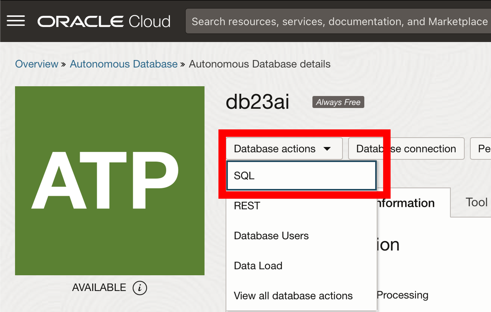
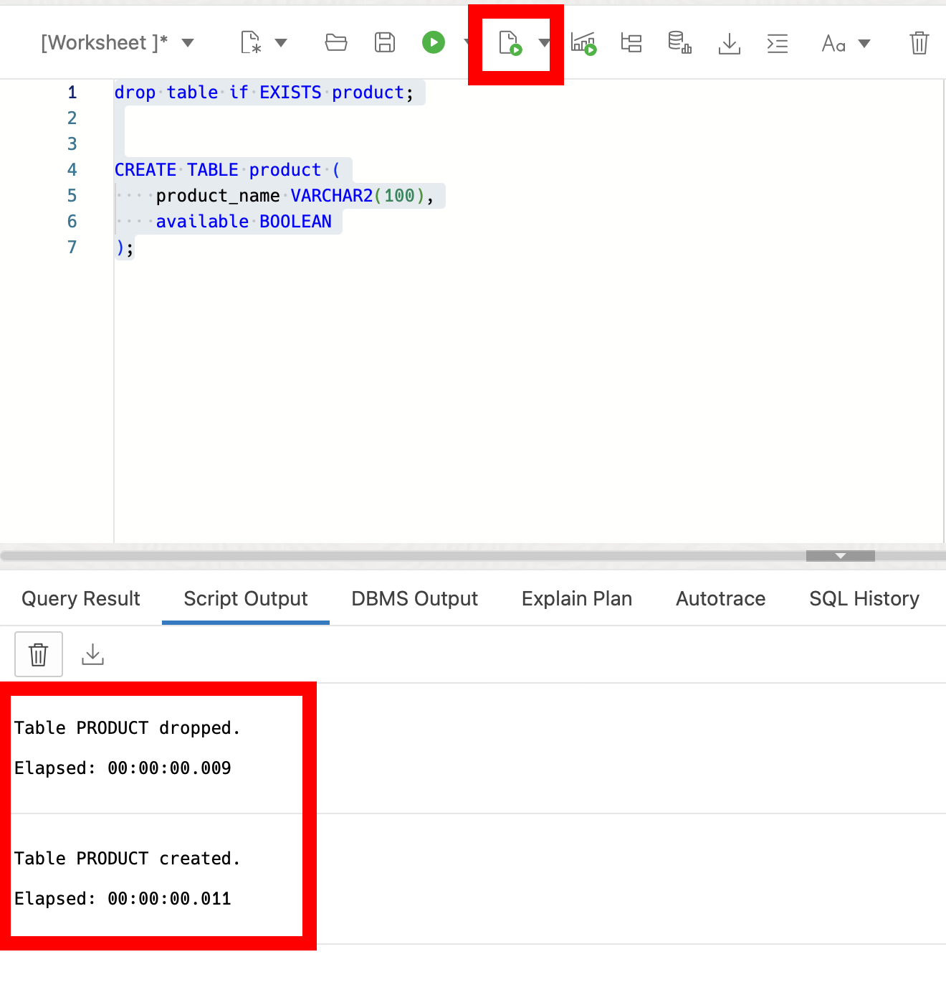
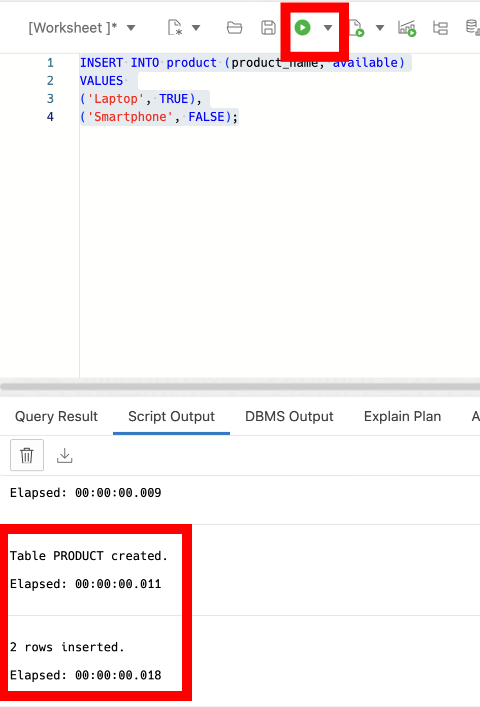
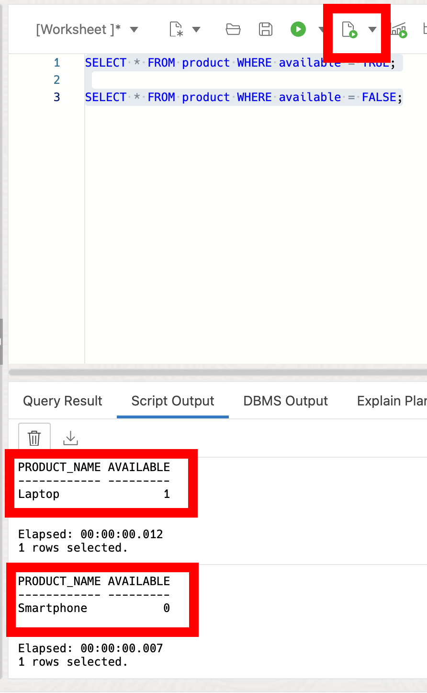
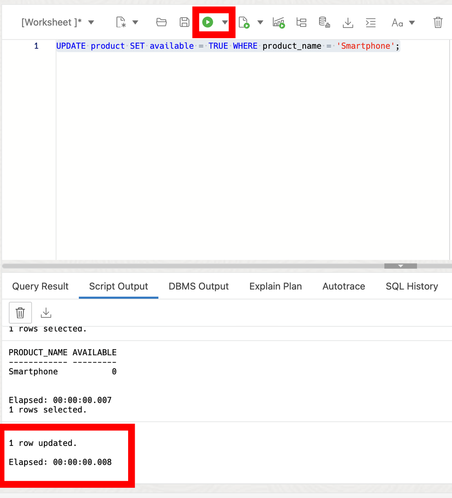
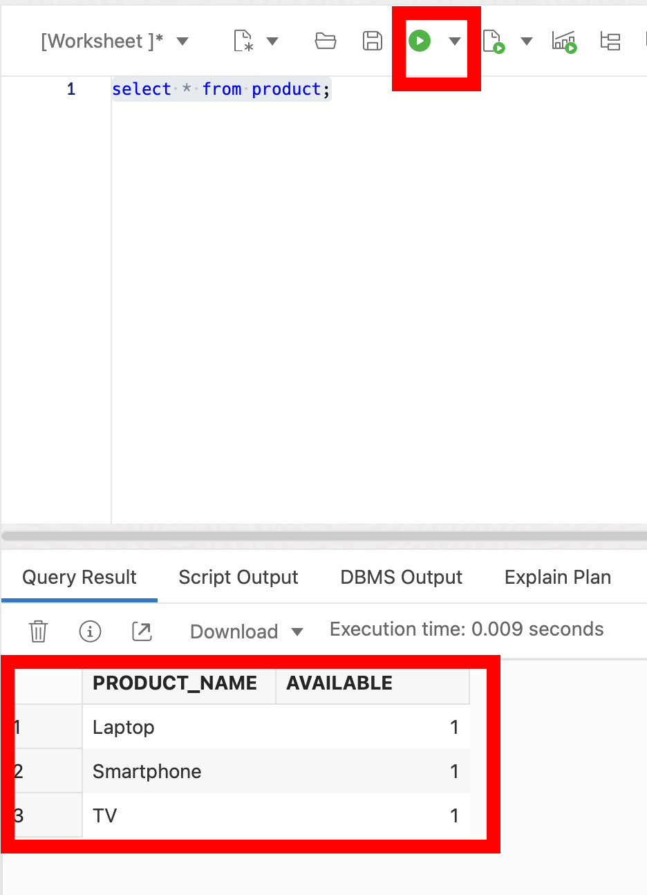

# Exploring Boolean Functionality in Oracle Database 23ai

## Introduction

Welcome to the Boolean Data Type Lab for Oracle Database 23ai! In this lab, you will get some hands on experience with the boolean data types in Oracle Database 23ai.

Oracle Database 23ai introduces native support for boolean data types which expands the capabilities of SQL and PL/SQL. The boolean data type standardizes the storage of Yes and No values and makes it easier to develop on the Oracle Database

Estimated Lab Time: 10 minutes

### Objective:
In this lab, you will explore the boolean data type introduced in Oracle Database 23ai. You will learn how to define boolean columns, insert boolean values, perform boolean operations in SQL queries, and utilize boolean types in PL/SQL.

### Prerequisites:
- Access to Oracle Database 23ai environment.
- Basic understanding of SQL and PL/SQL.

## Task 1: Lab Setup

1. From the Autonomous Database home page, **click** Database action and then **click** SQL.
    

2. Let's start by creating a table with a boolean column. We will use the boolean data type to represent whether a product is available or not.

    ```
    <copy>
    drop table if EXISTS product;


    CREATE TABLE product (
        product_name VARCHAR2(100),
        available BOOLEAN
    );
    </copy>
    ```
    

3. Now, let's insert some sample data into the product table, including boolean values for availability.


    ```
    <copy>
    INSERT INTO product (product_name, available)
    VALUES 
    ('Laptop', TRUE),
    ('Smartphone', FALSE);
    </copy>
    ```
    

## Task 2: Working with Boolean Data

1. Let's run some queries to retrieve information based on boolean conditions.
    - Select all available products
    - Select all unavailable products

    ```
    <copy>
    SELECT * FROM product WHERE available = TRUE;

    SELECT * FROM product WHERE available = FALSE;
    </copy>
    ```
    


2. You can also update boolean values just like any other data type. Imagine we got a new shipment of smartphones and want to update the availability.

    ```
    <copy>
    UPDATE product SET available = TRUE WHERE product_name = 'Smartphone';
    </copy>
    ```
    


2. Additionally, let's modify with PL/SQL and the boolean data type. Insert a TV into the `product` table with a predefined boolean value of true.

    ```
    <copy>
    DECLARE
    l_product_name VARCHAR2(100) := 'TV'; 
    BEGIN
    INSERT INTO product (product_name, available)
    VALUES (l_product_name, TRUE);

    COMMIT;
    END;
    /

    </copy>
    ```
    

3. Now if we select from our product table, we can see the additional product  with the availability of 1 being true.

    ```
    <copy>
    select * from product;
    </copy>
    ```
    

4. In this lab, you gained a very small bit of hands-on experience with the boolean data type in Oracle Database 23ai. You learned how to define boolean columns, insert boolean values, perform boolean operations in SQL queries, and utilize boolean types in PL/SQL. Understanding boolean functionality is helpful for effective data manipulation and decision-making in database systems.

Feel free to continue experimenting with boolean values or explore other features of Oracle Database 23ai.

5. We can clean up from the lab by dropping our tables.

    ```
    <copy>
    DROP TABLE product CASCADE CONSTRAINTS;
    </copy>
    ```

You may now **proceed to the next lab** 

## Learn More

* [Introducing Oracle Database 23ai Boolean Data Type](https://medium.com/oracledevs/boolean-data-type-in-oracle-database-23ai-b9ae541c697f)
* [Boolean Data Type Documentation](https://docs.oracle.com/en/database/oracle/oracle-database/23/nfcoa/application-development.html)

## Acknowledgements
* **Author** - Killian Lynch, Database Product Management
* **Contributors** - Dom Giles, Distinguished Database Product Manager
* **Last Updated By/Date** - Killian Lynch, April 2024