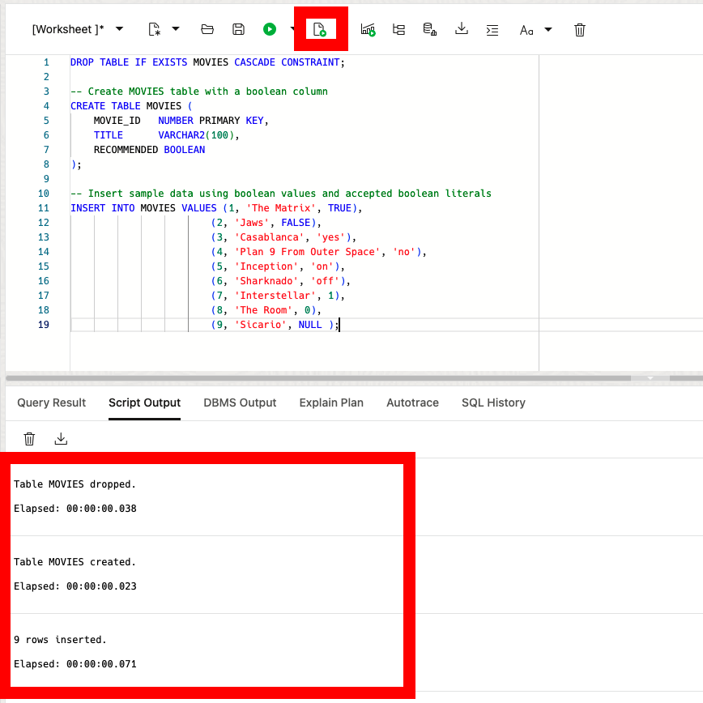
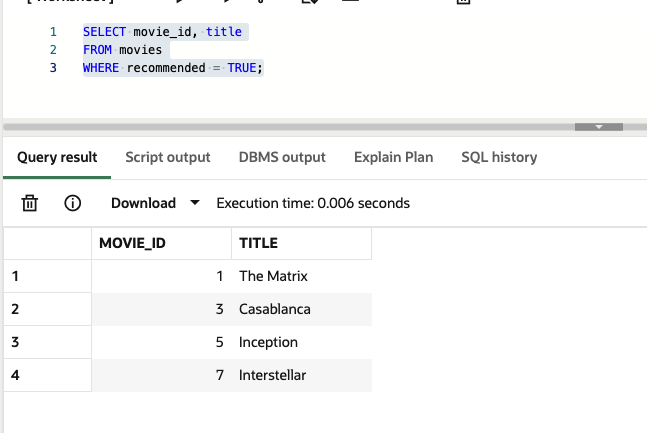

# Exploring Boolean Functionality in Oracle Database 23ai

## Introduction

Welcome to the Boolean Data Type Lab for Oracle Database 23ai! In this lab, you will get some hands on experience with the boolean data type in Oracle Database 23ai.

Oracle Database 23ai introduces native support for boolean data types which expands the capabilities of SQL and PL/SQL. The boolean data type standardizes the storage of true, false, and null values and makes it easier to develop on the Oracle Database

Estimated Lab Time: 10 minutes

### Objective:
In this lab, you will explore the boolean data type introduced in Oracle Database 23ai. You will learn how to define boolean columns, insert boolean values, perform boolean operations in SQL queries, and utilize boolean types in PL/SQL.

### Prerequisites:
- Access to Oracle Database 23ai environment.
- Basic understanding of SQL and PL/SQL.

## Task 1: Working with the boolean data type

1. If you haven't done so already, from the Autonomous Database home page, **click** Database actions and then **click** SQL.
    

    Using the ADMIN user isn’t typically advised due to the high level of access and security concerns it poses. **However**, for this demo, we’ll use it to simplify the setup and ensure we can show the full range of features effectively.

2. Before we begin, this lab will be using Database Actions Web. If you're unfamiliar, please see the picture below for a simple explanation of the tool. You can click on the photo to enlarge it.

    

3. Let’s imagine you’re designing a system that stores data about movies, including whether they have been flagged as “recommended” by an editorial team. With the new boolean data type, you can store this as a TRUE or FALSE value instead of relying on numeric or character codes.

    In this task, you will:
    - Create a MOVIES table with a boolean column.
    - Insert rows with boolean values using various literals.
    - Query the table to see how boolean values are represented and manipulated.
    - Update a MOVIE with a boolean
    - Insert a new MOVIE with a boolean using PL/SQL

    ```
    <copy>
    DROP TABLE IF EXISTS MOVIES CASCADE CONSTRAINT;

    -- Create MOVIES table with a boolean column
    CREATE TABLE MOVIES (
        MOVIE_ID   NUMBER PRIMARY KEY,
        TITLE      VARCHAR2(100),
        RECOMMENDED BOOLEAN
    );

    -- Insert sample data using boolean values and accepted boolean literals
    INSERT INTO MOVIES VALUES (1, 'The Matrix', TRUE),
                            (2, 'Jaws', FALSE),
                            (3, 'Casablanca', 'yes'),
                            (4, 'Plan 9 From Outer Space', 'no'),
                            (5, 'Inception', 'on'),
                            (6, 'Sharknado', 'off'),
                            (7, 'Interstellar', 1),
                            (8, 'The Room', 0),
                            (9, 'Sicario', NULL );
    </copy>
    ```
    

4. Let’s check that our boolean values have been correctly stored. Notice how different input literals map to TRUE, FALSE, or NULL.

    ```
    <copy>
    SELECT movie_id, title, recommended
    FROM movies;
    </copy>
    ```
    

5. Now let’s filter movies based on their boolean values. Suppose we want to find all movies that have been recommended (TRUE).

    ```
    <copy>
    SELECT movie_id, title
    FROM movies
    WHERE recommended = TRUE;
    </copy>
    ```
    

6. You can also perform logical operations directly on boolean columns. For example, let’s assume we consider a movie “highly recommended” if it’s currently recommended, and we want to verify this by applying logical conditions.

    This is being used here just as a teaching example to show the direct handling of boolean values within your SQL statements. In a practical scenario, you wouldn’t typically add AND TRUE since it doesn’t change the logic.

    ```
    <copy>
    -- Select movies where recommended AND TRUE is still TRUE
    SELECT movie_id, title
    FROM movies
    WHERE recommended AND TRUE;
    </copy>
    ```
    

    Similarly, you can check which movies are not recommended:

    ```
    <copy>
    SELECT movie_id, title
    FROM movies
    WHERE NOT recommended;
    </copy>
    ```
    

7. If you want to identify movies that are either recommended or have a title starting with 'I', you can combine boolean logic with standard SQL conditions:

    ```
    <copy>
    SELECT movie_id, title
    FROM movies
    WHERE recommended OR title LIKE 'I%';
    </copy>
    ```
    

8. You can perform DDL against the table just as you'd expect. Here, update the movie jaws so it is now recommended:

    ```
    <copy>
    SELECT title, recommended from movies where movie_id = 2;

    UPDATE movies
    SET recommended = true
    WHERE movie_id = 2;

    SELECT title, recommended from movies where movie_id = 2;
    </copy>
    ```
    

9. Additionally, let's modify with PL/SQL and the boolean data type. Add a new movie:

    ```
    <copy>
    DECLARE
        l_movie_id NUMBER := 10;
        l_movie_name VARCHAR2(100) := 'Surfs Up'; 
        l_recommended BOOLEAN := TRUE;
    BEGIN
        INSERT INTO movies (movie_id, title, recommended)
        VALUES (l_movie_id, l_movie_name, l_recommended);

        COMMIT;
    END;
    /
    </copy>
    ```
    

10. You can check the recommended movies now:

    ```
    <copy>
    SELECT movie_id, title
    FROM movies
    WHERE recommended = TRUE;
    </copy>
    ```
    


11. As with any lab, you can clean up by dropping the table when you’re done.

    ```
    <copy>
    DROP TABLE IF EXISTS MOVIES CASCADE CONSTRAINT;
    </copy>
    ```

## Learn More

* [Introducing Oracle Database 23ai Boolean Data Type](https://medium.com/oracledevs/boolean-data-type-in-oracle-database-23ai-b9ae541c697f)
* [Boolean Data Type Documentation](https://docs.oracle.com/en/database/oracle/oracle-database/23/nfcoa/application-development.html)

## Acknowledgements
* **Author** - Killian Lynch, Database Product Management
* **Contributors** - Dom Giles, Distinguished Database Product Manager
* **Last Updated By/Date** - Killian Lynch, December 2024