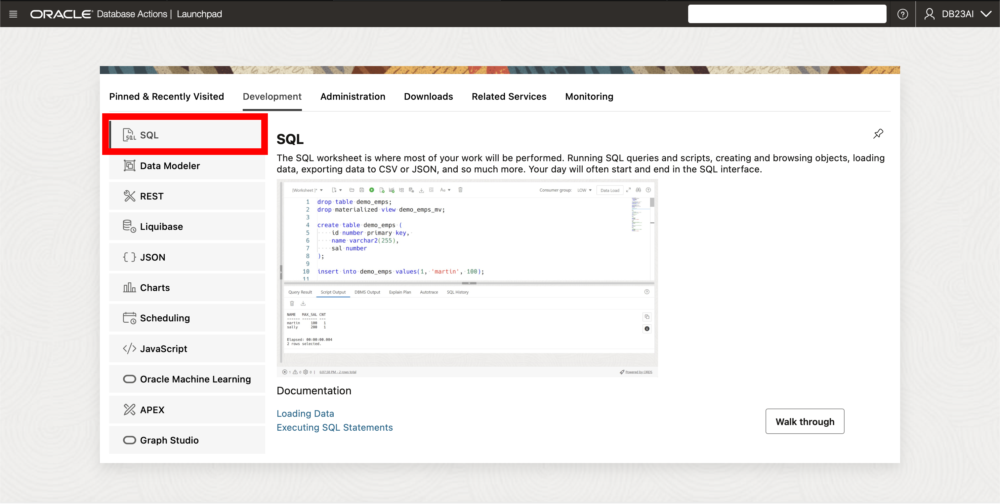

# Granting the Developer Role

## Introduction

Welcome to the "Granting the Developer Role" lab. In this lab, you will learn how to grant and revoke the new Developer Role along with the benefits of using it in the Oracle Database for application development purposes. The Developer Role offers a full set of privileges for designing, developing, and deploying applications without having to constantly grant and manage additional privileges as the application gets created.

Estimated Lab Time: 10 minutes

Watch the video below for a walkthrough of the lab.
[Oracle Database 23ai](videohub:1_3x5r64gp)


### Objective:
As Oracle MovieStreams scales, it needs to streamline its development process. In this lab, you’ll configure a dedicated developer role that aligns with Oracle MovieStreams’ growing needs. 

The objective of this lab is to familiarize you with the Developer Role in Oracle Database 23ai and show you how to enable it. By the end of this lab, you will understand how to use the Developer Role effectively for granting privileges to application users.

### Prerequisites:
- Access to Oracle Database 23ai.
- Completion of the Get Started with LiveLabs lab
- Basic understanding of SQL is helpful.

## Task 1: Lab setup and understanding the developer role

**Scenario** Oracle MovieStreams is expanding its development team to include a new developer working on different aspects of the database. To ensure that each developer has the appropriate level of access and to streamline the management of permissions, we will create a new user and grant them the **NEW** Developer role in Oracle Database 23ai. This role will allow developers to perform their tasks without compromising the security or stability of the database.

1. To make this workshop as realistic as possible, let us introduce the business scenario you will use during this workshop - Oracle MovieStream.

  

  Oracle MovieStream is a fictitious online movie streaming company. As Oracle MovieStream continues to grow, it faces new technological challenges around data storage, performance, and security. To meet these challenges, Oracle MovieStreams is leveraging the new features of Oracle Database 23ai.
 
  The company has decided to adopt Oracle Database 23ai for its advanced features, including AI-driven search capabilities, JSON duality views, property graphs, SQL Firewall and more.

  Many of the scenarios in this workshop will be based on challenges companies are seeing in their own businesses, and we hope the following labs and accompanying workshops will give you some insight into how Oracle can help you solve these common everyday business and technical challenges.

2. The Developer Role gives us a full set of system privileges, object privileges, predefined roles, PL/SQL package privileges, and tracing privileges required by application developers. It simplifies privilege management and helps keep the database as secure as possible for the development environment. As always, please review the privileges granted and compare with your organizations security protocol.

    ```
    <copy>
    SELECT ROLE FROM DBA_ROLES WHERE ROLE = 'DB_DEVELOPER_ROLE';
    </copy>
    ```

3. Benefits of Developer Role:
   - **Least-Privilege Principle**: Granting the Developer Role follows the least-privilege principle. This means that application developers (and all other database users) only have access to the necessary privileges. 
   - **Enhanced Security**: Using the Developer Role improves database security by reducing the risk of granting unneeded privileges to application users, which ties into the least-privilege principle from above.
   - **Simplified Management**: Granting the Developer Role simplifies the management of role grants and revokes for application users.

## Task 2: Creating a user and assigning the new developer role

1. Here we can go ahead and create our user for this workshop. We'll call our user `DB23AI` and grant the user the new developer role.

    ```
    <copy>
  -- USER SQL
  CREATE USER DB23AI IDENTIFIED BY Oracledb_4U#;

  -- ADD ROLES
  GRANT DB_DEVELOPER_ROLE TO DB23AI;

  GRANT CONNECT TO DB23AI;
  GRANT RESOURCE TO DB23AI;
  GRANT CONSOLE_DEVELOPER TO DB23AI;
  GRANT GRAPH_DEVELOPER TO DB23AI;


  -- REST ENABLE
  BEGIN
      ORDS_ADMIN.ENABLE_SCHEMA(
          p_enabled => TRUE,
          p_schema => 'DB23AI',
          p_url_mapping_type => 'BASE_PATH',
          p_url_mapping_pattern => 'db23ai',
          p_auto_rest_auth=> TRUE
      );
      -- ENABLE DATA SHARING
      C##ADP$SERVICE.DBMS_SHARE.ENABLE_SCHEMA(
              SCHEMA_NAME => 'DB23AI',
              ENABLED => TRUE
      );
      commit;
  END;
  /

  ALTER USER DB23AI DEFAULT ROLE CONSOLE_DEVELOPER,DB_DEVELOPER_ROLE,GRAPH_DEVELOPER;
  ALTER USER DB23AI GRANT CONNECT THROUGH GRAPH$PROXY_USER;

  -- QUOTA
  ALTER USER DB23AI QUOTA UNLIMITED ON DATA;

    </copy>
    ```

2. Just like with other roles in the database, we can revoke and grant them. The synxax for revoking looks like 

    ```
    REVOKE <ROLE> FROM <USER>;
    ```

3. We can look at the system, role and object privileges associated with the DB\_DEVELOPER\_ROLE role. For example, we can list the system privileges granted to us by the developer role.
    ```
    <copy>
    SELECT privilege FROM role_sys_privs WHERE role='DB_DEVELOPER_ROLE';
    </copy>
    ```


## Task 3: Signing in and testing the role

1. Let's sign in as our new user. Click on the admin profile in the top right hand of Database Actions and sign out.

  

2. Sign in with the username **DB23AI** and password **Oracledb_4U#**

  

3. Click SQL to open the SQL editor.

  

4. Oracle has introduced NEW functionality that eliminates the need for the `FROM DUAL' clause, making queries more intuitive and more compatible with other database offerings. You can still use from dual without any impact.

  We can check our user has the developer role without having to specify FROM DUAL.

    ```
    <copy>
    -- Syntax prior to 23ai
    SELECT SYS_CONTEXT('SYS_SESSION_ROLES', 'DB_DEVELOPER_ROLE') FROM DUAL;

    -- Syntax in 23ai
    SELECT SYS_CONTEXT('SYS_SESSION_ROLES', 'DB_DEVELOPER_ROLE');  
    </copy>
    ```
5. We can also validate role restriction and attempt to perform an action outside of the developer role permissions.

    ```
    <copy>
    GRANT DBA TO DB_DEVELOPER_ROLE;
    </copy>
    ```

3. In this lab, we explored the Developer Role in Oracle Database 23ai for application development. By granting the Developer Role, it can help simplify privilege management and improve your database security during the development process of applications.

  As always, please review the privileges granted and compare with your organizations security protocol.

You may now **proceed to the next lab** 


## Learn More

* [Use of the DB\_DEVELOPER\_ROLE for Application Developers Documentation](https://docs.oracle.com/en/database/oracle/oracle-database/23/dbseg/managing-security-for-application-developers.html#DBSEG-GUID-DCEEC563-4F6C-4B0A-9EB2-9F88CDF351D7)

## Acknowledgements
* **Author** - Killian Lynch, Database Product Management
* **Contributors** - Dom Giles, Distinguished Database Product Manager
* **Last Updated By/Date** - Killian Lynch, April 2024