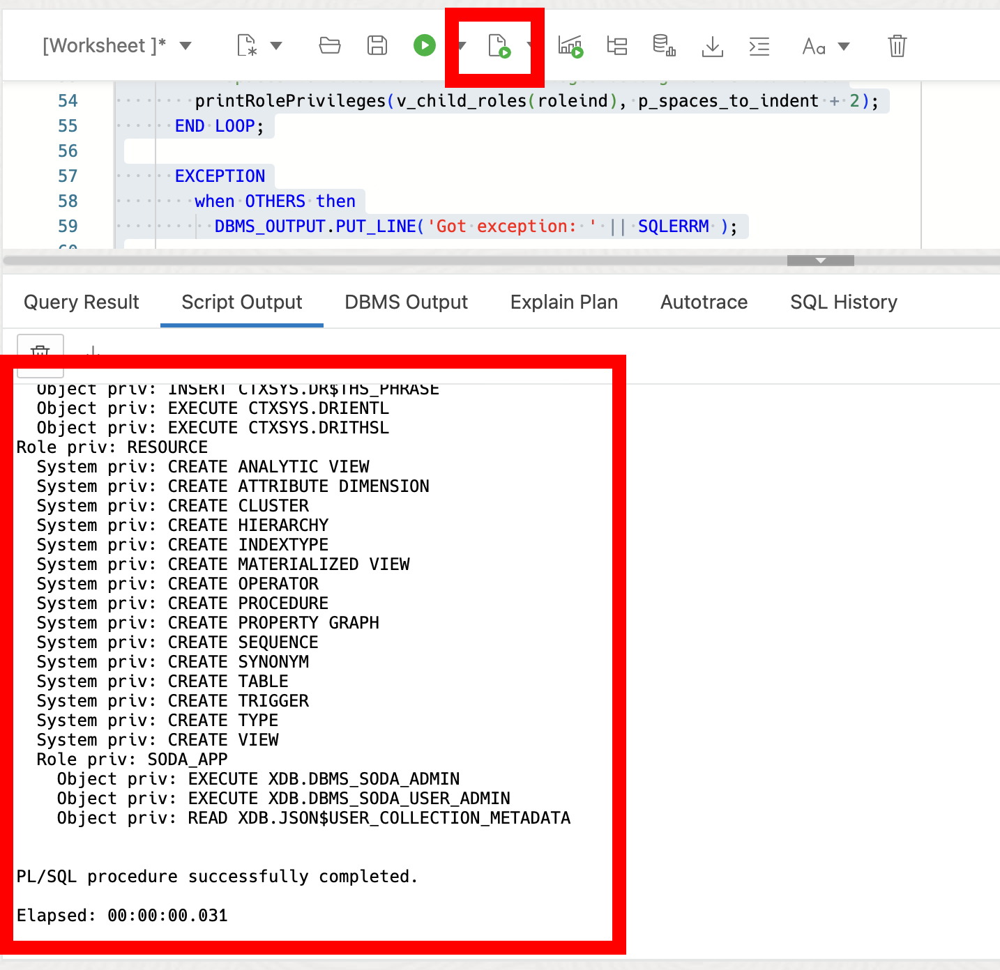

# Granting the Developer Role

## Introduction

Welcome to the "Granting the Developer Role" lab. In this lab, you will learn how to grant and revoke the new Developer Role along with the benefits of using it in the Oracle Database for application development purposes. The Developer Role offers a full set of privileges for designing, developing, and deploying applications without having to constantly grant and manage additional privileges as the application gets created.

Estimated Lab Time: 10 minutes

### Objective:
The objective of this lab is to familiarize you with the Developer Role in Oracle Database 23ai and show you how to enable it. By the end of this lab, you will understand how to use the Developer Role effectively for granting privileges to application users.

### Prerequisites:
- Access to Oracle Database 23ai.
- Completion of the Get Started with LiveLabs lab
- Basic understanding of SQL is helpful.

## Task 1: Lab setup and understanding the developer role

1. The Developer Role gives us a full set of system privileges, object privileges, predefined roles, PL/SQL package privileges, and tracing privileges required by application developers. It simplifies privilege management and helps keep the database as secure as possible for the development environment. As always, please review the privileges granted and compare with your organizations security protocol.

2. Benefits of Developer Role:
   - **Least-Privilege Principle**: Granting the Developer Role follows the least-privilege principle. This means that application developers (and all other database users) only have access to the necessary privileges. 
   - **Enhanced Security**: Using the Developer Role improves database security by reducing the risk of granting unneeded privileges to application users, which ties into the least-privilege principle from above.
   - **Simplified Management**: Granting the Developer Role simplifies the management of role grants and revokes for application users.

## Task 2: Generating a list of granted privileges and roles

1. From the Autonomous Database home page, **click** Database action and then **click** SQL.
    

2. To check all of the system privileges, object privileges, and roles granted by the Developer Role, run the following PL/SQL script:

    ```
    <copy>
    set serveroutput on format wrapped;
    DECLARE
        procedure printRolePrivileges(
          p_role             in varchar2,
          p_spaces_to_indent in number) IS
          v_child_roles   DBMS_SQL.VARCHAR2_TABLE;
          v_system_privs  DBMS_SQL.VARCHAR2_TABLE;
          v_table_privs   DBMS_SQL.VARCHAR2_TABLE;
          v_indent_spaces varchar2(2048);
        BEGIN
          -- Indentation for nested privileges via granted roles.
          for space in 1..p_spaces_to_indent LOOP
            v_indent_spaces := v_indent_spaces || ' ';
          end LOOP;
          -- Get the system privileges granted to p_role
          select PRIVILEGE bulk collect into v_system_privs
          from DBA_SYS_PRIVS
          where GRANTEE = p_role
          order by PRIVILEGE;

          -- Print the system privileges granted to p_role
          for privind in 1..v_system_privs.COUNT LOOP
            DBMS_OUTPUT.PUT_LINE(
              v_indent_spaces || 'System priv: ' || v_system_privs(privind));
          END LOOP;

          -- Get the object privileges granted to p_role
          select PRIVILEGE || ' ' || OWNER || '.' || TABLE_NAME
            bulk collect into v_table_privs
          from DBA_TAB_PRIVS
          where GRANTEE = p_role
          order by TABLE_NAME asc;

          -- Print the object privileges granted to p_role
          for tabprivind in 1..v_table_privs.COUNT LOOP
            DBMS_OUTPUT.PUT_LINE(
              v_indent_spaces || 'Object priv: ' || v_table_privs(tabprivind));
          END LOOP;

          -- get all roles granted to p_role
          select GRANTED_ROLE bulk collect into v_child_roles
          from DBA_ROLE_PRIVS
          where GRANTEE = p_role
          order by GRANTED_ROLE asc;

          -- Print all roles granted to p_role and handle child roles recursively.
          for roleind in 1..v_child_roles.COUNT LOOP
            -- Print child role
            DBMS_OUTPUT.PUT_LINE(
             v_indent_spaces || 'Role priv: ' || v_child_roles(roleind));

            -- Print privileges for the child role recursively. Pass 2 additional
            -- spaces to illustrate these privileges belong to a child role.
            printRolePrivileges(v_child_roles(roleind), p_spaces_to_indent + 2);
          END LOOP;

          EXCEPTION
            when OTHERS then
              DBMS_OUTPUT.PUT_LINE('Got exception: ' || SQLERRM );

        END printRolePrivileges;

    BEGIN
        printRolePrivileges('DB_DEVELOPER_ROLE', 0);
    END;
    /
    </copy>
    ```
    

3. Here we can go ahead and create our user for this workshop. We'll call our user `DB23AI` and grant the user the new developer role.

    ```
    <copy>
  -- USER SQL
  CREATE USER DB23AI IDENTIFIED BY Oracledb_4U#;

  -- ADD ROLES
  GRANT CONNECT TO DB23AI;
  GRANT DB_DEVELOPER_ROLE TO DB23AI;
  GRANT RESOURCE TO DB23AI;

  -- REST ENABLE
  BEGIN
      ORDS_ADMIN.ENABLE_SCHEMA(
          p_enabled => TRUE,
          p_schema => 'DB23AI',
          p_url_mapping_type => 'BASE_PATH',
          p_url_mapping_pattern => 'db23ai',
          p_auto_rest_auth=> TRUE
      );
      -- ENABLE DATA SHARING
      C##ADP$SERVICE.DBMS_SHARE.ENABLE_SCHEMA(
              SCHEMA_NAME => 'DB23AI',
              ENABLED => TRUE
      );
      commit;
  END;
  /

  -- QUOTA
  ALTER USER DB23AI QUOTA UNLIMITED ON DATA;

    </copy>
    ```

## Task 3: Performing grants and revokes

1. Just like with other roles in the database, we can revoke and grant privileges. Since we granted the role above, we'll check the user and remove the role. Run the following as a script and take a look at the output 

    ```
    <copy>
    SELECT GRANTED_ROLE FROM DBA_ROLE_PRIVS WHERE GRANTEE='DB23AI';
    REVOKE DB_DEVELOPER_ROLE FROM DB23AI;
    SELECT GRANTED_ROLE FROM DBA_ROLE_PRIVS WHERE GRANTEE='DB23AI';
    </copy>
    ```
    We can see that the user `DB23AI` we created above doesn't have the Developer Role anymore.
    
    

2. Now we can re-grant the role to `DB23AI`. Again, run this as a script.
   
    ```
    <copy>
    GRANT DB_DEVELOPER_ROLE TO DB23AI;
    SELECT GRANTED_ROLE FROM DBA_ROLE_PRIVS WHERE GRANTEE='DB23AI';
    </copy>
    ```
    

3. Let's sign in as our new user. Click on the admin profile in the top right hand of Database Actions and sign out.

  

4. Sign in with the username **DB23AI** and password **Oracledb_4U#**

  

5. Click SQL to open the SQL editor.

  


3. In this lab, we explored the Developer Role in Oracle Database 23ai for application development. By granting the Developer Role, it can help simplify privilege management and improve your database security during the development process of applications.

You may now **proceed to the next lab** 


## Learn More

* [Use of the DB\_DEVELOPER\_ROLE for Application Developers Documentation](https://docs.oracle.com/en/database/oracle/oracle-database/23/dbseg/managing-security-for-application-developers.html#DBSEG-GUID-DCEEC563-4F6C-4B0A-9EB2-9F88CDF351D7)

## Acknowledgements
* **Author** - Killian Lynch, Database Product Management
* **Contributors** - Dom Giles, Distinguished Database Product Manager
* **Last Updated By/Date** - Killian Lynch, April 2024