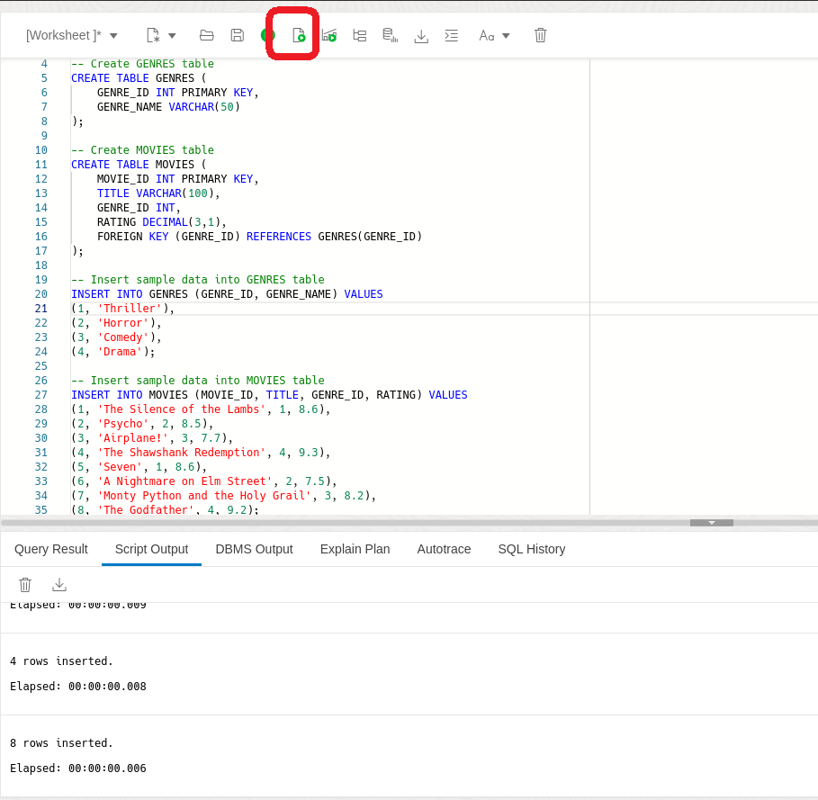
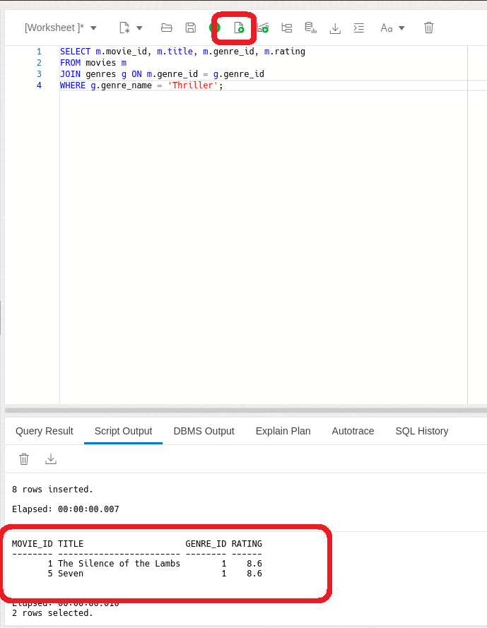
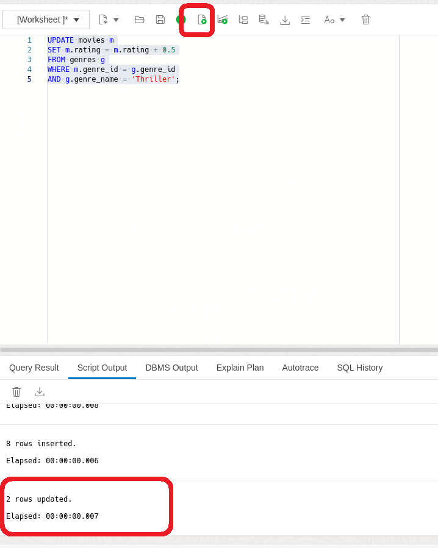
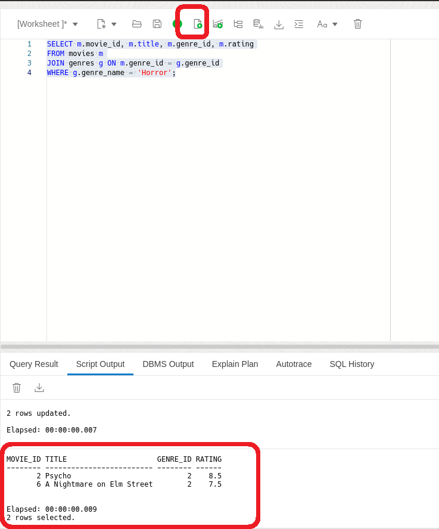
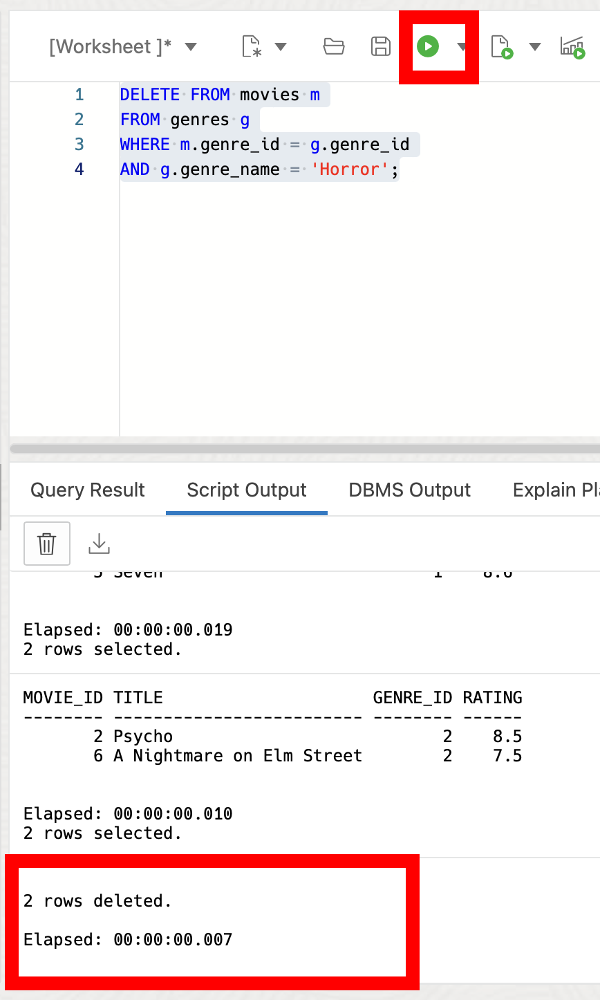

# Simplifying Data Manipulation in SQL with Direct Joins

## Introduction

Welcome to Simplifying Data Manipulation in SQL! In this lab, you'll learn about the new 23ai feature called direct joins in SQL. Direct joins allow you to easily update and delete data across multiple related tables. 

Estimated Lab Time: 10 minutes

### Objective:
The goal of this lab is to help you understand and use direct joins effectively in SQL. By the end of this lab, you'll be able to confidently update and delete data across tables, making your database management tasks much easier.

### Prerequisites:
- Access to Oracle Database 23ai.
- Basic understanding of SQL is helpful.

## Task 1: Working with direct joins

1. If you haven't done so already, from the Autonomous Database home page, **click** Database action and then **click** SQL.
    

    Using the ADMIN user isn’t typically advised due to the high level of access and security concerns it poses. **However**, for this demo, we’ll use it to simplify the setup and ensure we can show the full range of features effectively. 

2. Before we begin, this lab will be using Database Actions Web. If you're unfamiliar, please see the picture below for a simple explanation of the tool. You can click on the photo to enlarge it.

    
   
2. Lets imagine you've built the next movie streaming app, but for some reason, no one wants to watch the thriller movies. You decide to create a small test by artificially improving the rating of thriller movies to see if that coax people into watching them. 

    Your task? To boost the ratings of Thriller movies that fall below a certain threshold, so that your users always have a 'top-tier' thriller recommendation.


    ```
    <copy>
    DROP TABLE if exists GENRES CASCADE CONSTRAINT;
    DROP TABLE if exists MOVIES CASCADE CONSTRAINT;
    
    -- Create GENRES table
    CREATE TABLE GENRES (
        GENRE_ID INT PRIMARY KEY,
        GENRE_NAME VARCHAR(50)
    );

    -- Create MOVIES table
    CREATE TABLE MOVIES (
        MOVIE_ID INT PRIMARY KEY,
        TITLE VARCHAR(100),
        GENRE_ID INT,
        RATING DECIMAL(3,1),
        FOREIGN KEY (GENRE_ID) REFERENCES GENRES(GENRE_ID)
    );

    -- Insert sample data into GENRES table
    INSERT INTO GENRES (GENRE_ID, GENRE_NAME) VALUES
    (1, 'Thriller'),
    (2, 'Horror'),
    (3, 'Comedy'),
    (4, 'Drama');

    -- Insert sample data into MOVIES table
    INSERT INTO MOVIES (MOVIE_ID, TITLE, GENRE_ID, RATING) VALUES
    (1, 'The Silence of the Lambs', 1, 8.6),
    (2, 'Psycho', 2, 8.5),
    (3, 'Airplane!', 3, 7.7),
    (4, 'The Shawshank Redemption', 4, 9.3),
    (5, 'Seven', 1, 8.6),
    (6, 'A Nightmare on Elm Street', 2, 7.5),
    (7, 'Monty Python and the Holy Grail', 3, 8.2),
    (8, 'The Godfather', 4, 9.2);
    </copy>
    ```
    

3. First we'll take a look at all of our thriller movies and their ratings 

    ```
    <copy>
    SELECT m.movie_id, m.title, m.genre_id, m.rating
    FROM movies m
    JOIN genres g ON m.genre_id = g.genre_id
    WHERE g.genre_name = 'Thriller';
    </copy>
    ```
    

4. In older versions of Oracle, you'd have to resort to creating sub-queries to execute the updates. This could make SQL more complex and difficult to maintain.

    In Oracle Database 23ai the syntax is much simpler and the join can be performed in the same update statement.

    ```
    <copy>
    UPDATE movies m
    SET m.rating = m.rating + 0.5
    FROM genres g
    WHERE m.genre_id = g.genre_id
    AND g.genre_name = 'Thriller';
    </copy>
    ```
    

5. Wait, what if we don't like horror movies? Let's say we decide to purge all of our Horror genre.

    ```
    <copy>
    SELECT m.movie_id, m.title, m.genre_id, m.rating
    FROM movies m
    JOIN genres g ON m.genre_id = g.genre_id
    WHERE g.genre_name = 'Horror';
    </copy>
    ```
    


6. Again, with Oracle 23ai's direct join capability, removing these movies becomes a lot easier.

    ```
    <copy>
    DELETE FROM movies m
    FROM genres g
    WHERE m.genre_id = g.genre_id
    AND g.genre_name = 'Horror';
    </copy>
    ```
    

6. In this Lab, you learned how direct joins simplify data manipulation tasks, especially in updating and deleting data across multiple related tables. By using direct joins, you've learned how to make your SQL queries more efficient, readable, and easier to maintain. Feel free to continue practicing or choose a new lab to try out!

8. We can clean up from the lab by dropping our tables.

    ```
    <copy>
    DROP TABLE if exists GENRES CASCADE CONSTRAINT;
    DROP TABLE if exists MOVIES CASCADE CONSTRAINT;
    </copy>
    ```


## Learn More

* [Direct Joins for UPDATE and DELETE Statements Documentation](https://docs.oracle.com/en/database/oracle/oracle-database/23/nfcoa/application-development.html#GUID-326C2680-1D34-4615-93DF-917CB394CB73)


## Acknowledgements
* **Author** - Killian Lynch, Database Product Management
* **Contributors** - Dom Giles, Distinguished Database Product Manager
* **Last Updated By/Date** - Killian Lynch, April 2024