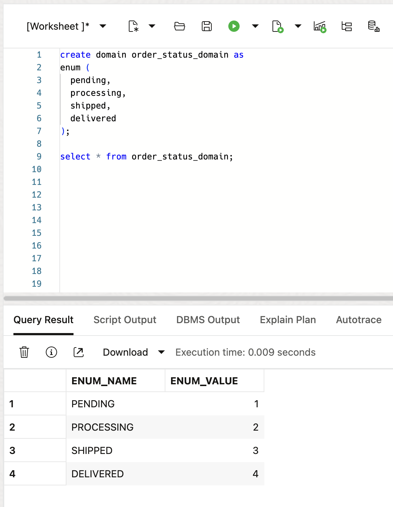

# Data Usecase Domains Exploration

## Introduction

Welcome to the "Data Usecase Domains Exploration" lab! Data Usecase Domains play a crucial role in data integrity and consistency within database applications. Data Use Case Domains provide consistent metadata for development, analytics, and ETL applications and tools helping to ensure data consistency and validation throughout the schema. In this lab, we will explore Data Usecase Domains in Oracle Database 23ai, covering single column Data Usecase Domains, multi-column Data Usecase Domains, flexible Data Usecase Domains and enumeration use case domains. Through these examples, you will gain an understanding of how Data Usecase Domains can be defined, applied, and used to maintain data quality.

Estimated Lab Time: 20 minutes

Watch the video below for a walkthrough of the lab.
[Lab walkthrough video](videohub:1_u7ik5hzz)

### Objective:
The objective of this lab is to provide comprehensive hands-on experience with Data Usecase Domains in Oracle Database 23ai. By the end of this lab, you will be proficient in defining various types of Data Usecase Domains, applying them to tables, and leveraging domain functions for effective data management.

### Prerequisites:
- Access to Oracle Database 23ai.
- Basic understanding of SQL concepts.


## Task 1: Understanding Data Usecase Domains

1. If you haven't done so already, from the Autonomous Database home page, **click** Database action and then **click** SQL.
    

    Using the ADMIN user isn’t typically advised due to the high level of access and security concerns it poses. **However**, for this demo, we’ll use it to simplify the setup and ensure we can show the full range of features effectively. 

2. Before we begin, this lab will be using Database Actions Web. If you're unfamiliar, please see the picture below for a simple explanation of the tool. You can click on the photo to enlarge it.

    

2. **Overview of Data Usecase Domains:**
   Data Usecase Domains serve as a way for defining properties and constraints associated with columns. They ensure consistency in data representation and validation throughout the application. Data Use Case Domains also provide consistent metadata for development, analytics, and ETL applications and tools helping to ensure data consistency and validation throughout the schema.

3. **Types of Data Usecase Domains:**
   - Single Column Domain: Applies constraints to a single column.
   - Multi-Column Domain: Applies constraints to multiple columns.
   - Flexible Domain: Allows dynamic selection of Data Usecase Domains based on specific conditions.
   - Enumeration Use Case Domain: Contains a set of names, and optionally, a value corresponding to a name.

## Task 2: Creating and Implementing Data Usecase Domains

1. Single Column Domain Example: From the explanation above, let's see what three of the four types of Data Usecase Domains looks like (Enumeration Use Case Domain will be added to the workshop soon). We'll start by creating a single column domain for storing product prices. We will enforce a constraint to ensure that prices are positive numbers. 

    **Click** the Run Script button shown in the picture below - we will run the rest of the lab using the Run Script button.

    ```
    <copy>
    -- Drop the domain if it already exists
    drop domain if exists price force;

    -- Creating a single column domain
    create domain price as number
    constraint price check (value > 0);
    </copy>
    ```
    

2. Multi-Column Domain Example: Next, we'll create a multi-column domain to represent geographical coordinates. This domain will enforce constraints on latitude and longitude values. Again, **click** the Run Script button shown in the picture below

    ```
    <copy>
    -- Drop the domain if it already exists
    drop domain if exists coordinates force;

    -- Creating a multi-column domain
    create domain coordinates as (
        latitude  as number,
        longitude as number,
        location_name as varchar2 (100)
    )
    constraint coordinates check (latitude between -90 and 90 and longitude between -180 and 180);
    </copy>
    ```

    


3. Flexible Domain Example: For the flexible domain, let's consider a scenario where we want to store contact information for individuals. We'll create Data Usecase Domains for different types of contacts and dynamically select the appropriate domain based on the contact type. Again, **click** the Run Script button shown in the picture below.

    ```
    <copy>
    -- Drop the Data Usecase Domains if they already exists
    drop domain if exists personal_contact_dom force;
    drop domain if exists business_contact_dom force;
    drop domain if exists default_contact_dom force;

    -- Personal contact domain
    create domain personal_contact_dom as (
        first_name     as varchar2(50),
        last_name      as varchar2(50),
        email          as varchar2(100),
        phone          as varchar2(20)
    )
    constraint personal_contact_dom check (first_name is not null and 
                                           phone is not null);

    -- Business contact domain
    create domain business_contact_dom as (
        company_name   as varchar2(100),
        first_name     as varchar2(50),
        last_name      as varchar2(50),
        email          as varchar2(100),
        phone          as varchar2(20)

    )
    constraint business_contact_dom check (first_name is not null and 
                                           phone is not null);

    -- Default contact domain
    create domain default_contact_dom as (
        first_name     as varchar2(50),
        last_name      as varchar2(50),
        email          as varchar2(100),
        phone          as varchar2(20)
    )
    constraint default_contact_dom check (first_name is not null and 
                                           phone is not null);

    -- Flexible domain to choose contact based on type
    create flexible domain contact_flex_dom (company_name, first_name, last_name, email, phone)
    choose domain using (contact_type varchar2(100))
    from case
        when contact_type = 'personal' then personal_contact_dom(first_name, last_name, email, phone)
        when contact_type = 'business' then business_contact_dom(company_name, first_name, last_name, email, phone)
        else default_contact_dom(first_name, last_name, email, phone)
    end;


    </copy>
    ```

     

4. Oracle Database 23ai also has some pre-created Data Usecase Domains that we can use with many more on the way. Let's see what those are.

    ```
    <copy>
    select name as "System provided domains" from all_domains where owner = 'SYS'
    </copy>
    ```
    

## Task 3: Implementing and Utilizing Data Usecase Domains in Tables for Data Management  
1. Now, let's create some tables and apply our Data Usecase Domains.

    ```
    <copy>

    -- Drop table with single column domain if exists
    drop table if exists products purge;

    -- Table with single column domain
    create table products (
        product_id   number,
        name         varchar2(100),
        price        price          -- User defined domain
    );

    -- Drop table with multi-column domain if exists
    drop table if exists locations purge;

    -- Table with multi-column domain
    create table locations (
        location_id     number,
        latitude        number,
        longitude       number,
        location_name   varchar2(100),
        domain  coordinates(latitude, longitude, location_name)    -- User defined domain
    );

    -- Drop table with flexible domain if exists
    drop table if exists contacts purge;

    -- Table with flexible domain
    create table contacts (
        contact_id     number,
        contact_type   varchar2(100),
        company_name   varchar2(100),
        first_name     varchar2(50),
        last_name      varchar2(50),
        email          varchar2(100),
        phone          varchar2(20),
        domain         contact_flex_dom(company_name, first_name, last_name, email, phone) using (contact_type) -- User defined domain
    );

    </copy>
    ```
2. We can now insert sample data into the created tables to test domain constraints. The Widget will get inserted into our table and the Gadget will fail because it fails our constraint of only positive numbers in the price domain.

    ```
    <copy>
    -- Inserting data into products table
    insert into products (product_id, name, price) values (1, 'Widget', 10.99);
    insert into products (product_id, name, price) values (2, 'Gadget', -5.99); -- This will fail

    </copy>
    ```
    

3. Now we can insert into our multi-column domain table and our flexible domain table. Again our first insert into the locations table will fail because our latitude is greater than 90 but our second insert statement will pass because the constraints are correct. 
    ```
    <copy>
    -- Inserting data into locations table with multi-column domain
    insert into locations (location_id, location_name, latitude, longitude) 
    values (1, 'Headquarters', 100.7749, -122.4194); -- This will fail 

    insert into locations (location_id, location_name, latitude, longitude) 
    values (2, 'Branch Office', 40.7128, -74.0060);


    -- Inserting a personal contact
    insert into contacts (contact_id, contact_type, first_name, last_name, email, phone)
    values (1, 'personal', 'John', 'Doe', 'john.doe@example.com', 1231231231);

    </copy>
    ```
4. We can also create Enumeration Use Case Domains. These are a list of names with an associated list of values. If we don't manually define the list ourselves, the ordering starts from 1.
    ```
    <copy>
    drop domain if exists order_status_domain;

    create domain order_status_domain as
    enum (
    pending,
    processing,
    shipped,
    delivered
    );

    select * from order_status_domain;

    </copy>
    ```
    

5. We can also define the values ourselves. We can use numbers or string values.

    ```
    <copy>
    drop domain if exists order_status_domain;

    create domain order_status_domain as
    enum (
    pending = 5,
    processing = 6,
    shipped = 7,
    delivered = 8
    );

    select * from order_status_domain;

    </copy>
    ```
    

6. As with the other domains, we can also use the enumeration domains in our tables.

    ```
    <copy>
    drop table if exists orders;

    create table orders (
    id          number generated always as identity primary key,
    customer    varchar2(100),
    product     varchar2(100),
    status      order_status_domain
    );


    insert into orders (customer, product, status) 
    values 
            ('Alice', 'Laptop', order_status_domain.pending),
            ('Bob', 'Smartphone', order_status_domain.processing),
            ('Charlie', 'Headphones', order_status_domain.shipped),
            ('Diana', 'Monitor', order_status_domain.delivered);
    
    select id, customer, product, domain_display(status) as status from orders; 

    </copy>
    ```
    
    

7. It should be noted that automatically assigned numeration values are just an ordered list, meaning there is no enforced assigned order. If we change an item we could end up corrupting our data. A simple way to avoid this is by assigning the value ourselves. This way the order statuses are consistently defined and immune to logical corruption even if new statuses are added or the order changes in the enumeration domain.

## Task 4: Viewing our Data Usecase Domains
1. We can view our Data Usecase Domains to see their information. The dictionary views: [USER|DBA|ALL]\_DOMAINS and [USER|DBA|ALL]\_DOMAIN_COLS represent Data Usecase Domains and provide the following information about the domain columns. For flexible Data Usecase Domains, the views also include the domain selector expression. 


2. Let's take a look at the Data Usecase Domains we've created and the associated information.

    ```
    <copy>
    select * from USER_DOMAIN_CONSTRAINTS;
    </copy>
    ```

3. Data Usecase Domains play a crucial role in maintaining data integrity and consistency within database applications. Feel free to explore more advanced features and experiment with different domain types to enhance your database development skills.

    If you have any questions or want to delve deeper into specific topics, refer to the Oracle documentation or continue experimenting on your own.

4. We can clean up from the lab by dropping our table and domains.

    ```
    <copy>
    drop table if exists products purge;
    drop table if exists locations purge;
    drop table if exists contacts purge;
    drop table if exists orders purge;
    drop domain if exists personal_contact_dom force;
    drop domain if exists business_contact_dom force;
    drop domain if exists default_contact_dom force;
    drop domain if exists order_status_domain force;
    </copy>
    ```

## Learn More

* [Data Usecase Domains Documentation](https://docs.oracle.com/en/database/oracle/oracle-database/23/cncpt/application-data-usage.html#GUID-40EF7B72-ECE3-4BF1-B7CF-0C88B810C9F6)
* [Data Usecase Domains Blog](https://blogs.oracle.com/coretec/post/less-coding-with-sql-domains-in-23c)


## Acknowledgements
* **Author** - Killian Lynch, Oracle Database Product Manager
* **Contributors** - Dom Giles, Distinguished Database Product Manager
* **Last Updated By/Date** - Killian Lynch, Oracle Database Product Management, Product Manager, October 2024