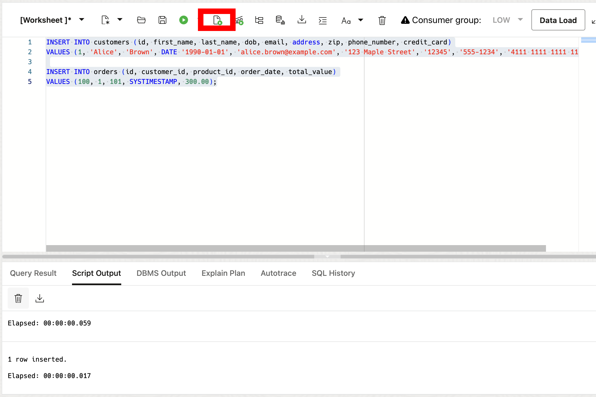

# Exploring JSON Relational Duality with SQL and Rest

## Introduction

Welcome to the "Exploring JSON Relational Duality with SQL and REST" workshop. In this workshop, you will learn about the JSON Relational Duality feature, which allows for the seamless integration between the relational and JSON data models. This feature provides the strengths of both approaches, allowing you to easily manipulate data in either model.

This lab is only intended to give you a small taste of what duality views have to offer.

Estimated Lab Time: 20 minutes

**JSON Duality**

JSON Relational Duality is a landmark capability in Oracle Database 23ai, providing game-changing flexibility and simplicity for Oracle Database developers. This feature overcomes the historical challenges developers have faced when building applications using the relational or document models.

JSON Relational Duality helps to converge the benefits of both document and relational worlds. Developers now get the flexibility and data access benefits of the JSON document model, plus the storage efficiency and power of the relational model. The new feature enabling this functionality is JSON Relational Duality View (we'll refer to it as a Duality View below).

Key benefits of JSON Relational Duality:

* Experience flexibility in building apps using Duality Views. You can access the same data relationally or as hierarchical documents based on your use case, and you're not forced into making compromises because of the limitations of the underlying database. Build document-centric apps on relational data or create SQL apps on documents.

* Experience simplicity by retrieving and storing all the data needed for an app in a single database operation. Duality Views provide fully updatable JSON views over data. Apps can read a document, make necessary changes, and write the document back without worrying about the underlying data structure, mapping, or consistency.

* Enable flexibility and simplicity in building multiple apps on the same set of data. You can use the power of Duality View to define multiple JSON Views across overlapping groups of tables. This flexible data modeling makes building multiple apps against the same data easy and efficient.

* Duality Views eliminate the inherent problem of data duplication and data inconsistency in document databases. Duality Views are fully ACID (atomicity, consistency, isolation, durability) transactions across multiple documents and tables. They eliminate data duplication across documents, whereas consistency is maintained automatically.


### Objectives

This lab aims to provide hands-on experience with JSON-relational duality views, demonstrating how to get the strengths of both JSON and relational data models. You will learn how to create, query, and update JSON-relational duality views using SQL and REST.

### Prerequisites

This lab assumes you have:

* Oracle Database 23ai
* Completed the get started Lab


## Task 1: Getting Started

1. From the Autonomous Database home page, **click** Database action and then **click** SQL.
    

2.  Let's create some tables to use in the lab. Copy and run the following SQL script:
    ```
    <copy>
    DROP TABLE new_orders CASCADE CONSTRAINTS;
    DROP TABLE new_customers CASCADE CONSTRAINTS;

    -- Create a table to store order data
    CREATE TABLE new_orders (
        id NUMBER GENERATED BY DEFAULT ON NULL AS IDENTITY,
        product_id NUMBER,
        order_date TIMESTAMP,
        customer_id NUMBER,
        total_value NUMBER(6,2),
        order_shipped BOOLEAN,
        warranty INTERVAL YEAR TO MONTH
    );

    -- Create a table to store customer data
    CREATE TABLE new_customers (
        id NUMBER GENERATED BY DEFAULT ON NULL AS IDENTITY,
        first_name VARCHAR2(100),
        last_name VARCHAR2(100),
        dob DATE,
        email VARCHAR2(100),
        address VARCHAR2(200),
        zip VARCHAR2(10),
        phone_number VARCHAR2(20),
        credit_card VARCHAR2(20),
        joined_date TIMESTAMP DEFAULT SYSTIMESTAMP,
        gold_customer BOOLEAN DEFAULT FALSE,
        CONSTRAINT new_customers_pk PRIMARY KEY (id)
    );

    -- Add foreign key constraint to new_orders table
    ALTER TABLE new_orders ADD (CONSTRAINT new_orders_pk PRIMARY KEY (id));
    ALTER TABLE new_orders ADD (CONSTRAINT new_orders_fk FOREIGN KEY (customer_id) REFERENCES new_customers (id));
    </copy>
    ```


## Task 2: JSON Relational Duality View

1. Oracle Database 23ai JSON Relational Duality unifies the benefits of the relational and document worlds within a single database. JSON-relational duality views allow you to represent relational data as JSON documents.
    
    Using Duality Views, data is still stored in relational tables in a highly efficient normalized format but is accessed by your apps in the form of JSON documents (or with standard relational, whichever you pick). Developers can think in terms of JSON documents for data access while using the highly efficient relational model for data storage, without having to compromise simplicity or efficiency. In addition to this, Duality Views hide all the complexities of database-level concurrency control from you, providing document-level serializability. 
        
    Duality views can be created in either SQL or GraphQL. We will create the view in GraphQL below, but you could choose to create it in SQL if you prefer.
    
    Create a JSON Relational Duality View on top of the new\_customers and new\_orders tables. Copy the sql below and click **Run Script**

    ```
    <copy>
    CREATE OR REPLACE JSON RELATIONAL DUALITY VIEW customers_dv AS
        new_customers @insert @update @delete
        {
            _id      : id,
            FirstName       : first_name,
            LastName        : last_name,
            DateOfBirth     : dob,
            Email           : email,
            Address         : address,
            Zip             : zip,
            orders : new_orders @insert @update @delete
            [ 
                {
                    OrderID       : id,
                    ProductID     : product_id,
                    OrderDate     : order_date,
                    TotalValue    : total_value,
                    OrderShipped  : order_shipped
                }
            ]
        };
	</copy>
    ```
	

2. Let's insert a new customer with an order using a simple relational insert statement:

	```
	<copy>
    INSERT INTO new_customers (first_name, last_name, dob, email, address, zip, phone_number, credit_card)
    VALUES ('Alice', 'Brown', DATE '1990-01-01', 'alice.brown@example.com', '123 Maple Street', '12345', '555-1234', '4111 1111 1111 1111');

    INSERT INTO new_orders (customer_id, product_id, order_date, total_value)
    VALUES ((SELECT id FROM new_customers WHERE email = 'alice.brown@example.com'), 101, SYSTIMESTAMP, 300.00);
	</copy>
    ```
    

3. Now, we can do the opposite. This time insert data using the JSON Relational Duality view and the json_transform operation. Notice we are inserting data through our duality view here. Click **Run Script**

	```
	<copy>
    UPDATE customers_dv c
    SET c.data = json_transform(
        data,
        APPEND '$.orders' = JSON {'ProductID' : 202, 'OrderDate' : SYSTIMESTAMP, 'TotalValue' : 150.00}
    )
    WHERE c.data.Email = 'alice.brown@example.com';    
    </copy>
    ```
    Here we added another order for the customer Alice Brown.

    

4. Query the JSON Relational Duality view from the customer above using a simple SQL select statement with dot notation:

	```
	<copy>
    SELECT json_serialize(data PRETTY) FROM CUSTOMERS_DV c WHERE c.data.Email = 'alice.brown@example.com';
    </copy>
    ```
    


   To reiterate, populating a duality view automatically updates the data shown in related duality views by updating their underlying tables. For example, inserting documents into the `customers_dv` duality view updated the underlying orders table!

5. Note that the "etag" value supplied in the content is used for "out-of-the-box" optimistic locking to prevent the well-known "lost update" problem that can occur with concurrent operations. During a replace operation, the database checks that the eTag provided in the replacement document matches the latest eTag of the target duality view document.

    If the eTags do not match, which can occur if another concurrent operation updated the same document, an error is thrown. If you get the error, you can reread the updated value (including the updated eTag), and retry the replace operation again, adjusting it (if desired) based on the updated value.

## Task 3: Create JSON Relational Duality Views with REST

1. We can also use Oracle's SODA (Simple Object Data API) or even the Mongo API to work against the Duality View.

    Here let's use the AutoREST functionality that's part of Database Actions.

2. Click on SQL under the Development section. The first thing we want to do is enable REST on our Duality Views. Use the Oracle Database Actions Navigator on the left side of the screen, click the drop-down arrow for the box showing the Table objects, and select Views. Refer to the picture below.

    

3. Right-click on the CUSTOMERS_DV, hover the mouse over REST, and click Enable if it isn't already enabled. See the picture below. NOTE: If it is enabled already, it will say Disable… instead. If you see Disable… you don't have to do anything. Skip to number 5.

    

4. The REST Enable Object side panel will appear. Select Enable to continue.

    

    Alternatively we could have done this in PL/SQL.

5. Click on the hamburger menu in the upper left-hand corner of the Database Actions page and click on REST.

    


6. Then click on AutoREST.

    

7. Now click the three dots on the right of the CUSTOMERS_DV and select OpenAPI View.

    

8. Here, you can see the automatically configured REST calls that were enabled on the view.

    Expand the GET section.

    

9. By default, this section shows sample parameters and responses. However, you can use it to try out the calls themselves.

    Click on Try it out.

    

10. In the q field, enter the following query parameters:

	```
	<copy>
    {"Email": "alice.brown@example.com"}    
    </copy>
    ```

11. Click Execute to run the REST call with the given parameters.

    

12. In the Responses section, you can now see that OpenAPI has built the call for you. You can see the cURL command and the request URL built from the query parameters you provided. Additionally, you can see the response from the server below, displaying information about the customer "Alice".

    

13. Similar to the GET, let's add a customer to our CUSTOMERS_DV Duality View. This time, we will use the POST section.

    Expand the POST section.
    
    


14. Like the GET section, the POST section shows sample parameters and responses. Click on Try it out to test the calls.

    Click on Try it out.
        
    

15. In the request body section, copy and paste the following code, and click Run:

	```
	<copy>
    {
    "_id": 100,
    "FirstName": "Jim",
    "LastName": "Brown",
    "DateOfBirth": "1995-01-01T00:00:00",
    "Email": "jim.brown@example.com",
    "Address": "123 Maple Street",
    "Zip": "12345",
    "orders": [
        {
        "OrderID": 100,
        "ProductID": 10100,
        "OrderDate": "2024-06-27T11:55:20.174683",
        "TotalValue": 300,
        "OrderShipped": null
        },
        {
        "OrderID": 200,
        "ProductID": 20002,
        "OrderDate": "2024-06-27T11:55:50.424141",
        "TotalValue": 150,
        "OrderShipped": null
        }
    ]
    }    
    </copy>
    ```
    

16. After executing the POST request, you will receive a response indicating that the new customer and his orders was successfully added to the CUSTOMERS_DV Duality View.
    
    

17. This lab is only intended to give you a small taste of what duality views have to offer.

    We can clean up from the lab by dropping our tables. Navigate back to the SQL editor or go back to task one, step one if you need a reminder where it is.

    ```
    <copy>
    DROP TABLE new_orders CASCADE CONSTRAINTS;
    DROP TABLE new_customers CASCADE CONSTRAINTS;
    DROP VIEW customers_dv;
    </copy>
    ```

You may now **proceed to the next lab** 

## Learn More

* [JSON Relational Duality: The Revolutionary Convergence of Document, Object, and Relational Models](https://blogs.oracle.com/database/post/json-relational-duality-app-dev)
* [JSON Duality View documentation](https://docs.oracle.com/en/database/oracle/oracle-database/23/jsnvu/overview-json-relational-duality-views.html#)

## Acknowledgements
* **Author** - Killian Lynch, Oracle Database Product Management, Product Manager
* **Contributors** - Dominic Giles, Oracle Database Product Management, Distinguished Product Manager
* **Last Updated By/Date** - Killian Lynch, Oracle Database Product Management, Product Manager, May 2024