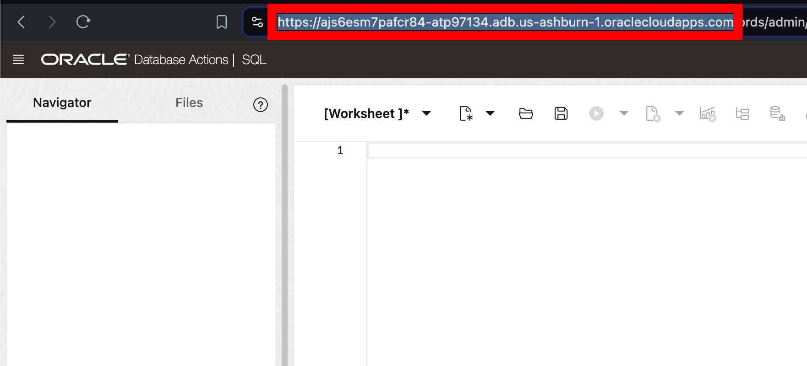

# Exploring JSON Relational Duality with SQL and Rest

## Introduction

Welcome to the "Exploring JSON Relational Duality with SQL and REST" workshop. In this workshop, you will learn about the JSON Relational Duality feature, which allows for the seamless integration between the relational and JSON data models. This feature provides the strengths of both approaches, allowing you to easily manipulate data in either model.

This lab is only intended to give you a small taste of what duality views have to offer.

Estimated Lab Time: 20 minutes

Watch the video below for a walkthrough of the lab.
[Lab walkthrough video](videohub:1_ws0k6cn3)


**JSON Duality**

JSON Relational Duality is a landmark capability in Oracle Database 23ai, providing game-changing flexibility and simplicity for Oracle Database developers. This feature overcomes the historical challenges developers have faced when building applications using the relational or document models.

JSON Relational Duality helps to converge the benefits of both document and relational worlds. Developers now get the flexibility and data access benefits of the JSON document model, plus the storage efficiency and power of the relational model. The new feature enabling this functionality is JSON Relational Duality View (we'll refer to it as a Duality View below).

Key benefits of JSON Relational Duality:

* Experience flexibility in building apps using Duality Views. You can access the same data relationally or as hierarchical documents based on your use case, and you're not forced into making compromises because of the limitations of the underlying database. Build document-centric apps on relational data or create SQL apps on documents.

* Experience simplicity by retrieving and storing all the data needed for an app in a single database operation. Duality Views provide fully updatable JSON views over data. Apps can read a document, make necessary changes, and write the document back without worrying about the underlying data structure, mapping, or consistency.

* Enable flexibility and simplicity in building multiple apps on the same set of data. You can use the power of Duality View to define multiple JSON Views across overlapping groups of tables. This flexible data modeling makes building multiple apps against the same data easy and efficient.

* Duality Views eliminate the inherent problem of data duplication and data inconsistency in document databases. Duality Views are fully ACID (atomicity, consistency, isolation, durability) transactions across multiple documents and tables. They eliminate data duplication across documents, whereas consistency is maintained automatically.


### Objectives

This lab aims to provide hands-on experience with JSON-relational Duality Views, demonstrating how to get the strengths of both JSON and relational data models. You will learn how to create, query, and update JSON-relational Duality Views using SQL and REST.

### Prerequisites

This lab assumes you have:

* Oracle Database 23ai
* Completed the get started Lab


## Task 1: JSON Relational Duality View

1. We'll use both the customers table and the ratings table from the last lab. Let's add some additional information.

    ```
    <copy>
    ALTER TABLE customers
    ADD dob DATE
        ANNOTATIONS (description 'Date of birth of the customer');

    ALTER TABLE customers
    ADD address VARCHAR2(200)
        ANNOTATIONS (description 'Address of the customer');

    ALTER TABLE customers
    ADD zip VARCHAR2(10)
        ANNOTATIONS (description 'ZIP code of the customer');

    ALTER TABLE customers
    ADD phone_number VARCHAR2(20)
        ANNOTATIONS (description 'Phone number of the customer');

    ALTER TABLE customers
    ADD credit_card VARCHAR2(20)
        ANNOTATIONS (description 'Credit card number of the customer');

        ALTER TABLE ratings
    ADD content_policy VARCHAR2(20)
        ANNOTATIONS (description 'the version of the content policy at the time of the rating');

    </copy>
    ```
  
2. In addition to the list of JSON Relational Duality Views benefits from above, Duality Views also have a security benefit. 

    First, the documents you create (the Duality Views), **are not directly tied to the storage of the data**. 

    What does that mean? 

    Using Duality Views, you can define how the data is accessed and used. Duality Views allow you to specify @insert, @update, and @delete privileges, meaning you define exactly how the applications and/or the developers work with data. 

    Here, let's create a Duality View on the customers table. We'll use this Duality View to manage our customer information.

    ```
    <copy>
    CREATE OR REPLACE JSON RELATIONAL DUALITY VIEW customers_dv AS
    customers @insert @update @delete
    {
        _id      : customer_id,
        FirstName       : first_name
        LastName        : last_name
        Email           : email
        SignUpDate      : signup_date
        HasSubscription : has_sub
        DateOfBirth     : dob
        Address         : address
        Zip             : zip
        PhoneNumber     : phone_number
        CreditCard      : credit_card
    };
	</copy>
    ```

3. The second security benefit comes from the fact we can **HIDE** data. We can create these views however we like. 

    For example, say we want to exclude sensitive personally identifiable information like customers credit card or phone numbers. 
    
    Let's create a view without those identifiers. 

    ```
    <copy>
    CREATE OR REPLACE JSON RELATIONAL DUALITY VIEW customer_rating_dv AS
        customers
        {
            _id      : customer_id,
            FirstName       : first_name,
            LastName        : last_name,
            Address         : address,
            Zip             : zip,
            ratings : ratings @insert @update @delete
            [ 
                {
                    RatingID      : rating_id,
                    MovieId       : movie_id,
                    Rating        : rating,
                    RatingDate    : rating_date,
                    ContentPolicy : content_policy
                }
            ]
        };
	</copy>
    ```

    If you notice, this view doesn’t specify @insert, @update, or @delete on our customers table. You created this view so that you can only update ratings through the `customer_rating_dv` Duality View, and no sensitive customer information (such as customers’ credit card numbers or phone numbers) will be shown. The only way to manage that information is through the `customers_dv` view.


4. Now that the duality view has been created, we can insert data to the relational table or into the duality view. Let's start with adding data directly to the relational tables.


	```
	<copy>
    INSERT INTO customers (customer_id, first_name, last_name, email, signup_date, has_sub, dob, address, zip, phone_number, credit_card)
    VALUES
    (6, 'David', 'Wilson', 'david.wilson@example.com', SYSDATE, TRUE, TO_DATE('1985-08-15', 'YYYY-MM-DD'), '123 Elm Street', '90210', '555-1234', '4111111111111111');

    INSERT INTO ratings (rating_id, customer_id, movie_id, rating, rating_date, content_policy)
    VALUES
    (6, 6, 1, 5, SYSDATE, 'V.1');

	</copy>
    ```

5. Let's now insert data into the duality view of our customer data.

	```
	<copy>
    INSERT INTO customers_dv values ('{"_id": 7, "FirstName": "Jim", "LastName":"Brown", "Email": "jim.brown@example.com", "Address": "456 Maple Street", "Zip": 12345}');

    commit;
	</copy>
    ```

5. This Duality View will show us the customers.

	```
	<copy>
    select json_serialize(data PRETTY) from customers_dv;
	</copy>
    ```
    This Duality View will show us the same customers - some with ratings, some without

	```
	<copy>
    select json_serialize(data PRETTY) from customer_rating_dv;
	</copy>
    ```
 
    We can see the same in relational.

	```
	<copy>
    select * from customers;
    select * from ratings;
	</copy>
    ```

7. Now, when we created the `customer_rating_dv` Duality View, we specified @insert, @update, @delete operations were allowed for our ratings. Let's update a rating through our Duality View.


	```
	<copy>
    UPDATE customer_rating_dv c
    SET c.data = json_transform(
        data,
        APPEND '$.ratings' = JSON {'RatingID':123, 'MovieId' : 2, 'Rating' : 4, 'RatingDate' : SYSTIMESTAMP, 'ContentPolicy' : 'V.1'}
    )
    WHERE c.data."_id" =7;
    commit;

    select json_serialize(data PRETTY) from customer_rating_dv r where r.data."_id" = 7;
    </copy>
    ```


 8. We talked about the security benefit of the Duality Views earlier. We didn't allow for updates to our customers through the `customer_rating_dv` Duality View (or allow for sensitive customer information in the document). 
 
    Let's take a look at how an update will fail if we try and update customer information through the `customer_rating_dv` document. 

    Try and change the name of Jim's last name from Brown to Browne.

	```
	<copy>
    UPDATE customer_rating_dv c
    SET c.data = json_transform(
        data,
        SET '$.LastName' = 'Browne'
    )
    WHERE c.data."_id" =7;

    </copy>
    ```

9. Another benefit of the Duality Views is that since the data is stored as tables, updating any embedded documents is easy since you only need to update the table. All the documents will automatically reflect the changes. This would be much harder to achieve with pure JSON. 


    We can insert some ratings into our Jim Brown customer using `mergepath`.


	```
	<copy>
    update customer_rating_dv r set data = json_mergepatch(data,'{"ratings" : 
    [
        {
        "RatingID": 124,
        "MovieId": 10,
        "Rating": 4,
        "RatingDate": "2024-06-27T11:55:20.174683",
        "ContentPolicy" : "V.2"
        },
        {
        "RatingID": 125,
        "MovieId": 6,
        "Rating": 3,
        "RatingDate": "2024-06-27T11:57:20.174683",
        "ContentPolicy" : "V.2"
        }
    ]}')
    where r.data."_id" = 7;
    </copy>
    ```
    
    Let's see the customers ratings now. 

    ```
    <copy>
    select * from ratings where customer_id = 7;
    </copy>
    ```

10. Let's imagine we've been tasked with updating the content policy for our ratings. Let's say all ratings with policy of V.1, need to be updated to the current rating policy of V.2.
	```
	<copy>
    select json_serialize(data PRETTY) from customer_rating_dv
    </copy>
    ```


11. If we were to do this in JSON, we would need to check every document for a rating that had the policy version 1. With JSON Duality Views, we can easily update the ratings table and this will update all documents with nested ratings that have a policy of V.1.

	```
	<copy>
    UPDATE ratings
    SET content_policy = 'V.2'
    WHERE content_policy = 'V.1';
    </copy>
    ```

9. This one change updates every document where a nested rating has `content_policy = V.1`.

    We can take a look at all the customer ratings through the Duality View.

	```
	<copy>
    SELECT json_serialize(data PRETTY) FROM customer_rating_dv;
    </copy>
    ```

10. Note that the "etag" value supplied in the content is used for "out-of-the-box" optimistic locking to prevent the well-known "lost update" problem that can occur with concurrent operations. During a replace operation, the database checks that the eTag provided in the replacement document matches the latest eTag of the target Duality View document.

    If the eTags do not match, which can occur if another concurrent operation updated the same document, an error is thrown. If you get the error, you can reread the updated value (including the updated eTag), and retry the replace operation again, adjusting it (if desired) based on the updated value.


## Task 2: (Optional) JSON Relational Duality Views with REST

1. We can also use Oracle's SODA (Simple Object Data API) or even the Mongo API to work against the Duality View.

    As small example, I will show this using a macOS native terminal and execute a basic GET request.

2. Click on SQL under the Development section. The first thing we want to do is enable REST on our Duality Views. Use the Oracle Database Actions Navigator on the left side of the screen, click the drop-down arrow for the box showing the Table objects, and select Views. Refer to the picture below.

    

3. Right-click on the CUSTOMERS_DV, hover the mouse over REST, and click Enable if it isn't already enabled. See the picture below. NOTE: If it is enabled already, it will say Disable… instead. If you see Disable… you don't have to do anything. Skip to number 5.

    

4. The REST Enable Object side panel will appear. Select Enable to continue.

    

    Alternatively we could have done this in PL/SQL.

5. Here we will use the SQL Developer Web URL to obtain your ADB instance base URL:

	```
    ADB_LL_URL = https://xxxxxxxxxx.adb.<region>.oraclecloudapps.com
    ```

    

    For example,  mine looks like this: 

    ```
    ADB_LL_URL=https://ajs6esm7pafcr84-atp97134.adb.us-ashburn-1.oraclecloudapps.com
    ```

6. Now, create a variable in your terminal (It shouldn't have / at the end.)

	```
	<copy>
    export ADB_LL_URL=https://ajs6esm7pafcr84-atp97134.adb.us-ashburn-1.oraclecloudapps.com
    </copy>
    ```

7. Check it was set.

	```
	<copy>
    echo $ADB_LL_URL
    </copy>
    ```
    > NOTE: This base url will be unique for each user, verify that you are using the correct URL.

8. Make a GET request from your laptop terminal command line.

	```
	<copy>
    curl -X GET $ADB_LL_URL/ords/db23ai/customers_dv/ | json_pp

    </copy>
    ```
    


9. This lab is only intended to give you a small taste of what Duality Views have to offer. In summary, this lab checks out the power of JSON Relational Duality Views, allowing you to work with data in either JSON Document format or SQL Relational format. Changes made through views are reflected in the corresponding documents and tables. This flexibility enables convenient create, read, update, or delete operations across multiple documents and tables with ease and allows you to define how the data is accessed and used.

    [23ai JSON Duality View Workshops](https://livelabs.oracle.com/pls/apex/f?p=133:100:110578183178299::::SEARCH:duality%20views)


You may now **proceed to the next lab** 

## Learn More

* [JSON Relational Duality: The Revolutionary Convergence of Document, Object, and Relational Models](https://blogs.oracle.com/database/post/json-relational-duality-app-dev)
* [JSON Duality View documentation](https://docs.oracle.com/en/database/oracle/oracle-database/23/jsnvu/overview-json-relational-duality-views.html#)
* [23ai JSON Duality View Workshops](https://livelabs.oracle.com/pls/apex/f?p=133:100:110578183178299::::SEARCH:duality%20views)


## Acknowledgements
* **Author** - Killian Lynch, Oracle Database Product Management, Product Manager
* **Contributors** - Dominic Giles, Oracle Database Product Management, Distinguished Product Manager
* **Last Updated By/Date** - Killian Lynch, Oracle Database Product Management, Product Manager, August 2024
