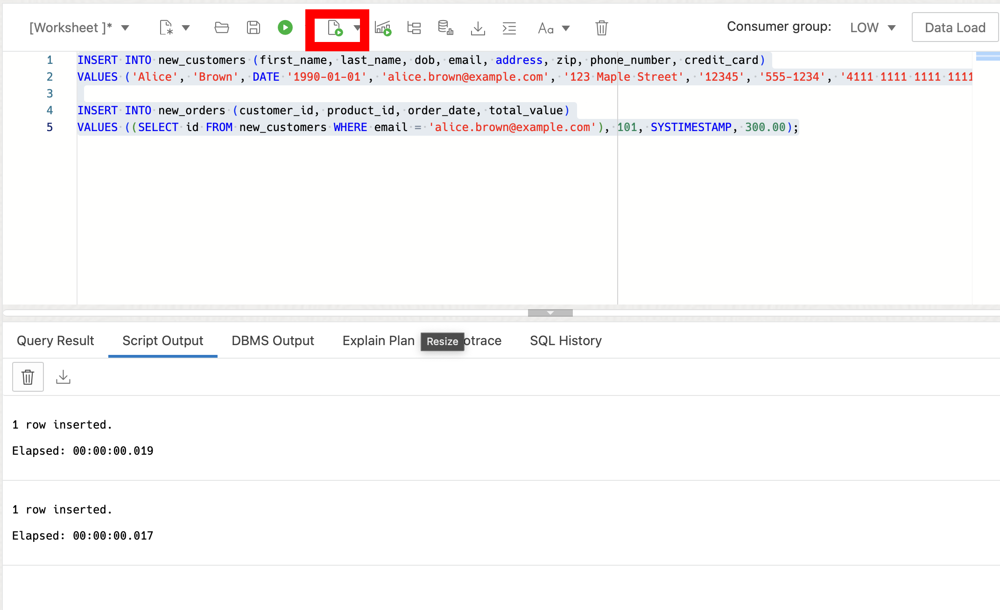
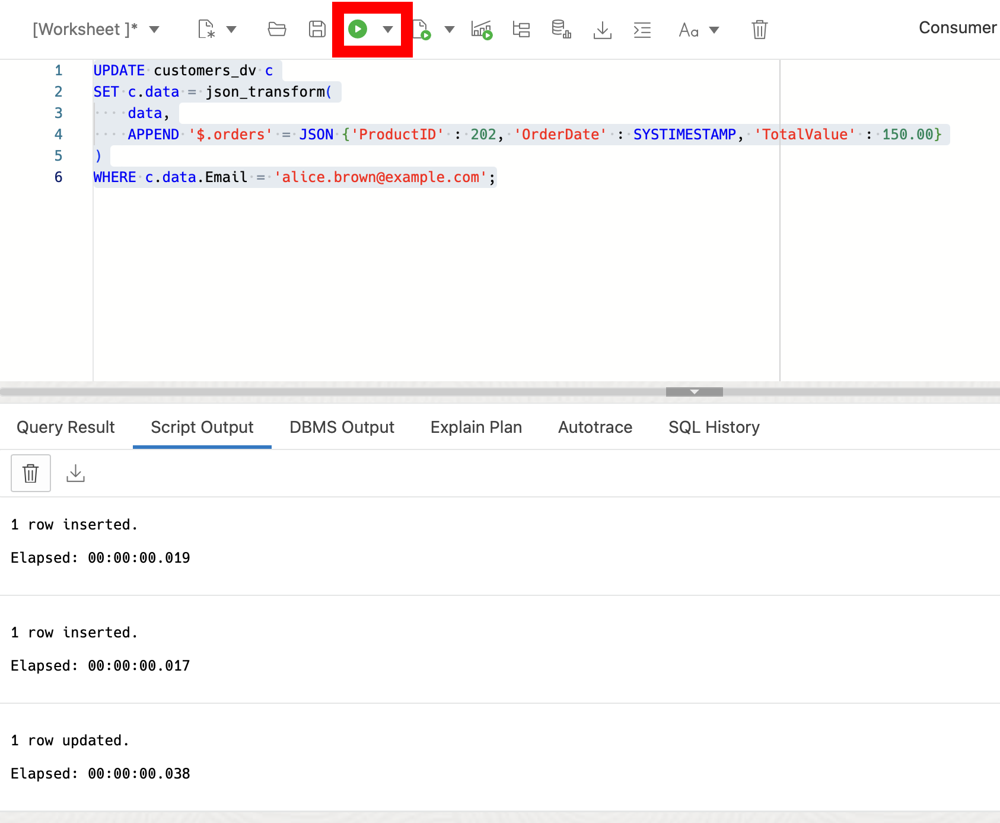
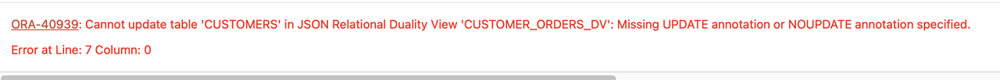

# Exploring JSON Relational Duality with SQL

## Introduction

Welcome to the "Exploring JSON Relational Duality with SQL" lab. In this lab, you will learn about the JSON Relational Duality feature, which allows for the seamless integration between the relational and JSON data models. This feature provides the strengths of both approaches, allowing you to easily manipulate data in either model.

This lab is only intended to give you a small taste of what Duality Views have to offer. For full, in-depth free workshops, follow this [link](https://livelabs.oracle.com/pls/apex/f?p=133:100:110578183178299::::SEARCH:duality%20views). 


### **About JSON Relational Duality**

JSON Relational Duality is a landmark capability in Oracle Database 23ai providing game-changing flexibility and simplicity for Oracle Database developers. This breakthrough innovation overcomes the historical challenges developers have faced when building applications, using relational or document models.

“JSON Relational Duality in Oracle Database 23ai brings substantial simplicity and flexibility to modern app dev,” said Carl Olofson, research Vice President, Data Management Software, IDC. “It addresses the age-old object - relational mismatch problem, offering an option for developers to pick the best storage and access formats needed for each use case without having to worry about data structure, data mapping, data consistency, or performance tuning. No other specialized document databases offer such a revolutionary solution.”

JSON Relational Duality helps to converge the benefits of both document and relational worlds. Developers now get the flexibility and data access benefits of the JSON document model, plus the storage efficiency and power of the relational model. The new feature enabling this convergence is JSON Relational Duality View (Will be referred below as Duality View).

Key benefits of JSON Relational Duality:
- Experience extreme flexibility in building apps using Duality View. Developers can access the same data relationally or as hierarchical documents based on their use case and are not forced into making compromises because of the limitations of the underlying database. Build document-centric apps on relational data or create SQL apps on documents.
- Experience simplicity by retrieving and storing all the data needed for an app in a single database operation. Duality Views provide fully updateable JSON views over data. Apps can read a document, make necessary changes, and write the document back without worrying about underlying data structure, mapping, consistency, or performance tuning. 
- Enable flexibility and simplicity in building multiple apps on same data. Developers can use the power of Duality View to define multiple JSON Views across overlapping groups of tables. This flexible data modeling makes building multiple apps against the same data easy and efficient.
- Duality Views eliminate the inherent problem of data duplication and data inconsistency in document databases. Duality Views are fully ACID (atomicity, consistency, isolation, durability) transactions across multiple documents and tables. It eliminates data duplication across documents data, whereas consistency is maintained automatically. 
- Build apps that support high concurrency access and updates. Traditional locks don’t work well for modern apps. A new lock-free concurrency control provided with Duality View supports high concurrency updates. The new-lock free concurrency control also works efficiently for interactive applications since the data is not locked during human thinking time.

**_Estimated Lab Time: 15 minutes_**

### **Objectives**

This lab aims to provide hands-on experience with JSON-relational Duality Views, demonstrating how to get the strengths of both JSON and relational data models. You will learn how to create, query, and update JSON-relational Duality Views using SQL.

### **Prerequisites**

This lab assumes you have:

* Oracle Database 23ai
* Completed the Get Started Lab

## Task 1: Create Relational Tables

1. Create the 'customers' and 'orders' relational tables. The following code block creates two tables for customer and order data. Copy and run the following SQL script:
    ```
    <copy>
    DROP TABLE if exists orders CASCADE CONSTRAINTS;
    DROP TABLE if exists customers CASCADE CONSTRAINTS;

    -- Create a table to store order data
    CREATE TABLE if not exists orders (
        id NUMBER,
        product_id NUMBER,
        order_date TIMESTAMP,
        customer_id NUMBER,
        total_value NUMBER(6,2),
        order_shipped BOOLEAN,
        warranty INTERVAL YEAR TO MONTH
    );

    -- Create a table to store customer data
    CREATE TABLE if not exists customers (
        id NUMBER,
        first_name VARCHAR2(100),
        last_name VARCHAR2(100),
        dob DATE,
        email VARCHAR2(100),
        address VARCHAR2(200),
        zip VARCHAR2(10),
        phone_number VARCHAR2(20),
        credit_card VARCHAR2(20),
        joined_date TIMESTAMP DEFAULT SYSTIMESTAMP,
        gold_customer BOOLEAN DEFAULT FALSE,
        CONSTRAINT new_customers_pk PRIMARY KEY (id)
    );

    -- Add foreign key constraint to new_orders table
    ALTER TABLE orders ADD (CONSTRAINT orders_pk PRIMARY KEY (id));
    ALTER TABLE orders ADD (CONSTRAINT orders_fk FOREIGN KEY (customer_id) REFERENCES customers (id));
    </copy>
    ```

## Task 2: Create JSON Relational Duality Views

1. Create a duality view of the customers table. We'll use this one to manage our customer information.

    Using Duality Views, you can define how the data is accessed and used. Duality Views allow you to specify @insert, @update, and @delete privileges, meaning you define exactly how the applications and/or the developers work with data. 

    ```
    <copy>
    CREATE OR REPLACE JSON RELATIONAL DUALITY VIEW customers_dv AS
    customers @insert @update @delete
    {
        _id      : id,
        FirstName       : first_name,
        LastName        : last_name,
        DateOfBirth     : dob,
        Email           : email,
        Address         : address,
        Zip             : zip
        phoneNumber     : phone_number
        creditCard      : credit_card
        joinedDate      : joined_date 
        goldStatus      : gold_customer
    }
;
	</copy>
    ```

2. Say we want to exclude sensitive personally identifiable information like customers credit card or phone numbers. Let's create another view without those identifiers. 

    ```
    <copy>
    CREATE OR REPLACE JSON RELATIONAL DUALITY VIEW customer_orders_dv AS
        customers
        {
            _id      : id,
            FirstName       : first_name,
            LastName        : last_name,
            Address         : address,
            Zip             : zip,
            orders : orders @insert @update @delete
            [ 
                {
                    OrderID       : id,
                    ProductID     : product_id,
                    OrderDate     : order_date,
                    TotalValue    : total_value,
                    OrderShipped  : order_shipped
                }
            ]
        };
	</copy>
    ```

    If you notice, this view doesn’t specify @insert, @update, or @delete on our customers table. You created this view so that you can only update orders through the `customer_orders_dv` Duality View, and no sensitive customer information (such as customers’ credit card numbers or phone numbers) will be shown. The only way to manage that information is through the `customers_dv` view.

	

## Task 3: Add Data

1. Now that the duality view has been created, we can insert data to the relational table or into the duality view. Let's start with adding data directly to the relational tables.


	```
	<copy>
    INSERT INTO customers (id, first_name, last_name, dob, email, address, zip, phone_number, credit_card)
    VALUES (1, 'Alice', 'Brown', DATE '1990-01-01', 'alice.brown@example.com', '123 Maple Street', '12345', '555-1234', '4111 1111 1111 1111');


    INSERT INTO orders (id, customer_id, product_id, order_date, total_value)
    VALUES (100, 1, 101, SYSTIMESTAMP, 300.00);

	</copy>
    ```
    

2. Let's now insert data into the duality view of our customer data.

	```
	<copy>
    INSERT INTO customers_DV values ('{"_id": 2, "FirstName": "Jim", "LastName":"Brown", "Email": "jim.brown@example.com", "Address": "456 Maple Street", "Zip": 12345}');

    commit;
	</copy>
    ```

3. Let's see how the duality views have changed.

    This Duality View will show us two customers.

	```
	<copy>
    SELECT json_serialize(data PRETTY) FROM customers_dv;
	</copy>
    ```
    This Duality View will show us the same two customers - one with an order and one without.

	```
	<copy>
    SELECT json_serialize(data PRETTY) FROM customer_orders_dv;
	</copy>
    ```
4. Let's see how the relational tables have changed.

	```
	<copy>
    select * from customers;
	</copy>
    ```

## Task 4: Update Data

1. Remember, the `customer_orders_dv` duality view only allows us to modify the order data. Let's update Alice's orders.


	```
	<copy>
    UPDATE customer_orders_dv c
    SET c.data = json_transform(
        data,
        APPEND '$.orders' = JSON {'OrderID':123, 'ProductID' : 202, 'OrderDate' : SYSTIMESTAMP, 'TotalValue' : 150.00}
    )
    WHERE c.data."_id" =1;
    commit;

    select json_serialize(data PRETTY) from customer_orders_dv o where o.data."_id" = 1;
    </copy>
    ```


    

2. Let's now try and update Alice's last name. You'll see that this is not allowed!

	```
	<copy>
    UPDATE customer_orders_dv c
    SET c.data = json_transform(
        data,
        SET '$.LastName' = 'Browne'
    )
    WHERE c.data."_id" =1;

    </copy>
    ```
    

3. Let's insert some orders for our customer Jim Brown using `mergepatch`.

	```
	<copy>
    update customer_orders_dv o set data = json_mergepatch(data,'{"orders" : 
    [
        {
        "OrderID": 100,
        "ProductID": 10100,
        "OrderDate": "2024-06-27T11:55:20.174683",
        "TotalValue": 300,
        "OrderShipped": null
        },
        {
        "OrderID": 200,
        "ProductID": 20002,
        "OrderDate": "2024-06-27T11:55:50.424141",
        "TotalValue": 150,
        "OrderShipped": null
        }
    ]}')
    where o.data."_id" = 2;

    commit;
    </copy>
    ```

4. Imagine we needed to change one of the Product IDs, for example product_id = 202 shown below. 

    ```
    <copy>
    SELECT json_serialize(data PRETTY) FROM customer_orders_dv;
    </copy>
    ```

5. Using a single update statement, we can easily update product_id 202 to 999 in every JSON duality view.

	```
	<copy>
    UPDATE orders
    SET product_id = 999
    WHERE product_id = 202;
    
    commit;

    SELECT json_serialize(data PRETTY) FROM customer_orders_dv;
    </copy>
    ```

    You can now see that the update made to the orders table has propogated to the customer orders duality view, and the same occurs for all other representations of the customers table!

Note that the "etag" value supplied in the content is used for "out-of-the-box" optimistic locking to prevent the well-known "lost update" problem that can occur with concurrent operations. During a replace operation, the database checks that the eTag provided in the replacement document matches the latest eTag of the target Duality View document.

If the eTags do not match, which can occur if another concurrent operation updated the same document, an error is thrown. If you get the error, you can reread the updated value (including the updated eTag), and retry the replace operation again, adjusting it (if desired) based on the updated value.


## Task 5: (Optional) JSON Relational Duality Views with REST 

1. We can also use Oracle's SODA (Simple Object Data API) or even the Mongo API to work against the Duality View.

    For a small example, I will show this using a macOS native terminal and execute a basic GET request.

2. Click on SQL under the Development section. The first thing we want to do is enable REST on our Duality Views. Use the Oracle Database Actions Navigator on the left side of the screen, click the drop-down arrow for the box showing the Table objects, and select Views. Refer to the picture below.

    

3. Right-click on the CUSTOMERS_DV, hover the mouse over REST, and click Enable if it isn't already enabled. See the picture below. NOTE: If it is enabled already, it will say Disable… instead. If you see Disable… you don't have to do anything. Skip to number 5.

    

4. The REST Enable Object side panel will appear. Select Enable to continue.

    

    Alternatively we could have done this in PL/SQL.

5. Here we will use the SQL Developer Web URL to obtain your ADB instance base URL:

	```
    ADB_LL_URL = https://xxxxxxxxxx.adb.<region>.oraclecloudapps.com
    ```

    

    For example,  mine looks like this: 

    ```
    ADB_LL_URL=https://ajs6esm7pafcr84-atp97134.adb.us-ashburn-1.oraclecloudapps.com
    ```

6. Now, create a variable in your terminal (It shouldn't have / at the end.)

	```
	<copy>
    export ADB_LL_URL=https://ajs6esm7pafcr84-atp97134.adb.us-ashburn-1.oraclecloudapps.com
    </copy>
    ```

7. Check it was set.

	```
	<copy>
    echo $ADB_LL_URL
    </copy>
    ```
    > NOTE: This base url will be unique for each user, verify that you are using the correct URL.

8. Make a GET request from your laptop terminal command line.

	```
	<copy>
    curl -X GET $ADB_LL_URL/ords/admin/customers_dv/ | json_pp

    </copy>
    ```
    


9. This lab is only intended to give you a small taste of what Duality Views have to offer. For full, in-depth free workshops, follow the link below:

    [23ai JSON Duality View Workshops](https://livelabs.oracle.com/pls/apex/f?p=133:100:110578183178299::::SEARCH:duality%20views)

    In summary, this lab checks out the power of JSON Relational Duality Views, allowing you to work with data in either JSON Document format or SQL Relational format. Changes made through views are reflected in the corresponding documents and tables. This flexibility enables convenient create, read, update, or delete operations across multiple documents and tables with ease.

10. We can clean up from the lab by dropping our tables. Navigate back to the SQL editor or go back to task one - step one if you need a reminder where it is.

    ```
    <copy>
    DROP TABLE orders CASCADE CONSTRAINTS;
    DROP TABLE customers CASCADE CONSTRAINTS;
    DROP VIEW customer_orders_dv;
    DROP VIEW customers_dv;

    </copy>
    ```

**You've completed the workshop!**

## Learn More

* [JSON Relational Duality: The Revolutionary Convergence of Document, Object, and Relational Models](https://blogs.oracle.com/database/post/json-relational-duality-app-dev)
* [JSON Duality View documentation](https://docs.oracle.com/en/database/oracle/oracle-database/23/jsnvu/overview-json-relational-duality-views.html#)

## Acknowledgements
* **Author** - Killian Lynch, Oracle Database Product Management, Product Manager
* **Contributors** - Dominic Giles, Oracle Database Product Management, Distinguished Product Manager
* **Last Updated By/Date** - Brianna Ambler, Oracle Database Product Management, Product Manager, September 2024
