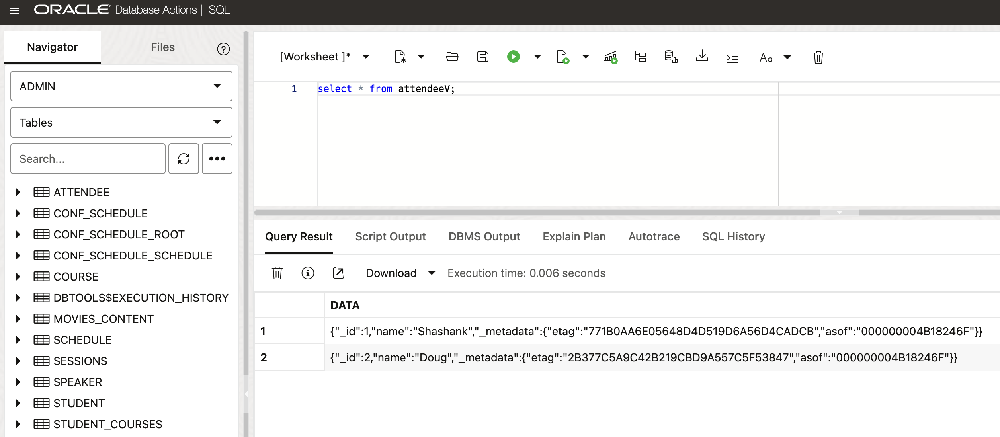
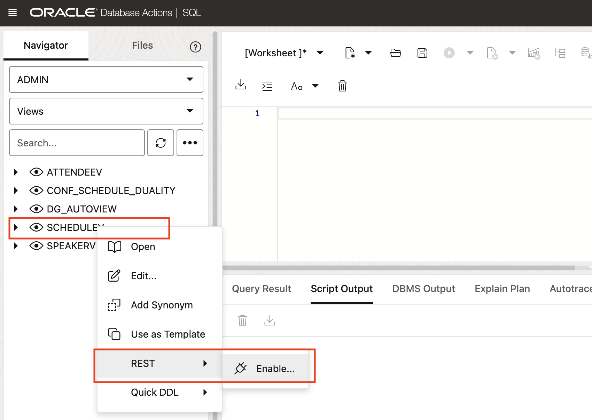

# Exploring JSON Relational Duality Views - the Fundamentals

## Introduction

 In this workshop, you will learn about the JSON Relational Duality feature, which allows for the seamless integration between the relational and JSON data models. This feature provides the strengths of both approaches, allowing you to easily manipulate data in either model.

This lab is only intended to give you a small taste of what Duality Views have to offer. For full, in-depth free workshops, follow the link below:

[23ai JSON Duality View Workshops](https://livelabs.oracle.com/pls/apex/f?p=133:100:110578183178299::::SEARCH:duality%20views)

Estimated Lab Time: 20 minutes

**JSON Duality**

JSON Relational Duality is a landmark capability in Oracle Database 23ai, providing game-changing flexibility and simplicity for Oracle Database developers. This feature overcomes the historical challenges developers have faced when building applications using the relational or document models.

JSON Relational Duality helps to converge the benefits of both document and relational worlds. Developers now get the flexibility and data access benefits of the JSON document model, plus the storage efficiency and power of the relational model. The new feature enabling this functionality is JSON Relational Duality View (we'll refer to it as a Duality View below).

Key benefits of JSON Relational Duality:

* Experience flexibility in building apps using Duality Views. You can access the same data relationally or as hierarchical documents based on your use case, and you're not forced into making compromises because of the limitations of the underlying database. Build document-centric apps on relational data or create SQL apps on documents.

* Experience simplicity by retrieving and storing all the data needed for an app in a single database operation. Duality Views provide fully updatable JSON views over data. Apps can read a document, make necessary changes, and write the document back without worrying about the underlying data structure, mapping, or consistency.

* Enable flexibility and simplicity in building multiple apps on the same set of data. You can use the power of Duality View to define multiple JSON Views across overlapping groups of tables. This flexible data modeling makes building multiple apps against the same data easy and efficient.

* Duality Views eliminate the inherent problem of data duplication and data inconsistency in document databases. Duality Views are fully ACID (atomicity, consistency, isolation, durability) transactions across multiple documents and tables. They eliminate data duplication across documents, whereas consistency is maintained automatically.


### Objectives

This lab aims to provide hands-on experience with JSON-relational Duality Views, demonstrating how to get the strengths of both JSON and relational data models. You will learn how to create, query, and update JSON-relational Duality Views using SQL and REST.

### Prerequisites

This lab assumes you have:

* Oracle Database 23ai


## Task 1: Install a relational schema with sample data

1. If you haven't done so already, from the Autonomous Database home page, **click** Database action and then **click** SQL.
    

    Using the ADMIN user isn’t typically advised due to the high level of access and security concerns it poses. **However**, for this demo, we’ll use it to simplify the setup and ensure we can show the full range of features effectively. 

2. Before we begin, this lab will be using Database Actions Web. If you're unfamiliar, please see the picture below for a simple explanation of the tool. You can click on the photo to enlarge it.

    

2.  Let's create some tables to use in the lab. Paste the following into the SQL Worksheet and click the **Run as Script Button** (shown in the picture below). 
    ```
    <copy>
    create table attendee(
    aid      number,
    aname    varchar2(128),
    extras   JSON (object),
    constraint attendee primary key (aid)
    );

    create table speaker(
    sid    number,
    name   varchar2(128),
    email  varchar2(64),
    rating number,
    constraint pk_speaker primary key (sid)
    );

    create table sessions(
    sid number,
    name varchar2(128),
    room varchar2(128),
    speakerId number,
    constraint pk_session primary key (sid),
    constraint fk_session foreign key (speakerId) references speaker(sid)
    );

    create table schedule (
    schedule_id number,
    session_id  number,
    attendee_id number,
    constraint pk_schedule primary key (schedule_id),
    constraint fk_schedule_attendee foreign key (attendee_id) references attendee(aid),
    constraint fk_schedule_session foreign key (session_id) references sessions(sid)
    );
    </copy>
    ```
    

    This looks like a lot of code. But it's just a very simple system to manage attendees, speakers, and their schedule for a conference. Here is the data model.

    

    The relational model ensures data consistency (data types, relationships between entities, etc.) but it comes with the price of establishing a data model. This approach runs the world today, and is proven and mature.

2.  Let's insert some data into our conference schedule management system. Don't worry about the details, a simple copy-n-paste and letting it run does the trick at this point in time.
    ```
    <copy>
    -- insert data
    insert into attendee(aid, aname) values(1, 'Shashank');
    insert into attendee(aid, aname) values(2, 'Doug');

    insert into speaker values(1, 'Bodo', 'beda@university.edu', 7);
    insert into speaker values(2, 'Tirthankar','mr.t@univerity.edu', 10);

    insert into sessions values (1, 'JSON and SQL', 'Room 1', 1);
    insert into sessions values (2, 'PL/SQL or Javascript', 'Room 2', 1);
    insert into sessions values (3, 'Oracle on IPhone', 'Room 1', 2);

    insert into schedule values (1,1,1);
    insert into schedule values (2,2,1);
    insert into schedule values (3,2,2);
    insert into schedule values (4,3,1);
    commit;
    </copy>
    ```
    

We are ready to venture into Duality Views now ...


## Task 2: Create your JSON Relational Duality View

1. Duality Views on top of single tables.
    After we have seen the relational world, let's switch to Duality Views (DVs). Using Duality Views, data is still stored in relational tables in a highly efficient normalized format but is accessed by apps in the form of JSON documents.The documents you create (the Duality Views), **are not directly tied to the storage of the data**. 

    What does that mean? 

    Using Duality Views, you can define how the data is accessed and used. Duality Views allow you to specify **@insert, @update, and @delete privileges**, meaning you define exactly how the applications and/or the developers work with data. 

    Let's create a couple of Duality Views for our conference schedule system. We are starting with the most simple form, a JSON document representation of a single relational table. We do this for the **attendees** and the **speakers**.

    ```
    <copy>
    create or replace JSON Duality view attendeeV as 
    attendee @update @insert @delete{
    _id   : aid,
    name  : aname,
    extras @flex 
    };


    create or replace JSON Duality view speakerV as 
    speaker  @update @insert @delete {
    _id       : sid,
    name      : name,
    rating    : rating @noupdate
    };
	</copy>
    ```
    


    As you can see, these DVs are a 1:1 representation of your relational tables. Using these DVs, you can see all the data represented in the relational tables, but we introduced the first set of flexibility and benefits of DVs. Those are namely
    - **Full schema flexibility**: The Duality View attendeesV as a so-called flex field extras, the catch-all for any yet unknown attribute.
    - **Partial data visibility**: You do not have to expose all the information in the underlying tables. In this case we do not expose the email information in the speaker DV.
    - **Fine-grained attribute (data) control**: The Duality View speakerV does not allow the update of the rating of a speaker, identified through the explicit @noupdate clause on the attribute level.

2. Duality Views on multiple tables.
    Application objects are commonly more complex than simple relational tables, meaning those are spawning multiple tables when being used within an application. Let's now do exactly that for the document (Duality View) representation of the schedules. 
    
    A **schedule** object comprises of:
    - the **attendee** information
    - the **schedule** for an individual attendee
    - the schedule represents one and more **sessions** an attendee is planning to go to
    - the detail information about a session, incl. the **speaker** information

    ```
    <copy>
    create or replace JSON Duality view ScheduleV AS
    attendee 
    {
    _id      : aid
    name       : aname
    schedule   : schedule  @insert @update @delete
    {
        scheduleId : schedule_id
        sessions @unnest
        {
        sessionId : sid
        name      : name
        location  : room
        speaker @unnest
        {
            speakerId : sid
            speaker   : name
        }
        } 
    }
    } ;
	</copy>
    ```
   

## Task 3: Work with your JSON Relational Duality Views

1. With the relational tables and DVs in place, let's use **JSON and relational interchangeably** for a single table DV.

    First, look at the attendee information. Using Database Actions or your SQL tool of choice, issue the following statements to see the information both in relational and document form. 
    ```
    <copy>
    select * from attendee;
    select * from attendeeV;
	</copy>
    ```
   

    Remember, this information is coming from the same relational storage!

    We inserted data into our relational tables before, so let's now add another attendee using the Duality View. It will be automatically stored in the underlying relational storage:
    ```
    <copy>
    insert into attendeeV values ('{"_id":3, "name":"Hermann"}');
    commit;

    select * from attendee;
	</copy>
    ```
   

2. Benefit from the **normalized data storage**, no data duplication

    Let's now switch to the schedule documents. The DV declaration spawns four tables to represent to Document. As a JSON document, you can also use SQL/JSON with it and represent the data back as relational data again. 
    ```
    <copy>
    select data from scheduleV;

    -- extract some fields from the JSON
    select v.data.name, v.data.schedule[*].speaker
    from scheduleV v;
	</copy>
    ```
       

    Oh wait, there is a typo in one of the speaker's names: It is supposed to be Beda, and not Bodo. And it impacts all our attendee's schedules that go to one of Beda's sessions. We need to fix this.

    ```
    <copy>
    select data
    from speakerV v
    where v.data."_id" = 1;

    update speakerV v
    set data = '{"_id":1,"name":"Beda","rating":7}'
    where v.data."_id" = 1;

    commit;
	</copy>
    ```

    Let's check quickly whether we did it right:
    ```
    <copy>
    select data
    from speakerV v
    where v.data."_id" = 1;
	</copy>
    ```

   

    The speaker is updated correctly. But what about the individual schedules of the attendees?

    ```
    <copy>
    select v.data.name, v.data.schedule[*].speaker
    from scheduleV v;
	</copy>
    ```

   

    You just experienced another major benefit of JSON Duality Views. Unlike JSON Collections that embed all the information of an object within a single document, causing data duplication, Duality Views benefit from the underlying relational storage: the information about a speaker is stored once and any change is automatically changed for all related documents.

3. **Fine-grained document control**: access and manipulation

    Back to something we mentioned when creating the initial Duality Views. Remember how we defined the speaker Duality View? While we allow you to see the speakers, we only allow you to do a subset of data changes to it. Let's experience this first-hand.

    ```
    <copy>
    update speakerV v
    set data = '{"_id":1,"name":"Beda","rating":11}'
    where v.data."_id" = 1;
	</copy>
    ```
   

    As you see, you are not allowed to change the rating of an existing speaker, it gives you an error:
    ORA-40940: Cannot update field 'rating' corresponding to column 'RATING' of table 'SPEAKER' in JSON Relational Duality View 'SPEAKERV': Missing UPDATE annotation or NOUPDATE annotation specified.

4. Experience **schema flexibility**

    One of the big value propositions of JSON Documents is schema flexibility. You do not have to necessarily know all attributes and structures of your documents - and those will most likely change over time anyways. Duality Views give you this flexibility with their flex fields.

    The attendeeV Duality View was defined with this schema flexibility, so we can add any attribute to our attendee documents. Any attribute that is not explicitly mapped to a relational column will simply be stored in the flex column, which is of type JSON(object). Let's try this now.
    ```
    <copy>
    update attendeeV v
    set v.data = '{"_id":3, "name":"Hermann", "lastName":"B"}'
    where v.data."_id" = 3;

    select v.data
    from attendeeV v
    where v.data."_id" = 3;
	</copy>
    ```
    As you can see, we added a new attribute that is not mapped to any specific column without any problems. Checking the relational underlying table for this duality view will show you where this information ended up: in the flex field extras.

    ```
    <copy>
    select * from attendee;
	</copy>
    ```
   

5. Advanced Duality View capability - generated columns

    So far our DVs have mapped to the columns in our base relational model, exposing the information in the relational schema as JSON documents. However, there is more that you can do with DVs. Often, derived information from existing data is necessary to complete or augment the information of a 'business objects', our JSON documents. This is very easily doable with Duality Views.

    In our example, you not only want to show the speaker information with all their sessions, but you also want to know the total amount of sessions that a speaker is actually signed up for.We can use **generated fields** to add additional data that is derived from other information in our Duality View. (Generated fields are ignored when updating data.) 
    
    So let's just change the definition of our Duality View as follows:

    ```
    <copy>
    create or replace JSON Duality view speakerV as 
    speaker @update @insert @delete {
    _id         : sid,
    name        : name,
    rating      : rating @noupdate,
    sessions    : sessions {
        sessionId   : sid,
        sessionName : name
    },
    numSessions @generated (path : "$.sessions.size()")
    };
	</copy>
    ```

    We did not have touched any data on disk, but only changed the metadata of your Duality View. 
    
    ```
    <copy>
    select json_serialize(data pretty) from speakerV;
    </copy>
    ```
   

    You could have also created a new, additional Duality View to provide an additional Duality View (think 'business object') with different privileges for another part of the application. You do not need new JSON collections or have to update all your existing ones for that!

    You get the idea of what is possible with Duality Views.

## Task 4: Optimistic locking with Duality Views

You might have noticed that any JSON document in a Duality View carried additional metadata that we never specified when manipulating our JSON Documents through Duality Views. Those metadata attributes - etag and asof - are automatically generated and maintained by the database. Let's look a bit closer at **etag**.

1. What are etags

    **Etag** values are automatically calculated and stored within a documents; the calculation is done using the actual values within a document, and is used for "out-of-the-box" optimistic locking to prevent the well-known "lost update" problem that can occur with concurrent operations. If the etag value is supplied as part of an update operation, the database checks that the eTag provided in the replacement document matches the latest eTag of the target Duality View document.
    - If the etag is not supplied as part of a DML operation, any existing value in the database will be overwritten. This is what we did so far, as being the only one working in our database.
    - If the eTags do not match, which can occur if another concurrent operation updated the same document, an error is thrown. If you get the error, you can reread the updated value (including the updated eTag), and retry the replace operation again, adjusting it (if desired) based on the updated value.

2. Use etags for optimistic concurrency control.

    We are now going to emulate how etags can be used for optimistic concurrency control. Let's first fetch a record from our attendee Duality View. Run this statement in the script mode of Database Actions.

    ```
    <copy>
    select json_serialize(data pretty) 
    from attendeeV v
    where v.data."_id" = 2;
	</copy>
    ```
    Please copy the output to an editor and add a new field to it, e.g. add a job to the attendee information, as shown in the screenshot.

   

    If you were to use this information to update your document at this point in time, all would work just fine. The data on disk - and therefore the etag - would match. But for the emulation, we are now just going to change the data on disk BEFORE we are trying the update with the old, then-outdated etag.

    So here comes "another user" along and dares to update the exact same attendee (note that we are updating the relational table here, the single centralized data storage):
    ```
    <copy>
    update ATTENDEE
    set aname = 'Douglas'
    where aid = 2;
	</copy>
    ```
    You can see that the etag has changed. 

   

    Let's now try to update the exact same record with the information you have copied out from the database, and that you manipulated. A sample sql statement could look like:
    ```
    <copy>
    update attendeeV v
    set data = '{
            "_id" : 2,
            "_metadata" :
            {
                "etag" : "2B377C5A9C42B219CBD9A557C5F53847",
                "asof" : "000000004B1CC2FC"
            },
            "name" : "Doug",
            "job" : "Product Manager"
            }'
    where v.data."_id" = 2;
	</copy>
    ```
   

    This update will now fail. Our optimistic concurrency control ensured that concurrent changes are not overwritten accidentally.

    To cope with such a situation, you have several choices:
    - Actively override the lock-free, optimistic concurrency control with a SELECT FOR UPDATE or a LOCK ROW. This will ensure that you are the only one updating the record.
    - A more viable approach is to re-fetch the record to get the current document (and etag), and to try the update again.


## Task 5: (Optional) JSON Relational Duality Views with REST

1. We can also use Oracle's SODA (Simple Object Data API) or even the Mongo API to work against the Duality View.

    For a small example, I will show this using a macOS native terminal and execute a basic GET request.

2. In the Navigator menu on the left hand side of the screen, click the drop-down arrow for the box showing the Table objects, and select Views. Refer to the picture below if needed.

    

3. Right-click on the SCHEDULEV, hover the mouse over REST, and click Enable if it isn't already enabled. See the picture below. NOTE: If it is enabled already, it will say Disable… instead. If you see Disable… you don't have to do anything. Skip to number 5.

    

4. The REST Enable Object side panel will appear. Select Enable to continue.

    

    Alternatively we could have done this in PL/SQL.

5. Here we will use the SQL Developer Web URL to obtain your ADB instance base URL:

	```
    ADB_LL_URL = https://xxxxxxxxxx.adb.<region>.oraclecloudapps.com
    ```

    

    For example,  mine looks like this: 

    ```
    ADB_LL_URL=https://ajs6esm7pafcr84-atp97134.adb.us-ashburn-1.oraclecloudapps.com
    ```

6. Now, if you're on macOS or Linux create a variable in your terminal (It shouldn't have / at the end.). 

	```
	<copy>
    export ADB_LL_URL=https://ajs6esm7pafcr84-atp97134.adb.us-ashburn-1.oraclecloudapps.com
    </copy>
    ```
    If you're using a Windows 10 and up machine, run the following

    ```
	<copy>
    set ADB_LL_URL=https://ajs6esm7pafcr84-atp97134.adb.us-ashburn-1.oraclecloudapps.com
    </copy>
    ```

7. Check it was set.

	```
	<copy>
    echo $ADB_LL_URL
    </copy>
    ```
    > NOTE: This base url will be unique for each user, verify that you are using the correct URL.

8. Make a GET request from your laptop terminal command line. I've done this on a macOS - if you're running on Windows, see step 9 below instead.

	```
	<copy>
    curl -X GET $ADB_LL_URL/ords/admin/schedulev/ | json_pp

    </copy>
    ```
    

9. This lab is only intended to give you a small taste of what Duality Views have to offer. For full, in-depth free workshops, follow the link below:

    [23ai JSON Duality View Workshops](https://livelabs.oracle.com/pls/apex/f?p=133:100:110578183178299::::SEARCH:duality%20views)

    In summary, this lab checks out the power of JSON Relational Duality Views, allowing you to work with data in either JSON Document format or SQL Relational format. Changes made through views are reflected in the corresponding documents and tables. This flexibility enables convenient create, read, update, or delete operations across multiple documents and tables with ease.


## Task 6: Clean up

We can clean up from the lab by dropping our tables. Navigate back to the SQL editor or go back to task one - step one if you need a reminder where it is.

```
<copy>
DROP TABLE schedule purge;
DROP TABLE sessions purge;
DROP TABLE speaker purge;
DROP TABLE attendee purge;

DROP VIEW attendeev;
DROP VIEW speakerv;
DROP VIEW schedulev;
DROP VIEW speakerv;
</copy>
```

You may now **proceed to the next lab** 

## Learn More

* [JSON Relational Duality: The Revolutionary Convergence of Document, Object, and Relational Models](https://blogs.oracle.com/database/post/json-relational-duality-app-dev)
* [JSON Duality View documentation](https://docs.oracle.com/en/database/oracle/oracle-database/23/jsnvu/overview-json-relational-duality-views.html#)

## Acknowledgements
* **Author** - Killian Lynch, Oracle Database Product Management, Product Manager
* **Contributors** - Dominic Giles, Oracle Database Product Management, Distinguished Product Manager
* **Last Updated By/Date** - Hermann Baer, February 2025
