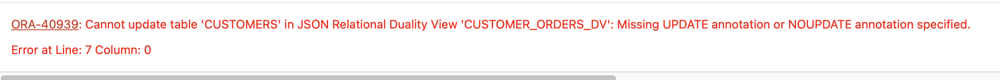

# Exploring JSON Relational Duality with SQL and Rest

## Introduction

Welcome to the "Exploring JSON Relational Duality with SQL and REST" workshop. In this workshop, you will learn about the JSON Relational Duality feature, which allows for the seamless integration between the relational and JSON data models. This feature provides the strengths of both approaches, allowing you to easily manipulate data in either model.

This lab is only intended to give you a small taste of what Duality Views have to offer. For full, in-depth free workshops, follow the link below:

[23ai JSON Duality View Workshops](https://livelabs.oracle.com/pls/apex/f?p=133:100:110578183178299::::SEARCH:duality%20views)

Estimated Lab Time: 20 minutes

**JSON Duality**

JSON Relational Duality is a landmark capability in Oracle Database 23ai, providing game-changing flexibility and simplicity for Oracle Database developers. This feature overcomes the historical challenges developers have faced when building applications using the relational or document models.

JSON Relational Duality helps to converge the benefits of both document and relational worlds. Developers now get the flexibility and data access benefits of the JSON document model, plus the storage efficiency and power of the relational model. The new feature enabling this functionality is JSON Relational Duality View (we'll refer to it as a Duality View below).

Key benefits of JSON Relational Duality:

* Experience flexibility in building apps using Duality Views. You can access the same data relationally or as hierarchical documents based on your use case, and you're not forced into making compromises because of the limitations of the underlying database. Build document-centric apps on relational data or create SQL apps on documents.

* Experience simplicity by retrieving and storing all the data needed for an app in a single database operation. Duality Views provide fully updatable JSON views over data. Apps can read a document, make necessary changes, and write the document back without worrying about the underlying data structure, mapping, or consistency.

* Enable flexibility and simplicity in building multiple apps on the same set of data. You can use the power of Duality View to define multiple JSON Views across overlapping groups of tables. This flexible data modeling makes building multiple apps against the same data easy and efficient.

* Duality Views eliminate the inherent problem of data duplication and data inconsistency in document databases. Duality Views are fully ACID (atomicity, consistency, isolation, durability) transactions across multiple documents and tables. They eliminate data duplication across documents, whereas consistency is maintained automatically.


### Objectives

This lab aims to provide hands-on experience with JSON-relational Duality Views, demonstrating how to get the strengths of both JSON and relational data models. You will learn how to create, query, and update JSON-relational Duality Views using SQL and REST.

### Prerequisites

This lab assumes you have:

* Oracle Database 23ai
* Completed the get started Lab


## Task 1: Getting Started

1. If you haven't done so already, from the Autonomous Database home page, **click** Database action and then **click** SQL.
    

    Using the ADMIN user isn’t typically advised due to the high level of access and security concerns it poses. **However**, for this demo, we’ll use it to simplify the setup and ensure we can show the full range of features effectively. 

2. Before we begin, this lab will be using Database Actions Web. If you're unfamiliar, please see the picture below for a simple explanation of the tool. You can click on the photo to enlarge it.

    

2.  Let's create some tables to use in the lab. Paste the following into the SQL Worksheet and click the **Run as Script Button** (shown in the picture below)
    ```
    <copy>
    DROP TABLE if exists orders CASCADE CONSTRAINTS;
    DROP TABLE if exists customers CASCADE CONSTRAINTS;

    -- Create a table to store order data
    CREATE TABLE if not exists orders (
        id NUMBER,
        product_id NUMBER,
        order_date TIMESTAMP,
        customer_id NUMBER,
        total_value NUMBER(6,2),
        order_shipped BOOLEAN,
        warranty INTERVAL YEAR TO MONTH
    );

    -- Create a table to store customer data
    CREATE TABLE if not exists customers (
        id NUMBER,
        first_name VARCHAR2(100),
        last_name VARCHAR2(100),
        dob DATE,
        email VARCHAR2(100),
        address VARCHAR2(200),
        zip VARCHAR2(10),
        phone_number VARCHAR2(20),
        credit_card VARCHAR2(20),
        joined_date TIMESTAMP DEFAULT SYSTIMESTAMP,
        gold_customer BOOLEAN DEFAULT FALSE,
        CONSTRAINT new_customers_pk PRIMARY KEY (id)
    );

    -- Add foreign key constraint to new_orders table
    ALTER TABLE orders ADD (CONSTRAINT orders_pk PRIMARY KEY (id));
    ALTER TABLE orders ADD (CONSTRAINT orders_fk FOREIGN KEY (customer_id) REFERENCES customers (id));
    </copy>
    ```


## Task 2: JSON Relational Duality View

1. In addition to the list of JSON Relational Duality Views benefits from above, Duality Views also have a security benefit. 

    First, the documents you create (the Duality Views), **are not directly tied to the storage of the data**. 

    What does that mean? 

    Using Duality Views, you can define how the data is accessed and used. Duality Views allow you to specify @insert, @update, and @delete privileges, meaning you define exactly how the applications and/or the developers work with data. 

    Here, let's create a Duality View on the customers table. We'll use this Duality View to manage our customer information.

    ```
    <copy>
    CREATE OR REPLACE JSON RELATIONAL DUALITY VIEW customers_dv AS
    customers @insert @update @delete
    {
        _id      : id,
        FirstName       : first_name,
        LastName        : last_name,
        DateOfBirth     : dob,
        Email           : email,
        Address         : address,
        Zip             : zip
        phoneNumber     : phone_number
        creditCard      : credit_card
        joinedDate      : joined_date 
        goldStatus      : gold_customer
    }
;
	</copy>
    ```

2. The second security benefit comes from the fact we can **HIDE** data. We can create these views however we like. 

    For example, say we want to exclude sensitive personally identifiable information like customers credit card or phone numbers. 
    
    Let's create a view without those identifiers. 

    ```
    <copy>
    CREATE OR REPLACE JSON RELATIONAL DUALITY VIEW customer_orders_dv AS
        customers
        {
            _id      : id,
            FirstName       : first_name,
            LastName        : last_name,
            Address         : address,
            Zip             : zip,
            orders : orders @insert @update @delete
            [ 
                {
                    OrderID       : id,
                    ProductID     : product_id,
                    OrderDate     : order_date,
                    TotalValue    : total_value,
                    OrderShipped  : order_shipped
                }
            ]
        };
	</copy>
    ```

    If you notice, this view doesn’t specify @insert, @update, or @delete on our customers table. You created this view so that you can only update orders through the `customer_orders_dv` Duality View, and no sensitive customer information (such as customers’ credit card numbers or phone numbers) will be shown. The only way to manage that information is through the `customers_dv` view.

	

3. Now that the Duality Views have been created, we have two options, we can insert directly into the tables,


	```
	<copy>
    INSERT INTO customers (id, first_name, last_name, dob, email, address, zip, phone_number, credit_card)
    VALUES (1, 'Alice', 'Brown', DATE '1990-01-01', 'alice.brown@example.com', '123 Maple Street', '12345', '555-1234', '4111 1111 1111 1111');


    INSERT INTO orders (id, customer_id, product_id, order_date, total_value)
    VALUES (100, 1, 101, SYSTIMESTAMP, 300.00);

	</copy>
    ```
    

    Or, we can insert through a Duality View. 

	```
	<copy>
    INSERT INTO customers_DV values ('{"_id": 2, "FirstName": "Jim", "LastName":"Brown", "Email": "jim.brown@example.com", "Address": "456 Maple Street", "Zip": 12345}');

    commit;
	</copy>
    ```

4. Let’s take a look at what we have. To enter an order, we simply link the customer information to the order. There is no data duplication.

    This Duality View will show us two customers.

	```
	<copy>
    select * from customers_dv;
	</copy>
    ```
    And this Duality View will show us the same two customers - one with an order and one without.

	```
	<copy>
    select * from customer_orders_dv;
	</copy>
    ```
 
    And we can see the same in relational.

	```
	<copy>
    select * from customers;
    select * from orders;
	</copy>
    ```

5. Now, when we created the `customer_orders_dv` Duality View, we specified @insert, @update, @delete operations were allowed for our orders. Let's update an order through our Duality View.


	```
	<copy>
    UPDATE customer_orders_dv c
    SET c.data = json_transform(
        data,
        APPEND '$.orders' = JSON {'OrderID':123, 'ProductID' : 202, 'OrderDate' : SYSTIMESTAMP, 'TotalValue' : 150.00}
    )
    WHERE c.data."_id" =1;
    commit;

    select * from customer_orders_dv o where o.data."_id" = 1;
    </copy>
    ```


    

 6. We talked about the security benefit of the Duality Views earlier. If you'll remember, we didn't allow for updates to our customers through the `customer_orders_dv` Duality View (or allow for sensitive customer information in the document). 
 
    Lets take a look at how an update will fail if we try and update customer information through the `customer_orders_dv` document. 

    Try and change the name of Jim's last name from Brown to Browne.

	```
	<copy>
    UPDATE customer_orders_dv c
    SET c.data = json_transform(
        data,
        SET '$.LastName' = 'Browne'
    )
    WHERE c.data."_id" =1;

    </copy>
    ```
    


7. Another benefit of the Duality Views is that, because the data is stored as tables, if we need to update any of our embedded documents, we only need to update the corresponding table, and all of the documents will reflect those changes. Doing that in pure JSON would be a challenge.

    Let's see an example.

    First, we can insert some orders into our Jim Brown customer. Here, we can use `json_mergepatch`.


	```
	<copy>
    update customer_orders_dv o set data = json_mergepatch(data,'{"orders" : 
    [
        {
        "OrderID": 100,
        "ProductID": 10100,
        "OrderDate": "2024-06-27T11:55:20.174683",
        "TotalValue": 300,
        "OrderShipped": null
        },
        {
        "OrderID": 200,
        "ProductID": 20002,
        "OrderDate": "2024-06-27T11:55:50.424141",
        "TotalValue": 150,
        "OrderShipped": null
        }
    ]}')
    where o.data."_id" = 2;

    commit;
    </copy>
    ```

8. Imagine we needed to change one of the Product IDs, for example product_id = 202 shown below. 

	```
	<copy>
    SELECT json_serialize(data PRETTY) FROM customer_orders_dv;
    </copy>
    ```

    From this result, we can see both the customers ordered the product_id 202.

9. We can easily update the orders table and this will update all documents with nested orders of number 202.

	```
	<copy>
    UPDATE orders
    SET product_id = 999
    WHERE product_id = 202;
    </copy>
    ```

10. This one change updates every document where a nested order has `product_id = 202`.

    We can take a look at all the customer orders through the Duality View.

	```
	<copy>
    SELECT json_serialize(data PRETTY) FROM customer_orders_dv;
    </copy>
    ```

11. Note that the "etag" value supplied in the content is used for "out-of-the-box" optimistic locking to prevent the well-known "lost update" problem that can occur with concurrent operations. During a replace operation, the database checks that the eTag provided in the replacement document matches the latest eTag of the target Duality View document.

    If the eTags do not match, which can occur if another concurrent operation updated the same document, an error is thrown. If you get the error, you can reread the updated value (including the updated eTag), and retry the replace operation again, adjusting it (if desired) based on the updated value.


## Task 3: (Optional) JSON Relational Duality Views with REST

1. We can also use Oracle's SODA (Simple Object Data API) or even the Mongo API to work against the Duality View.

    For a small example, I will show this using a macOS native terminal and execute a basic GET request.

2. In the Navigator menu on the left hand side of the screen, click the drop-down arrow for the box showing the Table objects, and select Views. Refer to the picture below if needed.

    

3. Right-click on the CUSTOMERS_DV, hover the mouse over REST, and click Enable if it isn't already enabled. See the picture below. NOTE: If it is enabled already, it will say Disable… instead. If you see Disable… you don't have to do anything. Skip to number 5.

    

4. The REST Enable Object side panel will appear. Select Enable to continue.

    

    Alternatively we could have done this in PL/SQL.

5. Here we will use the SQL Developer Web URL to obtain your ADB instance base URL:

	```
    ADB_LL_URL = https://xxxxxxxxxx.adb.<region>.oraclecloudapps.com
    ```

    

    For example,  mine looks like this: 

    ```
    ADB_LL_URL=https://ajs6esm7pafcr84-atp97134.adb.us-ashburn-1.oraclecloudapps.com
    ```

6. Now, if you're on macOS or Linux create a variable in your terminal (It shouldn't have / at the end.). If you're on windows, see step 9 below.

	```
	<copy>
    export ADB_LL_URL=https://ajs6esm7pafcr84-atp97134.adb.us-ashburn-1.oraclecloudapps.com
    </copy>
    ```

7. Check it was set.

	```
	<copy>
    echo $ADB_LL_URL
    </copy>
    ```
    > NOTE: This base url will be unique for each user, verify that you are using the correct URL.

8. Make a GET request from your laptop terminal command line. I've done this on a macOS - if you're running on Windows, see step 9 below instead.

	```
	<copy>
    curl -X GET $ADB_LL_URL/ords/admin/customers_dv/ | json_pp

    </copy>
    ```
    

9. 	If you're using a Windows 10 and up machine, run the following

    ```
	<copy>
    set ADB_LL_URL=https://ajs6esm7pafcr84-atp97134.adb.us-ashburn-1.oraclecloudapps.com
    </copy>
    ```
10. Check it was set.

	```
	<copy>
    echo %ADB_LL_URL%
    </copy>
    ```
    > NOTE: This base url will be unique for each user, verify that you are using the correct URL.

11. Make a GET request from your laptop terminal command line. 

	```
	<copy>
    curl -X GET %ADB_LL_URL%/ords/admin/customers_dv/
    </copy>
    ```
    

12. This lab is only intended to give you a small taste of what Duality Views have to offer. For full, in-depth free workshops, follow the link below:

    [23ai JSON Duality View Workshops](https://livelabs.oracle.com/pls/apex/f?p=133:100:110578183178299::::SEARCH:duality%20views)

    In summary, this lab checks out the power of JSON Relational Duality Views, allowing you to work with data in either JSON Document format or SQL Relational format. Changes made through views are reflected in the corresponding documents and tables. This flexibility enables convenient create, read, update, or delete operations across multiple documents and tables with ease.


10. We can clean up from the lab by dropping our tables. Navigate back to the SQL editor or go back to task one - step one if you need a reminder where it is.

    ```
    <copy>
    DROP TABLE orders CASCADE CONSTRAINTS;
    DROP TABLE customers CASCADE CONSTRAINTS;
    DROP VIEW customer_orders_dv;
    DROP VIEW customers_dv;

    </copy>
    ```

You may now **proceed to the next lab** 

## Learn More

* [JSON Relational Duality: The Revolutionary Convergence of Document, Object, and Relational Models](https://blogs.oracle.com/database/post/json-relational-duality-app-dev)
* [JSON Duality View documentation](https://docs.oracle.com/en/database/oracle/oracle-database/23/jsnvu/overview-json-relational-duality-views.html#)

## Acknowledgements
* **Author** - Killian Lynch, Oracle Database Product Management, Product Manager
* **Contributors** - Dominic Giles, Oracle Database Product Management, Distinguished Product Manager
* **Last Updated By/Date** - Killian Lynch, Oracle Database Product Management, Product Manager, August 2024
