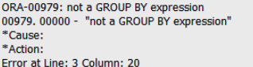
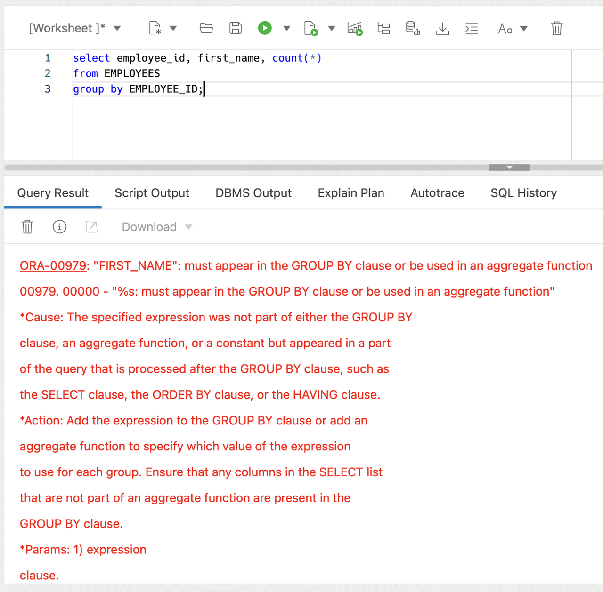

# Improving Database Error Messages

## Introduction

Welcome to the "Improving Database Error Messages" lab. In this lab, we will explore the ongoing project inside Oracle aimed at enhancing the error messages generated by the database. Error messages are often the first point of reference when troubleshooting database issues, and improving their clarity can help in diagnosing and resolving problems.

Estimated Lab Time: 10 minutes

### Objective:
The objective of this lab is to familiarize you with the improvements being made to Oracle database error messages. By the end of this lab, you will understand the importance of clear and descriptive error messages and be able to recognize some of the changes implemented in recent updates.

### Prerequisites:
- Access to Oracle Database 23ai.
- Basic understanding of Oracle database concepts.

## Task 1: Understanding the Importance of Error Messages

1. Error messages play a crucial role in diagnosing and resolving database issues. Clear and descriptive error messages can greatly reduce the time and effort (and headache) required to troubleshoot problems. This has the chance to lead to faster resolution and better database reliability.

1. If you haven't done so already, from the Autonomous Database home page, **click** Database action and then **click** SQL.
    

    Using the ADMIN user isn’t typically advised due to the high level of access and security concerns it poses. **However**, for this demo, we’ll use it to simplify the setup and ensure we can show the full range of features effectively. 

2. Before we begin, this lab will be using Database Actions Web. If you're unfamiliar, please see the picture below for a simple explanation of the tool. You can click on the photo to enlarge it.

    

2. Let's check out some examples of error message improvements. First we'll add a table and some rows

    ```
    <copy>
    DROP TABLE if exists EMPLOYEES;

    CREATE TABLE employees (
        employee_id INT,
        first_name VARCHAR(50),
        last_name VARCHAR(50),
        department VARCHAR(50)
    );

    INSERT INTO employees (employee_id, first_name, last_name, department)
    VALUES
        (4, 'Emily', 'Johnson', 'Marketing'),
        (5, 'Michael', 'Williams', 'Sales'),
        (6, 'Kyle', 'Brown', 'HR');

    </copy>
    ```

3. This is an example of an old error we would see for the following group by statement. A little vague.

    

    ```
    <copy>
    select employee_id, first_name, count(*)
    from EMPLOYEES
    group by EMPLOYEE_ID;
    </copy>
    ```

    Now when we execute the same statement we get the following. 

    

    This tells us that the first name must appear in the group by clause or be used in an aggregate function. This makes it drastically easier to fix. 

    This is just a tiny sample of the error message improvement. The Oracle Database team took the top 90% most reoccurring messages and improved them.

    Here is another small sample.


    - **Before**: `ORA-00020: maximum number of processes exceeded`
      **After**: `ORA-00020: Exceeded maximum number of processes (5) specified in initialization parameter`

    - **Before**: `ORA-00911: invalid character`
      **After**: `ORA-00911: ‘s’: invalid character after ‘John’`

    - **Before**: `ORA-01008: not all variables bound`
      **After**: `ORA-01008: Value for bind variable placeholder EMP_NAME was not provided`

    These examples demonstrate how improved error messages provide clearer explanations and guidance for troubleshooting database issues.

## Task 2: Providing Feedback

1. As part of the ongoing effort to enhance error messages, Oracle welcomes feedback from users. If you encounter error messages that you believe could be improved further, please don't hesitate to get in touch or tweet at me with any suggestions, [@killianlynch](https://twitter.com/killianlynchh)


2. Your feedback helps ensure that error messages continue to evolve, becoming even more descriptive and helpful in diagnosing database issues.

    In this lab, we've explored the ongoing project within Oracle to improve database error messages. Clear and descriptive error messages are good for effective database troubleshooting. By understanding the importance of error messages and staying informed about ongoing improvements, you can enhance your ability to diagnose and resolve database issues efficiently.

3. Lab cleanup

    ```
    <copy>
    DROP TABLE if exists EMPLOYEES;
    </copy>
    ```

You may now **proceed to the next lab** 


## Learn More

* [Introducing the Oracle Database Error Help Portal](https://blogs.oracle.com/database/post/error-help-portal)
* [Database Error Messages](https://docs.oracle.com/en/error-help/db/)

## Acknowledgements
* **Author** - Killian Lynch, Database Product Management
* **Contributors** - Dom Giles, Distinguished Database Product Manager
* **Last Updated By/Date** - Killian Lynch, April 2024
