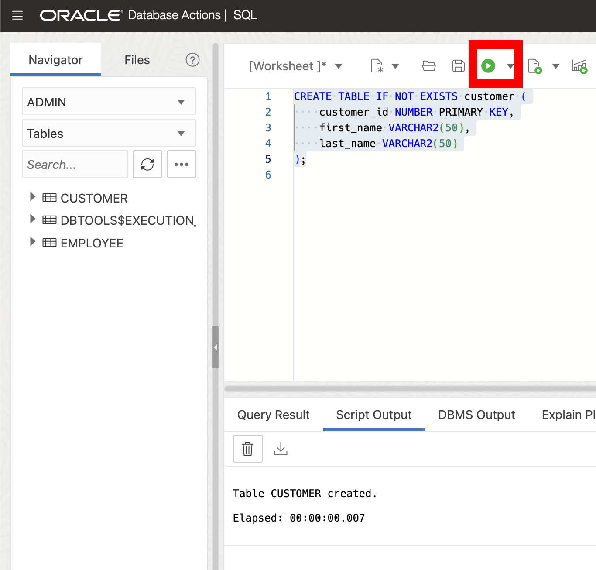
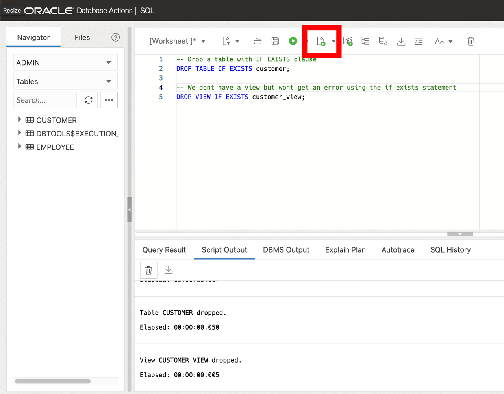
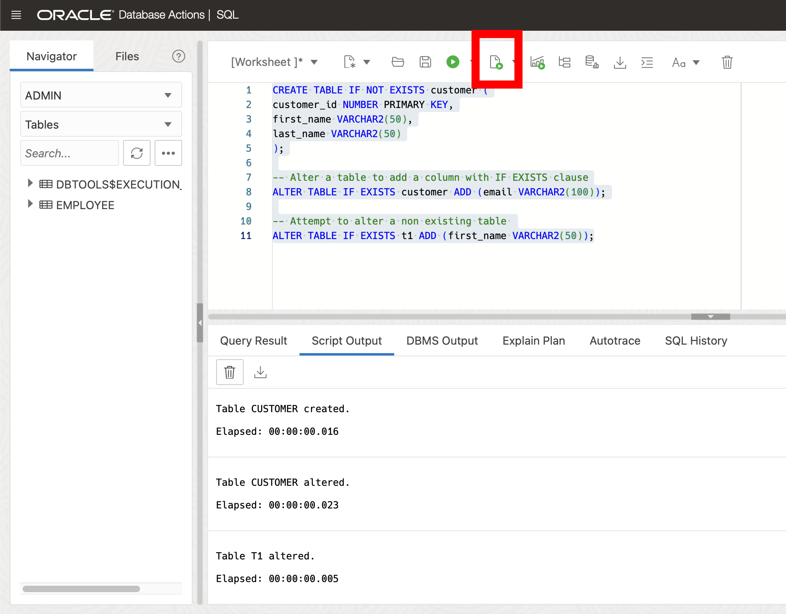

# Using "IF EXISTS" and "IF NOT EXISTS" in SQL 

## Introduction

Welcome to the "IF EXISTS" and "IF NOT EXISTS" Lab for Oracle Database 23ai. In this lab, you will explore the usage of the "IF EXISTS" and "IF NOT EXISTS" statements in SQL within the context of Oracle Database 23ai. These statements are powerful tools for executing SQL commands based on the existence or non-existence of certain conditions or objects inside the database.

Understanding how to effectively use these statements can improve your database management and application development skills.

Estimated Lab Time: 10 minutes

### Objective:
In this lab, you will learn how to use the "IF EXISTS" and "IF NOT EXISTS" statements in SQL within Oracle Database 23ai. You will explore their usage for checking the existence or non-existence of tables, columns, and records, and execute conditional commands based on these checks. By the end of this lab, you will have a solid understanding of how to incorporate both "IF EXISTS" and "IF NOT EXISTS" into your SQL scripts, enabling you to write more dynamic and responsive database queries.

### Prerequisites:
- Access to Oracle Database 23ai environment.
- Basic understanding of SQL.

## Task 1: Exploring IF [NOT] EXISTS Clause

1. If you haven't done so already, from the Autonomous Database home page, **click** Database action and then **click** SQL.
    

    Using the ADMIN user isn’t typically advised due to the high level of access and security concerns it poses. **However**, for this demo, we’ll use it to simplify the setup and ensure we can show the full range of features effectively. 

2. Before we begin, this lab will be using Database Actions Web. If you're unfamiliar, please see the picture below for a simple explanation of the tool. You can click on the photo to enlarge it.

    

2. Let's reset our environment before we start.
    
    ```
    <copy>
    DROP TABLE if exists customer CASCADE CONSTRAINTS;
    </copy>
    ```

2. Lets create a small customer table with an id, first name and last name. We'll use the IF NOT EXISTS clause meaning the table only gets created if it doesn't already exist in the database.

    ```
    <copy>
    CREATE TABLE IF NOT EXISTS customer (
        customer_id NUMBER PRIMARY KEY,
        first_name VARCHAR2(50),
        last_name VARCHAR2(50)
    );
    </copy>
    ```
    

3. Let's now drop objects using the IF EXISTS clause. This means that we can drop non-existent and existing objects without receiving an error. Notice, we don't have a customer_view. However, with IF EXISTS statement we wont get an error.

    ```
    <copy>
    -- Drop a table with IF EXISTS clause
    DROP TABLE IF EXISTS customer;

    -- We don't have a view but wont get an error using the if exists statement
    DROP VIEW IF EXISTS customer_view;
    </copy>
    ```
    

4. We can also alter objects using the IF EXISTS clause. First, lets re-add the `customer` table since we dropped it above, and then alter the table and add a new email column. Simultaneously we can add a first_name column to a table that doesn't exist. 

    Again notice we wont receive an error. 

    ```
    <copy>

    CREATE TABLE IF NOT EXISTS customer (
    customer_id NUMBER PRIMARY KEY,
    first_name VARCHAR2(50),
    last_name VARCHAR2(50)
    );

    -- Alter a table to add a column with IF EXISTS clause
    ALTER TABLE IF EXISTS customer ADD (email VARCHAR2(100));

    -- Attempt to alter a non existing table 
    ALTER TABLE IF EXISTS t1 ADD (first_name VARCHAR2(50));
    </copy>
    ```
    
 

5. This new functionality is great for enhancing scripts and minimizing errors in database. Feel try to continue trying out the IF [NOT] EXISTS clause or check out another lab. You've now completed this lab worked with the IF [NOT] EXISTS clause in Oracle Database 23ai. 

6. We can clean up from the lab by dropping our tables.

    ```
    <copy>
    DROP TABLE customer CASCADE CONSTRAINTS;
    </copy>
    ```
You may now **proceed to the next lab** 

## Learn More

* [Oracle Database 23ai IF EXISTS and IF NOT EXISTS Documentation](https://docs.oracle.com/en/database/oracle/oracle-database/23/adfns/sql-processing-for-application-developers.html#GUID-3818B089-D99D-437C-862F-CBD276BDA3F1)

## Acknowledgements
* **Author** - Killian Lynch, Database Product Management
* **Contributors** - Dom Giles, Distinguished Database Product Manager
* **Last Updated By/Date** - Killian Lynch, April 2024
