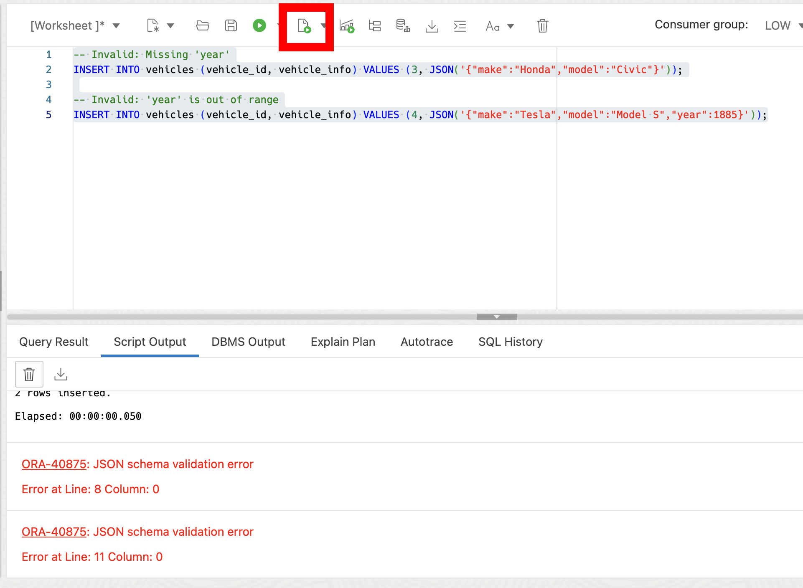

# Validating JSON Data with JSON Schema

## Introduction

Welcome to the "Validating JSON Data with JSON Schema" lab. In this lab, you will learn how to work with JSON Schema so that your JSON data adheres to a specific structure and type constraints. This feature provides a simple but powerful method to validate JSON data. Adding JSON Schema can help maintain data integrity and consistency in your Oracle databases.

Estimated Lab Time: 15 minutes

### Objective:
The objective of this lab is to familiarize you with JSON Schema validation in Oracle Database 23ai and demonstrate its practical applications. By the end of this lab, you will be able to use JSON Schema to validate JSON data in various scenarios, including as part of table constraints and within SQL queries.

### Prerequisites:
- Access to Oracle Database 23ai.
- Basic understanding of SQL is helpful.

## Task 1: Understanding JSON Schema Validation

1. If you haven't done so already, from the Autonomous Database home page, **click** Database action and then **click** SQL.
    

    Using the ADMIN user isn’t typically advised due to the high level of access and security concerns it poses. **However**, for this demo, we’ll use it to simplify the setup and ensure we can show the full range of features effectively. 

2. Before we begin, this lab will be using Database Actions Web. If you're unfamiliar, please see the picture below for a simple explanation of the tool. You can click on the photo to enlarge it.

    

2. We will define a JSON schema that specifies the structure and constraints for vehicle information. The schema will enforce that the JSON object has three mandatory properties: "make" (a string), "model" (a string), and "year" (an integer between 1886 and the current year).

    ```
    <copy>
    DROP TABLE IF EXISTS vehicles cascade constraints;

    CREATE TABLE vehicles (
        vehicle_id   NUMBER,
        vehicle_info JSON VALIDATE '{
        "type"       : "object",
        "properties" : {"make"    : {"type" : "string"},
                        "model"   : {"type" : "string"},
                        "year"    : {"type" : "integer",
                                    "minimum" : 1886,
                                    "maximum" : 2024}},
        "required"   : ["make", "model", "year"]
        }',
        CONSTRAINT vehicles_pk PRIMARY KEY (vehicle_id)
    );
    </copy>
    ```
    

3. Insert some valid JSON data into the table making sure it passes the schema constraints.

    ```
    <copy>
    INSERT INTO vehicles (vehicle_id, vehicle_info) 
    VALUES 
        (1, JSON('{"make":"Toyota","model":"Camry","year":2020}')),
        (2, JSON('{"make":"Ford","model":"Mustang","year":1967}'));
    </copy>
    ```

    

4. Now we can insert JSON data that violates the schema constraints to see the error handling.

    ```
    <copy>
    -- Invalid: Missing 'year'
    INSERT INTO vehicles (vehicle_id, vehicle_info) VALUES (3, JSON('{"make":"Honda","model":"Civic"}'));

    -- Invalid: 'year' is out of range
    INSERT INTO vehicles (vehicle_id, vehicle_info) VALUES (4, JSON('{"make":"Tesla","model":"Model S","year":1885}'));
    </copy>
    ```
    We can see that we get a violation.

    

5. We can also enhance JSON Schema with additional constraints. For example, we can say no additional properties can be added to the object.

    ```
    <copy>
    DROP TABLE IF EXISTS vehicles cascade constraints;

    CREATE TABLE vehicles (
        vehicle_id   NUMBER,
        vehicle_info JSON VALIDATE '{
        "type"       : "object",
        "properties" : {"make"    : {"type" : "string"},
                        "model"   : {"type" : "string"},
                        "year"    : {"type" : "integer",
                                    "minimum" : 1886,
                                    "maximum" : 2024}},
        "required"   : ["make", "model", "year"],
        "additionalProperties" : false
        }',
        CONSTRAINT vehicles_pk PRIMARY KEY (vehicle_id)
    );
    </copy>
    ```

    

6. Now let's insert JSON data that's got additional properties to check the new constraint.

    ```
    <copy>
    INSERT INTO vehicles (vehicle_id, vehicle_info) VALUES (6, JSON('{"make":"BMW","model":"X5","year":2019,"color":"black"}'));
    </copy>
    ```


    

## Task 2: Querying JSON Data with Schema Validation

1. Here let's recreate the table without the VALIDATE keyword and add some new JSON documents.
    ```
    <copy>
    DROP TABLE IF EXISTS vehicles cascade constraints;

    CREATE TABLE vehicles (
        vehicle_id   NUMBER,
        vehicle_info JSON,
        CONSTRAINT vehicles_pk PRIMARY KEY (vehicle_id)
    );

    -- Insert a mix of valid and invalid JSON data
    INSERT INTO vehicles (vehicle_id, vehicle_info) 
    VALUES 
        (1, JSON('{"make":"Nissan","model":"Altima","year":2021}')),
        (2, JSON('{"make":"Chevrolet","model":"Malibu"}')),
        (3, JSON('{"make":"Dodge","model":"Charger","year":2023}')),
        (4, JSON('{"make":"Audi","model":"A4","year":1885}'));
    </copy>
    ```
        
    


2. Query the table using the IS JSON VALIDATE condition to retrieve only the valid JSON documents.
    ```
    <copy>
    SELECT *
    FROM   vehicles
    WHERE  vehicle_info IS JSON VALIDATE '{
    "type"       : "object",
    "properties" : {"make"    : {"type" : "string"},
                    "model"   : {"type" : "string"},
                    "year"    : {"type" : "integer",
                                "minimum" : 1886,
                                "maximum" : 2024}},
    "required"   : ["make", "model", "year"]
    }';
    </copy>
    ```

    This will return only the two rows with JSON data that meets the IS JSON VALIDATE condition.

    


3. In this lab, we explored the practical applications of JSON schema constraints in Oracle SQL. We learned how to define JSON schema constraints during table creation, validate JSON data upon insertion, and query JSON data using these constraints. By using JSON schema validation, you can make sure that your JSON data keeps to a predefined format, which can improve data integrity and reliability in your Oracle Database.

4. We can clean our environment
    ```
    <copy>
    DROP TABLE IF EXISTS vehicles cascade constraints;
    </copy>
    ```
    You may now **proceed to the next lab**

## Learn More

* [JSON Schema Documentation](https://docs.oracle.com/en/database/oracle/oracle-database/23/adjsn/json-schema.html)

## Acknowledgements
* **Author** - Killian Lynch, Database Product Management
* **Contributors** - Dom Giles, Distinguished Database Product Manager
* **Last Updated By/Date** - Killian Lynch, April 2024