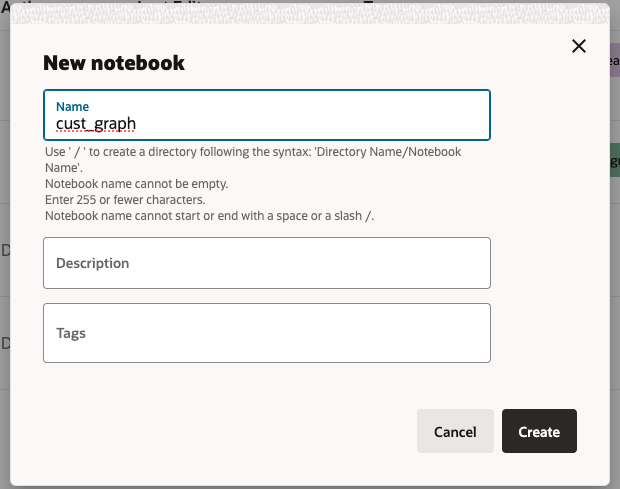
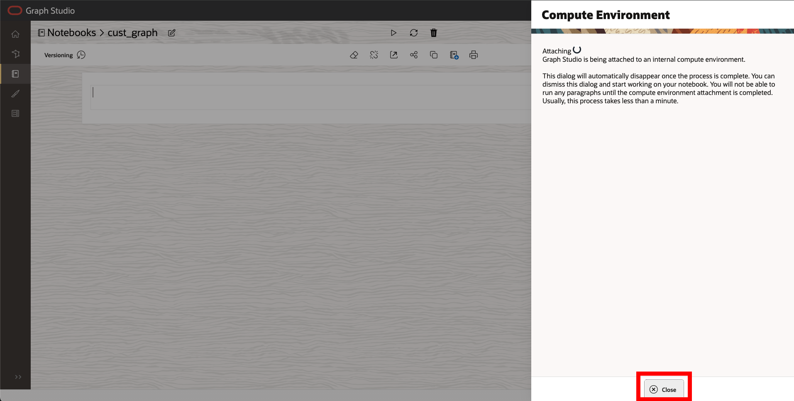
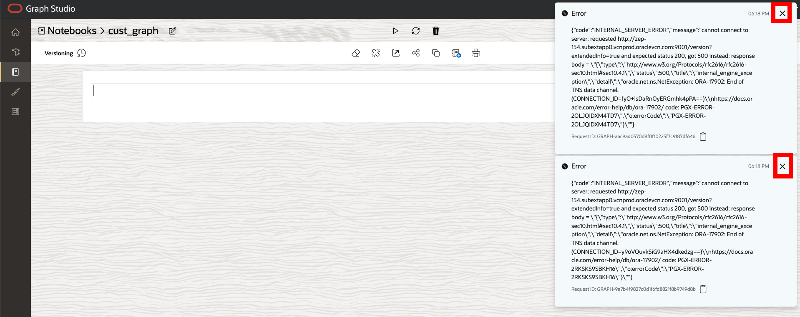
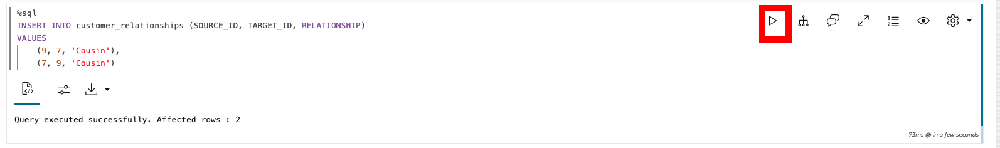

# Exploring SQL Property Graphs and SQL/PGQ in Oracle Database 23ai

## Introduction

Welcome to the "Exploring SQL Property Graphs and SQL/PGQ in Oracle Database 23ai" workshop. In this workshop, you will learn about the new SQL property graph feature and the new SQL/PGQ syntax in Oracle Database 23ai. SQL Property Graphs enable you to define graph structures inside the database, using tables and relationships as graph vertices and edges. This feature simplifies graph data analysis using SQL/PGQ queries.

Estimated Lab Time: 20 minutes

Watch the video below for a walkthrough of the lab.
[Lab walkthrough video](videohub:1_hxipitm1)

### Objective:

The objective of this workshop is to show you SQL property graphs and demo their practical use. By the end of this workshop, you will be able to create property graphs, query them using SQL/PGQ, and visualize the relationships within your data.

This lab is just a short overview of the functionality introduced with Property Graphs in Oracle Database 23ai and is meant to give you a small example of what is possible. For more in depth Property Graphs explanations and workshops check out the following labs

* [Graphs in the Oracle Database](https://livelabs.oracle.com/pls/apex/f?p=133:100:105582422382278::::SEARCH:graph)

### Prerequisites:
- Access to Oracle Database 23ai.
- Basic understanding of SQL is helpful.


## Task 1: Lab Setup and Creating Property Graphs  

1. Let's first enhance our customers and ratings datasets. 

    ```
    <copy>
    create table if not exists customer_relationships(
        id number GENERATED ALWAYS as IDENTITY(START with 1 INCREMENT by 1) not null constraint rel_pk primary key,
        source_id number,
        target_id number,
        relationship varchar2(100));

    INSERT INTO customers (customer_id, first_name, last_name, email, signup_date, has_sub)
    VALUES
        (8, 'Suzy', 'Brown', 'suzy.brown@example.com', SYSDATE, TRUE);

    INSERT INTO customer_relationships (SOURCE_ID, TARGET_ID, RELATIONSHIP)
    VALUES
        (8, 7, 'Married'),
        (7, 8, 'Married'),
        (7, 4, 'Brother'),
        (4, 7, 'Brother'),
        (1, 2, 'Friend'),
        (3, 5, 'Colleague'),
        (6, 4, 'Neighbor'),
        (7, 6, 'Friend'),
        (6, 7, 'Friend'),
        (7, 3, 'Friend'),
        (3, 7, 'Friend'),
        (7, 1, 'Friend'),
        (1, 7, 'Friend');
    </copy>
    ```

1. Property graphs give you a different way of looking at your data. With Property Graphs you model data with edges and nodes. Edges represent the relationships that exist between our nodes (also called vertices). 

    In Oracle Database 23ai we can create property graphs inside the database. These property graphs allow us to map the vertices and edges to new or existing tables, external tables, materialized views or synonyms to these objects inside the database. 
    
    The property graphs are stored as metadata inside the database meaning they don't store the actual data. Rather, the data is still stored in the underlying objects and we use the SQL/PQG syntax to interact with the property graphs.

    "Why not do this in SQL?" The short answer is, you can. However, it may not be simple. Modeling graphs inside the database using SQL can be difficult and cumbersome and could require complex SQL code to accurately represent and query all aspects of a graph.

    This is where property graphs come in. Property graphs make the process of working with interconnected data, like identifying influencers in a social network, predicting trends and customer behavior, discovering relationships based on pattern matching and more by providing a more natural and efficient way to model and query them. Let's take a look at how to create property graphs and query them using the SQL/PGQ extension.

2. We'll first create a property graph that models the relationship between customers.

    ```
    <copy>
        
    DROP PROPERTY GRAPH IF EXISTS moviestreams_pg;

    create property graph moviestreams_pg
    vertex tables (
        customers
        key(customer_id)
        label customer
        properties (customer_id, first_name, last_name)
    )
    edge tables (
        customer_relationships as related
        key (id)
        source key(source_id) references customers(customer_id)
        destination key(target_id) references customers(customer_id)
        properties (id, relationship)
    )
    </copy>
    ```

## Task 2: Discovering Graph Studio

1. Now we're going to take a look at Graph Studio. Click the hamburger menu and then select Graph Studio.

    

2. Login with our db23ai user credentials.

    Username: db23ai
    Password: Oracledb_4U#

    

3. Inside Graph Studio, click on Notebooks.

    

4. Select **Create** in the upper right hand corner.

    

5. Give your notebook a name. I'll go with **cust_graph**

    

6. If the compute environment pops up, click close in the bottom right corner. 
    

7. Since we haven't set up the compute server, and don't need it for this lab, you may get an error saying it wasn't able to create. Close these messages.
    


8. Hover over the middle of the textbox and click add SQL Paragraph. See the gif below for an example

    


9. We can now query this graph using the new SQL/PGQ extension in Oracle Database 23ai. The following query looks for customers, starting at the vertices 'Jim Brown' and then his friends (directional) within 1 to 3 hops. The important step here is the match clause which allows us to define the nodes we are looking for in our graph. We indicate we are starting from V1. We then apply a filter to, select Jim Brown. We tell it to traverse the graph in a single direction with -> navigating all edges that are marked friends from 1 to 3 hops. We finally tell the query to return the paths for the hops that match the query.

    Paste the following and click the run query button

    **Keep the %sql at the top of each SQL paragraph in the notebook**

    ```
    <copy>
    select distinct
    full_names,
    cust_id
    from graph_table(moviestreams_pg
                match
                (v1 is customer) ( -[e is related where e.relationship = 'Friend']-> (v2 is customer where v2.first_name != 'Jim')) {1,3}
                where v1.first_name = 'Jim' and v1.last_name = 'Brown'
                columns (LISTAGG(v2.first_name ||' '|| v2.last_name, ', ') as full_names,
                            LISTAGG(v2.customer_id, ', ') as cust_id,
                        v1.first_name ||' '|| v1.last_name as source)
        )
    </copy>
    ```

    

8. If we add new customers and relationships they are part of the graph and can be queried instantly. Add the insert statement into the a paragraph and run the query

    ```
    <copy>
    INSERT INTO customers (customer_id, first_name, last_name, email, signup_date, has_sub)
    VALUES
        (9, 'Jwan', 'Brown', 'Jwan.brown@example.com', SYSDATE, TRUE)
    </copy>
    ```

    

9. Add the customer relationship into the next cell and run the query.

    ```
    <copy>
    INSERT INTO customer_relationships (SOURCE_ID, TARGET_ID, RELATIONSHIP)
    VALUES
        (9, 7, 'Cousin'),
        (7, 9, 'Cousin')
    </copy>
    ```
    


10. We can update the first cell and change Friend to Cousin

    ```
    <copy>
    select distinct
    full_names,
    cust_id
    from graph_table(moviestreams_pg
                match
                (v1 is customer) ( -[e is related where e.relationship = 'Cousin']-> (v2 is customer where v2.first_name != 'Jim')) {1}
                where v1.first_name = 'Jim' and v1.last_name = 'Brown'
                columns (LISTAGG(v2.first_name ||' '|| v2.last_name, ', ') as full_names,
                            LISTAGG(v2.customer_id, ', ') as cust_id,
                        v1.first_name ||' '|| v1.last_name as source)
        )
    </copy>
    ```
    


11. Navigate back to SQL Developer Web by switching your browser tabs.


12. In this short lab we've looked at SQL property graphs and SQL/PGQ in Oracle Database 23ai. We've learned how to create property graphs from existing tables, query these graphs to discover relationships, and prepare data for visualization. 


You may now **proceed to the next lab** 

## Learn More

* [Graph Developer's Guide for Property Graph](https://docs.oracle.com/en/database/oracle/property-graph/24.2/spgdg/index.html)
* [New! Discover connections with SQL Property Graphs](https://blogs.oracle.com/database/post/sql-property-graphs-in-oracle-autonomous-database)

## Acknowledgements
* **Author** - Killian Lynch, Database Product Management
* **Contributors** 
* **Last Updated By/Date** - Killian Lynch, April 2024
