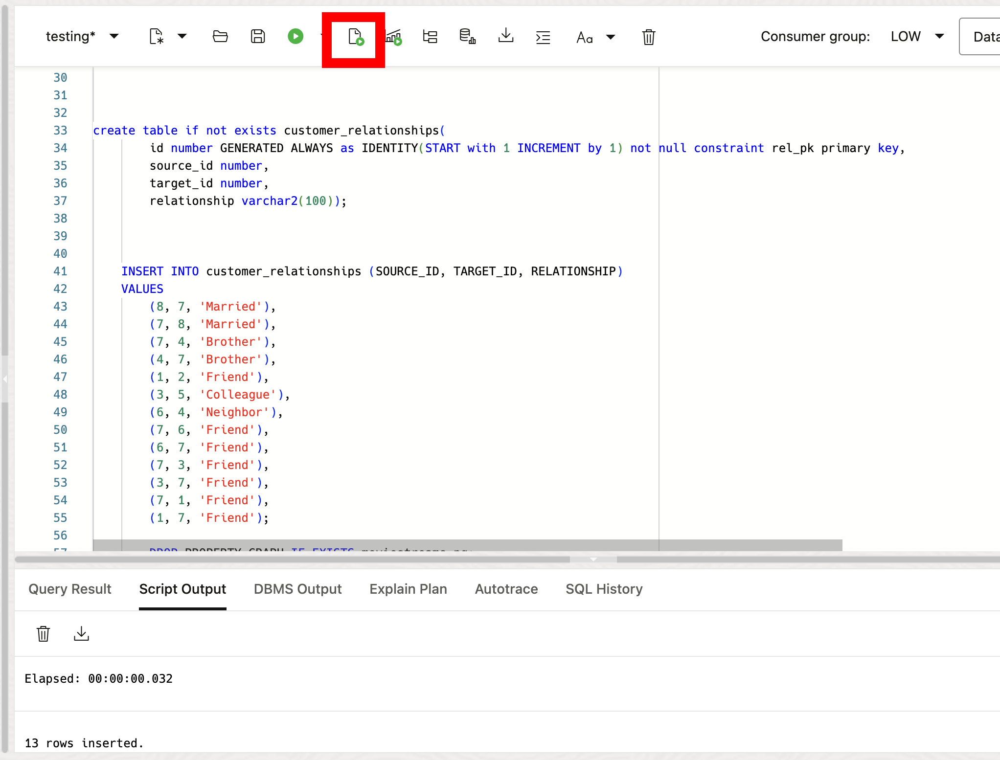
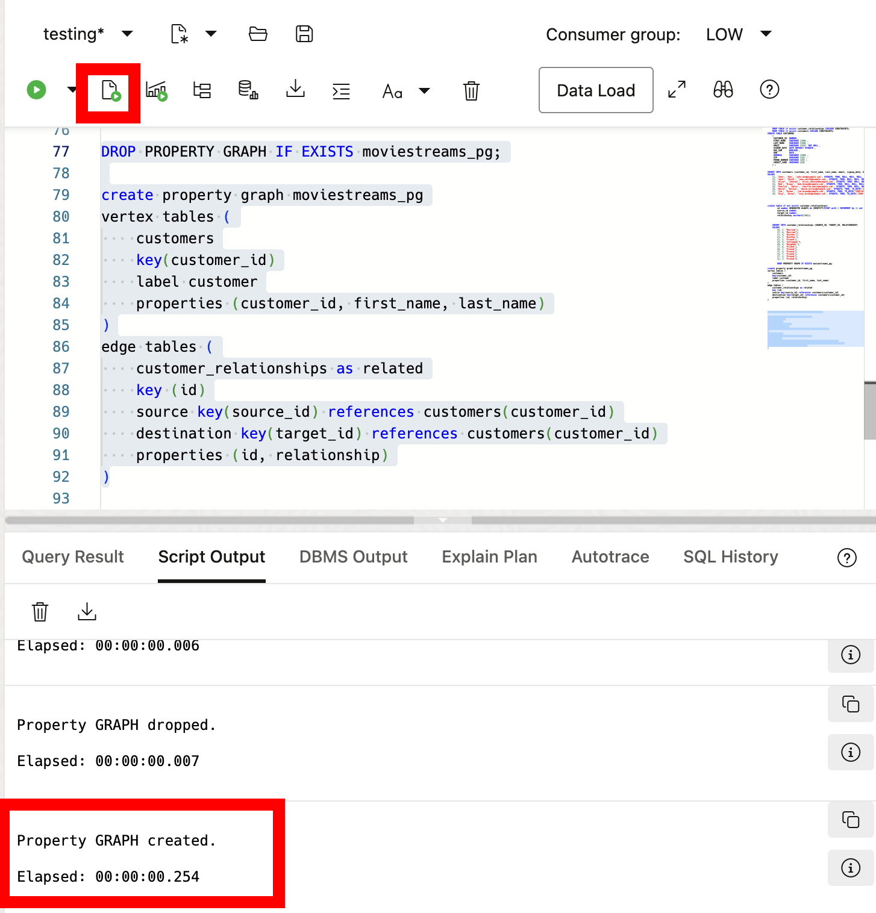

# Exploring SQL Property Graphs and SQL/PGQ in Oracle Database 23ai

## Introduction

Welcome to the "Exploring SQL Property Graphs and SQL/PGQ in Oracle Database 23ai" workshop. In this workshop, you will learn about the new SQL property graph feature, and the new SQL/PGQ syntax in Oracle Database 23ai. SQL Property Graphs enable you to define graph structures inside the database, using tables and relationships as graph vertices and edges. This feature simplifies graph data analysis using SQL/PGQ queries.

Estimated Lab Time: 20 minutes

Watch the video below for a walkthrough of the lab.
[Lab walkthrough video](videohub:1_nyvxwdwz)

### Objective:

The objective of this workshop is to show you SQL property graphs and demo their practical use. By the end of this workshop, you will be able to create property graphs, query them using SQL/PGQ, and visualize the relationships within your data.

This lab is just a short overview of the functionality brought forth by Property Graphs in Oracle Database 23ai and is meant to give you a small example of what is possible. For more in depth Property Graphs explanations and workshops check out the following labs

* [Graphs in the Oracle Database](https://livelabs.oracle.com/pls/apex/f?p=133:100:105582422382278::::SEARCH:graph)

### Prerequisites:
- Access to Oracle Database 23ai.
- Basic understanding of SQL is helpful.


## Task 1: Lab Setup

1. From the Autonomous Database home page, **click** Database action and then **click** SQL.

    

2. For demo purposes we will be using the ADMIN user so we don't need to grant any additional roles. The database schema that contains the graph tables (either Property Graph schema objects or relational tables that will be directly loaded as a graph in memory) requires certain privileges found [here](https://docs.oracle.com/en/database/oracle/property-graph/24.2/spgdg/graph-developers-guide-property-graph.pdf). Here is an example of granting SQL property graph related privileges

    ```
    GRANT CREATE PROPERTY GRAPH, CREATE ANY PROPERTY GRAPH, ALTER ANY PROPERTY GRAPH, DROP ANY PROPERTY GRAPH, READ ANY PROPERTY GRAPH TO <graphuser>;
    ```

    Always check the Security Best Practices when creating new users. Best security practices for graph users can be found [here](https://docs.oracle.com/en/database/oracle/property-graph/20.4/spgdg/property-graph-overview-spgdg.html#GUID-98F3A3D7-9B97-40AD-8944-B261D8B60F08).

3. Lets create some tables for our demo. We'll create a people and relationship table which will be our vertices (people) and edges (relationship) of the graph. 

    ```
    <copy>

    drop table if exists people cascade CONSTRAINTS;
    drop table if exists relationship cascade CONSTRAINTS;

    CREATE TABLE people (
        p_id NUMBER PRIMARY KEY,
        name VARCHAR2(50)
    );

    INSERT INTO people (p_id, name) VALUES 
        (1, 'Alice'), 
        (2, 'Bob'), 
        (3, 'Carol'), 
        (4, 'Dave'), 
        (5, 'Eve');

    CREATE TABLE relationship (
        r_id NUMBER PRIMARY KEY,
        source_id NUMBER,
        target_id NUMBER,
        relationship VARCHAR2(50),
        CONSTRAINT connections_people_1_fk FOREIGN KEY (source_id) REFERENCES people (p_id),
        CONSTRAINT connections_people_2_fk FOREIGN KEY (target_id) REFERENCES people (p_id)
    );

    INSERT INTO relationship (r_id, source_id, target_id, relationship) 
    VALUES 
        (1, 1, 2, 'friend'),
        (2, 2, 3, 'colleague'),
        (3, 3, 4, 'neighbor'),
        (4, 4, 1, 'sibling'),
        (5, 1, 3, 'mentor');

    </copy>
    ```
    


## Task 2: Creating Property Graphs  

1. Property graphs give you a different way of looking at your data. With Property Graphs you model data with edges and nodes. Edges represent the relationships that exist between our nodes (also called vertices). 

    In Oracle Database 23ai we can create property graphs inside the database. These property graphs allow us to map the vertices and edges to new or existing tables, external tables, materialized views or synonyms to these objects inside the database. 
    
    The property graphs are stored as metadata inside the database meaning they don't store the actual data. Rather, the data is still stored in the underlying objects and we use the SQL/PQG syntax to interact with the property graphs.

    "Why not do this in SQL?" Short answer is, you can. However, it may not be simple. Modeling graphs inside the database using SQL can be difficult and cumbersome and could require complex SQL code to accurately represent and query all aspects of a graph.

    This is where property graphs come in. Property graphs make the process of working with interconnected data, like identifying influencers in a social network, predicting trends and customer behavior, discovering relationships based on pattern matching and more by providing a more natural and efficient way to model and query them. Let's take a look at how to create property graphs and query them using the SQL/PGQ extension.

2. We'll first create a property graph that models the relationship between people (our tables created earlier).

    ```
    <copy>
        
    drop property graph if exists relationships_pg;

    CREATE PROPERTY GRAPH relationships_pg
        VERTEX TABLES (
            people
            KEY (p_id)
            LABEL person
            PROPERTIES ALL COLUMNS
        )
        EDGE TABLES (
            relationship
            KEY (r_id)
            SOURCE KEY (source_id) REFERENCES people (p_id)
            DESTINATION KEY (target_id) REFERENCES people (p_id)
            LABEL relationship
            PROPERTIES ALL COLUMNS
        );

    </copy>
    ```

    A couple things to point out here:
    * Vertex represent our people table
    * Edges represent how they are connected (relationship table)
    * Our edges table has a source key and destination key, representing the connection between the two people

    

## Task 3: Querying Property Graphs with SQL/PGQ

1. Now we can use SQL/PQG to query and work with our property graphs. We'll use the GRAPH_TABLE operator here to display people who are connected to each other.

    ```
    <copy>
        
    SELECT person_1, relationship, person_2
    FROM   graph_table (relationships_pg
            MATCH
            (p1 IS person) -[r IS relationship]-> (p2 IS person)
            COLUMNS (p1.name AS person_1, r.relationship, p2.name AS person_2)
        );

    </copy>
    ```

    

2. We can filter our results like we can in SQL.

    ```
    <copy>
        
    SELECT person_1, relationship, person_2
    FROM   graph_table (relationships_pg
            MATCH
            (p1 IS person WHERE p1.name = 'Alice') -[r IS relationship]-> (p2 IS person)
            COLUMNS (p1.name AS person_1, r.relationship, p2.name AS person_2)
        );

    </copy>
    ```

    

3. We can also check the metadata about our graph
    ```
    <copy>
        
    SELECT person_1, relationship, person_2, id_person_1, id_relationship, id_person_2
    FROM   graph_table (relationships_pg
            MATCH
            (p1 IS person) -[r IS relationship]-> (p2 IS person)
            COLUMNS (p1.name AS person_1,
                    p2.name AS person_2,
                    r.relationship AS relationship,
                    vertex_id(p1) AS id_person_1,
                    edge_id(r) AS id_relationship,
                    vertex_id(p2) AS id_person_2)
        );

    </copy>
    ```
    


4. In this short lab we've looked at SQL property graphs and SQL/PGQ in Oracle Database 23ai. We've learned how to create property graphs from existing tables, query these graphs to discover relationships, and prepare data for visualization. 

    This is just a small sample of what you can do with Property Graphs and SQL/PQG in Oracle Database 23ai. For more in depth labs and other graph functionality, brows through the following link
    * [Graphs in 23ai](https://livelabs.oracle.com/pls/apex/f?p=133:100:105582422382278::::SEARCH:graph)

5. We can clean our environment.
    ```
    <copy>
    drop table people cascade CONSTRAINTS;
    drop table relationship cascade CONSTRAINTS;
    drop property graph relationships_pg;
    </copy>
    ```

You may now **proceed to the next lab** 

## Learn More

* [Graph Developer's Guide for Property Graph](https://docs.oracle.com/en/database/oracle/property-graph/24.2/spgdg/index.html)
* [New! Discover connections with SQL Property Graphs](https://blogs.oracle.com/database/post/sql-property-graphs-in-oracle-autonomous-database)

## Acknowledgements
* **Author** - Killian Lynch, Database Product Management
* **Contributors** - Dom Giles, Distinguished Database Product Manager
* **Last Updated By/Date** - Killian Lynch, April 2024
