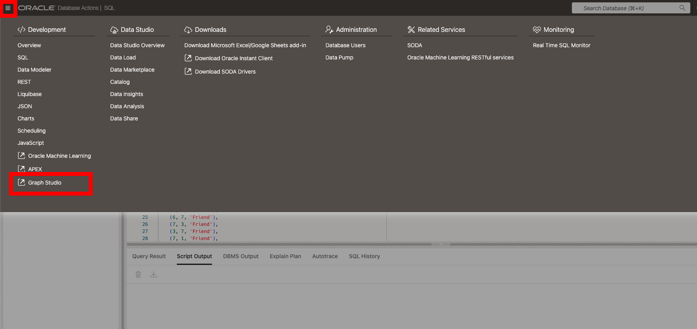
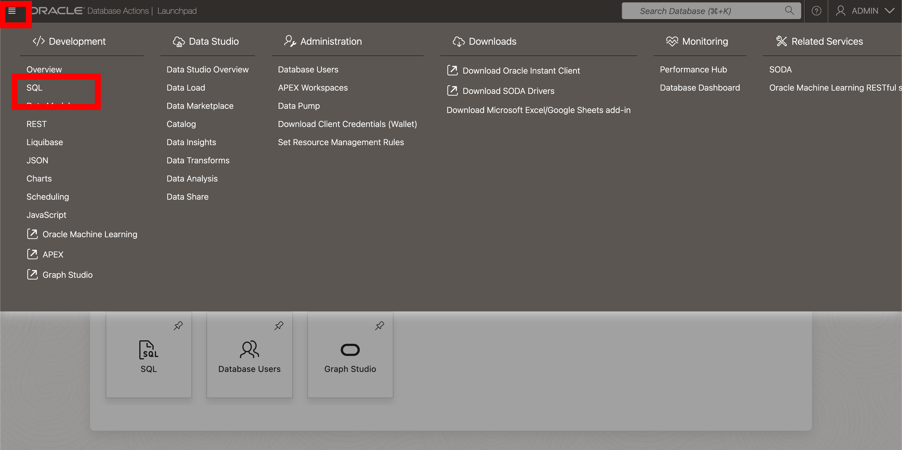

# Exploring SQL Property Graphs and SQL/PGQ in Oracle Database 23ai

## Introduction

Welcome to the "Exploring SQL Property Graphs and SQL/PGQ in Oracle Database 23ai" workshop. In this workshop, you will learn about the new SQL property graph feature, and the new SQL/PGQ syntax in Oracle Database 23ai. SQL Property Graphs enable you to define graph structures inside the database. This feature simplifies graph data analysis using SQL/PGQ queries.

Estimated Lab Time: 20 minutes


### Objective:

The objective of this workshop is to show you SQL property graphs and demo their practical use. By the end of this workshop, you will be able to create property graphs, query them using SQL/PGQ, and visualize the relationships within your data.

This lab is just a short overview of the functionality introduced with Property Graphs in Oracle Database 23ai and is meant to give you a small example of what is possible. For more in depth Property Graphs explanations and workshops check out the following labs

* [Graphs in the Oracle Database](https://livelabs.oracle.com/pls/apex/f?p=133:100:105582422382278::::SEARCH:graph)

### Prerequisites:
- Access to Oracle Database 23ai.
- Basic understanding of SQL is helpful.


## Task 1: Lab Setup

1. If you haven't done so already, from the Autonomous Database home page, **click** Database action and then **click** SQL.

    

2. Before we begin, this lab will be using Database Actions Web. If you're unfamiliar, please see the picture below for a simple explanation of the tool. You can click on the photo to enlarge it.

    

3. For this lab we will need a user. We'll call our user `DB23AI` and grant the user the new developer role and the graph developer role.

    ```
    <copy>
  -- USER SQL
  CREATE USER DB23AI IDENTIFIED BY Oracledb_4U#;

  -- ADD ROLES
  GRANT DB_DEVELOPER_ROLE TO DB23AI;

  GRANT CONNECT TO DB23AI;
  GRANT RESOURCE TO DB23AI;
  GRANT CONSOLE_DEVELOPER TO DB23AI;
  GRANT GRAPH_DEVELOPER TO DB23AI;


  -- REST ENABLE
  BEGIN
      ORDS_ADMIN.ENABLE_SCHEMA(
          p_enabled => TRUE,
          p_schema => 'DB23AI',
          p_url_mapping_type => 'BASE_PATH',
          p_url_mapping_pattern => 'db23ai',
          p_auto_rest_auth=> TRUE
      );
      -- ENABLE DATA SHARING
      C##ADP$SERVICE.DBMS_SHARE.ENABLE_SCHEMA(
              SCHEMA_NAME => 'DB23AI',
              ENABLED => TRUE
      );
      commit;
  END;
  /

  ALTER USER DB23AI DEFAULT ROLE CONSOLE_DEVELOPER,DB_DEVELOPER_ROLE,GRAPH_DEVELOPER;
  ALTER USER DB23AI GRANT CONNECT THROUGH GRAPH$PROXY_USER;

  -- QUOTA
  ALTER USER DB23AI QUOTA UNLIMITED ON DATA;

    </copy>
    ```

4. Now sign in as the new user. Click on the admin profile in the top right hand of Database Actions and sign out.

  

5. Sign in with the username **DB23AI** and password **Oracledb_4U#**

    

6. Click SQL to open the SQL editor.

  

7. Let's create some tables for our demo and add some data. We'll create a categories and products table. **Click the Copy button below** and paste the code into the SQL Editor. 

    Next, **click the Run Script button** inside the SQL Editor (shown in the picture below).

    <details>
        <summary>Click here if you want to view the tables and insert statements</summary>
        <div id="copy-box">
            <pre><code>

drop table if exists categories_tab cascade CONSTRAINTS;
drop table if exists product_information cascade CONSTRAINTS;

create table categories_tab(category_name varchar2(50),
                            category_description varchar2(1000),
                            category_id number(2) not null,
                            parent_category_id number(2));
                            
                            
create table product_information(product_id number(6) not null,
                                product_name varchar2(50),
                                category_id number(2),
                                supplier_id number(6),
                                product_status varchar2(20),
                                list_price number(8,2),
                                min_price  number(8,2),
                                catalog_url varchar2(50));
                                
alter table categories_tab add primary key (category_id);
alter table product_information add primary key(product_id);


INSERT INTO CATEGORIES_TAB (CATEGORY_NAME, CATEGORY_DESCRIPTION, CATEGORY_ID, PARENT_CATEGORY_ID)
VALUES
    ('hardware1', 'monitors', 11, 10),
    ('hardware2', 'printers', 12, 10),
    ('hardware3', 'harddisks', 13, 10),
    ('hardware4', 'memory components/upgrades', 14, 10),
    ('hardware5', 'processors, sound and video cards, network cards, motherboards', 15, 10),
    ('hardware6', 'keyboards, mouses, mouse pads', 16, 10),
    ('hardware7', 'other peripherals (CD-ROM, DVD, tape cartridge drives, ...)', 17, 10),
    ('hardware8', 'miscellaneous hardware (cables, screws, power supplies ...)', 19, 10),
    ('software1', 'spreadsheet software', 21, 20),
    ('software2', 'word processing software', 22, 20),
    ('software3', 'database software', 23, 20),
    ('software4', 'operating systems', 24, 20),
    ('software5', 'software development tools (including languages)', 25, 20),
    ('software6', 'miscellaneous software', 29, 20),
    ('office1', 'capitalizable assets (desks, chairs, phones ...)', 31, 30),
    ('office2', 'office supplies for daily use (pencils, erasers, staples, ...)', 32, 30),
    ('office3', 'manuals, other books', 33, 30),
    ('office4', 'miscellaneous office supplies', 39, 30),
    ('hardware', 'computer hardware and peripherals', 10, 90),
    ('software', 'computer software', 20, 90),
    ('office equipment', 'office furniture and supplies', 30, 90),
    ('online catalog', 'catalog of computer hardware, software, and office equipment', 90, NULL);

INSERT INTO PRODUCT_INFORMATION (PRODUCT_ID, PRODUCT_NAME, CATEGORY_ID, SUPPLIER_ID, PRODUCT_STATUS, LIST_PRICE, MIN_PRICE, CATALOG_URL)
VALUES
(1726,'LCD Monitor 11/PM',11,102067,'under development',259,208,'http://www.www.supp-102067.com/cat/hw/p1726.html'),
(2359,'LCD Monitor 9/PM',11,102061,'orderable',249,206,'http://www.www.supp-102061.com/cat/hw/p2359.html'),
(3060,'Monitor 17/HR',11,102081,'orderable',299,250,'http://www.supp-102081.com/cat/hw/p3060.html'),
(2243,'Monitor 17/HR/F',11,102060,'orderable',350,302,'http://www.supp-102060.com/cat/hw/p2243.html'),
(3057,'Monitor 17/SD',11,102055,'orderable',369,320,'http://www.supp-102055.com/cat/hw/p3057.html'),
(3061,'Monitor 19/SD',11,102094,'orderable',499,437,'http://www.supp-102094.com/cat/hw/p3061.html'),
(2245,'Monitor 19/SD/M',11,102053,'orderable',512,420,'http://www.supp-102053.com/cat/hw/p2245.html'),
(3065,'Monitor 21/D',11,102051,'orderable',999,875,'http://www.supp-102051.com/cat/hw/p3065.html'),
(3331,'Monitor 21/HR',11,102083,'orderable',879,785,'http://www.supp-102083.com/cat/hw/p3331.html'),
(2252,'Monitor 21/HR/M',11,102079,'obsolete',889,717,'http://www.supp-102079.com/cat/hw/p2252.html'),
(3064,'Monitor 21/SD',11,102096,'planned',1023,909,'http://www.supp-102096.com/cat/hw/p3064.html'),
(3155,'Monitor Hinge - HD',11,102092,'orderable',49,42,'http://www.supp-102092.com/cat/hw/p3155.html'),
(3234,'Monitor Hinge - STD',11,102072,'orderable',39,34,'http://www.supp-102072.com/cat/hw/p3234.html'),
(3350,'Plasma Monitor 10/LE/VGA',11,102068,'orderable',740,630,'http://www.supp-102068.com/cat/hw/p3350.html'),
(2236,'Plasma Monitor 10/TFT/XGA',11,102090,'under development',964,863,'http://www.supp-102090.com/cat/hw/p2236.html'),
(3054,'Plasma Monitor 10/XGA',11,102060,'orderable',600,519,'http://www.supp-102060.com/cat/hw/p3054.html'),
(1782,'Compact 400/DQ',12,102088,'obsolete',125,108,'http://www.supp-102088.com/cat/hw/p1782.html'),
(2430,'Compact 400/LQ',12,102087,'orderable',175,143,'http://www.supp-102087.com/cat/hw/p2430.html'),
(1792,'Industrial 600/DQ',12,102088,'orderable',225,180,'http://www.supp-102088.com/cat/hw/p1792.html'),
(1791,'Industrial 700/HD',12,102086,'orderable',275,239,'http://www.supp-102086.com/cat/hw/p1791.html'),
(2302,'Inkjet B/6',12,102096,'orderable',150,121,'http://www.supp-102096.com/cat/hw/p2302.html'),
(2453,'Inkjet C/4',12,102090,'orderable',195,174,'http://www.supp-102090.com/cat/hw/p2453.html'),
(1797,'Inkjet C/8/HQ',12,102094,'orderable',349,288,'http://www.supp-102094.com/cat/hw/p1797.html'),
(2459,'LaserPro 1200/8/BW',12,102099,'under development',699,568,'http://www.supp-102099.com/cat/hw/p2459.html'),
(3127,'LaserPro 600/6/BW',12,102087,'orderable',498,444,'http://www.supp-102087.com/cat/hw/p3127.html'),
(2254,'HD 10GB /I',13,102071,'obsolete',453,371,'http://www.supp-102071.com/cat/hw/p2254.html'),
(3353,'HD 10GB /R',13,102071,'obsolete',489,413,'http://www.supp-102071.com/cat/hw/p3353.html'),
(3069,'HD 10GB /S',13,102051,'obsolete',436,350,'http://www.supp-102051.com/cat/hw/p3069.html'),
(2253,'HD 10GB @5400 /SE',13,102069,'obsolete',399,322,'http://www.supp-102069.com/cat/hw/p2253.html'),
(3354,'HD 12GB /I',13,102066,'orderable',543,478,'http://www.supp-102066.com/cat/hw/p3354.html'),
(3072,'HD 12GB /N',13,102061,'orderable',567,507,'http://www.supp-102061.com/cat/hw/p3072.html'),
(3334,'HD 12GB /R',13,102090,'orderable',612,512,'http://www.supp-102090.com/cat/hw/p3334.html'),
(3071,'HD 12GB /S',13,102071,'orderable',633,553,'http://www.supp-102071.com/cat/hw/p3071.html'),
(2255,'HD 12GB @7200 /SE',13,102057,'orderable',775,628,'http://www.supp-102057.com/cat/hw/p2255.html'),
(1743,'HD 18.2GB @10000 /E',13,102078,'planned',800,661,'http://www.supp-102078.com/cat/hw/p1743.html'),
(2382,'HD 18.2GB@10000 /I',13,102050,'under development',850,731,'http://www.supp-102050.com/cat/hw/p2382.html'),
(3399,'HD 18GB /SE',13,102083,'under development',815,706,'http://www.supp-999999.com/cat/hw/p3333.html'),
(3073,'HD 6GB /I',13,102072,'obsolete',224,197,'http://www.supp-102083.com/cat/hw/p3073.html'),
(1768,'HD 8.2GB @5400',13,102093,'orderable',345,306,'http://www.supp-102093.com/cat/hw/p1768.html'),
(2410,'HD 8.4GB @5400',13,102061,'orderable',357,319,'http://www.supp-102061.com/cat/hw/p2410.html'),
(2257,'HD 8GB /I',13,102061,'orderable',399,338,'http://www.supp-102061.com/cat/hw/p2257.html'),
(3400,'HD 8GB /SE',13,102063,'orderable',389,337,'http://www.supp-102063.com/cat/hw/p3400.html'),
(3355,'HD 8GB /SI',13,102050,'orderable',null,null,'http://www.supp-102050.com/cat/hw/p3355.html'),
(1772,'HD 9.1GB @10000',13,102070,'orderable',456,393,'http://www.supp-102070.com/cat/hw/p1772.html'),
(2414,'HD 9.1GB @10000 /I',13,102098,'orderable',454,399,'http://www.supp-102098.com/cat/hw/p2414.html'),
(2415,'HD 9.1GB @7200',13,102063,'orderable',359,309,'http://www.supp-102063.com/cat/hw/p2415.html'),
(2395,'32MB Cache /M',14,102093,'orderable',123,109,'http://www.supp-102093.com/cat/hw/p2395.html'),
(1755,'32MB Cache /NM',14,102076,'orderable',121,99,'http://www.supp-102076.com/cat/hw/p1755.html'),
(2406,'64MB Cache /M',14,102059,'orderable',223,178,'http://www.supp-102059.com/cat/hw/p2406.html'),
(2404,'64MB Cache /NM',14,102087,'orderable',221,180,'http://www.supp-102087.com/cat/hw/p2404.html'),
(1770,'8MB Cache /NM',14,102050,'orderable',null,73,'http://www.supp-102050.com/cat/hw/p1770.html'),
(2412,'8MB EDO Memory',14,102058,'obsolete',98,83,'http://www.supp-102058.com/cat/hw/p2412.html'),
(2378,'DIMM - 128 MB',14,102050,'orderable',305,247,'http://www.supp-102050.com/cat/hw/p2378.html'),
(3087,'DIMM - 16 MB',14,102081,'obsolete',124,99,'http://www.supp-102081.com/cat/hw/p3087.html'),
(2384,'DIMM - 1GB',14,102074,'under development',599,479,'http://www.supp-102074.com/cat/hw/p2384.html'),
(1749,'DIMM - 256MB',14,102053,'orderable',337,300,'http://www.supp-102053.com/cat/hw/p1749.html'),
(1750,'DIMM - 2GB',14,102052,'orderable',699,560,'http://www.supp-102052.com/cat/hw/p1750.html'),
(2394,'DIMM - 32MB',14,102054,'orderable',128,106,'http://www.supp-102054.com/cat/hw/p2394.html'),
(2400,'DIMM - 512 MB',14,102098,'under development',448,380,'http://www.supp-102098.com/cat/hw/p2400.html'),
(1763,'DIMM - 64MB',14,102069,'orderable',247,202,'http://www.supp-102069.com/cat/hw/p1763.html'),
(2396,'EDO - 32MB',14,102051,'orderable',179,149,'http://www.supp-102051.com/cat/hw/p2396.html'),
(2272,'RAM - 16 MB',14,102074,'obsolete',135,110,'http://www.supp-102074.com/cat/hw/p2272.html'),
(2274,'RAM - 32 MB',14,102064,'orderable',161,135,'http://www.supp-102064.com/cat/hw/p2274.html'),
(3090,'RAM - 48 MB',14,102084,'orderable',193,170,'http://www.supp-102084.com/cat/hw/p3090.html'),
(1739,'SDRAM - 128 MB',14,102077,'orderable',299,248,'http://www.supp-102077.com/cat/hw/p1739.html'),
(3359,'SDRAM - 16 MB',14,102059,'orderable',111,99,'http://www.supp-102059.com/cat/hw/p3359.html'),
(3088,'SDRAM - 32 MB',14,102057,'orderable',258,220,'http://www.supp-102057.com/cat/hw/p3088.html'),
(2276,'SDRAM - 48 MB',14,102058,'orderable',269,215,'http://www.supp-102058.com/cat/hw/p2276.html'),
(3086,'VRAM - 16 MB',14,102056,'orderable',211,186,'http://www.supp-102056.com/cat/hw/p3086.html'),
(3091,'VRAM - 64 MB',14,102098,'orderable',279,243,'http://www.supp-102098.com/cat/hw/p3091.html'),
(1787,'CPU D300',15,102097,'orderable',101,90,'http://www.supp-102097.com/cat/hw/p1787.html'),
(2439,'CPU D400',15,102092,'orderable',123,105,'http://www.supp-102092.com/cat/hw/p2439.html'),
(1788,'CPU D600',15,102067,'orderable',178,149,'http://www.supp-102067.com/cat/hw/p1788.html'),
(2375,'GP 1024x768',15,102063,'orderable',78,69,'http://www.supp-102063.com/cat/hw/p2375.html'),
(2411,'GP 1280x1024',15,102061,'orderable',98,78,'http://www.supp-102061.com/cat/hw/p2411.html'),
(1769,'GP 800x600',15,102050,'orderable',48,null,'http://www.supp-102050.com/cat/hw/p1769.html'),
(2049,'MB - S300',15,102082,'obsolete',55,47,'http://www.supp-102082.com/cat/hw/p2049.html'),
(2751,'MB - S450',15,102072,'orderable',66,54,'http://www.supp-102072.com/cat/hw/p2751.html'),
(3112,'MB - S500',15,102086,'orderable',77,66,'http://www.supp-102086.com/cat/hw/p3112.html'),
(2752,'MB - S550',15,102086,'orderable',88,76,'http://www.supp-102086.com/cat/hw/p2752.html'),
(2293,'MB - S600',15,102086,'orderable',99,87,'http://www.supp-102086.com/cat/hw/p2293.html'),
(3114,'MB - S900/650+',15,102086,'under development',101,88,'http://www.supp-102086.com/cat/hw/p3114.html'),
(3129,'Sound Card STD',15,102090,'orderable',46,39,'http://www.supp-102090.com/cat/hw/p3129.html'),
(3133,'Video Card /32',15,102076,'orderable',48,41,'http://www.supp-102076.com/cat/hw/p3133.html'),
(2308,'Video Card /E32',15,102087,'orderable',58,48,'http://www.supp-102087.com/cat/hw/p2308.html'),
(2496,'WSP DA-130',15,102067,'planned',299,244,'http://www.supp-102067.com/cat/hw/p2496.html'),
(2497,'WSP DA-290',15,102053,'planned',399,355,'http://www.supp-102053.com/cat/hw/p2497.html'),
(3106,'KB 101/EN',16,102066,'orderable',48,41,'http://www.supp-102066.com/cat/hw/p3106.html'),
(2289,'KB 101/ES',16,102055,'orderable',48,38,'http://www.supp-102055.com/cat/hw/p2289.html'),
(3110,'KB 101/FR',16,102055,'orderable',48,39,'http://www.supp-102055.com/cat/hw/p3110.html'),
(3108,'KB E/EN',16,102055,'orderable',78,63,'http://www.supp-102055.com/cat/hw/p3108.html'),
(2058,'Mouse +WP',16,102055,'orderable',23,19,'http://www.supp-102055.com/cat/hw/p2058.html'),
(2761,'Mouse +WP/CL',16,102099,'planned',27,23,'http://www.supp-102099.com/cat/hw/p2761.html'),
(3117,'Mouse C/E',16,102099,'orderable',41,35,'http://www.supp-102099.com/cat/hw/p3117.html'),
(2056,'Mouse Pad /CL',16,102099,'planned',8,6,'http://www.supp-102099.com/cat/hw/p2056.html'),
(2211,'Wrist Pad',16,102072,'orderable',4,3,'http://www.supp-102072.com/cat/hw/p2211.html'),
(2944,'Wrist Pad /CL',16,102063,'under development',3,2,'http://www.supp-102063.com/cat/hw/p2944.html'),
(1742,'CD-ROM 500/16x',17,102052,'orderable',101,81,'http://www.supp-102052.com/cat/hw/p1742.html'),
(2402,'CD-ROM 600/E/24x',17,102052,'orderable',127,113,'http://www.supp-102052.com/cat/hw/p2402.html'),
(2403,'CD-ROM 600/I/24x',17,102052,'orderable',117,103,'http://www.supp-102052.com/cat/hw/p2403.html'),
(1761,'CD-ROM 600/I/32x',17,102052,'under development',134,119,'http://www.supp-102052.com/cat/hw/p1761.html'),
(2381,'CD-ROM 8x',17,102052,'obsolete',99,82,'http://www.supp-102052.com/cat/hw/p2381.html'),
(2424,'CDW 12/24',17,102075,'orderable',221,198,'http://www.supp-102075.com/cat/hw/p2424.html'),
(1781,'CDW 20/48/E',17,102060,'orderable',233,206,'http://www.supp-102060.com/cat/hw/p1781.html'),
(2264,'CDW 20/48/I',17,102060,'orderable',223,181,'http://www.supp-102060.com/cat/hw/p2264.html'),
(2260,'DFD 1.44/3.5',17,102062,'orderable',67,54,'http://www.supp-102062.com/cat/hw/p2260.html'),
(2266,'DVD 12x',17,102099,'orderable',333,270,'http://www.supp-102099.com/cat/hw/p2266.html'),
(3077,'DVD 8x',17,102099,'orderable',274,237,'http://www.supp-102099.com/cat/hw/p3077.html'),
(2259,'FD 1.44/3.5',17,102086,'orderable',39,32,'http://www.supp-102086.com/cat/hw/p2259.html'),
(2261,'FD 1.44/3.5/E',17,102086,'orderable',42,37,'http://www.supp-102086.com/cat/hw/p2261.html'),
(3082,'Modem - 56/90/E',17,102068,'orderable',81,72,'http://www.supp-102068.com/cat/hw/p3082.html'),
(2270,'Modem - 56/90/I',17,102068,'orderable',66,56,'http://www.supp-102068.com/cat/hw/p2270.html'),
(2268,'Modem - 56/H/E',17,102068,'obsolete',77,67,'http://www.supp-102068.com/cat/hw/p2268.html'),
(3083,'Modem - 56/H/I',17,102068,'orderable',67,56,'http://www.supp-102068.com/cat/hw/p3083.html'),
(2374,'Modem - C/100',17,102064,'orderable',65,54,'http://www.supp-102064.com/cat/hw/p2374.html'),
(1740,'TD 12GB/DAT',17,102075,'orderable',134,111,'http://www.supp-102075.com/cat/hw/p1740.html'),
(2409,'TD 7GB/8',17,102054,'orderable',210,177,'http://www.supp-102054.com/cat/hw/p2409.html'),
(2262,'ZIP 100',17,102054,'orderable',98,81,'http://www.supp-102054.com/cat/hw/p2262.html'),
(2522,'Battery - EL',19,102078,'orderable',44,39,'http://www.supp-102078.com/cat/hw/p2522.html'),
(2278,'Battery - NiHM',19,102078,'orderable',55,48,'http://www.supp-102078.com/cat/hw/p2278.html'),
(2418,'Battery Backup (DA-130)',19,102074,'orderable',61,52,'http://www.supp-102074.com/cat/hw/p2418.html'),
(2419,'Battery Backup (DA-290)',19,102074,'orderable',72,60,'http://www.supp-102074.com/cat/hw/p2419.html'),
(3097,'Cable Connector - 32R',19,102055,'orderable',3,2,'http://www.supp-102055.com/cat/hw/p3097.html'),
(3099,'Cable Harness',19,102055,'orderable',4,3,'http://www.supp-102055.com/cat/hw/p3099.html'),
(2380,'Cable PR/15/P',19,102055,'orderable',6,5,'http://www.supp-102055.com/cat/hw/p2380.html'),
(2408,'Cable PR/P/6',19,102055,'orderable',4,3,'http://www.supp-102055.com/cat/hw/p2408.html'),
(2457,'Cable PR/S/6',19,102055,'orderable',5,4,'http://www.supp-102055.com/cat/hw/p2457.html'),
(2373,'Cable RS232 10/AF',19,102055,'orderable',6,4,'http://www.supp-102055.com/cat/hw/p2373.html'),
(1734,'Cable RS232 10/AM',19,102055,'orderable',6,5,'http://www.supp-102055.com/cat/hw/p1734.html'),
(1737,'Cable SCSI 10/FW/ADS',19,102095,'orderable',8,6,'http://www.supp-102095.com/cat/hw/p1737.html'),
(1745,'Cable SCSI 20/WD->D',19,102095,'orderable',9,7,'http://www.supp-102095.com/cat/hw/p1745.html'),
(2982,'Drive Mount - A',19,102057,'orderable',44,35,'http://www.supp-102057.com/cat/hw/p2982.html'),
(3277,'Drive Mount - A/T',19,102057,'orderable',36,29,'http://www.supp-102057.com/cat/hw/p3277.html'),
(2976,'Drive Mount - D',19,102057,'orderable',52,44,'http://www.supp-102057.com/cat/hw/p2976.html'),
(3204,'Envoy DS',19,102060,'orderable',126,107,'http://www.supp-102060.com/cat/hw/p3204.html'),
(2638,'Envoy DS/E',19,102060,'orderable',137,111,'http://www.supp-102060.com/cat/hw/p2638.html'),
(3020,'Envoy IC',19,102060,'orderable',449,366,'http://www.supp-102060.com/cat/hw/p3020.html'),
(1948,'Envoy IC/58',19,102060,'orderable',498,428,'http://www.supp-102060.com/cat/hw/p1948.html'),
(3003,'Laptop 128/12/56/v90/110',19,102060,'orderable',3219,2606,'http://www.supp-102060.com/cat/hw/p3003.html'),
(2999,'Laptop 16/8/110',19,102060,'obsolete',999,800,'http://www.supp-102060.com/cat/hw/p2999.html'),
(3000,'Laptop 32/10/56',19,102060,'orderable',1749,1542,'http://www.supp-102060.com/cat/hw/p3000.html'),
(3001,'Laptop 48/10/56/110',19,102060,'obsolete',2556,2073,'http://www.supp-102060.com/cat/hw/p3001.html'),
(3004,'Laptop 64/10/56/220',19,102060,'orderable',2768,2275,'http://www.supp-102060.com/cat/hw/p3004.html'),
(3391,'PS 110/220',19,102062,'orderable',85,75,'http://www.supp-102062.com/cat/hw/p3391.html'),
(3124,'PS 110V /T',19,102062,'orderable',84,70,'http://www.supp-102062.com/cat/hw/p3124.html'),
(1738,'PS 110V /US',19,102062,'orderable',86,70,'http://www.supp-102062.com/cat/hw/p1738.html'),
(2377,'PS 110V HS/US',19,102062,'orderable',97,82,'http://www.supp-102062.com/cat/hw/p2377.html'),
(2299,'PS 12V /P',19,102062,'orderable',76,64,'http://www.supp-102062.com/cat/hw/p2299.html'),
(3123,'PS 220V /D',19,102062,'orderable',81,65,'http://www.supp-102062.com/cat/hw/p3123.html'),
(1748,'PS 220V /EUR',19,102053,'orderable',83,70,'http://www.supp-102053.com/cat/hw/p1748.html'),
(2387,'PS 220V /FR',19,102053,'orderable',83,66,'http://www.supp-102053.com/cat/hw/p2387.html'),
(2370,'PS 220V /HS/FR',19,102053,'orderable',91,75,'http://www.supp-102053.com/cat/hw/p2370.html'),
(2311,'PS 220V /L',19,102053,'orderable',95,79,'http://www.supp-102053.com/cat/hw/p2311.html'),
(1733,'PS 220V /UK',19,102080,'orderable',89,76,'http://www.supp-102080.com/cat/hw/p1733.html'),
(2878,'Router - ASR/2W',19,102063,'orderable',345,305,'http://www.supp-102063.com/cat/hw/p2878.html'),
(2879,'Router - ASR/3W',19,102063,'orderable',456,384,'http://www.supp-102063.com/cat/hw/p2879.html'),
(2152,'Router - DTMF4',19,102063,'obsolete',231,191,'http://www.supp-102063.com/cat/hw/p2152.html'),
(3301,'Screws <B.28.P>',19,102071,'orderable',15,12,'http://www.supp-102071.com/cat/hw/p3301.html'),
(3143,'Screws <B.28.S>',19,102071,'orderable',16,13,'http://www.supp-102071.com/cat/hw/p3143.html'),
(2323,'Screws <B.32.P>',19,102071,'orderable',18,14,'http://www.supp-102071.com/cat/hw/p2323.html'),
(3134,'Screws <B.32.S>',19,102071,'orderable',18,15,'http://www.supp-102071.com/cat/hw/p3134.html'),
(3139,'Screws <S.16.S>',19,102071,'orderable',21,17,'http://www.supp-102071.com/cat/hw/p3139.html'),
(3300,'Screws <S.32.P>',19,102071,'orderable',23,19,'http://www.supp-102071.com/cat/hw/p3300.html'),
(2316,'Screws <S.32.S>',19,102074,'orderable',22,19,'http://www.supp-102074.com/cat/hw/p2316.html'),
(3140,'Screws <Z.16.S>',19,102074,'orderable',24,19,'http://www.supp-102074.com/cat/hw/p3140.html'),
(2319,'Screws <Z.24.S>',19,102074,'orderable',25,21,'http://www.supp-102074.com/cat/hw/p2319.html'),
(2322,'Screws <Z.28.P>',19,102076,'orderable',23,18,'http://www.supp-102076.com/cat/hw/p2322.html'),
(3178,'Spreadsheet - SSP/V 2.0',21,103080,'orderable',45,37,'http://www.supp-103080.com/cat/sw/p3178.html'),
(3179,'Spreadsheet - SSS/S 2.1',21,103080,'orderable',50,44,'http://www.supp-103080.com/cat/sw/p3179.html'),
(3182,'Word Processing - SWP/V 4.5',22,103093,'orderable',65,54,'http://www.supp-103093.com/cat/sw/p3182.html'),
(3183,'Word Processing - SWS/V 4.5',22,103093,'orderable',50,40,'http://www.supp-103093.com/cat/sw/p3183.html'),
(3197,'Spreadsheet - SSS/V 2.1',21,103080,'orderable',45,36,'http://www.supp-103080.com/cat/sw/p3197.html'),
(3255,'Spreadsheet - SSS/CD 2.2B',21,103080,'orderable',35,30,'http://www.supp-103080.com/cat/sw/p3255.html'),
(3256,'Spreadsheet - SSS/V 2.0',21,103080,'orderable',40,34,'http://www.supp-103080.com/cat/sw/p3256.html'),
(3260,'Word Processing - SWP/S 4.4',22,103093,'orderable',50,41,'http://www.supp-103093.com/cat/sw/p3260.html'),
(3262,'Spreadsheet - SSS/S 2.2',21,103080,'under development',50,41,'http://www.supp-103080.com/cat/sw/p3262.html'),
(3361,'Spreadsheet - SSP/S 1.5',21,103080,'orderable',40,34,'http://www.supp-103080.com/cat/sw/p3361.html'),
(1799,'SPNIX3.3 - SL',24,103092,'orderable',1000,874,'http://www.supp-103092.com/cat/sw/p1799.html'),
(1801,'SPNIX3.3 - AL',24,103092,'orderable',100,88,'http://www.supp-103092.com/cat/sw/p1801.html'),
(1803,'SPNIX3.3 - DL',24,103092,'orderable',60,51,'http://www.supp-103092.com/cat/sw/p1803.html'),
(1804,'SPNIX3.3 - UL/N',24,103092,'orderable',65,56,'http://www.supp-103092.com/cat/sw/p1804.html'),
(1805,'SPNIX3.3 - UL/A',24,103092,'orderable',50,42,'http://www.supp-103092.com/cat/sw/p1805.html'),
(1806,'SPNIX3.3 - UL/C',24,103092,'orderable',50,42,'http://www.supp-103092.com/cat/sw/p1806.html'),
(1808,'SPNIX3.3 - UL/D',24,103092,'orderable',55,46,'http://www.supp-103092.com/cat/sw/p1808.html'),
(1820,'SPNIX3.3 - NL',24,103092,'orderable',55,45,'http://www.supp-103092.com/cat/sw/p1820.html'),
(1822,'SPNIX4.0 - SL',24,103092,'orderable',1500,1303,'http://www.supp-103092.com/cat/sw/p1822.html'),
(2422,'SPNIX4.0 - SAL',24,103092,'orderable',150,130,'http://www.supp-103092.com/cat/sw/p2422.html'),
(2452,'SPNIX4.0 - DL',24,103092,'orderable',100,88,'http://www.supp-103092.com/cat/sw/p2452.html'),
(2462,'SPNIX4.0 - UL/N',24,103092,'orderable',80,71,'http://www.supp-103092.com/cat/sw/p2462.html'),
(2464,'SPNIX4.0 - UL/A',24,103092,'orderable',70,62,'http://www.supp-103092.com/cat/sw/p2464.html'),
(2467,'SPNIX4.0 - UL/D',24,103092,'orderable',80,64,'http://www.supp-103092.com/cat/sw/p2467.html'),
(2468,'SPNIX4.0 - UL/C',24,103092,'orderable',75,67,'http://www.supp-103092.com/cat/sw/p2468.html'),
(2470,'SPNIX4.0 - NL',24,103092,'orderable',80,70,'http://www.supp-103092.com/cat/sw/p2470.html'),
(2471,'SPNIX3.3 SU',24,103092,'orderable',500,439,'http://www.supp-103092.com/cat/sw/p2471.html'),
(2492,'SPNIX3.3 AU',24,103092,'orderable',45,38,'http://www.supp-103092.com/cat/sw/p2492.html'),
(2493,'SPNIX3.3 C/DU',24,103092,'orderable',25,22,'http://www.supp-103092.com/cat/sw/p2493.html'),
(2494,'SPNIX3.3 NU',24,103092,'orderable',25,20,'http://www.supp-103092.com/cat/sw/p2494.html'),
(2995,'SPNIX3.3 SAU',24,103092,'orderable',70,62,'http://www.supp-103092.com/cat/sw/p2995.html'),
(3290,'SPNIX3.3 DU',24,103092,'orderable',65,55,'http://www.supp-103092.com/cat/sw/p3290.html'),
(1778,'C for SPNIX3.3 - 1 Seat',25,103092,'orderable',62,52,'http://www.supp-103092.com/cat/sw/p1778.html'),
(1779,'C for SPNIX3.3 - Doc',25,103092,'orderable',128,112,'http://www.supp-103092.com/cat/sw/p1779.html'),
(1780,'C for SPNIX3.3 - Sys',25,103092,'orderable',450,385,'http://www.supp-103092.com/cat/sw/p1780.html'),
(2371,'C for SPNIX4.0 - Doc',25,103092,'orderable',146,119,'http://www.supp-103092.com/cat/sw/p2371.html'),
(2423,'C for SPNIX4.0 - 1 Seat',25,103092,'orderable',84,73,'http://www.supp-103092.com/cat/sw/p2423.html'),
(3501,'C for SPNIX4.0 - Sys',25,103092,'orderable',555,448,'http://www.supp-103092.com/cat/sw/p3501.html'),
(3502,'C for SPNIX3.3 -Sys/U',25,103092,'orderable',105,88,'http://www.supp-103092.com/cat/sw/p3502.html'),
(3503,'C for SPNIX3.3 - Seat/U',25,103092,'orderable',22,18,'http://www.supp-103092.com/cat/sw/p3503.html'),
(1774,'Base ISO CP - BL',29,103088,'orderable',110,93,'http://www.supp-103088.com/cat/sw/p1774.html'),
(1775,'Client ISO CP - S',29,103087,'orderable',27,22,'http://www.supp-103087.com/cat/sw/p1775.html'),
(1794,'OSI 8-16/IL',29,103096,'orderable',128,112,'http://www.supp-103096.com/cat/sw/p1794.html'),
(1825,'X25 - 1 Line License',29,103093,'orderable',25,21,'http://www.supp-103093.com/cat/sw/p1825.html'),
(2004,'IC Browser - S',29,103086,'orderable',90,80,'http://www.supp-103086.com/cat/sw/p2004.html'),
(2005,'IC Browser Doc - S',29,103086,'orderable',115,100,'http://www.supp-103086.com/cat/sw/p2005.html'),
(2416,'Client ISO CP - S',29,103088,'orderable',41,36,'http://www.supp-103088.com/cat/sw/p2416.html'),
(2417,'Client ISO CP - V',29,103088,'orderable',33,27,'http://www.supp-103088.com/cat/sw/p2417.html'),
(2449,'OSI 1-4/IL',29,103088,'orderable',83,72,'http://www.supp-103088.com/cat/sw/p2449.html'),
(3101,'IC Browser - V',29,103086,'orderable',75,67,'http://www.supp-103086.com/cat/sw/p3101.html'),
(3170,'Smart Suite - V/SP',29,103089,'orderable',161,132,'http://www.supp-103089.com/cat/sw/p3170.html'),
(3171,'Smart Suite - S3.3/EN',29,103089,'orderable',148,120,'http://www.supp-103089.com/cat/sw/p3171.html'),
(3172,'Graphics - DIK+',29,103094,'orderable',42,34,'http://www.supp-103094.com/cat/sw/p3172.html'),
(3173,'Graphics - SA',29,103094,'orderable',86,72,'http://www.supp-103094.com/cat/sw/p3173.html'),
(3175,'Project Management - S4.0',29,103089,'orderable',37,32,'http://www.supp-103089.com/cat/sw/p3175.html'),
(3176,'Smart Suite - V/EN',29,103089,'orderable',120,103,'http://www.supp-103089.com/cat/sw/p3176.html'),
(3177,'Smart Suite - V/FR',29,103089,'orderable',120,102,'http://www.supp-103089.com/cat/sw/p3177.html'),
(3245,'Smart Suite - S4.0/FR',29,103089,'orderable',222,195,'http://www.supp-103089.com/cat/sw/p3245.html'),
(3246,'Smart Suite - S4.0/SP',29,103089,'orderable',222,193,'http://www.supp-103089.com/cat/sw/p3246.html'),
(3247,'Smart Suite - V/DE',29,103089,'orderable',120,96,'http://www.supp-103089.com/cat/sw/p3247.html'),
(3248,'Smart Suite - S4.0/DE',29,103089,'orderable',222,193,'http://www.supp-103089.com/cat/sw/p3248.html'),
(3250,'Graphics - DIK',29,103083,'orderable',28,24,'http://www.supp-103083.com/cat/sw/p3250.html'),
(3251,'Project Management - V',29,103093,'orderable',31,26,'http://www.supp-103093.com/cat/sw/p3251.html'),
(3252,'Project Management - S3.3',29,103093,'orderable',26,23,'http://www.supp-103093.com/cat/sw/p3252.html'),
(3253,'Smart Suite - S4.0/EN',29,103089,'orderable',222,188,'http://www.supp-103089.com/cat/sw/p3253.html'),
(3257,'Web Browser - SB/S 2.1',29,103082,'orderable',66,58,'http://www.supp-103082.com/cat/sw/p3257.html'),
(3258,'Web Browser - SB/V 1.0',29,103082,'orderable',80,70,'http://www.supp-103082.com/cat/sw/p3258.html'),
(3362,'Web Browser - SB/S 4.0',29,103082,'orderable',99,81,'http://www.supp-103082.com/cat/sw/p3362.html'),
(2231,'Desk - S/V',31,103082,'orderable',2510,2114,'http://www.supp-103082.com/cat/off/p2231.html'),
(2335,'Mobile phone',31,103088,'orderable',100,83,'http://www.supp-103088.com/cat/off/p2335.html'),
(2350,'Desk - W/48',31,103082,'orderable',2500,2129,'http://www.supp-103082.com/cat/off/p2350.html'),
(2351,'Desk - W/48/R',31,103082,'orderable',2900,2386,'http://www.supp-103082.com/cat/off/p2351.html'),
(2779,'Desk - OS/O/F',31,103082,'orderable',3980,3347,'http://www.supp-103082.com/cat/off/p2779.html'),
(3337,'Mobile Web Phone',31,103088,'orderable',800,666,'http://www.supp-103088.com/cat/off/p3337.html'),
(2091,'Paper Tablet LW 8 1/2 x 11',32,103095,'orderable',1,0,'http://www.supp-103095.com/cat/off/p2091.html'),
(2093,'Pens - 10/FP',32,103090,'orderable',8,7,'http://www.supp-103090.com/cat/off/p2093.html'),
(2144,'Card Organizer Cover',32,103094,'orderable',18,14,'http://www.supp-103094.com/cat/off/p2144.html'),
(2336,'Business Cards Box - 250',32,103091,'orderable',55,49,'http://www.supp-103091.com/cat/off/p2336.html'),
(2337,'Business Cards - 1000/2L',32,103091,'orderable',300,246,'http://www.supp-103091.com/cat/off/p2337.html'),
(2339,'Paper - Std Printer',32,103095,'orderable',25,21,'http://www.supp-103095.com/cat/off/p2339.html'),
(2536,'Business Cards - 250/2L',32,103091,'orderable',80,68,'http://www.supp-103091.com/cat/off/p2536.html'),
(2537,'Business Cards Box - 1000',32,103091,'orderable',200,176,'http://www.supp-103091.com/cat/off/p2537.html'),
(2783,'Clips - Paper',32,103080,'orderable',10,8,'http://www.supp-103080.com/cat/off/p2783.html'),
(2808,'Paper Tablet LY 8 1/2 x 11',32,103098,'orderable',1,0,'http://www.supp-103098.com/cat/off/p2808.html'),
(2810,'Inkvisible Pens',32,103095,'orderable',6,4,'http://www.supp-103095.com/cat/off/p2810.html'),
(2870,'Pencil - Mech',32,103097,'orderable',5,4,'http://www.supp-103097.com/cat/off/p2870.html'),
(3051,'Pens - 10/MP',32,103097,'orderable',12,10,'http://www.supp-103097.com/cat/off/p3051.html'),
(3150,'Card Holder - 25',32,103089,'orderable',18,15,'http://www.supp-103089.com/cat/off/p3150.html'),
(3208,'Pencils - Wood',32,103097,'orderable',2,1,'http://www.supp-103097.com/cat/off/p3208.html'),
(3209,'Sharpener - Pencil',32,103096,'orderable',13,11,'http://www.supp-103096.com/cat/off/p3209.html'),
(3224,'Card Organizer - 250',32,103095,'orderable',32,28,'http://www.supp-103095.com/cat/off/p3224.html'),
(3225,'Card Organizer - 1000',32,103095,'orderable',47,39,'http://www.supp-103095.com/cat/off/p3225.html'),
(3511,'Paper - HQ Printer',32,103080,'orderable',9,7,'http://www.supp-103080.com/cat/off/p3511.html'),
(3515,'Lead Replacement',32,103095,'orderable',2,1,'http://www.supp-103095.com/cat/off/p3515.html'),
(2986,'Manual - Vision OS/2x +',33,103095,'orderable',125,111,'http://www.supp-103095.com/cat/off/p2986.html'),
(3163,'Manual - Vision Net6.3/US',33,103083,'orderable',35,29,'http://www.supp-103083.com/cat/off/p3163.html'),
(3165,'Manual - Vision Tools2.0',33,103083,'orderable',40,34,'http://www.supp-103083.com/cat/off/p3165.html'),
(3167,'Manual - Vision OS/2.x',33,103083,'orderable',55,47,'http://www.supp-103083.com/cat/off/p3167.html'),
(3216,'Manual - Vision Net6.3',33,103083,'orderable',30,26,'http://www.supp-103083.com/cat/off/p3216.html'),
(3220,'Manual - Vision OS/1.2',33,103083,'orderable',45,36,'http://www.supp-103083.com/cat/off/p3220.html'),
(1729,'Chemicals - RCP',39,103094,'orderable',80,66,'http://www.supp-103094.com/cat/off/p1729.html'),
(1910,'FG Stock - H',39,103083,'orderable',14,11,'http://www.supp-103083.com/cat/off/p1910.html'),
(1912,'SS Stock - 3mm',39,103083,'orderable',15,12,'http://www.supp-103083.com/cat/off/p1912.html'),
(1940,'ESD Bracelet/Clip',39,103095,'orderable',18,14,'http://www.supp-103095.com/cat/off/p1940.html'),
(2030,'Latex Gloves',39,103097,'orderable',12,10,'http://www.supp-103097.com/cat/off/p2030.html'),
(2326,'Plastic Stock - Y',39,103093,'orderable',2,1,'http://www.supp-103093.com/cat/off/p2326.html'),
(2330,'Plastic Stock - R',39,103093,'orderable',2,1,'http://www.supp-103093.com/cat/off/p2330.html'),
(2334,'Resin',39,103087,'orderable',4,3,'http://www.supp-103087.com/cat/off/p2334.html'),
(2340,'Chemicals - SW',39,103094,'orderable',72,59,'http://www.supp-103094.com/cat/off/p2340.html'),
(2365,'Chemicals - TCS',39,103094,'orderable',78,69,'http://www.supp-103094.com/cat/off/p2365.html'),
(2594,'FG Stock - L',39,103098,'orderable',9,7,'http://www.supp-103098.com/cat/off/p2594.html'),
(2596,'SS Stock - 1mm',39,103098,'orderable',12,10,'http://www.supp-103098.com/cat/off/p2596.html'),
(2631,'ESD Bracelet/QR',39,103085,'orderable',15,12,'http://www.supp-103085.com/cat/off/p2631.html'),
(2721,'PC Bag - L/S',39,103095,'orderable',87,70,'http://www.supp-103095.com/cat/off/p2721.html'),
(2722,'PC Bag - L/D',39,103095,'orderable',112,99,'http://www.supp-103095.com/cat/off/p2722.html'),
(2725,'Machine Oil',39,103098,'orderable',4,3,'http://www.supp-103098.com/cat/off/p2725.html'),
(2782,'PC Bag - C/S',39,103095,'orderable',62,50,'http://www.supp-103095.com/cat/off/p2782.html'),
(3187,'Plastic Stock - B/HD',39,103095,'orderable',3,2,'http://www.supp-103095.com/cat/off/p3187.html'),
(3189,'Plastic Stock - G',39,103095,'orderable',2,1,'http://www.supp-103095.com/cat/off/p3189.html'),
(3191,'Plastic Stock - O',39,103095,'orderable',2,1,'http://www.supp-103095.com/cat/off/p3191.html'),
(3193,'Plastic Stock - W/HD',39,103095,'orderable',3,2,'http://www.supp-103095.com/cat/off/p3193.html');

            </code></pre>
        </div>
        </details>
        <button id="copy-btn" onclick="copyToClipboard('#copy-box code')">
            Copy 
            <span id="copy-icon" style="display: none;">✔</span>
        </button>
        <script>
        function copyToClipboard(element) {
            var temp = document.createElement('textarea');
            temp.value = document.querySelector(element).textContent;
            document.body.appendChild(temp);
            temp.select();
            document.execCommand('copy');
            document.body.removeChild(temp);
            // Show the checkmark icon
            var copyIcon = document.getElementById('copy-icon');
            copyIcon.style.display = 'inline';
            // Hide the checkmark icon after 2 seconds
            setTimeout(function() {
                copyIcon.style.display = 'none';
            }, 2000);
        }
        </script>

    


## Task 2: Creating Property Graphs  

1. First we're going to take a look at Graph Studio. Graph Studio will be used so that we can visualize graphs natively inside the GUI. Click the hamburger menu and then select Graph Studio.

    

2. Login with our db23ai user credentials.

    Username: db23ai
    Password: Oracledb_4U#

    

3. Inside Graph Studio, click on Notebooks.

    

4. Select **import** in the upper right hand corner.

    

5. Click the link to download the pre-created notebook. We will explain the code below.

    * [Download the Graph Notebook](https://c4u04.objectstorage.us-ashburn-1.oci.customer-oci.com/p/EcTjWk2IuZPZeNnD_fYMcgUhdNDIDA6rt9gaFj_WZMiL7VvxPBNMY60837hu5hga/n/c4u04/b/livelabsfiles/o/labfiles/23ai_demo.dsnb)

6. Either drag and drop the notebook that was just downloaded inside of graph studio, or click inside the Drag and Drop field to upload the file.
    

7. **Click import** and wait for the notebook to open 
    

8. If the compute environment pops up, wait for it to finish.
     

9. Property graphs give you a different way of looking at your data. With Property Graphs you model data with edges and nodes. Edges represent the relationships that exist between our nodes (also called vertices). 

    In Oracle Database 23ai we can create property graphs inside the database. These property graphs allow us to map the vertices and edges to new or existing tables, external tables, materialized views or synonyms to these objects inside the database. 
    
    The property graphs are stored as metadata inside the database meaning they don't store the actual data. Rather, the data is still stored in the underlying objects and we use the SQL/PQG syntax to interact with the property graphs.

    "Why not do this in SQL?" The short answer is, you can. However, it may not be simple. Modeling graphs inside the database using SQL can be difficult and cumbersome and could require complex SQL code to accurately represent and query all aspects of a graph.

    This is where property graphs come in. Property graphs make the process of working with interconnected data, like identifying influencers in a social network, predicting trends and customer behavior, discovering relationships based on pattern matching and more by providing a more natural and efficient way to model and query them. Let's take a look at how to create property graphs and query them using the SQL/PGQ extension.

10. Let's now run this notebook. **Click the play button** to run all of the paragraphs in the notebook. See the picture below for reference
    


11. Follow along inside the notebook. Once complete, come back and start Task 3

## Task 3: Clean up

1. We'll now switch back to the SQL Editor (database actions). Find that tab at the top of your browser.

2. Now sign out of the DB23AI user and sign back in with the **admin** user. 

    If you've forgotten your password, it can be found by clicking the **View login info** button in the top left of these instruction. The gif below shows you how to find the password.  

    

3. Now using the password we found above, sign in as the admin user. 

    

4. Using the hamburger menu in the upper left hand corner of the screen, find and open the SQL Editor

    


5. Just in case the DB23AI user still has an active session we can run the following to terminate any active sessions.

    ```
    <copy>

    BEGIN
    FOR session IN (SELECT SID, SERIAL# FROM V$SESSION WHERE USERNAME = 'DB23AI') LOOP
        EXECUTE IMMEDIATE 'ALTER SYSTEM KILL SESSION ''' || session.SID || ',' || session.SERIAL# || ''' IMMEDIATE';
    END LOOP;
    END;

    </copy>
    ```
    

5. Now drop the user

    ```
    <copy>
    DROP USER DB23AI CASCADE;
    </copy>
    ```


You may now **proceed to the next lab** 

## Learn More

* [Graph Developer's Guide for Property Graph](https://docs.oracle.com/en/database/oracle/property-graph/24.2/spgdg/index.html)
* [New! Discover connections with SQL Property Graphs](https://blogs.oracle.com/database/post/sql-property-graphs-in-oracle-autonomous-database)

## Acknowledgements
* **Author** - Killian Lynch, Database Product Management
* **Contributors** - Dom Giles, Distinguished Database Product Manager
* **Last Updated By/Date** - Killian Lynch, December 2024
