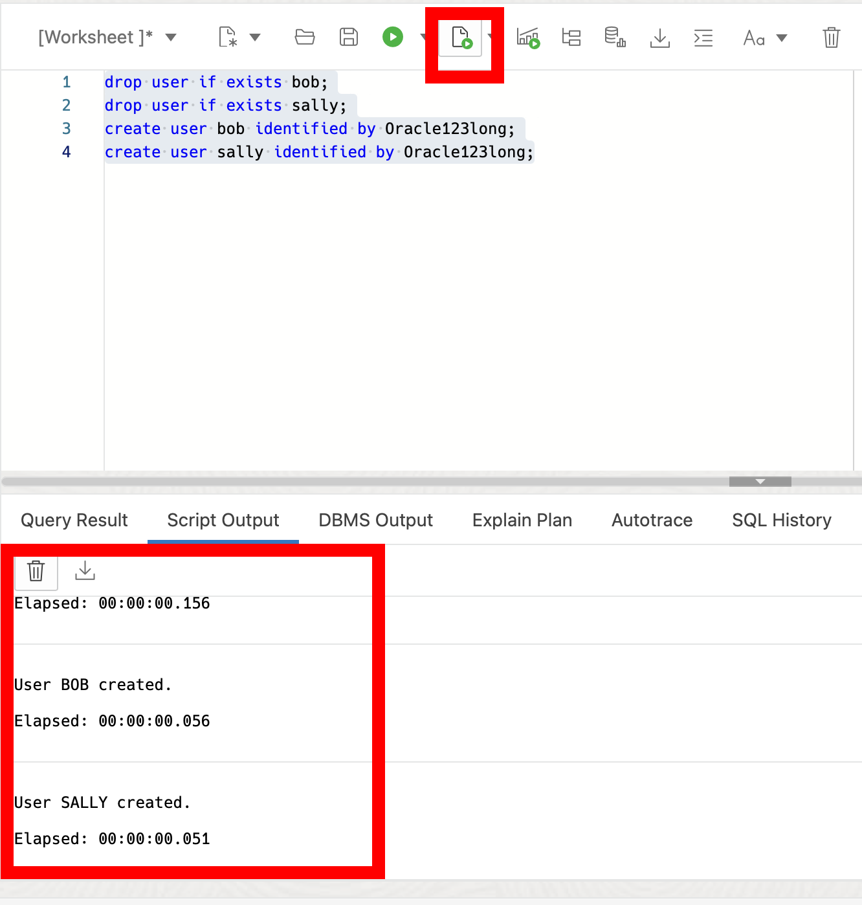
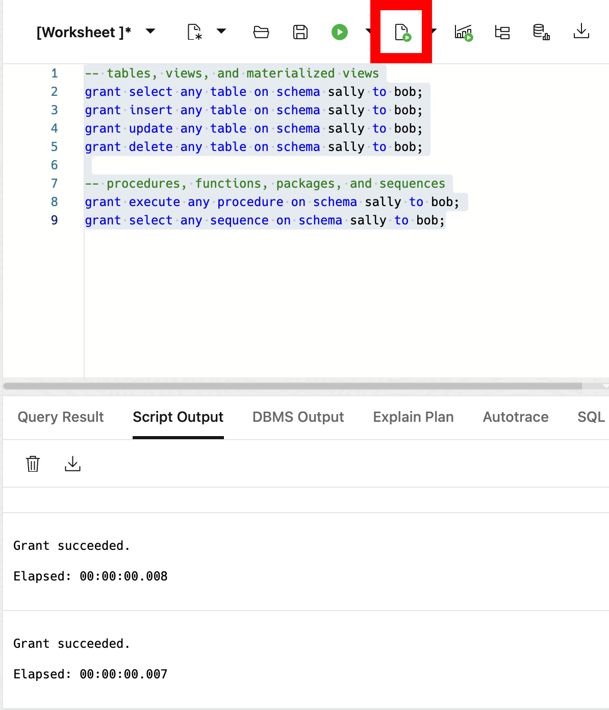
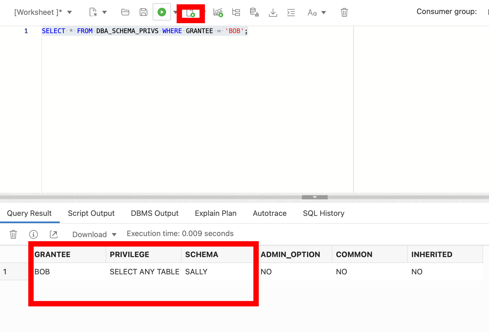
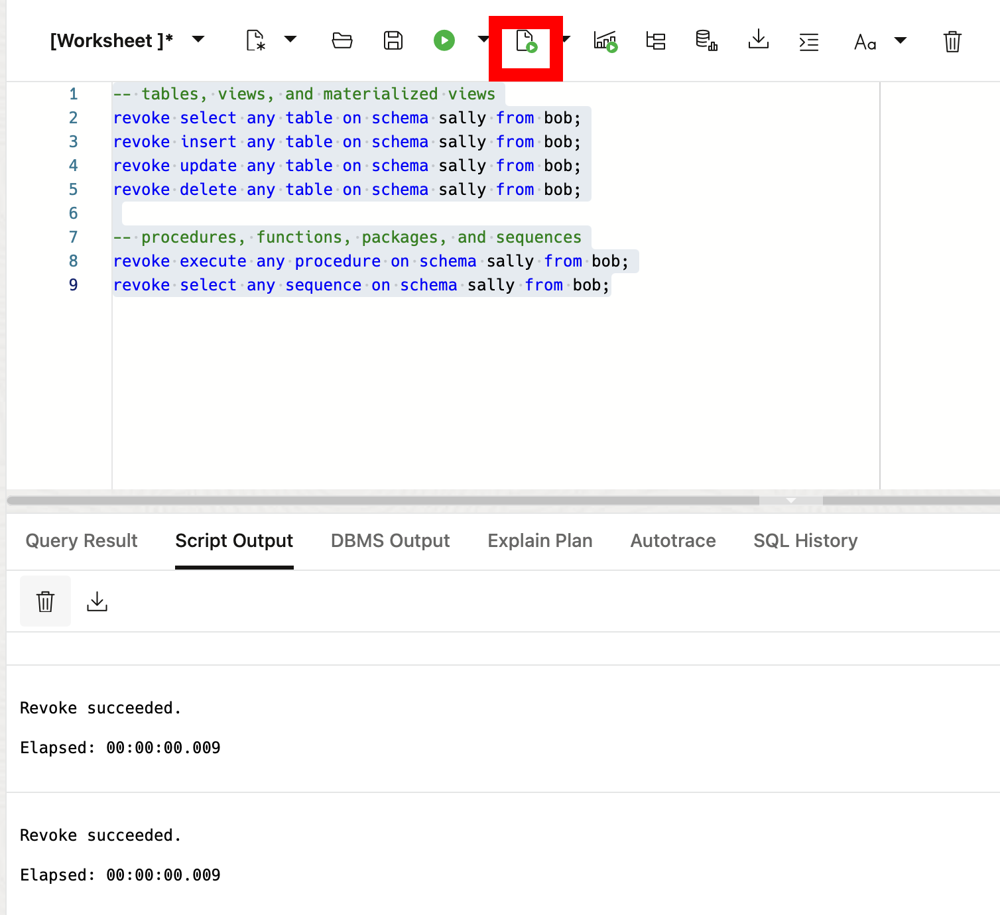

# Working with Schema-Level Privileges

## Introduction

Welcome to the Working with Schema-Level Privileges lab. In this lab, you will learn how to work with the new schema-level privilege management feature introduced in Oracle Database 23ai. 

**_Estimated Lab Time: 10 minutes_**

### **Objective**
The objective of this workshop is to learn how to work with the schema-level privilege grant in Oracle Database 23ai and demonstrate its practical applications for managing access to application schemas in an easy way. 

### **Prerequisites**
- Access to Oracle Database 23ai.
- Basic understanding of database schemas and privileges is recommended but not required.

## Task 1: Understanding Schema-Level Privileges

1. Before we get into the code examples, let's briefly talk about the traditional methods of privilege management in Oracle databases.

    * **Individual Privilege Grants**: This involves granting individual privileges on each table or view in the application schema. While granular, it's cumbersome and could cause user errors, especially with schema changes.

    * **ANY Privileges**: Granting "ANY" privileges (e.g., `SELECT ANY TABLE`) provides broad access but compromises security by granting excessive permissions.

    * Oracle Database 23ai introduces a simpler approach: **Schema-Level Privileges**. This allows granting privileges at the schema level, offering a balance between granularity and convenience.

## Task 2: Benefiting from Schema-Level Privileges

1. From the Autonomous Database home page, **click** Database action and then **click** SQL.
    

2. Let's now look at the syntax and usage of schema-level privileges in Oracle Database 23ai. First, we'll add a couple of test users.

    ```
    <copy>
    drop user if exists bob cascade;
    drop user if exists sally cascade;
    create user bob identified by Oracle123long;
    create user sally identified by Oracle123long;
    </copy>
    ```
    

    Now we can grant our bob user various privileges to other users or roles. 

    ```
    <copy>
    -- tables, views, and materialized views
    grant select any table on schema sally to bob;
    grant insert any table on schema sally to bob;
    grant update any table on schema sally to bob;
    grant delete any table on schema sally to bob;

    -- procedures, functions, packages, and sequences
    grant execute any procedure on schema sally to bob;
    grant select any sequence on schema sally to bob;
    </copy>
    ```

    

    These grants provides user bob with select, insert, update, delete, execute any procedures, functions, packages, and select sequence privileges on all tables and views within the schema sally. 

3. Schema-level privileges dynamically adapt to schema changes. If new tables or views are added to the schema, users granted schema-level privileges instantly gain access without additional management.

4. Oracle Database 23ai simplifies privilege management with dedicated views. We can use views like `DBA_SCHEMA_PRIVS` to check the schema-level privileges granted to users. Others include ROLE\_SCHEMA\_PRIVS, USER\_SCHEMA\_PRIVS, and SESSION\_SCHEMA\_PRIVS.

    ```
    <copy>
    SELECT * FROM DBA_SCHEMA_PRIVS WHERE GRANTEE = 'BOB';
    </copy>
    ```
    

5. Just as expected, we can revoke the privileges too. Let's revoke bobs privileges on sally's schema

    ```
    <copy>
    -- tables, views, and materialized views
    revoke select any table on schema sally from bob;
    revoke insert any table on schema sally from bob;
    revoke update any table on schema sally from bob;
    revoke delete any table on schema sally from bob;

    -- procedures, functions, packages, and sequences
    revoke execute any procedure on schema sally from bob;
    revoke select any sequence on schema sally from bob;
    </copy>
    ```
    


## Task 3: Understanding Advanced Privilege Management

1. You can also grant schema-level privileges on schemas without special privileges. However, granting privileges on other schemas requires additional privileges like GRANT ANY SCHEMA PRIVILEGE.

3. In this lab, you've explored the schema-level privilege management in Oracle Database 23ai. By using schema-level privileges, you can drastically reduce the management and administration needed to grant schema privileges prior to 23ai and improve security through their use.

4. We can clean up from the lab by dropping our tables.

    ```
    <copy>
    drop user if exists bob cascade;
    drop user if exists sally cascade;

    </copy>
    ```
    You may now **proceed to the next lab** 


## Learn More

- [Oracle Database 23ai Documentation](https://docs.oracle.com/en/database/oracle/oracle-database/index.html)
- [Oracle Blog - Exploring Schema-Level Privileges](https://blogs.oracle.com/cloudsecurity/post/schemalevel-privilege-grants-with-database-23c)

## Acknowledgements
* **Author** - Killian Lynch, Database Product Management
* **Contributors** - Dom Giles, Distinguished Database Product Manager
* **Last Updated By/Date** - Killian Lynch, April 2024
