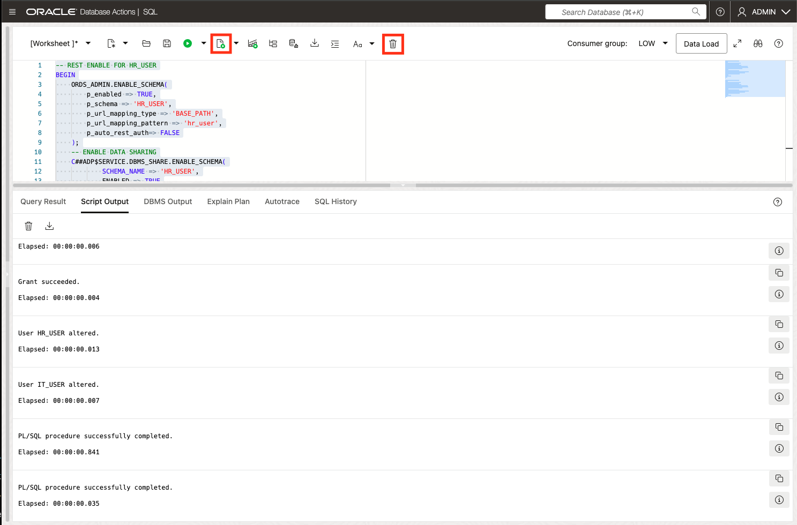
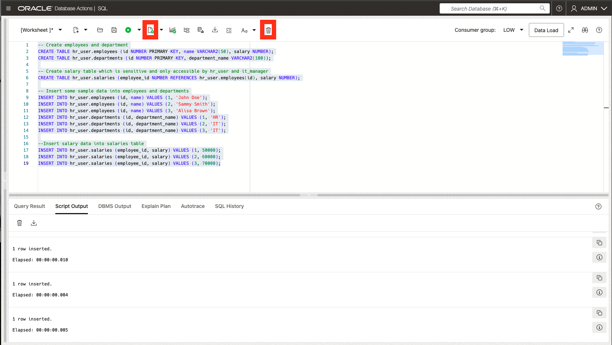
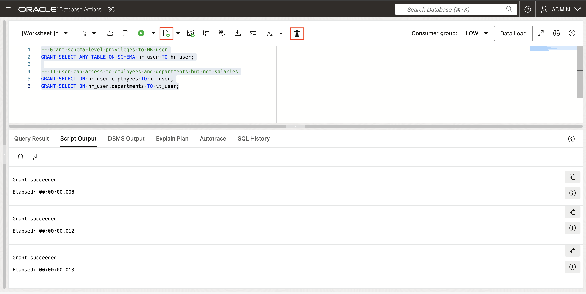
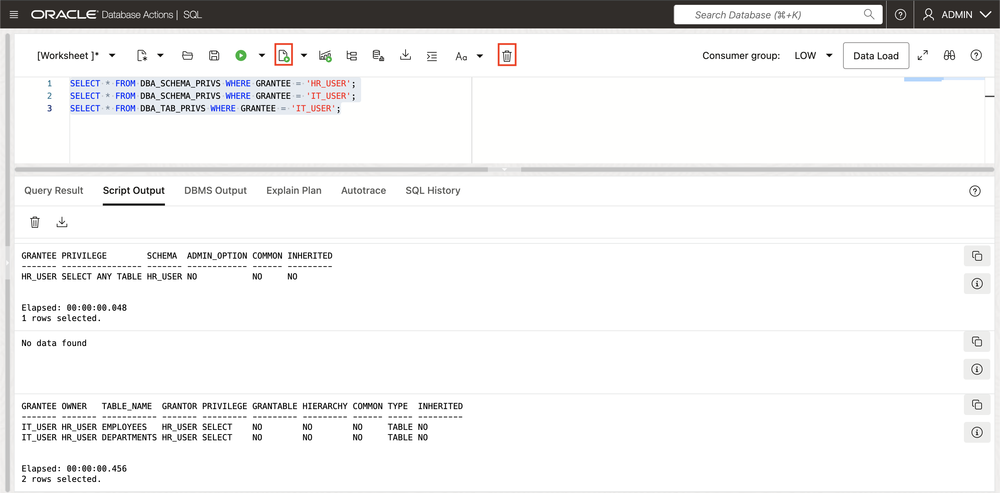
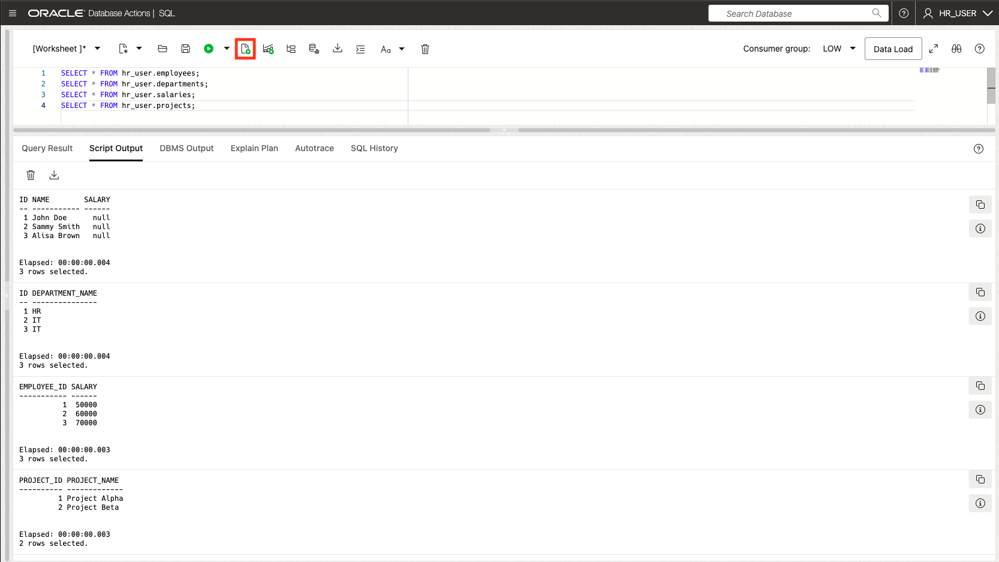
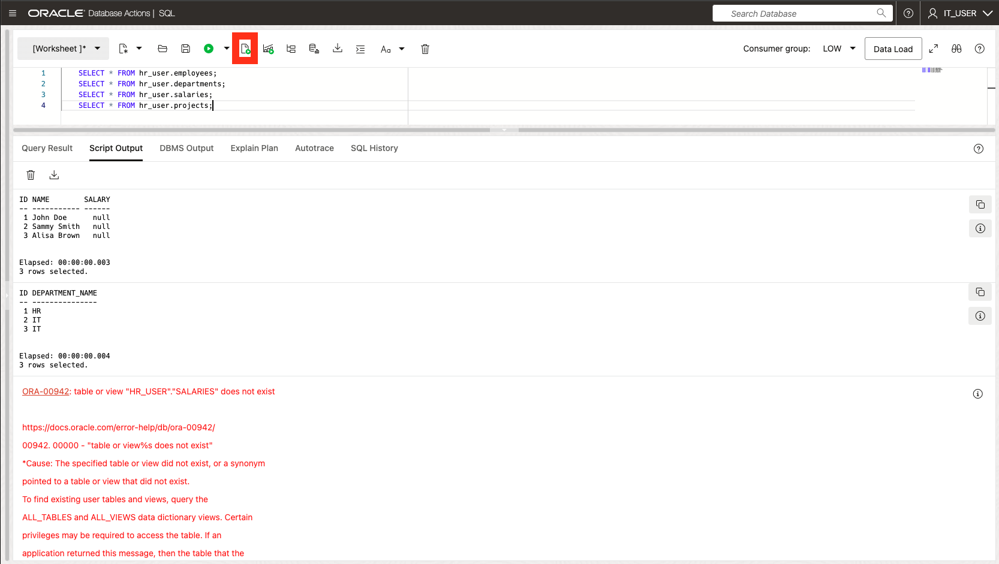

# Working with Schema-Level Privileges

## Introduction

Welcome to the Working with Schema-Level Privileges lab. In this lab, you will learn how to work with the new schema-level privilege management feature introduced in Oracle Database 23ai. 

Estimated Lab Time: 15 minutes

### Objective:
The objective of this workshop is to learn how to work with the schema-level privilege grant in Oracle Database 23ai and demonstrate its practical applications for managing access to application schemas in an easy way. 

### Prerequisites:
- Access to Oracle Database 23ai.
- Basic understanding of database schemas and privileges is recommended but not required.

## Task 1: Overview of Traditional Privilege Management
1. Before we get into the code examples, let's briefly talk about the traditional methods of privilege management in Oracle databases.

    * **Individual Privilege Grants**: This involves granting individual privileges on each table or view in the application schema. While granular, it's cumbersome and could cause user errors, especially with schema changes.

    * **ANY Privileges**: Granting "ANY" privileges (e.g., `SELECT ANY TABLE`) provides broad access but compromises security by granting excessive permissions.

    * Oracle Database 23ai introduces a simpler approach: **Schema-Level Privileges**. This allows granting privileges at the schema level, offering a balance between granularity and convenience.

## Task 2: Exploring Schema-Level Privileges

1. From the Autonomous Database home page, **click** Database action and then **click** SQL.
    

2. Let's first drop roles and users.

    ```
    <copy>
    -- Drop users if they already exist
    DROP USER IF EXISTS hr_user CASCADE;
    DROP USER IF EXISTS it_user CASCADE;
    DROP USER IF EXISTS it_manager CASCADE; 
    </copy>
    ```
    

3. We will next create users.  To change the password for the users use the "alter user identified by "new password" command. With the syntax below for distinct users,  Throughout this workshop we will use the Oracle123long password.

    ```
    <copy>
    -- Create users
    CREATE USER hr_user IDENTIFIED BY Oracle123long;
    CREATE USER it_user IDENTIFIED BY Oracle123long;
    </copy>
    ```
    

    
    If you'd like to change the password for the individual users, you'd run the following and make sure to replace `new_password_here` with your new password(needs one uppercase letter and atleast one number).
    ```
    <copy>
    ALTER USER hr_user IDENTIFIED BY  </copy>new_password_here;
    ```
    ```
    ALTER USER hr_user IDENTIFIED BY Oracle123long;
    ```
    


    This will change the password for it_user
    ```
    <copy>
    ALTER USER it_user IDENTIFIED BY  </copy>new_password_here;
    ```
    ```
    ALTER USER it_user IDENTIFIED BY Oracle123long;
    ```
    


    This will change the password for it_manager
    ```
    <copy>
    ALTER USER it_manager IDENTIFIED BY  </copy>new_password_here;
    ```
    ```
    ALTER USER it_manager IDENTIFIED BY Oracle123long;
    ```
    

4. Now we will be granting the respective roles to the users as well as the quota for the tablespace.
    ```
    <copy>
    --Grant roles to user
    GRANT CONNECT, RESOURCE TO hr_user, it_user, it_manager;
    GRANT DWROLE TO hr_user, it_user, it_manager;
    GRANT CREATE SESSION TO hr_user, it_user, it_manager;

    -- Grant quota for tablespace use
    ALTER USER hr_user QUOTA UNLIMITED ON DATA;
    ALTER USER it_user QUOTA UNLIMITED ON DATA;
    ALTER USER it_manager QUOTA UNLIMITED ON DATA;
    </copy>
    ```
    


5. With this next code, we will enable web access to our 3 users.

    ```
    <copy>
    -- REST ENABLE FOR HR_USER
    BEGIN
        ORDS_ADMIN.ENABLE_SCHEMA(
            p_enabled => TRUE,
            p_schema => 'HR_USER',
            p_url_mapping_type => 'BASE_PATH',
            p_url_mapping_pattern => 'hr_user',
            p_auto_rest_auth=> FALSE
        );
        -- ENABLE DATA SHARING
        C##ADP$SERVICE.DBMS_SHARE.ENABLE_SCHEMA(
                SCHEMA_NAME => 'HR_USER',
                ENABLED => TRUE
        );
        commit;
    END;
    /

    -- REST ENABLE for IT_USER
    BEGIN
        ORDS_ADMIN.ENABLE_SCHEMA(
            p_enabled => TRUE,
            p_schema => 'IT_USER',
            p_url_mapping_type => 'BASE_PATH',
            p_url_mapping_pattern => 'it_user',
            p_auto_rest_auth=> FALSE
        );
        -- ENABLE DATA SHARING
        C##ADP$SERVICE.DBMS_SHARE.ENABLE_SCHEMA(
                SCHEMA_NAME => 'IT_USER',
                ENABLED => TRUE
        );
        commit;
    END;
    /

    -- REST ENABLE for IT_MANAGER
    BEGIN
        ORDS_ADMIN.ENABLE_SCHEMA(
            p_enabled => TRUE,
            p_schema => 'IT_MANAGER',
            p_url_mapping_type => 'BASE_PATH',
            p_url_mapping_pattern => 'it_manager',
            p_auto_rest_auth=> FALSE
        );
        -- ENABLE DATA SHARING
        C##ADP$SERVICE.DBMS_SHARE.ENABLE_SCHEMA(
                SCHEMA_NAME => 'IT_MANAGER',
                ENABLED => TRUE
        );
        commit;
    END;
    /
    </copy>
    ```
    

6. Now we will create `employees`, `department` and `salary` tables. These tables will demonstarte how different levels of privilege can be applied.  

    ```
    <copy>
    -- Create employees and department
    CREATE TABLE hr_user.employees (id NUMBER PRIMARY KEY, name VARCHAR2(50), salary NUMBER);
    CREATE TABLE hr_user.departments (id NUMBER PRIMARY KEY, department_name VARCHAR2(100));

    -- Create salary table which is sensitive and only accessible by hr_user and it_manager
    CREATE TABLE hr_user.salaries (employee_id NUMBER REFERENCES hr_user.employees(id), salary NUMBER);

    -- Insert some sample data into employees and departments
    INSERT INTO hr_user.employees (id, name) VALUES (1, 'John Doe');
    INSERT INTO hr_user.employees (id, name) VALUES (2, 'Sammy Smith');
    INSERT INTO hr_user.employees (id, name) VALUES (3, 'Alisa Brown');
    INSERT INTO hr_user.departments (id, department_name) VALUES (1, 'HR');
    INSERT INTO hr_user.departments (id, department_name) VALUES (2, 'IT');
    INSERT INTO hr_user.departments (id, department_name) VALUES (3, 'IT');

    --Insert salary data into salaries table
    INSERT INTO hr_user.salaries (employee_id, salary) VALUES (1, 50000);
    INSERT INTO hr_user.salaries (employee_id, salary) VALUES (2, 60000);
    INSERT INTO hr_user.salaries (employee_id, salary) VALUES (3, 70000);
    </copy>
    ```

    

## Task 3: Apply Schema-Level Privileges
1. Now, we will grant schema-level privileges. Instead of granting access to individual tables, we will allow the `hr_user` to access all current and future tables within the `hr_user` schema. Both `it_manager` and  `it_user` will have access to the `employee` and `departments` tables, but no access to the `salaries` table. 

    ```
    <copy>
    -- Grant schema-level privileges to HR, IT, and IT Manager roles
    GRANT SELECT ANY TABLE ON SCHEMA hr_user TO hr_user;

    -- IT user and It manager can access to employees and departments but not salaries
    GRANT SELECT ON hr_user.employees TO it_user;
    GRANT SELECT ON hr_user.departments TO it_user;
    GRANT SELECT ON hr_user.employees TO it_manager;
    GRANT SELECT ON hr_user.departments TO it_manager;
    </copy>
    ```

    

3. Oracle Database 23ai simplifies privilege management with dedicated views. We can use views like `DBA_SCHEMA_PRIVS` to check the schema-level privileges granted to users. Others include ROLE\_SCHEMA\_PRIVS, USER\_SCHEMA\_PRIVS, and SESSION\_SCHEMA\_PRIVS.

    ```
    <copy>
    SELECT * FROM DBA_SCHEMA_PRIVS WHERE GRANTEE = 'HR_USER';
    SELECT * FROM DBA_SCHEMA_PRIVS WHERE GRANTEE = 'IT_USER';
    SELECT * FROM DBA_SCHEMA_PRIVS WHERE GRANTEE = 'IT_MANAGER';
    SELECT * FROM DBA_TAB_PRIVS WHERE GRANTEE = 'IT_USER';
    SELECT * FROM DBA_TAB_PRIVS WHERE GRANTEE = 'IT_MANAGER';
    </copy>
    ```
    
    Since only `hr_user` has schema-level privileges, when we run `DBA_SCHEMA_PRIVS`, we see that the privilege SELECT is set to ANY. Meanwhile, since both `it_user` and `it_manager` neither have schema-level privileges, when running the same command for both they return no data found as neither has the correct privileges. It is only with `DBA_TAB_PRIVS` that we can see their privileges.
    

## Task 4: Demonstrating Schema-Level Privileges
1. To explore the new schema-level privileges, `Sign out` of the `ADMIN` account and log in as the `hr_user` user. At the login screen, enter the login credentials for the `hr_user` user:
    - `USERNAME`: hr_user 
    - `PASSWORD`: Oracle123long

    
    
    

    
2. Schema-level privileges dynamically adapt to schema changes. When new tables or views are added to the schema, users granted schema-level access instantly gain the ability to query them without requiring any further administrative actions. With `hr_user` having schema-level privileges, they should be able to query data from `employees`, `department` and `salaries`.  

    ```
    <copy>
    SELECT * FROM hr_user.employees;
    SELECT * FROM hr_user.departments;
    SELECT * FROM hr_user.salaries;
    </copy>
    ```
    

3. If successful, all the 3 tables will return data, demonstrating the schema-level privileges have been applied. Now verified, sign out of the `hr_user` session and log into `it_user`. We will see how the privileges of this user is limited when compared to hr_user.
    - `USERNAME`: it_user 
    - `PASSWORD`: Oracle123long

    
    
    

4. Within the SQL developer, we shall now test the restricted access. Notice that `employees` and `departments` tables shall be successful but the `salaries` will return an error.  

    ```
    <copy>
    SELECT * FROM hr_user.employees;
    SELECT * FROM hr_user.departments;
    SELECT * FROM hr_user.salaries;
    </copy>
    ```

    

5. Now that this has been verified, let's return to the `Admin` account by logging out of the `it_user` session. Navigate back to the  ADB screen on OCI ,click on SQL again to automatically return to the `ADMIN`.
    
    

6. We will be granting schema-level privileges to the it_user 
    ```
    <copy>
    -- Grant schema-level privileges directly to hr_user and it_manager
    GRANT SELECT ANY TABLE ON SCHEMA hr_user TO it_user;

    SELECT * FROM DBA_SCHEMA_PRIVS WHERE GRANTEE = 'IT_USER';
    </copy>
    ```
    

7. To show the flexibility of schema-level privileges, we will also be creating a new table called projects
    
    ```
    <copy>
    -- Create a new table called projects
    CREATE TABLE hr_user.projects (
        project_id NUMBER PRIMARY KEY, 
        project_name VARCHAR2(100)
    );

    -- Insert some data into projects
    INSERT INTO hr_user.projects (project_id, project_name) VALUES (1, 'Project Alpha');
    INSERT INTO hr_user.projects (project_id, project_name) VALUES (2, 'Project Beta');
    </copy>
    ```
    


8. Now, sign out of the `ADMIN` session and log into `it_user`. We will see how the privileges of this user is limited when compared to hr_user.
    - `Path` : it_user
    - `USERNAME`: it_user 
    - `PASSWORD`: Oracle123long

    
    
    

9. Witin `it_user` now let's view our tables. You should be able to see the 3 original tables, as well as the newest, `projects` table we created after granting `it_user` schema-level privileges. 

    ```
    <copy>
    SELECT * FROM hr_user.employees;
    SELECT * FROM hr_user.departments;
    SELECT * FROM hr_user.salaries;
    SELECT * FROM hr_user.projects;
    </copy>
    ```

    

10. Sign out of the `it_user` session and log into `hr_user`. We will see how the privileges of this user is limited when compared to hr_user.
    - `USERNAME`: hr_user 
    - `PASSWORD`: Oracle123long

    
    
    

11. Now that we have returned to `hr_user` which was the original user with schema-level privileges, we will see how not only do we have access to the first 3 tables, we can also `SELECT` from `projects`.
    ```
    <copy>
    SELECT * FROM hr_user.employees;
    SELECT * FROM hr_user.departments;
    SELECT * FROM hr_user.salaries;
    SELECT * FROM hr_user.projects;
    </copy>
    ```
    


12. Let's return to the `Admin` account by logging out of the `hr_user` session. Navigate back to the  ADB screen on OCI ,click on SQL again to automatically return to the `ADMIN`.
    
    

## Task 5: Revoking Schema-Level Privileges
1. As expected, we can also revoke schema-level privileges when they are no longer required. In the `ADMIN` profile, let's proceed by revoking the `SELECT` privilege that was granted to the `it_user` for the schema.

    ```
    <copy>
    -- Revoke schema-level privileges from IT_USER
    REVOKE SELECT ANY TABLE ON SCHEMA hr_user FROM it_user;
    </copy>
    ```
    

2. Once the privileges have been revoked, we can verify the updated access by reviewing the remaining privileges granted to `it_user`. `DBA_SCHEMA_PRVIS` will return no data found, but `DBA_TAB_PRIVS` will show that our original privileges are still there.
    ```
    <copy>
    SELECT * FROM DBA_SCHEMA_PRIVS WHERE GRANTEE = 'IT_USER';
    </copy>
    ```
     

    ```
    <copy>
    SELECT * FROM DBA_TAB_PRIVS WHERE GRANTEE = 'IT_USER';   
    </copy>
    ```
       

3. We will `Sign out` of ADMIN account and switch to it_user account. At the login screen, enter the login credentials we set up for the it_user user.
    - `USERNAME`: it_user
    - `PASSWORD`: Oracle123long

    
    

4. Now we will see that our schema-level privileges have been revoked. `it_user` will not be able to `SELECT` from all the tables as before, only `employees` and `department` which were originally granted.  

    ```
    <copy>
    SELECT * FROM hr_user.employees;
    SELECT * FROM hr_user.departments;
    SELECT * FROM hr_user.salaries;
    SELECT * FROM hr_user.projects;
    </copy>
    ```
    

5. Let's return to the `Admin` account by logging out of the `it_user` session. Navigate back to the  ADB screen on OCI ,click on SQL again to automatically return to the `ADMIN`.
    
    

## Task 6: Cleanup
1. Finally, let's clean up the environment by dropping the the users, roles, and objects created

    ```
    <copy>
    -- Drop users, roles, and related objects
    DROP USER IF EXISTS hr_user CASCADE;
    DROP USER IF EXISTS it_user CASCADE;
    DROP USER IF EXISTS it_manager CASCADE;
    DROP ROLE IF EXISTS hr_user;
    DROP ROLE IF EXISTS it_user;
    DROP ROLE IF EXISTS it_manager;
    </copy>
    ```

    

## Task 7: Understanding Advanced Privilege Management
1. You can also grant schema-level privileges on schemas that do not belong to the current user. However, doing this requires additonal permissions such as `GRANT ANY SCHEMA PRIVILEGE`, which allows you to grant privileges on other users' schemas.

2. Throughout this lab, you've explored how schema-level privilege management simplifies user access control in Oracle Database 23ai. By using schema-level privileges, you can drastically reduce the management and administration needed to grant schema privileges prior to 23ai and improve security through their use.

You may now **proceed to the next lab** 

## Learn More

- [Oracle Database 23ai Documentation](https://docs.oracle.com/en/database/oracle/oracle-database/index.html)
- [Oracle Blog - Exploring Schema-Level Privileges](https://blogs.oracle.com/cloudsecurity/post/schemalevel-privilege-grants-with-database-23c)

## Acknowledgements
* **Author** - Killian Lynch, Database Product Management
* **Contributors** - Dom Giles, Distinguished Database Product Manager, Francis Regalado, Database Product Manager
* **Last Updated By/Date** - Francis Regalado, Database Product Manager October 2024
