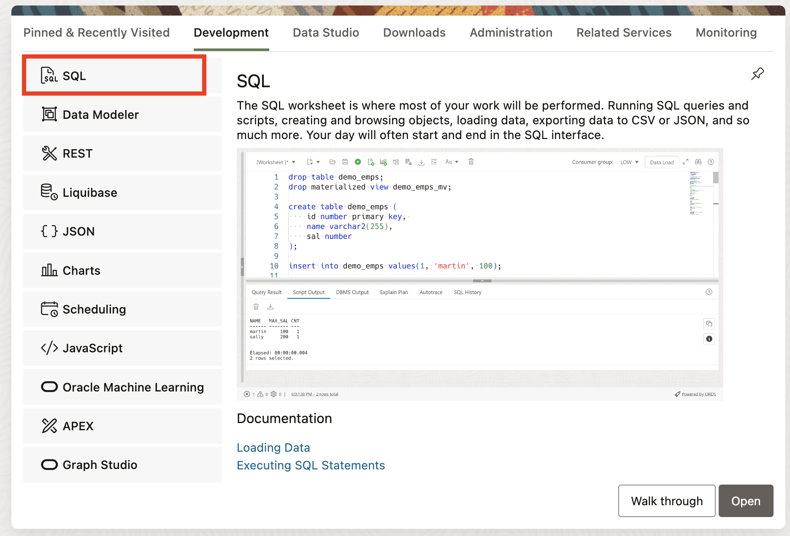
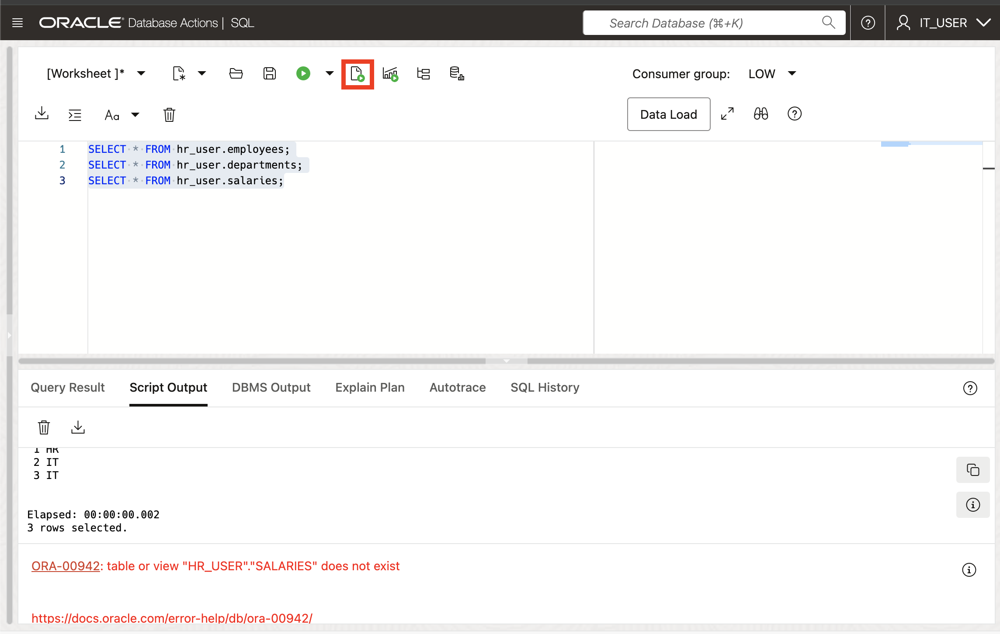
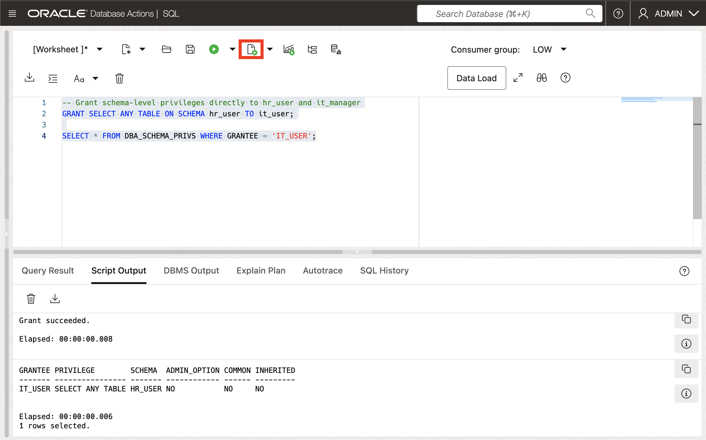
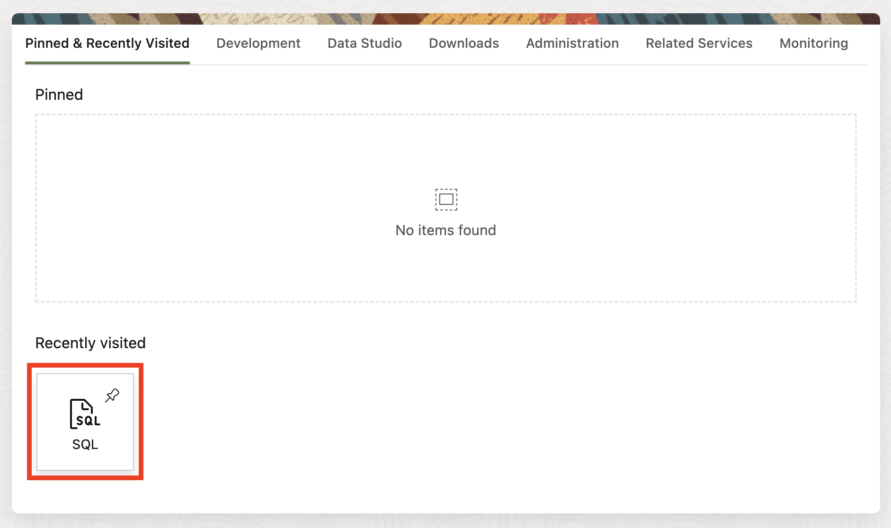

# Working with Schema-Level Privileges

## Introduction

Welcome to the Working with Schema-Level Privileges lab. In this lab, you will learn how to work with the new schema-level privilege management feature introduced in Oracle Database 23ai. 

Estimated Lab Time: 15 minutes

### Objective:
The objective of this workshop is to learn how to work with the schema-level privilege grant in Oracle Database 23ai and demonstrate its practical applications for managing access to application schemas in an easy way. 

### Prerequisites:
- Access to Oracle Database 23ai.
- Basic understanding of database schemas and privileges is recommended but not required.

## Task 1: Overview of Traditional Privilege Management
1. Before we get into the code examples, let's briefly talk about the traditional methods of privilege management in Oracle databases.

    * **Individual Privilege Grants**: This involves granting individual privileges on each table or view in the application schema. While granular, it's cumbersome and could cause user errors, especially with schema changes.

    * **ANY Privileges**: Granting "ANY" privileges (e.g., `SELECT ANY TABLE`) provides broad access but compromises security by granting excessive permissions.

    * Oracle Database 23ai introduces a simpler approach: **Schema-Level Privileges**. This allows granting privileges at the schema level, offering a balance between granularity and convenience.

## Task 2: Exploring Schema-Level Privileges

1. From the Autonomous Database home page, **click** Database action and then **click** SQL.
    

2. Let's create users and tables for this lab.

    ```
    <copy>
    drop user if exists customers cascade;
    drop user if exists employee cascade;
    create user customers identified by Oracle123long;
    create user employee identified by Oracle123long;

    GRANT CONNECT, RESOURCE TO employee;
    GRANT CONNECT, RESOURCE TO customers;
    GRANT DWROLE to customers;
    GRANT CREATE SESSION TO customers;

    GRANT CONNECT, RESOURCE TO employee;
    -- Grant quota to employee on DATA tablespace
    ALTER USER employee QUOTA 50M ON DATA;
    ALTER USER customers QUOTA 50M ON DATA;

    -- REST ENABLE
    BEGIN
        ORDS_ADMIN.ENABLE_SCHEMA(
            p_enabled => TRUE,
            p_schema => 'CUSTOMERS',
            p_url_mapping_type => 'BASE_PATH',
            p_url_mapping_pattern => 'customers',
            p_auto_rest_auth=> FALSE
        );
        -- ENABLE DATA SHARING
        C##ADP$SERVICE.DBMS_SHARE.ENABLE_SCHEMA(
                SCHEMA_NAME => 'CUSTOMERS',
                ENABLED => TRUE
        );
        commit;
    END;
    /

    </copy>
    ```
    

    Now we will create two tables in the employee schema. These tables will demonstarte how different levels of privilege can be applied. Initially, customers will be granted access to only one of the tables. 

    ```
    <copy>
    CREATE TABLE employee.table1 (id NUMBER PRIMARY KEY, name VARCHAR2(50));
    CREATE TABLE employee.table2 (id NUMBER PRIMARY KEY, description VARCHAR2(100));

    -- Insert some sample data into both tables
    INSERT INTO employee.table1(id, name) VALUES (1, 'CEO');
    INSERT INTO employee.table1(id, name) VALUES (2, 'Director');
    INSERT INTO employee.table1(id, name) VALUES (3, 'Manager');

    INSERT INTO employee.table2(id, description) VALUES (1, 'CEO_NAME');
    INSERT INTO employee.table2(id, description) VALUES (2, 'DIRECTOR_NAME');
    INSERT INTO employee.table2(id, description) VALUES (3, 'MANAGER_NAME');
    </copy>
    ```

    


3. We will grant customers access to only one table. Specifically, they will receive `SELECT` privileges on `employee.table1` but will not have access to `employee.table2`. To ensure the correct privileges have been applied, we will verify the granted permissions using the `dba_tab_privs` view.

    ```
    <copy>
    GRANT SELECT ON employee.table1 TO customers;
    SELECT * FROM dba_tab_privs WHERE grantee = 'CUSTOMERS';
    </copy>
    ```

        

4. Now that customers has been granted access, we will see how this access differs between the two tables. First, we will `Sign out` of ADMIN account and switch to Customers account. At the login screen, click `Advanced` to drop down the Path and enter the login credentials we previously set up for the Customers user.
    - `Path` : customers
    - `USERNAME`: customers 
    - `PASSWORD`: Oracle123long

    
    

5. Now that you're logged in to CUSTOMER, click on SQL to open SQL Developer, where we'll run our code. We'll start by running a command to select from `employee.table1` and observe the results, demonstrating how Customers can successfully query `table1` but not `table2`. 

    ```
    <copy>
    SELECT * FROM employee.table1;
    </copy>
    ```

    

    ```
    <copy>
    SELECT * FROM employee.table2;
    </copy>
    ```
    

    As expected, when selecting from `table1`, the query is successful. However, when attempting to query `table2`, the following error should appear: "ORA-00942: table or view "EMPLOYEE:TABLE2" does not exist" as an error.

    With this completed, Sign Out of the user customers. Return to the Admin page. Return to the ADB screen on OCI and click on `SQL` again to automatically return to the ADMIN account.
    
    

## Task 3: Apply Schema-Level Privileges
1. Next, we will transition from table-level to schema-level privileges. Instead of granting access to individual tables, we will allow the `customers` user to access all current and future tables within the `employee` schema. This ensures that as more tables are created in the employee schema, the customers user will automatically have SELECT privileges on those tables. 

    Use the following command to grand schema-level access:

    ```
    <copy>
    GRANT SELECT ANY TABLE ON SCHEMA employee TO customers;
    </copy>
    ```
    

    After running this command, the `customers` will have access to all tables under the `employee` schema. This change broadens the scope of access, making it more efficient to manage privileges across the schema rather than assigning them table by table. 

2. Oracle Database 23ai simplifies privilege management with dedicated views. We can use views like `DBA_SCHEMA_PRIVS` to check the schema-level privileges granted to users. Others include ROLE\_SCHEMA\_PRIVS, USER\_SCHEMA\_PRIVS, and SESSION\_SCHEMA\_PRIVS.

    ```
    <copy>
    SELECT * FROM DBA_SCHEMA_PRIVS WHERE GRANTEE = 'CUSTOMERS';
    </copy>
    ```
    

3. To explore the new schema-level privileges, `Sign out` of the `ADMIN` account and log in as the `customers` user. At the login screen, click on `Advanced` to drop down the Path settings. Now, enter the login credentials for the `customers` user:
    - `Path` : customers
    - `USERNAME`: customers 
    - `PASSWORD`: Oracle123long

    
    
    

    
4. Schema-level privileges dynamically adapt to schema changes. When new tables or views are added to the schema, users granted schema-level access instantly gain the ability to query them without requiring any further administrative actions. Now that the `customers` user has schema-level privileges, they should be able to query data from both `table1` and `table2`. Test this to confirm that the prvivileges extend beyond the original access to only `table1`. 

    ```
    <copy>
    SELECT * FROM employee.table1;
    SELECT * FROM employee.table2;
    </copy>
    ```
    

    If successful, both tables will return data, demonstrating the schema-level privileges have been applied. Now that verified, sign out of the `customers` session and return to the `Admin` account. From the ADB screen on OCI, click on SQL to return to the `ADMIN` session automatically.
    
    

## Task 4: Revoke Schema-Level Privileges
1. As expected, we can also revoke schema-level privileges when they are no longer required. Let's proceed by revoking the `SELECT` privilege that was granted to the `customers` user for the `employee` schema.

    ```
    <copy>
    REVOKE SELECT ANY TABLE ON SCHEMA employee FROM customers;
    </copy>
    ```
    

2. Once the privileges have been revoked, we can verify the updated access by reviewing the remaining privileges granted to `customers`. 
    ```
    <copy>
    SELECT * FROM dba_tab_privs WHERE grantee = 'CUSTOMERS';
    </copy>
    ```
     

3. We will `Sign out` of ADMIN account and switch to Customers account. At the login screen, click `Advanced` to drop down the Path and enter the login credentials we previously set up for the Customers user.
    - `Path` : customers
    - `USERNAME`: customers 
    - `PASSWORD`: Oracle123long

    
    

4. Our privileges will be reverted. Customers will only see access to `table1` and not `table2`.

    ```
    <copy>
    SELECT * FROM employee.table1;
    SELECT * FROM employee.table2;
    </copy>
    ```
    

5. Now verified, let's return to the `Admin` account by logging out of the `customers` session. Navigate back to the  ADB screen on OCI ,click on SQL again to automatically return to the `ADMIN`.
    
    

6. Finally, let's clean up the environment by dropping the the users and their associated objects. We can clean up from the lab by dropping our tables.

    ```
    <copy>
    drop user if exists customers cascade;
    drop user if exists management cascade;

    </copy>
    ```

    

## Task 5: Understanding Advanced Privilege Management
1. You can also grant schema-level privileges on schemas that do not belong to the current user. However, doing this requires additonal permissions such as `GRANT ANY SCHEMA PRIVILEGE`, which allows you to grant privileges on other users' schemas.

2. Throughout this lab, you've explored how schema-level privilege management simplifies user access control in Oracle Database 23ai. By using schema-level privileges, you can drastically reduce the management and administration needed to grant schema privileges prior to 23ai and improve security through their use.

    You may now **proceed to the next lab** 

## Learn More

- [Oracle Database 23ai Documentation](https://docs.oracle.com/en/database/oracle/oracle-database/index.html)
- [Oracle Blog - Exploring Schema-Level Privileges](https://blogs.oracle.com/cloudsecurity/post/schemalevel-privilege-grants-with-database-23c)

## Acknowledgements
* **Author** - Killian Lynch, Database Product Management
* **Contributors** - Dom Giles, Distinguished Database Product Manager, Francis Regalado, Database Product Manager
* **Last Updated By/Date** - Francis Regalado, Database Product Manager September 2024
