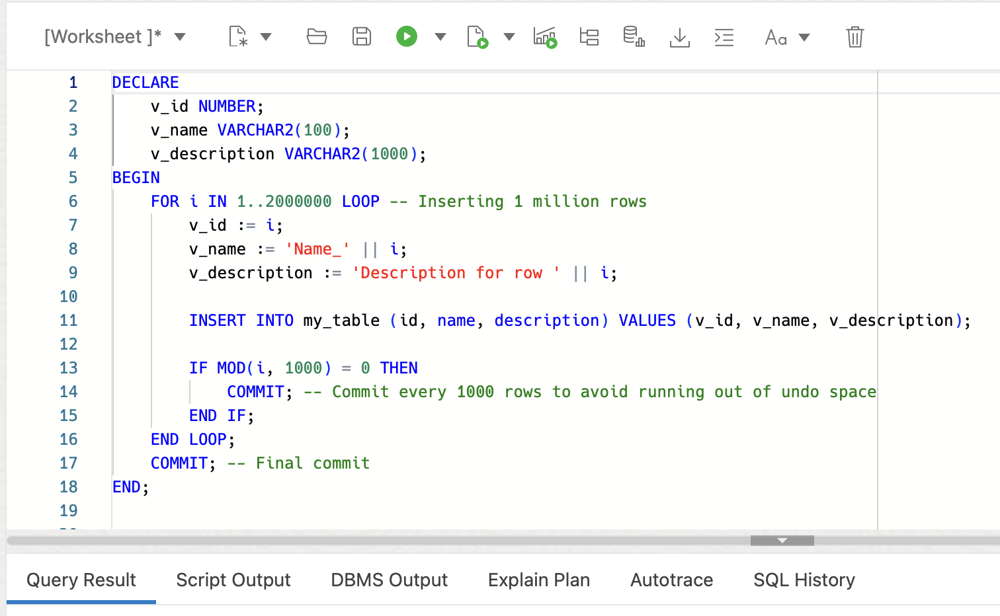

# Reclaiming Unused Space in Oracle Database 23ai with 'shrink_tablespace'

## Introduction

Welcome to the Reclaiming Unused Space in Oracle Database 23ai with `shrink_tablespace` lab. In this lab, you will learn about the new `shrink_tablespace` procedure introduced in Oracle Database 23ai. This procedure offers a simple way to reclaim unused or free space in your tablespace, optimizing database performance and resource use.

Estimated Lab Time: 15 minutes

Watch the video below for a walkthrough of the lab.
[Lab walkthrough video](videohub:1_oycqsmcg)

### Objective:
The objective of this lab is to show you the `shrink_tablespace` procedure in Oracle Database 23ai and show its practical application for reclaiming unused space in tablespaces. By the end of this lab, you will be able to resize data files and organize objects in tablespaces using the `shrink_tablespace` procedure.

### Prerequisites:
- Access to Oracle Database 23ai.
- Basic understanding of Oracle SQL and database management concepts.

## Task 1: Understanding the need for tablespace shrinkage

1. Before we jump into the process of using the `shrink_tablespace` procedure, let's understand why reclaiming unused space in tablespaces is important.

    Unused or free space within tablespaces can grow over time, reducing database efficiency and performance. Shrinking tablespaces helps optimize database resource utilization by reclaiming unused space. The `shrink_tablespace` procedure provides a convenient solution for resizing data files and organizing objects.

2. For this lab we want to sign in as the admin. You can find the password pack on the liveLabs reservation page.

    If you've forgotten your password, it can be found by clicking the **View login info** button in the top left of these instruction. Alternatively, you can watch the gif below to find the password.  

    


2. Now, let's explore how to use the `shrink_tablespace` procedure to reclaim unused space in a tablespace.

    > Your tablespace size may be different depending on what prior labs you've done, that's okay.


2. We can create a new table and populate it with data. You can use the following SQL statement as an example:

    ```
    <copy>

    drop table if exists my_table purge;


    CREATE TABLE my_table (
        id NUMBER,
        name VARCHAR2(100),
        description VARCHAR2(1000)
    );
    </copy>
    ```
    

3. We'll now add 3 million rows to the table (feel free to skip this and read the rest if you don't want to add the data to your table).

    > **This creates about 1-2 gigs worth of data**

    ```
    <copy>
    DECLARE
        v_id NUMBER;
        v_name VARCHAR2(100);
        v_description VARCHAR2(1000);
    BEGIN
        FOR i IN 1..3000000 LOOP -- Inserting 3 million rows
            v_id := i;
            v_name := 'Name_' || i;
            v_description := 'Description for row ' || i;

            INSERT INTO my_table (id, name, description) VALUES (v_id, v_name, v_description);

            IF MOD(i, 1000) = 0 THEN
                COMMIT; -- Commit every 1000 rows to avoid running out of undo space
            END IF;
        END LOOP;
        COMMIT; -- Final commit
    END;
    </copy>
    ```
    

## Task 2: Delete data to create unused space

1. Let's check the current size of our tablespace after adding a bunch of data from above.

    ```
    <copy>
    SELECT tablespace_name,
        ROUND(SUM(bytes) / 1024 / 1024 / 1024, 2) AS "Size_GB"
    FROM dba_data_files
    where TABLESPACE_NAME = 'DATA'
    GROUP BY tablespace_name;
    </copy>
    ```
    

    We've got about 2 gigs worth of data in our tablespace now. Yours may be different, that's okay.

2. Delete some data from the tablespace to create unused or free space. This can be achieved by deleting tables or indexes, creating 'holes' in the tablespace. Here we'll drop the whole table.
    ```
    <copy>
    drop table my_table cascade constraints;
    </copy>
    ```
    

3. Now verify the current size of the tablespace to confirm the presence of unused space. Although data has been deleted, the tablespace size remains unchanged.
    
    ```
    <copy>
    SELECT tablespace_name,
        ROUND(SUM(bytes) / 1024 / 1024 / 1024, 2) AS "Size_GB"
    FROM dba_data_files
    where TABLESPACE_NAME = 'DATA'
    GROUP BY tablespace_name;
    </copy>
    ```
    

## Task 3: Understanding the `shrink_tablespace` Procedure

1. Now, let's understand the `shrink_tablespace` procedure and its parameters:

    - `ts_name`: Name of the tablespace to shrink.
    - `shrink_mode`: Options include `TS_MODE_SHRINK`, `TS_MODE_ANALYZE`, and `TS_MODE_SHRINK_FORCE`.
    - `target_size`: New size of the tablespace datafile (in bytes).

2. Now we can execute the `shrink_tablespace` procedure to reclaim unused space in the tablespace. You can choose between different modes, such as `TS_MODE_SHRINK` or `TS_MODE_ANALYZE`, based on your requirements.

    We'll first analyze.

    ```
    <copy>
    execute dbms_space.SHRINK_TABLESPACE('DATA', SHRINK_MODE=>DBMS_SPACE.TS_MODE_ANALYZE);
    </copy>
    ```
    

3. Analyze gives us a bunch of useful information. Let's take the default parameter's (meaning 'TS\_TARGET\_MAX\_SHRINK') and shrink the tablespace: (See below for the API description)

    ```
    <copy>
    execute dbms_space.SHRINK_TABLESPACE('DATA');
    </copy>
    ```
    

4. The API Description:
    Input Parameters:
    * **ts_name**: This is the name of the tablespace you want to shrink.
    * **shrink_mode**: Shrink mode has a couple options like `TS_MODE_SHRINK`, `TS_MODE_ANALYZE`, and `TS_MODE_SHRINK_FORCE`. By default, it's set to `TS_MODE_SHRINK`, which moves objects online by default (except for Index-Organized Tables or IOT). `TS_MODE_SHRINK_FORCE` also moves objects online by default, but if the online move fails, it attempts an offline move.
    * **target_size**: This parameter lets you pick the new tablespace data file size (in bytes). The default is `TS_TARGET_MAX_SHRINK`.

    Output Parameters (`shrink_result`):
    * **`TS_MODE_SHRINK`** (shown above) The procedure returns the total number and size of moved objects. It provides the original and new data file size. You get information on the process time.
    * **`TS_MODE_ANALYZE`**:
        It generates a list of movable objects.
        You'll see the total number and size of movable objects.
        It suggests the target size.
        It also provides the process time.

4. In this lab, you've learned how to reclaim unused space in tablespaces using the `shrink_tablespace` procedure in Oracle Database 23ai. By efficiently resizing data files and organizing objects, you can optimize database performance and resource utilization.

You may now **proceed to the next lab** 


## Learn More

* [Documentation - Shrinking a Bigfile Tablespace](https://docs.oracle.com/en/database/oracle/oracle-database/23/admin/managing-tablespaces.html#ADMIN-GUID-32D286D3-77E0-4A42-BE10-D0E0632CFC06)


## Acknowledgements
* **Author** - Killian Lynch, Database Product Management
* **Contributors** - Dom Giles, Distinguished Database Product Manager
* **Last Updated By/Date** - Killian Lynch, April 2024

