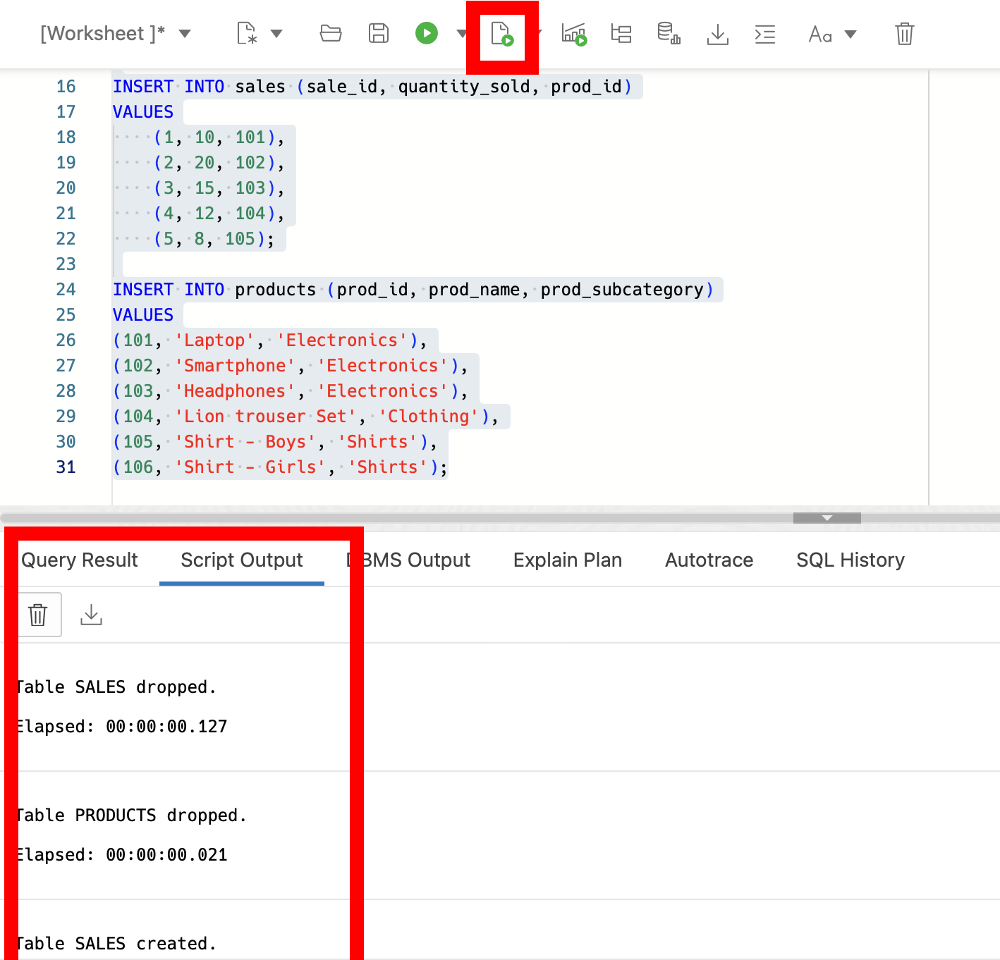
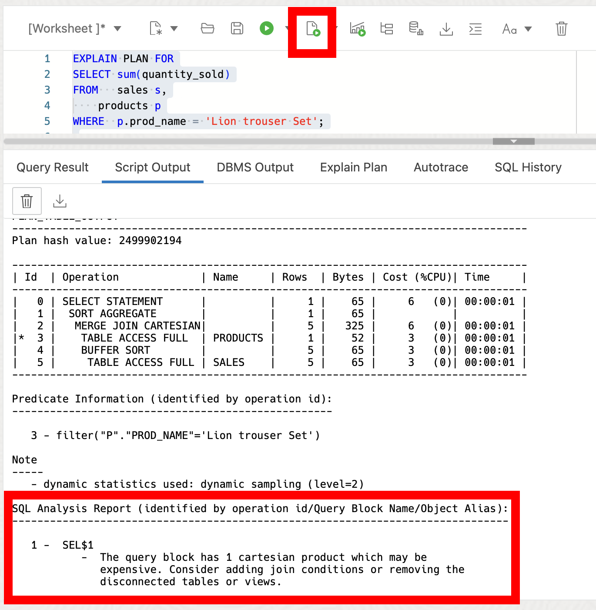
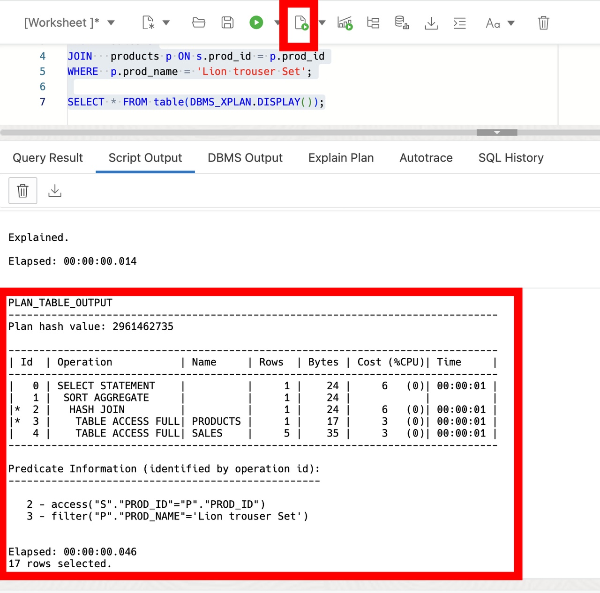
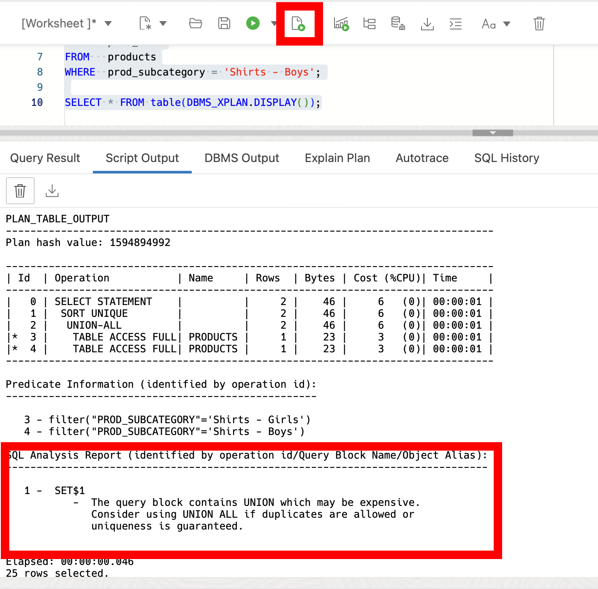
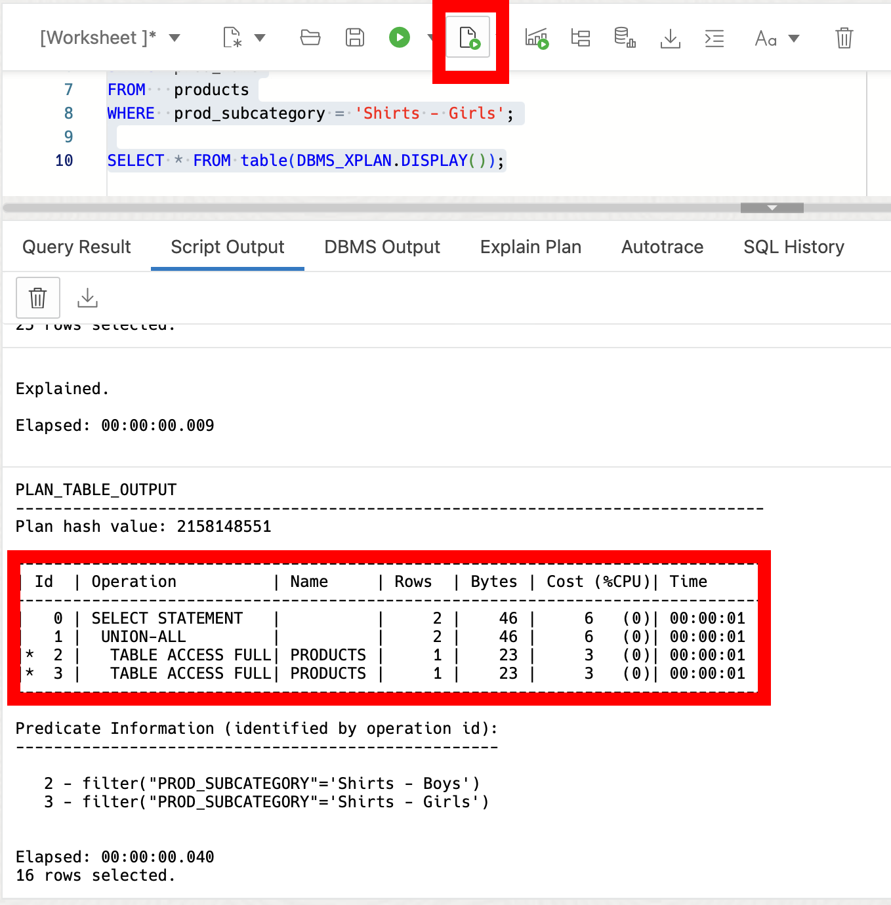

# Exploring the SQL Analysis Report

## Introduction

Welcome to the "Exploring the SQL Analysis Report" lab. In this lab, you will learn about the new SQL Analysis Report feature in the optimizer introduced in Oracle Database 23ai. SQL Analysis Report is there to help improve your SQL queries by giving insights and suggestions inside your execution plans. The SQL Analysis Report is available in DBMS\_XPLAN and SQL Monitor. We are going to take a look at the DBMS\_XPLAN functionality.

Estimated Lab Time: 15 minutes

Watch the video below for a walkthrough of the lab.
[Lab walkthrough video](videohub:1_qn2333jb)

### Objective:
The objective of this lab is to show you the SQL Analysis Report feature in Oracle Database 23ai. By the end of this lab, you will be able to interpret SQL Analysis Reports and use the insights to improve query performance.

### Prerequisites:
- Access to Oracle Database 23ai.
- Basic understanding of SQL is helpful.

## Task 1: Lab setup and understanding SQL Analysis Reports

1. If you haven't done so already, from the Autonomous Database home page, **click** Database action and then **click** SQL.
    

    Using the ADMIN user isn’t typically advised due to the high level of access and security concerns it poses. **However**, for this demo, we’ll use it to simplify the setup and ensure we can show the full range of features effectively. 

2. Before we begin, this lab will be using Database Actions Web. If you're unfamiliar, please see the picture below for a simple explanation of the tool. You can click on the photo to enlarge it.

    
   
2. SQL Analysis Reports provide insights and suggestions for SQL queries. These reports show potential issues, such as Cartesian products, expensive operations, and inefficient use of hints, to help you optimize your queries for better performance. SQL analysis is enabled by default.

    Let's create some test data.

    ```
    <copy>
    DROP TABLE IF EXISTS sales cascade constraints;
    DROP TABLE IF EXISTS products cascade constraints;

    CREATE TABLE sales (
        sale_id INT,
        quantity_sold INT,
        prod_id INT
    );

    CREATE TABLE products (
        prod_id INT,
        prod_name VARCHAR(100),
        prod_subcategory VARCHAR(50)
    );

    INSERT INTO sales (sale_id, quantity_sold, prod_id)
    VALUES
        (1, 10, 101),
        (2, 20, 102),
        (3, 15, 103),
        (4, 12, 104),
        (5, 8, 105);

    INSERT INTO products (prod_id, prod_name, prod_subcategory)
    VALUES
    (101, 'Laptop', 'Electronics'),
    (102, 'Smartphone', 'Electronics'),
    (103, 'Headphones', 'Electronics'),
    (104, 'Lion trouser Set', 'Clothing'),
    (105, 'Shirt - Boys', 'Shirts'),
    (106, 'Shirt - Girls', 'Shirts');

    </copy>
    ```
    

3. The SQL Analysis Report appears in a new section at the end of a SQL execution plan. Before we jump into the Analysis Report, a little housekeeping... The SQL Analysis Report is available in `DBMS_XPLAN` and SQL Monitor. We are going to take a look at the `DBMS_XPLAN` functionality.

    We can customize how the report is created using the `DBMS_XPLAN` functions:
    * DISPLAY
    * DISPLAY\_CURSOR
    * DISPLAY\_WORKLOAD\_REPOSITORY
    * DISPLAY\_SQL_PLAN\_BASELINE
    * DISPLAY\_SQLSET
    
    We can also choose how to format the report. The SQL Analysis Report has two format options: TYPICAL and BASIC. The default value is 'TYPICAL'.

## Task 2: Understanding the SQL Analysis Report

1. Let's explore some examples of SQL Analysis Reports to understand common performance issues and optimization recommendations.

    ```
    <copy>
    EXPLAIN PLAN FOR
    SELECT sum(quantity_sold)
    FROM   sales s,
        products p
    WHERE  p.prod_name = 'Lion trouser Set';

    SELECT * FROM table(DBMS_XPLAN.DISPLAY());

    </copy>
    ```
    

    The report comes back and lets us know that we can improve the way we wrote the query. Specifically, it says "The query block has 1 Cartesian product which may be expensive. Consider adding join conditions or removing the disconnected tables or views."

2. Now with that information, we can rewrite the query. 

    ```
    <copy>
    SELECT SUM(quantity_sold)
    FROM   sales s
    JOIN   products p ON s.prod_id = p.prod_id
    WHERE  p.prod_name = 'Lion trouser Set';
    </copy>
    ```

    Here, we used the join condition to improve the overall execution of the query. We can check the report again, and see through the SQL Analysis suggestion we were able to improve our query.
    
    ```
    <copy>
    EXPLAIN PLAN FOR
    SELECT sum(quantity_sold)
    FROM   sales s
    JOIN   products p ON s.prod_id = p.prod_id
    WHERE  p.prod_name = 'Lion trouser Set';

    SELECT * FROM table(DBMS_XPLAN.DISPLAY());
    </copy>
    ```
    

3. Let's take a look at another small example.

    ```
    <copy>
    EXPLAIN PLAN FOR
    SELECT prod_name
    FROM   products
    WHERE  prod_subcategory = 'Shirts - Girls'
    UNION
    SELECT prod_name
    FROM   products
    WHERE  prod_subcategory = 'Shirts - Boys';

    SELECT * FROM table(DBMS_XPLAN.DISPLAY());
    </copy>
    ```
    

4. The SQL Analysis Report suggests that we consider a UNION ALL instead of the UNION. Let's implement those changes.

    ```
    <copy>
    EXPLAIN PLAN FOR
    SELECT prod_name
    FROM   products
    WHERE  prod_subcategory = 'Shirts - Boys'
    UNION ALL
    SELECT prod_name
    FROM   products
    WHERE  prod_subcategory = 'Shirts - Girls';

    SELECT * FROM table(DBMS_XPLAN.DISPLAY());
    </copy>
    ```

    

    Again we're able to improve our query using the report.

5. In this workshop, we've explored SQL analysis techniques for optimizing SQL performance. By understanding SQL execution plans and interpreting SQL Analysis Reports, you can identify performance bottlenecks and apply optimization strategies to enhance database performance. Feel free to continue trying out other queries or check out another lab.

6. We can clean up from the lab by dropping our tables.

    ```
    <copy>
    DROP TABLE sales cascade constraints;
    DROP TABLE products cascade constraints;
    </copy>
    ```

You may now **proceed to the next lab** 


## Learn More

* [SQL Analysis Report Documentation](https://docs.oracle.com/en/database/oracle/oracle-database/23/tgsql/influencing-the-optimizer.html#TGSQL-GUID-A2CEDBF8-948F-4C84-8063-DF8A13D476AD)
* [SQL Analysis Report Blog](https://blogs.oracle.com/optimizer/post/sql-analysis-report-in-23ai-free)

## Acknowledgements
* **Author** - Killian Lynch, Database Product Management
* **Contributors** - Dom Giles, Distinguished Database Product Manager
* **Last Updated By/Date** - Killian Lynch, April 2024
