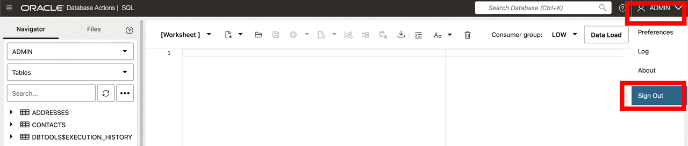
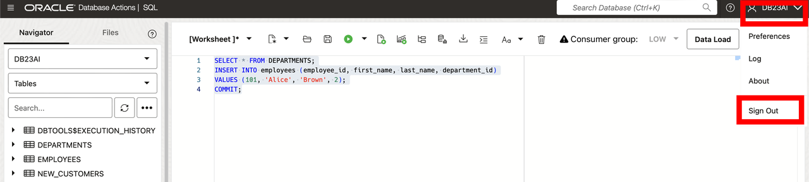
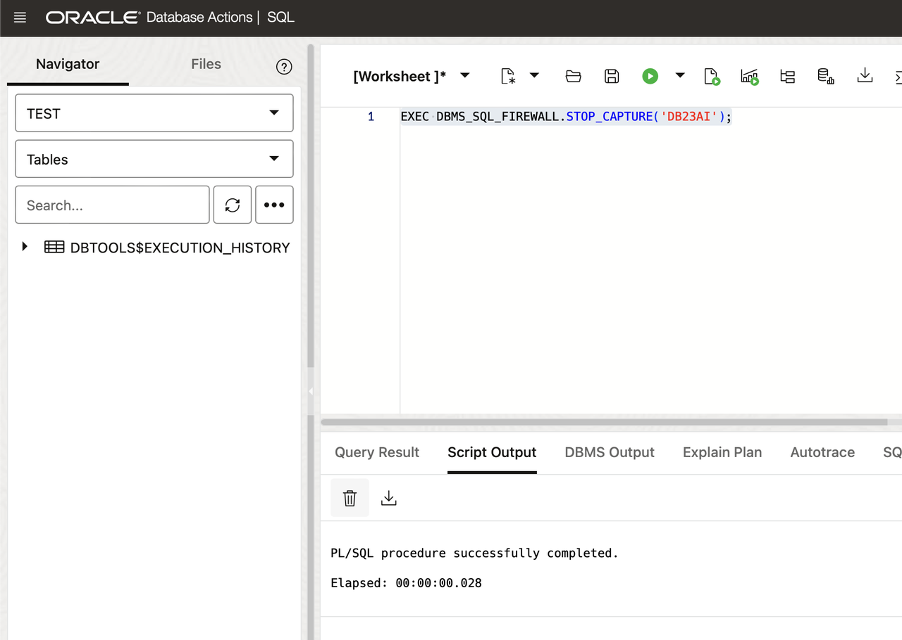

# Exploring SQL Firewall in Oracle Database 23ai

## Introduction

Welcome to the "Exploring SQL Firewall in Oracle Database 23ai" workshop. In this workshop, you will learn about the SQL Firewall feature introduced in Oracle Database 23ai, which provides real-time protection against common database attacks by monitoring and blocking unauthorized SQL and SQL injection attempts. By the end of this workshop, you will be able to configure and use the SQL Firewall to enhance the security of your database applications.

Estimated Lab Time: 20 minutes

Watch the video below for a walkthrough of the lab.
[Lab walkthrough video](videohub:1_gy4qzh0f)

### Objective:

The objective of this workshop is to familiarize you with the SQL Firewall feature in Oracle Database 23ai. You will learn how to enable the firewall, capture and allow authorized SQL statements, enforce security policies based on SQL and environmental contexts, and monitor for violations. Please note, this lab provides a high-level overview of SQL Firewall capabilities. For a comprehensive SQL Firewall workshop, please visit the [SQL Firewall LiveLab](https://livelabs.oracle.com/pls/apex/r/dbpm/livelabs/view-workshop?wid=3875).

### Prerequisites:

- Access to Oracle Database 23ai environment.
- Basic understanding of SQL.

## Task 1: Enabling SQL Firewall


1. For this lab, we'll create a new user, 'TEST', who will be the admin for our SQL Firewall. We'll use ADMIN and grant necessary roles including SQL\_FIREWALL\_ADMIN.

    ```
    <copy>
    -- Create USER
    CREATE USER TEST IDENTIFIED BY Oracledb_4U#;

    -- Grant roles
    GRANT CONNECT TO TEST;
    GRANT RESOURCE TO TEST;
    GRANT SQL_FIREWALL_ADMIN TO TEST WITH ADMIN OPTION;

    -- Enable REST
    BEGIN
        ORDS_ADMIN.ENABLE_SCHEMA(
            p_enabled => TRUE,
            p_schema => 'TEST',
            p_url_mapping_type => 'BASE_PATH',
            p_url_mapping_pattern => 'test',
            p_auto_rest_auth=> TRUE
        );

        -- Enable data sharing
        C##ADP$SERVICE.DBMS_SHARE.ENABLE_SCHEMA(
                SCHEMA_NAME => 'TEST',
                ENABLED => TRUE
        );
        commit;
    END;
    /

    -- Set quota
    ALTER USER TEST QUOTA 100M ON DATA;
    </copy>
    ```
    
    

5. Sign out of the admin user and sign in as the TEST user

    

6. Sign in to the TEST user using credentials:
    - Username: TEST
    - Password: Oracledb_4U#

    

7. Click the Hamburger menu, select SQL.

    

8. Enable SQL Firewall using the PL/SQL command:
    ```
    <copy>
    EXEC DBMS_SQL_FIREWALL.ENABLE;
    </copy>
    ```
    

9. Start capturing SQL traffic for the DB23AI user to learn normal activities.

    ```
    <copy>
    BEGIN
        DBMS_SQL_FIREWALL.CREATE_CAPTURE(
            username => 'DB23AI',
            top_level_only => TRUE,
            start_capture => TRUE
        );
    END;
    /
    </copy>
    ```
    


10. Now sign out of the TEST user and back in as the DB23AI user. 

    * the password is Oracledb_4U#

    
    

11. Select the SQL tile and perform typical SQL operations to capture normal activities (e.g., select and insert statements).

    ```
    <copy>
    INSERT INTO customers (customer_id, first_name, last_name, email, signup_date, has_sub, dob, address, zip, phone_number, credit_card)
    VALUES
    (10, 'Bobby', 'Burgers', 'bobby.burgers@example.com', SYSDATE, TRUE, TO_DATE('1985-08-15', 'YYYY-MM-DD'), '123 East Street', '90310', '535-1234', '4333331111111111');

    Select count(*) from customers;
    </copy>
    ```
    

12. Log back in as the TEST user

    * the password is Oracledb_4U#

    
    


13. Click the SQL tile and stop the capture once all relevant activities are recorded.

    ```
    <copy>
    EXEC DBMS_SQL_FIREWALL.STOP_CAPTURE('DB23AI');
    </copy>
    ```
    

## Task 2: Reviewing Captured Data

1. Query the SQL Firewall-specific data dictionary views to review the captured data.

    ```
    <copy>
    SELECT sql_text
    FROM DBA_SQL_FIREWALL_CAPTURE_LOGS
    WHERE username = 'DB23AI';
    </copy>
    ```
    

2. Check the allow list, which will initially be empty.

    ```
    <copy>
    SELECT sql_text
    FROM DBA_SQL_FIREWALL_ALLOWED_SQL
    WHERE username = 'DB23AI';
    </copy>
    ```
    

3. For this small demo, we'll turn our capture logs into our allow list. This is where you'd want to customize it yourself in a production system.
    ```
    <copy>
    EXEC DBMS_SQL_FIREWALL.GENERATE_ALLOW_LIST('DB23AI');
    </copy>
    ```
    

4.  Now we can enable SQL firewall so only SQL from our allow list can hit the database. 

    ```
    <copy>
    EXEC DBMS_SQL_FIREWALL.ENABLE_ALLOW_LIST(username=>'DB23AI', enforce=>DBMS_SQL_FIREWALL.ENFORCE_SQL, block=>TRUE);
    </copy>
    ```
    

5. Now sign out of the TEST user and back in as the DB23AI user. 

    * the password is Oracledb_4U#

    
    

6. Verify the count statement.

    ```
    <copy>
    SELECT count(*) from customers;
    </copy>
    ```

6. Attempt to execute a statement not in the allow list to verify SQL Firewall enforcement. Notice we get a SQL Firewall Violation error.

    ```
    <copy>
    SELECT * from ratings;
    </copy>
    ```
    

7. Log back in as the TEST user

    * the password is Oracledb_4U#

    
    

8. We can review the violation log for abnormal SQL.
    ```
    <copy>
    SELECT SQL_TEXT, FIREWALL_ACTION, IP_ADDRESS, CAUSE, OCCURRED_AT
    FROM DBA_SQL_FIREWALL_VIOLATIONS WHERE USERNAME = 'DB23AI';
    </copy>
    ```

9. We can also disable the allow list.

    ```
    <copy>
    EXEC DBMS_SQL_FIREWALL.DISABLE_ALLOW_LIST(username=>'DB23AI');
    </copy>
    ```

10. Now sign out of the TEST user and back in as the DB23AI user. 

    * the password is Oracledb_4U#

    
    

You may now **proceed to the next lab** 

## Learn More

* [SQL Firewall Documentation](https://docs.oracle.com/en/database/oracle/oracle-database/23/dbseg/using-oracle-sql-firewall.html#GUID-AFC076FE-7E96-464D-B634-593902CB4179)
* [SQL Firewall LiveLab](https://livelabs.oracle.com/pls/apex/r/dbpm/livelabs/view-workshop?wid=3875)

## Acknowledgements

* **Author** - Killian Lynch, Database Product Management
* **Contributors** - Dom Giles, Distinguished Database Product Manager
* **Last Updated By/Date** - Killian Lynch, April 2024
