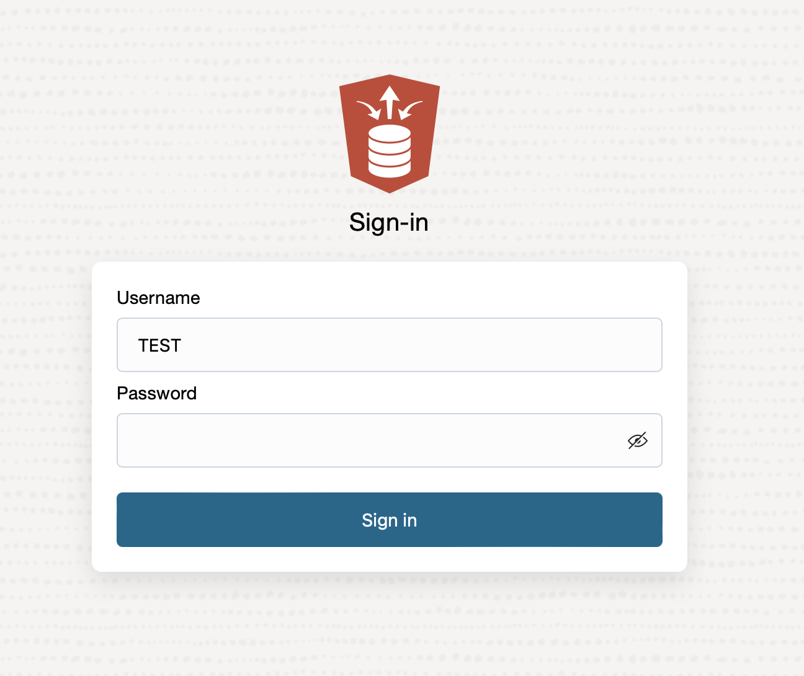
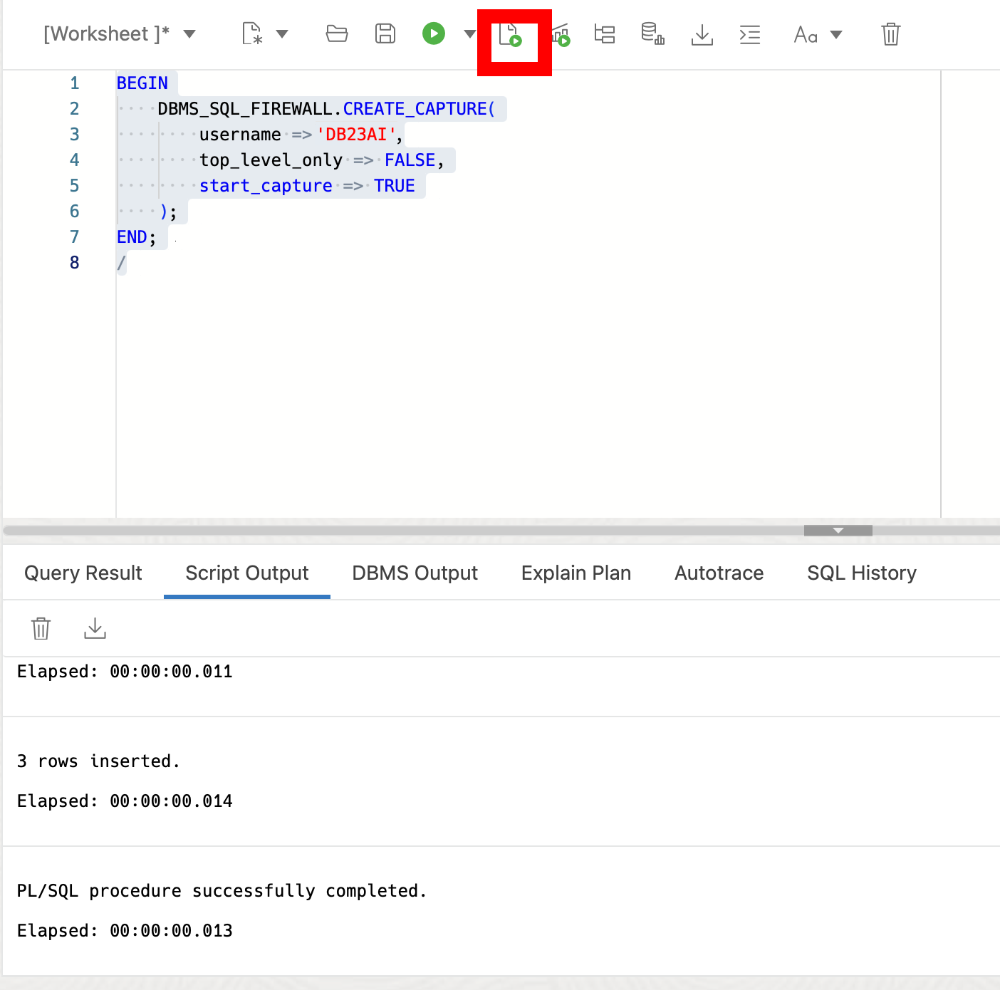
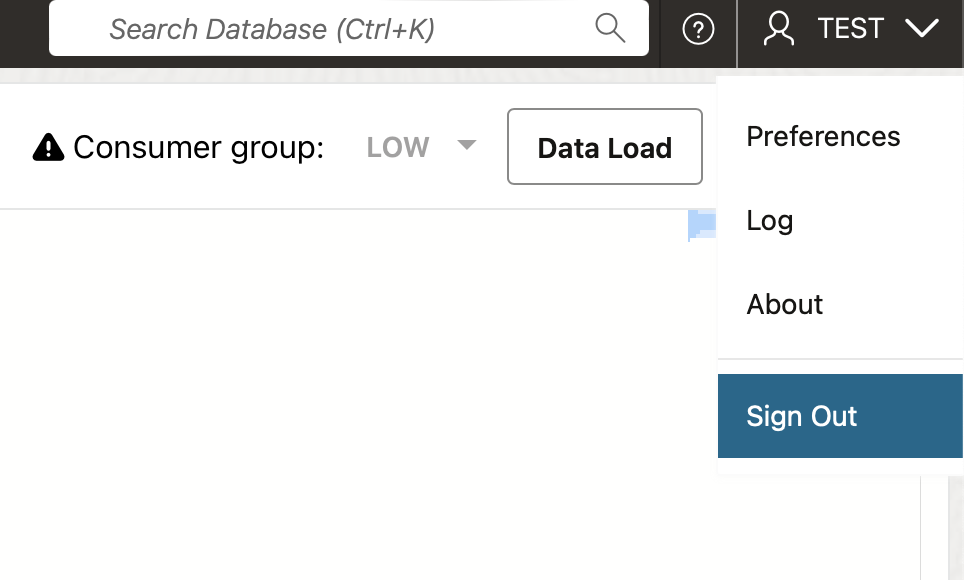
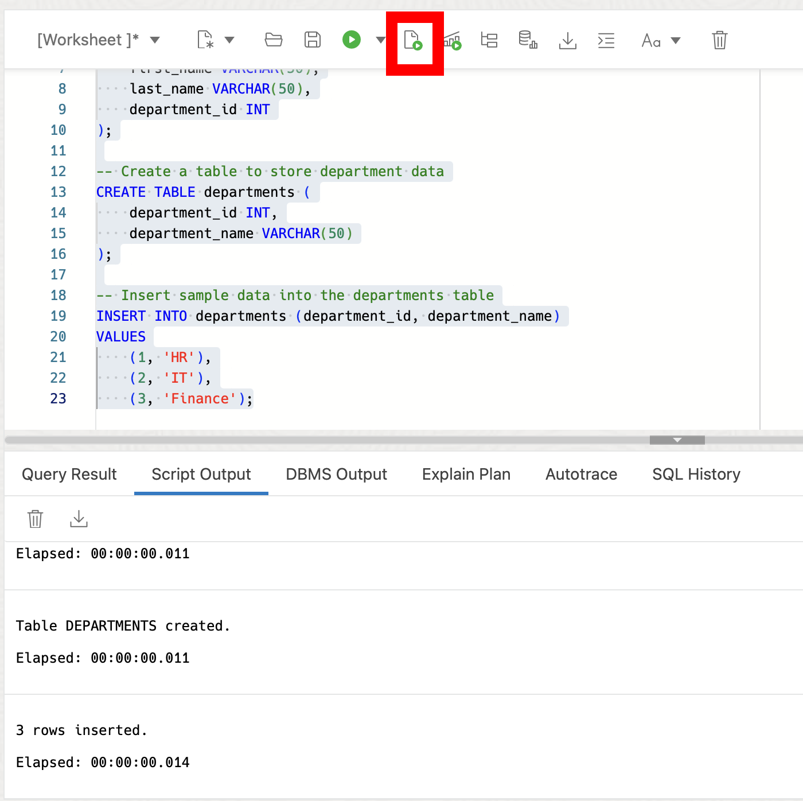
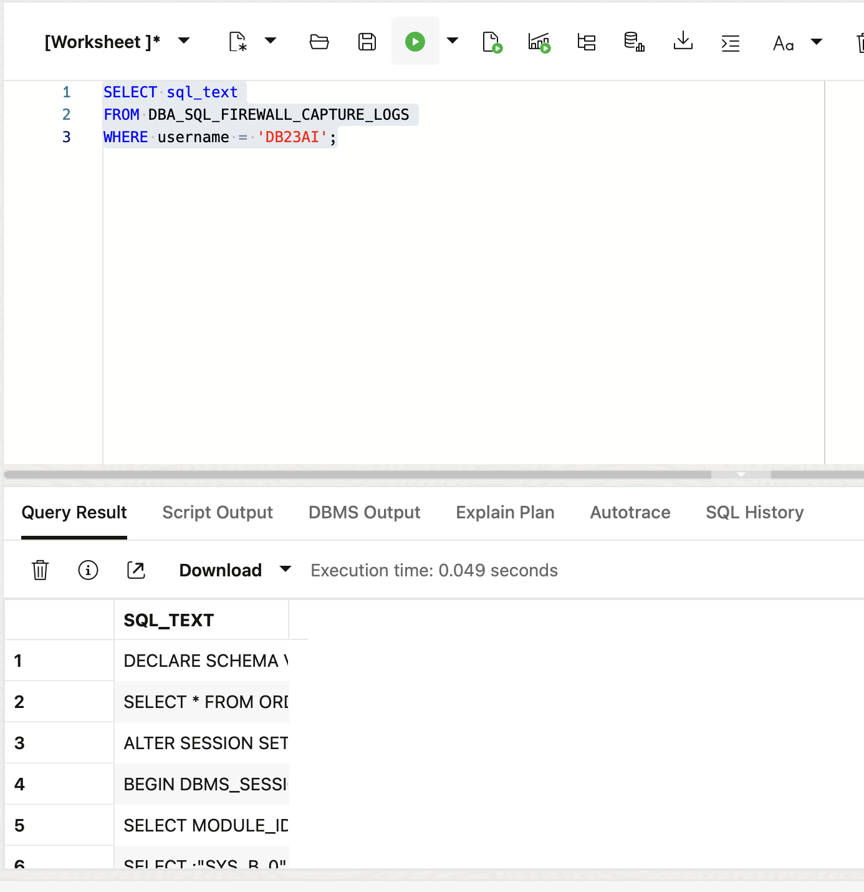
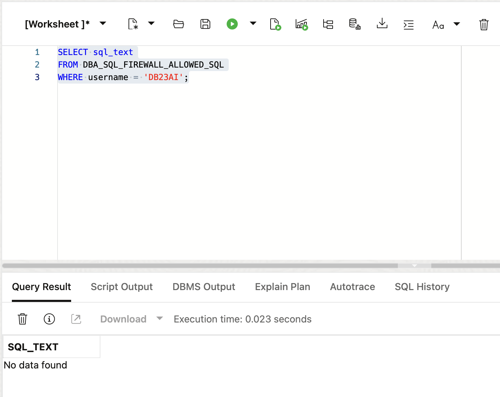
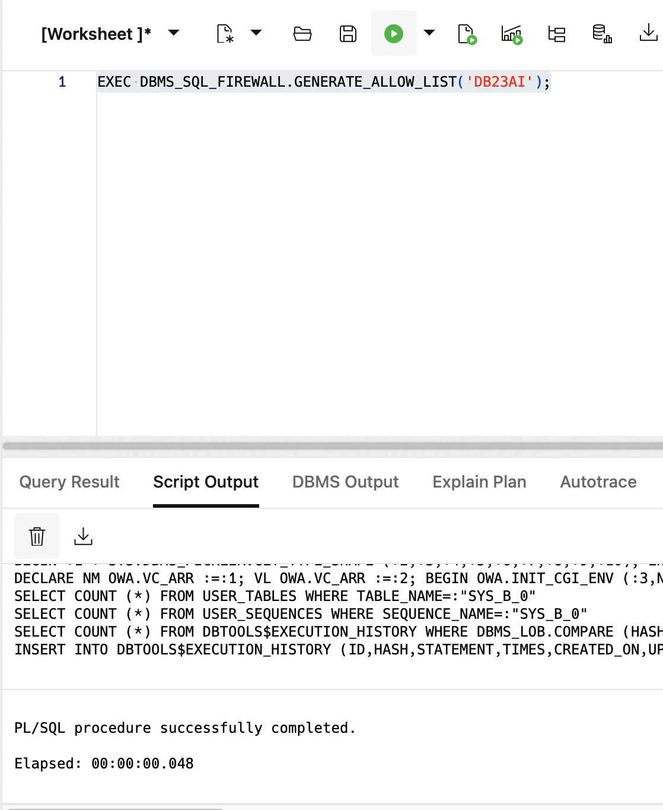
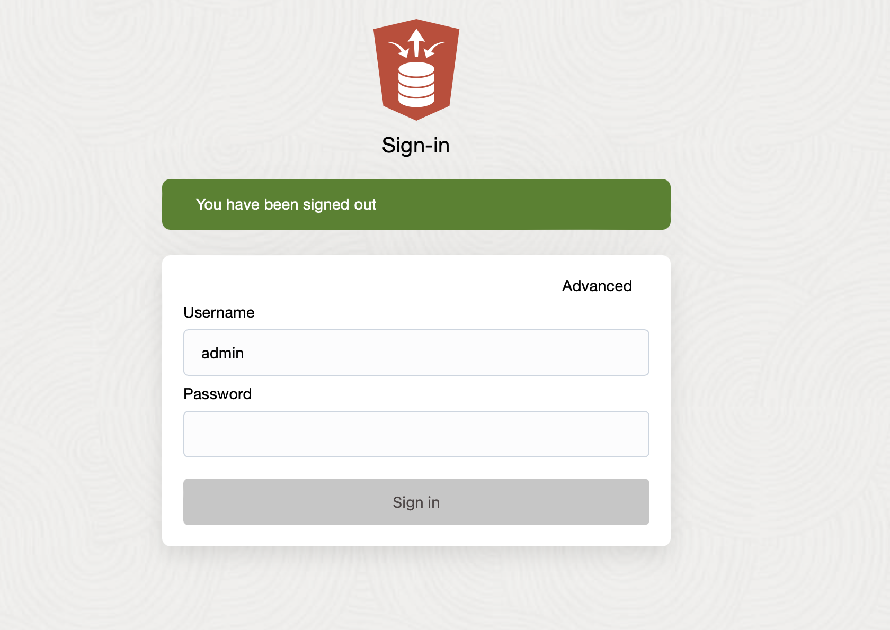

# Exploring SQL Firewall in Oracle Database 23ai

## Introduction

Welcome to the "Exploring SQL Firewall in Oracle Database 23ai" workshop. In this workshop, you will learn about the SQL Firewall feature introduced in Oracle Database 23ai, which provides real-time protection against common database attacks by monitoring and blocking unauthorized SQL and SQL injection attempts. By the end of this workshop, you will be able to configure and use the SQL Firewall to enhance the security of your database applications. **This lab is a very high level overview of SQL Firewall and does not show all of SQL Firewalls capabilities. For a comprehensive SQL Firewall workshop please try the following lab:**

[SQL Firewall LiveLab](https://livelabs.oracle.com/pls/apex/r/dbpm/livelabs/view-workshop?wid=3875)

Estimated Lab Time: 20 minutes

### Objective:
The objective of this workshop is to familiarize you with the SQL Firewall feature in Oracle Database 23ai. You will learn how to enable the firewall, capture and allow authorized SQL statements, enforce security policies based on SQL and environmental contexts, and monitor for violations. Please note, this lab is meant to teach you how SQL Firewall works at a very high level. If you would like to see a full SQL Firewall workshop, please check the lab above.

### Prerequisites:
- Access to Oracle Database 23ai environment.
- Basic understanding of SQL.

## Task 1: Enabling SQL Firewall

1. If you haven't done so already, from the Autonomous Database home page, **click** Database action and then **click** SQL.
    

2. Before we begin, this lab will be using Database Actions Web. If you're unfamiliar, please see the picture below for a simple explanation of the tool. You can click on the photo to enlarge it.

    

2. For this lab, we'll create two new users, 'TEST' and 'DB23AI' and grant necessary roles including SQL\_FIREWALL\_ADMIN and the developer role respectively.

    ```
    <copy>
    -- Create USER SQL
    CREATE USER TEST IDENTIFIED BY Oracledb_4U#;

    -- Grant roles
    GRANT CONNECT TO TEST;
    GRANT RESOURCE TO TEST;
    GRANT SQL_FIREWALL_ADMIN TO TEST WITH ADMIN OPTION;

    -- Enable REST
    BEGIN
        ORDS_ADMIN.ENABLE_SCHEMA(
            p_enabled => TRUE,
            p_schema => 'TEST',
            p_url_mapping_type => 'BASE_PATH',
            p_url_mapping_pattern => 'test',
            p_auto_rest_auth=> TRUE
        );

        -- Enable data sharing
        C##ADP$SERVICE.DBMS_SHARE.ENABLE_SCHEMA(
                SCHEMA_NAME => 'TEST',
                ENABLED => TRUE
        );
        commit;
    END;
    /

    -- Set quota
    ALTER USER TEST QUOTA 100M ON DATA;

    </copy>
    ```
    Don't forget the second user!

    ```
    <copy>
    -- USER SQL
    CREATE USER DB23AI IDENTIFIED BY Oracledb_4U#;

    -- ADD ROLES
    GRANT CONNECT TO DB23AI;
    GRANT DB_DEVELOPER_ROLE TO DB23AI;
    GRANT RESOURCE TO DB23AI;

    -- REST ENABLE
    BEGIN
        ORDS_ADMIN.ENABLE_SCHEMA(
            p_enabled => TRUE,
            p_schema => 'DB23AI',
            p_url_mapping_type => 'BASE_PATH',
            p_url_mapping_pattern => 'db23ai',
            p_auto_rest_auth=> TRUE
        );
        -- ENABLE DATA SHARING
        C##ADP$SERVICE.DBMS_SHARE.ENABLE_SCHEMA(
                SCHEMA_NAME => 'DB23AI',
                ENABLED => TRUE
        );
        commit;
    END;
    /

    -- QUOTA
    ALTER USER DB23AI QUOTA UNLIMITED ON DATA;


    </copy>
    ```
    


3. Sign out of the admin user and sign in as the TEST user

    

4. Sign in to the TEST user using credentials:
    - Username: TEST
    - Password: Oracledb_4U#

    

5. Click the Hamburger menu, select SQL.

    

6. Enable SQL Firewall for the TEST user using the PL/SQL command:
    ```
    <copy>
    EXEC DBMS_SQL_FIREWALL.ENABLE;
    </copy>
    ```
    

8. Start capturing SQL traffic for the DB23AI user to learn normal activities.

    ```
    <copy>
    BEGIN
        DBMS_SQL_FIREWALL.CREATE_CAPTURE(
            username => 'DB23AI',
            top_level_only => TRUE,
            start_capture => TRUE
        );
    END;
    /
    </copy>
    ```
    

9. Now sign out of the TEST user and back in as the DB23AI user. 

    * the password is Oracledb_4U#

    
    

10. Select the SQL tile so we can run some typical SQL operations to capture normal activities (e.g., select and insert statements).

    ```
    <copy>
    DROP TABLE IF EXISTS EMPLOYEES CASCADE CONSTRAINTS;
    DROP TABLE IF EXISTS DEPARTMENTS CASCADE CONSTRAINTS;

    -- Create employees table
    CREATE TABLE employees (
        employee_id INT,
        first_name VARCHAR(50),
        last_name VARCHAR(50),
        department_id INT
    );

    -- Create departments table
    CREATE TABLE departments (
        department_id INT,
        department_name VARCHAR(50)
    );

    -- Insert data into departments table
    INSERT INTO departments (department_id, department_name)
    VALUES
        (1, 'HR'),
        (2, 'IT'),
        (3, 'Finance');
    </copy>
    ```
    

11. Log back in as the TEST user

    * the password is Oracledb_4U#

    
    


10. Click the SQL tile and stop the capture once all relevant activities are recorded.

    ```
    <copy>
    EXEC DBMS_SQL_FIREWALL.STOP_CAPTURE('DB23AI');
    </copy>
    ```
    


## Task 2: Reviewing Captured Data

1. Query the SQL Firewall-specific data dictionary views to review the captured data.

    ```
    <copy>
    SELECT sql_text
    FROM DBA_SQL_FIREWALL_CAPTURE_LOGS
    WHERE username = 'DB23AI';
    </copy>
    ```

    

    Remember we are capturing everything. We are going to see the statements we ran as well as the things we clicked on inside of database actions, like signing in and out of our user.

2. Check the allow list, which will initially be empty.

    ```
    <copy>
    SELECT sql_text
    FROM DBA_SQL_FIREWALL_ALLOWED_SQL
    WHERE username = 'DB23AI';
    </copy>
    ```
    

3. For this small demo, we'll turn our capture logs into our allow list. This is where you'd want to customize it yourself in a production system.
    ```
    <copy>
    EXEC DBMS_SQL_FIREWALL.GENERATE_ALLOW_LIST('DB23AI');
    </copy>
    ```
    

4.  Now we can enable SQL firewall so only SQL from our allow list can hit the database. 

    ```
    <copy>
    EXEC DBMS_SQL_FIREWALL.ENABLE_ALLOW_LIST(username=>'DB23AI', enforce=>DBMS_SQL_FIREWALL.ENFORCE_SQL, block=>TRUE);
    </copy>
    ```
    

5. Now sign out of the TEST user and back in as the DB23AI user. 

    * the password is Oracledb_4U#

    
    

6. Click the SQL tile again and attempt to execute a statement not in the allow list to verify SQL Firewall enforcement. Notice we get a SQL Firewall Violation error.

    ```
    <copy>
    SELECT * FROM DEPARTMENTS;
    </copy>
    ```
    

7. Log back in as the TEST user

    * the password is Oracledb_4U#

    
    

8. We can review the violation log for abnormal SQL.
    ```
    <copy>
    SELECT SQL_TEXT, FIREWALL_ACTION, IP_ADDRESS, CAUSE, OCCURRED_AT
    FROM DBA_SQL_FIREWALL_VIOLATIONS WHERE USERNAME = 'DB23AI';
    </copy>
    ```

9. We can also disable the allow list.

    ```
    <copy>
    EXEC DBMS_SQL_FIREWALL.DISABLE_ALLOW_LIST(username=>'DB23AI');
    </copy>
    ```


## Task 3: Clean up

1. Sign back in with the **admin** user. 

    If you've forgotten your password, it can be found by clicking the **View login info** button in the top left of these instruction. Alternatively, you can watch the gif below to find the password.  

    

2. Now using the password we found above, sign in as the admin user. 

    


3. Terminate any active sessions created by the TEST user and drop the user.

    ```
    <copy>
    BEGIN
    FOR session IN (SELECT SID, SERIAL# FROM V$SESSION WHERE USERNAME = 'TEST') LOOP
        EXECUTE IMMEDIATE 'ALTER SYSTEM KILL SESSION ''' || session.SID || ',' || session.SERIAL# || ''' IMMEDIATE';
    END LOOP;
    END;
    /

    BEGIN
    FOR session IN (SELECT SID, SERIAL# FROM V$SESSION WHERE USERNAME = 'DB23AI') LOOP
        EXECUTE IMMEDIATE 'ALTER SYSTEM KILL SESSION ''' || session.SID || ',' || session.SERIAL# || ''' IMMEDIATE';
    END LOOP;
    END;

    </copy>
    ```
    

4. Now drop both users

    ```
    <copy>
    DROP USER TEST CASCADE;
    DROP USER DB23AI CASCADE;
    </copy>
    ```

You may now **proceed to the next lab** 

## Learn More

* [SQL Firewall Documentation](https://docs.oracle.com/en/database/oracle/oracle-database/23/dbseg/using-oracle-sql-firewall.html#GUID-AFC076FE-7E96-464D-B634-593902CB4179)
* [SQL Firewall LiveLab](https://livelabs.oracle.com/pls/apex/r/dbpm/livelabs/view-workshop?wid=3875)

## Acknowledgements

* **Author** - Killian Lynch, Database Product Management
* **Contributors** - Dom Giles, Distinguished Database Product Manager
* **Last Updated By/Date** - Killian Lynch, April 2024
