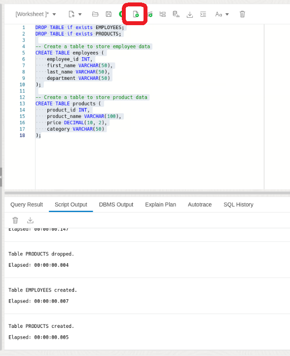
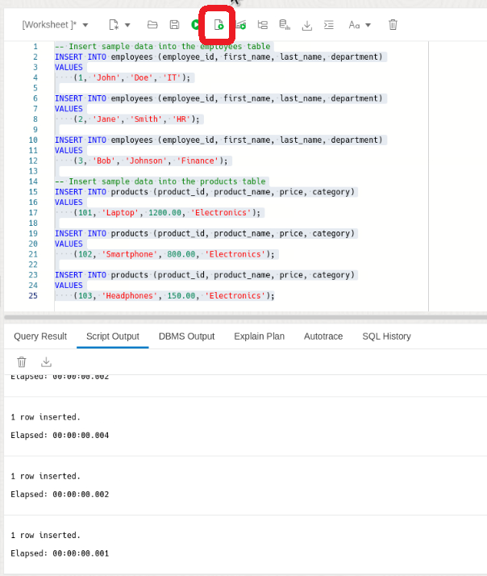
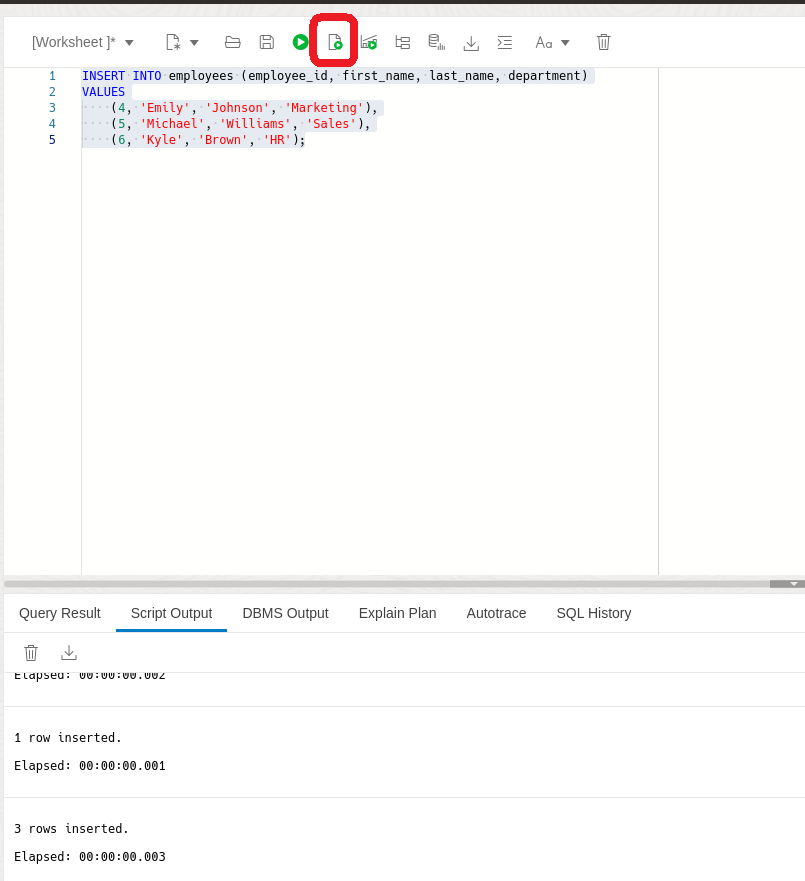
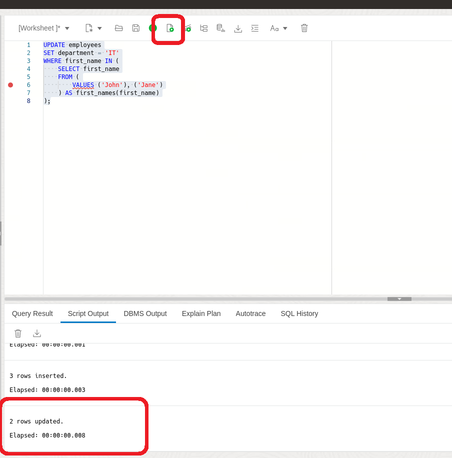
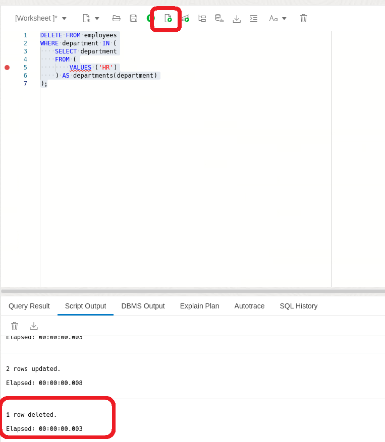
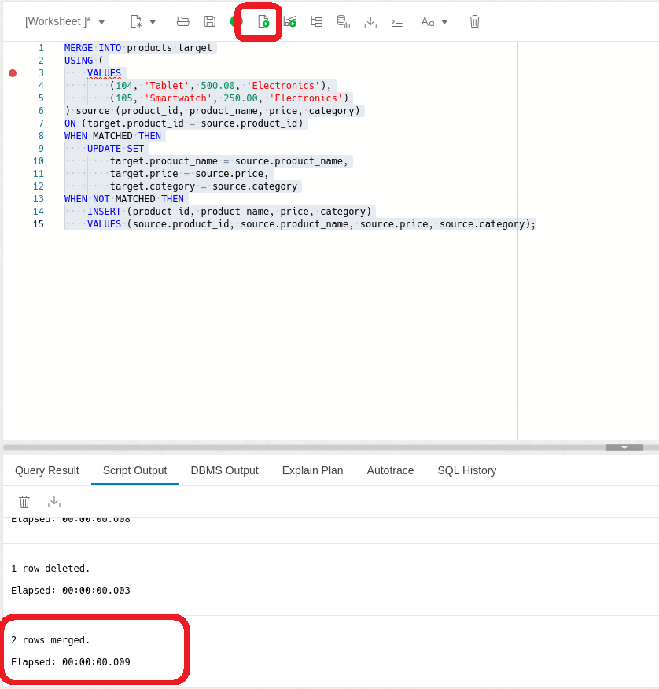

# Exploring the Power of Table Value Constructors in SQL

## Introduction

Welcome to the "Exploring the Power of Table Value Constructors in SQL" lab. In this lab, you will learn about the table value constructor feature in SQL, which allows you to define multiple rows using a single constructor for use in SQL statements. Table value constructors provide an easy way to insert, select, and merge multiple rows of data in SQL databases.

Estimated Lab Time: 10 minutes

### Objective:
The objective of this lab is to familiarize you with the table value constructor feature in SQL and demonstrate its practical applications for data manipulation tasks. By the end of this lab, you will be able to use table value constructors to insert, select, update, and merge data in SQL databases effectively.

### Prerequisites:
- Access to Oracle Database 23ai.
- Basic understanding of SQL is helpful.

## Task 1: Lab setup

1. If you haven't done so already, from the Autonomous Database home page, **click** Database action and then **click** SQL.
    

    Using the ADMIN user isn’t typically advised due to the high level of access and security concerns it poses. **However**, for this demo, we’ll use it to simplify the setup and ensure we can show the full range of features effectively. 

2. Before we begin, this lab will be using Database Actions Web. If you're unfamiliar, please see the picture below for a simple explanation of the tool. You can click on the photo to enlarge it.

    
    
2. Let's create some tables to use in the lab. Copy and run the following SQL script:

    ```
    <copy>
    DROP TABLE if exists EMPLOYEES cascade constraints;
    DROP TABLE if exists PRODUCTS cascade constraints;

    -- Create a table to store employee data
    CREATE TABLE employees (
        employee_id INT,
        first_name VARCHAR(50),
        last_name VARCHAR(50),
        department VARCHAR(50)
    );

    -- Create a table to store product data
    CREATE TABLE products (
        product_id INT,
        product_name VARCHAR(100),
        price DECIMAL(10, 2),
        category VARCHAR(50)
    );

    </copy>
    ```
    

## Task 2: Understanding Table Value Constructors

1. Table value constructors, also known as row value constructors, allow you to specify multiple rows of data within a single INSERT, SELECT, UPDATE, or MERGE statement. This feature simplifies the process of working with multiple rows of data, eliminating the need for multiple INSERT or SELECT statements.

    The syntax for using table value is as follows:

    ```
    VALUES (value_list_1), (value_list_2), ... (value_list_n)
    ```
    Each value\_list represents a set of values for a single row, enclosed within parentheses. Multiple value\_lists can be specified, separated by commas.

2. Let's first take a look at how we inserted into tables prior to Table Value Constructors

    ```
    <copy>
    -- Insert sample data into the employees table
    INSERT INTO employees (employee_id, first_name, last_name, department)
    VALUES
        (1, 'John', 'Doe', 'IT');

    INSERT INTO employees (employee_id, first_name, last_name, department)
    VALUES
        (2, 'Jane', 'Smith', 'HR');

    INSERT INTO employees (employee_id, first_name, last_name, department)
    VALUES
        (3, 'Bob', 'Johnson', 'Finance');

    -- Insert sample data into the products table
    INSERT INTO products (product_id, product_name, price, category)
    VALUES
        (101, 'Laptop', 1200.00, 'Electronics');

    INSERT INTO products (product_id, product_name, price, category)
    VALUES
        (102, 'Smartphone', 800.00, 'Electronics');

    INSERT INTO products (product_id, product_name, price, category)
    VALUES
        (103, 'Headphones', 150.00, 'Electronics');
    </copy>
    ```
    

3. Above each insert has its own statement. Suppose we want to insert multiple rows into the employees table. With Table Value Constructors we can insert rows into the tables using a single INSERT statement with table value constructors.

    ```
    <copy>
    INSERT INTO employees (employee_id, first_name, last_name, department)
    VALUES
        (4, 'Emily', 'Johnson', 'Marketing'),
        (5, 'Michael', 'Williams', 'Sales'),
        (6, 'Kyle', 'Brown', 'HR');

    </copy>
    ```
    

    Table value constructors are particularly useful for inserting large amounts of data efficiently. Instead of executing multiple INSERT statements, you can insert multiple rows in a single statement. This can help in reducing overhead and improving performance.

## Task 3: Data Manipulation
1. You can use table value constructors in SELECT, UPDATE, and DELETE statements to manipulate data more efficiently. For example, you can update multiple rows based on specific criteria or delete multiple rows that meet certain conditions.

    Suppose we want to update the department for employees whose first name starts with 'J'. We can use a table value constructor in the UPDATE statement:

    ```
    <copy>
    UPDATE employees
    SET department = 'IT'
    WHERE first_name IN (
        SELECT first_name
        FROM (
            VALUES ('John'), ('Jane')
        ) AS first_names(first_name)
    );

    </copy>
    ```
    

    In this example, we're updating the department to 'IT' for employees whose first name is 'John' or 'Jane'.

2. Suppose we want to delete employees whose department is 'HR'. We can use a table value constructor in the DELETE statement:

    ```
    <copy>
    DELETE FROM employees
    WHERE department IN (
        SELECT department
        FROM (
            VALUES ('HR')
        ) AS departments(department)
    );
    </copy>
    ```
    

    In this example, we're deleting employees whose department is 'HR'.

## Task 4: Merging Data

1. Table value constructors can simplify the process of merging data from one table into another. You can use them in conjunction with the MERGE statement to perform conditional inserts, updates, and deletes in a single operation.

    Suppose we have a new set of products to merge into the products table. We want to insert new products and update existing products based on their product IDs:

    ```
    <copy>
    MERGE INTO products target
    USING (
        VALUES
            (104, 'Tablet', 500.00, 'Electronics'),
            (105, 'Smartwatch', 250.00, 'Electronics')
    ) source (product_id, product_name, price, category)
    ON (target.product_id = source.product_id)
    WHEN MATCHED THEN
        UPDATE SET
            target.product_name = source.product_name,
            target.price = source.price,
            target.category = source.category
    WHEN NOT MATCHED THEN
        INSERT (product_id, product_name, price, category)
        VALUES (source.product_id, source.product_name, source.price, source.category);
    </copy>
    ```
    

    In this example, we're using the MERGE statement with a table value constructor to merge new products into the products table. Existing products are updated if they match on the product ID, and new products are inserted if they don't exist.

2. In this Lab, we've explored practical applications of table value constructors in SQL. We've learned how to insert, update, and delete multiple rows of data using table value constructors, as well as how to use them in conjunction with the MERGE statement for data merging operations.

3. We can clean up from the lab by dropping our tables.

    ```
    <copy>
    DROP TABLE EMPLOYEES cascade constraints;
    DROP TABLE PRODUCTS cascade constraints;
    </copy>
    ```

You may now **proceed to the next lab** 


## Learn More

* [New value constructor in 23ai](https://blogs.oracle.com/coretec/post/new-value-constructor-in-23ai)
* [Table Value Constructor Documentation](https://docs.oracle.com/en/database/oracle/oracle-database/23/sqlrf/IN-Condition.html#SQLRF-GUID-C7961CB3-8F60-47E0-96EB-BDCF5DB1317C)

## Acknowledgements
* **Author** - Killian Lynch, Database Product Management
* **Contributors** - Dom Giles, Distinguished Database Product Manager
* **Last Updated By/Date** - Killian Lynch, April 2024