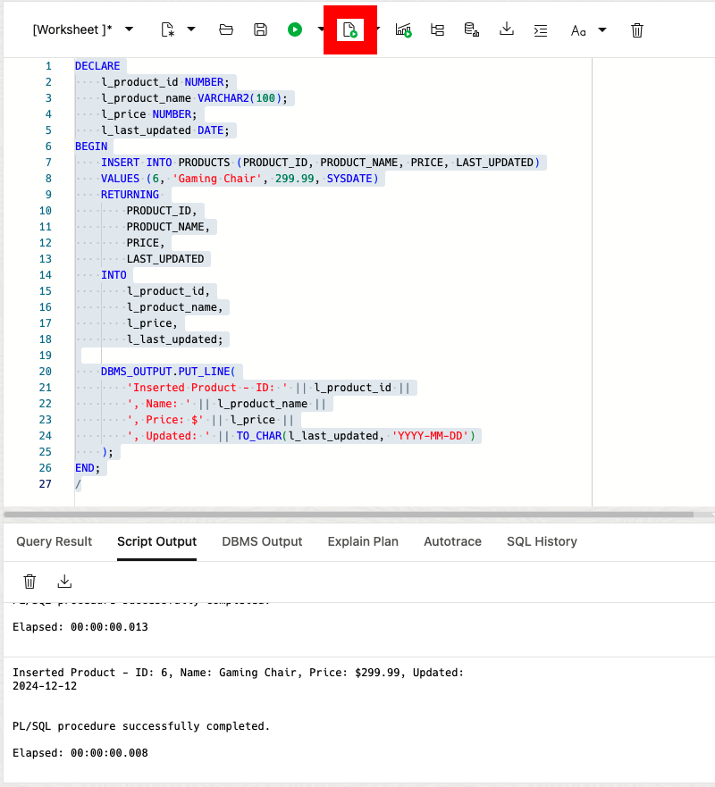

# Enhanced Data Retrieval with DML RETURNING Clause

## Introduction

Welcome to Enhanced Data Retrieval with DML RETURNING Clause! In this lab, you'll learn about the enhanced RETURNING clause feature in Oracle Database 23ai. This feature allows you to retrieve both old and new values during DML operations, making your data manipulation tasks more efficient.

Estimated Lab Time: 10 minutes

### Objective:
The goal of this lab is to help you understand and use the enhanced RETURNING clause effectively in SQL. By the end of this lab, you'll be able to retrieve both new and old values during your DML.

### Prerequisites:
- Access to Oracle Database 23ai
- Basic understanding of SQL is helpful

## Task 1: Working with the Enhanced RETURNING clause

1. If you haven't done so already, from the Autonomous Database home page, **click** Database action and then **click** SQL.
    

    Using the ADMIN user isn't typically advised due to the high level of access and security concerns it poses. **However**, for this demo, we'll use it to simplify the setup and ensure we can show the full range of features effectively.

2. Before we begin, this lab will be using Database Actions Web. If you're unfamiliar, please see the picture below for a simple explanation of the tool. You can click on the photo to enlarge it.

    

3. Let's imagine you're managing an e-commerce platform and need to track price changes for audit purposes. You want to capture both the old and new prices whenever there's an **update** to product prices.

    ```
    <copy>
    DROP TABLE if exists PRODUCTS CASCADE CONSTRAINT;
    
    -- Create PRODUCTS table
    CREATE TABLE PRODUCTS (
        PRODUCT_ID INT PRIMARY KEY,
        PRODUCT_NAME VARCHAR(100),
        PRICE DECIMAL(10,2),
        LAST_UPDATED DATE
    );

    -- Insert sample data
    INSERT INTO PRODUCTS (PRODUCT_ID, PRODUCT_NAME, PRICE, LAST_UPDATED) VALUES
    (1, 'Gaming Laptop', 1299.99, SYSDATE),
    (2, 'Wireless Mouse', 49.99, SYSDATE),
    (3, 'Mechanical Keyboard', 129.99, SYSDATE),
    (4, 'Gaming Monitor', 399.99, SYSDATE),
    (5, 'Gaming Headset', 89.99, SYSDATE);
    </copy>
    ```
    

4. Let's check current product prices before making any changes:

    ```
    <copy>
    SELECT PRODUCT_ID, PRODUCT_NAME, PRICE
    FROM PRODUCTS
    ORDER BY PRODUCT_ID;
    </copy>
    ```
    

5. To use the RETURNING clause to capture both old and new prices during updates, we'll use PL/SQL. Here's how to increase all prices by 10% and capture the changes:

    ```
    <copy>
    DECLARE
        TYPE t_product_name IS TABLE OF VARCHAR2(100);
        TYPE t_price IS TABLE OF NUMBER;
        l_product_names t_product_name;
        l_old_prices t_price;
        l_new_prices t_price;
        l_price_differences t_price;
    BEGIN
        UPDATE PRODUCTS
        SET PRICE = PRICE * 1.1,
            LAST_UPDATED = SYSDATE
        RETURNING 
            PRODUCT_NAME,
            OLD PRICE,
            NEW PRICE,
            ROUND((NEW PRICE - OLD PRICE), 2)
        BULK COLLECT INTO 
            l_product_names,
            l_old_prices,
            l_new_prices,
            l_price_differences;
            
        -- Display the results
        FOR i IN 1..l_product_names.COUNT LOOP
            DBMS_OUTPUT.PUT_LINE(
                'Product: ' || l_product_names(i) ||
                ', Old Price: $' || l_old_prices(i) ||
                ', New Price: $' || l_new_prices(i) ||
                ', Difference: $' || l_price_differences(i)
            );
        END LOOP;
    END;
    /
    </copy>
    ```
    

6. While UPDATE operations let us see both old and new values, DELETE operations are different - they let us capture information about the records we're removing before they're deleted. This can be useful for auditing or logging purposes. Let's see this in action by removing products under $100 and capturing their details before they're deleted:

    ```
    <copy>
    DECLARE
        TYPE t_product_name IS TABLE OF VARCHAR2(100);
        TYPE t_price IS TABLE OF NUMBER;
        TYPE t_date IS TABLE OF DATE;
        l_product_names t_product_name;
        l_prices t_price;
        l_last_updated t_date;
    BEGIN
        DELETE FROM PRODUCTS 
        WHERE PRICE < 100
        RETURNING 
            PRODUCT_NAME,
            PRICE,
            LAST_UPDATED
        BULK COLLECT INTO 
            l_product_names,
            l_prices,
            l_last_updated;
            
        -- Display info about the deleted products
        FOR i IN 1..l_product_names.COUNT LOOP
            DBMS_OUTPUT.PUT_LINE(
                'Deleted Product: ' || l_product_names(i) ||
                ', Price: $' || l_prices(i) ||
                ', Last Updated: ' || TO_CHAR(l_last_updated(i), 'YYYY-MM-DD')
            );
        END LOOP;
        
        -- Show how many products were deleted
        DBMS_OUTPUT.PUT_LINE('Total products deleted: ' || l_product_names.COUNT);
    END;
    /
    </copy>
    ```

    This code does the following:
    * Find all products priced under $100
    * Before deleting them, capture their names, prices, and last update dates
    * Delete the products

    

7. Let's add a new product and use `RETURNING` to confirm the insertion. `INSERT` statements do not report old values because we are inserting something new.

    ```
    <copy>
    DECLARE
        l_product_id NUMBER;
        l_product_name VARCHAR2(100);
        l_price NUMBER;
        l_last_updated DATE;
    BEGIN
        INSERT INTO PRODUCTS (PRODUCT_ID, PRODUCT_NAME, PRICE, LAST_UPDATED)
        VALUES (6, 'Gaming Chair', 299.99, SYSDATE)
        RETURNING 
            PRODUCT_ID,
            PRODUCT_NAME,
            PRICE,
            LAST_UPDATED
        INTO
            l_product_id,
            l_product_name,
            l_price,
            l_last_updated;
            
        DBMS_OUTPUT.PUT_LINE(
            'Inserted Product - ID: ' || l_product_id ||
            ', Name: ' || l_product_name ||
            ', Price: $' || l_price ||
            ', Updated: ' || TO_CHAR(l_last_updated, 'YYYY-MM-DD')
        );
    END;
    /
    </copy>
    ```
    

8. In this Lab, you learned how to use the enhanced RETURNING clause to retrieve both old and new values during DML operations. This feature helps in auditing, debugging, and maintaining data consistency. Feel free to continue practicing or choose a new lab to try out!

9. We can clean up from the lab by dropping our table:

    ```
    <copy>
    DROP TABLE if exists PRODUCTS CASCADE CONSTRAINT;
    </copy>
    ```

## Learn More

* [DML RETURNING Clause Enhancements Documentation](https://docs.oracle.com/en/database/oracle/oracle-database/23/sqlrf/UPDATE.html)

## Acknowledgements
* **Author** - Killian Lynch, Database Product Management
* **Contributors**
* **Last Updated By/Date** - Killian Lynch, December 2024
