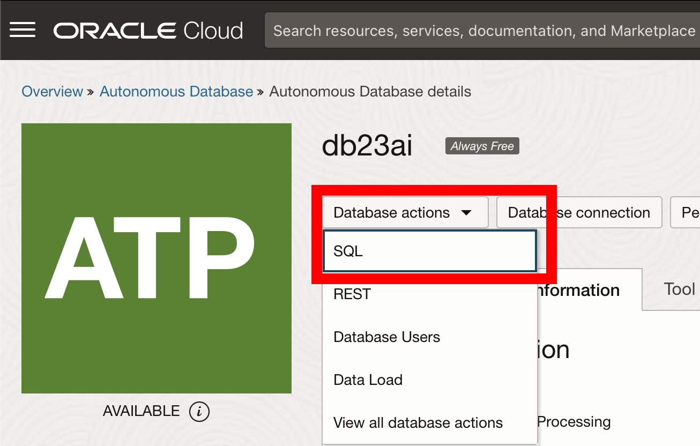
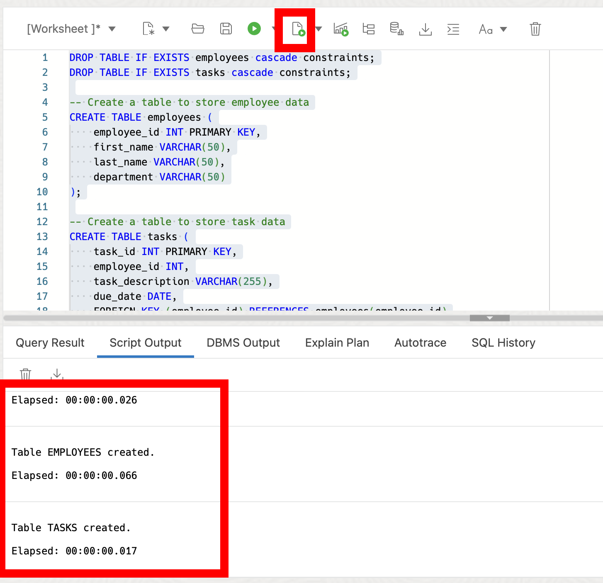
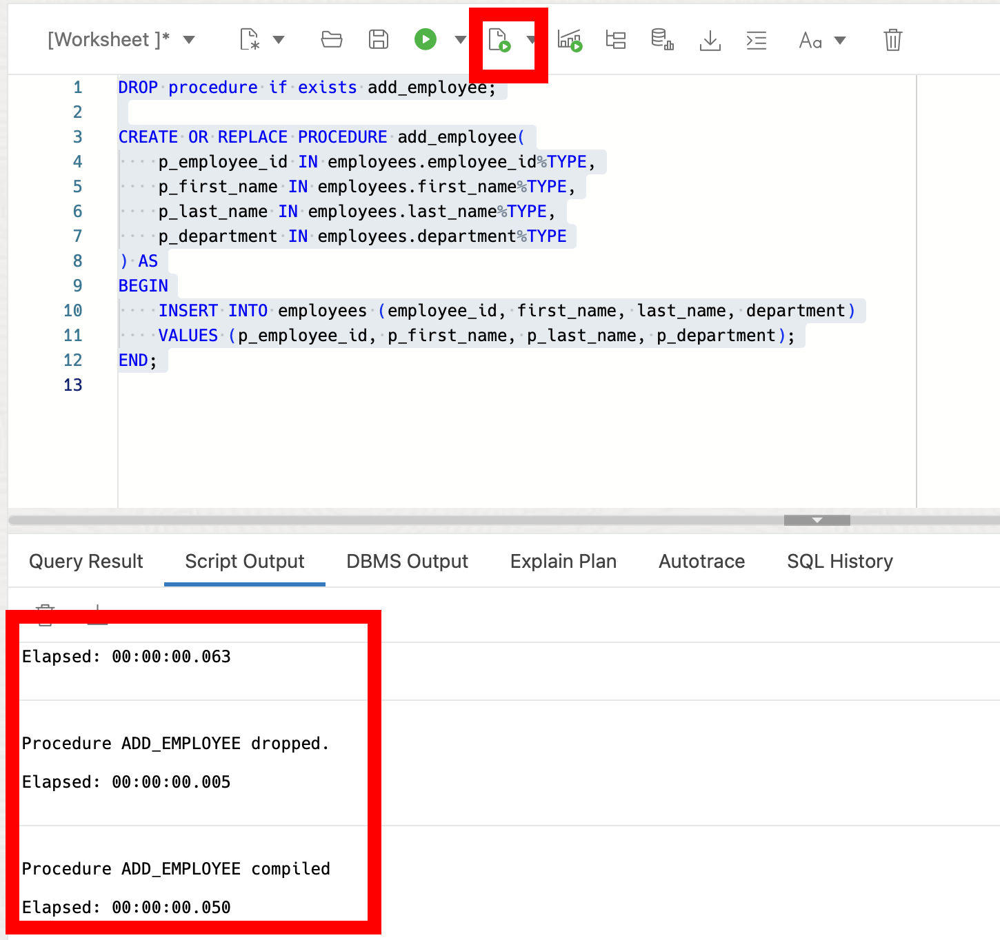
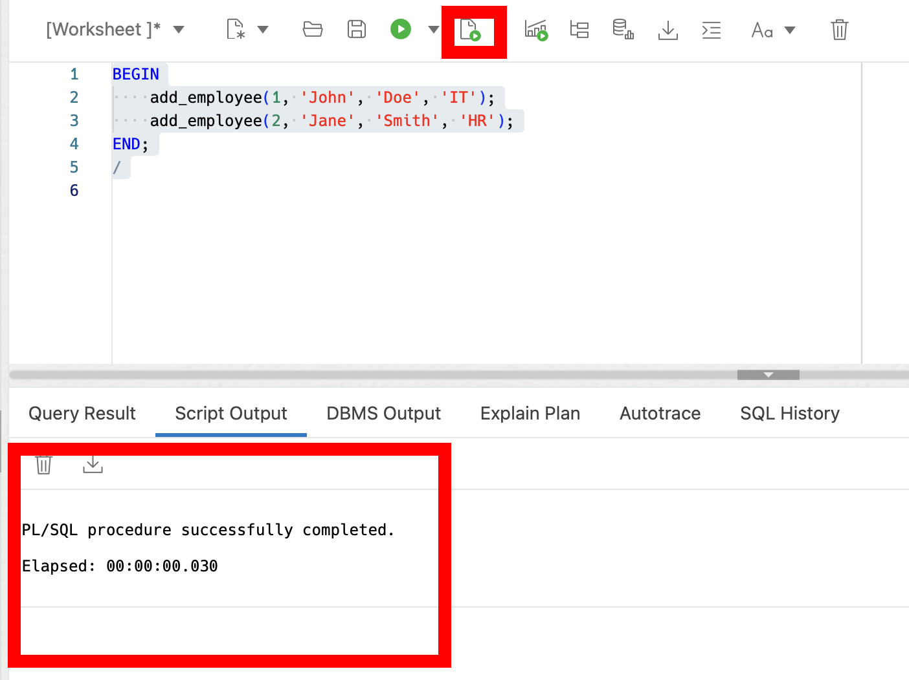
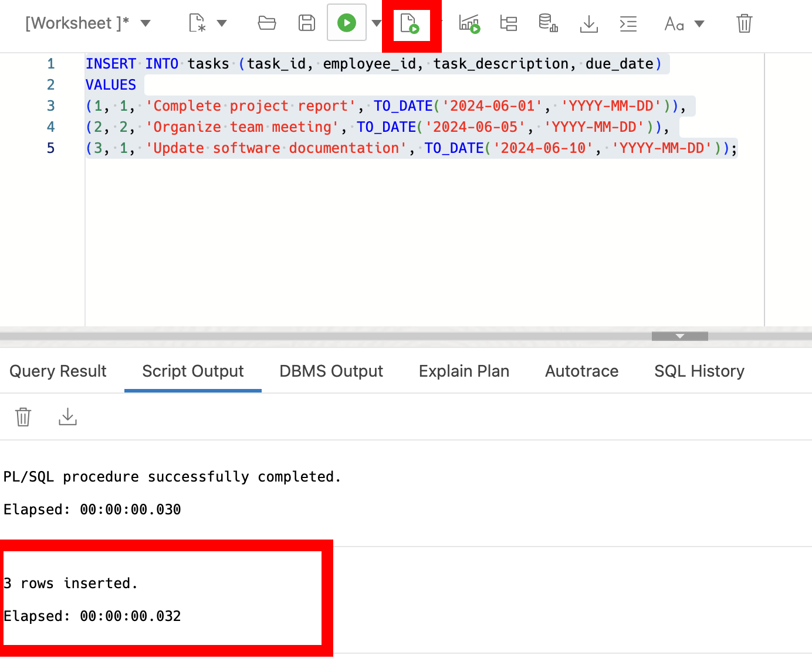
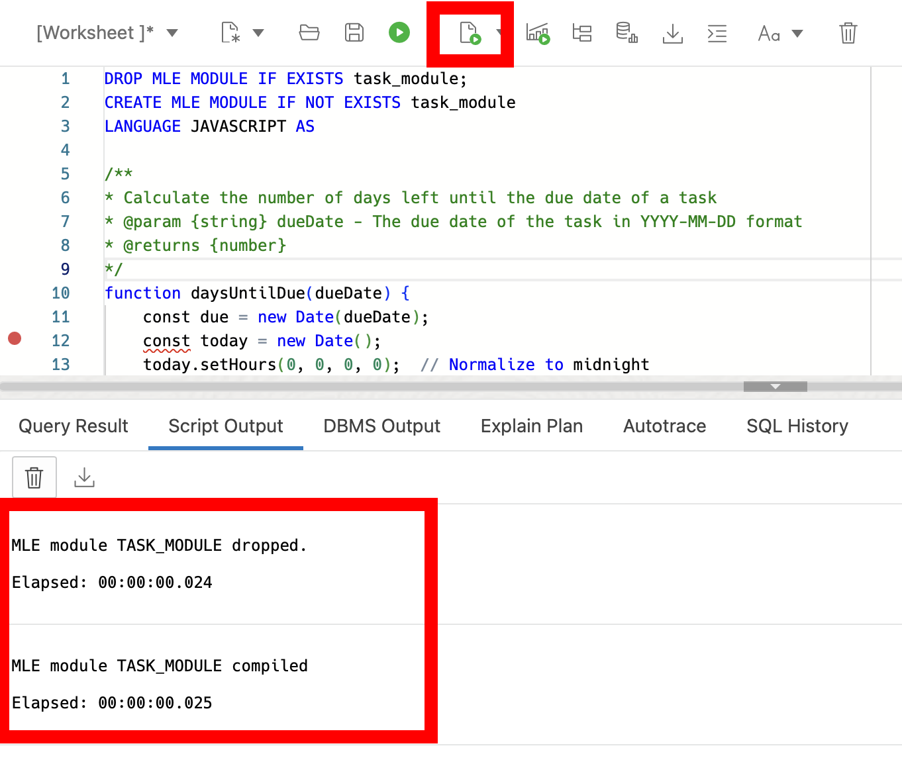

# JavaScript Stored Procedures

## Introduction

In this workshop, you will learn about the advanced programming capabilities of the Oracle Database, including server-side programming using PL/SQL and JavaScript. Oracle Database's support for various programming languages enables developers to implement complex business logic directly within the database, ensuring efficient and scalable applications.

Estimated Lab Time: 25 minutes

### Objective:
The objective of this workshop is to familiarize you with the server-side programming features of the Oracle Database, focusing on PL/SQL and JavaScript. By the end of this workshop, you will be able to create and execute stored procedures using PL/SQL and JavaScript, leveraging the power of the Oracle Database for efficient data processing.

### Prerequisites:
- Access to Oracle Database 23ai.
- Basic understanding of SQL is helpful.

## Task 1: Lab setup

1. From the Autonomous Database home page, **click** Database action and then **click** SQL.
    
   
2. Let's create some tables to use in the lab. Copy and run the following SQL script:

    ```
    <copy>
    DROP TABLE IF EXISTS employees cascade constraints;
    DROP TABLE IF EXISTS tasks cascade constraints;

    -- Create a table to store employee data
    CREATE TABLE employees (
        employee_id INT PRIMARY KEY,
        first_name VARCHAR(50),
        last_name VARCHAR(50),
        department VARCHAR(50)
    );

    -- Create a table to store task data
    CREATE TABLE tasks (
        task_id INT PRIMARY KEY,
        employee_id INT,
        task_description VARCHAR(255),
        due_date DATE,
        FOREIGN KEY (employee_id) REFERENCES employees(employee_id)
    );

    </copy>
    ```
    

## Task 2: Creating and Using PL/SQL Stored Procedures

1. PL/SQL (Procedural Language/SQL) is Oracle's procedural extension for SQL. It allows you to write complex scripts that include variables, control structures, and SQL statements. Let's create a simple stored procedure to insert a new employee into the employees table.


    ```
    <copy>
    DROP procedure if exists add_employee;

    CREATE OR REPLACE PROCEDURE add_employee(
        p_employee_id IN employees.employee_id%TYPE,
        p_first_name IN employees.first_name%TYPE,
        p_last_name IN employees.last_name%TYPE,
        p_department IN employees.department%TYPE
    ) AS
    BEGIN
        INSERT INTO employees (employee_id, first_name, last_name, department)
        VALUES (p_employee_id, p_first_name, p_last_name, p_department);
    END;
    </copy>
    ```
    

2. Execute the stored procedure to add a new employee:

    ```
    <copy>
    BEGIN
        add_employee(1, 'John', 'Doe', 'IT');
        add_employee(2, 'Jane', 'Smith', 'HR');
    END;
    /
    </copy>
    ```
    

3. Add some tasks to our task table for addition context.

    ```
    <copy>
    INSERT INTO tasks (task_id, employee_id, task_description, due_date)
    VALUES
    (1, 1, 'Complete project report', TO_DATE('2024-06-01', 'YYYY-MM-DD')),
    (2, 2, 'Organize team meeting', TO_DATE('2024-06-05', 'YYYY-MM-DD')),
    (3, 1, 'Update software documentation', TO_DATE('2024-06-10', 'YYYY-MM-DD'));
    </copy>
    ```
    


## Task 3: Integrating JavaScript

1. With Oracle Database 23ai, you can write and execute JavaScript code directly within the database using the Multilingual Engine (MLE). Let's create a simple JavaScript module to process employee tasks.


    ```
    <copy>
    DROP MLE MODULE IF EXISTS task_module;
    CREATE MLE MODULE IF NOT EXISTS task_module 
    LANGUAGE JAVASCRIPT AS 

    /**
    * Calculate the number of days left until the due date of a task
    * @param {string} dueDate - The due date of the task in YYYY-MM-DD format
    * @returns {number}
    */
    function daysUntilDue(dueDate) {
        const due = new Date(dueDate);
        const today = new Date();
        today.setHours(0, 0, 0, 0);  // Normalize to midnight
        const timeDiff = due - today;  // Difference in milliseconds
        return Math.ceil(timeDiff / (1000 * 60 * 60 * 24));  // Convert to days
    }

    export { daysUntilDue }
    /;

    </copy>
    ```
    


2. Create a PL/SQL function to call the JavaScript module:

    ```
    <copy>
    CREATE FUNCTION days_until_due_date(
        p_due_date VARCHAR2
    ) RETURN NUMBER
    AS
    MLE MODULE task_module 
    SIGNATURE 'daysUntilDue(string)';
    /
    </copy>
    ```
    

3. Use the function to check the number of days until a task is due:
    ```
    <copy>
    SELECT 
        task_description, 
        days_until_due_date(TO_CHAR(due_date, 'YYYY-MM-DD')) AS days_left
    FROM tasks;
    </copy>
    ```

## Task 4: Managing Data with JavaScript

1. JavaScript in Oracle Database also supports inline functions for quick and simple operations. Let's create an inline function to concatenate task descriptions.


    ```
    <copy>
    CREATE FUNCTION concatenate_tasks(
        p_task1 VARCHAR2,
        p_task2 VARCHAR2
    ) RETURN VARCHAR2
    AS
    MLE LANGUAGE JAVASCRIPT 
    q'~
        return p_task1 + ' and ' + p_task2;
    ~';
    /
    </copy>
    ```
    


2. Use the inline function to concatenate task descriptions:

    ```
    <copy>
    SELECT 
        concatenate_tasks('Complete report', 'Attend meeting') AS combined_tasks ;
    </copy>
    ```
    

## Task 5: Merging Data with JavaScript Modules

1. JavaScript modules can be particularly useful for merging and transforming data within the Oracle Database. Suppose we have a new set of task data to merge into the tasks table.

    ```
    <copy>
    MERGE INTO tasks t
    USING (
        VALUES
            (1, 'Prepare presentation', '2024-05-20'),
            (2, 'Review budget', '2024-05-22')
    ) src (task_id, task_description, due_date)
    ON (t.task_id = src.task_id)
    WHEN MATCHED THEN
        UPDATE SET 
            t.task_description = src.task_description,
            t.due_date = TO_DATE(src.due_date, 'YYYY-MM-DD')
    WHEN NOT MATCHED THEN
        INSERT (task_id, task_description, due_date)
        VALUES (src.task_id, src.task_description, TO_DATE(src.due_date, 'YYYY-MM-DD'));
    /
    </copy>
    ```
    

2. In this lab, we explored the powerful capabilities of server-side programming in Oracle Database, focusing on PL/SQL and JavaScript. We learned how to create and execute stored procedures, integrate JavaScript with the database, and manage data efficiently using both PL/SQL and JavaScript. These skills are essential for developing robust and scalable applications that leverage the full power of the Oracle Database.


## Learn More

* [Oracle Database 23ai Documentation](https://docs.oracle.com/en/database/oracle/oracle-database/23/cncpt/server-side-programming.html#GUID-C05228D2-249D-405C-A65A-9039E76C028E)
* [Blog - Introduction to JavaScript in Oracle Database 23ai](https://blogs.oracle.com/developers/post/introduction-javascript-oracle-database-23c-free-developer-release?source=:so:li:or:awr:odb:::)

## Acknowledgements
* **Author** - Killian Lynch, Database Product Management
* **Contributors** - Dom Giles, Distinguished Database Product Manager
* **Last Updated By/Date** - Killian Lynch, April 2024