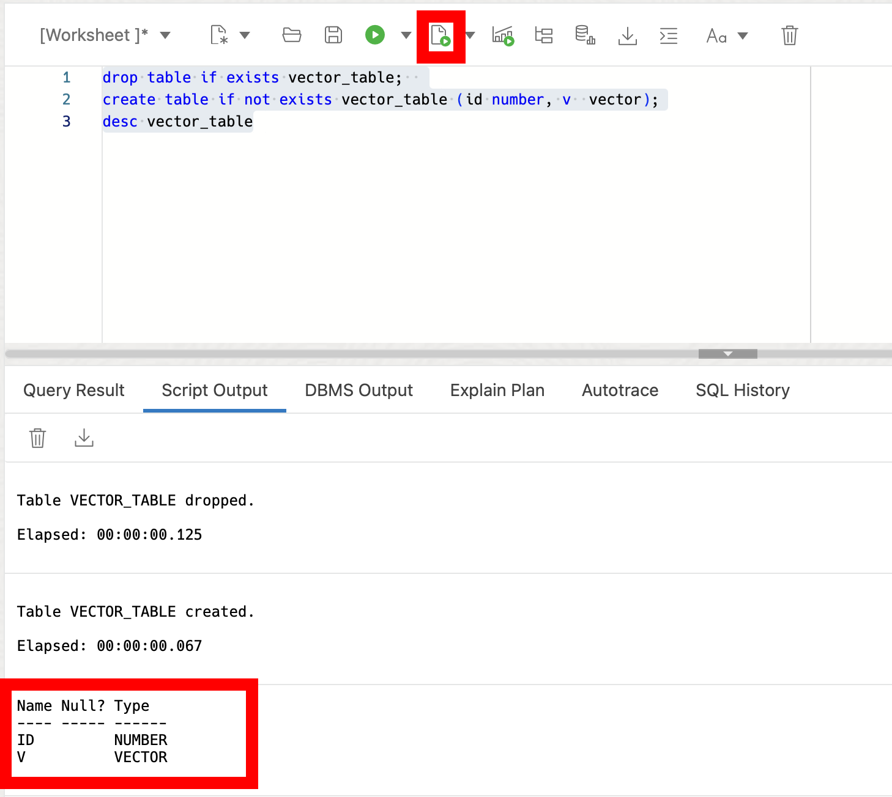
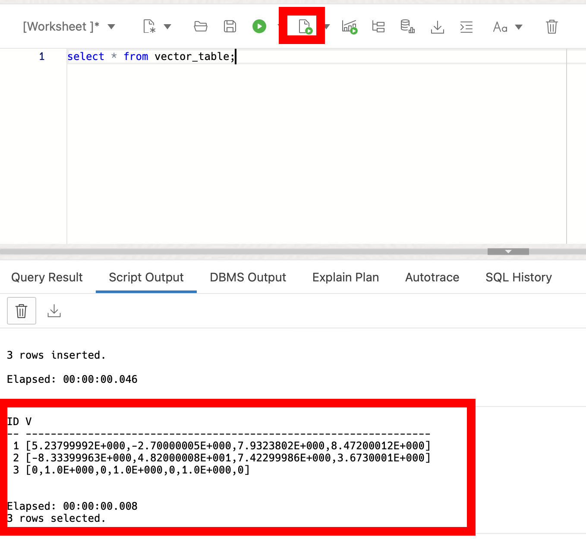
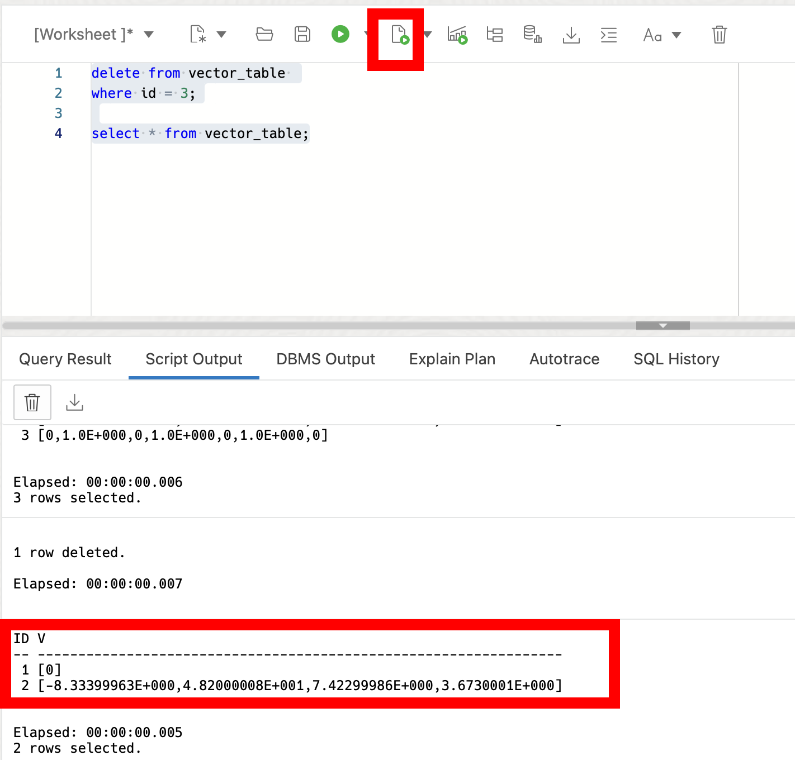
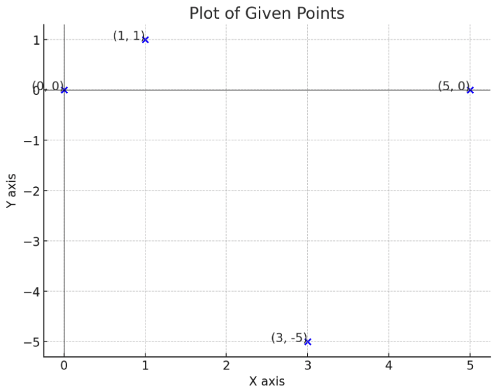
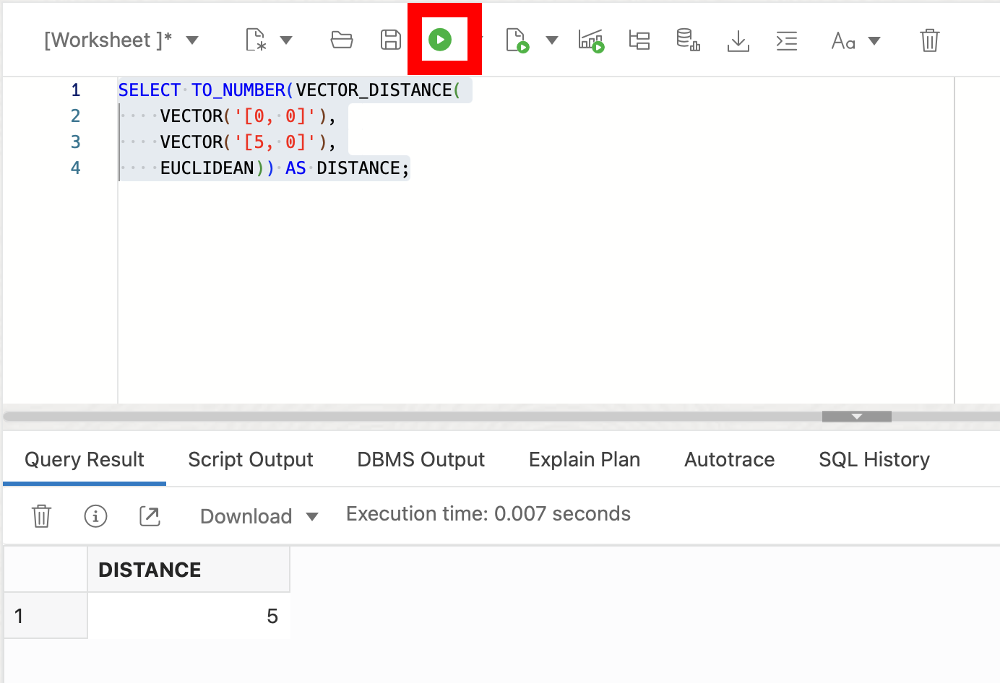
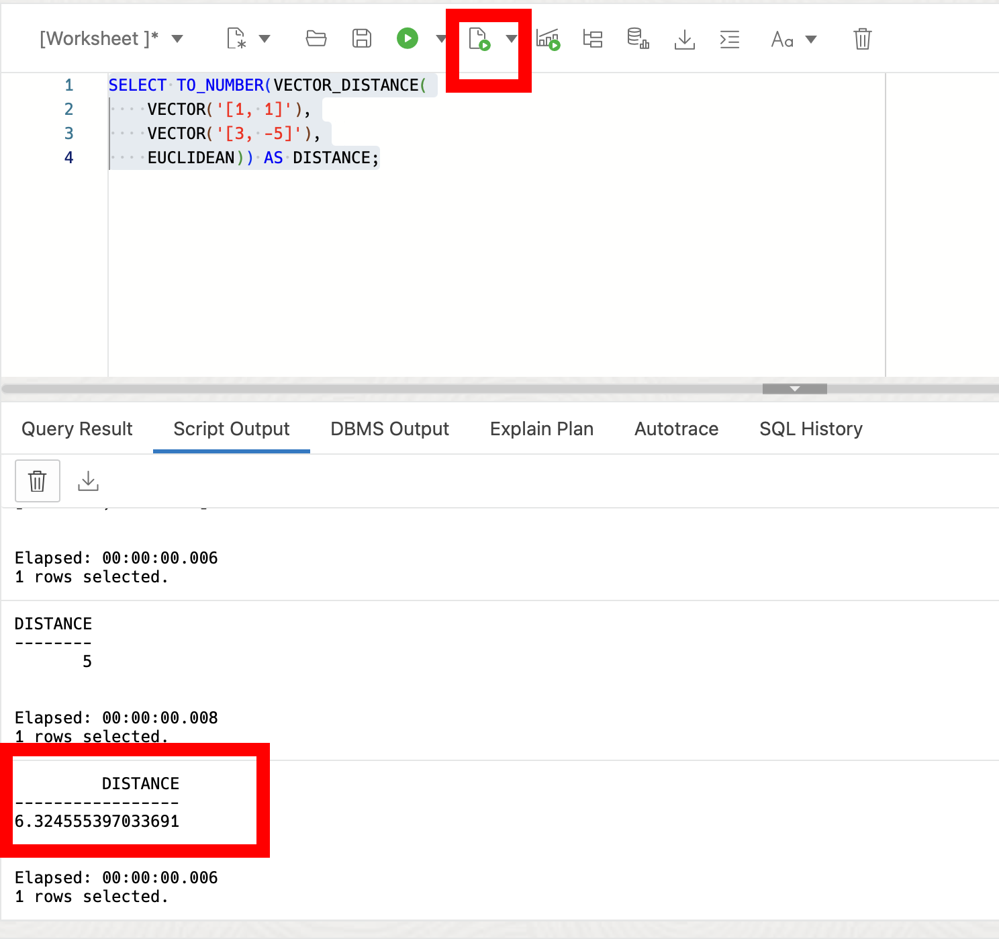
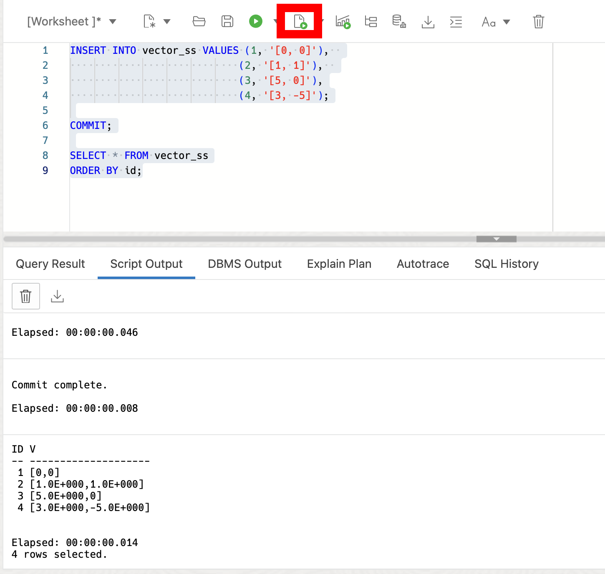
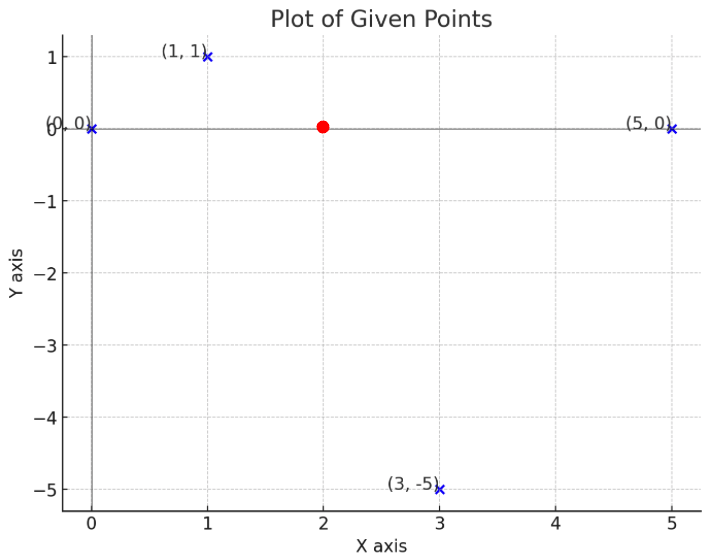
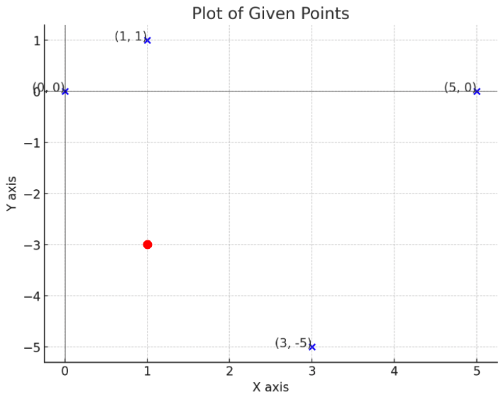

# Exploring AI Vector Search

## Introduction

Welcome to the "Exploring AI Vector Search" workshop. In this workshop, you will learn about what vectors are and how they are used in AI applications. We will cover the creation of vector tables, perform basic DDL operations, and dive into similarity search using some of the new SQL functions in Oracle Database 23ai. This lab is meant to be a small introduction into the new AI functionality that Oracle Database 23ai supports.

This lab will focus on AI Vector search at a very high level. If you're looking for an in depth workshop on AI Vector Search, check out the following labs:
* [Complete RAG Application using PL/SQL in Oracle Database 23ai](https://apexapps.oracle.com/pls/apex/r/dbpm/livelabs/view-workshop?wid=3934&clear=RR,180&session=1859311324732)
* [7 Easy Steps to Building a RAG Application using LangChain](https://apexapps.oracle.com/pls/apex/r/dbpm/livelabs/view-workshop?wid=3927&clear=RR,180&session=1859311324732)
* [Using Vector Embedding Models with Python](https://apexapps.oracle.com/pls/apex/r/dbpm/livelabs/view-workshop?wid=3928&clear=RR,180&session=1859311324732)
* [Using Vector Embedding Models with Nodejs](https://apexapps.oracle.com/pls/apex/r/dbpm/livelabs/view-workshop?wid=3926&clear=RR,180&session=1859311324732)

Estimated Lab Time: 20 minutes

### Objective:
In this lab, you will explore the new vector data type introduced in Oracle Database 23ai. You will create a vector table and perform basic DDL against the vector. You will also work with similarity search on the vectors using some of the new SQL functions in the database.

### Prerequisites:
- Access to Oracle Database 23ai environment.
- Basic understanding of SQL and PL/SQL.

## Task 1: Creating a vector table
1. The first thing we'll do is create a table with the new vector data type and take a look at it.

    ```
    <copy>
    drop table if exists vector_table;  
    create table if not exists vector_table (id number, v  vector);
    desc vector_table
    </copy>
    ```
    

    Nothing crazy here. Just the new vector data type in the oracle database!

2. Before we add data, let's understand what vectors are (mathematically) and how they relate to Generative AI.

    Vectors are simply an array of numbers. Mathematically, a vector is an object that has both magnitude and direction (think of an arrow plotted on a graph). In generative AI, vectors represent the semantic meaning of objects, like pictures, documents, audio files, or other large unstructured objects. 

    How do we get vectors?
    Vectors are created by 'processing' your large unstructured objects through an embedding model. The models transform or 'embed' the data into numerical representations (vectors) that represent the semantic meaning of the original object.

    

    Okay, so what?
    At a high level, vectors are what these large language models use under the covers. Through the storage of vectors in the Oracle database you can create countless applications that utilize generative AI capabilities. The following diagram shows a VERY high level overview of how you would create an chatbot application that can use an LLM in combination with private company data, to answer questions specific to YOUR data. This process is called Retrieval Augmented Generation, or RAG. 

    
    
    We aren't going to cover RAG in this lab. If you're interested in that, checkout this free sandbox environment and build a [RAG Application](https://apexapps.oracle.com/pls/apex/r/dbpm/livelabs/view-workshop?wid=3934&clear=RR,180&session=1859311324732).

3. In this task we're going to be focusing more on the vector datatype. Lets add some data to our vector table.

    ```
    <copy>
    insert into vector_table values (1, '[5.238, -2.7, 7.93238, 8.472]'),
                      (2, '[-8.334, 48.20, 7.423, 3.673]'),
                      (3, '[0, 1, 0, 1, 0, 1, 0]');
    </copy>
    ```

4. We can query our table and see the data we just inserted.

    ```
    <copy>
    select * from vector_table;
    </copy>
    ```
    

5. We can also use regular DDL. For example, run the following to update one of our vectors.

    ```
    <copy>
    update vector_table 
    set v = '[0]'
    where id = 1;

    select * from vector_table;
    </copy>
    ```
    

6. We can also delete rows with vectors. Run the following to remove a vector.
    ```
    <copy>
    delete from vector_table 
    where id = 3;

    select * from vector_table;
    </copy>
    ```
    

## Task 2. Vector dimensionality and formats
1. In this task we're going to take a look at what vector dimensionality is, how we format it, and why we care.

    What is dimensionality?
    This is going to be a very simple example. Dimensionality is the 'plane' in which something exists. For example, we exists in a world of three dimensions. Everything we interact with has three dimension. They are height, length, and width. 

    How does this relate to Generative AI?
    Remember the diagrams above showing the vectors that get created when we pass our unstructured objects through an embedding model? Each model creates the vectors with a different number of dimensions. For example, a vector [1, 2, 3, 4, 5, 6] has 6 dimension. 

    Different embedding models create different a different number of vectors. Here are some common ones:
    * OpenAI has a handful of embedding models.
        * text-embedding-3-small - dimensions or 'length' of vector is 1536
        * text-embedding-3-large - dimensions or 'length' of vector is 3072

    The Oracle Database currently allows you to use up to **64K dimensions** when storing vectors. 
    
2. You can optionally define the number of dimensions when creating a table. You can also define the number format of the vector. Lets check this out.

    ```
    <copy>
    drop table if exists vector_table_2;  
    create table if not exists vector_table_2 (id number, v  vector(3, float32));
    </copy>
    ```
    Here we are saying we want vectors with 3 dimensions and of format float32. 

3. Lets add some data
    ```
    <copy>
    insert into vector_table_2 values (1, '[0, 1, 2]'),
                    (2, '[3, 4, 5]'),
                    (3, '[6, 7, 8]');

    select * from vector_table_2;
    </copy>
    ```
    

4. Now lets take a look what happens if we try and add a vector that has more or less than 3 dimension. Hint, we'll see an error.

    ```
    <copy>
    insert into vector_table_2 values (4, '[1, 0, 1, 0]');
    </copy>
    ```
    

    By defining the number of dimensions, we are effetely creating a check constraint.

5. We could also create multiple vectors in one table and define them with different formats and dimensions.
    
    ```
    <copy>
    CREATE TABLE IF NOT EXISTS vector_table_3
            (v1       VECTOR(3, float64),
            v2        VECTOR(3072, *),
            v3        VECTOR(*, float32),
            v4        VECTOR(*, *),
            v5        VECTOR
            );

    desc vector_table_3;
    </copy>
    ```
## Task 3: Vectors and Similarity Search
1. Now that we've looked at vectors and their dimensions, let's learn a bit about similarity search and its role in generative AI.

    What is Similarity Search?
    Similarity search is the process of finding items that are similar to a given query item (hence the name). Think of it as trying to find items in a database that closely resemble a specific object, based on their vector representations. For example, similarity search can help identify products, documents, or customer profiles that closely match a given query.

    How Does Similarity Search Work?
    * Vectors: Remember how we looked at how vectors represent the semantic meaning of objects? When we embed our data (like text, images, or audio) into vectors, each object gets a unique numerical representation (a vector).

    * Finding Similarity: Once we have these vectors, we need a way to measure how similar they are. This is typically done using mathematical metrics like cosine similarity or Euclidean distance (we'll do this in the example below). This helps us determine how close or far apart two vectors are in the high-dimensional space.

    * Retrieving Similar Items: Using these similarity metrics, we can query our database to find vectors that are closest to our query vector. The closer the vectors, the more similar the objects they represent.

    Okay, so what can we do with similar objects?
    Similarity search plays a pivotal role in many applications of generative AI, enhancing functionality and efficiency. Here are some key reasons why it's important:

    * Enhanced Retrieval: By finding similar items quickly, we can provide more relevant results to user queries. This is crucial in applications like search engines, recommendation systems, and personalized content delivery.

    * Efficient Data Use: Instead of processing every single item from scratch, similarity search allows us to leverage existing data. This saves time and computational resources, making our systems more efficient.

    * Improved User Experience: Providing users with content or products that closely match their interests or needs improves satisfaction and engagement. Think of recommending movies on Netflix or products on Amazon.

    Lets take a look at this.

2. Vectors can be created directly in SQL using the VECTOR() constructor, we'll use this to show a basic example. Here are some examples of two-dimensional vectors:

    ```
    <copy>
    SELECT VECTOR('[0, 0]');
    SELECT VECTOR('[1, 1]');
    SELECT VECTOR('[5, 0]');
    SELECT VECTOR('[3, -5]');
    </copy>
    ```
    

    This is what those vectors would look like graphed.

3. The VECTOR_DISTANCE() function calculates the distance between two vectors. For example, the distance between (0,0) and (5,0) is 5. Use the following query to calculate this distance:

    ```
    <copy>
    SELECT TO_NUMBER(VECTOR_DISTANCE(
        VECTOR('[0, 0]'),
        VECTOR('[5, 0]'),
        EUCLIDEAN)) AS DISTANCE;
    </copy>
    ```
    

4. How about from (1,1) and (3, -5)?
    ```
    <copy>
    SELECT TO_NUMBER(VECTOR_DISTANCE(
        VECTOR('[1, 1]'),
        VECTOR('[3, -5]'),
        EUCLIDEAN)) AS DISTANCE;
    </copy>
    ```
    

5. Now lets table a look at performing similarity search between multiple different vectors. In Similarity Search, we don't focus on the actual distance between two vectors. Instead, we care about the result set, which is a list of vectors ordered by their distance from a given input/query vector. The exact distances aren't important. **What matters is how close each vector is relative to the others in the list.**

6. Lets create a table and store the vectors from the image above.
    ```
    <copy>
    CREATE TABLE IF NOT EXISTS vector_ss
         (id   NUMBER,
          v    VECTOR(2, FLOAT32)
         );
    </copy>
    ```

7. lets insert our simple example vectors.

    ```
    <copy>
    INSERT INTO vector_ss VALUES (1, '[0, 0]'),  
                                (2, '[1, 1]'),  
                                (3, '[5, 0]'),
                                (4, '[3, -5]');

    COMMIT;

    SELECT * FROM vector_ss
    ORDER BY id;
    </copy>
    ```
    

8. Now imagine we add a point at (1,0), like the image below. lets find the closest vectors to that given vector. Remember, we're not interested in the distances. We care about the ids of the rows that're closest to our point.

    

    ```
    <copy>
    SELECT id
    FROM   vector_ss
    ORDER  BY  vector_distance(vector('[2, 0]'), v, EUCLIDEAN)
    FETCH FIRST 3 ROWS ONLY;
    </copy>
    ```
    

9. What if we moved this. Find the closest to the vector (1, -3). 

    

    ```
    <copy>
    SELECT id
    FROM   vector_ss
    ORDER  BY  vector_distance(vector('[1, -3]'), v, EUCLIDEAN)
    FETCH FIRST 3 ROWS ONLY;
    </copy>
    ```
    


10. These are very basic use cases as this lab is meant to be a small introductory to the topic.

    We have been using the vector_distance() function with the Euclidean Squared Vector distance method. However, Oracle AI Vector Search also allows the use of other distance functions:
    * Cosine Similarity
    * Dot Product
    * Manhattan Distance
    * Hamming Distance

    The vector_distance() function uses Cosine Similarity as the default distance function. However, we can choose the function we want to use. We could picked any of the functions from above. 

    In addition, Oracle provides the following shorthand distance operators in lieu of their corresponding distance functions:
    *  <-> is the Euclidean distance operator: expr1 <-> expr2 is equivalent to L2\_DISTANCE(expr1, expr2) or VECTOR\_DISTANCE(expr1, expr2, EUCLIDEAN)
    * <=> is the cosine distance operator: expr1 <=> expr2 is equivalent to COSINE\_DISTANCE(expr1, expr2) or VECTOR\_DISTANCE(expr1, expr2, COSINE)
    * <#> is the negative dot product operator: expr1 <#> expr2 is equivalent to -1*INNER\_PRODUCT(expr1, expr2) or VECTOR\_DISTANCE(expr1, expr2, DOT)

    Chapter 6 of the [AI Vector Search User Guide](https://docs.oracle.com/en/database/oracle/oracle-database/23/vecse/oracle-ai-vector-search-users-guide.pdf) shows more about each of the functions and which to pick depending on what you're trying to achieve.

11. Okay, so what?

    Lets me give a Real-World Example: Lets say we want to build a Chatbot with RAG
    To understand how this would world, let’s look at how similarity search is used in creating a chatbot using Retrieval Augmented Generation (RAG). Here’s a high-level overview:

    Embedding Your Data: First, we embed our company's private data (like documents, FAQs, etc.) into vectors using an embedding model.

    Query Processing: When a user asks the chatbot a question, this query is also converted into a vector.

    Similarity Search: The chatbot uses similarity search to find vectors in the database that are closest to the query vector. This helps in identifying the most relevant pieces of information related to the user's question.

    Generating a Response: The chatbot combines the retrieved information with its generative capabilities to craft a precise and contextually relevant response.

    By using similarity search, we ensure that the chatbot can quickly and accurately access relevant information from a vast pool of data, providing users with answers that are both precise and informative.

    Interested in building a chatbot using the Oracle Database? Check out this lab - [Complete RAG Application using PL/SQL in Oracle Database 23ai](https://apexapps.oracle.com/pls/apex/r/dbpm/livelabs/view-workshop?wid=3934&clear=RR,180&session=1859311324732)


12. The following lab walked you through a tiny example of how to work with some of the new AI functionality in the database. 

    In this lab, we learned the role vectors play in Generative AI (GenAI) by exploring AI Vector Search within the Oracle Database 23ai environment. Vectors are mathematical objects, essentially arrays of numbers, that represent the semantic meaning of large unstructured objects like text, images, and audio. These vectors are generated by embedding models that transform the data into numerical representations.

    We started by creating tables with the new vector data type and performed basic operations like inserting, updating, and deleting vector data. This demonstrated how vectors are stored and manipulated within the Oracle database.

    Next, we examined vector dimensionality and formats, understanding that vectors can have different lengths and data formats depending on the embedding model used. We also learned how to define and enforce these properties when creating vector tables.

    Finally, we explored similarity search, which is a method to find objects that are semantically similar based on their vector representations. This technique is essential for applications like recommendation systems, personalization, pattern recognition, and anomaly detection. By using the VECTOR_DISTANCE function, we performed similarity searches to find the closest vectors to a given query vector.

    Overall, this lab provided a foundational understanding of vectors in AI and how they enable advanced AI functionalities such as semantic search and retrieval-augmented generation within Oracle Database 23ai.


13. As mentioned throughout, this lab is a tiny subset of this functionality. For more in depth labs, please see the following workshops (also linked at the start of this lab):

    * [7 Easy Steps to Building a RAG Application using LangChain](https://apexapps.oracle.com/pls/apex/r/dbpm/livelabs/view-workshop?wid=3927&clear=RR,180&session=1859311324732)
    * [Using Vector Embedding Models with Python](https://apexapps.oracle.com/pls/apex/r/dbpm/livelabs/view-workshop?wid=3928&clear=RR,180&session=1859311324732)
    * [Using Vector Embedding Models with Nodejs](https://apexapps.oracle.com/pls/apex/r/dbpm/livelabs/view-workshop?wid=3926&clear=RR,180&session=1859311324732)

14. We can clean up from the lab by dropping our tables.

    ```
    <copy>
    DROP TABLE if exists vector_ss CASCADE CONSTRAINTS;
    DROP TABLE if exists vector_table CASCADE CONSTRAINTS;
    DROP TABLE if exists vector_table_2 CASCADE CONSTRAINTS;
    DROP TABLE if exists vector_table_3 CASCADE CONSTRAINTS;
    </copy>
    ```
You may now **proceed to the next lab** 

## Learn More

* [AI Vector Search User Guide](https://docs.oracle.com/en/database/oracle/oracle-database/23/vecse/oracle-ai-vector-search-users-guide.pdf)
* [23ai Release notes](https://docs.oracle.com/en/database/oracle/oracle-database/23/rnrdm/index.html)

## Acknowledgements
* **Author** - Killian Lynch, Database Product Management
* **Contributors** - Dom Giles, Distinguished Database Product Manager
* **Last Updated By/Date** - Killian Lynch, April 2024