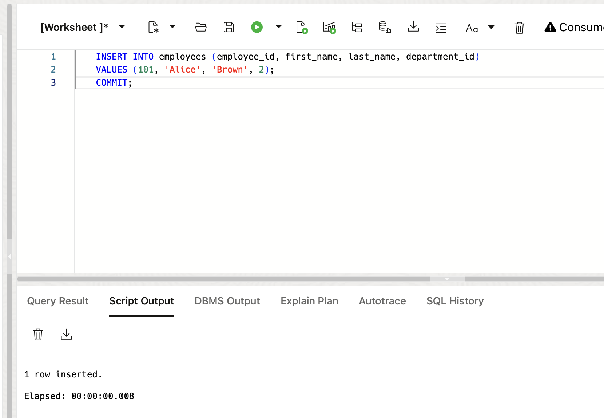
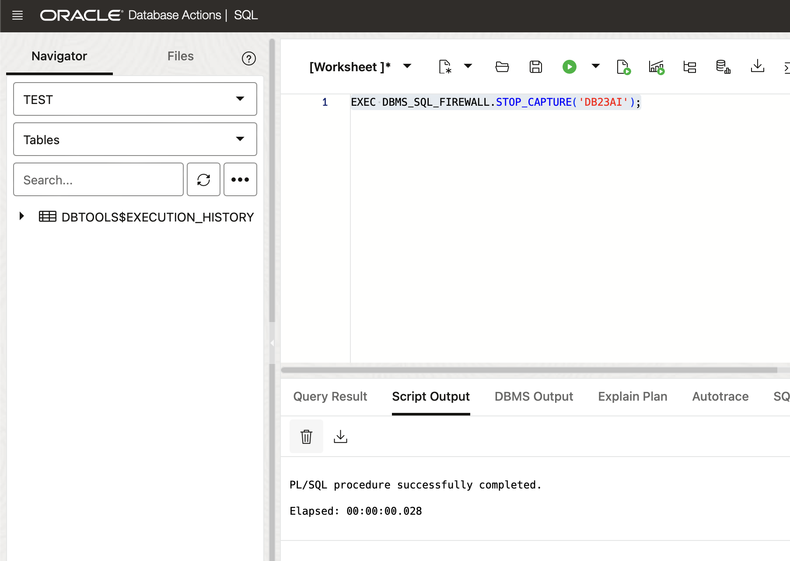
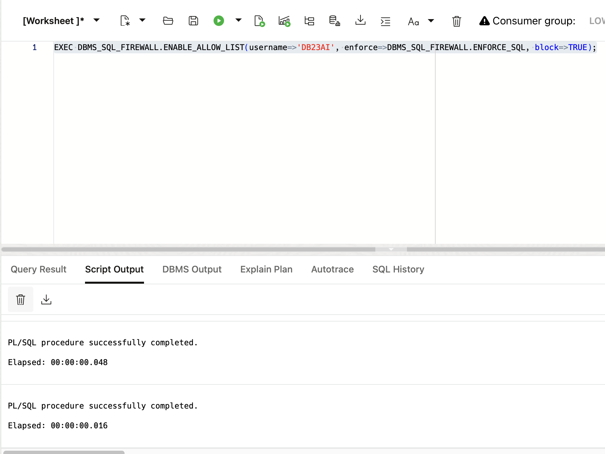
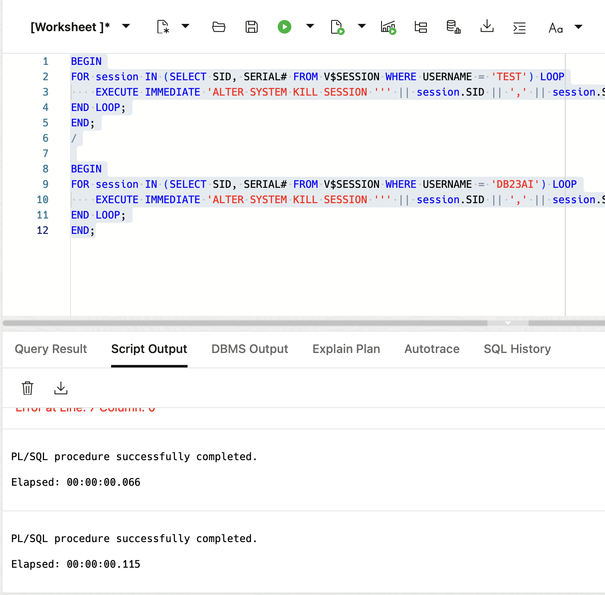

# Exploring SQL Firewall in Oracle Database 23ai

## Introduction

Welcome to the "Exploring SQL Firewall in Oracle Database 23ai" workshop. In this workshop, you will learn about the SQL Firewall feature introduced in Oracle Database 23ai, which provides real-time protection against common database attacks by monitoring and blocking unauthorized SQL and SQL injection attempts. By the end of this workshop, you will be able to configure and use the SQL Firewall to enhance the security of your database applications. **This lab is a very high level overview of SQL Firewall and does not show all of SQL Firewalls capabilities. For a comprehensive SQL Firewall workshop please try the following lab:**

[SQL Firewall LiveLab](https://apexapps.oracle.com/pls/apex/r/dbpm/livelabs/view-workshop?wid=3875)

Estimated Lab Time: 20 minutes

### Objective:
The objective of this workshop is to familiarize you with the SQL Firewall feature in Oracle Database 23ai. You will learn how to enable the firewall, capture and allow authorized SQL statements, enforce security policies based on SQL and environmental contexts, and monitor for violations. Please note, this lab is meant to teach you how SQL Firewall works at a very high level. If you would like to see a full SQL Firewall workshop, please check the lab above.

### Prerequisites:
- Access to Oracle Database 23ai environment.
- Basic understanding of SQL.

## Task 1: Enabling SQL Firewall

1. From the Autonomous Database home page, **click** Database action and then **click** SQL.
    

2. For this lab we'll need another user - lets create it now. 
    
    Notice that I'm giving this user the admin privies on the SQL Firewall role. This is so that we can create an allow lists and enable SQL firewall on the test user without having to switch between users constantly. **This is for demo purposes only.** This is just an example to teach you some high level aspects of SQL Firewall.

    ```
    <copy>
    -- USER SQL
    CREATE USER TEST IDENTIFIED BY Oracle123long;

    -- ADD ROLES
    GRANT CONNECT TO TEST;
    GRANT DB_DEVELOPER_ROLE TO TEST;
    GRANT RESOURCE TO TEST;
    GRANT SQL_FIREWALL_ADMIN TO TEST;
    GRANT SQL_FIREWALL_VIEWER TO TEST;
    GRANT DB_DEVELOPER_ROLE TO TEST WITH ADMIN OPTION;
    GRANT SQL_FIREWALL_ADMIN TO TEST WITH ADMIN OPTION;
    GRANT SQL_FIREWALL_VIEWER TO TEST WITH ADMIN OPTION;


    -- REST ENABLE
    BEGIN
        ORDS_ADMIN.ENABLE_SCHEMA(
            p_enabled => TRUE,
            p_schema => 'TEST',
            p_url_mapping_type => 'BASE_PATH',
            p_url_mapping_pattern => 'TEST',
            p_auto_rest_auth=> TRUE
        );
        -- ENABLE DATA SHARING
        C##ADP$SERVICE.DBMS_SHARE.ENABLE_SCHEMA(
                SCHEMA_NAME => 'TEST',
                ENABLED => TRUE
        );
        commit;
    END;
    /

    -- QUOTA
    ALTER USER TEST QUOTA 100M ON DATA;
    </copy>
    ```
    


3. Now click the hamburger menu on Database actions and select Database Users.
    

4. Scroll down to find the test user and launch the Database Actions page by clicking the the **Open URL in a new tab** button as shown below.

    

5. Sign in to the test user we created. 
    * Username is Test 
    * Password is Oracle123long

    

6. Click the Hamburger menu and select SQL. See the picture below. 

    


7. Typically you would not enable SQL Firewall roles for yourself as the same user. This is just for demo purposes to avoid switching back and forth between users. 
    
    Enable the SQL Firewall using the following PL/SQL command:

    ```
    <copy>
    EXEC DBMS_SQL_FIREWALL.ENABLE;
    </copy>
    ```
    

8. Lets create some users and data first. Run the SQL as a **Script**

    ```
    <copy>
    DROP TABLE IF EXISTS EMPLOYEES CASCADE CONSTRAINTS;
    DROP TABLE IF EXISTS DEPARTMENTS CASCADE CONSTRAINTS;

    -- Create a table to store employee data
    CREATE TABLE employees (
        employee_id INT,
        first_name VARCHAR(50),
        last_name VARCHAR(50),
        department_id INT
    );

    -- Create a table to store department data
    CREATE TABLE departments (
        department_id INT,
        department_name VARCHAR(50)
    );

    -- Insert sample data into the departments table
    INSERT INTO departments (department_id, department_name)
    VALUES
        (1, 'HR'),
        (2, 'IT'),
        (3, 'Finance');
    </copy>
    ```
    

9. Enable SQL Firewall to learn and capture the normal SQL traffic of the database users. This involves running SQL commands as the users you wish to protect.


    ```
    <copy>
    BEGIN
        DBMS_SQL_FIREWALL.CREATE_CAPTURE(
            username => 'TEST',
            top_level_only => FALSE,
            start_capture => TRUE
        );
    END;
    /
    </copy>
    ```
    
 

10. Perform typical SQL operations as the 'HR' user to capture the normal activities. Run the SQL as a **Script**
    ```
    <copy>
    SELECT * FROM DEPARTMENTS;
    INSERT INTO employees (employee_id, first_name, last_name, department_id)
    VALUES (101, 'Alice', 'Brown', 2);
    COMMIT;
    </copy>
    ```
    

11. We'll go ahead and stop the capture now. Normally you would stop capturing once all activities are recorded.
    ```
    <copy>
    exec DBMS_SQL_FIREWALL.STOP_CAPTURE('TEST');
    </copy>
    ```
    

## Task 2: Reviewing Captured Data

1. Query the SQL Firewall-specific data dictionary views to review the captured data.

    ```
    <copy>
    SELECT sql_text
    FROM DBA_SQL_FIREWALL_CAPTURE_LOGS
    WHERE username = 'TEST';
    </copy>
    ```
    

2. First lets check the allow list. It will be empty.

    ```
    <copy>
    SELECT sql_text
    FROM DBA_SQL_FIREWALL_ALLOWED_SQL
    WHERE username = 'TEST';
    </copy>
    ```
    

3. For this small demo, we'll turn our capture logs into our allow list. This is where you'd want to customize it yourself in a production system.

    ```
    <copy>
    exec DBMS_SQL_FIREWALL.GENERATE_ALLOW_LIST('TEST');
    </copy>
    ```
    

4. Again, typically you would not enable SQL Firewall for yourself as that user. This is just for demo purposes to keep from switching back and forth between users constantly. 
    
    Now we can enable SQL firewall so only SQL from our allow list can hit the database. 

    ```
    <copy>
    exec DBMS_SQL_FIREWALL.ENABLE_ALLOW_LIST(username=>'TEST', enforce=>DBMS_SQL_FIREWALL.ENFORCE_SQL, block=>TRUE);
    </copy>
    ```
    

5. Now we can try and select a statement not in our allow list. We will get **SQL Firewall violation**

    ```
    <copy>
    select * from departments;
    </copy>
    ```
    

## Task 3: Clean up

1. Sign back in with the **admin** user. 

    This is the password you used to create autonomous database. If you cant remember your password navigate to the Autonomous Database home page, **click** Database action and then **click** SQL.

    

    If you cant remember your password navigate to the Autonomous Database home page, **click** Database action and then **click** SQL.

    

2. We'll kill any active session created by our TEST user and then drop the user.

    ```
    <copy>
    BEGIN
    FOR session IN (SELECT SID, SERIAL# FROM V$SESSION WHERE USERNAME = 'TEST') LOOP
        EXECUTE IMMEDIATE 'ALTER SYSTEM KILL SESSION ''' || session.SID || ',' || session.SERIAL# || ''' IMMEDIATE';
    END LOOP;
    END;
    </copy>
    ```
    

3. Now click the hamburger menu on Database actions and select Database Users.
    

4. We can do this with the Database Actions user management page. 
    
    Click on the hamburger menu in the top left of the screen, scroll down and click the three dots by the `TEST` user and select **delete**. See the picture below.

    


5. Enable both sliders and drop the user.

    

You may now **proceed to the next lab** 


## Learn More

* [SQL Firewall documentation](https://docs.oracle.com/en/database/oracle/oracle-database/23/dbseg/using-oracle-sql-firewall.html#GUID-AFC076FE-7E96-464D-B634-593902CB4179)
* [SQL Firewall LiveLab](https://apexapps.oracle.com/pls/apex/r/dbpm/livelabs/view-workshop?wid=3875)

## Acknowledgements
* **Author** - Killian Lynch, Database Product Management
* **Contributors** - Dom Giles, Distinguished Database Product Manager
* **Last Updated By/Date** - Killian Lynch, April 2024
